## Slide 1: Introduction
**DADM - Decision Analysis and Decision Management**

DADM is an enterprise-grade platform that transforms how organizations make complex decisions by combining business process management, artificial intelligence, and advanced data analytics into a unified workflow system.

- Enterprise platform for intelligent decision workflows
- Combines BPM, AI, and Graph Database technologies  
- Automates complex organizational decision processes
- Provides audit trails and decision traceability
- Used for emergency planning, technology selection, strategic decisions

---

## Slide 2: Core Value Proposition
**Why DADM Matters**

Organizations face increasingly complex decisions that require multiple data sources, stakeholder input, and consistent methodology. DADM addresses these challenges by providing a structured, intelligent approach to decision-making.

- **Consistency**: Standardized decision methodology across organization
- **Intelligence**: AI-powered analysis and recommendations
- **Traceability**: Complete audit trail of decision factors and rationale
- **Efficiency**: Reduces decision time while improving quality
- **Scalability**: Handles simple choices to complex multi-stakeholder decisions

---

## Slide 3: Key Features Overview
**Platform Capabilities**

DADM delivers comprehensive decision support through an integrated suite of capabilities designed for enterprise environments, from workflow modeling to AI-powered analysis.

- **BPMN Workflows**: Visual process modeling with industry standards
- **🎼 Service Orchestrator**: Central hub routing all microservice communications
- **AI Integration**: OpenAI GPT-4 for intelligent analysis and recommendations  
- **Data Management**: Vector search, graph relationships, structured storage
- **Analysis Tracking**: Task-level capture with rich querying and filtering
- **Microservices**: Scalable, containerized architecture
- **Enterprise Ready**: Docker deployment, monitoring, health checks

---

## Slide 4: Real-World Use Cases
**Practical Applications**

DADM has been successfully applied across diverse organizational contexts, from emergency response to strategic planning, demonstrating its versatility and practical value.

- **Emergency Response**: Equipment selection for disaster scenarios
- **Technology Investment**: Cloud platform evaluation and selection
- **Strategic Planning**: Market expansion and resource allocation
- **Compliance**: Regulatory review and risk assessment
- **Supply Chain**: Vendor evaluation and portfolio optimization

---

## Slide 5: Architecture Overview
**Technical Foundation**

DADM's architecture follows microservices principles with a central orchestrator managing communication between specialized services, ensuring scalability and maintainability.

**Simplified Architecture:**

```mermaid
graph LR
    UI[User Interface] --> Orchestrator[🎼 Service Orchestrator]
    Orchestrator --> Camunda[Process Engine]
    Orchestrator --> OpenAI[AI Services]
    Orchestrator --> Data[(Data Layer)]
    
    style Orchestrator fill:#fff3e0,stroke:#ff9800,stroke-width:2px
    style Camunda fill:#e1f5fe
    style OpenAI fill:#e8f5e8
    style Data fill:#f3e5f5
```


- **Process Engine**: Camunda BPMN with PostgreSQL persistence
- **🎼 Service Orchestrator**: Central hub routing all microservice communications
- **AI Services**: OpenAI Assistant with conversation persistence
- **Data Layer**: Vector (Qdrant), Graph (Neo4j), Relational (SQLite/PostgreSQL)
- **Service Discovery**: Consul registry with automatic failover
- **Deployment**: Docker Compose with health monitoring

---

## Slide 6: Service Example - OpenAI Integration
**API Endpoints and Usage**

The OpenAI service demonstrates DADM's microservice approach with clean REST APIs that support complex decision analysis workflows.

**Service Endpoints:**
```
POST /openai/assistant/create
POST /openai/assistant/{id}/message
GET  /openai/assistant/{id}/status
POST /openai/files/upload
GET  /openai/files/{id}
```

**Example Request:**
```json
{
  "message": "Analyze supplier options for emergency equipment",
  "context": {
    "budget": 50000,
    "timeline": "30 days",
    "requirements": ["FDA approved", "rapid deployment"]
  }
}
```

**Response includes:** Analysis, recommendations, confidence scores, and supporting rationale

---

## Slide 7: Business Benefits
**Organizational Impact**

DADM delivers measurable improvements in decision quality and organizational efficiency while building institutional knowledge and ensuring compliance requirements are met.

- **Quality Improvement**: Consistent, well-documented decisions
- **Risk Reduction**: Comprehensive analysis reduces oversight
- **Time Savings**: Automates routine analysis and documentation
- **Knowledge Retention**: Captures institutional decision-making expertise
- **Compliance**: Built-in audit trails and decision justification

---

## Slide 8: Implementation & Deployment
**Getting Started**

DADM is designed for rapid deployment and adoption, with comprehensive tooling and documentation that enables organizations to start small and scale to enterprise-wide usage.

- **Quick Setup**: Single command deployment with Docker
- **Training**: Built-in examples and comprehensive documentation
- **Integration**: REST APIs for existing system connectivity  
- **Support**: Complete CLI tools and monitoring dashboards
- **Scalability**: Start small, scale to enterprise-wide deployment

---

## Slide 9: Technical Readiness
**Production Capabilities**

DADM is built for production environments with comprehensive testing, monitoring, and operational capabilities that ensure reliable performance at enterprise scale.

- **Tested**: Comprehensive unit, integration, and performance testing
- **Monitored**: Health checks, service discovery, automatic recovery
- **Documented**: Complete API documentation and user guides
- **Configurable**: Environment-based configuration for all deployment scenarios
• **Maintainable**: Modular architecture enables independent updates