# DADM Analysis Execution Architecture

## 🎯 **Complete Analysis Pipeline**

```mermaid
graph TD
    A[🔄 BPMN Workflow] --> B[📊 Analysis Service]
    B --> C[📝 Prompt Service]
    B --> D[🤖 LLM Service]
    B --> E[⚙️ Analysis Execution Engine]
    
    E --> F[🐍 Python Analysis Tools]
    E --> G[📈 R Statistical Tools]
    E --> H[🔬 Scilab/Matlab Tools]
    E --> I[📊 Jupyter Notebooks]
    E --> J[🗄️ Data Sources]
    
    E --> K[📋 Result Processor]
    K --> L[📈 Visualization Engine]
    K --> M[📝 Report Generator]
    K --> N[💾 Result Storage]
    
    N --> A
```



## 🏗️ **Analysis Service Architecture (Enhanced)**

### Current Layer: Analysis Template & Prompt Management
- ✅ **Analysis Templates**: Define schemas and instructions
- ✅ **Prompt Integration**: Combines with base prompts from prompt service
- ✅ **LLM Integration**: Sends structured prompts to LLM
- ✅ **Response Validation**: Validates LLM output against schemas

### Missing Layer: Analysis Execution Engine
- ❌ **Tool Integration**: Python, R, Scilab execution environments
- ❌ **Data Processing**: ETL pipelines for analysis data
- ❌ **Computation Engine**: Actual statistical/mathematical analysis
- ❌ **Visualization**: Charts, graphs, reports generation
- ❌ **Result Storage**: Persistent analysis results and history

## 🔄 **Complete BPMN Analysis Workflow**

### Step 1: Analysis Request
```xml
<bpmn:serviceTask id="performMarketAnalysis" name="Market Analysis">
  <bpmn:extensionElements>
    <camunda:inputOutput>
      <!-- Base prompt configuration -->
      <camunda:inputParameter name="prompt_reference">market_research_prompt</camunda:inputParameter>
      
      <!-- Analysis type and tools -->
      <camunda:inputParameter name="analysis_reference">statistical_analysis</camunda:inputParameter>
      <camunda:inputParameter name="execution_tools">["python", "pandas", "matplotlib"]</camunda:inputParameter>
      
      <!-- Data sources -->
      <camunda:inputParameter name="data_sources">{
        "market_data": "s3://data/market_trends.csv",
        "competitor_data": "postgresql://db/competitors",
        "survey_results": "${survey_data_url}"
      }</camunda:inputParameter>
      
      <!-- Analysis parameters -->
      <camunda:inputParameter name="analysis_parameters">{
        "time_period": "last_12_months",
        "confidence_level": 0.95,
        "statistical_tests": ["t_test", "correlation", "regression"]
      }</camunda:inputParameter>
      
      <!-- Output requirements -->
      <camunda:inputParameter name="output_format">interactive_report</camunda:inputParameter>
      <camunda:inputParameter name="visualizations">["trend_charts", "correlation_matrix", "summary_table"]</camunda:inputParameter>
    </camunda:inputOutput>
  </bpmn:extensionElements>
</bpmn:serviceTask>
```

### Step 2: Enhanced Analysis Processing
The analysis service would:

1. **Fetch & Compile Prompt**: Get base prompt from prompt service
2. **Generate Analysis Plan**: LLM creates analysis methodology
3. **Execute Analysis Tools**: Run Python/R/Scilab scripts
4. **Process Results**: Validate and format results
5. **Generate Outputs**: Create visualizations and reports
6. **Store Results**: Save for workflow continuation

## 🛠️ **Analysis Execution Tools Architecture**

### MCP-Like Analysis Servers

```json
{
  "analysis_tools": {
    "python_analysis": {
      "server_url": "http://python-analysis-service:5400",
      "capabilities": ["pandas", "numpy", "scipy", "matplotlib", "seaborn"],
      "supported_formats": ["csv", "json", "parquet", "sql"],
      "execution_environment": "jupyter_kernel"
    },
    "r_statistical": {
      "server_url": "http://r-analysis-service:5401", 
      "capabilities": ["ggplot2", "dplyr", "caret", "forecast"],
      "supported_formats": ["csv", "rdata", "json"],
      "execution_environment": "r_kernel"
    },
    "scilab_engineering": {
      "server_url": "http://scilab-service:5402",
      "capabilities": ["signal_processing", "control_systems", "optimization"],
      "supported_formats": ["mat", "csv", "binary"],
      "execution_environment": "scilab_kernel"
    }
  }
}
```

## 📊 **Example: Complete Market Analysis Flow**

### BPMN Task Request:
```json
{
  "workflow_id": "market_expansion_analysis",
  "analysis_request": {
    "prompt_reference": "market_research_template",
    "analysis_reference": "comprehensive_market_analysis",
    "data_sources": {
      "sales_data": "postgresql://prod/sales_2024",
      "market_trends": "s3://market-data/trends.csv",
      "competitor_analysis": "api://competitor-service/data"
    },
    "analysis_tools": ["python", "pandas", "plotly"],
    "parameters": {
      "regions": ["North America", "Europe"],
      "time_frame": "2024-Q1 to Q3",
      "analysis_depth": "comprehensive"
    }
  }
}
```

### Analysis Service Response:
```json
{
  "execution_id": "analysis_exec_12345",
  "status": "completed",
  "analysis_results": {
    "llm_insights": {
      "key_findings": ["Market growing 15% YoY", "Competition increasing"],
      "recommendations": ["Focus on premium segment", "Expand digital channels"],
      "confidence_score": 0.87
    },
    "statistical_analysis": {
      "correlation_matrix": "base64_encoded_image",
      "trend_analysis": {...},
      "forecast_model": {...}
    },
    "visualizations": {
      "market_trends_chart": "s3://results/charts/trends_12345.html",
      "competitor_positioning": "s3://results/charts/positioning_12345.png"
    },
    "executable_outputs": {
      "jupyter_notebook": "s3://results/notebooks/analysis_12345.ipynb",
      "python_script": "s3://results/scripts/analysis_12345.py",
      "data_files": ["s3://results/data/processed_data_12345.csv"]
    }
  }
}
```

## 🔮 **Next Steps to Implement This**

Would you like me to start building this enhanced architecture? We could:

1. **Create Analysis Execution Service**: Python-based analysis tool integration
2. **Build Jupyter Integration**: Notebook generation and execution
3. **Add Data Source Connectors**: S3, PostgreSQL, API integrations  
4. **Create Visualization Engine**: Chart and report generation
5. **BPMN Workflow Examples**: Real analysis workflows

This would give you the complete "analysis as code" pipeline you're envisioning!
