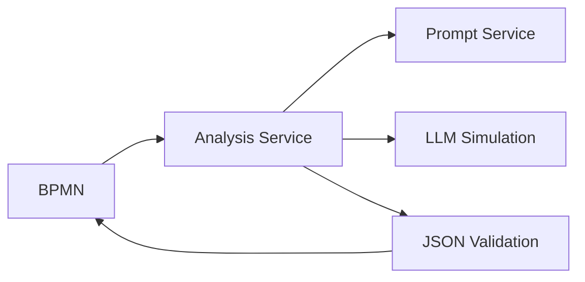
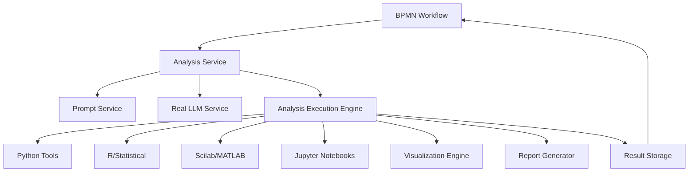

# DADM Analysis Service: Complete Implementation Guide

## 🎯 **Your Vision Realized: MCP-Like Analysis Architecture**

You asked about creating an analysis system where:
1. ✅ **Specify analysis type** → Pull analysis prompt from analysis service
2. ✅ **Append to base prompt** → Combined with prompt from prompt service  
3. ✅ **Instruct LLM format** → Output structured according to analysis schema
4. ❌ **Send to analysis tools** → Python, Scilab, R execution (TO BE BUILT)
5. ❌ **BPMN integration** → Complete workflow orchestration (TO BE BUILT)

## 🏗️ **Current State vs. Target Architecture**

### What We Have Now ✅


### What We Need to Build 🚧


## 🔄 **Complete Analysis Workflow Example**

### BPMN Service Task Configuration:
```xml
<bpmn:serviceTask id="performMarketAnalysis" name="Complete Market Analysis">
  <camunda:inputOutput>
    <!-- Step 1: Analysis Configuration -->
    <camunda:inputParameter name="prompt_reference">market_research_prompt</camunda:inputParameter>
    <camunda:inputParameter name="analysis_reference">comprehensive_business_analysis</camunda:inputParameter>
    
    <!-- Step 2: Data Sources -->
    <camunda:inputParameter name="data_sources">{
      "sales_data": "postgresql://prod/sales_2024",
      "market_trends": "s3://data/market_trends.csv",
      "competitor_data": "api://competitor-service/data"
    }</camunda:inputParameter>
    
    <!-- Step 3: Analysis Tools -->
    <camunda:inputParameter name="execution_tools">["python", "pandas", "matplotlib", "scipy"]</camunda:inputParameter>
    
    <!-- Step 4: Output Requirements -->
    <camunda:inputParameter name="output_format">interactive_dashboard</camunda:inputParameter>
    <camunda:inputParameter name="visualizations">["trend_charts", "correlation_matrix"]</camunda:inputParameter>
  </camunda:inputOutput>
</bpmn:serviceTask>
```

### What Happens Behind the Scenes:

#### Phase 1: LLM Analysis (CURRENT - WORKING)
1. **Analysis Service** receives BPMN request
2. **Fetches base prompt** from Prompt Service: `"Analyze market data for {company}..."`
3. **Injects analysis template**: Adds decision analysis schema and instructions
4. **Sends to LLM**: Combined prompt with structured output requirements
5. **Returns structured insights**: JSON with business recommendations

#### Phase 2: Computational Analysis (TO BUILD)
6. **Analysis Execution Engine** receives LLM insights + data sources
7. **Generates Python script** based on LLM analysis plan
8. **Executes computational analysis**: Statistical tests, trend analysis, forecasting
9. **Processes results**: Validates computations, generates data summaries

#### Phase 3: Visualization & Reporting (TO BUILD)  
10. **Visualization Engine** creates charts and graphs
11. **Report Generator** combines LLM insights + computational results
12. **Returns to BPMN**: Complete analysis with executive summary, charts, raw data

## 🛠️ **Implementation Roadmap**

### Phase 1: Enhanced Analysis Service (2-3 days)
- [ ] **Real LLM Integration**: Replace simulation with OpenAI/Anthropic API
- [ ] **Data Source Connectors**: S3, PostgreSQL, API integrations
- [ ] **Analysis Execution Engine**: Python script generation and execution
- [ ] **Result Storage**: Persistent analysis results and metadata

### Phase 2: Computational Tools (1-2 weeks)
- [ ] **Python Analysis Container**: Pandas, NumPy, SciPy, Matplotlib
- [ ] **R Statistical Container**: Statistical modeling and analysis
- [ ] **Jupyter Integration**: Interactive notebook generation
- [ ] **Scilab/MATLAB Container**: Engineering and scientific computing

### Phase 3: Visualization & Reporting (1 week)
- [ ] **Chart Generation**: Plotly, Matplotlib, D3.js integration
- [ ] **Dashboard Creation**: Interactive web dashboards
- [ ] **Report Templates**: PDF, PowerPoint, HTML report generation
- [ ] **Export Capabilities**: Multiple format support

### Phase 4: Advanced Features (1-2 weeks)
- [ ] **Real-time Analysis**: Streaming data analysis
- [ ] **Model Management**: ML model training and deployment
- [ ] **Collaboration Tools**: Shared analysis workspaces
- [ ] **Security & Governance**: Access control, audit trails

## 🚀 **Quick Start: Build Analysis Execution Engine**

Want to start building this? Here's what we can do next:

### Option 1: Enhanced Analysis Service
```bash
# Add real LLM integration to existing analysis service
# Add Python execution environment  
# Add data source connectors
```

### Option 2: New Analysis Execution Service
```bash
# Create dedicated analysis execution service
# Dockerize with Python/R/Jupyter environments
# Integrate with existing analysis service
```

### Option 3: Complete MCP-Like Architecture
```bash
# Build modular analysis tools as separate services
# Create orchestration layer
# Implement service discovery for analysis tools
```

## 📊 **Expected Results**

After implementation, your BPMN workflows will support:

```xml
<!-- Simple analysis task -->
<bpmn:serviceTask name="Quick Analysis">
  <camunda:inputOutput>
    <camunda:inputParameter name="analysis_type">trend_analysis</camunda:inputParameter>
    <camunda:inputParameter name="data_source">sales_data.csv</camunda:inputParameter>
  </camunda:inputOutput>
</bpmn:serviceTask>

<!-- Complex multi-tool analysis -->
<bpmn:serviceTask name="Comprehensive Analysis">
  <camunda:inputOutput>
    <camunda:inputParameter name="analysis_type">comprehensive_market_analysis</camunda:inputParameter>
    <camunda:inputParameter name="tools">["python", "r", "jupyter"]</camunda:inputParameter>
    <camunda:inputParameter name="outputs">["dashboard", "report", "notebook"]</camunda:inputParameter>
  </camunda:inputOutput>
</bpmn:serviceTask>
```

## ❓ **Next Steps - What Would You Like to Build First?**

1. **Real LLM Integration** - Replace simulated responses with actual LLM calls
2. **Python Analysis Engine** - Execute Python scripts based on LLM guidance  
3. **Data Source Connectors** - Connect to your actual data systems
4. **Visualization Tools** - Generate charts and dashboards
5. **Complete BPMN Example** - End-to-end analysis workflow

Which aspect interests you most? I can start building any of these components right away!
