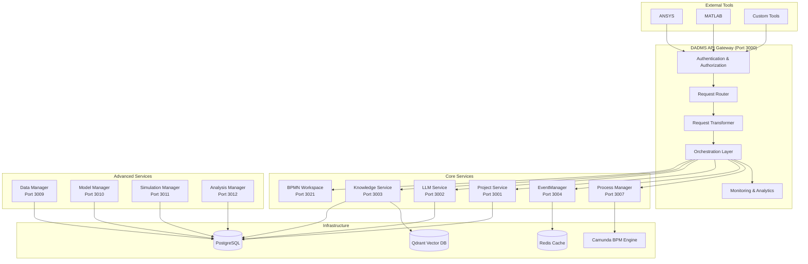
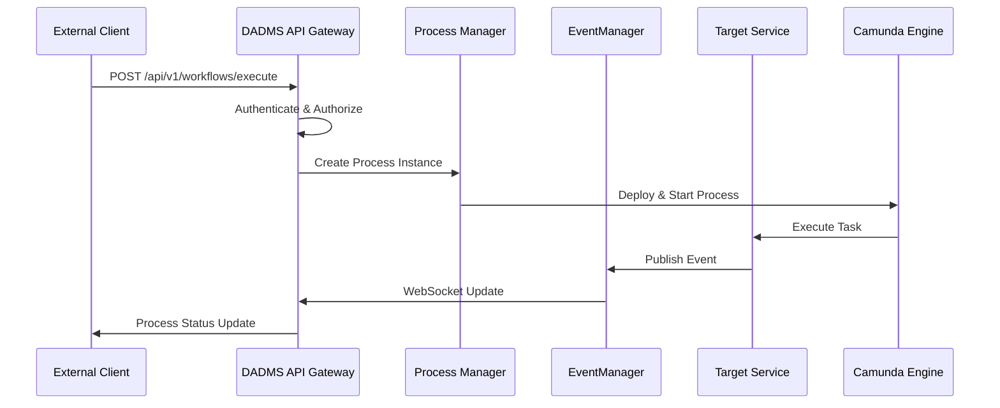
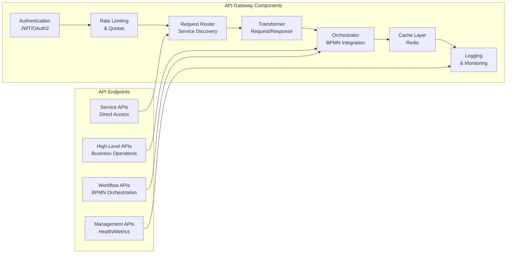
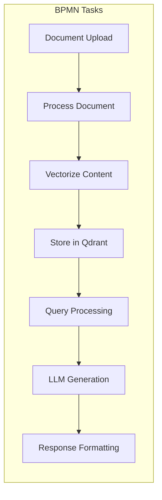
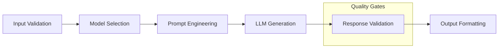
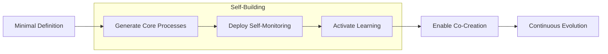

# DADMS 2.0 Backend Implementation & Integration Guide

> ### 🌐 **Ambient Intelligence Architecture**
> This guide describes how to build a system that doesn't just USE AI, but exists WITHIN ambient intelligence - where every service, workflow, and interaction is permeated by the DAS intelligence field.

## Table of Contents
1. [Architecture Overview](#architecture-overview)
2. [API Gateway Architecture](#api-gateway-architecture)
3. [Service Implementation Strategy](#service-implementation-strategy)
4. [BPMN-First Orchestration](#bpmn-first-orchestration)
5. [DAS Integration](#das-integration)
6. [Integration Patterns](#integration-patterns)
7. [Implementation Phases](#implementation-phases)
8. [Potential Challenges & Mitigation](#potential-challenges--mitigation)

---

## Architecture Overview

### High-Level System Architecture



### Service Communication Flow



---

## API Gateway Architecture

### Gateway Service Structure



### API Endpoint Design

```typescript
// High-Level Business Operations
POST /api/v1/rag/query              // Simple RAG workflow
POST /api/v1/llm/generate           // Direct LLM generation
POST /api/v1/simulation/run         // Execute simulation workflow
POST /api/v1/analysis/compare       // Comparative analysis

// Workflow Orchestration
POST /api/v1/workflows/deploy       // Deploy BPMN workflow
POST /api/v1/workflows/execute      // Execute workflow
GET  /api/v1/workflows/{id}         // Get workflow status
GET  /api/v1/workflows/{id}/history // Get execution history

// Service Access (Advanced Users)
GET  /api/v1/services/{service}     // Service health/status
POST /api/v1/services/{service}/{endpoint} // Direct service call

// Management & Monitoring
GET  /api/v1/health                 // System health
GET  /api/v1/metrics                // Performance metrics
POST /api/v1/webhooks               // Webhook registration
```

---

## Service Implementation Strategy

### Phase 1: Foundation Services (Weeks 1-2)

#### 1. Process Manager Service (Port 3007)

**Core Responsibilities:**
- BPMN 2.0 process execution
- Camunda engine integration
- Task management and routing
- Process state management

**Key Components:**
```typescript
// Process Manager Architecture
interface ProcessManager {
  // Process Lifecycle
  deployProcess(bpmnXml: string): Promise<string>;
  startProcess(processId: string, variables: any): Promise<string>;
  getProcessStatus(instanceId: string): Promise<ProcessStatus>;
  
  // Task Management
  getTasks(instanceId: string): Promise<Task[]>;
  completeTask(taskId: string, variables: any): Promise<void>;
  
  // Process Control
  suspendProcess(instanceId: string): Promise<void>;
  resumeProcess(instanceId: string): Promise<void>;
  terminateProcess(instanceId: string): Promise<void>;
}
```

#### 2. EventManager Service (Port 3004)

**Core Responsibilities:**
- Real-time event streaming
- WebSocket management
- Event persistence
- Webhook delivery

**Key Components:**
```typescript
// EventManager Architecture
interface EventManager {
  // Event Publishing
  publishEvent(event: Event): Promise<void>;
  publishToTopic(topic: string, event: Event): Promise<void>;
  
  // Real-time Streaming
  subscribeToTopic(topic: string): WebSocket;
  getEventHistory(topic: string, limit: number): Promise<Event[]>;
  
  // Webhook Management
  registerWebhook(url: string, events: string[]): Promise<string>;
  unregisterWebhook(webhookId: string): Promise<void>;
}
```

#### 3. Project Service (Port 3001)

**Core Responsibilities:**
- Project lifecycle management
- User collaboration
- Process template storage
- Permission management

---

## BPMN-First Orchestration

### Core Workflow Patterns

#### RAG Pipeline as BPMN



#### LLM Pipeline as BPMN



### BPMN Task Definitions

```typescript
// Task Type Registry
const TaskTypes = {
  // LLM Tasks
  'llm-generation': {
    service: 'llm-service',
    endpoint: '/generate',
    timeout: 30000,
    retries: 3
  },
  
  // Knowledge Tasks
  'document-processing': {
    service: 'knowledge-service',
    endpoint: '/process',
    timeout: 60000,
    retries: 2
  },
  
  // Data Tasks
  'data-ingestion': {
    service: 'data-manager',
    endpoint: '/ingest',
    timeout: 120000,
    retries: 1
  }
};
```

---

## DAS Integration

### Digital Assistance System (DAS) as the AI-Native Core

DAS transforms DADMS from a traditional tool into a self-evolving, intelligent platform. Unlike bolt-on AI assistants, DAS is not a component but the very essence of intelligence that permeates every aspect of the system, providing:

#### Core DAS Capabilities
- **Co-Creation**: Works alongside users to build workflows, ontologies, and pipelines
- **Total Context Awareness**: Understands all system objects, relationships, and patterns
- **Self-Building**: Generates its own process definitions and capabilities
- **Continuous Learning**: Improves from every interaction and execution
- **Bootstrap Capability**: Can initialize itself from minimal definitions

#### DAS Integration Points

```typescript
// DAS Service Integration
interface DASServiceIntegration {
  // Process Manager Integration
  processManager: {
    generateProcess(description: string): Promise<BPMNProcess>;
    optimizeProcess(processId: string): Promise<Optimization>;
    troubleshootProcess(error: ProcessError): Promise<Solution>;
  };
  
  // API Gateway Integration
  apiGateway: {
    interpretRequest(request: APIRequest): Promise<EnrichedRequest>;
    suggestEndpoints(context: Context): Promise<EndpointSuggestion[]>;
    generateResponse(data: any, context: Context): Promise<APIResponse>;
  };
  
  // Workflow Orchestration
  workflowOrchestration: {
    generateWorkflow(intent: string): Promise<Workflow>;
    suggestNextSteps(workflowState: WorkflowState): Promise<Step[]>;
    optimizeExecution(workflow: Workflow): Promise<OptimizedWorkflow>;
  };
}
```

#### DAS Bootstrap Sequence



For complete DAS documentation, see [DAS Digital Assistance System](./DAS_DIGITAL_ASSISTANCE_SYSTEM.md).

---

## Integration Patterns

### External Tool Integration

#### Simple Integration (ANSYS, MATLAB)

```python
# Python Client Example
import requests

class DADMSClient:
    def __init__(self, base_url, api_key):
        self.base_url = base_url
        self.headers = {'Authorization': f'Bearer {api_key}'}
    
    def rag_query(self, query, documents):
        response = requests.post(
            f'{self.base_url}/api/v1/rag/query',
            json={'query': query, 'documents': documents},
            headers=self.headers
        )
        return response.json()
    
    def execute_workflow(self, workflow_id, parameters):
        response = requests.post(
            f'{self.base_url}/api/v1/workflows/execute',
            json={'workflow_id': workflow_id, 'parameters': parameters},
            headers=self.headers
        )
        return response.json()
```

#### Advanced Integration (Custom Tools)

```typescript
// TypeScript Client Example
class DADMSAdvancedClient {
  async deployWorkflow(bpmnXml: string): Promise<string> {
    const response = await fetch('/api/v1/workflows/deploy', {
      method: 'POST',
      headers: { 'Content-Type': 'application/xml' },
      body: bpmnXml
    });
    return response.json().workflowId;
  }
  
  async subscribeToEvents(workflowId: string): WebSocket {
    return new WebSocket(`ws://dadms:3000/api/v1/workflows/${workflowId}/events`);
  }
}
```

---

## Implementation Phases

### Phase 1: Foundation (Weeks 1-2)
- [ ] Process Manager Service
- [ ] EventManager Service  
- [ ] Basic API Gateway
- [ ] Camunda Integration

### Phase 2: Core Services (Weeks 3-4)
- [ ] LLM Service with BPMN integration
- [ ] Knowledge Service with BPMN integration
- [ ] Project Service
- [ ] BPMN Workspace Service

### Phase 3: Advanced Services (Weeks 5-6)
- [ ] Data Manager Service
- [ ] Model Manager Service
- [ ] Simulation Manager Service
- [ ] Analysis Manager Service

### Phase 4: Integration & Polish (Weeks 7-8)
- [ ] Frontend-Backend Integration
- [ ] API Documentation
- [ ] Testing & Validation
- [ ] Performance Optimization

---

## Potential Challenges & Mitigation

### 1. **BPMN Complexity Management**

**Challenge:** BPMN workflows can become complex and hard to manage
**Mitigation:**
- Create workflow templates for common patterns
- Implement workflow versioning
- Provide visual workflow designer
- Add workflow validation and testing tools

### 2. **Service Communication Overhead**

**Challenge:** Multiple service hops can impact performance
**Mitigation:**
- Implement intelligent caching at API Gateway
- Use async communication where possible
- Add performance monitoring and optimization
- Consider service mesh for advanced scenarios

### 3. **State Management Complexity**

**Challenge:** Managing state across distributed services
**Mitigation:**
- Use Camunda for process state management
- Implement event sourcing for audit trails
- Add state recovery mechanisms
- Provide state visualization tools

### 4. **API Versioning Strategy**

**Challenge:** Managing API evolution without breaking clients
**Mitigation:**
- Implement semantic versioning
- Use API Gateway for version routing
- Provide migration guides
- Maintain backward compatibility

### 5. **Security & Access Control**

**Challenge:** Securing distributed system with multiple entry points
**Mitigation:**
- Centralized authentication at API Gateway
- Implement service-to-service authentication
- Add comprehensive audit logging
- Use secrets management for sensitive data

### 6. **Testing Complexity**

**Challenge:** Testing distributed workflows and integrations
**Mitigation:**
- Implement contract testing between services
- Add integration test suites
- Use test containers for external dependencies
- Create workflow testing framework

### 7. **Monitoring & Observability**

**Challenge:** Tracking requests across multiple services
**Mitigation:**
- Implement distributed tracing
- Add centralized logging
- Create comprehensive metrics
- Build operational dashboards

---

## Next Steps

1. **Start with Process Manager Service** - This is the foundation for everything else
2. **Implement basic API Gateway** - Provides the entry point for all integrations
3. **Create workflow templates** - Pre-built patterns for common operations
4. **Build integration examples** - Demonstrate usage patterns for external tools
5. **Establish monitoring** - Track system health and performance from day one

This guide provides a roadmap for building DADMS as a truly orchestrated system where BPMN workflows are the core mechanism for all capabilities. The API Gateway ensures external tools can easily integrate while maintaining security and governance. 