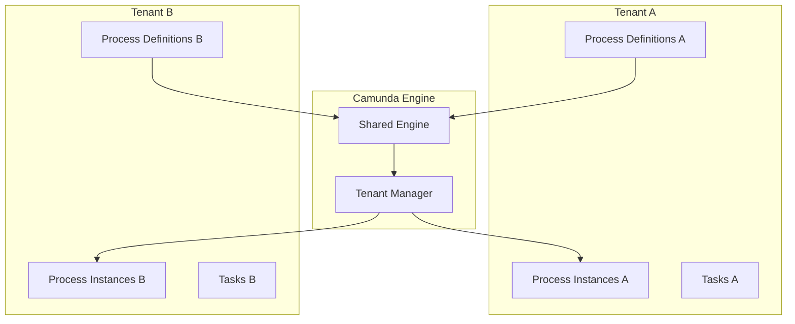
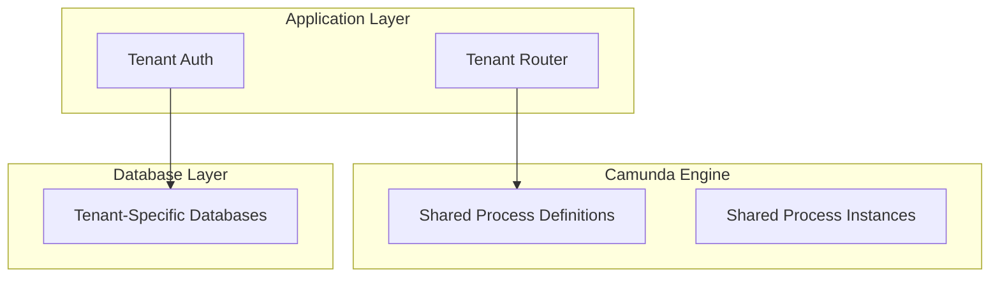

# DADMS 2.0 Camunda Tenant & Business Key Management

## Executive Summary

This document outlines the tenant and business key management strategy for DADMS 2.0 using Camunda BPM. Proper tenant isolation and business key management are critical for multi-tenant operations, data security, and process traceability.

## Table of Contents
1. [Tenant Management Strategy](#tenant-management-strategy)
2. [Business Key Patterns](#business-key-patterns)
3. [Implementation Architecture](#implementation-architecture)
4. [Database Design](#database-design)
5. [Security Considerations](#security-considerations)
6. [Migration Strategy](#migration-strategy)

---

## Tenant Management Strategy

### Multi-Tenant Architecture Options

#### Option 1: Camunda Tenant Isolation (Recommended)


**Benefits:**
- Native Camunda tenant support
- Automatic process isolation
- Built-in security
- Easy backup/restore per tenant

**Implementation:**
```typescript
// Tenant-aware process deployment
const deployment = await camundaClient.deployProcess({
  bpmnXml: processDefinition,
  tenantId: 'tenant-a',
  deploymentName: 'rag-pipeline-v1'
});

// Tenant-aware process start
const instance = await camundaClient.startProcess({
  processDefinitionKey: 'rag-pipeline',
  tenantId: 'tenant-a',
  businessKey: 'project-123-doc-456',
  variables: { query: 'What is stress analysis?' }
});
```

#### Option 2: Application-Level Tenant Isolation


**Benefits:**
- Full control over tenant isolation
- Custom tenant management logic
- Flexible data partitioning

**Drawbacks:**
- More complex implementation
- Potential for tenant data leakage
- Manual security enforcement

### Recommended Approach: Hybrid Strategy

We recommend a **hybrid approach** that leverages Camunda's native tenant support while adding application-level controls:

```typescript
// Tenant configuration
interface TenantConfig {
  id: string;
  name: string;
  camundaTenantId: string;
  businessKeyPrefix: string;
  allowedProcesses: string[];
  rateLimits: {
    processInstances: number;
    concurrentWorkflows: number;
  };
  dataRetention: {
    processInstances: number; // days
    auditLogs: number; // days
  };
}
```

---

## Business Key Patterns

### Business Key Structure

Business keys in DADMS should follow a consistent pattern for traceability and debugging:

```typescript
// Business key format: {tenant}-{project}-{workflow}-{instance}
const businessKeyPatterns = {
  RAG_WORKFLOW: '{tenant}-{project}-rag-{timestamp}',
  LLM_WORKFLOW: '{tenant}-{project}-llm-{timestamp}',
  SIMULATION_WORKFLOW: '{tenant}-{project}-sim-{timestamp}',
  ANALYSIS_WORKFLOW: '{tenant}-{project}-analysis-{timestamp}'
};

// Example business keys:
// 'acme-corp-project-123-rag-20240115-143022'
// 'tech-startup-sim-456-llm-20240115-143023'
// 'research-lab-analysis-789-sim-20240115-143024'
```

### Business Key Generation

```typescript
// Business key generator
class BusinessKeyGenerator {
  static generateRagKey(tenantId: string, projectId: string): string {
    const timestamp = new Date().toISOString().replace(/[:.]/g, '-');
    return `${tenantId}-${projectId}-rag-${timestamp}`;
  }
  
  static generateLlmKey(tenantId: string, projectId: string): string {
    const timestamp = new Date().toISOString().replace(/[:.]/g, '-');
    return `${tenantId}-${projectId}-llm-${timestamp}`;
  }
  
  static parseBusinessKey(businessKey: string): {
    tenantId: string;
    projectId: string;
    workflowType: string;
    timestamp: string;
  } {
    const parts = businessKey.split('-');
    return {
      tenantId: parts[0],
      projectId: parts[1],
      workflowType: parts[2],
      timestamp: parts.slice(3).join('-')
    };
  }
}
```

### Business Key Usage in Workflows

```typescript
// Process Manager with business key support
class ProcessManagerService {
  async startRagWorkflow(tenantId: string, projectId: string, query: string): Promise<string> {
    const businessKey = BusinessKeyGenerator.generateRagKey(tenantId, projectId);
    
    const processInstance = await this.camundaClient.startProcess({
      processDefinitionKey: 'rag-pipeline',
      tenantId: tenantId,
      businessKey: businessKey,
      variables: {
        query: query,
        projectId: projectId,
        tenantId: tenantId,
        workflowType: 'rag'
      }
    });
    
    return processInstance.id;
  }
  
  async getProcessByBusinessKey(businessKey: string): Promise<ProcessInstance> {
    const instances = await this.camundaClient.getProcessInstances({
      businessKey: businessKey
    });
    
    return instances[0];
  }
}
```

---

## Implementation Architecture

### Tenant-Aware Process Manager

```typescript
// Enhanced Process Manager with tenant support
export class TenantAwareProcessManager extends BaseService {
  private tenantRegistry: TenantRegistry;
  private businessKeyGenerator: BusinessKeyGenerator;

  constructor() {
    super('Tenant-Aware Process Manager', 3007);
    this.tenantRegistry = new TenantRegistry();
    this.businessKeyGenerator = new BusinessKeyGenerator();
  }

  protected setupRoutes(): void {
    // Tenant-aware process management
    this.app.post('/tenants/:tenantId/processes/deploy', this.deployProcess.bind(this));
    this.app.post('/tenants/:tenantId/processes/start', this.startProcess.bind(this));
    this.app.get('/tenants/:tenantId/processes', this.getProcesses.bind(this));
    this.app.get('/processes/business-key/:businessKey', this.getProcessByBusinessKey.bind(this));
  }

  private async deployProcess(req: express.Request, res: express.Response): Promise<void> {
    try {
      const { tenantId } = req.params;
      const { bpmnXml, processName, version } = req.body;
      
      // Validate tenant access
      const tenant = await this.tenantRegistry.getTenant(tenantId);
      if (!tenant) {
        res.status(404).json({ error: 'Tenant not found' });
        return;
      }
      
      // Deploy to Camunda with tenant isolation
      const deploymentId = await this.camundaClient.deployProcess({
        bpmnXml,
        tenantId: tenant.camundaTenantId,
        deploymentName: `${processName}-v${version}`,
        enableDuplicateFiltering: true
      });
      
      // Store process metadata with tenant association
      const processId = await this.processRepository.saveProcess({
        tenantId,
        name: processName,
        version,
        deploymentId,
        bpmnXml,
        createdAt: new Date()
      });
      
      res.json({ processId, deploymentId, tenantId });
    } catch (error) {
      res.status(500).json({ error: 'Failed to deploy process', details: error.message });
    }
  }

  private async startProcess(req: express.Request, res: express.Response): Promise<void> {
    try {
      const { tenantId } = req.params;
      const { processKey, variables, workflowType } = req.body;
      
      // Validate tenant and process access
      const tenant = await this.tenantRegistry.getTenant(tenantId);
      if (!tenant || !tenant.allowedProcesses.includes(processKey)) {
        res.status(403).json({ error: 'Process not allowed for tenant' });
        return;
      }
      
      // Generate business key
      const businessKey = this.businessKeyGenerator.generateKey(
        tenantId, 
        variables.projectId, 
        workflowType
      );
      
      // Start process with tenant isolation
      const instanceId = await this.camundaClient.startProcess({
        processDefinitionKey: processKey,
        tenantId: tenant.camundaTenantId,
        businessKey,
        variables: {
          ...variables,
          tenantId,
          businessKey,
          workflowType
        }
      });
      
      res.json({ instanceId, businessKey, tenantId });
    } catch (error) {
      res.status(500).json({ error: 'Failed to start process', details: error.message });
    }
  }

  private async getProcesses(req: express.Request, res: express.Response): Promise<void> {
    try {
      const { tenantId } = req.params;
      const { status, limit = 100, offset = 0 } = req.query;
      
      // Get tenant-specific processes
      const processes = await this.camundaClient.getProcessInstances({
        tenantId,
        status: status as string,
        maxResults: parseInt(limit as string),
        firstResult: parseInt(offset as string)
      });
      
      res.json(processes);
    } catch (error) {
      res.status(500).json({ error: 'Failed to get processes', details: error.message });
    }
  }

  private async getProcessByBusinessKey(req: express.Request, res: express.Response): Promise<void> {
    try {
      const { businessKey } = req.params;
      
      // Parse business key to extract tenant info
      const keyInfo = BusinessKeyGenerator.parseBusinessKey(businessKey);
      
      // Validate tenant access
      const tenant = await this.tenantRegistry.getTenant(keyInfo.tenantId);
      if (!tenant) {
        res.status(404).json({ error: 'Tenant not found' });
        return;
      }
      
      // Get process instance
      const process = await this.camundaClient.getProcessInstances({
        businessKey
      });
      
      if (!process || process.length === 0) {
        res.status(404).json({ error: 'Process not found' });
        return;
      }
      
      res.json(process[0]);
    } catch (error) {
      res.status(500).json({ error: 'Failed to get process', details: error.message });
    }
  }
}
```

### Tenant Registry Service

```typescript
// Tenant registry for managing tenant configurations
export class TenantRegistry {
  private db: Pool;
  private cache: Map<string, TenantConfig> = new Map();

  constructor() {
    this.db = new Pool({
      connectionString: process.env.DATABASE_URL
    });
  }

  async getTenant(tenantId: string): Promise<TenantConfig | null> {
    // Check cache first
    if (this.cache.has(tenantId)) {
      return this.cache.get(tenantId)!;
    }
    
    // Query database
    const result = await this.db.query(
      'SELECT * FROM tenants WHERE id = $1 AND is_active = true',
      [tenantId]
    );
    
    if (result.rows.length === 0) {
      return null;
    }
    
    const tenant = result.rows[0];
    const config: TenantConfig = {
      id: tenant.id,
      name: tenant.name,
      camundaTenantId: tenant.camunda_tenant_id,
      businessKeyPrefix: tenant.business_key_prefix,
      allowedProcesses: tenant.allowed_processes,
      rateLimits: tenant.rate_limits,
      dataRetention: tenant.data_retention
    };
    
    // Cache for 5 minutes
    this.cache.set(tenantId, config);
    setTimeout(() => this.cache.delete(tenantId), 5 * 60 * 1000);
    
    return config;
  }

  async createTenant(config: Omit<TenantConfig, 'id'>): Promise<string> {
    const result = await this.db.query(
      `INSERT INTO tenants (
        name, camunda_tenant_id, business_key_prefix, 
        allowed_processes, rate_limits, data_retention
      ) VALUES ($1, $2, $3, $4, $5, $6) RETURNING id`,
      [
        config.name,
        config.camundaTenantId,
        config.businessKeyPrefix,
        config.allowedProcesses,
        config.rateLimits,
        config.dataRetention
      ]
    );
    
    return result.rows[0].id;
  }

  async updateTenant(tenantId: string, updates: Partial<TenantConfig>): Promise<void> {
    const fields = [];
    const values = [];
    let paramCount = 1;
    
    for (const [key, value] of Object.entries(updates)) {
      if (key !== 'id') {
        fields.push(`${this.camelToSnake(key)} = $${paramCount}`);
        values.push(value);
        paramCount++;
      }
    }
    
    values.push(tenantId);
    
    await this.db.query(
      `UPDATE tenants SET ${fields.join(', ')}, updated_at = NOW() WHERE id = $${paramCount}`,
      values
    );
    
    // Invalidate cache
    this.cache.delete(tenantId);
  }

  private camelToSnake(str: string): string {
    return str.replace(/[A-Z]/g, letter => `_${letter.toLowerCase()}`);
  }
}
```

---

## Database Design

### Tenant Management Tables

```sql
-- Tenants table
CREATE TABLE tenants (
    id UUID PRIMARY KEY DEFAULT gen_random_uuid(),
    name VARCHAR(255) NOT NULL UNIQUE,
    camunda_tenant_id VARCHAR(255) NOT NULL UNIQUE,
    business_key_prefix VARCHAR(50) NOT NULL,
    allowed_processes TEXT[] NOT NULL DEFAULT '{}',
    rate_limits JSONB NOT NULL DEFAULT '{}',
    data_retention JSONB NOT NULL DEFAULT '{}',
    is_active BOOLEAN DEFAULT true,
    created_at TIMESTAMP DEFAULT CURRENT_TIMESTAMP,
    updated_at TIMESTAMP DEFAULT CURRENT_TIMESTAMP
);

-- Tenant process definitions (tenant-specific process metadata)
CREATE TABLE tenant_process_definitions (
    id UUID PRIMARY KEY DEFAULT gen_random_uuid(),
    tenant_id UUID REFERENCES tenants(id) ON DELETE CASCADE,
    process_definition_id UUID REFERENCES process_definitions(id),
    camunda_deployment_id VARCHAR(255) NOT NULL,
    version VARCHAR(50) NOT NULL,
    is_active BOOLEAN DEFAULT true,
    created_at TIMESTAMP DEFAULT CURRENT_TIMESTAMP,
    UNIQUE(tenant_id, process_definition_id, version)
);

-- Tenant process instances (tenant-specific instance metadata)
CREATE TABLE tenant_process_instances (
    id UUID PRIMARY KEY DEFAULT gen_random_uuid(),
    tenant_id UUID REFERENCES tenants(id) ON DELETE CASCADE,
    process_instance_id UUID REFERENCES process_instances(id),
    business_key VARCHAR(255) NOT NULL,
    workflow_type VARCHAR(50) NOT NULL,
    project_id UUID,
    metadata JSONB,
    created_at TIMESTAMP DEFAULT CURRENT_TIMESTAMP,
    UNIQUE(tenant_id, business_key)
);

-- Tenant API keys
CREATE TABLE tenant_api_keys (
    id UUID PRIMARY KEY DEFAULT gen_random_uuid(),
    tenant_id UUID REFERENCES tenants(id) ON DELETE CASCADE,
    key_hash VARCHAR(255) UNIQUE NOT NULL,
    name VARCHAR(255) NOT NULL,
    permissions JSONB,
    rate_limit INTEGER DEFAULT 1000,
    is_active BOOLEAN DEFAULT true,
    created_at TIMESTAMP DEFAULT CURRENT_TIMESTAMP,
    expires_at TIMESTAMP
);

-- Tenant audit logs
CREATE TABLE tenant_audit_logs (
    id UUID PRIMARY KEY DEFAULT gen_random_uuid(),
    tenant_id UUID REFERENCES tenants(id) ON DELETE CASCADE,
    user_id UUID,
    action VARCHAR(100) NOT NULL,
    resource_type VARCHAR(50) NOT NULL,
    resource_id VARCHAR(255),
    details JSONB,
    ip_address INET,
    user_agent TEXT,
    created_at TIMESTAMP DEFAULT CURRENT_TIMESTAMP
);

-- Indexes for performance
CREATE INDEX idx_tenants_camunda_id ON tenants(camunda_tenant_id);
CREATE INDEX idx_tenant_process_instances_business_key ON tenant_process_instances(business_key);
CREATE INDEX idx_tenant_process_instances_tenant_id ON tenant_process_instances(tenant_id);
CREATE INDEX idx_tenant_audit_logs_tenant_id ON tenant_audit_logs(tenant_id);
CREATE INDEX idx_tenant_audit_logs_created_at ON tenant_audit_logs(created_at);
```

### Data Retention and Cleanup

```sql
-- Function to cleanup old process instances based on tenant retention policy
CREATE OR REPLACE FUNCTION cleanup_tenant_process_instances()
RETURNS void AS $$
DECLARE
    tenant_record RECORD;
    retention_days INTEGER;
BEGIN
    FOR tenant_record IN 
        SELECT id, data_retention->>'processInstances' as retention
        FROM tenants 
        WHERE is_active = true
    LOOP
        retention_days := COALESCE(tenant_record.retention::INTEGER, 90);
        
        -- Delete old process instances
        DELETE FROM tenant_process_instances 
        WHERE tenant_id = tenant_record.id 
        AND created_at < NOW() - INTERVAL '1 day' * retention_days;
        
        -- Delete old audit logs
        DELETE FROM tenant_audit_logs 
        WHERE tenant_id = tenant_record.id 
        AND created_at < NOW() - INTERVAL '1 day' * retention_days;
    END LOOP;
END;
$$ LANGUAGE plpgsql;

-- Schedule cleanup job (run daily)
SELECT cron.schedule('cleanup-tenant-data', '0 2 * * *', 'SELECT cleanup_tenant_process_instances();');
```

---

## Security Considerations

### Tenant Isolation Security

```typescript
// Tenant isolation middleware
export class TenantIsolationMiddleware {
  static async validateTenantAccess(
    req: express.Request, 
    res: express.Response, 
    next: express.NextFunction
  ): Promise<void> {
    const tenantId = req.params.tenantId || req.body.tenantId;
    const apiKey = req.headers.authorization?.replace('Bearer ', '');
    
    if (!tenantId || !apiKey) {
      res.status(401).json({ error: 'Missing tenant ID or API key' });
      return;
    }
    
    // Validate API key belongs to tenant
    const apiKeyRecord = await this.validateApiKey(apiKey, tenantId);
    if (!apiKeyRecord) {
      res.status(403).json({ error: 'Invalid API key for tenant' });
      return;
    }
    
    // Add tenant context to request
    req.tenant = {
      id: tenantId,
      apiKey: apiKeyRecord
    };
    
    next();
  }
  
  private static async validateApiKey(apiKey: string, tenantId: string): Promise<any> {
    const keyHash = crypto.createHash('sha256').update(apiKey).digest('hex');
    
    const result = await db.query(
      'SELECT * FROM tenant_api_keys WHERE key_hash = $1 AND tenant_id = $2 AND is_active = true',
      [keyHash, tenantId]
    );
    
    return result.rows[0] || null;
  }
}
```

### Business Key Security

```typescript
// Business key validation
export class BusinessKeyValidator {
  static validateBusinessKey(businessKey: string, tenantId: string): boolean {
    const keyInfo = BusinessKeyGenerator.parseBusinessKey(businessKey);
    
    // Validate tenant matches
    if (keyInfo.tenantId !== tenantId) {
      return false;
    }
    
    // Validate format
    const validFormats = ['rag', 'llm', 'sim', 'analysis'];
    if (!validFormats.includes(keyInfo.workflowType)) {
      return false;
    }
    
    // Validate timestamp (not too old)
    const timestamp = new Date(keyInfo.timestamp);
    const now = new Date();
    const maxAge = 24 * 60 * 60 * 1000; // 24 hours
    
    if (now.getTime() - timestamp.getTime() > maxAge) {
      return false;
    }
    
    return true;
  }
}
```

---

## Migration Strategy

### Phase 1: Tenant Infrastructure Setup

```sql
-- Create tenant infrastructure
CREATE TABLE tenants (
    id UUID PRIMARY KEY DEFAULT gen_random_uuid(),
    name VARCHAR(255) NOT NULL UNIQUE,
    camunda_tenant_id VARCHAR(255) NOT NULL UNIQUE,
    business_key_prefix VARCHAR(50) NOT NULL,
    allowed_processes TEXT[] NOT NULL DEFAULT '{}',
    rate_limits JSONB NOT NULL DEFAULT '{}',
    data_retention JSONB NOT NULL DEFAULT '{}',
    is_active BOOLEAN DEFAULT true,
    created_at TIMESTAMP DEFAULT CURRENT_TIMESTAMP,
    updated_at TIMESTAMP DEFAULT CURRENT_TIMESTAMP
);

-- Create default tenant
INSERT INTO tenants (
    name, 
    camunda_tenant_id, 
    business_key_prefix, 
    allowed_processes,
    rate_limits,
    data_retention
) VALUES (
    'default',
    'default-tenant',
    'default',
    ARRAY['rag-pipeline', 'llm-pipeline', 'simulation-pipeline'],
    '{"processInstances": 1000, "concurrentWorkflows": 100}',
    '{"processInstances": 90, "auditLogs": 365}'
);
```

### Phase 2: Process Migration

```typescript
// Migration script for existing processes
export class ProcessMigrationService {
  async migrateExistingProcesses(): Promise<void> {
    // Get all existing process instances without tenant
    const instances = await this.db.query(
      'SELECT * FROM process_instances WHERE tenant_id IS NULL'
    );
    
    for (const instance of instances.rows) {
      // Assign to default tenant
      await this.db.query(
        'UPDATE process_instances SET tenant_id = $1 WHERE id = $2',
        ['default-tenant-id', instance.id]
      );
      
      // Generate business key if missing
      if (!instance.business_key) {
        const businessKey = BusinessKeyGenerator.generateKey(
          'default',
          instance.project_id || 'legacy',
          'migrated'
        );
        
        await this.db.query(
          'UPDATE process_instances SET business_key = $1 WHERE id = $2',
          [businessKey, instance.id]
        );
      }
    }
  }
}
```

### Phase 3: API Migration

```typescript
// API versioning for tenant support
export class APIVersionManager {
  static handleLegacyRequests(req: express.Request, res: express.Response): void {
    // Legacy API without tenant ID
    if (!req.params.tenantId && !req.body.tenantId) {
      // Redirect to default tenant
      req.params.tenantId = 'default';
      req.body.tenantId = 'default';
    }
  }
}
```

---

## Best Practices

### 1. **Business Key Naming**
- Use consistent, predictable patterns
- Include tenant and project identifiers
- Add timestamps for uniqueness
- Keep keys human-readable for debugging

### 2. **Tenant Isolation**
- Always validate tenant access
- Use Camunda's native tenant support
- Implement application-level checks
- Audit all tenant operations

### 3. **Performance Optimization**
- Cache tenant configurations
- Use database indexes for tenant queries
- Implement data retention policies
- Monitor tenant-specific metrics

### 4. **Security**
- Validate business keys
- Implement tenant-specific API keys
- Audit all tenant operations
- Use least-privilege access

### 5. **Monitoring**
- Track tenant-specific metrics
- Monitor process execution per tenant
- Alert on tenant-specific issues
- Implement tenant-specific dashboards

---

## Implementation Checklist

### Phase 1: Foundation
- [ ] Create tenant management tables
- [ ] Implement TenantRegistry service
- [ ] Add tenant isolation middleware
- [ ] Create business key generators
- [ ] Set up default tenant

### Phase 2: Process Manager Enhancement
- [ ] Update ProcessManager for tenant support
- [ ] Implement tenant-aware process deployment
- [ ] Add business key generation
- [ ] Create tenant-specific process queries
- [ ] Add tenant validation

### Phase 3: API Gateway Integration
- [ ] Add tenant routing to API Gateway
- [ ] Implement tenant-specific rate limiting
- [ ] Add tenant context to all requests
- [ ] Create tenant-specific endpoints
- [ ] Add tenant validation middleware

### Phase 4: Migration
- [ ] Create migration scripts
- [ ] Migrate existing processes
- [ ] Update API endpoints
- [ ] Test tenant isolation
- [ ] Validate business keys

This comprehensive tenant and business key management strategy ensures proper isolation, security, and traceability in the DADMS multi-tenant environment. 