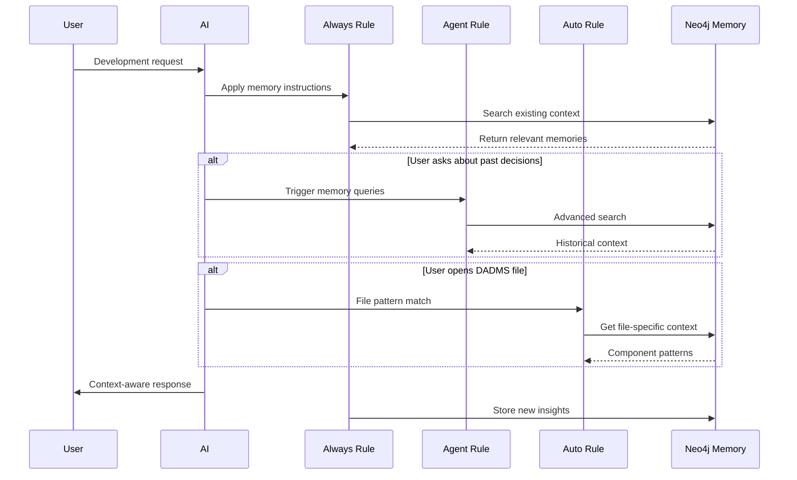

# DADMS Cursor Rules Reference

## Overview

This document provides detailed information about the Cursor Rules implemented for the DADMS project to enable seamless AI memory management and context-aware development.

## Rule Architecture

The DADMS project uses a three-rule system following [official Cursor documentation](https://docs.cursor.com/en/context/rules) standards:

### Rule Types

| Rule Type | File | Purpose | Trigger |
|-----------|------|---------|---------|
| Always | `dadms-memory-agent.mdc` | Continuous memory management | Every AI interaction |
| Agent Requested | `dadms-memory-queries.mdc` | Advanced memory searches | AI decides based on context |
| Auto Attached | `dadms-development-memory.mdc` | File-specific context | When editing matching files |

## Rule Details

### 1. Always Rule: `dadms-memory-agent.mdc`

**Configuration:**
```yaml
---
description: 
globs: 
alwaysApply: true
---
```

**Purpose:**
- Provides continuous memory management instructions
- Always searches memory before making decisions
- Automatically stores significant developments
- Creates learning feedback loops

**Behavior:**
- Applied to every Chat and Inline Edit interaction
- Implements Search → Apply → Store → Reference cycle
- Proactively manages memory without user intervention

**Memory Triggers:**
- Architecture decisions or design pattern choices
- Problem solutions that required multiple attempts
- System configuration changes or discoveries
- Integration patterns between DADMS services
- Performance optimizations or best practices
- Bug fixes with root cause analysis
- New feature implementations with design rationale
- Database schema or data model changes
- Infrastructure setup or deployment insights

### 2. Agent Requested Rule: `dadms-memory-queries.mdc`

**Configuration:**
```yaml
---
description: Advanced memory search and management capabilities for DADMS project. Use this rule when the user asks about previous decisions, wants to recall past solutions, or needs to understand existing system architecture. This provides tools for searching stored memories, retrieving project context, and managing knowledge continuity across development sessions.
globs: 
alwaysApply: false
---
```

**Purpose:**
- Advanced memory search and retrieval
- Context reconstruction from stored knowledge
- Historical decision tracking

**Triggers:**
- User asks "What did we decide about...?"
- User wants to recall previous architectural choices
- User needs context about existing implementations
- User asks about past problems and solutions
- User wants to understand system relationships

**Available Operations:**
- Search memories by keywords
- Find entities by name
- Read full graph relationships
- Retrieve historical context
- Cross-reference related decisions

### 3. Auto Attached Rule: `dadms-development-memory.mdc`

**Configuration:**
```yaml
---
description: 
globs: dadms-services/**/*.js, dadms-services/**/*.ts, dadms-ui/**/*.tsx, dadms-ui/**/*.ts, dadms-infrastructure/**/*.yml, .cursor/**/*.mdc
alwaysApply: false
---
```

**Purpose:**
- File-specific context enhancement
- Automatic relevance filtering
- Component-specific memory retrieval

**File Patterns:**
- **Backend Services** (`dadms-services/**/*`): API patterns, configurations, database connections
- **Frontend Development** (`dadms-ui/**/*`): Component patterns, theming, state management
- **Infrastructure** (`dadms-infrastructure/**/*`): Container configs, dependencies, environment
- **Cursor Configuration** (`.cursor/**/*`): Rule patterns, MCP configurations

**Auto-Triggered Context:**
- Port allocations and service configurations
- API patterns and authentication methods
- Database connection patterns
- Inter-service communication protocols
- Component architecture and patterns
- Theme system and styling approaches
- State management decisions
- Container configurations and port mappings
- Service dependencies and startup order

## Rule Interaction Flow



## Memory Data Structure

### Entity Format
```javascript
{
  name: "Unique_Entity_Name",
  type: "entity_category", // e.g., software_system, infrastructure, process
  observations: [
    "Specific factual statement",
    "Decision or pattern with reasoning",
    "Implementation detail or constraint"
  ]
}
```

### Relationship Format
```javascript
{
  source: "Source_Entity",
  target: "Target_Entity",
  relationType: "relationship_type" // e.g., uses, integrates_with, manages, depends_on
}
```

### Current Entity Categories

- **software_system**: Core system components and architecture
- **infrastructure**: Container setup, databases, service configuration
- **ai_integration**: MCP servers, rules, AI tools
- **system_configuration**: Specific settings and configurations
- **process**: Workflows, scripts, management procedures
- **development_approach**: Patterns, methodologies, best practices

## Best Practices

### Rule Organization

1. **Keep Rules Focused**: Each rule has a specific, well-defined purpose
2. **Follow Official Standards**: Use correct MDC format and metadata
3. **Avoid Overlap**: Rules complement rather than duplicate functionality
4. **Test Behavior**: Verify rules trigger correctly in different scenarios

### Memory Management

1. **Be Specific**: Store concrete decisions and patterns
2. **Cross-Reference**: Link related entities with meaningful relationships
3. **Version Control**: Rules are tracked in Git alongside code
4. **Regular Maintenance**: Review and update rules as project evolves

### Development Workflow

1. **Always Rule**: Handles continuous background memory management
2. **Agent Rule**: Provides on-demand historical context retrieval
3. **Auto Rule**: Supplies file-specific development context
4. **Memory Persistence**: All information survives sessions and builds knowledge

## Common Usage Patterns

### Querying Past Decisions
```
User: "What authentication approach did we choose for the API?"
→ Agent Rule triggers → Searches memory → Returns stored auth decisions
```

### Implementing New Features
```
User: "Add user authentication to the project service"
→ Always Rule triggers → Searches for auth patterns → Applies existing approaches → Stores new implementation details
```

### File-Specific Context
```
[Opening dadms-services/user-project/auth.js]
→ Auto Rule triggers → Loads auth service patterns → Provides relevant context for development
```

### Architecture Planning
```
User: "How should we structure the new notification service?"
→ Always Rule searches existing service patterns → Agent Rule provides service architecture decisions → Auto Rule (if editing service files) adds implementation context
```

## Troubleshooting Rules

### Rule Not Triggering

1. **Always Rule Issues**:
   - Check that `alwaysApply: true` is set
   - Verify rule file is in `.cursor/rules/`
   - Restart Cursor IDE

2. **Agent Rule Issues**:
   - Ensure `description` field is populated
   - Check that query matches rule purpose
   - Verify `alwaysApply: false`

3. **Auto Rule Issues**:
   - Confirm file path matches `globs` pattern
   - Check that file is actually open/referenced
   - Verify glob syntax is correct

### Rule Performance

1. **Rules Too Verbose**: Keep rules under 500 lines per official guidelines
2. **Context Overload**: Split complex rules into focused, composable rules
3. **Memory Conflicts**: Ensure rules don't contradict each other

### Memory Integration

1. **MCP Connection Issues**: Verify Neo4j Memory is running on port 7688
2. **Memory Tools Unavailable**: Check `.cursor/mcp.json` configuration
3. **Context Not Loading**: Restart MCP servers and Cursor IDE

## File Locations

```
.cursor/
├── rules/
│   ├── dadms-memory-agent.mdc        # Always Rule
│   ├── dadms-memory-queries.mdc      # Agent Requested Rule
│   └── dadms-development-memory.mdc  # Auto Attached Rule
└── mcp.json                          # MCP Server Configuration
```

## Integration with MCP Memory

The rules system works seamlessly with the MCP Neo4j Memory server:

1. **Always Rule** → Provides continuous memory management instructions
2. **Memory Tools** → Execute create/read/update/search operations  
3. **Agent Rule** → Handles complex memory queries and searches
4. **Auto Rule** → Supplies file-specific context from stored memories
5. **Neo4j Database** → Persists all memory data with relationships

This creates a complete knowledge management system that enhances AI development capabilities while maintaining full transparency and control.

---

*For setup instructions, see `MCP_Memory_Quick_Setup.md`. For detailed system information, see `MCP_Memory_System_Guide.md`.*