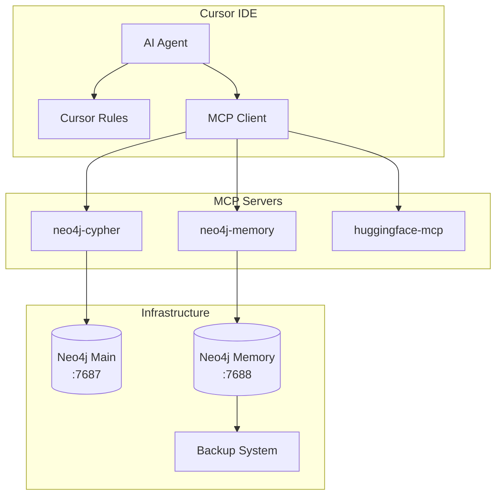

# DADMS MCP Memory System Guide

## Overview

The DADMS MCP Memory System provides seamless, persistent memory capabilities for AI-assisted development using Neo4j graph database and Model Context Protocol (MCP) servers. This system enables the AI to remember project decisions, architectural patterns, and learning moments across development sessions.

## Architecture



## Components

### 1. Neo4j Memory Database
- **Purpose**: Dedicated graph database for AI memory storage
- **Port**: 7688 (separate from operational Neo4j on 7687)
- **Data Structure**: Entities with observations and relationships
- **Backup**: Automated rotation keeping 7 backups

### 2. MCP Servers
- **neo4j-memory**: Tools for storing/retrieving AI memories
- **neo4j-cypher**: Database queries and schema access
- **huggingface-mcp**: ML model and dataset access

### 3. Cursor Rules System
- **Always Rule**: Continuous memory management instructions
- **Agent Requested Rule**: Smart memory queries when needed
- **Auto Attached Rule**: Context-aware memory for specific files

## Memory Data Model

### Entity Types
```javascript
{
  name: "Entity_Name",
  type: "entity_type", // e.g., "software_system", "infrastructure", "process"
  observations: [
    "Factual statement about the entity",
    "Another observation with context",
    "Decision or pattern discovered"
  ]
}
```

### Relationship Types
```javascript
{
  source: "Entity_A",
  target: "Entity_B", 
  relationType: "relationship_type" // e.g., "uses", "integrates_with", "manages"
}
```

### Current Entities in Memory
- **DADMS_2.0**: Core system architecture and design decisions
- **DADMS_Infrastructure**: Container setup, ports, and service configuration
- **MCP_Integration**: MCP server configurations and tools
- **MCP_Memory_Setup**: Memory system configuration and backup processes
- **Development_Workflow**: Management scripts and automation
- **Seamless_Memory_Pattern**: Memory management approach and rules

## Memory Categories

### Technical Entities
- System components and relationships
- API endpoints and integration patterns  
- Database schemas and data flows
- Infrastructure configuration
- Development tools and workflows

### Decision Entities
- Architecture choices with reasoning
- Technology selections and trade-offs
- Design patterns and applications
- Performance optimization strategies

### Learning Entities
- Problem-solution pairs
- Debugging insights and techniques
- Best practices discovered
- Common pitfalls and avoidance strategies

## Automatic Memory Triggers

The system automatically stores memories during:

- **Architecture decisions** or design pattern choices
- **Problem solutions** that required multiple attempts
- **System configuration** changes or discoveries
- **Integration patterns** between DADMS services
- **Performance optimizations** or best practices
- **Bug fixes** with root cause analysis
- **New feature implementations** with design rationale
- **Database schema** or data model changes
- **Infrastructure** setup or deployment insights

## Memory Operations

### Search Operations
```bash
# Search by topic
search_memories("authentication patterns")

# Search by component  
search_memories("database configuration")

# Search by type
search_memories("architecture decisions")
```

### Storage Operations
```bash
# Create new entities
create_entities([{
  name: "New_Component",
  type: "software_component",
  observations: ["Key facts about the component"]
}])

# Add observations to existing entities
add_observations([{
  entityName: "Existing_Entity",
  observations: ["New insight or decision"]
}])

# Create relationships
create_relations([{
  source: "Component_A",
  target: "Component_B", 
  relationType: "depends_on"
}])
```

## Configuration Files

### MCP Configuration (`.cursor/mcp.json`)
```json
{
  "$schema": "https://json.schemastore.org/mcp.json",
  "description": "DADMS Development MCP Server Configuration with Seamless Memory",
  "mcpServers": {
    "neo4j-memory": {
      "command": "uvx",
      "args": [
        "mcp-neo4j-memory",
        "--db-url", "neo4j://localhost:7688",
        "--username", "neo4j", 
        "--password", "memorypassword"
      ]
    }
  }
}
```

### Infrastructure Configuration
See `dadms-infrastructure/docker-compose.yml` for the Neo4j Memory service:
```yaml
neo4j-memory:
  image: docker.io/neo4j:5.13
  container_name: neo4j-memory
  environment:
    NEO4J_AUTH: neo4j/memorypassword
    NEO4J_PLUGINS: '["apoc"]'
  ports:
    - "7475:7474"   # HTTP
    - "7688:7687"   # Bolt
  volumes:
    - neo4j-memory-data:/data
    - neo4j-memory-backups:/backups
```

## Cursor Rules

### 1. Always Rule (`dadms-memory-agent.mdc`)
- **Type**: Always applied (`alwaysApply: true`)
- **Purpose**: Continuous memory management instructions
- **Behavior**: Always searches memory before decisions, stores significant developments

### 2. Agent Requested Rule (`dadms-memory-queries.mdc`) 
- **Type**: Agent decides when to use (`alwaysApply: false`)
- **Purpose**: Advanced memory search and retrieval
- **Triggers**: User questions about past decisions, architectural queries

### 3. Auto Attached Rule (`dadms-development-memory.mdc`)
- **Type**: File-based triggers (`globs` defined)
- **Purpose**: Context-aware memory for development files
- **Triggers**: When editing DADMS services, UI, or infrastructure files

## Usage Examples

### Querying Memory
```
User: "What authentication patterns have we used?"
AI: [Searches memory] → Returns stored authentication decisions and patterns
```

### Automatic Storage
```
User: "Let's implement JWT authentication for the API"
AI: [Implements solution] → Automatically stores: authentication choice, implementation patterns, API integration approach
```

### Context Retrieval
```
[Opening dadms-services/auth-service/index.js]
AI: [Auto-retrieves] → Authentication patterns, service configurations, related dependencies
```

## Backup and Recovery

### Automatic Backups
- **Frequency**: On-demand via `./dadms-start.sh backup`
- **Retention**: Last 7 backups automatically kept
- **Location**: `./backups/mcp-memory/`
- **Format**: Compressed Cypher scripts (`.cypher.gz`)

### Manual Backup
```bash
./dadms-start.sh backup
```

### Restore from Backup
```bash
./dadms-start.sh restore
```

### Memory Status Check
```bash
./dadms-start.sh memory
```

## Troubleshooting

### Memory Server Not Responding
1. Check container status: `./dadms-start.sh status`
2. Restart infrastructure: `./dadms-start.sh restart`
3. Verify Neo4j Memory is running on port 7688

### Memory Tools Not Available
1. Verify MCP configuration in `.cursor/mcp.json`
2. Restart Cursor IDE to reload MCP servers
3. Check MCP server logs for connection issues

### Memory Data Loss
1. Check available backups: `./dadms-start.sh memory`
2. Restore from latest backup: `./dadms-start.sh restore`
3. Verify Neo4j Memory database connectivity

## Best Practices

### Memory Management
- **Be Specific**: Store concrete decisions and patterns
- **Cross-Reference**: Link related entities with relationships
- **Regular Backups**: Use automated backup before major changes
- **Clean Organization**: Use clear entity types and relationship names

### Rule Usage
- **Always Rule**: Handles continuous memory management
- **Agent Rule**: For explicit memory queries and searches
- **Auto Rule**: Provides file-specific context automatically

### Development Workflow
1. **Before Major Changes**: AI searches existing memory for context
2. **During Development**: Rules automatically trigger memory context
3. **After Decisions**: AI stores important outcomes and patterns
4. **Cross-Sessions**: Memory persists and builds knowledge base

## Integration with DADMS

The memory system integrates seamlessly with:
- **Service Development**: Remembers API patterns and configurations
- **Infrastructure Changes**: Tracks container and service dependencies  
- **UI Development**: Stores component patterns and theme decisions
- **Database Design**: Maintains schema evolution and migration decisions
- **Deployment Processes**: Remembers infrastructure setup and optimizations

## Future Enhancements

Planned improvements include:
- **Temporal Queries**: Track how decisions evolved over time
- **Similarity Search**: Find related patterns and solutions
- **Team Memory**: Shared memory across development team
- **Integration Patterns**: Enhanced service interaction memory
- **Performance Metrics**: Track optimization decisions and outcomes

---

*This guide provides comprehensive coverage of the DADMS MCP Memory System. For specific implementation details, see the related documentation files in this directory.*