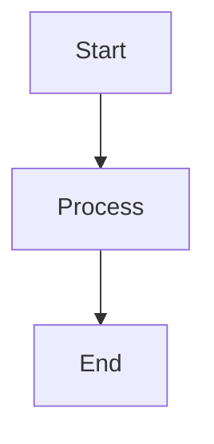
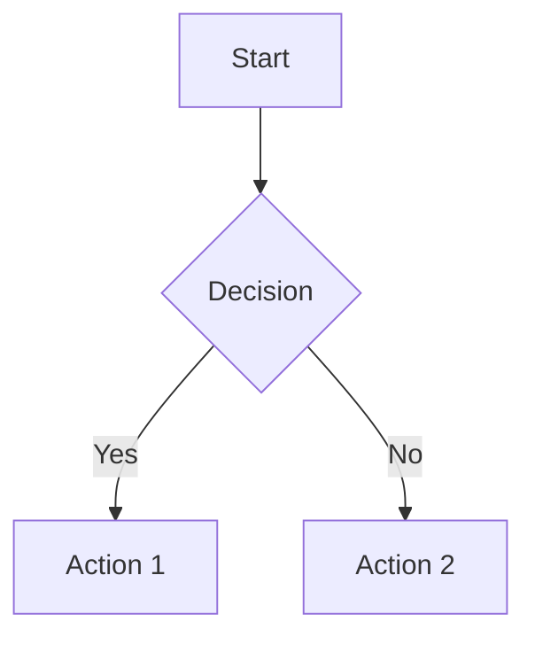
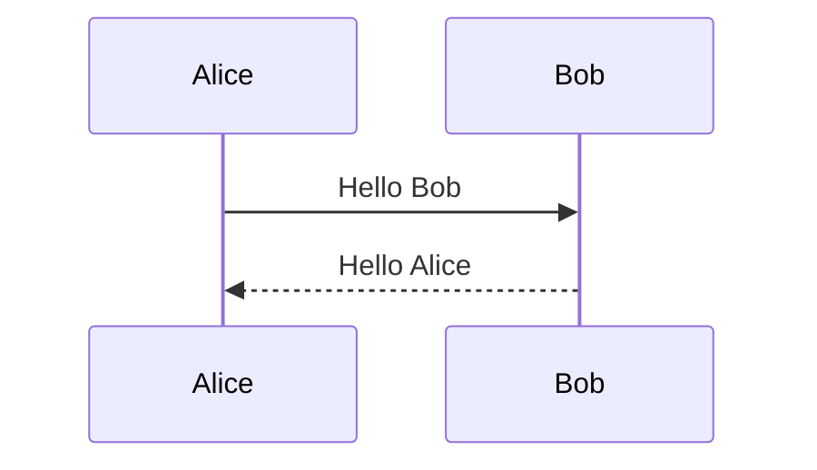
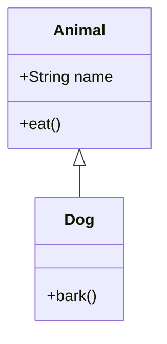
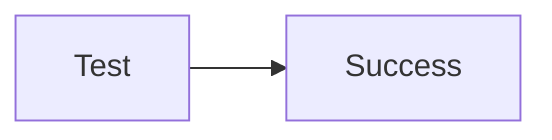
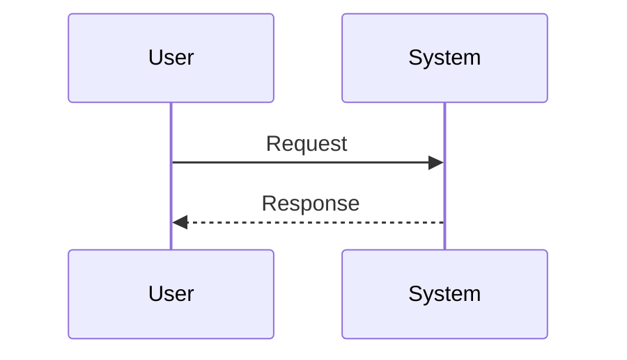

# Mermaid Diagram Integration Solution

## Overview

This document describes the complete implementation of Mermaid diagram rendering in the DADM AI Chat interface, including the solution to React DOM manipulation conflicts and best practices for stable diagram rendering.

## Implementation Summary

### Components
- **MermaidDiagram.tsx**: Dedicated React component for rendering Mermaid diagrams
- **AIChat.tsx**: Integration point that detects and renders mermaid code blocks
- **Dependencies**: `mermaid` npm package for diagram generation

### Key Features
- Automatic detection of mermaid code blocks in chat messages
- Stable rendering that persists through page refreshes and mode switches
- Error handling for invalid diagram syntax
- Responsive design with proper styling
- React-safe DOM manipulation

## Technical Implementation

### 1. MermaidDiagram Component Structure

```typescript
interface MermaidDiagramProps {
    chart: string;    // Mermaid diagram definition
    id?: string;      // Optional unique identifier
}
```

**Key architectural decisions:**
- Uses `dangerouslySetInnerHTML` for React-safe SVG injection
- Implements proper component lifecycle management
- Includes error boundaries for graceful failure handling
- Uses unique IDs to prevent diagram conflicts

### 2. AIChat Integration

The AIChat component integrates mermaid rendering through:
- Detection of `mermaid` language in code blocks for **both user and assistant messages**
- Custom markdown renderer that replaces mermaid blocks with MermaidDiagram components
- Welcome message includes a sample diagram for testing
- Consistent rendering experience regardless of message sender

**Key Implementation**: Both user and assistant messages use ReactMarkdown with the same mermaid detection logic, ensuring diagrams render properly when pasted by users or generated by the AI.

### 3. Global Mermaid Configuration

```javascript
mermaid.initialize({
    startOnLoad: false,
    theme: 'default',
    securityLevel: 'strict',
    fontFamily: 'arial, sans-serif',
    fontSize: 16,
    maxTextSize: 50000,
});
```

## Critical Problem Solved: React DOM Conflicts

### The Problem
Initial implementation caused React DOM errors:
```
Failed to execute 'removeChild' on 'Node': The node to be removed is not a child of this node.
```

**Root Cause**: Manual DOM manipulation (`innerHTML`) conflicted with React's virtual DOM management.

### The Solution
Replaced manual DOM manipulation with React-approved patterns:

**Before (Problematic):**
```typescript
// WRONG: Direct DOM manipulation
if (containerRef.current) {
    containerRef.current.innerHTML = svgContent;
}
```

**After (Correct):**
```typescript
// CORRECT: React-safe HTML injection
return (
    <Box>
        {svgContent ? (
            <div dangerouslySetInnerHTML={{ __html: svgContent }} />
        ) : null}
    </Box>
);
```

### Why This Works
- `dangerouslySetInnerHTML` tells React we're intentionally setting innerHTML
- React won't try to manage child nodes within this element
- Prevents DOM conflicts during component lifecycle events

## Installation and Setup

### 1. Install Dependencies
```bash
cd ui/
npm install mermaid
```

### 2. Component Files
- `/ui/src/components/MermaidDiagram.tsx` - Main diagram component
- `/ui/src/components/AIChat.tsx` - Integration in chat interface

### 3. Usage in Chat
Users can create diagrams by typing mermaid code blocks in their messages, and they will render automatically:

```

```

**Note**: Mermaid diagrams render in both user messages and AI assistant responses, providing a consistent experience for diagram sharing and collaboration.

## Styling and Responsive Design

### CSS-in-JS Styling (Material-UI)
```typescript
sx={{
    '& svg': {
        maxWidth: '100% !important',
        height: 'auto !important',
        display: 'block !important',
        margin: '0 auto !important',
        visibility: 'visible !important',
    },
    '& *': {
        visibility: 'visible !important',
    }
}}
```

**Key styling features:**
- Responsive SVG scaling
- Prevents diagram collapse/disappearance
- Consistent visibility across browser refreshes
- Proper spacing and borders

## Error Handling

### Component-Level Error Handling
```typescript
try {
    const { svg } = await mermaid.render(uniqueId, chart);
    setSvgContent(svg);
} catch (err) {
    setError(err instanceof Error ? err.message : 'Failed to render diagram');
}
```

### User-Facing Error Display
- Invalid syntax shows warning alert
- Empty diagrams are handled gracefully
- Console warnings for debugging

## Best Practices

### 1. Unique ID Generation
```typescript
const uniqueId = `${chartId.current}-${Date.now()}`;
```
Prevents conflicts when multiple diagrams exist.

### 2. Component Lifecycle Management
```typescript
const isMountedRef = useRef(true);

useEffect(() => {
    return () => {
        isMountedRef.current = false;
    };
}, []);
```
Prevents state updates on unmounted components.

### 3. Async Rendering Safety
Always check if component is still mounted before setting state after async operations.

## Common Diagram Types Supported

### Flowcharts


### Sequence Diagrams


### Class Diagrams


## Troubleshooting

### Common Issues

1. **Diagrams disappear after refresh**
   - **Cause**: CSS styling conflicts or improper lifecycle management
   - **Solution**: Ensure `visibility: visible !important` styling is applied

2. **React DOM errors**
   - **Cause**: Manual DOM manipulation conflicts with React
   - **Solution**: Use `dangerouslySetInnerHTML` instead of `innerHTML`

3. **Diagrams not rendering**
   - **Cause**: Invalid mermaid syntax or initialization issues
   - **Solution**: Check console for mermaid errors, validate syntax

4. **Multiple diagram conflicts**
   - **Cause**: Non-unique diagram IDs
   - **Solution**: Generate unique IDs with timestamp and random components

### Debug Steps
1. Check browser console for mermaid rendering errors
2. Verify mermaid syntax using online mermaid editor
3. Ensure component is properly mounted before rendering
4. Check CSS styles are not hiding the SVG elements

## Performance Considerations

### Optimization Strategies
- Mermaid initialization happens once globally
- Unique IDs prevent unnecessary re-renders
- Component unmounting is properly handled
- SVG content is cached in component state

### Memory Management
- Components clean up properly on unmount
- No memory leaks from DOM references
- Async operations are cancelled on unmount

## Future Enhancements

### Potential Improvements
1. **Diagram Themes**: Allow users to switch between light/dark themes
2. **Export Functionality**: Add buttons to export diagrams as PNG/SVG
3. **Interactive Diagrams**: Support for clickable elements in diagrams
4. **Diagram Library**: Save and reuse common diagram templates
5. **Real-time Collaboration**: Live diagram editing in chat

### Extension Points
- Custom mermaid themes in theme configuration
- Additional diagram types (Gantt, Git graphs, etc.)
- Integration with external diagram services
- Diagram version control and history

## Testing

### Manual Testing Checklist
- [ ] Diagrams render on initial load
- [ ] Diagrams persist after page refresh
- [ ] Multiple diagrams can coexist
- [ ] Invalid syntax shows error message
- [ ] Mobile responsive design works
- [ ] No React DOM errors in console
- [ ] Chat mode switching preserves diagrams
- [ ] **User messages render mermaid diagrams correctly**
- [ ] **Assistant messages render mermaid diagrams correctly**
- [ ] **Both user and assistant diagrams have proper styling and visibility**

### Test Diagrams
Use these for validation:





## Related Documentation
- [Build and Run Instructions](BUILD_AND_RUN_INSTRUCTIONS.md)
- [AI Chat Implementation](AI_CHAT_IMPLEMENTATION.md)
- [React Component Guidelines](REACT_COMPONENT_GUIDELINES.md)

## Version History
- **v1.0**: Initial mermaid integration with basic rendering
- **v1.1**: Fixed React DOM conflicts with dangerouslySetInnerHTML
- **v1.2**: Added error handling and responsive styling
- **v1.3**: Improved component lifecycle management and stability
- **v1.4**: Added mermaid rendering support for user messages (both user and assistant messages now render diagrams)

---

**Last Updated**: June 19, 2025  
**Author**: DADM Development Team  
**Status**: Production Ready
