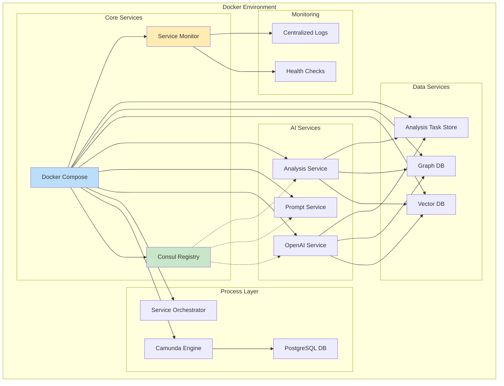
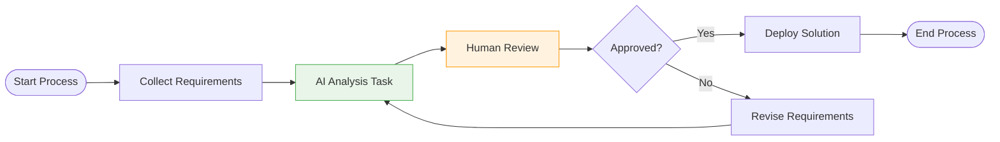

# DADM - Decision Analysis and Decision Management
## Codebase Presentation

# Overview

DADM (Decision Analysis and Decision Management) is an enterprise-grade platform that revolutionizes how organizations approach complex decision-making processes. By combining Business Process Management (BPM), Artificial Intelligence, and Graph Database technologies, DADM provides a comprehensive solution for modeling, executing, and analyzing decision workflows.

The platform enables organizations to:
- **Automate decision workflows** using industry-standard BPMN notation
- **Leverage AI assistance** through OpenAI integration for intelligent analysis
- **Maintain decision traceability** with comprehensive data persistence
- **Scale horizontally** using microservice architecture
- **Deploy easily** with containerized Docker solutions

DADM is particularly valuable for complex organizational decisions involving multiple stakeholders, criteria, and data sources where consistency, auditability, and intelligent analysis are critical requirements.

# Key Features

## 🏗️ BPMN-Driven Workflow Management
- **Industry Standard**: Uses BPMN 2.0 notation for process modeling
- **Visual Process Design**: Create workflows using Camunda Modeler
- **Automatic Deployment**: Deploy models directly from command line
- **Process Monitoring**: Real-time tracking of workflow execution
- **Example**: Emergency response UAS selection with structured decision steps

## 🤖 AI-Augmented Decision Support
- **OpenAI Integration**: Leverages GPT-4 and Assistant API for intelligent analysis
- **Conversation Persistence**: Maintains context across multi-step processes
- **Domain Knowledge**: RAG (Retrieval-Augmented Generation) with file uploads
- **Structured Output**: Generates consistent, documented recommendations
- **Example**: AI analyzes stakeholder requirements and generates alternative evaluations

## 📊 Comprehensive Data Management
- **Triple Storage**: SQLite, Vector Database (Qdrant), and Graph Database (Neo4j)
- **Semantic Search**: Find related decisions using vector similarity
- **Relationship Mapping**: Trace decision factors and dependencies
- **Historical Analysis**: Query past decisions for patterns and insights
- **Task-Level Tracking**: Analysis Task Store captures every workflow step with metadata
- **Example**: Search for all UAS decisions involving budget constraints under $2M

## 📋 Analysis Task Management
- **Automatic Capture**: Every task execution is stored with input/output data
- **Background Processing**: Daemon processes analysis data to multiple storage backends
- **Rich Querying**: Filter by process, service, tags, time ranges, and completion status
- **Thread Continuity**: Maintain OpenAI conversation links for process continuation
- **Example**: Track decision evolution across multi-step emergency response workflows

## 🔧 Microservice Architecture
- **Service Orchestration**: Dynamic routing based on BPMN task properties
- **Consul Service Discovery**: Automatic service registration and health monitoring
- **Horizontal Scaling**: Independent scaling of specialized services
- **Technology Flexibility**: Services can use different languages and frameworks
- **Example**: Separate services for decision analysis, document processing, and data visualization

## 🐳 Enterprise Deployment
- **Docker Containerization**: Complete stack deployment with docker-compose
- **Zero-Configuration Setup**: Automated installation scripts for multiple platforms
- **Production Ready**: Health checks, monitoring, and automatic restart capabilities
- **Database Migration**: Seamless PostgreSQL backend for enterprise scale
- **Example**: Deploy entire DADM stack in under 10 minutes with single command

# Use Cases

## 1. Emergency Response Planning
**Scenario**: Municipal emergency management selecting appropriate response equipment

**Process Flow**:
1. **Frame Decision**: AI analyzes emergency type, affected area, and available resources
2. **Identify Alternatives**: Generate list of suitable response equipment options
3. **Evaluate Criteria**: Assess options against cost, capability, and deployment time
4. **Make Recommendation**: Provide ranked recommendations with implementation plan

**Value**: Reduces decision time from hours to minutes while maintaining audit trail

**Analysis Tracking**: Each decision step is automatically captured in the Analysis Task Store, enabling:
- Review of AI reasoning at each step
- Comparison of similar emergency scenarios
- Continuous improvement of decision criteria
- Complete audit trail for post-incident review

## 2. Technology Investment Decisions
**Scenario**: Enterprise IT department evaluating cloud infrastructure options

**Process Flow**:
1. **Stakeholder Analysis**: Identify requirements from security, operations, and finance teams
2. **Technical Evaluation**: AI processes vendor documentation and capability matrices
3. **Risk Assessment**: Analyze security, compliance, and vendor lock-in factors
4. **Financial Modeling**: Calculate TCO across multiple scenarios

**Value**: Ensures consistent evaluation methodology and comprehensive documentation

## 3. Strategic Business Planning
**Scenario**: Manufacturing company deciding on market expansion opportunities

**Process Flow**:
1. **Market Analysis**: Process industry reports, competitor data, and market research
2. **Resource Assessment**: Evaluate internal capabilities and investment requirements
3. **Risk Evaluation**: Analyze regulatory, economic, and competitive risks
4. **Strategic Recommendation**: Generate prioritized expansion plan with milestones

**Value**: Combines quantitative data with qualitative insights for balanced decisions

## 4. Regulatory Compliance Reviews
**Scenario**: Healthcare organization evaluating new treatment protocols

**Process Flow**:
1. **Regulation Mapping**: AI analyzes current regulations and compliance requirements
2. **Protocol Assessment**: Evaluate proposed protocols against regulatory standards
3. **Risk Analysis**: Identify compliance gaps and mitigation strategies
4. **Implementation Planning**: Create step-by-step compliance roadmap

**Value**: Ensures comprehensive regulatory coverage and reduces compliance risk

## 5. Supply Chain Optimization
**Scenario**: Automotive manufacturer optimizing supplier selection

**Process Flow**:
1. **Requirement Definition**: Capture quality, cost, and delivery requirements
2. **Supplier Evaluation**: AI processes supplier data, certifications, and performance history
3. **Risk Assessment**: Analyze geographic, financial, and operational risks
4. **Portfolio Optimization**: Balance cost, risk, and performance across supplier portfolio

**Value**: Improves decision consistency and enables data-driven supplier relationships

# Architecture

## High-Level System Architecture

```mermaid
graph TB
    subgraph "Presentation Layer"
        UI[Web Interface]
        CLI[Command Line Interface]
        API[REST APIs]
    end
    
    subgraph "Core Orchestration"
        Camunda[Camunda BPMN Engine]
        Orchestrator[🎼 Service Orchestrator<br/>Central Hub]
    end
    
    subgraph "AI Services"
        OpenAI[OpenAI Assistant Service]
        Prompt[Prompt Service]
        RAG[RAG File Manager]
        Analysis[Analysis Service]
    end
    
    subgraph "Support Services"
        Echo[Echo Test Service]
        Monitor[Service Monitor]
        Consul[Service Discovery]
    end
    
    subgraph "Data Layer"
        Postgres[(PostgreSQL)]
        Qdrant[(Vector Database)]
        Neo4j[(Graph Database)]
        SQLite[(Analysis Storage)]
        AnalysisDB[(Analysis Task Store)]
    end
    
    UI --> Camunda
    CLI --> Camunda
    API --> Orchestrator
    
    Camunda --> Postgres
    Camunda <--> Orchestrator
    
    %% Service Orchestrator as central hub
    Orchestrator --> Consul
    Orchestrator --> OpenAI
    Orchestrator --> Prompt
    Orchestrator --> Analysis
    Orchestrator --> Echo
    Orchestrator --> Monitor
    Orchestrator --> AnalysisDB
    
    OpenAI --> RAG
    OpenAI --> Qdrant
    OpenAI --> Neo4j
    OpenAI --> SQLite
    OpenAI --> AnalysisDB
    
    Analysis --> Qdrant
    Analysis --> Neo4j
    Analysis --> SQLite
    Analysis --> AnalysisDB
    
    Monitor --> Consul
    Monitor -.-> OpenAI
    Monitor -.-> Analysis
    Monitor -.-> Echo
    
    style Camunda fill:#e1f5fe
    style Orchestrator fill:#fff3e0,stroke:#ff9800,stroke-width:3px
    style OpenAI fill:#e8f5e8
    style Analysis fill:#e8f5e8
    style Qdrant fill:#f3e5f5
    style Neo4j fill:#e8f5e8
    style AnalysisDB fill:#fff8e1
```



## Core Components

### 🏭 **Camunda BPMN Engine**
- **Purpose**: Workflow orchestration and process execution
- **Technology**: Java-based process engine with REST API
- **Database**: PostgreSQL for enterprise-scale persistence
- **Features**: Process monitoring, task management, workflow deployment

### 🎼 **Service Orchestrator**
- **Purpose**: Dynamic routing of tasks to appropriate services
- **Technology**: Python with caching and connection pooling
- **Features**: Service discovery, load balancing, performance optimization
- **Integration**: BPMN task properties drive service selection

### 🤖 **OpenAI Assistant Service**
- **Purpose**: AI-powered decision analysis and recommendations
- **Technology**: OpenAI GPT-4 with Assistant API
- **Features**: Thread persistence, file uploads, conversation continuity
- **Storage**: Vector embeddings for semantic search

### 📊 **Analysis Service** *(Planned)*
- **Purpose**: Quantitative analysis capabilities for decision workflows
- **Technology**: Python-based analytical engine with statistical libraries
- **Features**: Sensitivity analysis, Monte Carlo simulation, optimization algorithms
- **Integration**: BPMN task routing for computational analysis steps

### 📚 **Data Management Layer**
- **PostgreSQL**: Primary workflow and process instance storage
- **Qdrant**: Vector database for semantic search of decision content
- **Neo4j**: Graph database for relationship mapping and decision traceability
- **SQLite**: Local analysis storage with background processing
- **Analysis Task Store**: Comprehensive task-level analysis tracking and querying

### 🔍 **Service Discovery**
- **Consul**: Dynamic service registry with health monitoring
- **Features**: Automatic registration, failover, load distribution
- **Integration**: All services register with metadata and capabilities

## Deployment Architecture



The architecture emphasizes **modularity**, **scalability**, and **maintainability** through:
- Containerized deployment for consistent environments
- Service-oriented design for independent scaling
- Multiple database types optimized for different data patterns
- Comprehensive monitoring and health management

# Usage Examples

## Basic Process Execution

### Starting a Decision Process
```bash
# Start the OpenAI Decision Process with custom variables
dadm --start-process "OpenAI Decision Process" \
     --variables '{"decision_context": "Emergency UAS Selection", 
                   "budget_limit": 500000, 
                   "response_time": "immediate"}'

# Monitor execution in real-time
dadm --monitor-only
```

### Deploying BPMN Models
```bash
# Deploy all BPMN models to Camunda
dadm deploy all

# Deploy specific model with validation
dadm deploy model emergency_response_process.bpmn

# Validate before deployment
python scripts/validate_bpmn.py --all
```

## Advanced Workflow Management

### Analysis Data Management
```python
# Start background analysis processing
dadm analysis daemon --detach

# Query stored analysis data
dadm analysis list --service openai_assistant --limit 10

# Get detailed analysis for specific process
dadm analysis list --process-id proc_123 --detailed

# Generate OpenAI continuation URL
dadm analysis list --process-id proc_123 --get-openai-url

# Filter by specific criteria
dadm analysis list --tags emergency_response --limit 5

# Check analysis processing status
dadm analysis status

# Process pending analysis tasks manually
dadm analysis process --once
```

### Service Integration Example
```python
# Example service task configuration in BPMN
"""
<bpmn:serviceTask id="AnalyzeDecision" name="AI Decision Analysis">
  <bpmn:extensionElements>
    <camunda:properties>
      <camunda:property name="service.type" value="assistant" />
      <camunda:property name="service.name" value="openai" />
      <camunda:property name="model" value="gpt-4" />
      <camunda:property name="temperature" value="0.3" />
    </camunda:properties>
  </bpmn:extensionElements>
</bpmn:serviceTask>
"""
```

## Docker Stack Management

### Complete Stack Deployment
```bash
# Start all services with single command
dadm docker up -d

# Verify service health
python scripts/quick_test.py

# Monitor service status
dadm docker ps
dadm docker logs openai-service
```

### Development Workflow
```bash
# Setup development environment
chmod +x setup.sh && ./setup.sh

# Run tests
python -m unittest discover -s tests

# Deploy and test workflow
python scripts/test_openai_decision_process.py
```

## API Integration Examples

### Direct Service Calls
```python
import requests

# Call OpenAI service directly
response = requests.post('http://localhost:5000/process', json={
    "task_data": {
        "decision_context": "Technology selection",
        "requirements": ["scalability", "cost-effectiveness", "security"]
    },
    "thread_id": "decision_thread_001"
})

# Use Prompt Service for RAG content
prompt_response = requests.get(
    'http://localhost:5301/prompt/business_analysis/rag-content',
    params={"include_remote": "true"}
)
```

### Query Analysis Data
```python
from src.analysis_data_manager import AnalysisDataManager

# Initialize analysis manager
manager = AnalysisDataManager()

# Search analyses by criteria
analyses = manager.search_analyses(
    service_name="openai_assistant",
    tags=["emergency_response", "uas_selection"],
    limit=5
)

# Get conversation thread
conversation = manager.get_thread_analyses("thread_emergency_001")
```

## Command Line Interface

### Process Management
```bash
# List available processes
dadm --list

# Start process with monitoring
dadm -s "Emergency Response Process" -m

# Check system status
dadm analysis status
```

### Troubleshooting
```bash
# Check service health
python scripts/check_service_status.py

# Verify environment
python scripts/verify_environment.py

# Monitor process execution
python scripts/monitor_process_execution.py -p proc_instance_123
```

These examples demonstrate DADM's flexibility for both simple decision processes and complex enterprise workflows with full traceability and AI assistance.

# Testing

## Test Strategy Overview

DADM implements a comprehensive testing strategy covering multiple layers of the application stack, from individual components to full end-to-end workflows. The testing approach ensures reliability, performance, and maintainability across all system components.

## Test Categories

### 1. Unit Tests
**Purpose**: Validate individual components and functions in isolation

**Coverage**:
- Service orchestrator routing logic
- Data persistence manager operations
- OpenAI assistant integration
- BPMN validation and parsing
- Configuration management

**Key Test Files**:
```bash
tests/test_assistant_manager.py       # OpenAI service validation
tests/test_orchestrator_minimal.py    # Core orchestration logic
tests/test_data_persistence_manager.py # Database operations
tests/test_enhanced_orchestrator.py   # Performance optimizations
```

**Execution**:
```bash
# Run all unit tests
python -m unittest discover -s tests

# Run specific test suite
python -m unittest tests.test_assistant_manager
```

### 2. Integration Tests
**Purpose**: Verify component interactions and service communication

**Coverage**:
- Service orchestrator ↔ Camunda integration
- OpenAI service ↔ Database persistence
- Consul service discovery functionality
- Docker container communication
- Analysis data management pipeline

**Key Test Files**:
```bash
tests/test_orchestrator_integration_final.py  # End-to-end orchestration
tests/test_complete_dadm_workflow.py          # Full workflow validation
scripts/test_end_to_end.py                   # Service integration
```

**Example Integration Test**:
```python
def test_complete_integration():
    """Test service orchestrator with analysis data management"""
    orchestrator = ServiceOrchestrator(debug=True)
    
    # Verify analysis service integration
    assert orchestrator.analysis_service is not None
    
    # Test task routing and storage
    mock_task = MockTask("DecisionAnalysis", "task_001", "process_123")
    properties = orchestrator.extract_service_properties(mock_task)
    
    # Verify analysis storage
    analysis_id = orchestrator.analysis_service.store_task_analysis(...)
    assert analysis_id is not None
```

### 3. Performance Tests
**Purpose**: Validate system performance under load and measure optimizations

**Coverage**:
- Service orchestrator caching effectiveness
- XML parsing performance improvements
- Database query optimization
- Concurrent request handling
- Memory usage patterns

**Test Implementation**:
```python
def test_workflow_sequence_performance():
    """Compare original vs enhanced orchestrator performance"""
    tasks = [MockTask(f"Task{i}", f"process{i}") for i in range(50)]
    
    # Time original implementation
    start = time.time()
    for task in tasks:
        original_orchestrator.route_task(task, variables)
    original_time = time.time() - start
    
    # Time enhanced implementation
    start = time.time()
    for task in tasks:
        enhanced_orchestrator.route_task(task, variables)
    enhanced_time = time.time() - start
    
    improvement = (original_time - enhanced_time) / original_time * 100
    assert improvement > 20  # Require >20% performance improvement
```

### 4. Contract Tests
**Purpose**: Ensure service APIs meet defined contracts and maintain compatibility

**Coverage**:
- REST API endpoint validation
- Service request/response formats
- OpenAI API integration contracts
- Database schema compliance
- Inter-service communication protocols

**API Contract Example**:
```python
def test_openai_service_contract():
    """Validate OpenAI service API contract"""
    response = requests.post('http://localhost:5000/process', json={
        "task_data": {"decision_context": "test"},
        "thread_id": "test_thread"
    })
    
    assert response.status_code == 200
    assert "analysis" in response.json()
    assert "thread_id" in response.json()
    assert "assistant_id" in response.json()
```

### 5. System Tests
**Purpose**: Validate complete system functionality in production-like environment

**Coverage**:
- Full Docker stack deployment
- BPMN process execution end-to-end
- Multi-service workflow coordination
- Database persistence verification
- Service discovery and failover

**System Test Scripts**:
```bash
scripts/test_openai_decision_process.py    # Complete decision workflow
scripts/comprehensive_vector_store_test.py # Vector store integration
scripts/quick_test.py                      # System health validation
```

## Test Execution Framework

### Continuous Integration
```bash
# Pre-commit validation
python scripts/validate_bpmn.py --all
python -m unittest discover -s tests
python scripts/verify_environment.py

# Docker stack testing
dadm docker up -d
python scripts/quick_test.py
python scripts/test_end_to_end.py
```

### Test Data Management
- **Mock Services**: Isolated testing without external dependencies
- **Test Databases**: Separate SQLite instances for test isolation
- **Sample BPMN**: Validated process models for workflow testing
- **Test Files**: RAG content and configuration samples

### Performance Benchmarks
```bash
# Orchestrator performance baseline
python tests/test_enhanced_orchestrator.py

# End-to-end workflow timing
python scripts/test_openai_decision_process.py

# Service response time validation
python scripts/quick_test.py
```

## Test Infrastructure Requirements

### Environment Setup
- **Python 3.10+**: Core testing framework
- **Docker & Docker Compose**: Container testing
- **pytest/unittest**: Test execution frameworks
- **Mock Libraries**: Dependency isolation

### External Dependencies (Optional)
- **OpenAI API Key**: For integration tests with real AI services
- **Consul**: For service discovery testing
- **Databases**: Qdrant and Neo4j for persistence testing

### Continuous Monitoring
- **Health Checks**: Automated service availability testing
- **Performance Monitoring**: Response time and resource usage tracking
- **Error Detection**: Automated failure notification and recovery testing

This comprehensive testing strategy ensures DADM maintains high reliability and performance while supporting rapid development and deployment cycles.

# References

## Official Documentation
- **[DADM Documentation Index](docs/index.md)** - Central hub for all DADM documentation
- **[System Specification](docs/specification.md)** - Comprehensive technical specification
- **[Service Architecture](docs/service_architecture.md)** - Microservice design and implementation
- **[Installation Guide](README.md#installation)** - Complete setup and deployment instructions

## Process Management & BPMN
- **[BPMN Validation & Deployment](docs/BPMN_VALIDATION_DEPLOYMENT.md)** - Best practices for BPMN model management
- **[OpenAI Integration](docs/openai_integration.md)** - AI-assisted decision process implementation
- **[Workflow Completion Detection](docs/WORKFLOW_COMPLETION_DETECTION.md)** - Process monitoring and lifecycle management
- **[OpenAI Decision Process Testing](docs/openai_decision_process_testing.md)** - Comprehensive workflow testing guide

## Service Integration & Development
- **[Implementing Services](docs/IMPLEMENTING_SERVICES.md)** - Complete guide for creating new microservices
- **[Service Integration Guide](docs/service_integration_guide.md)** - Register and integrate services with DADM
- **[Echo Service Tutorial](docs/ECHO_SERVICE_TUTORIAL.md)** - Step-by-step service implementation example
- **[Service Troubleshooting](docs/SERVICE_TROUBLESHOOTING.md)** - Common issues and resolution strategies

## Data Management & Analysis
- **[Analysis Data Management](docs/analysis_data_management.md)** - Comprehensive data persistence architecture
- **[Data Persistence Integration](docs/data_persistence_integration.md)** - Vector store and graph database integration
- **[Analysis Command Reference](docs/analysis_command.md)** - CLI tools for data management and querying
- **[How to View Analysis Data](docs/HOW_TO_VIEW_ANALYSIS_DATA.md)** - Practical guide for data exploration

## Infrastructure & Deployment
- **[Docker Database Setup](docs/docker_database_setup.md)** - Container configuration for databases
- **[Consul Service Discovery](docs/consul_service_discovery.md)** - Service registry and discovery implementation
- **[Environment Variables](docs/environment_variables.md)** - Configuration management across services
- **[Codex Deployment Guide](docs/CODEX_DEPLOYMENT_GUIDE.md)** - Enterprise environment deployment

## Command Line Interface
- **[CLI Cheat Sheet](cli_cheetsheet.md)** - Complete reference for all DADM commands
- **[Docker Command Reference](docs/docker_command.md)** - Container management through DADM CLI
- **[Deploy Command Reference](docs/deploy_command.md)** - BPMN and service deployment automation

## External Technology References
- **[Camunda Platform Documentation](https://docs.camunda.org/)** - BPMN engine and process management
- **[OpenAI API Documentation](https://platform.openai.com/docs/)** - AI integration and assistant API
- **[Neo4j Documentation](https://neo4j.com/docs/)** - Graph database implementation
- **[Qdrant Documentation](https://qdrant.tech/documentation/)** - Vector database and semantic search
- **[Consul Documentation](https://www.consul.io/docs/)** - Service discovery and health monitoring

## Release Information
- **[Release Notes v0.10.0](release_notes_v0.10.0.md)** - Latest features and improvements
- **[Release Summary v0.10.0](RELEASE_v0.10.0_SUMMARY.md)** - Business impact and technical implementation
- **[Version 0.9.0 Summary](RELEASE_v0.9.0_SUMMARY.md)** - Thread persistence and analysis management features

## Development & Testing
- **[Testing Documentation](tests/README.md)** - Test framework and execution guidelines
- **[Scripts Documentation](scripts/README.md)** - Utility scripts and automation tools
- **[Service Monitor Usage](docs/MONITOR_SERVICE_USAGE.md)** - System monitoring and health management

## Configuration References
- **Service Registry Configuration**: `config/service_registry.py`
- **Database Configuration**: `config/database_config.py`
- **OpenAI Configuration**: `config/openai_config.py`
- **Camunda Configuration**: `config/camunda_config.py`

## Community & Support
- **[GitLab Repository](https://gitlab.mgmt.internal/jdehart/dadm)** - Source code and issue tracking
- **Project Maintainer**: John DeHart - Lead Developer and Architect
- **License**: Proprietary and confidential organizational license
- **Support**: Internal organizational support through GitLab issues and documentation

---

# Appendix: Presentation Slides

## Slide 1: Introduction
**DADM - Decision Analysis and Decision Management**

DADM is an enterprise-grade platform that transforms how organizations make complex decisions by combining business process management, artificial intelligence, and advanced data analytics into a unified workflow system.

- Enterprise platform for intelligent decision workflows
- Combines BPM, AI, and Graph Database technologies  
- Automates complex organizational decision processes
- Provides audit trails and decision traceability
- Used for emergency planning, technology selection, strategic decisions

---

## Slide 2: Core Value Proposition
**Why DADM Matters**

Organizations face increasingly complex decisions that require multiple data sources, stakeholder input, and consistent methodology. DADM addresses these challenges by providing a structured, intelligent approach to decision-making.

- **Consistency**: Standardized decision methodology across organization
- **Intelligence**: AI-powered analysis and recommendations
- **Traceability**: Complete audit trail of decision factors and rationale
- **Efficiency**: Reduces decision time while improving quality
- **Scalability**: Handles simple choices to complex multi-stakeholder decisions

---

## Slide 3: Key Features Overview
**Platform Capabilities**

DADM delivers comprehensive decision support through an integrated suite of capabilities designed for enterprise environments, from workflow modeling to AI-powered analysis.

- **BPMN Workflows**: Visual process modeling with industry standards
- **🎼 Service Orchestrator**: Central hub routing all microservice communications
- **AI Integration**: OpenAI GPT-4 for intelligent analysis and recommendations  
- **Data Management**: Vector search, graph relationships, structured storage
- **Analysis Tracking**: Task-level capture with rich querying and filtering
- **Microservices**: Scalable, containerized architecture
- **Enterprise Ready**: Docker deployment, monitoring, health checks

---

## Slide 4: Real-World Use Cases
**Practical Applications**

DADM has been successfully applied across diverse organizational contexts, from emergency response to strategic planning, demonstrating its versatility and practical value.

- **Emergency Response**: Equipment selection for disaster scenarios
- **Technology Investment**: Cloud platform evaluation and selection
- **Strategic Planning**: Market expansion and resource allocation
- **Compliance**: Regulatory review and risk assessment
- **Supply Chain**: Vendor evaluation and portfolio optimization

---

## Slide 5: Architecture Overview
**Technical Foundation**

DADM's architecture follows microservices principles with a central orchestrator managing communication between specialized services, ensuring scalability and maintainability.

**Simplified Architecture:**

```mermaid
graph LR
    UI[User Interface] --> Orchestrator[🎼 Service Orchestrator]
    Orchestrator --> Camunda[Process Engine]
    Orchestrator --> OpenAI[AI Services]
    Orchestrator --> Data[(Data Layer)]
    
    style Orchestrator fill:#fff3e0,stroke:#ff9800,stroke-width:2px
    style Camunda fill:#e1f5fe
    style OpenAI fill:#e8f5e8
    style Data fill:#f3e5f5
```


- **Process Engine**: Camunda BPMN with PostgreSQL persistence
- **🎼 Service Orchestrator**: Central hub routing all microservice communications
- **AI Services**: OpenAI Assistant with conversation persistence
- **Data Layer**: Vector (Qdrant), Graph (Neo4j), Relational (SQLite/PostgreSQL)
- **Service Discovery**: Consul registry with automatic failover
- **Deployment**: Docker Compose with health monitoring

---

## Slide 6: BPMN Workflow Configuration
**Service Task Integration with Camunda**

DADM uses standard BPMN 2.0 workflows with Camunda extension properties to specify how service tasks connect to microservices through the Service Orchestrator.

**Sample BPMN Workflow:**


**Extension Properties for Service Tasks:**
```xml
<bpmn:serviceTask id="ai-analysis" name="AI Analysis">
  <bpmn:extensionElements>
    <camunda:properties>
      <camunda:property name="service.name" value="openai" />
      <camunda:property name="service.type" value="assistant" />
      <camunda:property name="service.operation" value="analyze" />
      <camunda:property name="service.timeout" value="300" />
    </camunda:properties>
  </bpmn:extensionElements>
</bpmn:serviceTask>
```

**How It Works:**
- Service Orchestrator reads extension properties from BPMN tasks
- Routes requests to appropriate microservices based on `service.name`
- Handles different operations within services via `service.type` and `service.operation`
- Manages timeouts and error handling automatically

---

## Slide 7: Service Example - OpenAI Integration
**API Endpoints and Usage**

The OpenAI service demonstrates DADM's microservice approach with clean REST APIs that support complex decision analysis workflows.

**Service Endpoints:**
```
POST /openai/assistant/create
POST /openai/assistant/{id}/message
GET  /openai/assistant/{id}/status
POST /openai/files/upload
GET  /openai/files/{id}
```

**Example Request:**
```json
{
  "message": "Analyze supplier options for emergency equipment",
  "context": {
    "budget": 50000,
    "timeline": "30 days",
    "requirements": ["FDA approved", "rapid deployment"]
  }
}
```

**Response includes:** Analysis, recommendations, confidence scores, and supporting rationale

---

## Slide 8: Business Benefits
**Organizational Impact**

DADM delivers measurable improvements in decision quality and organizational efficiency while building institutional knowledge and ensuring compliance requirements are met.

- **Quality Improvement**: Consistent, well-documented decisions
- **Risk Reduction**: Comprehensive analysis reduces oversight
- **Time Savings**: Automates routine analysis and documentation
- **Knowledge Retention**: Captures institutional decision-making expertise
- **Compliance**: Built-in audit trails and decision justification

---

## Slide 9: Implementation & Deployment
**Getting Started**

DADM is designed for rapid deployment and adoption, with comprehensive tooling and documentation that enables organizations to start small and scale to enterprise-wide usage.

- **Quick Setup**: Single command deployment with Docker
- **Training**: Built-in examples and comprehensive documentation
- **Integration**: REST APIs for existing system connectivity  
- **Support**: Complete CLI tools and monitoring dashboards
- **Scalability**: Start small, scale to enterprise-wide deployment

---

## Slide 10: Technical Readiness
**Production Capabilities**

DADM is built for production environments with comprehensive testing, monitoring, and operational capabilities that ensure reliable performance at enterprise scale.

- **Tested**: Comprehensive unit, integration, and performance testing
- **Monitored**: Health checks, service discovery, automatic recovery
- **Documented**: Complete API documentation and user guides
- **Configurable**: Environment-based configuration for all deployment scenarios
• **Maintainable**: Modular architecture enables independent updates
