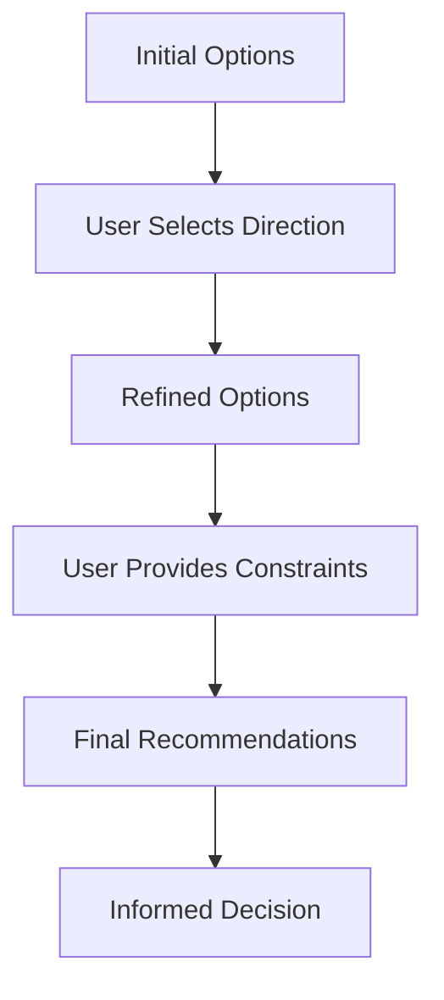

# UI Integration for Ambient Intelligence & Decision Landscapes

## Overview

The DADMS UI must embody the principles of ambient intelligence and decision landscapes, creating an interface where users don't just use the system but exist within an intelligent environment that presents options, not directives.

## Core UI Principles

### 1. **Decision Landscapes as Primary Interaction Pattern**

Every significant user action should present a landscape of options:

```typescript
// Traditional UI Flow
Button: "Create Workflow" → Form → Submit → Result

// DADMS Decision Landscape Flow
Button: "Create Workflow" → Option Landscape → Trade-off Visualization → Informed Selection → Contextual Result
```

### 2. **Ambient Intelligence Manifestation**

The UI should feel alive with intelligence:
- Proactive suggestions based on context
- Options that appear before being requested
- Adaptive interfaces that learn from usage
- Contextual information always available

## Key UI Components

### 1. **DecisionLandscape Component**

Primary component for presenting options:

```typescript
interface DecisionLandscapeProps {
  title: string;
  context: {
    userHistory: string;
    systemState: string;
    projectPhase: string;
  };
  options: DecisionOption[];
  onSelect: (option: DecisionOption, rationale?: string) => void;
  visualizationType?: 'cards' | 'matrix' | 'radar' | 'timeline';
}

interface DecisionOption {
  id: string;
  name: string;
  description: string;
  benefits: string[];
  tradeoffs: string[];
  metrics: {
    speed: number;      // 0-100
    accuracy: number;   // 0-100
    cost: number;       // 0-100
    complexity: number; // 0-100
  };
  recommendedFor: string[];
  confidence: number; // 0-1
}
```

### 2. **OptionCard Component**

Individual option presentation:

```tsx
const OptionCard: React.FC<{ option: DecisionOption }> = ({ option }) => {
  return (
    <Card className="decision-option-card">
      <CardHeader>
        <h3>{option.name}</h3>
        <ConfidenceBadge value={option.confidence} />
      </CardHeader>
      <CardBody>
        <MetricsRadar metrics={option.metrics} />
        <div className="trade-offs">
          <div className="benefits">
            <h4>Benefits</h4>
            {option.benefits.map(b => <li key={b}>✓ {b}</li>)}
          </div>
          <div className="tradeoffs">
            <h4>Trade-offs</h4>
            {option.tradeoffs.map(t => <li key={t}>⚠ {t}</li>)}
          </div>
        </div>
        <RecommendationContext>
          Best for: {option.recommendedFor.join(', ')}
        </RecommendationContext>
      </CardBody>
    </Card>
  );
};
```

### 3. **AmbientContext Component**

Persistent context awareness:

```tsx
const AmbientContext: React.FC = () => {
  const context = useDASContext();
  
  return (
    <div className="ambient-context-bar">
      <ContextIndicator 
        label="Recent Preference" 
        value={context.userPreference} 
      />
      <ContextIndicator 
        label="System Load" 
        value={context.systemLoad} 
      />
      <ContextIndicator 
        label="Project Phase" 
        value={context.projectPhase} 
      />
      <SuggestionPulse 
        active={context.hasProactiveSuggestions}
        onClick={showSuggestions}
      />
    </div>
  );
};
```

## UI Patterns

### 1. **Progressive Option Disclosure**

Start with high-level options, allow drilling down:



### 2. **Trade-off Visualization**

Multiple ways to visualize trade-offs:

#### Radar Chart
- Shows multiple metrics at once
- Easy comparison between options
- Visual balance assessment

#### Trade-off Matrix
- X-axis: Benefit dimension (e.g., speed)
- Y-axis: Cost dimension (e.g., accuracy)
- Options plotted as points
- Pareto frontier highlighted

#### Timeline View
- Shows when benefits/costs materialize
- Important for long-term decisions
- Helps with planning

### 3. **Learning Feedback Loop**

```tsx
const DecisionFeedback: React.FC = ({ decision, outcome }) => {
  return (
    <FeedbackModal>
      <h3>How did this decision work out?</h3>
      <OutcomeScale 
        expected={decision.expectedOutcome}
        actual={outcome}
        onRate={(rating) => {
          // Feed back to DAS for learning
          dasService.recordOutcome(decision.id, rating);
        }}
      />
      <TextArea 
        placeholder="What would you do differently?"
        onSubmit={(feedback) => {
          dasService.recordFeedback(decision.id, feedback);
        }}
      />
    </FeedbackModal>
  );
};
```

## Integration Points

### 1. **With API Gateway**

```typescript
// UI Service Layer
class DecisionService {
  async getOptions(action: string, context: Context): Promise<DecisionLandscape> {
    const response = await apiGateway.post('/decisions/options', {
      action,
      context: {
        ...context,
        uiState: getCurrentUIState(),
        recentInteractions: getRecentInteractions()
      }
    });
    
    return response.data; // Already in decision landscape format
  }
}
```

### 2. **With EventManager**

```typescript
// Real-time option updates
eventManager.on('contextChanged', (newContext) => {
  // Update visible options based on new context
  updateDecisionLandscape(newContext);
});

eventManager.on('optionOutcomeAvailable', (outcome) => {
  // Show how similar past decisions worked out
  showHistoricalOutcome(outcome);
});
```

### 3. **With Process Manager**

```typescript
// Workflow selection with options
const WorkflowSelector: React.FC = () => {
  const [options, setOptions] = useState<WorkflowOption[]>([]);
  
  useEffect(() => {
    processManager.getWorkflowOptions(currentContext)
      .then(setOptions);
  }, [currentContext]);
  
  return (
    <DecisionLandscape
      title="Choose Workflow Approach"
      options={options}
      visualizationType="matrix"
      onSelect={(option) => {
        processManager.startWorkflow(option.id, {
          ...option.parameters,
          selectedRationale: option.rationale
        });
      }}
    />
  );
};
```

## Implementation Priorities

### Phase 1: Foundation (Week 1)
1. Basic DecisionLandscape component
2. Simple option cards with benefits/tradeoffs
3. API integration for option retrieval
4. Basic context awareness

### Phase 2: Visualization (Week 2)
1. Radar chart for metrics
2. Trade-off matrix view
3. Progressive disclosure pattern
4. Historical outcome display

### Phase 3: Intelligence (Week 3)
1. Proactive suggestions
2. Learning feedback loops
3. Context-based adaptation
4. Preference persistence

### Phase 4: Refinement (Week 4)
1. Advanced visualizations
2. Mobile-responsive decision views
3. Accessibility improvements
4. Performance optimization

## Design Guidelines

### Visual Hierarchy
1. **Context** - Subtle but always present
2. **Options** - Clear, comparable presentation
3. **Trade-offs** - Honest, transparent display
4. **Recommendations** - Helpful but not pushy

### Interaction Principles
1. **No forced choices** - Always allow exploration
2. **Reversible decisions** - Show how to change course
3. **Learning system** - Every interaction teaches
4. **Transparent reasoning** - Always explain why

### Color Semantics
- **Green**: Benefits, positive outcomes
- **Amber**: Trade-offs, considerations
- **Blue**: Neutral information, metrics
- **Purple**: AI suggestions, insights
- **Red**: Only for critical warnings

## Success Metrics

1. **Decision Time**: Not minimized, but optimized for quality
2. **Option Exploration**: Users view multiple options before selecting
3. **Satisfaction**: Users feel informed, not overwhelmed
4. **Learning Rate**: System recommendations improve over time
5. **Reversal Rate**: Low rate of decision changes indicates good initial choices

## Conclusion

The DADMS UI is not just an interface - it's the visible manifestation of ambient intelligence. Every interaction should feel like moving through an intelligent environment that understands context, presents options, and learns from choices. The goal is not to make decisions for users but to illuminate the decision space so thoroughly that the right choice becomes clear.