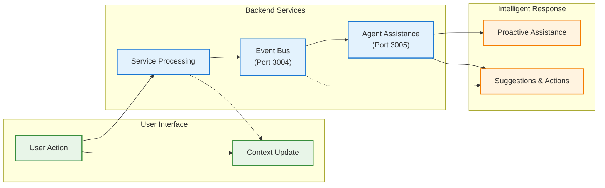

# API Documentation

This directory contains API documentation for all DADMS services.

## Service APIs

### Core Services (Week 1)
- **[Project Service API](project_service_openapi.yaml)** (Port 3001) - **✅ OPERATIONAL: Core project lifecycle management**
  - **[Detailed API Endpoints](../development/backend/project_service_api_endpoints.md)** - Comprehensive documentation with real examples
- **[LLM Service API](llm_service_openapi.yaml)** (Port 3002) - **ENHANCED: Multi-provider & Cost Tracking**
- **[Knowledge Service API](knowledge_service_openapi.yaml)** (Port 3003) - **ENHANCED: RAG & Vector Search**
- **[EventManager Service API](event_manager_service_openapi.yaml)** (Port 3004) - **NEW: Central nervous system**
- **[Agent Assistance Service API](agent_assistance_service_openapi.yaml)** (Port 3005) - **NEW: Intelligent assistant**

### Data & Model Services
- **[Data Manager Service API](data_manager_service_openapi.yaml)** (Port 3009) - **NEW: External data integration**
- **[Model Manager Service API](model_manager_service_openapi.yaml)** (Port 3010) - **NEW: Model registry & lifecycle**
  - **[Detailed API Endpoints](model_manager_api_endpoints.md)** - Human-readable documentation
- **[Simulation Manager Service API](simulation_manager_service_openapi.yaml)** (Port 3011) - **NEW: Simulation orchestration & execution**
  - **[Detailed API Endpoints](simulation_manager_api_endpoints.md)** - Human-readable documentation
- **[Analysis Manager Service API](analysis_manager_service_openapi.yaml)** (Port 3012) - **NEW: Intelligent analysis & decision support**
  - **[Detailed API Endpoints](analysis_manager_api_endpoints.md)** - Human-readable documentation
- **[Parameter Manager Service API](parameter_manager_service_openapi.yaml)** (Port 3013) - **NEW: Parameter lifecycle management & validation**
  - **[Detailed API Endpoints](../development/backend/parameter_manager_service_api_endpoints.md)** - Human-readable documentation
- **[Requirements Extractor & Conceptualizer Service API](requirements_extractor_service_openapi.yaml)** (Port 3014) - **NEW: Intelligent requirements extraction & conceptual modeling**
  - **[Detailed API Endpoints](../development/backend/requirements_extractor_service_api_endpoints.md)** - Human-readable documentation
- **[Memory Manager Service API](memory_manager_service_openapi.yaml)** (Port 3015) - **NEW: Sophisticated memory management with lifecycle intelligence**
  - **[Detailed API Endpoints](../development/backend/memory_manager_service_api_endpoints.md)** - Human-readable documentation
- **[Ontology Workspace Service API](ontology_workspace_service_openapi.yaml)** (Port 3016) - **NEW: Visual, collaborative environment for ontology authoring & validation**
  - **[Detailed API Endpoints](../development/backend/ontology_workspace_service_api_endpoints.md)** - Human-readable documentation
- **[Task Orchestrator Service API](task_orchestrator_service_openapi.yaml)** (Port 3017) - **NEW: Central execution engine for workflow orchestration & task management**
  - **[Detailed API Endpoints](../development/backend/task_orchestrator_service_api_endpoints.md)** - Human-readable documentation
- **[Decision Analytics Service API](decision_analytics_service_openapi.yaml)** (Port 3018) - **NEW: Comprehensive decision intelligence engine for decision space analysis, impact assessment & performance scoring**
  - **[Detailed API Endpoints](../development/backend/decision_analytics_service_api_endpoints.md)** - Human-readable documentation
- **[Error Manager Service API](error_manager_service_openapi.yaml)** (Port 3019) - **NEW: Intelligent error detection, analysis & autonomous correction engine with deep AAS integration**
  - **[Detailed API Endpoints](../development/backend/error_manager_service_api_endpoints.md)** - Human-readable documentation

### Extended Services (Week 2+)
- **[LLM Playground Service API](llm_playground_service_openapi.yaml)** (Port 3006) - **NEW: Interactive LLM testing**
- **[Process Manager Service API](process_manager_service_openapi.yaml)** (Port 3007) - **NEW: BPMN workflow management**
- **[Thread Manager Service API](thread_manager_service_openapi.yaml)** (Port 3008) - **NEW: Process traceability & feedback**

## API Standards

### REST Conventions
- Use standard HTTP methods (GET, POST, PUT, DELETE)
- RESTful URL patterns: `/api/v1/resource` 
- Consistent error response format
- Proper HTTP status codes

### Authentication
- JWT token-based authentication
- Bearer token in Authorization header
- Service-to-service authentication

### Request/Response Format
```json
{
  "data": {},
  "meta": {
    "timestamp": "2025-07-15T13:00:00Z",
    "version": "2.0.0"
  },
  "errors": []
}
```

### OpenAPI Specifications
Each service will include:
- `openapi.yaml` - Complete API specification
- Generated documentation
- Postman collections
- Code examples

## MVP Architecture with Event Bus + AAS

### **Event Bus Service (Port 3004)**
The central nervous system that enables real-time communication between all services:

- **Event Publishing**: All services publish events to the bus
- **Real-time Streaming**: Server-Sent Events for live updates
- **Event History**: Historical event retrieval and filtering
- **Subscriptions**: Webhook-based event delivery
- **Statistics**: Performance monitoring and metrics

### **Agent Assistance Service (Port 3005)**
The intelligent assistant that provides proactive, context-aware help:

- **Context Awareness**: Knows what page user is on and current project
- **Proactive Suggestions**: Offers help without being asked
- **Natural Language**: Conversational interaction with users
- **Action Execution**: Can perform tasks on user's behalf
- **Learning**: Improves based on user feedback and patterns

### **Integration Flow**



## Documentation Status

### Core Services (Week 1)
- [x] **Project Service API** - ✅ COMPLETE (Specification + OpenAPI + Endpoints Doc)
- [x] **LLM Service API** - ✅ ENHANCED
- [x] **Knowledge Service API** - ✅ ENHANCED
- [x] **EventManager Service API** - ✅ COMPLETE
- [x] **Agent Assistance Service API** - ✅ COMPLETE

### Data & Model Services
- [x] **Data Manager Service API** - ✅ COMPLETE
- [x] **Model Manager Service API** - ✅ COMPLETE (OpenAPI + Endpoints Doc)
- [x] **Simulation Manager Service API** - ✅ COMPLETE (OpenAPI + Endpoints Doc)
- [x] **Analysis Manager Service API** - ✅ COMPLETE (OpenAPI + Endpoints Doc)
- [x] **Parameter Manager Service API** - ✅ COMPLETE (OpenAPI + Endpoints Doc)
- [x] **Requirements Extractor & Conceptualizer Service API** - ✅ COMPLETE (OpenAPI + Endpoints Doc)
- [x] **Memory Manager Service API** - ✅ COMPLETE (OpenAPI + Endpoints Doc)
- [x] **Ontology Workspace Service API** - ✅ COMPLETE (OpenAPI + Endpoints Doc)
- [x] **Task Orchestrator Service API** - ✅ COMPLETE (OpenAPI + Endpoints Doc)
- [x] **Decision Analytics Service API** - ✅ COMPLETE (OpenAPI + Endpoints Doc)
- [x] **Error Manager Service API** - ✅ COMPLETE (OpenAPI + Endpoints Doc)

### Extended Services (Week 2+)
- [x] **LLM Playground Service API** - ✅ COMPLETE
- [x] **Process Manager Service API** - ✅ COMPLETE
- [x] **Thread Manager Service API** - ✅ COMPLETE

## Key Features

### **Event-Driven Architecture**
- All services publish events for system-wide visibility
- Real-time event streaming enables live monitoring
- Event history provides audit trail and analysis
- Webhook subscriptions enable service-to-service communication

### **Intelligent Assistance**
- Page context awareness for relevant help
- Proactive suggestions based on user behavior
- Natural language interaction with the system
- Action execution on user's behalf
- Continuous learning and improvement

### **Real-World Examples**

**Scenario 1: User Creates Project**
```
1. User creates project → Project Service publishes "project.created" event
2. Event Bus streams event to all subscribers
3. AAS receives event → Welcomes user with personalized guidance
4. AAS suggests next steps: "Upload documents" or "Create workflow"
```

**Scenario 2: Process Gets Stuck**
```
1. Process Service detects stuck process → Publishes "process.stuck" event
2. AAS receives event → Analyzes logs and context
3. AAS proactively offers: "I detected your process is stuck. Let me fix it for you."
4. User confirms → AAS executes fix action
```

**Scenario 3: User Asks for Help**
```
1. User asks: "What should I do next?"
2. AAS analyzes current context (page, project, recent events)
3. AAS responds: "Based on your UAV project, I recommend starting the cost analysis workflow."
4. AAS offers to execute the action: "Would you like me to start it for you?"
```

## Development Notes

### **Event Bus Implementation**
- Simple but functional for MVP
- PostgreSQL for event persistence
- Redis for real-time streaming
- Webhook delivery for service integration

### **AAS Implementation**
- LLM integration for natural language processing
- Context management for user state
- Action registry for executable tasks
- Learning system for continuous improvement

### **Integration Points**
- All services integrate with Event Bus
- Frontend updates context with AAS
- AAS subscribes to relevant events
- Real-time UI updates via event streaming

*API documentation will be updated as services are implemented during Week 1 development.*
