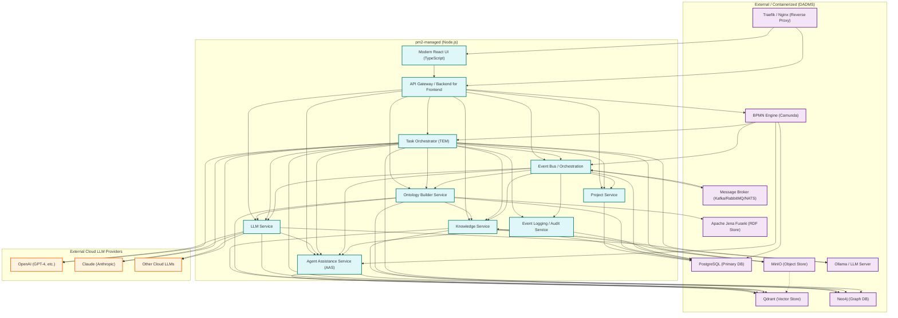

# DADMS 2.0 – Architecture Overview

## Overview

This diagram illustrates the high-level architecture of DADMS 2.0:
- **pm2-managed (blue):** Node.js-based services typically managed by pm2 in local/dev environments.
- **External/Containerized (purple):** Databases, BPMN engine, object stores, RDF store (Apache Jena Fuseki), reverse proxy (Traefik/Nginx), message brokers, and LLM servers (Ollama, etc.) managed outside pm2 (e.g., via Docker Compose, Kubernetes).
- **External Cloud (orange):** Cloud-based LLM providers such as OpenAI, Claude, and others, accessed via API for advanced AI capabilities.
- **Task Orchestrator (TEM):** The core backend service that receives tasks from the BPMN Engine, determines and invokes the appropriate microservice/LLM/tool (local or cloud), manages context/results, and emits events to the Event Bus. It is the critical link between BPMN execution and the rest of the system.
- **Event Bus & Event Log:** The Event Bus handles orchestration and automation, while the Event Log provides audit and traceability. Both are watched by the AAS for oversight and user assistance.
- **AAS Oversight:** The AAS observes all major services, the event bus, and the event log, providing real-time feedback, risk alerts, and recommendations to users.
- **Reverse Proxy:** Traefik or Nginx routes external traffic to the API and UI.
- **Message Broker:** Kafka, RabbitMQ, or NATS can be used for scalable, decoupled event/message handling.
- **RDF Store (Apache Jena Fuseki):** Semantic web triple store for ontology storage, SPARQL queries, and RDF data management.
- **LLM Server (Ollama, etc.):** Pluggable local or remote LLM providers for AI-powered features and orchestration.

**Current Services:**
- **Ontology Builder Service:** For probabilistic extraction, management, and integration of ontologies across domains and projects using LLM teams.

**Future Services (Planned for Extensibility):**
- **Data Management Service:** For connecting, mapping, and synchronizing external, live, or historical datasets.
- **Requirements & Conceptualization Service:** For extracting requirements, constraints, and conceptual models from project documents.
- **Event Management Service:** For advanced event capture, logging, and reaction (beyond the core event bus/log).
- **Modeling & Analysis Service:** For flexible modeling, simulation, optimization, and analytics (e.g., JupyterLab/Hub integration).
- **Other Specialized Services:** As DADMS evolves, additional services may be added for advanced knowledge management, compliance, collaboration, and automation.

**Legend:**
- pm2-managed (Node.js)
- External / Containerized (DADMS)
- External Cloud LLM Providers

This is a living document—details and relationships will be expanded as the system evolves. 