# DADMS 2.0 Architecture Documentation

This directory contains architecture documentation and diagrams for the DADMS 2.0 system.

## Architecture Overview

DADMS 2.0 follows a clean microservices architecture with the following principles:
- **Service Independence**: Each service owns its data and business logic
- **API-First Design**: All interactions through well-defined APIs  
- **Event-Driven Communication**: Loose coupling via event bus
- **Domain-Driven Design**: Services aligned with business domains

## Service Architecture

### Service Architecture & Port Allocation

**Port Allocation:**
- **UI Layer**: 3000 (React UI), 3006 (LLM Playground)
- **Core Services**: 3001 (Project), 3002 (LLM), 3003 (Knowledge), 3005 (AAS)
- **Event System**: 3004 (EventManager)
- **Process Services**: 3007 (Process), 3008 (Thread), 3009 (Data), 3010 (Model), 3011 (Simulation), 3012 (Analysis), 3013 (Parameter), 3014 (Requirements), 3015 (Memory), 3016 (Ontology Workspace), 3017 (Task Orchestrator), 3018 (Decision Analytics), 3019 (Error Manager)
- **Future Services**: 3020+

### Data Architecture

```mermaid
%%{init: { 'flowchart': { 'curve': 'orthogonal' }}}%%
flowchart TD
    subgraph Storage["Storage Layer"]
        PostgreSQL["PostgreSQL<br/>• User/Project Data<br/>• Model Metadata<br/>• Event History<br/>• Audit Logs"]
        Qdrant["Qdrant Vector Store<br/>• Knowledge Embeddings<br/>• Model Embeddings<br/>• Similarity Search<br/>• Semantic Retrieval"]
        Redis["Redis Cache<br/>• Session Storage<br/>• Event Queues<br/>• Temporary Data<br/>• Rate Limiting"]
        MinIO["MinIO Object Store<br/>• Model Artifacts<br/>• Document Files<br/>• Large Binary Data<br/>• Backup Storage"]
        Neo4j["Neo4j Graph DB<br/>• Model Lineage<br/>• Knowledge Graphs<br/>• Dependency Tracking<br/>• Relationship Analysis"]
    end
    
    subgraph Services["Service Data Patterns"]
        ProjectService --> PostgreSQL
        KnowledgeService --> PostgreSQL
        KnowledgeService --> Qdrant
        KnowledgeService --> MinIO
        ModelManager --> PostgreSQL
        ModelManager --> MinIO
        ModelManager --> Neo4j
        ModelManager --> Qdrant
        SimulationManager --> PostgreSQL
        SimulationManager --> MinIO
        SimulationManager --> Redis
        ParameterManager --> PostgreSQL
        ParameterManager --> Redis
        ParameterManager --> Neo4j
        AnalysisManager --> PostgreSQL
        AnalysisManager --> MinIO
        AnalysisManager --> Redis
        AnalysisManager --> Qdrant
        AnalysisManager --> Neo4j
        EventManager --> PostgreSQL
        EventManager --> Redis
        AAS --> Qdrant
        AAS --> Neo4j
        RequirementsExtractor --> PostgreSQL
        RequirementsExtractor --> Qdrant
        RequirementsExtractor --> Neo4j
        RequirementsExtractor --> MinIO
        MemoryManager --> PostgreSQL
        MemoryManager --> Qdrant
        MemoryManager --> Redis
        MemoryManager --> MinIO
        OntologyWorkspace --> PostgreSQL
        OntologyWorkspace --> MinIO
        OntologyWorkspace --> Redis
        TaskOrchestrator --> PostgreSQL
        TaskOrchestrator --> Redis
        TaskOrchestrator --> MinIO
        DecisionAnalytics --> PostgreSQL
        DecisionAnalytics --> Qdrant
        DecisionAnalytics --> Redis
        DecisionAnalytics --> Neo4j
        DecisionAnalytics --> MinIO
        ErrorManager --> PostgreSQL
        ErrorManager --> Redis
        ErrorManager --> MinIO
    end
    
    classDef primary fill:#e3f2fd,stroke:#1976d2,stroke-width:2px;
    classDef vector fill:#e8f5e8,stroke:#388e3c,stroke-width:2px;
    classDef cache fill:#fff3e0,stroke:#f57c00,stroke-width:2px;
    classDef object fill:#f3e5f5,stroke:#7b1fa2,stroke-width:2px;
    classDef graphdb fill:#ffebee,stroke:#d32f2f,stroke-width:2px;
    classDef service fill:#f5f5f5,stroke:#616161,stroke-width:1px;
    
    class PostgreSQL primary;
    class Qdrant vector;
    class Redis cache;
    class MinIO object;
    class Neo4j graphdb;
    class ProjectService,KnowledgeService,ModelManager,SimulationManager,AnalysisManager,EventManager,AAS service;
```

## Service Specifications

### Core Services (Implemented)
- **[Project Service](./project_service_specification.md)** - ✅ **OPERATIONAL** - Project lifecycle management for decision intelligence workflows with React UI integration
- **[Agent Assistance Service (AAS)](./agent_assistance_service_specification.md)** - 📋 **SPECIFICATION** - Proactive, context-aware intelligent assistant (Port 3005)
- **[LLM Playground Service](./llm_playground_service_specification.md)** - 📋 **SPECIFICATION** - Interactive LLM testing and experimentation platform (Port 3006)
- **[Context Manager Service](./context_manager_service_specification.md)** - 📋 **SPECIFICATION** - Comprehensive AI context management with personas, teams, tools, and prompt templates (Port 3020)
- **[BPMN Workspace Service](./bpmn_workspace_service_specification.md)** - 📋 **SPECIFICATION** - AI-enhanced BPMN workflow design environment with collaboration and validation (Port 3021)
- **[EventManager Service](./event_manager_specification.md)** - Central event processing and distribution hub
- **[Data Manager Service](./data_manager_specification.md)** - External data ingestion and processing gateway
- **[Model Manager Service](./model_manager_specification.md)** - Computational model registry and lifecycle management
- **[Simulation Manager Service](./simulation_manager_specification.md)** - Scalable simulation execution and orchestration hub
- **[Analysis Manager Service](./analysis_manager_specification.md)** - Intelligent evaluation and decision-support analytics hub
- **[Parameter Manager Service](./parameter_manager_specification.md)** - Centralized parameter lifecycle management and validation hub
- **[Requirements Extractor & Conceptualizer Service](./requirements_extractor_specification.md)** - Intelligent automation for requirements extraction and conceptual modeling
- **[Memory Manager Service](./memory_manager_specification.md)** - Sophisticated memory management with categorization, lifecycle intelligence, and semantic retrieval
- **[Ontology Workspace Service](./ontology_workspace_specification.md)** - Visual, collaborative environment for authoring, editing, and validating ontologies
- **[Task Orchestrator Service](./task_orchestrator_specification.md)** - Central execution engine for workflow orchestration and task management across the EDS ecosystem
- **[Decision Analytics Service](./decision_analytics_specification.md)** - Comprehensive decision intelligence engine for decision space analysis, impact assessment, and performance scoring
- **[Error Manager Service](./error_manager_specification.md)** - Intelligent error detection, analysis, and autonomous correction engine with deep AAS integration

### Future Services (Planned)
- **OntologyManager Service** - Domain knowledge and semantic modeling
- **ProcessManager Service** - Business process workflow management

## Documentation Contents

### System Diagrams
- [x] **[Architecture Overview](./DADMS_ARCHITECTURE_OVERVIEW.md)** - High-level system architecture
- [x] **[EventManager Diagrams](./event_manager_diagrams.md)** - Event-driven system patterns
- [ ] **Service Dependency Map**: How services interact
- [ ] **Data Flow Diagrams**: Information flow through system
- [ ] **Deployment Architecture**: Infrastructure and containers
- [ ] **Security Model**: Authentication and authorization flow

### Architecture Decisions
- [ ] **ADR-001**: Microservices vs Monolith
- [ ] **ADR-002**: Database per Service Pattern  
- [ ] **ADR-003**: Event-Driven Communication
- [ ] **ADR-004**: Technology Stack Selection

### Design Patterns
- [ ] **Clean Architecture**: Service layer organization
- [ ] **Repository Pattern**: Data access abstraction
- [ ] **Command Query Responsibility Segregation (CQRS)**: Read/write separation
- [ ] **Event Sourcing**: Audit trail and state reconstruction

### Integration Patterns
- [ ] **API Gateway Pattern**: External API access
- [ ] **Circuit Breaker**: Fault tolerance
- [ ] **Saga Pattern**: Distributed transactions
- [ ] **Outbox Pattern**: Reliable event publishing

## Technology Stack

### Backend Services
- **Runtime**: Node.js 18+ with TypeScript
- **Framework**: Express.js with middleware
- **Testing**: Jest for unit/integration tests
- **Documentation**: OpenAPI/Swagger

### Databases
- **PostgreSQL**: Relational data (projects, users, tasks)
- **Qdrant**: Vector embeddings (knowledge, search)
- **Redis**: Caching and session storage

### Infrastructure  
- **Containerization**: Docker with multi-stage builds
- **Orchestration**: Docker Compose (dev), Kubernetes (prod)
- **Monitoring**: Prometheus, Grafana, health checks
- **CI/CD**: GitHub Actions with automated testing

### Frontend
- **Framework**: React 18 with TypeScript
- **State Management**: Zustand or React Query
- **UI Components**: Material-UI or Chakra UI
- **Testing**: React Testing Library

## Quality Attributes

### Performance
- **Response Time**: < 200ms for API calls
- **Throughput**: 1000+ requests/minute per service
- **Scalability**: Horizontal scaling with load balancing

### Reliability
- **Availability**: 99.9% uptime target
- **Fault Tolerance**: Circuit breakers and retries
- **Data Consistency**: ACID transactions where needed

### Security
- **Authentication**: JWT tokens with refresh
- **Authorization**: Role-based access control (RBAC)
- **Data Protection**: Encryption at rest and in transit

### Maintainability
- **Code Quality**: ESLint, Prettier, TypeScript
- **Testing**: > 80% code coverage
- **Documentation**: Comprehensive API and architecture docs

---

*Architecture documentation will be expanded as the system is developed during Week 1 implementation.*
