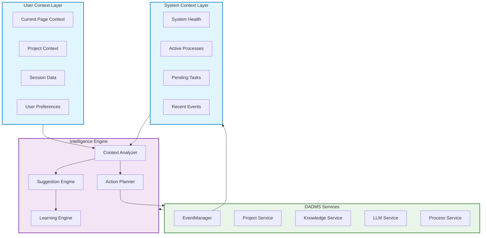
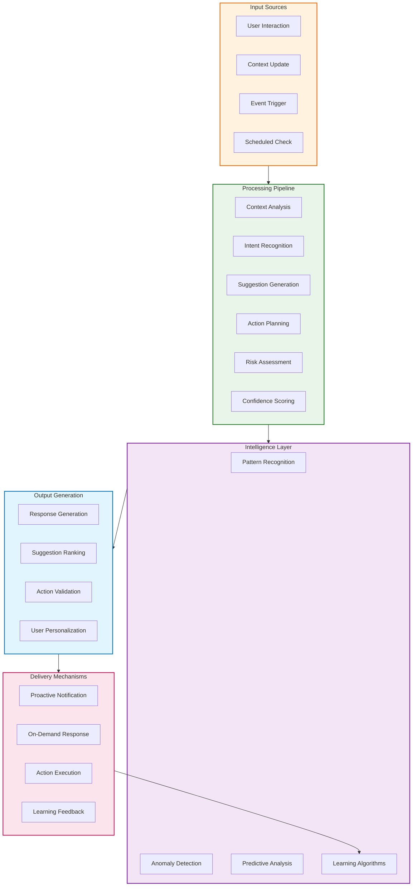
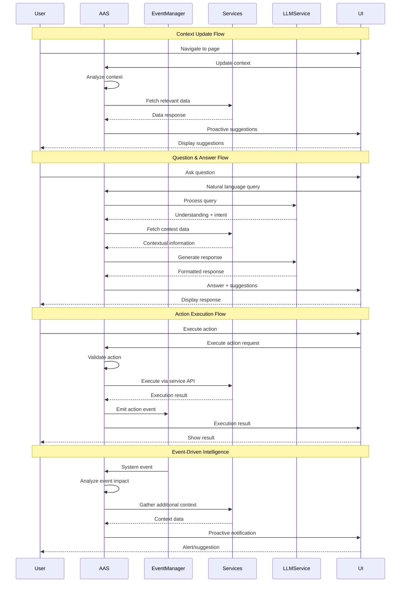
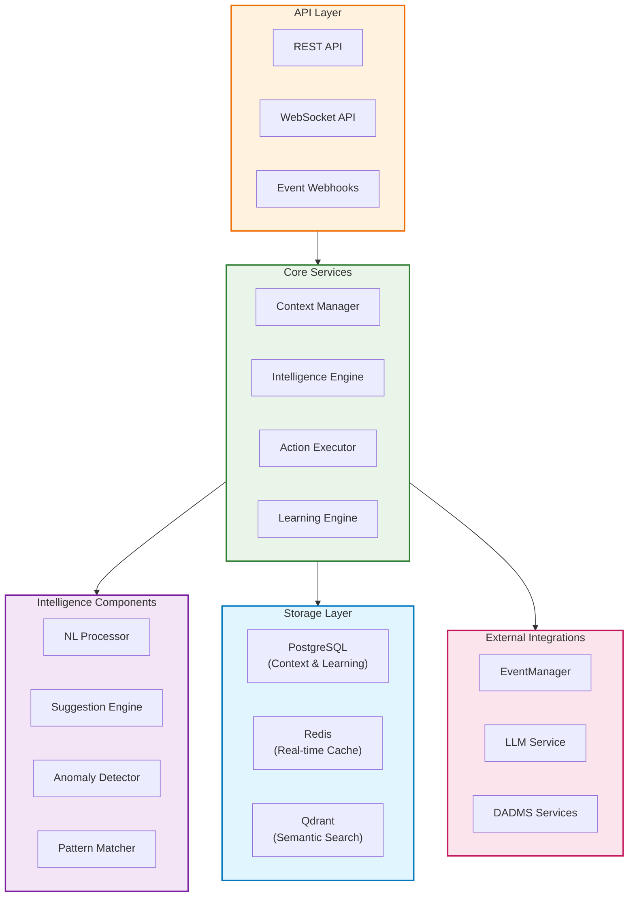

# DADMS 2.0 - Agent Assistance Service (AAS) Specification

## Executive Summary

The Agent Assistance Service (AAS) is a proactive, context-aware intelligent assistant within DADMS 2.0's Event-Driven System (EDS). Unlike the documentation-focused AADS, AAS provides real-time assistance, monitors user context, offers suggestions, and can execute actions on behalf of users to enhance productivity and decision-making efficiency.

**Current Status**: 📋 **SPECIFICATION** - Ready for implementation  
**Port**: 3006  
**Version**: 1.0.0

## Purpose & Responsibilities

### Core Intelligence & Assistance
- **Context Awareness**: Monitor user navigation, project context, and system state
- **Proactive Suggestions**: Provide intelligent recommendations based on current context
- **Natural Language Interface**: Accept and respond to user questions in natural language
- **Action Execution**: Execute authorized actions on behalf of users
- **Learning & Adaptation**: Learn from user feedback to improve assistance quality

### Integration & Event Processing
- **Event Monitoring**: Subscribe to EventManager events for proactive assistance triggers
- **Service Integration**: Interface with all DADMS services for comprehensive assistance
- **Real-time Response**: Provide immediate assistance and system insights
- **User Preference Management**: Adapt assistance level to user preferences

### System Intelligence
- **Anomaly Detection**: Detect stuck processes, performance issues, and system problems
- **Workflow Optimization**: Suggest workflow improvements and automation opportunities
- **Knowledge Discovery**: Recommend relevant documents and insights from knowledge base
- **Decision Support**: Provide context-aware decision-making assistance

## Core Concepts & Data Models

### Context Management Architecture



### Data Models

#### Core Context Models
```typescript
interface AASContext {
    // User Context
    user_id: string;
    current_page: string;
    current_project?: string;
    session_start: Date;
    actions_taken: string[];
    time_on_page: number;
    
    // System Context
    system_state: SystemState;
    recent_events: Event[];
    active_processes: ProcessInfo[];
    
    // User Preferences
    assistance_level: 'minimal' | 'moderate' | 'proactive';
    notification_preferences: string[];
    learning_enabled: boolean;
    
    // Temporal Context
    timestamp: Date;
    context_version: number;
}

interface SystemState {
    active_processes: number;
    pending_tasks: number;
    system_health: 'healthy' | 'degraded' | 'unhealthy';
    service_status: Record<string, 'online' | 'offline' | 'degraded'>;
    performance_metrics: PerformanceMetrics;
}

interface PerformanceMetrics {
    response_time_avg: number;
    error_rate: number;
    throughput: number;
    resource_usage: ResourceUsage;
}

interface ResourceUsage {
    cpu_percent: number;
    memory_percent: number;
    disk_usage: number;
    network_io: number;
}
```

#### Suggestion & Action Models
```typescript
interface AASSuggestion {
    id: string;
    title: string;
    description: string;
    action_type: 'info' | 'suggestion' | 'warning' | 'critical' | 'action';
    priority: 'low' | 'medium' | 'high' | 'critical';
    confidence: number; // 0.0 - 1.0
    
    // Action Properties
    can_execute: boolean;
    action_id?: string;
    requires_confirmation: boolean;
    estimated_time: number; // seconds
    
    // Context
    context_source: string[];
    relevance_score: number;
    expiry_time?: Date;
    
    // Metadata
    created_at: Date;
    category: string;
    tags: string[];
}

interface AASAction {
    id: string;
    name: string;
    description: string;
    category: 'navigation' | 'process' | 'data' | 'knowledge' | 'system';
    
    // Execution Properties
    parameters: Record<string, any>;
    requires_confirmation: boolean;
    estimated_time: number;
    permissions_required: string[];
    
    // Safety & Validation
    reversible: boolean;
    risk_level: 'low' | 'medium' | 'high';
    validation_rules: ValidationRule[];
    
    // Metadata
    implementation: string; // service.method
    documentation_url?: string;
    last_used?: Date;
    success_rate: number;
}

interface ValidationRule {
    rule_type: 'parameter' | 'context' | 'permission' | 'state';
    condition: string;
    error_message: string;
}
```

#### Learning & Analytics Models
```typescript
interface LearningData {
    user_id: string;
    interaction_type: 'suggestion_accepted' | 'suggestion_dismissed' | 'action_executed' | 'question_asked';
    context_snapshot: AASContext;
    outcome: 'successful' | 'failed' | 'neutral';
    user_rating?: number; // 1-5
    feedback_text?: string;
    timestamp: Date;
}

interface UserProfile {
    user_id: string;
    assistance_preferences: AssistancePreferences;
    usage_patterns: UsagePattern[];
    skill_level: SkillLevel;
    frequent_tasks: string[];
    preferred_workflows: string[];
    learning_insights: LearningInsight[];
}

interface AssistancePreferences {
    proactivity_level: number; // 0.0 - 1.0
    notification_frequency: 'minimal' | 'normal' | 'frequent';
    explanation_detail: 'brief' | 'detailed';
    auto_execute_permissions: string[];
    quiet_hours: TimeRange[];
}

interface UsagePattern {
    pattern_type: 'daily' | 'weekly' | 'project_based';
    time_distribution: Record<string, number>;
    common_sequences: string[][];
    peak_activity_hours: number[];
}

interface LearningInsight {
    insight_type: 'preference' | 'pattern' | 'efficiency' | 'error';
    description: string;
    confidence: number;
    impact_score: number;
    applied_date: Date;
}
```

### Intelligent Processing Pipeline



## API Specification

### Core AAS Interface
```typescript
interface AASService {
    // Context Management
    updateContext(context: AASContextUpdate): Promise<ContextResponse>;
    getContext(userId: string): Promise<AASContext>;
    
    // Natural Language Interface
    askAssistant(question: string, context: AASContext): Promise<AssistantResponse>;
    
    // Proactive Assistance
    getProactiveSuggestions(context: AASContext, filters?: SuggestionFilters): Promise<AASSuggestion[]>;
    
    // Action Execution
    executeAction(actionId: string, parameters: Record<string, any>, context: AASContext): Promise<ActionResult>;
    validateAction(actionId: string, parameters: Record<string, any>, context: AASContext): Promise<ValidationResult>;
    
    // Learning & Feedback
    provideFeedback(feedback: UserFeedback): Promise<LearningResponse>;
    getUserProfile(userId: string): Promise<UserProfile>;
    
    // System Intelligence
    getSystemInsights(context: AASContext): Promise<SystemInsight[]>;
    detectAnomalies(context: AASContext): Promise<AnomalyReport[]>;
    
    // Configuration
    updatePreferences(userId: string, preferences: AssistancePreferences): Promise<void>;
    getAvailableActions(context: AASContext): Promise<AASAction[]>;
}
```

### Request/Response Models
```typescript
interface AASContextUpdate {
    current_page: string;
    current_project?: string;
    session_data?: SessionData;
    user_preferences?: Partial<AssistancePreferences>;
    system_events?: Event[];
}

interface ContextResponse {
    context_updated: boolean;
    proactive_suggestions: AASSuggestion[];
    system_insights: SystemInsight[];
    recommendations: string[];
    timestamp: Date;
}

interface AssistantResponse {
    answer: string;
    confidence: number;
    suggestions: AASSuggestion[];
    actions: AASAction[];
    context_used: string[];
    response_time: number;
    follow_up_questions?: string[];
}

interface ActionResult {
    action_executed: boolean;
    action_id: string;
    result: any;
    message: string;
    execution_time: number;
    side_effects: SideEffect[];
    next_suggestions: AASSuggestion[];
}

interface UserFeedback {
    feedback_type: 'suggestion_helpful' | 'suggestion_not_helpful' | 'action_successful' | 'action_failed' | 'correction';
    target_id: string; // suggestion_id or action_id
    rating?: number; // 1-5
    comment?: string;
    context: AASContext;
}
```

## Integration Architecture

### Service Integration Flow



### Event-Driven Integration

#### Event Subscriptions
```typescript
interface AASEventSubscriptions {
    // System Events
    system_health_degraded: (event: SystemHealthEvent) => void;
    service_offline: (event: ServiceOfflineEvent) => void;
    performance_threshold_exceeded: (event: PerformanceEvent) => void;
    
    // Process Events
    process_stuck: (event: ProcessStuckEvent) => void;
    process_completed: (event: ProcessCompletedEvent) => void;
    task_failed: (event: TaskFailedEvent) => void;
    
    // User Events
    user_idle: (event: UserIdleEvent) => void;
    user_stuck: (event: UserStuckEvent) => void;
    project_created: (event: ProjectCreatedEvent) => void;
    
    // Knowledge Events
    document_uploaded: (event: DocumentUploadedEvent) => void;
    knowledge_updated: (event: KnowledgeUpdatedEvent) => void;
    
    // Decision Events
    decision_point_reached: (event: DecisionPointEvent) => void;
    analysis_completed: (event: AnalysisCompletedEvent) => void;
}
```

#### Event Response Patterns
```typescript
interface EventResponseHandler {
    analyzeEvent(event: Event): EventAnalysis;
    generateSuggestions(analysis: EventAnalysis): AASSuggestion[];
    determineUrgency(event: Event): 'low' | 'medium' | 'high' | 'critical';
    createProactiveResponse(event: Event): ProactiveResponse;
}

interface EventAnalysis {
    event_type: string;
    impact_assessment: ImpactAssessment;
    affected_users: string[];
    suggested_actions: string[];
    context_implications: ContextImplication[];
}

interface ProactiveResponse {
    notification_type: 'silent' | 'subtle' | 'prominent' | 'urgent';
    message: string;
    suggested_actions: AASAction[];
    auto_execute_candidates: string[];
    escalation_threshold: number;
}
```

## Implementation Architecture

### Service Architecture



### Database Schema

#### PostgreSQL Schema
```sql
-- AAS Context Management
CREATE TABLE aas_contexts (
    id UUID PRIMARY KEY DEFAULT uuid_generate_v4(),
    user_id UUID NOT NULL,
    current_page VARCHAR(255),
    current_project UUID,
    session_start TIMESTAMP WITH TIME ZONE,
    session_data JSONB,
    system_state JSONB,
    user_preferences JSONB,
    created_at TIMESTAMP WITH TIME ZONE DEFAULT NOW(),
    updated_at TIMESTAMP WITH TIME ZONE DEFAULT NOW(),
    
    FOREIGN KEY (user_id) REFERENCES users(id),
    FOREIGN KEY (current_project) REFERENCES projects(id)
);

-- AAS Suggestions
CREATE TABLE aas_suggestions (
    id UUID PRIMARY KEY DEFAULT uuid_generate_v4(),
    user_id UUID NOT NULL,
    title VARCHAR(255) NOT NULL,
    description TEXT,
    action_type VARCHAR(50),
    priority VARCHAR(20),
    confidence DECIMAL(3,2),
    can_execute BOOLEAN DEFAULT FALSE,
    action_id VARCHAR(255),
    context_source JSONB,
    relevance_score DECIMAL(3,2),
    expiry_time TIMESTAMP WITH TIME ZONE,
    status VARCHAR(50) DEFAULT 'active',
    created_at TIMESTAMP WITH TIME ZONE DEFAULT NOW(),
    user_response VARCHAR(50), -- accepted, dismissed, executed
    responded_at TIMESTAMP WITH TIME ZONE,
    
    FOREIGN KEY (user_id) REFERENCES users(id)
);

-- AAS Actions
CREATE TABLE aas_actions (
    id VARCHAR(255) PRIMARY KEY,
    name VARCHAR(255) NOT NULL,
    description TEXT,
    category VARCHAR(100),
    parameters JSONB,
    requires_confirmation BOOLEAN DEFAULT TRUE,
    estimated_time INTEGER, -- seconds
    permissions_required JSONB,
    reversible BOOLEAN DEFAULT FALSE,
    risk_level VARCHAR(20),
    validation_rules JSONB,
    implementation VARCHAR(255),
    success_rate DECIMAL(3,2) DEFAULT 0.00,
    usage_count INTEGER DEFAULT 0,
    created_at TIMESTAMP WITH TIME ZONE DEFAULT NOW(),
    updated_at TIMESTAMP WITH TIME ZONE DEFAULT NOW()
);

-- Learning Data
CREATE TABLE aas_learning_data (
    id UUID PRIMARY KEY DEFAULT uuid_generate_v4(),
    user_id UUID NOT NULL,
    interaction_type VARCHAR(50),
    target_id VARCHAR(255), -- suggestion_id or action_id
    context_snapshot JSONB,
    outcome VARCHAR(50),
    user_rating INTEGER CHECK (user_rating >= 1 AND user_rating <= 5),
    feedback_text TEXT,
    created_at TIMESTAMP WITH TIME ZONE DEFAULT NOW(),
    
    FOREIGN KEY (user_id) REFERENCES users(id)
);

-- User Profiles
CREATE TABLE aas_user_profiles (
    user_id UUID PRIMARY KEY,
    assistance_preferences JSONB,
    usage_patterns JSONB,
    skill_level VARCHAR(50),
    frequent_tasks JSONB,
    preferred_workflows JSONB,
    learning_insights JSONB,
    created_at TIMESTAMP WITH TIME ZONE DEFAULT NOW(),
    updated_at TIMESTAMP WITH TIME ZONE DEFAULT NOW(),
    
    FOREIGN KEY (user_id) REFERENCES users(id)
);

-- Indexes for performance
CREATE INDEX idx_aas_contexts_user_id ON aas_contexts(user_id);
CREATE INDEX idx_aas_contexts_current_project ON aas_contexts(current_project);
CREATE INDEX idx_aas_contexts_updated_at ON aas_contexts(updated_at);

CREATE INDEX idx_aas_suggestions_user_id ON aas_suggestions(user_id);
CREATE INDEX idx_aas_suggestions_status ON aas_suggestions(status);
CREATE INDEX idx_aas_suggestions_priority ON aas_suggestions(priority);
CREATE INDEX idx_aas_suggestions_created_at ON aas_suggestions(created_at);

CREATE INDEX idx_aas_learning_data_user_id ON aas_learning_data(user_id);
CREATE INDEX idx_aas_learning_data_interaction_type ON aas_learning_data(interaction_type);
CREATE INDEX idx_aas_learning_data_created_at ON aas_learning_data(created_at);
```

### Performance Considerations

#### Caching Strategy
```typescript
interface CacheStrategy {
    // User Context Caching
    user_context: {
        cache_duration: '5 minutes';
        invalidation_triggers: ['context_update', 'session_end'];
        compression: true;
    };
    
    // Suggestion Caching
    suggestions: {
        cache_duration: '2 minutes';
        invalidation_triggers: ['context_change', 'action_executed'];
        max_cached_suggestions: 20;
    };
    
    // Action Metadata Caching
    actions: {
        cache_duration: '1 hour';
        invalidation_triggers: ['action_definition_updated'];
        preload_common_actions: true;
    };
    
    // Learning Insights Caching
    learning_insights: {
        cache_duration: '30 minutes';
        invalidation_triggers: ['new_feedback_received'];
        batch_updates: true;
    };
}
```

#### Real-time Processing
- **WebSocket connections** for instant suggestion delivery
- **Event stream processing** for real-time system monitoring
- **Background job processing** for learning algorithm updates
- **Connection pooling** for database and service interactions

## Security & Access Control

### Security Framework
```typescript
interface AASSecurityFramework {
    authentication: {
        method: 'JWT_Bearer';
        token_validation: 'real_time';
        session_management: 'stateless';
    };
    
    authorization: {
        context_access: 'user_scoped';
        action_permissions: 'role_based';
        suggestion_filtering: 'permission_aware';
    };
    
    data_protection: {
        context_encryption: 'at_rest';
        pii_anonymization: 'learning_data';
        retention_policy: '90_days_context';
    };
    
    audit_logging: {
        all_interactions: true;
        action_execution: 'detailed';
        privacy_events: 'strict';
    };
}
```

### Action Security Model
```typescript
interface ActionSecurity {
    risk_assessment: {
        automatic_execution_threshold: 'low_risk_only';
        confirmation_required: 'medium_and_high_risk';
        admin_approval_required: 'critical_actions';
    };
    
    validation_layers: [
        'parameter_validation',
        'permission_check',
        'context_appropriateness',
        'impact_assessment',
        'user_confirmation'
    ];
    
    execution_safeguards: {
        rollback_capability: 'reversible_actions';
        execution_timeout: 30; // seconds
        concurrent_action_limit: 3;
        rate_limiting: '10_per_minute';
    };
}
```

## Implementation Roadmap

### Phase 1: Core Foundation (Weeks 1-2)
- [ ] **Basic AAS Service Setup**
  - Express.js service on port 3006
  - Database schema implementation
  - Basic authentication and authorization
  - Health check and service discovery

- [ ] **Context Management**
  - Context collection and storage
  - Basic context analysis
  - User preference management
  - Session tracking

- [ ] **Simple Assistance**
  - Basic natural language processing
  - Static suggestion generation
  - Simple action execution framework
  - Basic logging and monitoring

### Phase 2: Intelligence & Integration (Weeks 3-4)
- [ ] **Event-Driven Intelligence**
  - EventManager integration
  - Event processing pipeline
  - Proactive suggestion generation
  - Real-time context updates

- [ ] **Service Integration**
  - Integration with all DADMS services
  - Action execution across services
  - Cross-service data correlation
  - Error handling and recovery

- [ ] **Learning Foundation**
  - Basic feedback collection
  - Simple pattern recognition
  - User preference learning
  - Performance tracking

### Phase 3: Advanced Intelligence (Weeks 5-6)
- [ ] **Advanced Analytics**
  - Anomaly detection
  - Predictive analysis
  - Pattern matching
  - Behavior modeling

- [ ] **Sophisticated Learning**
  - Machine learning integration
  - Personalization algorithms
  - Success rate optimization
  - Adaptive suggestion ranking

- [ ] **Advanced Features**
  - Multi-step action planning
  - Workflow optimization suggestions
  - Knowledge discovery assistance
  - Decision support intelligence

### Phase 4: Production Optimization (Weeks 7-8)
- [ ] **Performance Optimization**
  - Caching implementation
  - Database optimization
  - Real-time processing tuning
  - Load testing and optimization

- [ ] **Security & Compliance**
  - Security audit and hardening
  - Privacy compliance implementation
  - Audit logging enhancement
  - Access control refinement

- [ ] **UI Integration & Polish**
  - Enhanced UI component integration
  - Real-time notification system
  - Mobile-responsive assistance
  - Accessibility compliance

## Success Metrics

### Performance Targets
- **Response Time**: < 200ms for context updates, < 2s for complex questions
- **Suggestion Accuracy**: > 75% user acceptance rate
- **Action Success Rate**: > 95% successful action execution
- **Learning Effectiveness**: 20% improvement in suggestion relevance over 30 days

### User Experience Goals
- **Proactive Assistance**: Provide helpful suggestions without being intrusive
- **Natural Interaction**: Support conversational queries with high understanding
- **Trust & Reliability**: Maintain user confidence through consistent, accurate assistance
- **Productivity Enhancement**: Demonstrable time savings and efficiency improvements

### System Integration
- **Event Processing**: Handle 1000+ events/second with sub-100ms processing
- **Service Coordination**: Seamless integration with all DADMS services
- **Scalability**: Support 100+ concurrent users with consistent performance
- **Reliability**: 99.9% uptime with graceful degradation capabilities

---

The Agent Assistance Service transforms DADMS from a passive decision support system into an intelligent, proactive partner that anticipates user needs, provides contextual assistance, and continuously learns to become more effective over time. 