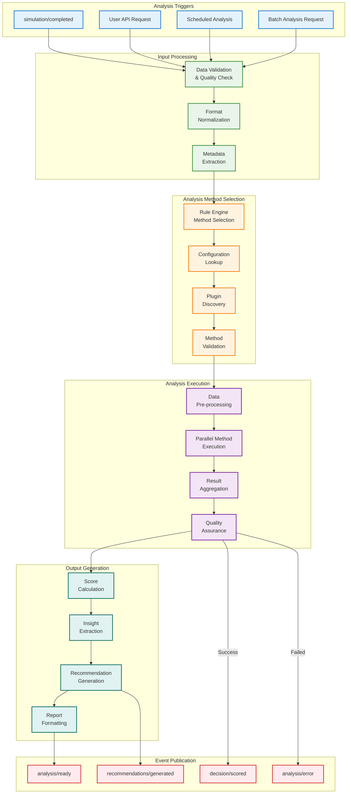
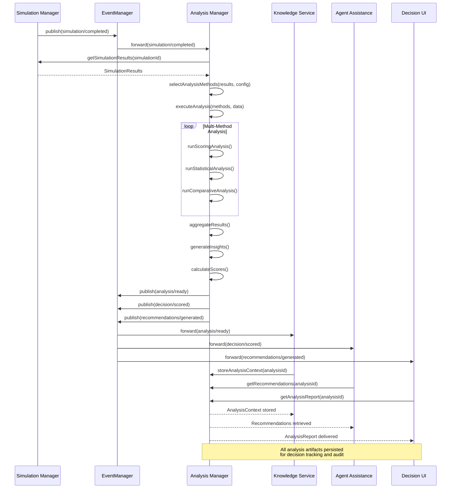

# DADMS Analysis Manager Service Specification

## 1. Purpose & Responsibilities

The `AnalysisManager` serves as the intelligent evaluation and decision-support hub within DADMS's Event-Driven System (EDS), transforming raw simulation outputs into actionable insights through sophisticated analytical methods. It provides comprehensive scoring, comparative analysis, and statistical evaluation capabilities to support data-driven decision making.

### Core Responsibilities

- **Result Processing**: Consume and analyze outputs from Simulation Manager and other data sources
- **Multi-Method Analysis**: Apply diverse analytical techniques from simple scoring to advanced ML-based evaluation
- **Decision Support**: Generate scored recommendations and trade-space evaluations for decision makers
- **Real-time Scoring**: Provide low-latency analysis for time-critical decision scenarios
- **Comparative Analytics**: Perform cross-simulation analysis and benchmarking studies
- **Insight Generation**: Extract patterns, anomalies, and actionable insights from complex datasets
- **Extensible Framework**: Support plugin-based analysis methods and custom evaluation criteria
- **Audit Trail**: Maintain complete traceability of analysis inputs, methods, and conclusions

## 2. Architecture & Integration Diagrams

### 2.1 Analysis Manager System Architecture

```mermaid
%%{init: { 'flowchart': { 'curve': 'orthogonal' }}}%%
flowchart TD
    subgraph InputSources["Input Sources"]
        SimulationManager["Simulation Manager<br/>(Port 3011)"]
        DataManager["Data Manager<br/>(Port 3009)"]
        ModelManager["Model Manager<br/>(Port 3010)"]
        ExternalData["External Data<br/>Sources"]
    end
    
    subgraph AnalysisManager["Analysis Manager (Port 3012)"]
        API_Layer["REST API Layer"]
        EventSubscriber["Event Subscriber<br/>& Trigger Engine"]
        AnalysisOrchestrator["Analysis Orchestrator<br/>& Method Router"]
        AnalysisEngines["Analysis Engines"]
        ResultProcessor["Result Processor<br/>& Formatter"]
        PluginManager["Plugin Manager<br/>& Extension Framework"]
    end
    
    subgraph AnalysisEngines["Analysis Engine Types"]
        ScoringEngine["Scoring Engine<br/>Rule-based & Weighted"]
        StatisticalEngine["Statistical Engine<br/>Inference & Distributions"]
        ComparativeEngine["Comparative Engine<br/>Trade-space Analysis"]
        MLEngine["ML Engine<br/>Classification & Anomaly"]
        SensitivityEngine["Sensitivity Engine<br/>Impact Analysis"]
        GameTheoryEngine["Game Theory Engine<br/>Strategy Evaluation"]
    end
    
    subgraph DADMS_Services["DADMS Services"]
        EventManager["EventManager<br/>(Port 3004)"]
        KnowledgeService["Knowledge Service<br/>(Port 3003)"]
        AAS["Agent Assistance<br/>(Port 3005)"]
        ProcessManager["Process Manager<br/>(Port 3007)"]
    end
    
    subgraph Storage["Storage & Data"]
        AnalysisDB["Analysis DB<br/>PostgreSQL"]
        ResultStore["Result Store<br/>MinIO/S3"]
        VectorStore["Vector Store<br/>Qdrant"]
        GraphDB["Graph DB<br/>Neo4j"]
        CacheLayer["Cache Layer<br/>Redis"]
    end
    
    subgraph OutputTargets["Output Targets"]
        DecisionUI["Decision UI<br/>Dashboards"]
        ReportGenerator["Report Generator<br/>PDF/Markdown"]
        AlertSystem["Alert System<br/>Notifications"]
        APIClients["API Clients<br/>External Systems"]
    end
    
    %% Input connections
    SimulationManager --> EventSubscriber
    DataManager --> API_Layer
    ModelManager --> API_Layer
    ExternalData --> API_Layer
    
    %% Internal flow
    EventSubscriber --> AnalysisOrchestrator
    API_Layer --> AnalysisOrchestrator
    AnalysisOrchestrator --> ScoringEngine
    AnalysisOrchestrator --> StatisticalEngine
    AnalysisOrchestrator --> ComparativeEngine
    AnalysisOrchestrator --> MLEngine
    AnalysisOrchestrator --> SensitivityEngine
    AnalysisOrchestrator --> GameTheoryEngine
    
    ScoringEngine --> ResultProcessor
    StatisticalEngine --> ResultProcessor
    ComparativeEngine --> ResultProcessor
    MLEngine --> ResultProcessor
    SensitivityEngine --> ResultProcessor
    GameTheoryEngine --> ResultProcessor
    
    PluginManager --> AnalysisOrchestrator
    
    %% Service integrations
    API_Layer <--> EventManager
    ResultProcessor --> KnowledgeService
    ResultProcessor --> AAS
    ResultProcessor --> ProcessManager
    
    %% Storage connections
    API_Layer --> AnalysisDB
    ResultProcessor --> AnalysisDB
    ResultProcessor --> ResultStore
    ResultProcessor --> VectorStore
    ResultProcessor --> GraphDB
    AnalysisOrchestrator --> CacheLayer
    
    %% Output connections
    ResultProcessor --> DecisionUI
    ResultProcessor --> ReportGenerator
    ResultProcessor --> AlertSystem
    ResultProcessor --> APIClients
    
    classDef input fill:#ffebee,stroke:#d32f2f,stroke-width:2px;
    classDef analysisManager fill:#e8f5e8,stroke:#388e3c,stroke-width:3px;
    classDef engine fill:#e3f2fd,stroke:#1976d2,stroke-width:2px;
    classDef service fill:#fff3e0,stroke:#f57c00,stroke-width:2px;
    classDef storage fill:#f3e5f5,stroke:#7b1fa2,stroke-width:2px;
    classDef output fill:#e0f2f1,stroke:#00695c,stroke-width:2px;
    
    class SimulationManager,DataManager,ModelManager,ExternalData input;
    class API_Layer,EventSubscriber,AnalysisOrchestrator,ResultProcessor,PluginManager analysisManager;
    class ScoringEngine,StatisticalEngine,ComparativeEngine,MLEngine,SensitivityEngine,GameTheoryEngine engine;
    class EventManager,KnowledgeService,AAS,ProcessManager service;
    class AnalysisDB,ResultStore,VectorStore,GraphDB,CacheLayer storage;
    class DecisionUI,ReportGenerator,AlertSystem,APIClients output;
```


### 2.2 Analysis Workflow & Method Selection


### 2.3 Multi-Method Analysis Framework

```mermaid
%%{init: { 'flowchart': { 'curve': 'orthogonal' }}}%%
flowchart TD
    subgraph InputData["Input Data Types"]
        SimulationResults["Simulation Results<br/>Numerical Outputs"]
        ModelOutputs["Model Outputs<br/>Predictions & Estimates"]
        HistoricalData["Historical Data<br/>Performance Records"]
        RealTimeData["Real-time Data<br/>Live Metrics"]
    end
    
    subgraph AnalysisMethods["Analysis Methods"]
        subgraph Scoring["Scoring Analysis"]
            RuleBased["Rule-based<br/>Threshold Analysis"]
            WeightedScoring["Weighted Scoring<br/>Value Functions"]
            UtilityCurves["Utility Curves<br/>Preference Modeling"]
        end
        
        subgraph Statistical["Statistical Analysis"]
            DescriptiveStats["Descriptive<br/>Statistics"]
            InferentialStats["Inferential<br/>Statistics"]
            DistributionAnalysis["Distribution<br/>Analysis"]
            ConfidenceIntervals["Confidence<br/>Intervals"]
        end
        
        subgraph Comparative["Comparative Analysis"]
            TradeSpaceAnalysis["Trade-space<br/>Analysis"]
            ParetoOptimality["Pareto<br/>Optimality"]
            BenchmarkComparison["Benchmark<br/>Comparison"]
            TrendAnalysis["Trend<br/>Analysis"]
        end
        
        subgraph Advanced["Advanced Methods"]
            SensitivityAnalysis["Sensitivity<br/>Analysis"]
            GameTheory["Game Theory<br/>Strategy Analysis"]
            MLClassification["ML Classification<br/>Pattern Recognition"]
            AnomalyDetection["Anomaly<br/>Detection"]
        end
    end
    
    subgraph OutputFormats["Output Formats"]
        StructuredScores["Structured Scores<br/>JSON/Database"]
        Visualizations["Visualizations<br/>Charts & Graphs"]
        Recommendations["Recommendations<br/>Ranked Options"]
        Reports["Reports<br/>PDF/Markdown"]
        Alerts["Alerts<br/>Notifications"]
        Dashboards["Dashboards<br/>Interactive UI"]
    end
    
    %% Data flow connections
    SimulationResults --> RuleBased
    SimulationResults --> WeightedScoring
    SimulationResults --> DescriptiveStats
    SimulationResults --> TradeSpaceAnalysis
    
    ModelOutputs --> UtilityCurves
    ModelOutputs --> InferentialStats
    ModelOutputs --> MLClassification
    
    HistoricalData --> BenchmarkComparison
    HistoricalData --> TrendAnalysis
    HistoricalData --> AnomalyDetection
    
    RealTimeData --> ConfidenceIntervals
    RealTimeData --> SensitivityAnalysis
    RealTimeData --> GameTheory
    
    %% Method to output connections
    RuleBased --> StructuredScores
    WeightedScoring --> StructuredScores
    UtilityCurves --> Recommendations
    
    DescriptiveStats --> Visualizations
    InferentialStats --> Reports
    DistributionAnalysis --> Visualizations
    ConfidenceIntervals --> Reports
    
    TradeSpaceAnalysis --> Dashboards
    ParetoOptimality --> Visualizations
    BenchmarkComparison --> Reports
    TrendAnalysis --> Dashboards
    
    SensitivityAnalysis --> Alerts
    GameTheory --> Recommendations
    MLClassification --> Alerts
    AnomalyDetection --> Alerts
    
    classDef input fill:#e3f2fd,stroke:#1976d2,stroke-width:2px;
    classDef scoring fill:#e8f5e8,stroke:#388e3c,stroke-width:2px;
    classDef statistical fill:#fff3e0,stroke:#f57c00,stroke-width:2px;
    classDef comparative fill:#f3e5f5,stroke:#7b1fa2,stroke-width:2px;
    classDef advanced fill:#ffebee,stroke:#d32f2f,stroke-width:2px;
    classDef output fill:#e0f2f1,stroke:#00695c,stroke-width:2px;
    
    class SimulationResults,ModelOutputs,HistoricalData,RealTimeData input;
    class RuleBased,WeightedScoring,UtilityCurves scoring;
    class DescriptiveStats,InferentialStats,DistributionAnalysis,ConfidenceIntervals statistical;
    class TradeSpaceAnalysis,ParetoOptimality,BenchmarkComparison,TrendAnalysis comparative;
    class SensitivityAnalysis,GameTheory,MLClassification,AnomalyDetection advanced;
    class StructuredScores,Visualizations,Recommendations,Reports,Alerts,Dashboards output;
```


### 2.4 Event-Driven Integration Sequence


## 3. Data Models & Schema

### 3.1 Core Analysis Schemas
```typescript
interface AnalysisReport {
  id: string;                     // UUID for unique identification
  name: string;                   // Human-readable analysis name
  simulation_id?: string;         // Source simulation (if applicable)
  data_source_ids: string[];      // Input data source references
  analysis_type: AnalysisType;    // Type of analysis performed
  status: AnalysisStatus;         // Current analysis status
  
  // Configuration
  methods: AnalysisMethod[];      // Analysis methods applied
  parameters: AnalysisParameters; // Analysis configuration
  quality_criteria: QualityCriteria; // Quality and validation settings
  
  // Execution Details
  started_at: Date;               // Analysis start time
  completed_at?: Date;            // Analysis completion time
  duration_seconds?: number;      // Total analysis time
  
  // Results
  scores: ScoreResults;           // Calculated scores and metrics
  insights: InsightResults;       // Generated insights and patterns
  recommendations: Recommendation[]; // Actionable recommendations
  statistical_summary: StatisticalSummary; // Statistical analysis results
  
  // Artifacts
  artifacts: AnalysisArtifact[];  // Generated reports, charts, data files
  visualizations: Visualization[]; // Charts, graphs, dashboards
  
  // Metadata
  created_by: string;             // User who initiated analysis
  tags: string[];                 // Searchable tags
  description?: string;           // Analysis description
  project_id?: string;            // Associated project
  
  // Tracking
  created_at: Date;
  updated_at: Date;
  version: string;                // Analysis version
  parent_analysis_id?: string;    // Parent analysis (for iterations)
}

enum AnalysisType {
  SCORING = "scoring",                    // Rule-based and weighted scoring
  STATISTICAL = "statistical",           // Statistical inference and modeling
  COMPARATIVE = "comparative",           // Trade-space and benchmark analysis
  SENSITIVITY = "sensitivity",           // Sensitivity and impact analysis
  GAME_THEORY = "game_theory",          // Game-theoretic evaluation
  MACHINE_LEARNING = "machine_learning", // ML-based classification/clustering
  MULTI_OBJECTIVE = "multi_objective",   // Multi-objective optimization
  RISK_ASSESSMENT = "risk_assessment",   // Risk and uncertainty analysis
  CUSTOM = "custom"                      // Custom analysis plugin
}

enum AnalysisStatus {
  QUEUED = "queued",                     // Waiting in analysis queue
  PREPARING = "preparing",               // Preparing data and methods
  RUNNING = "running",                   // Currently executing
  COMPLETED = "completed",               // Successfully completed
  FAILED = "failed",                     // Analysis failed
  CANCELLED = "cancelled",               // User cancelled
  PARTIAL = "partial"                    // Partially completed with warnings
}
```

### 3.2 Analysis Methods & Configuration
```typescript
interface AnalysisMethod {
  method_id: string;              // Unique method identifier
  method_type: AnalysisType;      // Type of analysis method
  method_name: string;            // Human-readable method name
  plugin_name?: string;           // Plugin providing the method
  version: string;                // Method version
  parameters: Record<string, any>; // Method-specific parameters
  weight: number;                 // Method weight in aggregation
  enabled: boolean;               // Whether method is active
  execution_order: number;        // Execution priority order
}

interface AnalysisParameters {
  data_preprocessing: PreprocessingConfig; // Data preparation settings
  method_configuration: Record<string, any>; // Method-specific settings
  aggregation_strategy: AggregationStrategy; // Result combination approach
  confidence_level: number;       // Statistical confidence level
  significance_threshold: number;  // Statistical significance threshold
  output_formats: OutputFormat[]; // Desired output formats
  quality_checks: QualityCheck[]; // Quality validation criteria
}

interface PreprocessingConfig {
  normalization: NormalizationType; // Data normalization approach
  outlier_handling: OutlierHandling; // Outlier detection and treatment
  missing_data_strategy: MissingDataStrategy; // Missing data handling
  feature_selection: FeatureSelection; // Feature selection criteria
  transformation_pipeline: TransformationStep[]; // Data transformation steps
}

enum NormalizationType {
  NONE = "none",
  MIN_MAX = "min_max",
  Z_SCORE = "z_score",
  ROBUST = "robust",
  QUANTILE = "quantile"
}

enum AggregationStrategy {
  WEIGHTED_AVERAGE = "weighted_average", // Weighted average of method results
  CONSENSUS = "consensus",               // Consensus-based aggregation
  MAJORITY_VOTE = "majority_vote",       // Majority voting for classifications
  ENSEMBLE = "ensemble",                 // Ensemble method combination
  HIERARCHICAL = "hierarchical"          // Hierarchical aggregation
}
```

### 3.3 Score & Results Schema
```typescript
interface ScoreResults {
  overall_score: number;          // Aggregated overall score (0-100)
  method_scores: MethodScore[];   // Individual method scores
  normalized_scores: NormalizedScore[]; // Normalized across methods
  confidence_scores: ConfidenceScore[]; // Confidence in each score
  score_breakdown: ScoreBreakdown; // Detailed score components
  performance_metrics: PerformanceMetric[]; // Performance indicators
}

interface MethodScore {
  method_id: string;              // Analysis method identifier
  method_name: string;            // Human-readable method name
  raw_score: number;              // Raw method score
  normalized_score: number;       // Normalized score (0-1)
  weight: number;                 // Method weight in aggregation
  confidence: number;             // Confidence in this score
  details: Record<string, any>;   // Method-specific score details
}

interface InsightResults {
  key_findings: KeyFinding[];     // Primary insights discovered
  patterns: Pattern[];            // Identified patterns in data
  anomalies: Anomaly[];          // Detected anomalies or outliers
  correlations: Correlation[];    // Correlation analysis results
  trends: Trend[];               // Trend analysis results
  risk_factors: RiskFactor[];    // Identified risk factors
  optimization_opportunities: OptimizationOpportunity[]; // Improvement areas
}

interface Recommendation {
  id: string;                     // Unique recommendation ID
  title: string;                  // Recommendation title
  description: string;            // Detailed description
  recommendation_type: RecommendationType; // Type of recommendation
  priority: RecommendationPriority; // Recommendation priority
  confidence: number;             // Confidence in recommendation
  impact_score: number;           // Expected impact (0-100)
  implementation_effort: EffortLevel; // Implementation difficulty
  supporting_evidence: Evidence[]; // Supporting analysis evidence
  alternatives: Alternative[];    // Alternative recommendations
  next_steps: NextStep[];        // Suggested next actions
}

enum RecommendationType {
  OPTIMIZE = "optimize",          // Optimization recommendation
  MITIGATE = "mitigate",         // Risk mitigation
  INVESTIGATE = "investigate",    // Further investigation needed
  IMPLEMENT = "implement",        // Implementation recommendation
  AVOID = "avoid",               // Avoid certain approach
  MONITOR = "monitor"            // Monitoring recommendation
}

enum RecommendationPriority {
  CRITICAL = "critical",         // Immediate action required
  HIGH = "high",                 // High priority
  MEDIUM = "medium",             // Medium priority
  LOW = "low",                   // Low priority
  INFORMATIONAL = "informational" // For information only
}
```

### 3.4 Statistical & Comparative Analysis
```typescript
interface StatisticalSummary {
  descriptive_statistics: DescriptiveStats; // Basic statistical measures
  inferential_statistics: InferentialStats; // Hypothesis testing results
  distribution_analysis: DistributionAnalysis; // Distribution fitting
  correlation_analysis: CorrelationAnalysis; // Correlation studies
  regression_analysis?: RegressionAnalysis; // Regression modeling
  time_series_analysis?: TimeSeriesAnalysis; // Time series analysis
}

interface DescriptiveStats {
  variable_statistics: VariableStats[]; // Per-variable statistics
  summary_measures: SummaryMeasures; // Overall summary measures
  distribution_shape: DistributionShape; // Shape characteristics
  outlier_analysis: OutlierAnalysis; // Outlier identification
}

interface VariableStats {
  variable_name: string;          // Variable name
  count: number;                  // Number of observations
  mean: number;                   // Arithmetic mean
  median: number;                 // Median value
  mode: number[];                 // Mode values
  std_dev: number;                // Standard deviation
  variance: number;               // Variance
  min: number;                    // Minimum value
  max: number;                    // Maximum value
  percentiles: Record<string, number>; // Percentile values
  skewness: number;               // Distribution skewness
  kurtosis: number;               // Distribution kurtosis
}

interface ComparativeAnalysis {
  trade_space_analysis: TradeSpaceResult; // Trade-space evaluation
  pareto_analysis: ParetoResult;  // Pareto optimality analysis
  benchmark_comparison: BenchmarkResult; // Benchmark comparisons
  sensitivity_analysis: SensitivityResult; // Sensitivity studies
  alternative_ranking: AlternativeRanking; // Ranked alternatives
}

interface TradeSpaceResult {
  dimensions: TradeDimension[];   // Trade-space dimensions
  optimal_points: OptimalPoint[]; // Pareto-optimal solutions
  trade_curves: TradeCurve[];     // Trade-off curves
  dominated_solutions: DominatedSolution[]; // Dominated alternatives
  preference_regions: PreferenceRegion[]; // Preference-based regions
}
```

## 4. API Specification

### 4.1 Core Analysis Manager Interface
```typescript
interface AnalysisManager {
  // Analysis Execution
  analyzeResult(request: AnalysisRequest): Promise<AnalysisReport>;
  analyzeBatch(requests: BatchAnalysisRequest): Promise<BatchAnalysisResult>;
  rerunAnalysis(analysisId: string, options?: RerunOptions): Promise<AnalysisReport>;
  cancelAnalysis(analysisId: string): Promise<void>;
  
  // Analysis Retrieval
  getAnalysis(analysisId: string): Promise<AnalysisReport>;
  getAnalysisStatus(analysisId: string): Promise<AnalysisStatus>;
  getAnalysisProgress(analysisId: string): Promise<ProgressUpdate>;
  
  // Query & Discovery
  listAnalyses(filter?: AnalysisFilter): Promise<AnalysisSummary[]>;
  searchAnalyses(query: string, filter?: AnalysisFilter): Promise<AnalysisSearchResult[]>;
  getSimulationAnalyses(simulationId: string): Promise<AnalysisReport[]>;
  
  // Results & Insights
  getAnalysisResults(analysisId: string): Promise<AnalysisResults>;
  getRecommendations(analysisId: string): Promise<Recommendation[]>;
  getInsights(analysisId: string): Promise<InsightResults>;
  downloadAnalysisArtifacts(analysisId: string): Promise<Blob>;
  
  // Comparative Analysis
  compareAnalyses(analysisIds: string[]): Promise<ComparisonResult>;
  benchmarkAnalysis(analysisId: string, benchmarkSet: string): Promise<BenchmarkResult>;
  
  // Method Management
  getAvailableMethods(): Promise<AnalysisMethod[]>;
  getMethodConfiguration(methodId: string): Promise<MethodConfiguration>;
  validateAnalysisRequest(request: AnalysisRequest): Promise<ValidationResult>;
  
  // Plugin Management
  listPlugins(): Promise<Plugin[]>;
  getPluginInfo(pluginId: string): Promise<PluginInfo>;
  registerPlugin(plugin: PluginDefinition): Promise<PluginRegistration>;
}

interface AnalysisRequest {
  name: string;                   // Analysis name
  description?: string;           // Analysis description
  simulation_id?: string;         // Source simulation ID
  data_sources: DataSource[];     // Input data sources
  analysis_methods: AnalysisMethod[]; // Methods to apply
  parameters?: AnalysisParameters; // Analysis configuration
  output_requirements: OutputRequirement[]; // Required outputs
  tags?: string[];                // Analysis tags
  project_id?: string;            // Associated project
}

interface DataSource {
  source_id: string;              // Data source identifier
  source_type: DataSourceType;    // Type of data source
  source_path?: string;           // Path to data
  format: DataFormat;             // Data format
  schema?: JsonSchema;            // Data schema validation
  preprocessing?: PreprocessingConfig; // Data preprocessing
}

enum DataSourceType {
  SIMULATION_RESULT = "simulation_result", // Simulation Manager output
  MODEL_OUTPUT = "model_output",   // Model Manager model output
  EXTERNAL_DATA = "external_data", // External data source
  HISTORICAL_DATA = "historical_data", // Historical analysis data
  REAL_TIME_DATA = "real_time_data", // Real-time data stream
  USER_PROVIDED = "user_provided"  // User-uploaded data
}
```

### 4.2 REST API Endpoints
```typescript
// Analysis Execution
POST   /api/v1/analyses                 // Start new analysis
POST   /api/v1/analyses/batch           // Run batch analyses
POST   /api/v1/analyses/{id}/rerun      // Rerun analysis with new config
DELETE /api/v1/analyses/{id}            // Cancel running analysis

// Analysis Retrieval
GET    /api/v1/analyses/{id}            // Get analysis details
GET    /api/v1/analyses/{id}/status     // Get analysis status
GET    /api/v1/analyses/{id}/progress   // Get analysis progress
GET    /api/v1/analyses                 // List analyses with filters

// Results & Insights
GET    /api/v1/analyses/{id}/results    // Get analysis results
GET    /api/v1/analyses/{id}/recommendations // Get recommendations
GET    /api/v1/analyses/{id}/insights   // Get generated insights
GET    /api/v1/analyses/{id}/artifacts  // List analysis artifacts
GET    /api/v1/analyses/{id}/artifacts/{name} // Download artifact

// Comparative Analysis
POST   /api/v1/analyses/compare         // Compare multiple analyses
POST   /api/v1/analyses/{id}/benchmark  // Benchmark against dataset

// Search & Discovery
GET    /api/v1/analyses/search          // Search analyses
GET    /api/v1/simulations/{id}/analyses // Get simulation analyses
GET    /api/v1/projects/{id}/analyses   // Get project analyses

// Method & Plugin Management
GET    /api/v1/methods                  // List available methods
GET    /api/v1/methods/{id}             // Get method configuration
POST   /api/v1/analyses/validate        // Validate analysis request
GET    /api/v1/plugins                  // List analysis plugins
POST   /api/v1/plugins                  // Register new plugin

// Health & Monitoring
GET    /health                          // Service health check
GET    /metrics                         // Prometheus metrics
```

## 5. Event-Driven Integration

### 5.1 EventManager Integration
The Analysis Manager integrates deeply with the EventManager for real-time analysis triggers and result distribution:

#### Published Events
```typescript
// Analysis lifecycle events
'analysis/requested'         // Analysis request received
'analysis/started'          // Analysis execution started
'analysis/progress'         // Progress update during analysis
'analysis/completed'        // Analysis completed successfully
'analysis/failed'           // Analysis execution failed
'analysis/cancelled'        // Analysis cancelled by user

// Result events
'analysis/ready'            // Analysis results available
'decision/scored'           // Decision scoring completed
'recommendations/generated' // Recommendations ready
'insights/discovered'       // New insights identified
'anomaly/detected'         // Anomaly detection alert

// Quality events
'analysis/quality/warning'  // Quality issue detected
'analysis/quality/error'    // Quality validation failed
'analysis/validation/passed' // Validation successful
```

#### Subscribed Events
```typescript
// Simulation events
'simulation/completed'      // Trigger automatic analysis
'simulation/failed'         // Analyze failure patterns

// Model events
'model/updated'            // Update analysis methods
'model/performance/changed' // Trigger performance analysis

// Data events
'data/updated'             // Trigger reanalysis
'data/quality/issue'       // Analyze data quality issues

// System events
'project/configuration/changed' // Update analysis config
'user/preferences/updated'  // Update scoring preferences
```

### 5.2 Event Payload Examples
```typescript
interface AnalysisStartedEvent {
  type: 'analysis/started';
  payload: {
    analysis_id: string;
    analysis_name: string;
    simulation_id?: string;
    methods: string[];
    estimated_duration_minutes: number;
    started_by: string;
    project_id?: string;
  };
}

interface DecisionScoredEvent {
  type: 'decision/scored';
  payload: {
    analysis_id: string;
    simulation_id?: string;
    overall_score: number;
    confidence: number;
    score_breakdown: Record<string, number>;
    recommendations_count: number;
    critical_findings: string[];
  };
}

interface InsightsDiscoveredEvent {
  type: 'insights/discovered';
  payload: {
    analysis_id: string;
    insight_count: number;
    insight_types: string[];
    significance_level: number;
    key_patterns: string[];
    anomalies_detected: number;
  };
}
```

## 6. Plugin Architecture & Extensibility

### 6.1 Plugin Framework
```typescript
interface AnalysisPlugin {
  plugin_id: string;              // Unique plugin identifier
  name: string;                   // Plugin name
  version: string;                // Plugin version
  description: string;            // Plugin description
  author: string;                 // Plugin author
  
  // Plugin capabilities
  supported_analysis_types: AnalysisType[]; // Analysis types supported
  supported_data_formats: DataFormat[]; // Supported input formats
  required_dependencies: Dependency[]; // Required dependencies
  
  // Plugin interface
  initialize(config: PluginConfig): Promise<void>;
  validate(data: any, parameters: any): Promise<ValidationResult>;
  analyze(data: any, parameters: any): Promise<AnalysisResult>;
  cleanup(): Promise<void>;
  
  // Metadata
  configuration_schema: JsonSchema; // Parameter configuration schema
  output_schema: JsonSchema;      // Output format schema
  documentation_url?: string;     // Plugin documentation
}

interface PluginConfig {
  plugin_id: string;
  configuration: Record<string, any>;
  resources: ResourceAllocation;
  logging_level: LogLevel;
  cache_settings: CacheSettings;
}

interface PluginRegistry {
  registerPlugin(plugin: AnalysisPlugin): Promise<PluginRegistration>;
  unregisterPlugin(pluginId: string): Promise<void>;
  getPlugin(pluginId: string): Promise<AnalysisPlugin>;
  listPlugins(filter?: PluginFilter): Promise<PluginInfo[]>;
  updatePlugin(pluginId: string, update: PluginUpdate): Promise<void>;
}
```

### 6.2 Built-in Analysis Methods
```typescript
// Scoring Analysis Methods
class RuleBasedScoring implements AnalysisPlugin {
  async analyze(data: any, parameters: RuleScoringParams): Promise<ScoreResult> {
    // Rule-based threshold evaluation
    // Returns: threshold violations, rule scores, overall compliance
  }
}

class WeightedScoring implements AnalysisPlugin {
  async analyze(data: any, parameters: WeightedScoringParams): Promise<ScoreResult> {
    // Multi-criteria weighted scoring
    // Returns: weighted scores, criteria breakdown, sensitivity analysis
  }
}

// Statistical Analysis Methods
class DescriptiveStatistics implements AnalysisPlugin {
  async analyze(data: any, parameters: StatParams): Promise<StatisticalResult> {
    // Descriptive statistical analysis
    // Returns: means, medians, distributions, correlation matrices
  }
}

class HypothesisTesting implements AnalysisPlugin {
  async analyze(data: any, parameters: HypothesisParams): Promise<HypothesisResult> {
    // Statistical hypothesis testing
    // Returns: p-values, confidence intervals, effect sizes
  }
}

// Comparative Analysis Methods
class TradeSpaceAnalysis implements AnalysisPlugin {
  async analyze(data: any, parameters: TradeSpaceParams): Promise<TradeSpaceResult> {
    // Multi-objective trade-space analysis
    // Returns: Pareto fronts, trade curves, dominated solutions
  }
}

class SensitivityAnalysis implements AnalysisPlugin {
  async analyze(data: any, parameters: SensitivityParams): Promise<SensitivityResult> {
    // Global sensitivity analysis
    // Returns: sensitivity indices, interaction effects, variance decomposition
  }
}
```

## 7. Storage Architecture

### 7.1 Database Schema (PostgreSQL)
```sql
-- Analysis reports table
CREATE TABLE analysis_reports (
  id UUID PRIMARY KEY DEFAULT gen_random_uuid(),
  name VARCHAR(255) NOT NULL,
  simulation_id UUID,
  analysis_type analysis_type_enum NOT NULL,
  status analysis_status_enum NOT NULL DEFAULT 'queued',
  data_source_ids JSONB NOT NULL,
  methods JSONB NOT NULL,
  parameters JSONB,
  started_at TIMESTAMP WITH TIME ZONE,
  completed_at TIMESTAMP WITH TIME ZONE,
  duration_seconds INTEGER,
  scores JSONB,
  insights JSONB,
  recommendations JSONB,
  statistical_summary JSONB,
  created_by VARCHAR(255) NOT NULL,
  description TEXT,
  project_id UUID,
  created_at TIMESTAMP WITH TIME ZONE DEFAULT NOW(),
  updated_at TIMESTAMP WITH TIME ZONE DEFAULT NOW(),
  version VARCHAR(20) NOT NULL DEFAULT '1.0.0',
  parent_analysis_id UUID
);

-- Analysis artifacts table
CREATE TABLE analysis_artifacts (
  id UUID PRIMARY KEY DEFAULT gen_random_uuid(),
  analysis_id UUID NOT NULL REFERENCES analysis_reports(id) ON DELETE CASCADE,
  name VARCHAR(255) NOT NULL,
  type artifact_type_enum NOT NULL,
  path VARCHAR(500) NOT NULL,
  size BIGINT NOT NULL,
  hash VARCHAR(64) NOT NULL,
  mime_type VARCHAR(100),
  description TEXT,
  created_at TIMESTAMP WITH TIME ZONE DEFAULT NOW(),
  UNIQUE(analysis_id, name)
);

-- Analysis methods execution log
CREATE TABLE analysis_method_executions (
  id UUID PRIMARY KEY DEFAULT gen_random_uuid(),
  analysis_id UUID NOT NULL REFERENCES analysis_reports(id) ON DELETE CASCADE,
  method_id VARCHAR(100) NOT NULL,
  method_name VARCHAR(255) NOT NULL,
  plugin_name VARCHAR(100),
  version VARCHAR(20),
  parameters JSONB,
  started_at TIMESTAMP WITH TIME ZONE DEFAULT NOW(),
  completed_at TIMESTAMP WITH TIME ZONE,
  status execution_status_enum NOT NULL,
  results JSONB,
  error_message TEXT,
  execution_order INTEGER
);

-- Analysis insights table
CREATE TABLE analysis_insights (
  id UUID PRIMARY KEY DEFAULT gen_random_uuid(),
  analysis_id UUID NOT NULL REFERENCES analysis_reports(id) ON DELETE CASCADE,
  insight_type insight_type_enum NOT NULL,
  title VARCHAR(255) NOT NULL,
  description TEXT NOT NULL,
  confidence DECIMAL(3,2) NOT NULL,
  significance DECIMAL(3,2) NOT NULL,
  supporting_data JSONB,
  created_at TIMESTAMP WITH TIME ZONE DEFAULT NOW()
);

-- Analysis recommendations table
CREATE TABLE analysis_recommendations (
  id UUID PRIMARY KEY DEFAULT gen_random_uuid(),
  analysis_id UUID NOT NULL REFERENCES analysis_reports(id) ON DELETE CASCADE,
  title VARCHAR(255) NOT NULL,
  description TEXT NOT NULL,
  recommendation_type recommendation_type_enum NOT NULL,
  priority recommendation_priority_enum NOT NULL,
  confidence DECIMAL(3,2) NOT NULL,
  impact_score INTEGER NOT NULL CHECK (impact_score >= 0 AND impact_score <= 100),
  implementation_effort effort_level_enum NOT NULL,
  supporting_evidence JSONB,
  alternatives JSONB,
  next_steps JSONB,
  created_at TIMESTAMP WITH TIME ZONE DEFAULT NOW()
);

-- Analysis tags table
CREATE TABLE analysis_tags (
  analysis_id UUID NOT NULL REFERENCES analysis_reports(id) ON DELETE CASCADE,
  tag VARCHAR(100) NOT NULL,
  PRIMARY KEY (analysis_id, tag)
);

-- Plugin registry table
CREATE TABLE analysis_plugins (
  id UUID PRIMARY KEY DEFAULT gen_random_uuid(),
  plugin_id VARCHAR(100) UNIQUE NOT NULL,
  name VARCHAR(255) NOT NULL,
  version VARCHAR(20) NOT NULL,
  description TEXT,
  author VARCHAR(255),
  supported_analysis_types JSONB NOT NULL,
  configuration_schema JSONB NOT NULL,
  output_schema JSONB NOT NULL,
  is_enabled BOOLEAN NOT NULL DEFAULT true,
  created_at TIMESTAMP WITH TIME ZONE DEFAULT NOW(),
  updated_at TIMESTAMP WITH TIME ZONE DEFAULT NOW()
);

-- Indexes for performance
CREATE INDEX idx_analysis_reports_simulation_id ON analysis_reports(simulation_id);
CREATE INDEX idx_analysis_reports_status ON analysis_reports(status);
CREATE INDEX idx_analysis_reports_analysis_type ON analysis_reports(analysis_type);
CREATE INDEX idx_analysis_reports_created_by ON analysis_reports(created_by);
CREATE INDEX idx_analysis_reports_project_id ON analysis_reports(project_id);
CREATE INDEX idx_analysis_reports_created_at ON analysis_reports(created_at DESC);
CREATE INDEX idx_analysis_method_executions_analysis_id ON analysis_method_executions(analysis_id);
CREATE INDEX idx_analysis_insights_analysis_id ON analysis_insights(analysis_id);
CREATE INDEX idx_analysis_recommendations_analysis_id ON analysis_recommendations(analysis_id);
```

### 7.2 Object Storage Structure (MinIO)
```
/analyses/
├── {analysis_id}/
│   ├── inputs/
│   │   ├── data_sources.json
│   │   ├── raw_data/
│   │   └── preprocessed_data/
│   ├── outputs/
│   │   ├── results.json
│   │   ├── scores.json
│   │   ├── insights.json
│   │   ├── recommendations.json
│   │   └── statistical_summary.json
│   ├── artifacts/
│   │   ├── reports/
│   │   │   ├── analysis_report.pdf
│   │   │   ├── executive_summary.md
│   │   │   └── detailed_analysis.html
│   │   ├── visualizations/
│   │   │   ├── charts/
│   │   │   ├── graphs/
│   │   │   └── dashboards/
│   │   └── data_exports/
│   │       ├── results.csv
│   │       ├── scores.xlsx
│   │       └── statistical_data.json
│   ├── method_outputs/
│   │   ├── {method_id}/
│   │   │   ├── raw_output.json
│   │   │   ├── processed_results.json
│   │   │   └── method_artifacts/
│   └── metadata/
│       ├── analysis_metadata.json
│       ├── execution_log.json
│       ├── data_lineage.json
│       └── quality_metrics.json
```

## 8. Non-Functional Requirements

### 8.1 Performance & Scalability
- **Analysis Latency**: Complete simple analyses < 30 seconds
- **Batch Processing**: Support 100+ concurrent analyses
- **Data Throughput**: Process datasets up to 10GB efficiently
- **Method Scalability**: Support 50+ analysis methods simultaneously
- **Real-time Scoring**: Deliver critical scores < 5 seconds

### 8.2 Reliability & Quality
- **Availability**: 99.9% uptime for analysis services
- **Result Reproducibility**: Deterministic results for same inputs
- **Quality Validation**: Automated quality checks for all analyses
- **Error Recovery**: Graceful handling of method failures
- **Data Integrity**: Complete audit trail for all analyses

### 8.3 Security & Compliance
- **Authentication**: JWT-based with method-level permissions
- **Data Privacy**: Encrypt sensitive analysis data
- **Audit Logging**: Complete analysis audit trail
- **Access Control**: Fine-grained access to analysis results
- **Compliance**: Support regulatory compliance requirements

### 8.4 Extensibility & Maintenance
- **Plugin Architecture**: Support custom analysis methods
- **Version Management**: Backward compatibility for analysis methods
- **Configuration Management**: Dynamic method configuration
- **Monitoring**: Comprehensive method performance monitoring
- **Documentation**: Auto-generated method documentation

## 9. Implementation Roadmap

### 9.1 Phase 1: Core Analysis Framework (Weeks 1-2)
- [ ] Basic analysis execution engine
- [ ] EventManager integration for simulation triggers
- [ ] Simple scoring and statistical analysis methods
- [ ] PostgreSQL schema and basic data storage
- [ ] REST API for analysis execution and retrieval

### 9.2 Phase 2: Method Expansion & Plugins (Weeks 3-4)
- [ ] Plugin architecture implementation
- [ ] Comparative and trade-space analysis methods
- [ ] Visualization generation capabilities
- [ ] MinIO integration for artifact storage
- [ ] Advanced filtering and search capabilities

### 9.3 Phase 3: Advanced Analytics & ML (Weeks 5-6)
- [ ] Machine learning-based analysis methods
- [ ] Anomaly detection and pattern recognition
- [ ] Game-theoretic analysis capabilities
- [ ] Real-time analysis dashboard
- [ ] Batch analysis processing

### 9.4 Phase 4: Production & Enterprise Features (Weeks 7-8)
- [ ] Advanced security and access control
- [ ] Performance optimization and caching
- [ ] Enterprise reporting capabilities
- [ ] Compliance and audit features
- [ ] Documentation and training materials

## 10. Technology Stack

### 10.1 Core Services
- **Runtime**: Python 3.11+ with asyncio for concurrent processing
- **Framework**: FastAPI with automatic OpenAPI generation
- **Analysis Libraries**: NumPy, SciPy, Pandas, Scikit-learn, Statsmodels
- **Database**: PostgreSQL with asyncpg for async operations
- **Object Storage**: MinIO S3-compatible storage
- **Caching**: Redis for method result caching

### 10.2 Analysis & Visualization
- **Statistical Analysis**: SciPy, Statsmodels, PyMC for Bayesian analysis
- **Machine Learning**: Scikit-learn, XGBoost, TensorFlow/PyTorch
- **Optimization**: CVXPY, PuLP for optimization problems
- **Visualization**: Matplotlib, Plotly, Seaborn for chart generation
- **Report Generation**: Jinja2, WeasyPrint for PDF reports

### 10.3 Integration & Monitoring
- **Event Integration**: AsyncIO-based EventManager client
- **Plugin System**: Dynamic plugin loading with importlib
- **Monitoring**: Prometheus metrics with custom analysis metrics
- **Logging**: Structured JSON logging with correlation IDs
- **Testing**: Pytest with analysis method validation

## 11. Port Allocation & Service Configuration

### 11.1 Service Configuration
- **Port**: 3012 (following DADMS port allocation pattern)
- **Health Check**: `GET /health`
- **Metrics**: `GET /metrics` (Prometheus format)
- **API Base**: `/api/v1`
- **Documentation**: `/docs` (Swagger UI)
- **Plugin Registry**: `/plugins` (Plugin management interface)

### 11.2 Environment Configuration
```typescript
interface AnalysisManagerConfig {
  PORT: number;                    // Service port (default: 3012)
  DATABASE_URL: string;            // PostgreSQL connection string
  REDIS_URL: string;               // Redis connection string
  MINIO_ENDPOINT: string;          // MinIO endpoint
  MINIO_ACCESS_KEY: string;        // MinIO access key
  MINIO_SECRET_KEY: string;        // MinIO secret key
  MINIO_BUCKET: string;            // Analysis bucket name
  
  // Service Integration
  SIMULATION_MANAGER_URL: string;  // Simulation Manager service URL
  EVENTMANAGER_URL: string;        // EventManager service URL
  KNOWLEDGE_SERVICE_URL: string;   // Knowledge Service URL
  MODEL_MANAGER_URL: string;       // Model Manager service URL
  
  // Analysis Configuration
  MAX_CONCURRENT_ANALYSES: number; // Maximum concurrent analyses
  DEFAULT_TIMEOUT_MINUTES: number; // Default analysis timeout
  MAX_DATA_SIZE_MB: number;        // Maximum input data size
  PLUGIN_DIRECTORY: string;        // Plugin installation directory
  
  // Performance Settings
  CACHE_TTL_SECONDS: number;       // Cache time-to-live
  MAX_MEMORY_USAGE_GB: number;     // Maximum memory usage
  PARALLEL_METHOD_LIMIT: number;   // Parallel method execution limit
  
  // Security
  JWT_SECRET: string;              // JWT signing secret
  ENCRYPTION_KEY: string;          // Data encryption key
  PLUGIN_SECURITY_LEVEL: string;   // Plugin security level
}
```

## 12. Success Metrics & KPIs

### 12.1 Performance Metrics
- **Analysis Completion Time**: 90% of simple analyses < 60 seconds
- **Method Execution Speed**: Average method execution < 10 seconds
- **System Throughput**: 50+ concurrent analyses supported
- **Cache Hit Rate**: >80% cache hit rate for repeated analyses
- **Error Rate**: <1% analysis failure rate

### 12.2 Quality Metrics
- **Result Accuracy**: >95% consistency with manual analysis
- **Method Coverage**: 100% of analysis types supported
- **Insight Relevance**: >90% user-rated insight relevance
- **Recommendation Adoption**: >70% recommendation implementation rate
- **User Satisfaction**: >4.5/5.0 average user rating

### 12.3 Business Metrics
- **Decision Support**: Number of analyses supporting decisions
- **Time to Insight**: Average time from data to actionable insight
- **Cost Effectiveness**: Analysis cost per decision supported
- **Method Utilization**: Usage distribution across analysis methods
- **Plugin Adoption**: Number of custom plugins developed and deployed

This specification provides a comprehensive foundation for implementing the DADMS Analysis Manager Service as a production-ready, extensible component that transforms simulation outputs into actionable intelligence through sophisticated analytical methods and seamless integration with the Event-Driven System architecture. 