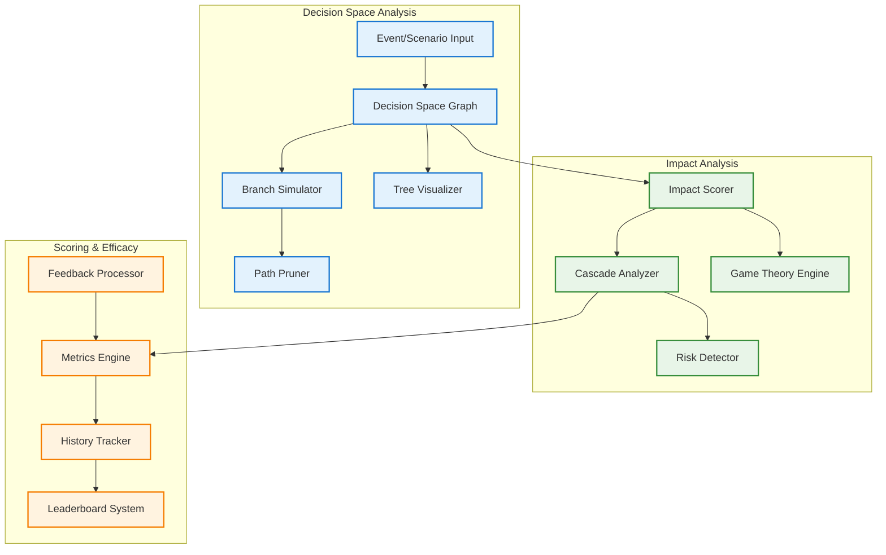
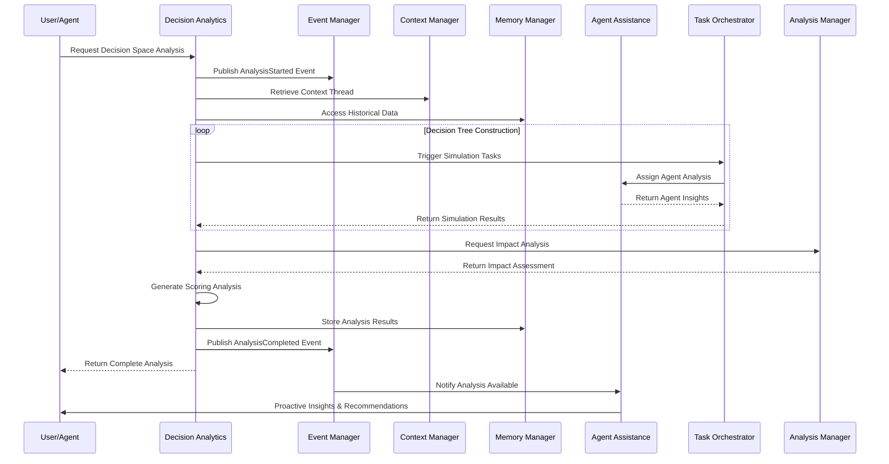
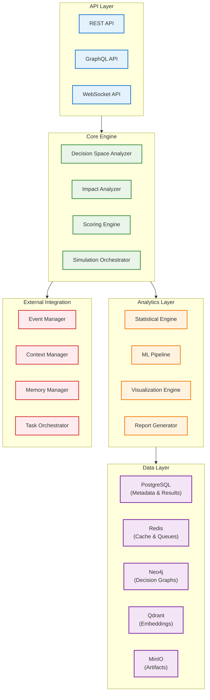

# DADMS 2.0 - Decision Analytics Service Specification

## Executive Summary

The **Decision Analytics Service** serves as DADMS 2.0's comprehensive decision intelligence engine, providing advanced analytics capabilities for decision space exploration, impact assessment, and performance scoring. This service combines three critical analytical domains: **Decision Space Analysis** for mapping and simulating decision trees and outcome branches, **Impact Analysis** for assessing cascading effects and consequences, and **Scoring & Efficacy Analysis** for tracking performance metrics and continuous improvement.

The service empowers decision-makers with data-driven insights, scenario planning capabilities, and performance intelligence—enabling proactive risk management, strategic planning, and evidence-based decision optimization across the DADMS ecosystem.

---

## 1. Purpose & Responsibilities

### 1.1 Decision Space Analysis Engine
- **Decision Tree Construction**: Build comprehensive decision trees and graphs from events, alternatives, and constraints
- **Scenario Simulation**: Use agent- or LLM-driven simulation to explore and prune decision paths  
- **Event Decision Forest**: Map the full set of possible decisions and event branches for complex scenarios
- **Generative Modeling**: Bootstrap "ghost" decision spaces for hypothetical scenario planning
- **Risk Point Identification**: Detect convergences, critical paths, and potential unintended consequences
- **Visualization Support**: Generate decision tree visualizations for human and agent review

### 1.2 Impact Analysis Engine
- **Multi-Domain Impact Assessment**: Score impacts across mission, system, stakeholder, financial, and operational domains
- **Cascading Effect Analysis**: Propagate outcome effects through event/decision graphs
- **Emergent Risk Detection**: Identify secondary and tertiary consequences of decisions
- **Game-Theoretic Modeling**: Support payoff analysis and dominant strategy identification
- **Context-Aware Evaluation**: Assess impacts within specific contexts and constraints
- **Comparative Analysis**: Compare impact profiles across different decision alternatives

### 1.3 Scoring & Efficacy Analysis System
- **Performance Tracking**: Monitor efficacy of decisions, agents, workflows, and tools over time
- **Historical Analysis**: Maintain comprehensive scoring history with contextual metadata
- **Continuous Improvement**: Support data-driven optimization of models, personas, and processes
- **Real-Time Metrics**: Calculate live performance indicators and trend analysis
- **Comparative Benchmarking**: Provide leaderboards and relative performance rankings
- **Feedback Integration**: Incorporate human and agent feedback for score validation and revision

---

## 2. Core Concepts & Data Models

### 2.1 Decision Space Architecture



### 2.2 Decision Space Models

#### Core Decision Space Framework
```typescript
// Decision Space Graph Structure
interface DecisionSpaceGraph {
  id: string;
  scenario_id: string;
  root_event: EventNode;
  decision_nodes: DecisionNode[];
  outcome_nodes: OutcomeNode[];
  branches: DecisionBranch[];
  metadata: {
    created_at: Date;
    analysis_depth: number;
    simulation_params: SimulationParameters;
    complexity_score: number;
    confidence_level: number;
  };
}

interface EventNode {
  id: string;
  type: EventType;
  description: string;
  timestamp?: Date;
  context: EventContext;
  triggers: Trigger[];
  constraints: Constraint[];
}

interface DecisionNode {
  id: string;
  parent_event_id: string;
  decision_type: DecisionType;
  alternatives: Alternative[];
  decision_criteria: DecisionCriteria;
  agent_assignments: AgentAssignment[];
  risk_level: RiskLevel;
  confidence_score: number;
}

interface OutcomeNode {
  id: string;
  parent_decision_id: string;
  outcome_type: OutcomeType;
  probability: number;
  impact_domains: ImpactDomain[];
  cascading_effects: CascadingEffect[];
  performance_metrics: PerformanceMetric[];
}

interface DecisionBranch {
  id: string;
  source_node_id: string;
  target_node_id: string;
  branch_type: BranchType;
  probability: number;
  conditions: Condition[];
  cost: number;
  risk_score: number;
}

enum EventType {
  INITIAL = 'initial',
  INTERMEDIATE = 'intermediate', 
  TERMINAL = 'terminal',
  CRISIS = 'crisis',
  OPPORTUNITY = 'opportunity'
}

enum DecisionType {
  STRATEGIC = 'strategic',
  TACTICAL = 'tactical',
  OPERATIONAL = 'operational',
  EMERGENCY = 'emergency',
  ROUTINE = 'routine'
}

enum OutcomeType {
  SUCCESS = 'success',
  FAILURE = 'failure',
  PARTIAL = 'partial',
  UNEXPECTED = 'unexpected',
  NEUTRAL = 'neutral'
}

enum BranchType {
  DIRECT = 'direct',
  CONDITIONAL = 'conditional',
  PROBABILISTIC = 'probabilistic',
  STOCHASTIC = 'stochastic'
}

enum RiskLevel {
  VERY_LOW = 'very_low',
  LOW = 'low', 
  MEDIUM = 'medium',
  HIGH = 'high',
  CRITICAL = 'critical'
}
```

#### Branch Analysis Framework
```typescript
interface BranchAnalysis {
  branch_id: string;
  depth: number;
  simulation_results: SimulationResult[];
  convergence_points: ConvergencePoint[];
  risk_assessment: RiskAssessment;
  optimization_suggestions: OptimizationSuggestion[];
}

interface SimulationResult {
  simulation_id: string;
  branch_path: string[];
  final_outcome: OutcomeNode;
  execution_time: number;
  resource_consumption: ResourceUsage;
  success_probability: number;
  confidence_interval: ConfidenceInterval;
}

interface ConvergencePoint {
  node_id: string;
  converging_branches: string[];
  convergence_type: ConvergenceType;
  strategic_importance: number;
  risk_amplification: number;
}

enum ConvergenceType {
  BOTTLENECK = 'bottleneck',
  CRITICAL_PATH = 'critical_path',
  DECISION_POINT = 'decision_point',
  RISK_ACCUMULATION = 'risk_accumulation'
}
```

### 2.3 Impact Analysis Models

#### Impact Assessment Framework
```typescript
interface ImpactReport {
  analysis_id: string;
  decision_id: string;
  context_thread_id: string;
  impact_domains: DomainImpact[];
  cascading_effects: CascadingEffectAnalysis;
  game_theory_analysis: GameTheoryAnalysis;
  risk_profile: RiskProfile;
  mitigation_strategies: MitigationStrategy[];
  summary: ImpactSummary;
}

interface DomainImpact {
  domain: ImpactDomain;
  impact_score: number;
  impact_type: ImpactType;
  affected_entities: AffectedEntity[];
  quantitative_measures: QuantitativeMeasure[];
  qualitative_assessment: QualitativeAssessment;
  confidence_level: number;
}

interface CascadingEffectAnalysis {
  primary_effects: Effect[];
  secondary_effects: Effect[];
  tertiary_effects: Effect[];
  propagation_paths: PropagationPath[];
  amplification_factors: AmplificationFactor[];
  stabilization_points: StabilizationPoint[];
}

interface GameTheoryAnalysis {
  players: Player[];
  strategies: Strategy[];
  payoff_matrix: PayoffMatrix;
  nash_equilibria: NashEquilibrium[];
  dominant_strategies: DominantStrategy[];
  pareto_optimal_outcomes: ParetoOptimalOutcome[];
}

enum ImpactDomain {
  MISSION = 'mission',
  SYSTEM = 'system', 
  STAKEHOLDER = 'stakeholder',
  FINANCIAL = 'financial',
  OPERATIONAL = 'operational',
  STRATEGIC = 'strategic',
  ENVIRONMENTAL = 'environmental',
  REGULATORY = 'regulatory'
}

enum ImpactType {
  POSITIVE = 'positive',
  NEGATIVE = 'negative',
  NEUTRAL = 'neutral',
  MIXED = 'mixed',
  UNCERTAIN = 'uncertain'
}
```

#### Risk Analysis Framework
```typescript
interface RiskProfile {
  overall_risk_score: number;
  risk_categories: RiskCategory[];
  risk_factors: RiskFactor[];
  uncertainty_analysis: UncertaintyAnalysis;
  sensitivity_analysis: SensitivityAnalysis;
  monte_carlo_results: MonteCarloResults;
}

interface RiskCategory {
  category: string;
  probability: number;
  impact: number;
  risk_score: number;
  mitigation_options: MitigationOption[];
  monitoring_indicators: MonitoringIndicator[];
}

interface UncertaintyAnalysis {
  uncertainty_sources: UncertaintySource[];
  confidence_intervals: ConfidenceInterval[];
  sensitivity_parameters: SensitivityParameter[];
  robustness_assessment: RobustnessAssessment;
}
```

### 2.4 Scoring & Efficacy Models

#### Performance Scoring Framework
```typescript
interface ScoreResult {
  entity_id: string;
  entity_type: EntityType;
  score_context: ScoreContext;
  performance_metrics: PerformanceMetrics;
  historical_trends: HistoricalTrend[];
  comparative_analysis: ComparativeAnalysis;
  improvement_recommendations: ImprovementRecommendation[];
}

interface PerformanceMetrics {
  overall_score: number;
  batting_average: number;
  clutch_performance: number;
  consistency_score: number;
  improvement_rate: number;
  domain_scores: DomainScore[];
  composite_metrics: CompositeMetric[];
}

interface ScoreHistory {
  entity_id: string;
  time_period: TimePeriod;
  historical_scores: HistoricalScore[];
  trend_analysis: TrendAnalysis;
  milestone_events: MilestoneEvent[];
  performance_patterns: PerformancePattern[];
}

interface RankedEntity {
  entity_id: string;
  entity_type: EntityType;
  rank: number;
  score: number;
  percentile: number;
  domain: string;
  ranking_criteria: RankingCriteria;
}

enum EntityType {
  DECISION = 'decision',
  AGENT = 'agent',
  WORKFLOW = 'workflow',
  TOOL = 'tool',
  MODEL = 'model',
  PROCESS = 'process'
}

interface CompositeMetric {
  metric_name: string;
  formula: string;
  weight: number;
  component_scores: ComponentScore[];
  normalization_method: NormalizationMethod;
}
```

#### Feedback Integration Framework
```typescript
interface FeedbackIntegration {
  feedback_id: string;
  source_type: FeedbackSourceType;
  source_id: string;
  target_entity_id: string;
  feedback_type: FeedbackType;
  rating: number;
  comments: string;
  suggested_adjustments: ScoreAdjustment[];
  validation_status: ValidationStatus;
  confidence_level: number;
}

enum FeedbackSourceType {
  HUMAN_EXPERT = 'human_expert',
  AI_AGENT = 'ai_agent',
  SYSTEM_AUTOMATED = 'system_automated',
  PEER_REVIEW = 'peer_review'
}

enum FeedbackType {
  SCORE_CORRECTION = 'score_correction',
  PERFORMANCE_VALIDATION = 'performance_validation',
  IMPROVEMENT_SUGGESTION = 'improvement_suggestion',
  CONTEXT_CLARIFICATION = 'context_clarification'
}
```

---

## 3. API Specification

### 3.1 Core API Interface

```typescript
// Main Decision Analytics Service Interface
interface DecisionAnalyticsService {
  // Decision Space Analysis
  analyzeDecisionSpace(eventId: string, options?: AnalysisOptions): Promise<DecisionSpaceGraph>;
  simulateBranch(branchId: string, depth?: number): Promise<BranchAnalysis[]>;
  generateScenarios(baseEventId: string, count: number): Promise<ScenarioSet>;
  optimizePath(startNodeId: string, endNodeId: string, criteria: OptimizationCriteria): Promise<OptimalPath>;
  
  // Impact Analysis
  assessImpact(decisionId: string, metrics?: MetricSet): Promise<ImpactReport>;
  analyzeRisk(decisionId: string, riskFramework?: RiskFramework): Promise<RiskProfile>;
  evaluateCascading(effectId: string, propagationDepth?: number): Promise<CascadingEffectAnalysis>;
  compareAlternatives(alternativeIds: string[], criteria: ComparisonCriteria): Promise<AlternativeComparison>;
  
  // Scoring & Efficacy Analysis
  score(entityId: string, context?: ScoreContext): Promise<ScoreResult>;
  getEfficacyHistory(entityId: string, timeRange?: TimeRange): Promise<ScoreHistory[]>;
  getLeaderboard(domain?: string, criteria?: RankingCriteria): Promise<RankedEntity[]>;
  updateScore(entityId: string, feedback: FeedbackIntegration): Promise<ScoreResult>;
  
  // Visualization & Export
  generateVisualization(graphId: string, format: VisualizationFormat): Promise<VisualizationResult>;
  exportAnalysis(analysisId: string, format: ExportFormat): Promise<ExportResult>;
  
  // Configuration & Management
  configureMetrics(metricConfiguration: MetricConfiguration): Promise<void>;
  manageFrameworks(framework: AnalysisFramework): Promise<void>;
}
```

### 3.2 Request/Response Models

#### Analysis Configuration Models
```typescript
interface AnalysisOptions {
  depth: number;
  simulation_count: number;
  confidence_threshold: number;
  risk_tolerance: RiskTolerance;
  domain_focus: ImpactDomain[];
  agent_preferences: AgentPreference[];
  time_horizon: TimeHorizon;
}

interface MetricSet {
  primary_metrics: string[];
  secondary_metrics: string[];
  custom_metrics: CustomMetric[];
  weighting_scheme: WeightingScheme;
  normalization_method: NormalizationMethod;
}

interface ScoreContext {
  domain: string;
  time_period: TimePeriod;
  complexity_level: ComplexityLevel;
  stakeholder_perspective: StakeholderPerspective;
  success_criteria: SuccessCriteria[];
}
```

#### Response Models
```typescript
interface AnalysisResult {
  analysis_id: string;
  status: AnalysisStatus;
  results: any;
  metadata: AnalysisMetadata;
  quality_indicators: QualityIndicator[];
  recommendations: Recommendation[];
}

interface VisualizationResult {
  visualization_id: string;
  format: VisualizationFormat;
  content: string | Buffer;
  interactive_features: InteractiveFeature[];
  export_options: ExportOption[];
}

enum AnalysisStatus {
  COMPLETED = 'completed',
  IN_PROGRESS = 'in_progress',
  FAILED = 'failed',
  CANCELLED = 'cancelled'
}
```

---

## 4. Service Integration Architecture

### 4.1 Service Integration Flow



### 4.2 Event-Driven Integration

#### Event Publishing
```typescript
interface DecisionAnalyticsEvents {
  // Decision Space Events
  'decision-space.analysis-started': {
    analysis_id: string;
    event_id: string;
    analysis_type: string;
    estimated_completion: Date;
  };
  
  'decision-space.analysis-completed': {
    analysis_id: string;
    graph_id: string;
    branch_count: number;
    risk_level: RiskLevel;
    recommendations: string[];
  };
  
  'decision-space.risk-detected': {
    analysis_id: string;
    risk_type: string;
    severity: string;
    affected_branches: string[];
    mitigation_suggestions: string[];
  };
  
  // Impact Analysis Events
  'impact.assessment-completed': {
    decision_id: string;
    impact_score: number;
    affected_domains: ImpactDomain[];
    cascading_effects_detected: boolean;
    critical_risks: string[];
  };
  
  'impact.cascading-effect-detected': {
    decision_id: string;
    effect_chain_length: number;
    amplification_factor: number;
    affected_entities: string[];
  };
  
  // Scoring Events
  'scoring.performance-updated': {
    entity_id: string;
    entity_type: EntityType;
    new_score: number;
    previous_score: number;
    improvement_percentage: number;
  };
  
  'scoring.threshold-breached': {
    entity_id: string;
    threshold_type: string;
    threshold_value: number;
    current_value: number;
    alert_level: string;
  };
}
```

#### Event Subscriptions
```typescript
interface DecisionAnalyticsSubscriptions {
  // Process Events
  'process.workflow-completed': (event: WorkflowCompletedEvent) => void;
  'process.decision-made': (event: DecisionMadeEvent) => void;
  
  // Agent Events  
  'agent.task-completed': (event: TaskCompletedEvent) => void;
  'agent.performance-feedback': (event: PerformanceFeedbackEvent) => void;
  
  // Model Events
  'model.execution-completed': (event: ModelExecutionEvent) => void;
  'model.results-validated': (event: ResultsValidatedEvent) => void;
  
  // Simulation Events
  'simulation.run-completed': (event: SimulationCompletedEvent) => void;
  'simulation.results-analyzed': (event: SimulationAnalyzedEvent) => void;
}
```

---

## 5. Implementation Architecture

### 5.1 Service Architecture



### 5.2 PostgreSQL Schema Design

```sql
-- Decision Space Analysis Tables
CREATE TABLE decision_space_graphs (
    id UUID PRIMARY KEY DEFAULT gen_random_uuid(),
    scenario_id VARCHAR(255) NOT NULL,
    root_event_id VARCHAR(255) NOT NULL,
    analysis_depth INTEGER NOT NULL DEFAULT 5,
    complexity_score DECIMAL(5,2),
    confidence_level DECIMAL(3,2),
    created_at TIMESTAMPTZ NOT NULL DEFAULT NOW(),
    updated_at TIMESTAMPTZ NOT NULL DEFAULT NOW(),
    created_by VARCHAR(255) NOT NULL,
    metadata JSONB DEFAULT '{}',
    
    CONSTRAINT valid_confidence CHECK (confidence_level BETWEEN 0 AND 1),
    CONSTRAINT valid_complexity CHECK (complexity_score >= 0)
);

CREATE TABLE decision_nodes (
    id UUID PRIMARY KEY DEFAULT gen_random_uuid(),
    graph_id UUID NOT NULL REFERENCES decision_space_graphs(id) ON DELETE CASCADE,
    parent_event_id VARCHAR(255),
    node_type VARCHAR(50) NOT NULL,
    description TEXT,
    decision_criteria JSONB DEFAULT '{}',
    risk_level VARCHAR(20) NOT NULL DEFAULT 'medium',
    confidence_score DECIMAL(3,2),
    agent_assignments JSONB DEFAULT '[]',
    created_at TIMESTAMPTZ NOT NULL DEFAULT NOW(),
    
    CONSTRAINT valid_node_type CHECK (node_type IN ('strategic', 'tactical', 'operational', 'emergency', 'routine')),
    CONSTRAINT valid_risk_level CHECK (risk_level IN ('very_low', 'low', 'medium', 'high', 'critical')),
    CONSTRAINT valid_confidence CHECK (confidence_score BETWEEN 0 AND 1)
);

CREATE TABLE decision_branches (
    id UUID PRIMARY KEY DEFAULT gen_random_uuid(),
    graph_id UUID NOT NULL REFERENCES decision_space_graphs(id) ON DELETE CASCADE,
    source_node_id UUID NOT NULL REFERENCES decision_nodes(id) ON DELETE CASCADE,
    target_node_id UUID NOT NULL REFERENCES decision_nodes(id) ON DELETE CASCADE,
    branch_type VARCHAR(50) NOT NULL DEFAULT 'direct',
    probability DECIMAL(3,2),
    cost DECIMAL(12,2),
    risk_score DECIMAL(5,2),
    conditions JSONB DEFAULT '[]',
    created_at TIMESTAMPTZ NOT NULL DEFAULT NOW(),
    
    CONSTRAINT valid_branch_type CHECK (branch_type IN ('direct', 'conditional', 'probabilistic', 'stochastic')),
    CONSTRAINT valid_probability CHECK (probability BETWEEN 0 AND 1)
);

-- Impact Analysis Tables
CREATE TABLE impact_reports (
    id UUID PRIMARY KEY DEFAULT gen_random_uuid(),
    decision_id VARCHAR(255) NOT NULL,
    context_thread_id VARCHAR(255),
    overall_impact_score DECIMAL(5,2),
    risk_profile JSONB DEFAULT '{}',
    cascading_effects JSONB DEFAULT '{}',
    game_theory_analysis JSONB DEFAULT '{}',
    created_at TIMESTAMPTZ NOT NULL DEFAULT NOW(),
    updated_at TIMESTAMPTZ NOT NULL DEFAULT NOW(),
    created_by VARCHAR(255) NOT NULL,
    
    CONSTRAINT valid_impact_score CHECK (overall_impact_score BETWEEN -100 AND 100)
);

CREATE TABLE domain_impacts (
    id UUID PRIMARY KEY DEFAULT gen_random_uuid(),
    report_id UUID NOT NULL REFERENCES impact_reports(id) ON DELETE CASCADE,
    domain VARCHAR(50) NOT NULL,
    impact_score DECIMAL(5,2) NOT NULL,
    impact_type VARCHAR(20) NOT NULL,
    confidence_level DECIMAL(3,2),
    quantitative_measures JSONB DEFAULT '{}',
    qualitative_assessment TEXT,
    affected_entities JSONB DEFAULT '[]',
    created_at TIMESTAMPTZ NOT NULL DEFAULT NOW(),
    
    CONSTRAINT valid_domain CHECK (domain IN ('mission', 'system', 'stakeholder', 'financial', 'operational', 'strategic', 'environmental', 'regulatory')),
    CONSTRAINT valid_impact_type CHECK (impact_type IN ('positive', 'negative', 'neutral', 'mixed', 'uncertain')),
    CONSTRAINT valid_confidence CHECK (confidence_level BETWEEN 0 AND 1)
);

-- Scoring & Efficacy Tables
CREATE TABLE entity_scores (
    id UUID PRIMARY KEY DEFAULT gen_random_uuid(),
    entity_id VARCHAR(255) NOT NULL,
    entity_type VARCHAR(50) NOT NULL,
    domain VARCHAR(100),
    overall_score DECIMAL(5,2) NOT NULL,
    batting_average DECIMAL(4,3),
    clutch_performance DECIMAL(4,3),
    consistency_score DECIMAL(4,3),
    improvement_rate DECIMAL(5,2),
    score_context JSONB DEFAULT '{}',
    created_at TIMESTAMPTZ NOT NULL DEFAULT NOW(),
    updated_at TIMESTAMPTZ NOT NULL DEFAULT NOW(),
    
    CONSTRAINT valid_entity_type CHECK (entity_type IN ('decision', 'agent', 'workflow', 'tool', 'model', 'process')),
    CONSTRAINT valid_batting_avg CHECK (batting_average BETWEEN 0 AND 1),
    CONSTRAINT valid_clutch CHECK (clutch_performance BETWEEN 0 AND 1),
    CONSTRAINT valid_consistency CHECK (consistency_score BETWEEN 0 AND 1),
    
    UNIQUE(entity_id, entity_type, domain)
);

CREATE TABLE score_history (
    id UUID PRIMARY KEY DEFAULT gen_random_uuid(),
    entity_id VARCHAR(255) NOT NULL,
    entity_type VARCHAR(50) NOT NULL,
    domain VARCHAR(100),
    score DECIMAL(5,2) NOT NULL,
    event_id VARCHAR(255),
    context JSONB DEFAULT '{}',
    feedback_incorporated BOOLEAN DEFAULT FALSE,
    recorded_at TIMESTAMPTZ NOT NULL DEFAULT NOW(),
    
    INDEX idx_entity_score_history (entity_id, entity_type, domain, recorded_at),
    INDEX idx_score_timeline (recorded_at, entity_type)
);

CREATE TABLE performance_feedback (
    id UUID PRIMARY KEY DEFAULT gen_random_uuid(),
    entity_id VARCHAR(255) NOT NULL,
    source_type VARCHAR(50) NOT NULL,
    source_id VARCHAR(255) NOT NULL,
    feedback_type VARCHAR(50) NOT NULL,
    rating DECIMAL(3,2),
    comments TEXT,
    suggested_adjustments JSONB DEFAULT '{}',
    validation_status VARCHAR(20) DEFAULT 'pending',
    confidence_level DECIMAL(3,2),
    created_at TIMESTAMPTZ NOT NULL DEFAULT NOW(),
    processed_at TIMESTAMPTZ,
    
    CONSTRAINT valid_source_type CHECK (source_type IN ('human_expert', 'ai_agent', 'system_automated', 'peer_review')),
    CONSTRAINT valid_feedback_type CHECK (feedback_type IN ('score_correction', 'performance_validation', 'improvement_suggestion', 'context_clarification')),
    CONSTRAINT valid_validation_status CHECK (validation_status IN ('pending', 'approved', 'rejected', 'under_review'))
);

-- Analysis Configuration Tables
CREATE TABLE analysis_frameworks (
    id UUID PRIMARY KEY DEFAULT gen_random_uuid(),
    name VARCHAR(255) NOT NULL UNIQUE,
    framework_type VARCHAR(50) NOT NULL,
    configuration JSONB NOT NULL DEFAULT '{}',
    is_active BOOLEAN DEFAULT TRUE,
    created_at TIMESTAMPTZ NOT NULL DEFAULT NOW(),
    updated_at TIMESTAMPTZ NOT NULL DEFAULT NOW(),
    created_by VARCHAR(255) NOT NULL,
    
    CONSTRAINT valid_framework_type CHECK (framework_type IN ('decision_space', 'impact_analysis', 'scoring_system'))
);

CREATE TABLE metric_configurations (
    id UUID PRIMARY KEY DEFAULT gen_random_uuid(),
    framework_id UUID NOT NULL REFERENCES analysis_frameworks(id) ON DELETE CASCADE,
    metric_name VARCHAR(255) NOT NULL,
    metric_type VARCHAR(50) NOT NULL,
    formula TEXT,
    weight DECIMAL(3,2) DEFAULT 1.0,
    normalization_method VARCHAR(50),
    is_active BOOLEAN DEFAULT TRUE,
    created_at TIMESTAMPTZ NOT NULL DEFAULT NOW(),
    
    CONSTRAINT valid_weight CHECK (weight BETWEEN 0 AND 1),
    UNIQUE(framework_id, metric_name)
);

-- Indexes for Performance
CREATE INDEX idx_decision_graphs_scenario ON decision_space_graphs(scenario_id);
CREATE INDEX idx_decision_nodes_graph ON decision_nodes(graph_id);
CREATE INDEX idx_decision_branches_graph ON decision_branches(graph_id);
CREATE INDEX idx_impact_reports_decision ON impact_reports(decision_id);
CREATE INDEX idx_domain_impacts_report ON domain_impacts(report_id);
CREATE INDEX idx_entity_scores_entity ON entity_scores(entity_id, entity_type);
CREATE INDEX idx_performance_feedback_entity ON performance_feedback(entity_id);
```

### 5.3 Performance Considerations

#### Optimization Strategies
- **Graph Database Integration**: Use Neo4j for complex decision tree queries and path optimization
- **Caching Layer**: Redis for frequently accessed scores and analysis results
- **Parallel Processing**: Distributed simulation execution across multiple workers
- **Incremental Analysis**: Update existing analyses rather than recomputing from scratch
- **Vector Embeddings**: Store decision patterns and similarity vectors in Qdrant
- **Materialized Views**: Pre-computed aggregations for common reporting queries

#### Scaling Architecture
- **Horizontal Scaling**: Stateless service instances behind load balancer
- **Database Partitioning**: Partition by time periods and entity types
- **Async Processing**: Background jobs for complex analysis computations
- **CDN Integration**: Cache visualization assets and reports
- **Stream Processing**: Real-time score updates using event streams

---

## 6. Security & Access Control

### 6.1 Security Framework
- **Authentication**: JWT-based service authentication with role-based access
- **Authorization**: Fine-grained permissions for analysis types and data domains
- **Data Privacy**: Encryption of sensitive analysis results and decision data
- **Audit Logging**: Comprehensive audit trail for all analysis activities
- **Rate Limiting**: API throttling to prevent abuse and ensure fair resource allocation

### 6.2 Compliance & Governance
- **Data Retention**: Configurable retention policies for analysis history
- **Export Controls**: Controlled export of sensitive analysis results
- **Regulatory Compliance**: Support for industry-specific compliance requirements
- **Data Lineage**: Full traceability of analysis inputs and methodologies

---

## 7. Implementation Roadmap

### Phase 1: Foundation (Weeks 1-2)
- **Core Service Setup**: Basic service infrastructure and API framework
- **Decision Space Engine**: Basic decision tree construction and visualization
- **Database Schema**: Implement PostgreSQL schema and basic CRUD operations
- **Event Integration**: Connect to Event Manager for basic event publishing

### Phase 2: Impact Analysis (Weeks 3-4)
- **Impact Assessment Engine**: Multi-domain impact scoring and analysis
- **Risk Analysis Framework**: Risk detection and cascading effect analysis
- **Game Theory Support**: Basic payoff analysis and strategy evaluation
- **Visualization Layer**: Interactive decision tree and impact visualizations

### Phase 3: Scoring & Efficacy (Weeks 5-6)
- **Performance Metrics Engine**: Real-time scoring and historical tracking
- **Feedback Integration**: Human and agent feedback processing
- **Leaderboard System**: Comparative performance rankings and benchmarking
- **ML Integration**: Machine learning models for predictive scoring

### Phase 4: Advanced Analytics (Weeks 7-8)
- **Advanced Simulation**: Monte Carlo and stochastic simulation capabilities
- **Optimization Algorithms**: Path optimization and resource allocation
- **Predictive Analytics**: Outcome prediction and trend analysis
- **Integration Testing**: End-to-end integration with full DADMS ecosystem

---

## 8. Success Metrics

### Performance Metrics
- **Analysis Speed**: Decision space analysis completion < 30 seconds
- **Accuracy**: Impact prediction accuracy > 85% validated against actual outcomes
- **Throughput**: Support 100+ concurrent analysis requests
- **Availability**: 99.9% service uptime with automated failover

### Business Metrics
- **Decision Quality**: Measurable improvement in decision outcomes
- **User Adoption**: 90%+ user satisfaction with analysis insights
- **Efficiency Gains**: 40% reduction in decision analysis time
- **Risk Mitigation**: Early detection of 95% of critical risks

### Technical Metrics
- **API Response Time**: < 200ms for standard queries
- **Data Processing**: Handle 10,000+ entities in scoring system
- **Storage Efficiency**: Optimized storage with 70% compression ratio
- **Integration Reliability**: 99.9% success rate in service-to-service communication

---

*This specification serves as the foundation for implementing DADMS 2.0's Decision Analytics Service, providing comprehensive decision intelligence capabilities for the Event-Driven System ecosystem.* 