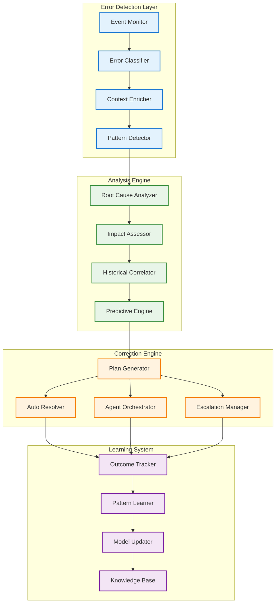
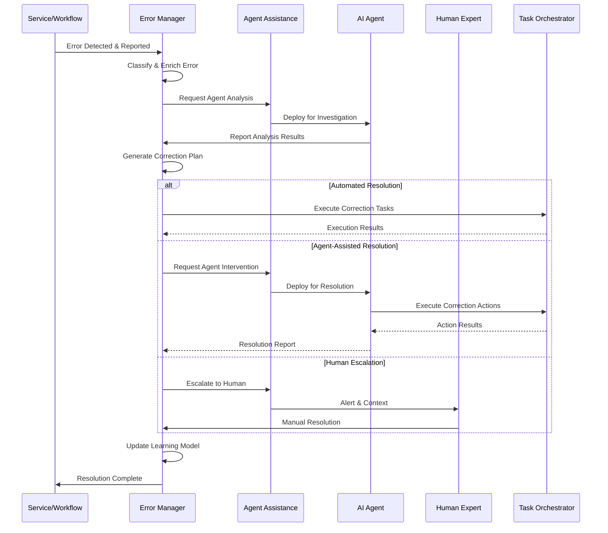
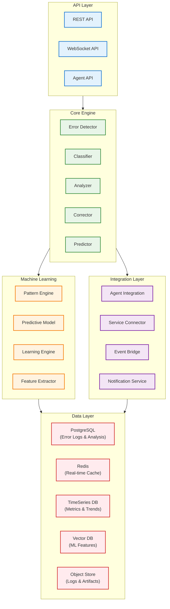

# DADMS 2.0 - Error Manager Service Specification

## Executive Summary

The **Error Manager Service** serves as DADMS 2.0's intelligent error detection, analysis, and autonomous correction engine, providing proactive error management capabilities that enhance system reliability and self-healing. Closely integrated with the Agent Assistance System (AAS), this service enables autonomous error diagnosis, real-time correction implementation, and continuous learning from error patterns to prevent future occurrences.

The service combines advanced error classification, machine learning-based root cause analysis, and agent-driven remediation workflows to create a self-improving error management ecosystem. By empowering agents to autonomously detect, diagnose, and resolve errors in real-time, the Error Manager significantly reduces system downtime, improves workflow reliability, and accelerates problem resolution across the DADMS ecosystem.

---

## 1. Purpose & Responsibilities

### 1.1 Error Detection & Classification Engine
- **Real-Time Monitoring**: Continuous monitoring of execution events across all DADMS services and workflows
- **Multi-Source Error Detection**: Capture errors from workflows, agent actions, model executions, simulations, data flows, and service integrations
- **Intelligent Classification**: Categorize errors by type (system, logic, data, external, agent/user, process), severity, impact, and origin
- **Pattern Recognition**: Identify recurring error patterns and anomalous system behaviors
- **Contextual Enrichment**: Enhance error reports with execution context, stack traces, input/output data, and workflow state
- **Threshold-Based Alerting**: Configurable alerting based on error frequency, severity, and impact metrics

### 1.2 Intelligent Analysis & Root Cause Determination
- **Automated Root Cause Analysis**: ML-driven analysis of error patterns, dependencies, and contributing factors
- **Cross-Service Impact Assessment**: Evaluate cascading effects and downstream implications of errors
- **Historical Correlation**: Compare current errors with historical patterns for rapid diagnosis
- **Agent-Assisted Investigation**: Leverage AAS agents for complex error investigation and hypothesis testing
- **Contextual Analysis**: Incorporate workflow state, system conditions, and environmental factors
- **Predictive Error Detection**: Proactively identify potential error conditions before they manifest

### 1.3 Autonomous Correction & Learning Engine
- **Corrective Action Planning**: Generate actionable remediation plans based on error analysis
- **Automated Resolution**: Implement approved corrections autonomously when authorization criteria are met
- **Agent-Driven Remediation**: Deploy AAS agents for complex error resolution requiring intelligent intervention
- **Escalation Management**: Route errors to appropriate human experts when autonomous resolution is insufficient
- **Feedback Integration**: Learn from correction outcomes to improve future error handling
- **Self-Healing Capabilities**: Implement proactive fixes and system optimizations based on learned patterns

---

## 2. Core Concepts & Data Models

### 2.1 Error Management Architecture



### 2.2 Core Error Models

#### Error Object Framework
```typescript
// Primary Error Data Structure
interface ErrorObject {
  id: string;
  timestamp: Date;
  source: ErrorSource;
  classification: ErrorClassification;
  severity: ErrorSeverity;
  context: ErrorContext;
  details: ErrorDetails;
  metadata: ErrorMetadata;
}

interface ErrorSource {
  serviceId: string;
  serviceName: string;
  componentId?: string;
  workflowId?: string;
  taskId?: string;
  agentId?: string;
  userId?: string;
  sessionId?: string;
}

interface ErrorClassification {
  category: ErrorCategory;
  type: ErrorType;
  subtype?: string;
  tags: string[];
  confidence: number;
  isRecurring: boolean;
  patternId?: string;
}

interface ErrorContext {
  executionState: ExecutionState;
  inputData?: any;
  outputData?: any;
  stackTrace?: string;
  environmentInfo: EnvironmentInfo;
  dependencyStatus: DependencyStatus[];
  resourceUtilization: ResourceUtilization;
}

interface ErrorDetails {
  message: string;
  description?: string;
  errorCode?: string;
  technicalDetails: TechnicalDetails;
  businessImpact: BusinessImpact;
  userImpact?: UserImpact;
}

enum ErrorCategory {
  SYSTEM = 'system',
  LOGIC = 'logic',
  DATA = 'data',
  EXTERNAL = 'external',
  AGENT = 'agent',
  USER = 'user',
  PROCESS = 'process',
  SECURITY = 'security',
  PERFORMANCE = 'performance'
}

enum ErrorType {
  EXCEPTION = 'exception',
  TIMEOUT = 'timeout',
  VALIDATION = 'validation',
  AUTHENTICATION = 'authentication',
  AUTHORIZATION = 'authorization',
  RESOURCE_EXHAUSTION = 'resource_exhaustion',
  NETWORK = 'network',
  DATABASE = 'database',
  INTEGRATION = 'integration',
  CONFIGURATION = 'configuration'
}

enum ErrorSeverity {
  LOW = 'low',
  MEDIUM = 'medium',
  HIGH = 'high',
  CRITICAL = 'critical',
  EMERGENCY = 'emergency'
}
```

#### Error Analysis Framework
```typescript
interface ErrorAnalysis {
  errorId: string;
  analysisId: string;
  rootCauseAnalysis: RootCauseAnalysis;
  impactAssessment: ImpactAssessment;
  historicalCorrelation: HistoricalCorrelation;
  predictiveInsights: PredictiveInsights;
  recommendedActions: RecommendedAction[];
  confidence: number;
  analysisTimestamp: Date;
}

interface RootCauseAnalysis {
  primaryCause: CauseAnalysis;
  contributingFactors: CauseAnalysis[];
  causalChain: CausalChainLink[];
  hypothesis: Hypothesis[];
  confidence: number;
  analysisMethod: AnalysisMethod;
}

interface CauseAnalysis {
  causeId: string;
  description: string;
  category: CauseCategory;
  likelihood: number;
  evidenceStrength: number;
  supportingEvidence: Evidence[];
  mitigationOptions: MitigationOption[];
}

interface ImpactAssessment {
  overallImpact: ImpactLevel;
  affectedSystems: AffectedSystem[];
  businessImpact: BusinessImpactDetails;
  userImpact: UserImpactDetails;
  cascadingEffects: CascadingEffect[];
  recoveryTime: RecoveryTimeEstimate;
}

interface HistoricalCorrelation {
  similarErrors: SimilarError[];
  patternMatches: PatternMatch[];
  successfulResolutions: ResolutionHistory[];
  learningInsights: LearningInsight[];
}

enum CauseCategory {
  TECHNICAL = 'technical',
  PROCEDURAL = 'procedural',
  ENVIRONMENTAL = 'environmental',
  HUMAN = 'human',
  EXTERNAL = 'external',
  DESIGN = 'design'
}

enum ImpactLevel {
  MINIMAL = 'minimal',
  LOW = 'low',
  MODERATE = 'moderate',
  HIGH = 'high',
  SEVERE = 'severe',
  CATASTROPHIC = 'catastrophic'
}
```

#### Correction Framework
```typescript
interface CorrectionPlan {
  planId: string;
  errorId: string;
  strategy: CorrectionStrategy;
  actions: CorrectionAction[];
  executionOrder: ExecutionStep[];
  prerequisites: Prerequisite[];
  riskAssessment: RiskAssessment;
  rollbackPlan: RollbackPlan;
  authorization: AuthorizationRequirement;
  estimatedDuration: number;
  confidence: number;
}

interface CorrectionAction {
  actionId: string;
  type: ActionType;
  description: string;
  target: ActionTarget;
  parameters: ActionParameters;
  automation: AutomationLevel;
  agentAssignment?: AgentAssignment;
  verification: VerificationCriteria;
  rollbackAction?: RollbackAction;
}

interface ExecutionStep {
  stepId: string;
  actionId: string;
  dependencies: string[];
  parallelExecution: boolean;
  timeoutMs: number;
  retryPolicy: RetryPolicy;
  failureHandling: FailureHandling;
}

interface CorrectionOutcome {
  planId: string;
  executionId: string;
  status: ExecutionStatus;
  results: ExecutionResult[];
  metrics: CorrectionMetrics;
  lessons: LessonLearned[];
  feedback: OutcomeFeedback;
  timestamp: Date;
}

enum CorrectionStrategy {
  IMMEDIATE_FIX = 'immediate_fix',
  GRADUAL_REPAIR = 'gradual_repair',
  ROLLBACK = 'rollback',
  WORKAROUND = 'workaround',
  ESCALATION = 'escalation',
  PREVENTIVE = 'preventive'
}

enum ActionType {
  RESTART_SERVICE = 'restart_service',
  RETRY_OPERATION = 'retry_operation',
  REPAIR_DATA = 'repair_data',
  UPDATE_CONFIGURATION = 'update_configuration',
  APPLY_PATCH = 'apply_patch',
  RETRAIN_MODEL = 'retrain_model',
  ADJUST_PARAMETERS = 'adjust_parameters',
  ESCALATE_HUMAN = 'escalate_human',
  DEPLOY_AGENT = 'deploy_agent',
  IMPLEMENT_WORKAROUND = 'implement_workaround'
}

enum AutomationLevel {
  FULLY_AUTOMATED = 'fully_automated',
  AGENT_ASSISTED = 'agent_assisted',
  HUMAN_SUPERVISED = 'human_supervised',
  MANUAL_ONLY = 'manual_only'
}

enum ExecutionStatus {
  PLANNED = 'planned',
  IN_PROGRESS = 'in_progress',
  COMPLETED = 'completed',
  FAILED = 'failed',
  CANCELLED = 'cancelled',
  ROLLED_BACK = 'rolled_back'
}
```

### 2.3 Learning & Prediction Models

#### Machine Learning Framework
```typescript
interface ErrorPredictionModel {
  modelId: string;
  modelType: ModelType;
  trainingData: TrainingDataSet;
  features: ModelFeature[];
  accuracy: ModelAccuracy;
  deployment: ModelDeployment;
  updateSchedule: UpdateSchedule;
}

interface PatternLearning {
  patternId: string;
  description: string;
  conditions: PatternCondition[];
  frequency: number;
  confidence: number;
  effectiveness: number;
  associatedErrors: string[];
  successfulResolutions: string[];
  recommendations: PatternRecommendation[];
}

interface KnowledgeBase {
  version: string;
  lastUpdated: Date;
  errorPatterns: ErrorPattern[];
  resolutionStrategies: ResolutionStrategy[];
  bestPractices: BestPractice[];
  automationRules: AutomationRule[];
  escalationRules: EscalationRule[];
}

enum ModelType {
  CLASSIFICATION = 'classification',
  REGRESSION = 'regression',
  CLUSTERING = 'clustering',
  ANOMALY_DETECTION = 'anomaly_detection',
  TIME_SERIES = 'time_series',
  DEEP_LEARNING = 'deep_learning'
}
```

---

## 3. API Specification

### 3.1 Core API Interface

```typescript
// Main Error Manager Service Interface
interface ErrorManager {
  // Error Reporting & Detection
  reportError(error: ErrorObject): Promise<ErrorId>;
  detectAnomalies(scope: MonitoringScope): Promise<AnomalyDetection[]>;
  classifyError(errorId: string): Promise<ErrorClassification>;
  enrichContext(errorId: string): Promise<EnrichedErrorContext>;
  
  // Error Analysis
  analyzeError(errorId: string, options?: AnalysisOptions): Promise<ErrorAnalysis>;
  getRootCause(errorId: string): Promise<RootCauseAnalysis>;
  assessImpact(errorId: string): Promise<ImpactAssessment>;
  correlateHistorical(errorId: string): Promise<HistoricalCorrelation>;
  
  // Correction Planning & Execution
  suggestCorrection(errorId: string, preferences?: CorrectionPreferences): Promise<CorrectionPlan>;
  applyCorrection(errorId: string, plan: CorrectionPlan): Promise<CorrectionExecution>;
  validateCorrection(executionId: string): Promise<ValidationResult>;
  rollbackCorrection(executionId: string): Promise<RollbackResult>;
  
  // Agent Integration
  assignAgent(errorId: string, agentId: string, role: AgentRole): Promise<AgentAssignment>;
  getAgentRecommendations(errorId: string): Promise<AgentRecommendation[]>;
  delegateResolution(errorId: string, agentCapabilities: AgentCapabilities): Promise<DelegationResult>;
  
  // Monitoring & Tracking
  getErrorHistory(entityId?: string, filters?: ErrorFilters): Promise<ErrorLog[]>;
  getSystemHealth(scope?: HealthScope): Promise<SystemHealthReport>;
  getErrorMetrics(timeRange: TimeRange, aggregation?: MetricAggregation): Promise<ErrorMetrics>;
  
  // Learning & Prediction
  updateLearningModel(modelType: ModelType, trainingData: TrainingData): Promise<ModelUpdate>;
  predictErrors(context: PredictionContext): Promise<ErrorPrediction[]>;
  getPatternInsights(domain?: string): Promise<PatternInsight[]>;
  
  // Configuration & Management
  configureThresholds(thresholds: AlertThreshold[]): Promise<void>;
  manageAutomationRules(rules: AutomationRule[]): Promise<void>;
  setEscalationPolicies(policies: EscalationPolicy[]): Promise<void>;
}
```

### 3.2 Request/Response Models

#### Error Reporting Models
```typescript
interface ErrorReportRequest {
  source: ErrorSource;
  error: {
    message: string;
    details?: any;
    stackTrace?: string;
    errorCode?: string;
  };
  context: {
    executionState?: any;
    inputData?: any;
    outputData?: any;
    environmentInfo?: any;
  };
  severity?: ErrorSeverity;
  tags?: string[];
}

interface AnalysisOptions {
  depth: AnalysisDepth;
  includeHistorical: boolean;
  includePredictive: boolean;
  agentAssistance: boolean;
  timeoutMs?: number;
}

interface CorrectionPreferences {
  automationLevel: AutomationLevel;
  riskTolerance: RiskTolerance;
  timeConstraints?: TimeConstraints;
  resourceConstraints?: ResourceConstraints;
  approvalRequired?: boolean;
}
```

#### Response Models
```typescript
interface ErrorResponse {
  errorId: string;
  status: ProcessingStatus;
  classification?: ErrorClassification;
  analysis?: ErrorAnalysis;
  correctionPlan?: CorrectionPlan;
  metadata: ResponseMetadata;
}

interface CorrectionExecution {
  executionId: string;
  planId: string;
  status: ExecutionStatus;
  progress: ExecutionProgress;
  currentStep: ExecutionStep;
  estimatedCompletion: Date;
  results: ExecutionResult[];
}

enum ProcessingStatus {
  RECEIVED = 'received',
  ANALYZING = 'analyzing',
  PLANNING = 'planning',
  EXECUTING = 'executing',
  COMPLETED = 'completed',
  FAILED = 'failed'
}
```

---

## 4. Service Integration Architecture

### 4.1 Agent Assistance System Integration



### 4.2 Event-Driven Integration

#### Event Publishing
```typescript
interface ErrorManagerEvents {
  // Error Detection Events
  'error.detected': {
    errorId: string;
    source: ErrorSource;
    severity: ErrorSeverity;
    category: ErrorCategory;
    timestamp: Date;
  };
  
  'error.classified': {
    errorId: string;
    classification: ErrorClassification;
    confidence: number;
    isRecurring: boolean;
  };
  
  'pattern.detected': {
    patternId: string;
    errorIds: string[];
    frequency: number;
    riskLevel: string;
    recommendations: string[];
  };
  
  // Analysis Events
  'analysis.completed': {
    errorId: string;
    analysisId: string;
    rootCause: string;
    impact: ImpactLevel;
    correctionRequired: boolean;
  };
  
  'prediction.generated': {
    predictionId: string;
    predictedErrors: ErrorPrediction[];
    confidence: number;
    timeframe: string;
    preventiveActions: string[];
  };
  
  // Correction Events
  'correction.planned': {
    errorId: string;
    planId: string;
    strategy: CorrectionStrategy;
    automationLevel: AutomationLevel;
    estimatedDuration: number;
  };
  
  'correction.started': {
    executionId: string;
    planId: string;
    actions: string[];
    assignedAgents: string[];
  };
  
  'correction.completed': {
    executionId: string;
    status: ExecutionStatus;
    outcome: CorrectionOutcome;
    lessonsLearned: string[];
  };
  
  // Agent Integration Events
  'agent.assigned': {
    errorId: string;
    agentId: string;
    role: AgentRole;
    capabilities: string[];
  };
  
  'agent.resolution.completed': {
    errorId: string;
    agentId: string;
    resolution: string;
    effectiveness: number;
    timeToResolve: number;
  };
  
  // Learning Events
  'model.updated': {
    modelType: ModelType;
    version: string;
    accuracy: number;
    improvements: string[];
  };
  
  'knowledge.enriched': {
    knowledgeType: string;
    updates: string[];
    sources: string[];
    confidence: number;
  };
}
```

#### Event Subscriptions
```typescript
interface ErrorManagerSubscriptions {
  // Service Events
  'service.failed': (event: ServiceFailureEvent) => void;
  'workflow.error': (event: WorkflowErrorEvent) => void;
  'task.failed': (event: TaskFailureEvent) => void;
  
  // Agent Events
  'agent.error': (event: AgentErrorEvent) => void;
  'agent.feedback': (event: AgentFeedbackEvent) => void;
  
  // System Events
  'system.anomaly': (event: SystemAnomalyEvent) => void;
  'performance.degradation': (event: PerformanceDegradationEvent) => void;
  
  // Model Events
  'model.failure': (event: ModelFailureEvent) => void;
  'simulation.error': (event: SimulationErrorEvent) => void;
}
```

---

## 5. Implementation Architecture

### 5.1 Service Architecture



### 5.2 PostgreSQL Schema Design

```sql
-- Error Management Tables
CREATE TABLE errors (
    id UUID PRIMARY KEY DEFAULT gen_random_uuid(),
    source_service_id VARCHAR(255) NOT NULL,
    source_component_id VARCHAR(255),
    workflow_id VARCHAR(255),
    task_id VARCHAR(255),
    agent_id VARCHAR(255),
    user_id VARCHAR(255),
    session_id VARCHAR(255),
    category VARCHAR(50) NOT NULL,
    type VARCHAR(50) NOT NULL,
    severity VARCHAR(20) NOT NULL,
    message TEXT NOT NULL,
    description TEXT,
    error_code VARCHAR(100),
    stack_trace TEXT,
    input_data JSONB,
    output_data JSONB,
    context JSONB DEFAULT '{}',
    environment_info JSONB DEFAULT '{}',
    tags TEXT[],
    is_recurring BOOLEAN DEFAULT FALSE,
    pattern_id VARCHAR(255),
    created_at TIMESTAMPTZ NOT NULL DEFAULT NOW(),
    updated_at TIMESTAMPTZ NOT NULL DEFAULT NOW(),
    
    CONSTRAINT valid_category CHECK (category IN ('system', 'logic', 'data', 'external', 'agent', 'user', 'process', 'security', 'performance')),
    CONSTRAINT valid_type CHECK (type IN ('exception', 'timeout', 'validation', 'authentication', 'authorization', 'resource_exhaustion', 'network', 'database', 'integration', 'configuration')),
    CONSTRAINT valid_severity CHECK (severity IN ('low', 'medium', 'high', 'critical', 'emergency'))
);

CREATE TABLE error_analysis (
    id UUID PRIMARY KEY DEFAULT gen_random_uuid(),
    error_id UUID NOT NULL REFERENCES errors(id) ON DELETE CASCADE,
    analysis_method VARCHAR(50) NOT NULL,
    root_cause JSONB DEFAULT '{}',
    contributing_factors JSONB DEFAULT '[]',
    impact_assessment JSONB DEFAULT '{}',
    historical_correlation JSONB DEFAULT '{}',
    predictive_insights JSONB DEFAULT '{}',
    confidence DECIMAL(3,2),
    analysis_duration_ms INTEGER,
    created_at TIMESTAMPTZ NOT NULL DEFAULT NOW(),
    created_by VARCHAR(255),
    
    CONSTRAINT valid_confidence CHECK (confidence BETWEEN 0 AND 1)
);

CREATE TABLE correction_plans (
    id UUID PRIMARY KEY DEFAULT gen_random_uuid(),
    error_id UUID NOT NULL REFERENCES errors(id) ON DELETE CASCADE,
    strategy VARCHAR(50) NOT NULL,
    actions JSONB NOT NULL DEFAULT '[]',
    execution_order JSONB NOT NULL DEFAULT '[]',
    prerequisites JSONB DEFAULT '[]',
    risk_assessment JSONB DEFAULT '{}',
    rollback_plan JSONB DEFAULT '{}',
    authorization_level VARCHAR(50) NOT NULL,
    estimated_duration_ms INTEGER,
    confidence DECIMAL(3,2),
    status VARCHAR(20) DEFAULT 'planned',
    created_at TIMESTAMPTZ NOT NULL DEFAULT NOW(),
    updated_at TIMESTAMPTZ NOT NULL DEFAULT NOW(),
    created_by VARCHAR(255),
    
    CONSTRAINT valid_strategy CHECK (strategy IN ('immediate_fix', 'gradual_repair', 'rollback', 'workaround', 'escalation', 'preventive')),
    CONSTRAINT valid_status CHECK (status IN ('planned', 'approved', 'rejected', 'in_progress', 'completed', 'failed', 'cancelled')),
    CONSTRAINT valid_confidence CHECK (confidence BETWEEN 0 AND 1)
);

CREATE TABLE correction_executions (
    id UUID PRIMARY KEY DEFAULT gen_random_uuid(),
    plan_id UUID NOT NULL REFERENCES correction_plans(id) ON DELETE CASCADE,
    execution_status VARCHAR(20) NOT NULL DEFAULT 'planned',
    progress JSONB DEFAULT '{}',
    results JSONB DEFAULT '[]',
    metrics JSONB DEFAULT '{}',
    assigned_agents JSONB DEFAULT '[]',
    started_at TIMESTAMPTZ,
    completed_at TIMESTAMPTZ,
    created_at TIMESTAMPTZ NOT NULL DEFAULT NOW(),
    updated_at TIMESTAMPTZ NOT NULL DEFAULT NOW(),
    executed_by VARCHAR(255),
    
    CONSTRAINT valid_execution_status CHECK (execution_status IN ('planned', 'in_progress', 'completed', 'failed', 'cancelled', 'rolled_back'))
);

-- Pattern Recognition Tables
CREATE TABLE error_patterns (
    id UUID PRIMARY KEY DEFAULT gen_random_uuid(),
    pattern_signature VARCHAR(255) NOT NULL UNIQUE,
    description TEXT,
    conditions JSONB NOT NULL DEFAULT '[]',
    frequency INTEGER DEFAULT 1,
    confidence DECIMAL(3,2),
    effectiveness DECIMAL(3,2),
    associated_errors UUID[],
    successful_resolutions UUID[],
    recommendations JSONB DEFAULT '[]',
    first_detected TIMESTAMPTZ NOT NULL DEFAULT NOW(),
    last_detected TIMESTAMPTZ NOT NULL DEFAULT NOW(),
    is_active BOOLEAN DEFAULT TRUE,
    
    CONSTRAINT valid_frequency CHECK (frequency > 0),
    CONSTRAINT valid_confidence CHECK (confidence BETWEEN 0 AND 1),
    CONSTRAINT valid_effectiveness CHECK (effectiveness BETWEEN 0 AND 1)
);

-- Agent Integration Tables
CREATE TABLE agent_assignments (
    id UUID PRIMARY KEY DEFAULT gen_random_uuid(),
    error_id UUID NOT NULL REFERENCES errors(id) ON DELETE CASCADE,
    agent_id VARCHAR(255) NOT NULL,
    role VARCHAR(50) NOT NULL,
    capabilities JSONB DEFAULT '[]',
    assignment_reason TEXT,
    status VARCHAR(20) DEFAULT 'assigned',
    progress JSONB DEFAULT '{}',
    results JSONB DEFAULT '{}',
    assigned_at TIMESTAMPTZ NOT NULL DEFAULT NOW(),
    completed_at TIMESTAMPTZ,
    
    CONSTRAINT valid_role CHECK (role IN ('investigator', 'resolver', 'validator', 'escalator')),
    CONSTRAINT valid_status CHECK (status IN ('assigned', 'in_progress', 'completed', 'failed', 'cancelled'))
);

-- Learning and Model Tables
CREATE TABLE ml_models (
    id UUID PRIMARY KEY DEFAULT gen_random_uuid(),
    model_type VARCHAR(50) NOT NULL,
    version VARCHAR(50) NOT NULL,
    description TEXT,
    features JSONB NOT NULL DEFAULT '[]',
    accuracy DECIMAL(5,4),
    precision_score DECIMAL(5,4),
    recall_score DECIMAL(5,4),
    f1_score DECIMAL(5,4),
    training_data_size INTEGER,
    model_artifact_path TEXT,
    deployment_status VARCHAR(20) DEFAULT 'trained',
    created_at TIMESTAMPTZ NOT NULL DEFAULT NOW(),
    updated_at TIMESTAMPTZ NOT NULL DEFAULT NOW(),
    created_by VARCHAR(255),
    
    CONSTRAINT valid_model_type CHECK (model_type IN ('classification', 'regression', 'clustering', 'anomaly_detection', 'time_series', 'deep_learning')),
    CONSTRAINT valid_deployment_status CHECK (deployment_status IN ('trained', 'testing', 'deployed', 'deprecated')),
    UNIQUE(model_type, version)
);

CREATE TABLE learning_feedback (
    id UUID PRIMARY KEY DEFAULT gen_random_uuid(),
    error_id UUID NOT NULL REFERENCES errors(id) ON DELETE CASCADE,
    correction_execution_id UUID REFERENCES correction_executions(id),
    feedback_type VARCHAR(50) NOT NULL,
    outcome VARCHAR(20) NOT NULL,
    effectiveness_score DECIMAL(3,2),
    lessons_learned JSONB DEFAULT '[]',
    improvement_suggestions JSONB DEFAULT '[]',
    feedback_source VARCHAR(50) NOT NULL,
    source_id VARCHAR(255),
    created_at TIMESTAMPTZ NOT NULL DEFAULT NOW(),
    
    CONSTRAINT valid_feedback_type CHECK (feedback_type IN ('resolution_success', 'resolution_failure', 'prevention_success', 'false_positive', 'missed_detection')),
    CONSTRAINT valid_outcome CHECK (outcome IN ('success', 'partial_success', 'failure', 'unknown')),
    CONSTRAINT valid_effectiveness CHECK (effectiveness_score BETWEEN 0 AND 1),
    CONSTRAINT valid_feedback_source CHECK (feedback_source IN ('automated', 'agent', 'human', 'system'))
);

-- Configuration Tables
CREATE TABLE alert_thresholds (
    id UUID PRIMARY KEY DEFAULT gen_random_uuid(),
    scope VARCHAR(100) NOT NULL,
    metric VARCHAR(100) NOT NULL,
    threshold_value DECIMAL(10,4) NOT NULL,
    comparison_operator VARCHAR(10) NOT NULL,
    severity VARCHAR(20) NOT NULL,
    notification_channels JSONB DEFAULT '[]',
    is_active BOOLEAN DEFAULT TRUE,
    created_at TIMESTAMPTZ NOT NULL DEFAULT NOW(),
    updated_at TIMESTAMPTZ NOT NULL DEFAULT NOW(),
    created_by VARCHAR(255),
    
    CONSTRAINT valid_comparison_operator CHECK (comparison_operator IN ('>', '>=', '<', '<=', '=', '!=')),
    CONSTRAINT valid_threshold_severity CHECK (severity IN ('low', 'medium', 'high', 'critical', 'emergency'))
);

CREATE TABLE automation_rules (
    id UUID PRIMARY KEY DEFAULT gen_random_uuid(),
    name VARCHAR(255) NOT NULL,
    description TEXT,
    conditions JSONB NOT NULL DEFAULT '[]',
    actions JSONB NOT NULL DEFAULT '[]',
    automation_level VARCHAR(20) NOT NULL,
    risk_threshold DECIMAL(3,2),
    approval_required BOOLEAN DEFAULT FALSE,
    max_executions_per_hour INTEGER DEFAULT 10,
    is_active BOOLEAN DEFAULT TRUE,
    created_at TIMESTAMPTZ NOT NULL DEFAULT NOW(),
    updated_at TIMESTAMPTZ NOT NULL DEFAULT NOW(),
    created_by VARCHAR(255),
    
    CONSTRAINT valid_automation_level CHECK (automation_level IN ('fully_automated', 'agent_assisted', 'human_supervised', 'manual_only')),
    CONSTRAINT valid_risk_threshold CHECK (risk_threshold BETWEEN 0 AND 1)
);

-- Indexes for Performance
CREATE INDEX idx_errors_timestamp ON errors(created_at);
CREATE INDEX idx_errors_source_service ON errors(source_service_id);
CREATE INDEX idx_errors_category_severity ON errors(category, severity);
CREATE INDEX idx_errors_pattern ON errors(pattern_id);
CREATE INDEX idx_errors_recurring ON errors(is_recurring) WHERE is_recurring = TRUE;
CREATE INDEX idx_error_analysis_error_id ON error_analysis(error_id);
CREATE INDEX idx_correction_plans_error_id ON correction_plans(error_id);
CREATE INDEX idx_correction_executions_plan_id ON correction_executions(plan_id);
CREATE INDEX idx_agent_assignments_error_id ON agent_assignments(error_id);
CREATE INDEX idx_agent_assignments_agent_id ON agent_assignments(agent_id);
CREATE INDEX idx_learning_feedback_error_id ON learning_feedback(error_id);
CREATE INDEX idx_ml_models_type_version ON ml_models(model_type, version);
CREATE INDEX idx_error_patterns_signature ON error_patterns(pattern_signature);
```

### 5.3 Performance Considerations

#### Optimization Strategies
- **Real-Time Processing**: Stream processing for immediate error detection and classification
- **Caching**: Redis for frequently accessed error patterns and resolution strategies  
- **Time Series Database**: Specialized storage for metrics and trend analysis
- **Vector Database**: Efficient similarity search for error pattern matching
- **Parallel Processing**: Distributed analysis for complex root cause investigations
- **Incremental Learning**: Online learning models that update continuously
- **Background Processing**: Async execution of non-critical analysis tasks

#### Scaling Architecture
- **Horizontal Scaling**: Stateless service instances with load balancing
- **Event Streaming**: Apache Kafka for high-throughput error event processing
- **Database Partitioning**: Partition by time and service for improved performance
- **ML Model Serving**: Dedicated model serving infrastructure for predictions
- **CDN Integration**: Cache frequently accessed error documentation and guides

---

## 6. Security & Access Control

### 6.1 Security Framework
- **Authentication**: JWT-based service authentication with role-based access
- **Authorization**: Fine-grained permissions for error access, analysis, and correction
- **Data Privacy**: Encryption of sensitive error data and personally identifiable information
- **Audit Logging**: Comprehensive audit trail for all error management activities
- **Access Controls**: Role-based access to error details based on security clearance

### 6.2 Agent Security
- **Agent Authentication**: Secure agent identity verification and capability validation
- **Execution Boundaries**: Sandboxed agent execution environments for correction actions
- **Permission Management**: Granular permissions for agent-driven error resolution
- **Monitoring**: Real-time monitoring of agent activities and correction implementations

---

## 7. Implementation Roadmap

### Phase 1: Foundation (Weeks 1-2)
- **Core Service Setup**: Basic service infrastructure and API framework
- **Error Detection Engine**: Real-time error monitoring and classification
- **Database Schema**: Implement PostgreSQL schema and basic CRUD operations
- **Event Integration**: Connect to Event Manager for error event publishing

### Phase 2: Analysis & Intelligence (Weeks 3-4)
- **Root Cause Analysis**: Automated analysis engine with pattern recognition
- **Agent Integration**: Basic AAS integration for agent-assisted investigation
- **Historical Correlation**: Error pattern matching and historical analysis
- **Correction Planning**: Automated correction plan generation

### Phase 3: Autonomous Correction (Weeks 5-6)
- **Automated Resolution**: Implement autonomous correction capabilities
- **Agent Orchestration**: Advanced agent deployment for complex error resolution
- **Escalation Management**: Human-in-the-loop escalation workflows
- **Validation Framework**: Correction outcome validation and rollback capabilities

### Phase 4: Learning & Prediction (Weeks 7-8)
- **Machine Learning Models**: Predictive error detection and prevention
- **Continuous Learning**: Feedback integration and model improvement
- **Advanced Analytics**: Pattern insights and performance optimization
- **Knowledge Base**: Comprehensive error knowledge management system

---

## 8. Success Metrics

### Performance Metrics
- **Detection Speed**: Error detection and classification < 5 seconds
- **Resolution Time**: Automated resolution completion < 2 minutes for routine errors
- **Accuracy**: Error classification accuracy > 95%
- **Availability**: 99.9% service uptime with automated failover

### Business Metrics
- **Error Reduction**: 60% reduction in recurring errors within 3 months
- **Resolution Efficiency**: 80% of errors resolved autonomously without human intervention
- **System Reliability**: 99.5% system uptime improvement across DADMS ecosystem
- **Learning Effectiveness**: 90% accuracy in error prediction models

### Technical Metrics
- **API Response Time**: < 100ms for error reporting endpoints
- **Analysis Throughput**: Handle 10,000+ error events per minute
- **Storage Efficiency**: Optimized storage with 80% compression ratio
- **Agent Integration**: 99.9% success rate in agent task execution

---

*This specification serves as the foundation for implementing DADMS 2.0's Error Manager Service, providing intelligent error management capabilities that enhance system reliability and enable autonomous problem resolution through deep Agent Assistance System integration.* 