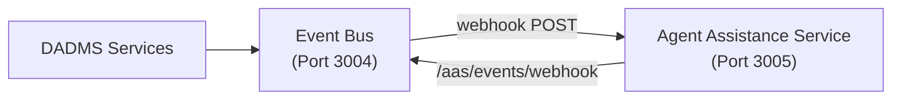
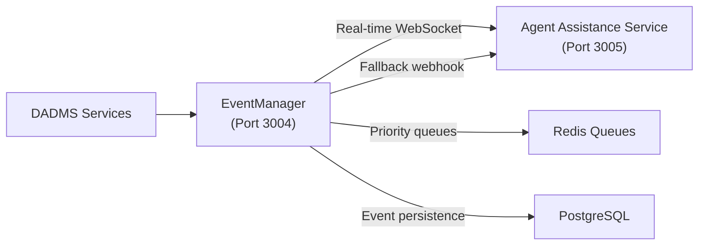

# Event Bus → EventManager Migration Analysis

## Current State: Event Bus Service (Port 3004)

### AAS Integration Pattern


### Current Event Schema
```typescript
interface CurrentEvent {
  id: string;                  // Unique event identifier
  event_type: string;          // Event type (e.g., "process.stuck")
  source_service: string;      // Service that published the event
  data: object;                // Event payload
  timestamp: string;           // ISO date-time
  user_id?: string;           // Associated user
  project_id?: string;        // Associated project
}
```

### Current AAS Subscription
- **Webhook URL**: `https://aas-service:3005/events/webhook`
- **Event Types**: Can subscribe to specific types with filtering
- **Delivery**: HTTP POST to webhook endpoint
- **Monitoring**: AAS receives ALL relevant events for continuous monitoring

## Proposed State: EventManager Service (Port 3004)

### Enhanced AAS Integration Pattern


### Enhanced Event Schema
```typescript
interface EnhancedEvent {
  id: string;                    // UUID for idempotency
  type: string;                  // Event type (maps to event_type)
  source: string;                // Originating service (maps to source_service)
  timestamp: Date;               // ISO 8601 timestamp
  version: string;               // Schema version
  topic: string;                 // Routing topic
  priority: EventPriority;       // CRITICAL, HIGH, NORMAL, LOW
  metadata: EventMetadata;       // Enhanced metadata
  payload: Record<string, any>;  // Event data (maps to data)
  correlationId?: string;        // For request tracing
  causationId?: string;          // Previous event that caused this
}
```

## AAS Continuous Monitoring Requirements

### ✅ **Requirement 1: ALL Events**
- **Current**: AAS subscribes to specific event types
- **EventManager**: AAS subscribes to wildcard topic `#` (all events)
- **Solution**: EventManager supports universal subscription

### ✅ **Requirement 2: Real-time Delivery**
- **Current**: HTTP webhook with potential latency
- **EventManager**: WebSocket connection for sub-100ms delivery
- **Solution**: Dual delivery (WebSocket primary, webhook fallback)

### ✅ **Requirement 3: High Volume Handling**
- **Current**: Individual webhook calls per event
- **EventManager**: Batching, priority queues, filtering
- **Solution**: Smart batching and priority handling for AAS

### ✅ **Requirement 4: Reliability**
- **Current**: Basic webhook delivery, no retry
- **EventManager**: Retry policies, dead letter queues, persistence
- **Solution**: Guaranteed delivery with replay capabilities

## Migration Strategy

### Phase 1: Backward Compatibility
```typescript
// EventManager supports current Event schema
const legacyEventAdapter = (modernEvent: Event): CurrentEvent => ({
  id: modernEvent.id,
  event_type: modernEvent.type,
  source_service: modernEvent.source,
  data: modernEvent.payload,
  timestamp: modernEvent.timestamp.toISOString(),
  user_id: modernEvent.metadata.userId,
  project_id: modernEvent.metadata.projectId
});
```

### Phase 2: Enhanced AAS Integration
```typescript
// AAS subscription for continuous monitoring
const aasSubscription = {
  topic: '#',                          // ALL events
  handler: aasEventHandler,
  options: {
    priority: EventPriority.HIGH,      // High priority processing
    batchSize: 10,                     // Batch events for efficiency
    realtime: true,                    // WebSocket delivery
    fallbackWebhook: 'https://aas-service:3005/events/webhook'
  }
};
```

### Phase 3: Scalability Optimizations
```typescript
// Smart filtering for AAS based on event significance
const aasEventFilter = {
  includeCritical: true,               // Always include CRITICAL events
  includeUserContext: true,            // Events for current user's context
  includeProjectContext: true,         // Events for user's active projects
  excludeSystemHeartbeat: true,        // Exclude routine system events
  priority: EventPriority.HIGH         // Minimum priority level
};
```

## Scalability Concerns & Solutions

### **Problem**: Event Volume Growth
- **Impact**: As tool usage grows, event volume could overwhelm AAS
- **Solution**: Intelligent filtering and priority-based delivery

### **Problem**: Real-time Processing
- **Impact**: AAS needs immediate awareness for proactive assistance
- **Solution**: WebSocket streams with priority queues

### **Problem**: Context Relevance
- **Impact**: Not all events are relevant for user assistance
- **Solution**: Context-aware filtering based on user session and project

## EventManager AAS Integration Features

### 1. **Universal Monitoring Subscription**
```typescript
// AAS subscribes to all events with smart filtering
await eventManager.subscribe({
  topic: '#',
  handler: aasGlobalEventHandler,
  filter: {
    priority: EventPriority.NORMAL,    // Minimum priority
    tags: ['user-relevant', 'critical-system'],
    excludeTypes: ['system.heartbeat', 'metrics.internal']
  }
});
```

### 2. **Context-Aware Delivery**
```typescript
// AAS receives enhanced context with each event
const aasEvent = {
  ...event,
  aasContext: {
    userRelevance: calculateUserRelevance(event, currentUser),
    assistanceOpportunity: identifyAssistanceOpportunity(event),
    suggestedActions: generateSuggestedActions(event)
  }
};
```

### 3. **Real-time Intelligence Feed**
```typescript
// WebSocket stream for immediate AAS awareness
const aasRealtimeStream = eventManager.createRealtimeStream({
  subscriber: 'aas-service',
  filters: {
    priority: [EventPriority.CRITICAL, EventPriority.HIGH],
    userContext: true,
    projectContext: true
  }
});
```

## Conclusion: EventManager ✅ Replaces Event Bus

### **Decision**: YES, EventManager properly replaces Event Bus with enhanced AAS integration

### **Key Benefits**:
1. **Better AAS Monitoring**: Real-time WebSocket + smart filtering
2. **Enhanced Reliability**: Retry policies, persistence, replay
3. **Improved Scalability**: Priority queues, batching, context-aware filtering
4. **Backward Compatibility**: Supports current AAS webhook integration
5. **Future-Proof**: Extensible for advanced AAS intelligence features

### **Migration Path**:
1. Deploy EventManager on port 3004 (same as Event Bus)
2. Maintain AAS webhook endpoint for compatibility
3. Add WebSocket connection for real-time events
4. Implement smart filtering for scalability
5. Gradually enhance AAS with richer event context

The EventManager is not just a replacement—it's a significant upgrade that enables more intelligent, scalable AAS monitoring while maintaining backward compatibility. 