# EventManager Architecture Diagrams

This document contains the visual diagrams for the DADMS EventManager service architecture and integration patterns.

## 1. EventManager System Integration

This diagram shows how the EventManager integrates with the overall DADMS ecosystem:

## 2. Event Processing Sequence Flow

This sequence diagram illustrates the complete event lifecycle through the EventManager:

## 3. EventManager API Structure

This diagram shows the EventManager's API layers and client interaction patterns:

```mermaid
graph LR
    subgraph "Client Applications"
        WebApp["🌐 Web UI<br/>React App"]
        Mobile["📱 Mobile App<br/>React Native"]
        CLI["⌨️ CLI Tools<br/>Node.js"]
        ExtSys["🔗 External<br/>Systems"]
    end
    
    subgraph "EventManager API Layer (Port 3004)"
        REST["🔌 REST API<br/>/api/v1"]
        WS["🌐 WebSocket<br/>/ws"]
        GraphQL["📊 GraphQL<br/>/graphql"]
        gRPC["⚡ gRPC<br/>:3004"]
    end
    
    subgraph "Core EventManager"
        EM["🎯 EventManager<br/>Core Engine"]
        
        subgraph "API Handlers"
            HTTP["HTTP Handler"]
            WSHandler["WebSocket Handler"] 
            GQLHandler["GraphQL Handler"]
            RPCHandler["gRPC Handler"]
        end
        
        subgraph "Core Services"
            PubSub["Publish/Subscribe<br/>Manager"]
            TopicMgr["Topic<br/>Manager"]
            SubMgr["Subscription<br/>Manager"]
            EventStore["Event<br/>Store"]
        end
    end
    
    subgraph "Event Operations"
        Pub["📤 Publishing<br/>• Single Event<br/>• Batch Events<br/>• Scheduled Events"]
        Sub["📥 Subscribing<br/>• Topic Patterns<br/>• Event Filters<br/>• WebSocket Streams"]
        Query["🔍 Querying<br/>• Event History<br/>• Topic Browse<br/>• Metrics"]
        Mgmt["⚙️ Management<br/>• Health Checks<br/>• Dead Letters<br/>• Replay Events"]
    end
    
    subgraph "Example API Calls"
        Ex1["POST /events<br/>{ type: 'project.created',<br/>  payload: {...} }"]
        Ex2["GET /topics/project.*/events<br/>?limit=100&since=2024-01-01"]
        Ex3["WS: /ws/subscribe<br/>{ topic: 'llm.*',<br/>  filter: { priority: 'HIGH' } }"]
        Ex4["POST /subscriptions<br/>{ topic: 'knowledge.*',<br/>  webhook: 'https://...' }"]
    end
    
    %% Client Connections
    WebApp -.->|"HTTP/WebSocket"| REST
    WebApp -.->|"Real-time"| WS
    Mobile -.->|"HTTP"| REST
    CLI -.->|"gRPC"| gRPC
    ExtSys -.->|"GraphQL"| GraphQL
    
    %% API to Handlers
    REST --> HTTP
    WS --> WSHandler
    GraphQL --> GQLHandler
    gRPC --> RPCHandler
    
    %% Handlers to Core
    HTTP --> EM
    WSHandler --> EM
    GQLHandler --> EM
    RPCHandler --> EM
    
    %% Core Services
    EM --> PubSub
    EM --> TopicMgr
    EM --> SubMgr
    EM --> EventStore
    
    %% Operations
    PubSub -.-> Pub
    SubMgr -.-> Sub
    EventStore -.-> Query
    EM -.-> Mgmt
    
    %% Examples
    Pub -.-> Ex1
    Query -.-> Ex2
    Sub -.-> Ex3
    Sub -.-> Ex4
    
    %% Styling
    classDef client fill:#e3f2fd,stroke:#1976d2,stroke-width:2px
    classDef api fill:#f3e5f5,stroke:#7b1fa2,stroke-width:2px
    classDef core fill:#e8f5e8,stroke:#388e3c,stroke-width:2px
    classDef handler fill:#fff3e0,stroke:#f57c00,stroke-width:2px
    classDef service fill:#fce4ec,stroke:#c2185b,stroke-width:2px
    classDef operation fill:#f1f8e9,stroke:#689f38,stroke-width:2px
    classDef example fill:#fafafa,stroke:#616161,stroke-width:1px
    
    class WebApp,Mobile,CLI,ExtSys client
    class REST,WS,GraphQL,gRPC api
    class EM core
    class HTTP,WSHandler,GQLHandler,RPCHandler handler
    class PubSub,TopicMgr,SubMgr,EventStore service
    class Pub,Sub,Query,Mgmt operation
    class Ex1,Ex2,Ex3,Ex4 example
```

## Diagram References

These diagrams are referenced in:
- [EventManager Service Specification](./event_manager_specification.md)
- [DADMS Architecture Overview](./DADMS_ARCHITECTURE_OVERVIEW.md)

## Usage Notes

1. **System Integration Diagram**: Use this to understand how EventManager fits into the overall DADMS ecosystem
2. **Sequence Flow Diagram**: Reference this for understanding the event processing lifecycle and error handling
3. **API Structure Diagram**: Use this for client integration planning and API development

All diagrams are designed to be updated as the EventManager implementation evolves through the planned phases. 