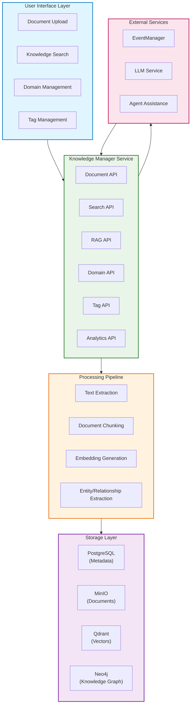
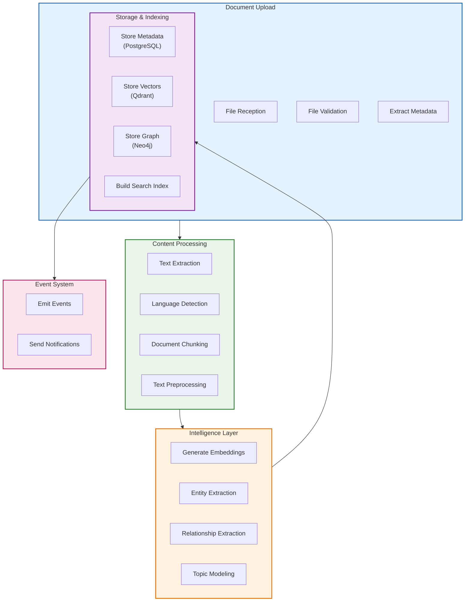
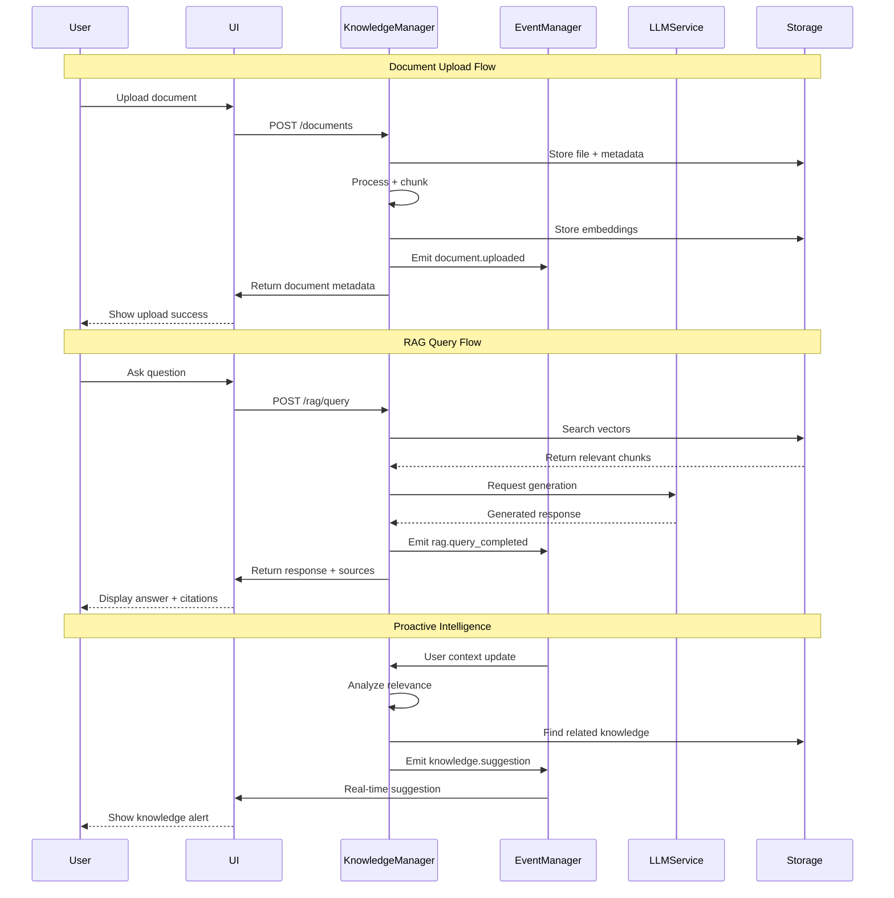
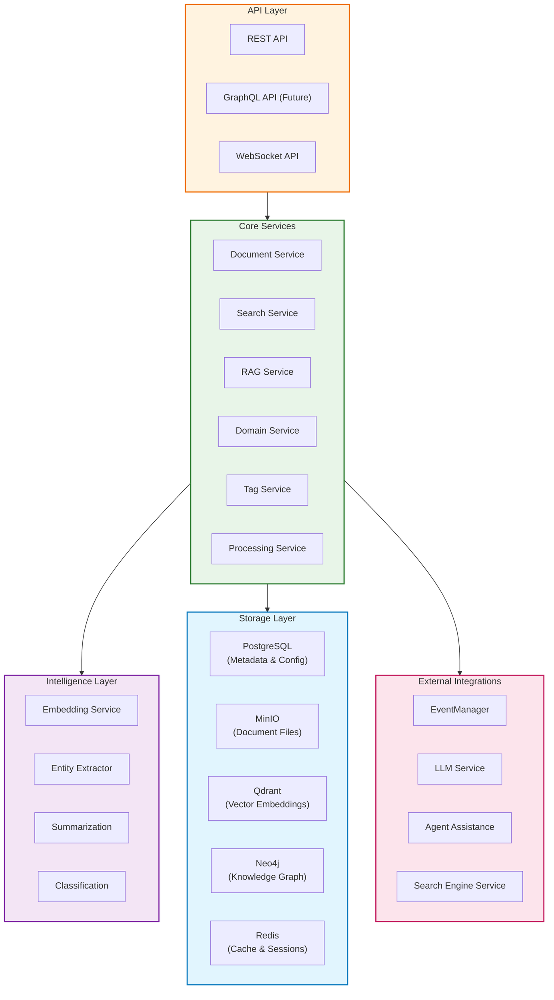

# DADMS 2.0 - Knowledge Manager Service Specification

## Executive Summary

The Knowledge Manager Service is a core microservice in DADMS 2.0's Event-Driven System (EDS), providing comprehensive document management, semantic search, and Retrieval-Augmented Generation (RAG) capabilities. This service enables intelligent knowledge discovery and retrieval for decision-making workflows, supporting multiple document types, semantic embedding, and advanced analytics.

**Current Status**: 📋 **SPECIFICATION** - Ready for implementation with UI components available  
**Port**: 3003  
**Version**: 1.0.0

## Purpose & Responsibilities

### Core Knowledge Management
- **Document Lifecycle**: Upload, storage, processing, chunking, and retrieval of documents
- **Metadata Management**: Comprehensive document metadata with versioning and provenance
- **Content Processing**: Text extraction, chunking, and preprocessing for various file formats
- **Storage Integration**: Multi-tier storage with PostgreSQL (metadata) and MinIO (files)

### Semantic Intelligence & RAG
- **Vector Embeddings**: Automatic embedding generation using state-of-the-art models
- **Semantic Search**: Similarity-based retrieval using vector embeddings in Qdrant
- **RAG Operations**: Retrieval-Augmented Generation with context-aware chunk selection
- **Hybrid Search**: Combined keyword, semantic, and metadata-based search strategies

### Organization & Discovery
- **Domain Management**: Hierarchical knowledge organization by subject domains
- **Tag System**: Flexible tagging and categorization with multi-domain support
- **Knowledge Graph**: Entity and relationship extraction for advanced discovery
- **Analytics**: Usage analytics, search patterns, and content insights

### Integration & Event Processing
- **Event-Driven Architecture**: Integration with EventManager for real-time notifications
- **Cross-Service Integration**: Support for LLM Service, Analysis Manager, and AAS
- **External Sources**: Future support for federated search and external knowledge bases
- **API-First Design**: Comprehensive REST API with OpenAPI specification

## Core Concepts & Data Models

### Knowledge Architecture



### Data Models

#### Core Document Models
```typescript
interface Document {
    id: string;                         // UUID
    name: string;                       // Document name/title
    description?: string;               // Document description
    domain_id?: string;                 // Associated domain UUID
    tags: Tag[];                        // Associated tags
    
    // Storage & Access
    url: string;                        // Storage URL (MinIO)
    content_type: string;               // MIME type
    size: number;                       // File size in bytes
    
    // Processing Status
    embedding_status: 'pending' | 'processing' | 'completed' | 'failed';
    chunk_count: number;                // Number of chunks created
    
    // Metadata
    metadata: DocumentMetadata;
    created_at: Date;
    updated_at: Date;
    version: number;                    // Document version
    checksum: string;                   // File integrity hash
}

interface DocumentMetadata {
    // File Information
    original_filename: string;
    file_extension: string;
    language?: string;                  // Detected language
    
    // Content Analysis
    word_count?: number;
    page_count?: number;
    author?: string;
    title?: string;                     // Extracted title
    
    // Processing Parameters
    chunk_size: number;                 // Tokens per chunk
    chunk_overlap: number;              // Overlap between chunks
    embedding_model: string;            // Model used for embeddings
    
    // Custom Metadata
    custom_fields: Record<string, any>;
}

interface DocumentChunk {
    id: string;                         // UUID
    document_id: string;                // Parent document UUID
    chunk_index: number;                // Order in document (0-based)
    
    // Content
    text: string;                       // Chunk text content
    title?: string;                     // Section title (if extracted)
    
    // Vector Information
    embedding_model: string;            // Model used for embedding
    embedding_dimensions: number;       // Vector dimensions
    
    // Context
    start_char: number;                 // Character position in document
    end_char: number;                   // End character position
    page_number?: number;               // Page number (if applicable)
    
    // Metadata
    tags: string[];                     // Inherited and chunk-specific tags
    metadata: ChunkMetadata;
    created_at: Date;
}

interface ChunkMetadata {
    confidence_score?: number;          // Content quality score
    entities: string[];                 // Extracted entities
    keywords: string[];                 // Key terms
    section_type?: string;              // header, paragraph, list, etc.
    language?: string;                  // Detected language
    custom_fields: Record<string, any>;
}
```

#### Organization Models
```typescript
interface Domain {
    id: string;                         // UUID
    name: string;                       // Domain name
    description?: string;               // Domain description
    color: string;                      // UI color code
    
    // Hierarchy
    parent_domain_id?: string;          // Parent domain UUID
    child_domains: Domain[];            // Child domains
    level: number;                      // Hierarchy level (0 = root)
    path: string;                       // Full path (e.g., "Root/Engineering/Software")
    
    // Statistics
    document_count: number;             // Documents in this domain
    total_document_count: number;       // Including subdomain documents
    
    // Metadata
    created_at: Date;
    updated_at: Date;
    created_by: string;                 // User UUID
    
    // Configuration
    default_tags: string[];             // Auto-applied tags
    processing_config: DomainProcessingConfig;
}

interface DomainProcessingConfig {
    chunk_size: number;                 // Default chunk size for domain
    chunk_overlap: number;              // Default overlap
    embedding_model: string;            // Preferred embedding model
    auto_tag_rules: AutoTagRule[];      // Automatic tagging rules
    entity_extraction: boolean;         // Enable entity extraction
}

interface Tag {
    id: string;                         // UUID
    name: string;                       // Tag name
    description?: string;               // Tag description
    color: string;                      // UI color code
    
    // Organization
    domain_id?: string;                 // Associated domain (optional)
    category?: string;                  // Tag category
    
    // Usage Statistics
    usage_count: number;                // Times used
    last_used: Date;                    // Last usage date
    
    // Metadata
    created_at: Date;
    updated_at: Date;
    created_by: string;                 // User UUID
}
```

#### Search & RAG Models
```typescript
interface SearchQuery {
    query: string;                      // Search text
    search_type: 'text' | 'semantic' | 'hybrid';
    
    // Filters
    domain_ids?: string[];              // Domain filter
    tag_ids?: string[];                 // Tag filter
    date_range?: DateRange;             // Date filter
    file_types?: string[];              // File type filter
    
    // Search Parameters
    similarity_threshold: number;       // Minimum similarity (0-1)
    limit: number;                      // Results limit
    offset: number;                     // Pagination offset
    
    // Options
    include_chunks: boolean;            // Include chunk details
    include_highlights: boolean;        // Include text highlights
    include_metadata: boolean;          // Include full metadata
}

interface SearchResult {
    document: Document;                 // Document metadata
    score: number;                      // Relevance score (0-1)
    
    // Matched Content
    chunks?: DocumentChunk[];           // Relevant chunks
    highlights: string[];               // Highlighted snippets
    
    // Context
    match_type: 'title' | 'content' | 'metadata' | 'tag';
    search_terms_found: string[];       // Matched search terms
    
    // Analytics
    click_count?: number;               // Previous click count
    last_accessed?: Date;               // Last access time
}

interface RAGQuery {
    query: string;                      // Natural language query
    
    // Filters
    domain_ids?: string[];
    tag_ids?: string[];
    
    // RAG Parameters
    max_chunks: number;                 // Maximum chunks to return
    similarity_threshold: number;       // Minimum similarity
    context_window: number;             // Total context length
    
    // Options
    include_metadata: boolean;
    rank_by_relevance: boolean;
    diversify_sources: boolean;         // Ensure chunks from different docs
}

interface RAGResponse {
    query: string;                      // Original query
    chunks: RAGChunk[];                 // Retrieved chunks
    
    // Metadata
    total_chunks_found: number;         // Total matching chunks
    search_time_ms: number;             // Search duration
    embedding_model: string;            // Model used
    
    // Analytics
    query_id: string;                   // For tracking
    timestamp: Date;
}

interface RAGChunk {
    chunk_id: string;
    document_id: string;
    document_name: string;
    text: string;
    
    // Relevance
    similarity_score: number;           // Cosine similarity
    rank: number;                       // Result ranking
    
    // Context
    context_before?: string;            // Previous chunk text
    context_after?: string;             // Next chunk text
    
    // Metadata
    metadata: ChunkMetadata;
    tags: string[];
}
```

### Processing Pipeline Architecture



## API Specification

### Core Knowledge Manager Interface
```typescript
interface KnowledgeManagerService {
    // Document Management
    uploadDocument(file: File, metadata: DocumentUploadRequest): Promise<Document>;
    getDocument(documentId: string): Promise<Document>;
    updateDocument(documentId: string, updates: DocumentUpdateRequest): Promise<Document>;
    deleteDocument(documentId: string): Promise<void>;
    downloadDocument(documentId: string): Promise<Blob>;
    reprocessDocument(documentId: string, config?: ProcessingConfig): Promise<Document>;
    
    // Search & Discovery
    searchDocuments(query: SearchQuery): Promise<SearchResponse>;
    findSimilarDocuments(documentId: string, options?: SimilarityOptions): Promise<SearchResult[]>;
    getDocumentChunks(documentId: string, options?: ChunkOptions): Promise<DocumentChunk[]>;
    
    // RAG Operations
    ragQuery(query: RAGQuery): Promise<RAGResponse>;
    findSimilarChunks(text: string, options?: SimilarityOptions): Promise<RAGChunk[]>;
    
    // Domain Management
    createDomain(domain: DomainCreateRequest): Promise<Domain>;
    getDomain(domainId: string): Promise<Domain>;
    updateDomain(domainId: string, updates: DomainUpdateRequest): Promise<Domain>;
    deleteDomain(domainId: string, cascade?: boolean): Promise<void>;
    listDomains(filters?: DomainFilters): Promise<Domain[]>;
    getDomainDocuments(domainId: string, pagination?: PaginationOptions): Promise<PaginatedResponse<Document>>;
    
    // Tag Management
    createTag(tag: TagCreateRequest): Promise<Tag>;
    getTag(tagId: string): Promise<Tag>;
    updateTag(tagId: string, updates: TagUpdateRequest): Promise<Tag>;
    deleteTag(tagId: string): Promise<void>;
    listTags(filters?: TagFilters): Promise<Tag[]>;
    bulkTagDocuments(request: BulkTagRequest): Promise<BulkTagResponse>;
    
    // Analytics & Insights
    getSearchAnalytics(period: AnalyticsPeriod): Promise<SearchAnalytics>;
    getDomainAnalytics(domainId?: string): Promise<DomainAnalytics>;
    getUsageMetrics(): Promise<UsageMetrics>;
    
    // Bulk Operations
    bulkUploadDocuments(files: File[], config: BulkUploadConfig): Promise<BulkUploadResponse>;
    bulkDeleteDocuments(documentIds: string[]): Promise<BulkDeleteResponse>;
    bulkReprocessDocuments(documentIds: string[], config?: ProcessingConfig): Promise<BulkProcessResponse>;
}
```

### Request/Response Models
```typescript
interface DocumentUploadRequest {
    name: string;
    description?: string;
    domain_id?: string;
    tags?: string[];                    // Tag IDs
    
    // Processing Options
    chunk_size?: number;                // Override default chunk size
    chunk_overlap?: number;             // Override default overlap
    embedding_model?: string;           // Override default model
    
    // Metadata
    custom_metadata?: Record<string, any>;
}

interface SearchResponse {
    results: SearchResult[];
    total: number;
    limit: number;
    offset: number;
    search_time_ms: number;
    
    // Search Metadata
    query_interpretation?: string;      // How query was interpreted
    suggestions?: string[];             // Search suggestions
    filters_applied: SearchFilters;
}

interface BulkUploadConfig {
    domain_id?: string;                 // Default domain for all files
    tags?: string[];                    // Default tags for all files
    processing_config?: ProcessingConfig;
    
    // Behavior Options
    skip_duplicates: boolean;           // Skip files with same name/hash
    auto_create_domains: boolean;       // Create domains from folder structure
    parallel_processing: boolean;       // Process files in parallel
}

interface BulkUploadResponse {
    uploaded: Document[];               // Successfully uploaded
    skipped: SkippedFile[];            // Skipped files with reasons
    failed: FailedFile[];              // Failed uploads with errors
    
    // Summary
    total_files: number;
    successful: number;
    skipped_count: number;
    failed_count: number;
    processing_time_ms: number;
}

interface ProcessingConfig {
    chunk_size: number;                 // Tokens per chunk
    chunk_overlap: number;              // Overlap tokens
    embedding_model: string;            // Embedding model to use
    
    // Advanced Options
    preserve_formatting: boolean;       // Keep original formatting
    extract_tables: boolean;            // Extract table content
    extract_images: boolean;            // Extract image descriptions
    
    // Intelligence Options
    extract_entities: boolean;          // Extract named entities
    extract_relationships: boolean;     // Extract entity relationships
    generate_summary: boolean;          // Generate document summary
}
```

## Integration Architecture

### Service Integration Flow



### Event-Driven Integration

#### Event Publications
```typescript
interface KnowledgeManagerEvents {
    // Document Lifecycle Events
    'document.uploaded': DocumentUploadedEvent;
    'document.updated': DocumentUpdatedEvent;
    'document.deleted': DocumentDeletedEvent;
    'document.processed': DocumentProcessedEvent;
    'document.processing_failed': DocumentProcessingFailedEvent;
    
    // Search & Discovery Events
    'search.performed': SearchPerformedEvent;
    'rag.query_completed': RAGQueryCompletedEvent;
    'knowledge.accessed': KnowledgeAccessedEvent;
    
    // Analytics Events
    'analytics.usage_spike': UsageSpikeEvent;
    'analytics.low_relevance': LowRelevanceEvent;
    'analytics.new_pattern': NewPatternEvent;
    
    // System Events
    'knowledge.suggestion': KnowledgeSuggestionEvent;
    'knowledge.gap_detected': KnowledgeGapEvent;
    'domain.utilization_changed': DomainUtilizationEvent;
}

interface DocumentUploadedEvent {
    document_id: string;
    document_name: string;
    domain_id?: string;
    tags: string[];
    file_size: number;
    user_id: string;
    project_id?: string;
    processing_status: string;
    timestamp: Date;
}

interface RAGQueryCompletedEvent {
    query_id: string;
    query: string;
    user_id: string;
    project_id?: string;
    chunks_returned: number;
    search_time_ms: number;
    relevance_score: number;
    timestamp: Date;
}

interface KnowledgeSuggestionEvent {
    suggestion_id: string;
    user_id: string;
    context: string;                    // User's current context
    suggested_documents: string[];      // Document IDs
    relevance_score: number;
    trigger_reason: string;             // Why this was suggested
    timestamp: Date;
}
```

#### Event Subscriptions
```typescript
interface KnowledgeManagerSubscriptions {
    // User Context Events
    'user.context_changed': (event: UserContextChangedEvent) => void;
    'user.page_visited': (event: PageVisitedEvent) => void;
    'user.project_switched': (event: ProjectSwitchedEvent) => void;
    
    // Analysis Events
    'analysis.completed': (event: AnalysisCompletedEvent) => void;
    'simulation.results_available': (event: SimulationResultsEvent) => void;
    'decision.point_reached': (event: DecisionPointEvent) => void;
    
    // System Events
    'system.maintenance_scheduled': (event: MaintenanceEvent) => void;
    'system.performance_degraded': (event: PerformanceEvent) => void;
}
```

## Implementation Architecture

### Service Architecture



### Database Schema

#### PostgreSQL Schema
```sql
-- Domain Hierarchy
CREATE TABLE domains (
    id UUID PRIMARY KEY DEFAULT uuid_generate_v4(),
    name VARCHAR(255) NOT NULL,
    description TEXT,
    color VARCHAR(7) DEFAULT '#3498db',
    parent_domain_id UUID REFERENCES domains(id) ON DELETE CASCADE,
    level INTEGER DEFAULT 0,
    path VARCHAR(1000), -- Materialized path
    document_count INTEGER DEFAULT 0,
    created_at TIMESTAMP WITH TIME ZONE DEFAULT NOW(),
    updated_at TIMESTAMP WITH TIME ZONE DEFAULT NOW(),
    created_by UUID REFERENCES users(id),
    
    -- Configuration
    default_chunk_size INTEGER DEFAULT 500,
    default_chunk_overlap INTEGER DEFAULT 50,
    default_embedding_model VARCHAR(100) DEFAULT 'text-embedding-ada-002',
    auto_tag_rules JSONB DEFAULT '[]',
    
    UNIQUE(name, parent_domain_id)
);

-- Tags
CREATE TABLE tags (
    id UUID PRIMARY KEY DEFAULT uuid_generate_v4(),
    name VARCHAR(255) NOT NULL,
    description TEXT,
    color VARCHAR(7) DEFAULT '#3498db',
    domain_id UUID REFERENCES domains(id) ON DELETE SET NULL,
    category VARCHAR(100),
    usage_count INTEGER DEFAULT 0,
    last_used TIMESTAMP WITH TIME ZONE,
    created_at TIMESTAMP WITH TIME ZONE DEFAULT NOW(),
    updated_at TIMESTAMP WITH TIME ZONE DEFAULT NOW(),
    created_by UUID REFERENCES users(id),
    
    UNIQUE(name, domain_id)
);

-- Documents
CREATE TABLE documents (
    id UUID PRIMARY KEY DEFAULT uuid_generate_v4(),
    name VARCHAR(500) NOT NULL,
    description TEXT,
    domain_id UUID REFERENCES domains(id) ON DELETE SET NULL,
    
    -- Storage Information
    url VARCHAR(1000) NOT NULL, -- MinIO URL
    content_type VARCHAR(100),
    size BIGINT,
    checksum VARCHAR(64), -- SHA256
    
    -- Processing Status
    embedding_status VARCHAR(20) DEFAULT 'pending' 
        CHECK (embedding_status IN ('pending', 'processing', 'completed', 'failed')),
    chunk_count INTEGER DEFAULT 0,
    
    -- Content Analysis
    word_count INTEGER,
    page_count INTEGER,
    language VARCHAR(10),
    
    -- Processing Configuration
    chunk_size INTEGER DEFAULT 500,
    chunk_overlap INTEGER DEFAULT 50,
    embedding_model VARCHAR(100) DEFAULT 'text-embedding-ada-002',
    
    -- Metadata
    metadata JSONB DEFAULT '{}',
    version INTEGER DEFAULT 1,
    
    -- Timestamps
    created_at TIMESTAMP WITH TIME ZONE DEFAULT NOW(),
    updated_at TIMESTAMP WITH TIME ZONE DEFAULT NOW(),
    uploaded_by UUID REFERENCES users(id),
    
    -- Search Optimization
    search_vector TSVECTOR,
    
    CONSTRAINT valid_size CHECK (size >= 0),
    CONSTRAINT valid_chunk_count CHECK (chunk_count >= 0)
);

-- Document Tags (Many-to-Many)
CREATE TABLE document_tags (
    document_id UUID REFERENCES documents(id) ON DELETE CASCADE,
    tag_id UUID REFERENCES tags(id) ON DELETE CASCADE,
    added_at TIMESTAMP WITH TIME ZONE DEFAULT NOW(),
    added_by UUID REFERENCES users(id),
    
    PRIMARY KEY (document_id, tag_id)
);

-- Document Chunks
CREATE TABLE document_chunks (
    id UUID PRIMARY KEY DEFAULT uuid_generate_v4(),
    document_id UUID REFERENCES documents(id) ON DELETE CASCADE,
    chunk_index INTEGER NOT NULL,
    
    -- Content
    text TEXT NOT NULL,
    title VARCHAR(500),
    
    -- Position in Document
    start_char INTEGER,
    end_char INTEGER,
    page_number INTEGER,
    
    -- Vector Information
    embedding_model VARCHAR(100),
    embedding_dimensions INTEGER,
    vector_id UUID, -- Reference to Qdrant
    
    -- Analysis
    confidence_score FLOAT,
    entities JSONB DEFAULT '[]',
    keywords JSONB DEFAULT '[]',
    section_type VARCHAR(50),
    language VARCHAR(10),
    
    -- Metadata
    metadata JSONB DEFAULT '{}',
    created_at TIMESTAMP WITH TIME ZONE DEFAULT NOW(),
    
    CONSTRAINT valid_chunk_index CHECK (chunk_index >= 0),
    CONSTRAINT valid_position CHECK (start_char <= end_char),
    UNIQUE(document_id, chunk_index)
);

-- Search Analytics
CREATE TABLE search_analytics (
    id UUID PRIMARY KEY DEFAULT uuid_generate_v4(),
    query TEXT NOT NULL,
    user_id UUID REFERENCES users(id),
    project_id UUID REFERENCES projects(id),
    
    -- Search Configuration
    search_type VARCHAR(20),
    domain_filters JSONB,
    tag_filters JSONB,
    
    -- Results
    results_count INTEGER,
    search_time_ms INTEGER,
    clicked_results JSONB DEFAULT '[]',
    
    -- Context
    page_context VARCHAR(100),
    session_id UUID,
    
    created_at TIMESTAMP WITH TIME ZONE DEFAULT NOW()
);

-- Usage Metrics (Aggregated)
CREATE TABLE usage_metrics (
    id UUID PRIMARY KEY DEFAULT uuid_generate_v4(),
    metric_date DATE NOT NULL,
    metric_type VARCHAR(50) NOT NULL,
    
    -- Metrics
    total_searches INTEGER DEFAULT 0,
    total_uploads INTEGER DEFAULT 0,
    total_downloads INTEGER DEFAULT 0,
    unique_users INTEGER DEFAULT 0,
    
    -- Performance
    avg_search_time_ms FLOAT,
    avg_relevance_score FLOAT,
    
    -- Domain Breakdown
    domain_metrics JSONB DEFAULT '{}',
    
    created_at TIMESTAMP WITH TIME ZONE DEFAULT NOW(),
    
    UNIQUE(metric_date, metric_type)
);

-- Indexes for Performance
CREATE INDEX idx_documents_domain_id ON documents(domain_id);
CREATE INDEX idx_documents_embedding_status ON documents(embedding_status);
CREATE INDEX idx_documents_created_at ON documents(created_at);
CREATE INDEX idx_documents_search_vector ON documents USING gin(search_vector);

CREATE INDEX idx_document_chunks_document_id ON document_chunks(document_id);
CREATE INDEX idx_document_chunks_vector_id ON document_chunks(vector_id);
CREATE INDEX idx_document_chunks_embedding_model ON document_chunks(embedding_model);

CREATE INDEX idx_search_analytics_user_id ON search_analytics(user_id);
CREATE INDEX idx_search_analytics_created_at ON search_analytics(created_at);
CREATE INDEX idx_search_analytics_query_gin ON search_analytics USING gin(to_tsvector('english', query));

CREATE INDEX idx_tags_domain_id ON tags(domain_id);
CREATE INDEX idx_tags_usage_count ON tags(usage_count DESC);

-- Full Text Search
CREATE OR REPLACE FUNCTION update_document_search_vector() RETURNS trigger AS $$
BEGIN
    NEW.search_vector := to_tsvector('english', 
        COALESCE(NEW.name, '') || ' ' || 
        COALESCE(NEW.description, '') || ' ' ||
        COALESCE(NEW.metadata->>'title', '') || ' ' ||
        COALESCE(NEW.metadata->>'author', '')
    );
    RETURN NEW;
END;
$$ LANGUAGE plpgsql;

CREATE TRIGGER documents_search_vector_update 
    BEFORE INSERT OR UPDATE ON documents 
    FOR EACH ROW EXECUTE FUNCTION update_document_search_vector();
```

### Vector Storage (Qdrant)

#### Collection Structure
```python
# Qdrant Collection Configuration
collection_config = {
    "name": "dadms_knowledge",
    "vectors": {
        "size": 1536,  # OpenAI text-embedding-ada-002 dimensions
        "distance": "Cosine"
    },
    "payload_schema": {
        "document_id": "keyword",
        "chunk_id": "keyword", 
        "chunk_index": "integer",
        "text": "text",
        "title": "text",
        "domain_id": "keyword",
        "tags": "keyword[]",
        "content_type": "keyword",
        "language": "keyword",
        "created_at": "datetime",
        "metadata": "object"
    }
}

# Example Vector Point
vector_point = {
    "id": "chunk_uuid_here",
    "vector": [0.1, 0.2, ...],  # 1536 dimensions
    "payload": {
        "document_id": "doc_uuid",
        "chunk_id": "chunk_uuid", 
        "chunk_index": 5,
        "text": "The actual chunk text content...",
        "title": "Section 3.2: Risk Assessment",
        "domain_id": "engineering_domain_uuid",
        "tags": ["risk", "safety", "assessment"],
        "content_type": "application/pdf",
        "language": "en",
        "page_number": 15,
        "entities": ["Risk Management", "Safety Protocol"],
        "keywords": ["assessment", "mitigation", "probability"],
        "created_at": "2024-01-15T10:30:00Z",
        "metadata": {
            "confidence_score": 0.92,
            "section_type": "subsection",
            "author": "John Smith"
        }
    }
}
```

### Performance Considerations

#### Caching Strategy
```typescript
interface CacheStrategy {
    // Document Metadata
    document_metadata: {
        cache_duration: '1 hour';
        invalidation_triggers: ['document_updated', 'document_deleted'];
        warm_cache_on_upload: true;
    };
    
    // Search Results
    search_results: {
        cache_duration: '15 minutes';
        invalidation_triggers: ['new_document_processed', 'domain_updated'];
        key_pattern: 'search:{query_hash}:{filters_hash}';
    };
    
    // Domain/Tag Lists
    domain_tag_lists: {
        cache_duration: '30 minutes';
        invalidation_triggers: ['domain_created', 'tag_created', 'hierarchy_changed'];
        preload_on_startup: true;
    };
    
    // RAG Chunks
    rag_chunks: {
        cache_duration: '1 hour';
        invalidation_triggers: ['chunk_reprocessed'];
        max_cached_queries: 1000;
    };
}
```

#### Search Optimization
- **Hybrid Search**: Combine vector similarity + keyword matching + metadata filters
- **Result Ranking**: Multiple signals including recency, popularity, and relevance
- **Query Expansion**: Automatic query expansion using synonyms and related terms
- **Personalization**: User-specific ranking based on previous interactions

## Security & Access Control

### Security Framework
```typescript
interface KnowledgeSecurityFramework {
    authentication: {
        method: 'JWT_Bearer';
        token_validation: 'real_time';
        service_auth: 'mutual_tls';
    };
    
    authorization: {
        model: 'RBAC_with_ABAC';
        document_access: 'project_scoped';
        domain_permissions: 'hierarchical';
        tag_permissions: 'domain_inherited';
    };
    
    data_protection: {
        file_encryption: 'at_rest_and_transit';
        metadata_encryption: 'sensitive_fields';
        vector_embeddings: 'no_pii_detection';
        audit_logging: 'comprehensive';
    };
    
    content_security: {
        file_scanning: 'malware_and_content';
        content_filtering: 'configurable_policies';
        data_classification: 'automatic_and_manual';
        retention_policies: 'domain_configurable';
    };
}
```

### Access Control Model
```typescript
interface AccessControlModel {
    // Document Permissions
    document_access: {
        read: ['owner', 'domain_member', 'shared_user'];
        write: ['owner', 'domain_admin'];
        delete: ['owner', 'domain_admin', 'system_admin'];
        share: ['owner', 'domain_admin'];
    };
    
    // Domain Permissions
    domain_access: {
        view: ['domain_member', 'parent_domain_member'];
        manage_documents: ['domain_admin', 'document_manager'];
        manage_domain: ['domain_admin', 'system_admin'];
        manage_hierarchy: ['system_admin'];
    };
    
    // Search Restrictions
    search_scope: {
        default: 'user_accessible_domains';
        admin: 'all_domains';
        restricted: 'explicitly_shared_only';
    };
    
    // Analytics Access
    analytics_access: {
        personal: ['user', 'all_roles'];
        domain: ['domain_admin', 'analytics_user'];
        system: ['system_admin', 'analytics_admin'];
    };
}
```

## Implementation Roadmap

### Phase 1: Core Foundation (Weeks 1-2)
- [ ] **Service Setup & Infrastructure**
  - Express.js service setup on port 3003
  - PostgreSQL schema implementation and migrations
  - MinIO integration for file storage
  - Basic authentication and authorization
  - Health checks and service discovery

- [ ] **Document Management Core**
  - File upload API with multi-format support
  - Document metadata storage and retrieval
  - Basic CRUD operations for documents
  - File download and streaming
  - Text extraction for common formats (PDF, DOCX, TXT)

- [ ] **Domain & Tag Management**
  - Domain hierarchy creation and management
  - Tag system with CRUD operations
  - Document-tag associations
  - Basic organization and filtering

### Phase 2: Search & Intelligence (Weeks 3-4)
- [ ] **Search Infrastructure**
  - Qdrant integration and collection setup
  - Document chunking algorithms
  - Embedding generation pipeline
  - Basic semantic search API

- [ ] **Vector Operations**
  - Text embedding using OpenAI/local models
  - Vector storage and retrieval
  - Similarity search implementation
  - Hybrid search (keyword + semantic)

- [ ] **RAG Foundation**
  - RAG query API implementation
  - Context-aware chunk retrieval
  - Result ranking and relevance scoring
  - Basic LLM integration for generation

### Phase 3: Advanced Features (Weeks 5-6)
- [ ] **Knowledge Graph**
  - Neo4j integration
  - Entity and relationship extraction
  - Graph-based discovery
  - Advanced analytics and insights

- [ ] **Intelligence Enhancement**
  - Advanced chunking strategies
  - Multi-modal content support
  - Automatic classification and tagging
  - Content summarization

- [ ] **Event Integration**
  - EventManager integration
  - Real-time notifications
  - Proactive knowledge suggestions
  - Usage analytics and insights

### Phase 4: Production Features (Weeks 7-8)
- [ ] **Performance Optimization**
  - Caching implementation (Redis)
  - Search performance tuning
  - Bulk operations optimization
  - Database query optimization

- [ ] **Advanced Analytics**
  - Usage analytics dashboard
  - Search pattern analysis
  - Content recommendation engine
  - Knowledge gap detection

- [ ] **Enterprise Features**
  - Advanced security and compliance
  - Audit logging and reporting
  - Advanced access control
  - Integration APIs for external systems

## Success Metrics

### Performance Targets
- **Upload Processing**: < 30 seconds for documents up to 10MB
- **Search Response**: < 500ms for semantic search, < 200ms for keyword search
- **RAG Query**: < 2 seconds end-to-end including LLM generation
- **Bulk Operations**: Process 100+ documents per minute

### Quality Metrics
- **Search Relevance**: > 80% user satisfaction on search results
- **RAG Accuracy**: > 85% accurate responses based on retrieved context
- **Document Processing**: > 95% successful processing rate
- **System Uptime**: 99.9% availability with graceful degradation

### User Experience Goals
- **Intuitive Organization**: Easy domain and tag management
- **Fast Discovery**: Quick and accurate knowledge retrieval
- **Rich Context**: Comprehensive search results with highlights and metadata
- **Seamless Integration**: Natural workflow integration across DADMS services

### Business Impact
- **Knowledge Reuse**: 40% improvement in decision-making speed
- **Content Discovery**: 60% increase in relevant knowledge utilization
- **Collaboration**: Enhanced team knowledge sharing and collaboration
- **Compliance**: Improved audit trails and knowledge governance

---

The Knowledge Manager Service forms the intelligent foundation of DADMS 2.0, transforming static document storage into a dynamic, intelligent knowledge ecosystem that enhances decision-making through advanced search, semantic understanding, and proactive knowledge discovery. 