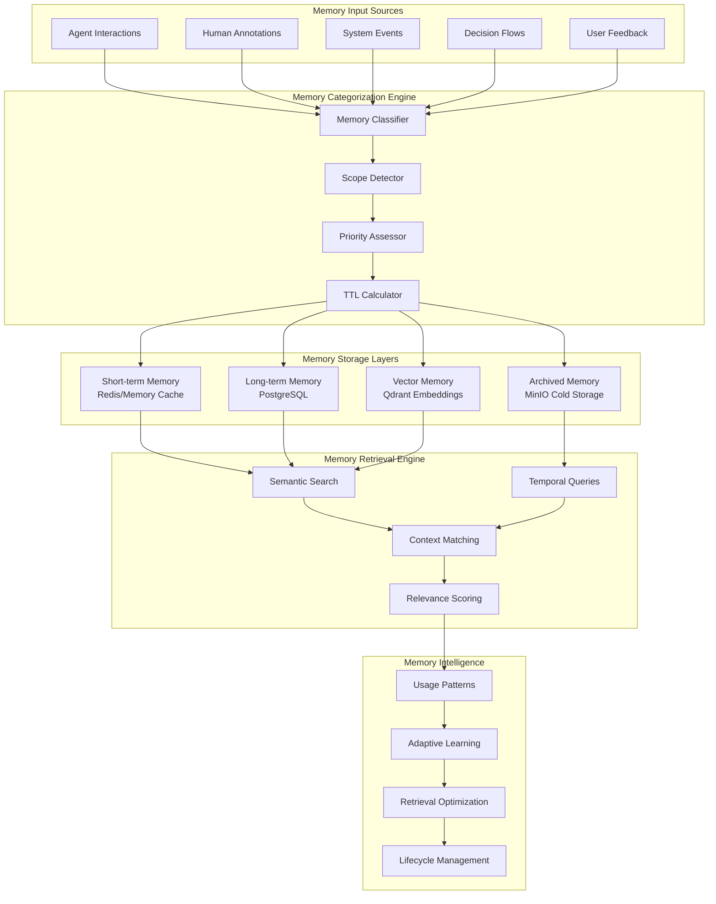
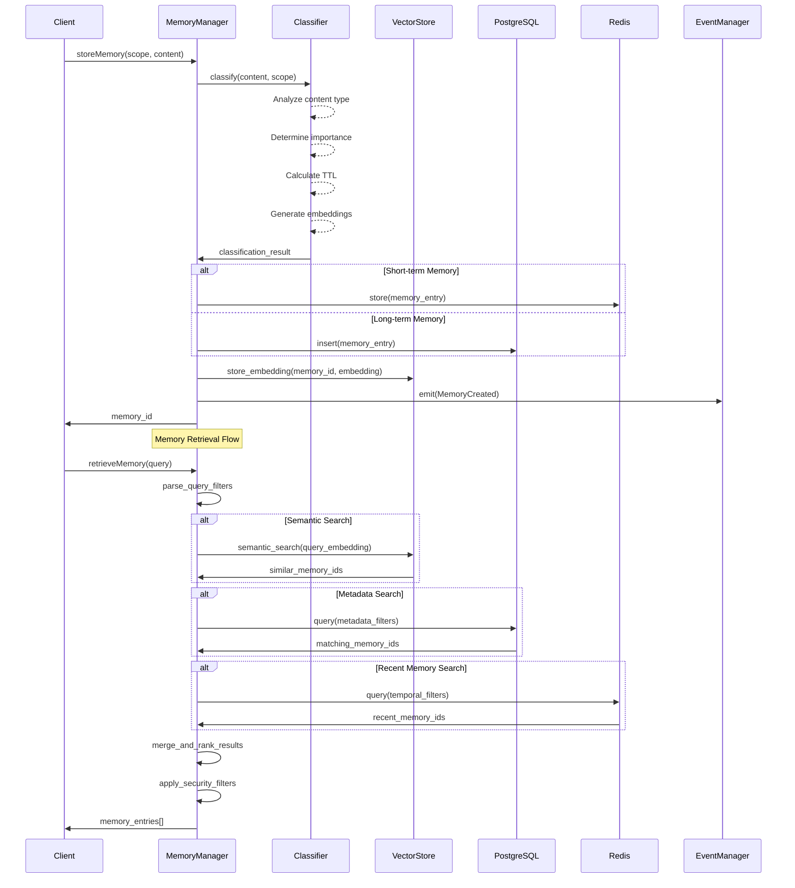
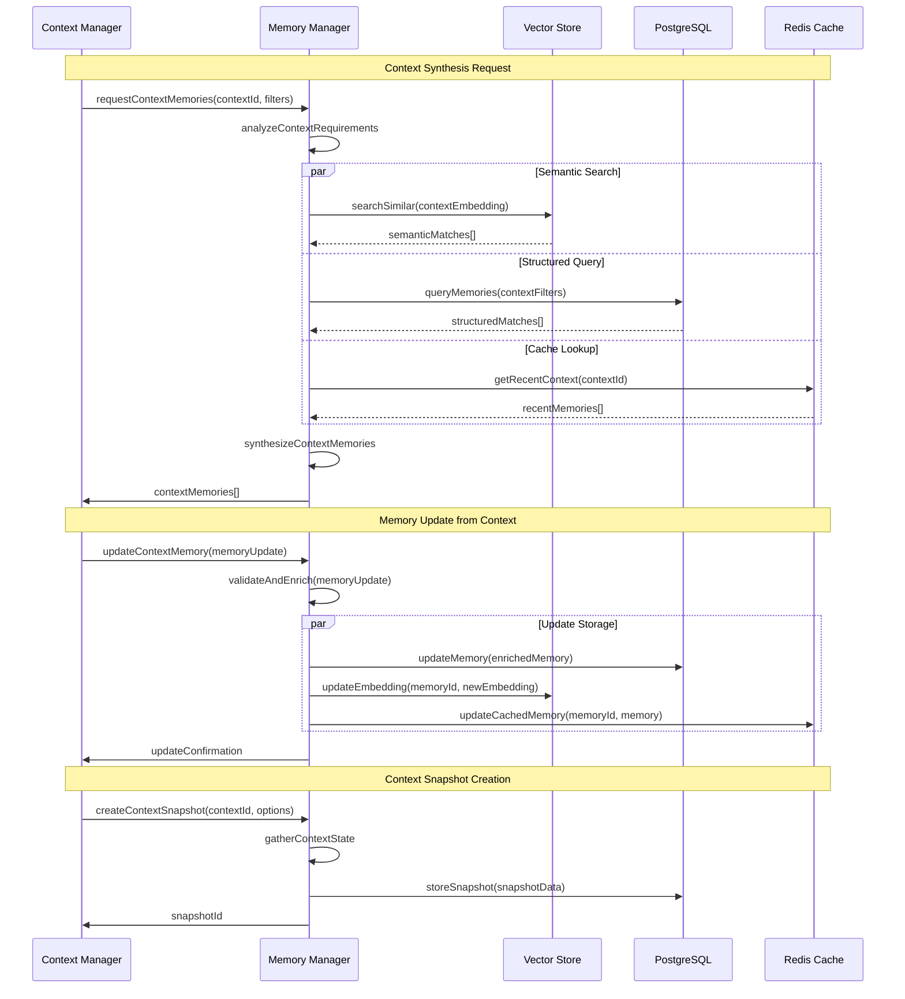
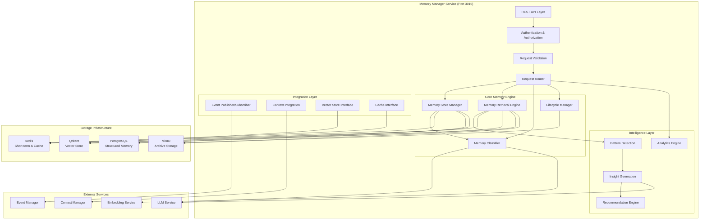

# DADMS 2.0 – Memory Manager Service Specification

## Executive Summary

The Memory Manager service provides sophisticated, categorized memory management capabilities for the DADMS ecosystem, enabling persistent, contextual, and semantic memory retention across decision workflows, agents, and user personas. This service extends beyond simple data storage to provide intelligent memory categorization, retrieval, and lifecycle management that powers adaptive decision intelligence and context-aware AI agents.

## 1. Purpose & Responsibilities

### 1.1 Core Purpose

The Memory Manager serves as the intelligent memory backbone for DADMS, providing:

- **Dynamic Memory Categorization**: Multi-dimensional memory classification (short-term, long-term, cached, persona-specific)
- **Contextual Memory Retrieval**: Semantic and temporal memory search with relevance scoring
- **Memory Lifecycle Management**: Automated expiration, prioritization, and memory evolution
- **Cross-Entity Memory Sharing**: Secure memory sharing across agents, teams, and workflows
- **Memory Intelligence**: Learning from memory usage patterns to optimize retrieval and retention

### 1.2 Key Responsibilities

#### Memory Storage & Organization
- Categorize memory into distinct scopes and types (ephemeral, persistent, cached, human-entered)
- Support hierarchical memory structures with parent-child relationships
- Maintain memory metadata including source, owner, confidence, timestamps, and TTL
- Enable memory tagging, pinning, and custom categorization
- Support memory versioning and revision tracking

#### Intelligent Memory Retrieval
- Provide semantic search capabilities across memory content
- Support temporal and contextual filtering (time-limited views, topic-based, persona-specific)
- Implement memory relevance scoring and ranking algorithms
- Enable memory replay and reconstruction for specific timeframes or contexts
- Support cross-reference memory linking and association discovery

#### Memory Lifecycle Management
- Implement automatic memory expiration based on TTL and usage patterns
- Support memory prioritization and promotion/demotion strategies
- Enable memory archival and restoration workflows
- Provide memory compression and deduplication capabilities
- Support memory migration between storage tiers (hot, warm, cold)

#### Integration & Context Synthesis
- Serve as the backing store for Context Manager operations
- Integrate with Vector Store for semantic memory embedding and retrieval
- Support real-time memory updates during decision workflows
- Enable memory snapshot creation and restoration for workflow states
- Provide memory lineage tracking and provenance management

## 2. Core Concepts & Data Models

### 2.1 Memory Framework Architecture



### 2.2 Memory Data Models

#### Core Memory Structure

```typescript
interface MemoryEntry {
  id: MemoryId;                          // Unique memory identifier
  scope: MemoryScope;                    // Memory categorization scope
  content: MemoryContent;                // Actual memory content
  metadata: MemoryMetadata;              // Rich metadata and context
  relationships: MemoryRelationship[];   // Links to related memories
  lifecycle: MemoryLifecycle;            // Lifecycle management data
  security: MemorySecurityContext;       // Access control and privacy
  created_at: Date;
  updated_at: Date;
  accessed_at: Date;
  expires_at?: Date;
}

interface MemoryScope {
  type: MemoryScopeType;                 // Primary memory category
  subtype?: string;                      // Additional categorization
  entity_id: string;                     // Associated entity (agent, user, team)
  entity_type: EntityType;               // Type of associated entity
  context_id?: string;                   // Decision/workflow context
  thread_id?: string;                    // Conversation/interaction thread
  project_id?: string;                   // Associated project
}

enum MemoryScopeType {
  SHORT_TERM = "short_term",             // Ephemeral, session-based
  LONG_TERM = "long_term",               // Persistent across sessions
  CACHED = "cached",                     // Recently accessed content
  HUMAN_ENTERED = "human_entered",       // Manually input knowledge
  PERSONA_SPECIFIC = "persona_specific", // Role/agent archetype memory
  TEAM_SPECIFIC = "team_specific",       // Shared team context
  DECISION_CONTEXT = "decision_context", // Decision-specific memory
  SYSTEM_STATE = "system_state",         // System configuration memory
  FEEDBACK_DERIVED = "feedback_derived", // Memory from user corrections
  LEARNED_PATTERNS = "learned_patterns"  // AI-discovered patterns
}

enum EntityType {
  HUMAN_USER = "human_user",
  AI_AGENT = "ai_agent",
  TEAM = "team",
  SYSTEM = "system",
  DECISION_WORKFLOW = "decision_workflow",
  PROJECT = "project"
}

interface MemoryContent {
  primary_content: string;               // Main memory content
  content_type: ContentType;             // Format/type of content
  structured_data?: Record<string, any>; // Additional structured data
  embeddings?: number[];                 // Vector embeddings for semantic search
  language?: string;                     // Content language
  encoding?: string;                     // Content encoding
  compressed?: boolean;                  // Whether content is compressed
  references?: ContentReference[];       // References to external content
}

enum ContentType {
  TEXT = "text",
  JSON = "json",
  MARKDOWN = "markdown",
  CODE = "code",
  DECISION_STATE = "decision_state",
  CONVERSATION = "conversation",
  ANNOTATION = "annotation",
  INSIGHT = "insight",
  PATTERN = "pattern",
  MULTIMEDIA_REF = "multimedia_ref"
}

interface ContentReference {
  type: ReferenceType;
  uri: string;
  description?: string;
  metadata?: Record<string, any>;
}

enum ReferenceType {
  DOCUMENT = "document",
  URL = "url",
  FILE = "file",
  DATABASE_RECORD = "database_record",
  CONTEXT_THREAD = "context_thread"
}
```

#### Memory Metadata & Context

```typescript
interface MemoryMetadata {
  source: MemorySource;                  // Origin of the memory
  confidence: number;                    // Confidence score (0-1)
  importance: ImportanceLevel;           // Memory importance classification
  tags: string[];                        // Searchable tags
  categories: string[];                  // Hierarchical categories
  sentiment?: SentimentScore;            // Emotional context
  temporal_context: TemporalContext;     // Time-based context
  usage_stats: MemoryUsageStats;         // Access and usage statistics
  quality_score: number;                 // Content quality assessment
  provenance: MemoryProvenance[];        // Chain of memory creation/modification
}

interface MemorySource {
  type: SourceType;
  identifier: string;                    // Source entity identifier
  timestamp: Date;
  context?: string;                      // Additional source context
  reliability_score: number;             // Source reliability (0-1)
}

enum SourceType {
  AGENT_INTERACTION = "agent_interaction",
  HUMAN_INPUT = "human_input",
  SYSTEM_EVENT = "system_event",
  DECISION_OUTCOME = "decision_outcome",
  FEEDBACK_LOOP = "feedback_loop",
  PATTERN_DISCOVERY = "pattern_discovery",
  EXTERNAL_IMPORT = "external_import"
}

enum ImportanceLevel {
  CRITICAL = "critical",                 // Must never be deleted
  HIGH = "high",                        // High retention priority
  MEDIUM = "medium",                    // Standard retention
  LOW = "low",                          // Can be deleted under pressure
  EPHEMERAL = "ephemeral"               // Short-lived, auto-expire
}

interface SentimentScore {
  polarity: number;                      // -1 (negative) to 1 (positive)
  subjectivity: number;                  // 0 (objective) to 1 (subjective)
  emotions?: EmotionScores;              // Detailed emotional analysis
}

interface EmotionScores {
  joy: number;
  anger: number;
  fear: number;
  sadness: number;
  surprise: number;
  trust: number;
  anticipation: number;
  disgust: number;
}

interface TemporalContext {
  creation_phase: DecisionPhase;         // When in decision process created
  temporal_relevance: TemporalRelevance; // Time-based relevance
  expiry_strategy: ExpiryStrategy;       // How/when to expire
  access_pattern: AccessPattern;         // Usage timing patterns
}

enum DecisionPhase {
  PROBLEM_DEFINITION = "problem_definition",
  REQUIREMENTS_GATHERING = "requirements_gathering",
  ALTERNATIVE_GENERATION = "alternative_generation",
  EVALUATION = "evaluation",
  DECISION_MAKING = "decision_making",
  IMPLEMENTATION = "implementation",
  MONITORING = "monitoring",
  REFLECTION = "reflection"
}

enum TemporalRelevance {
  IMMEDIATE = "immediate",               // Relevant now
  SHORT_TERM = "short_term",            // Relevant for days/weeks
  MEDIUM_TERM = "medium_term",          // Relevant for months
  LONG_TERM = "long_term",              // Relevant for years
  CONTEXTUAL = "contextual",            // Relevance depends on context
  EVERGREEN = "evergreen"               // Always relevant
}

enum ExpiryStrategy {
  TTL_BASED = "ttl_based",              // Time-to-live expiration
  ACCESS_BASED = "access_based",        // Expire based on last access
  USAGE_BASED = "usage_based",          // Expire based on usage frequency
  MANUAL = "manual",                    // Manual expiration only
  SMART_DECAY = "smart_decay",          // AI-driven expiration
  NEVER = "never"                       // Never expire
}

enum AccessPattern {
  FREQUENT = "frequent",                // Accessed regularly
  PERIODIC = "periodic",                // Accessed in cycles
  BURST = "burst",                      // Heavy usage then quiet
  DECLINING = "declining",              // Usage decreasing
  SPORADIC = "sporadic",                // Irregular access
  DORMANT = "dormant"                   // Rarely accessed
}

interface MemoryUsageStats {
  access_count: number;                  // Total access count
  last_accessed: Date;                   // Last access timestamp
  access_frequency: number;              // Accesses per time period
  modification_count: number;            // Number of modifications
  referral_count: number;                // Times referenced by other memories
  search_hits: number;                   // Times found in searches
  usage_trend: UsageTrend;               // Usage trend over time
}

enum UsageTrend {
  INCREASING = "increasing",
  STABLE = "stable",
  DECREASING = "decreasing",
  VOLATILE = "volatile",
  SEASONAL = "seasonal"
}

interface MemoryProvenance {
  operation: ProvenanceOperation;
  timestamp: Date;
  actor_id: string;
  actor_type: EntityType;
  changes?: Record<string, any>;         // What changed
  reason?: string;                       // Why the change was made
  context?: string;                      // Additional context
}

enum ProvenanceOperation {
  CREATED = "created",
  MODIFIED = "modified",
  ACCESSED = "accessed",
  TAGGED = "tagged",
  LINKED = "linked",
  ARCHIVED = "archived",
  RESTORED = "restored",
  MERGED = "merged",
  SPLIT = "split"
}
```

#### Memory Relationships & Associations

```typescript
interface MemoryRelationship {
  id: string;
  source_memory_id: MemoryId;
  target_memory_id: MemoryId;
  relationship_type: RelationshipType;
  strength: number;                      // Relationship strength (0-1)
  confidence: number;                    // Confidence in relationship (0-1)
  context?: string;                      // Relationship context
  created_at: Date;
  created_by: EntityType;
  metadata?: Record<string, any>;
}

enum RelationshipType {
  CAUSAL = "causal",                     // A caused B
  TEMPORAL = "temporal",                 // A happened before/after B
  SIMILARITY = "similarity",             // A is similar to B
  CONTRADICTION = "contradiction",       // A contradicts B
  ELABORATION = "elaboration",           // A elaborates on B
  DEPENDENCY = "dependency",             // A depends on B
  REPLACEMENT = "replacement",           // A replaces B
  CONFIRMATION = "confirmation",         // A confirms B
  CONTEXT = "context",                   // A provides context for B
  ALTERNATIVE = "alternative",           // A is alternative to B
  HIERARCHY = "hierarchy",               // A is parent/child of B
  REFERENCE = "reference"                // A references B
}

interface MemoryCluster {
  id: string;
  name: string;
  description?: string;
  memory_ids: MemoryId[];
  cluster_type: ClusterType;
  coherence_score: number;               // How well memories fit together
  created_at: Date;
  updated_at: Date;
  metadata?: Record<string, any>;
}

enum ClusterType {
  TOPICAL = "topical",                   // Grouped by topic
  TEMPORAL = "temporal",                 // Grouped by time
  CONTEXTUAL = "contextual",             // Grouped by context
  SEMANTIC = "semantic",                 // Grouped by semantic similarity
  PERSONA = "persona",                   // Grouped by persona/agent
  DECISION = "decision",                 // Grouped by decision
  PROJECT = "project"                    // Grouped by project
}
```

#### Memory Lifecycle Management

```typescript
interface MemoryLifecycle {
  stage: LifecycleStage;
  transitions: LifecycleTransition[];
  retention_policy: RetentionPolicy;
  archival_info?: ArchivalInfo;
  promotion_criteria?: PromotionCriteria;
  demotion_criteria?: DemotionCriteria;
}

enum LifecycleStage {
  ACTIVE = "active",                     // Currently active and accessible
  WARM = "warm",                        // Less frequently accessed
  COLD = "cold",                        // Rarely accessed, archived
  FROZEN = "frozen",                    // Long-term storage
  DEPRECATED = "deprecated",            // Marked for deletion
  DELETED = "deleted"                   // Soft deleted
}

interface LifecycleTransition {
  from_stage: LifecycleStage;
  to_stage: LifecycleStage;
  timestamp: Date;
  reason: TransitionReason;
  triggered_by: EntityType;
  automatic: boolean;
}

enum TransitionReason {
  TTL_EXPIRED = "ttl_expired",
  USAGE_DECLINE = "usage_decline",
  STORAGE_PRESSURE = "storage_pressure",
  MANUAL_DECISION = "manual_decision",
  POLICY_CHANGE = "policy_change",
  QUALITY_DEGRADATION = "quality_degradation",
  SUPERSEDED = "superseded",
  IMPORTANCE_UPGRADE = "importance_upgrade"
}

interface RetentionPolicy {
  policy_id: string;
  policy_name: string;
  max_age?: Duration;                    // Maximum age before archival
  min_access_frequency?: number;         // Minimum access to stay active
  importance_threshold?: ImportanceLevel; // Minimum importance level
  storage_tier_rules: StorageTierRule[];
  custom_rules?: CustomRetentionRule[];
}

interface StorageTierRule {
  tier: StorageTier;
  conditions: TierCondition[];
  action: TierAction;
}

enum StorageTier {
  HOT = "hot",                          // Fast access, expensive storage
  WARM = "warm",                        // Medium access, medium cost
  COLD = "cold",                        // Slow access, cheap storage
  FROZEN = "frozen"                     // Very slow access, very cheap
}

interface TierCondition {
  type: ConditionType;
  operator: ComparisonOperator;
  value: any;
}

enum ConditionType {
  AGE = "age",
  ACCESS_FREQUENCY = "access_frequency",
  IMPORTANCE = "importance",
  SIZE = "size",
  USAGE_TREND = "usage_trend"
}

enum ComparisonOperator {
  EQUALS = "equals",
  GREATER_THAN = "greater_than",
  LESS_THAN = "less_than",
  GREATER_EQUAL = "greater_equal",
  LESS_EQUAL = "less_equal",
  IN = "in",
  NOT_IN = "not_in"
}

enum TierAction {
  PROMOTE = "promote",
  DEMOTE = "demote",
  MAINTAIN = "maintain",
  ARCHIVE = "archive",
  DELETE = "delete"
}

interface CustomRetentionRule {
  rule_id: string;
  condition: string;                     // Expression or script
  action: TierAction;
  priority: number;
}

interface ArchivalInfo {
  archived_at: Date;
  archived_by: EntityType;
  archive_location: string;
  compression_type?: CompressionType;
  original_size: number;
  compressed_size?: number;
  checksum: string;
  retrieval_cost?: number;
}

enum CompressionType {
  NONE = "none",
  GZIP = "gzip",
  LZ4 = "lz4",
  ZSTD = "zstd",
  CUSTOM = "custom"
}
```

#### Memory Security & Access Control

```typescript
interface MemorySecurityContext {
  access_level: AccessLevel;
  visibility_scope: VisibilityScope[];
  encryption_info?: EncryptionInfo;
  privacy_tags: PrivacyTag[];
  compliance_requirements: ComplianceRequirement[];
  audit_settings: AuditSettings;
}

enum AccessLevel {
  PUBLIC = "public",                     // Accessible to all
  PROJECT = "project",                   // Project team only
  TEAM = "team",                        // Specific team only
  PERSONAL = "personal",                // Individual only
  AGENT_ONLY = "agent_only",            // AI agents only
  ADMIN = "admin",                      // Administrators only
  RESTRICTED = "restricted"             // Special permissions required
}

interface VisibilityScope {
  scope_type: ScopeType;
  scope_id: string;
  permissions: Permission[];
}

enum ScopeType {
  USER = "user",
  TEAM = "team",
  ROLE = "role",
  PROJECT = "project",
  ORGANIZATION = "organization"
}

enum Permission {
  READ = "read",
  WRITE = "write",
  DELETE = "delete",
  SHARE = "share",
  EXPORT = "export",
  ADMIN = "admin"
}

interface EncryptionInfo {
  encrypted: boolean;
  algorithm?: string;
  key_id?: string;
  encrypted_fields: string[];
}

enum PrivacyTag {
  PII = "pii",                          // Personally identifiable information
  SENSITIVE = "sensitive",              // Business sensitive
  CONFIDENTIAL = "confidential",        // Confidential information
  PUBLIC = "public",                    // Public information
  INTERNAL = "internal"                 // Internal use only
}

interface ComplianceRequirement {
  framework: ComplianceFramework;
  requirement_id: string;
  retention_period?: Duration;
  deletion_required?: boolean;
  anonymization_required?: boolean;
}

enum ComplianceFramework {
  GDPR = "gdpr",
  CCPA = "ccpa",
  HIPAA = "hipaa",
  SOX = "sox",
  INTERNAL = "internal"
}

interface AuditSettings {
  audit_enabled: boolean;
  audit_level: AuditLevel;
  retention_period: Duration;
  include_content: boolean;
}

enum AuditLevel {
  NONE = "none",
  BASIC = "basic",                      // Access only
  STANDARD = "standard",                // Access + modifications
  DETAILED = "detailed",                // Full audit trail
  FORENSIC = "forensic"                 // Maximum detail
}
```

### 2.3 Memory Query & Retrieval Models

```typescript
interface MemoryQuery {
  query_id?: string;
  scope_filters?: MemoryScopeFilter;
  content_filters?: ContentFilter;
  temporal_filters?: TemporalFilter;
  metadata_filters?: MetadataFilter;
  relationship_filters?: RelationshipFilter;
  search_options?: SearchOptions;
  result_options?: ResultOptions;
}

interface MemoryScopeFilter {
  scope_types?: MemoryScopeType[];
  entity_ids?: string[];
  entity_types?: EntityType[];
  context_ids?: string[];
  thread_ids?: string[];
  project_ids?: string[];
}

interface ContentFilter {
  content_types?: ContentType[];
  text_search?: TextSearchFilter;
  semantic_search?: SemanticSearchFilter;
  structured_filters?: Record<string, any>;
  language?: string[];
}

interface TextSearchFilter {
  query: string;
  search_type: TextSearchType;
  case_sensitive?: boolean;
  whole_words_only?: boolean;
  fuzzy_threshold?: number;
}

enum TextSearchType {
  EXACT = "exact",
  CONTAINS = "contains",
  STARTS_WITH = "starts_with",
  ENDS_WITH = "ends_with",
  REGEX = "regex",
  FUZZY = "fuzzy",
  FULL_TEXT = "full_text"
}

interface SemanticSearchFilter {
  query_text?: string;
  query_embedding?: number[];
  similarity_threshold?: number;
  max_results?: number;
  algorithm?: SimilarityAlgorithm;
}

enum SimilarityAlgorithm {
  COSINE = "cosine",
  EUCLIDEAN = "euclidean",
  DOT_PRODUCT = "dot_product",
  MANHATTAN = "manhattan"
}

interface TemporalFilter {
  created_after?: Date;
  created_before?: Date;
  updated_after?: Date;
  updated_before?: Date;
  accessed_after?: Date;
  accessed_before?: Date;
  expires_after?: Date;
  expires_before?: Date;
  temporal_relevance?: TemporalRelevance[];
}

interface MetadataFilter {
  importance_levels?: ImportanceLevel[];
  tags?: string[];
  categories?: string[];
  sources?: SourceType[];
  confidence_min?: number;
  confidence_max?: number;
  quality_score_min?: number;
  quality_score_max?: number;
  access_count_min?: number;
  access_count_max?: number;
}

interface RelationshipFilter {
  relationship_types?: RelationshipType[];
  related_memory_ids?: MemoryId[];
  relationship_strength_min?: number;
  relationship_confidence_min?: number;
  cluster_ids?: string[];
}

interface SearchOptions {
  include_deleted?: boolean;
  include_archived?: boolean;
  search_mode: SearchMode;
  ranking_algorithm?: RankingAlgorithm;
  boost_factors?: BoostFactor[];
}

enum SearchMode {
  COMPREHENSIVE = "comprehensive",       // Search all storage tiers
  FAST = "fast",                        // Search active memory only
  RECENT = "recent",                    // Search recent memory only
  HISTORICAL = "historical",            // Search archived memory
  INTELLIGENT = "intelligent"           // AI-optimized search strategy
}

enum RankingAlgorithm {
  RELEVANCE = "relevance",
  RECENCY = "recency",
  IMPORTANCE = "importance",
  POPULARITY = "popularity",
  HYBRID = "hybrid",
  CUSTOM = "custom"
}

interface BoostFactor {
  factor_type: BoostFactorType;
  multiplier: number;
  condition?: string;
}

enum BoostFactorType {
  RECENCY = "recency",
  IMPORTANCE = "importance",
  ACCESS_FREQUENCY = "access_frequency",
  CONFIDENCE = "confidence",
  RELATIONSHIP_STRENGTH = "relationship_strength",
  SEMANTIC_SIMILARITY = "semantic_similarity"
}

interface ResultOptions {
  limit?: number;
  offset?: number;
  include_content?: boolean;
  include_metadata?: boolean;
  include_relationships?: boolean;
  include_provenance?: boolean;
  include_embeddings?: boolean;
  format?: ResultFormat;
  sort_by?: SortOption[];
}

enum ResultFormat {
  FULL = "full",
  SUMMARY = "summary",
  MINIMAL = "minimal",
  CUSTOM = "custom"
}

interface SortOption {
  field: SortField;
  direction: SortDirection;
}

enum SortField {
  RELEVANCE = "relevance",
  CREATED_AT = "created_at",
  UPDATED_AT = "updated_at",
  ACCESSED_AT = "accessed_at",
  IMPORTANCE = "importance",
  CONFIDENCE = "confidence",
  ACCESS_COUNT = "access_count"
}

enum SortDirection {
  ASC = "asc",
  DESC = "desc"
}
```

### 2.4 Memory Processing Pipeline



## 3. API Specification

### 3.1 Core Memory Manager Interface

```typescript
interface MemoryManager {
  // Core Memory Operations
  storeMemory(scope: MemoryScope, content: MemoryContent, metadata?: Partial<MemoryMetadata>): Promise<MemoryId>;
  retrieveMemory(query: MemoryQuery): Promise<MemoryEntry[]>;
  getMemory(id: MemoryId): Promise<MemoryEntry | null>;
  updateMemory(id: MemoryId, updates: Partial<MemoryEntry>): Promise<void>;
  deleteMemory(id: MemoryId, permanent?: boolean): Promise<void>;
  
  // Batch Operations
  storeMemories(entries: Partial<MemoryEntry>[]): Promise<MemoryId[]>;
  retrieveMemories(ids: MemoryId[]): Promise<MemoryEntry[]>;
  updateMemories(updates: {id: MemoryId, updates: Partial<MemoryEntry>}[]): Promise<void>;
  deleteMemories(ids: MemoryId[], permanent?: boolean): Promise<void>;
  
  // Memory Relationships
  linkMemories(sourceId: MemoryId, targetId: MemoryId, relationship: RelationshipType, strength?: number): Promise<void>;
  unlinkMemories(sourceId: MemoryId, targetId: MemoryId, relationship?: RelationshipType): Promise<void>;
  getRelatedMemories(id: MemoryId, relationshipTypes?: RelationshipType[]): Promise<MemoryEntry[]>;
  findSimilarMemories(id: MemoryId, threshold?: number, limit?: number): Promise<MemoryEntry[]>;
  
  // Memory Clustering
  createCluster(name: string, memoryIds: MemoryId[], clusterType: ClusterType): Promise<string>;
  addToCluster(clusterId: string, memoryIds: MemoryId[]): Promise<void>;
  removeFromCluster(clusterId: string, memoryIds: MemoryId[]): Promise<void>;
  getClusterMemories(clusterId: string): Promise<MemoryEntry[]>;
  suggestClusters(memoryIds: MemoryId[]): Promise<ClusterSuggestion[]>;
  
  // Memory Search & Discovery
  searchMemories(query: MemoryQuery): Promise<MemorySearchResult>;
  semanticSearch(queryText: string, options?: SemanticSearchOptions): Promise<MemoryEntry[]>;
  temporalQuery(timeRange: TimeRange, filters?: MemoryQuery): Promise<MemoryEntry[]>;
  findPatterns(scope?: MemoryScope, options?: PatternOptions): Promise<MemoryPattern[]>;
  
  // Memory Lifecycle Management
  promoteMemory(id: MemoryId, newImportance: ImportanceLevel): Promise<void>;
  demoteMemory(id: MemoryId, newImportance: ImportanceLevel): Promise<void>;
  archiveMemory(id: MemoryId, reason?: string): Promise<void>;
  restoreMemory(id: MemoryId): Promise<void>;
  refreshMemoryTTL(id: MemoryId, newTTL?: Duration): Promise<void>;
  
  // Memory Analytics & Insights
  getMemoryStats(scope?: MemoryScope): Promise<MemoryStatistics>;
  getUsageAnalytics(timeRange: TimeRange): Promise<UsageAnalytics>;
  getMemoryHealth(): Promise<MemoryHealthReport>;
  analyzeMemoryEfficiency(): Promise<EfficiencyReport>;
  
  // Context & Integration Operations
  createMemorySnapshot(contextId: string, includeRelated?: boolean): Promise<MemorySnapshot>;
  restoreMemorySnapshot(snapshotId: string): Promise<void>;
  syncWithContextManager(contextId: string): Promise<void>;
  exportMemories(query: MemoryQuery, format: ExportFormat): Promise<ExportResult>;
  importMemories(data: ImportData, options?: ImportOptions): Promise<ImportResult>;
}

// Supporting Interfaces

interface ClusterSuggestion {
  suggested_name: string;
  memory_ids: MemoryId[];
  cluster_type: ClusterType;
  coherence_score: number;
  reasoning: string;
}

interface MemorySearchResult {
  memories: MemoryEntry[];
  total_count: number;
  search_metadata: SearchMetadata;
  suggestions?: SearchSuggestion[];
}

interface SearchMetadata {
  query_time_ms: number;
  search_strategy: SearchMode;
  tiers_searched: StorageTier[];
  total_scanned: number;
}

interface SearchSuggestion {
  type: SuggestionType;
  suggestion: string;
  reasoning: string;
}

enum SuggestionType {
  QUERY_EXPANSION = "query_expansion",
  FILTER_RECOMMENDATION = "filter_recommendation",
  SCOPE_ADJUSTMENT = "scope_adjustment",
  TEMPORAL_ADJUSTMENT = "temporal_adjustment"
}

interface SemanticSearchOptions {
  similarity_threshold?: number;
  max_results?: number;
  include_related?: boolean;
  boost_recent?: boolean;
}

interface TimeRange {
  start: Date;
  end: Date;
  timezone?: string;
}

interface PatternOptions {
  pattern_types?: PatternType[];
  min_frequency?: number;
  time_window?: Duration;
}

enum PatternType {
  ACCESS_PATTERN = "access_pattern",
  CONTENT_PATTERN = "content_pattern",
  RELATIONSHIP_PATTERN = "relationship_pattern",
  TEMPORAL_PATTERN = "temporal_pattern"
}

interface MemoryPattern {
  pattern_id: string;
  pattern_type: PatternType;
  description: string;
  frequency: number;
  confidence: number;
  memory_ids: MemoryId[];
  insights: string[];
}

interface MemoryStatistics {
  total_memories: number;
  by_scope_type: Record<MemoryScopeType, number>;
  by_importance: Record<ImportanceLevel, number>;
  by_storage_tier: Record<StorageTier, number>;
  average_age: Duration;
  total_size_bytes: number;
  relationship_count: number;
  cluster_count: number;
}

interface UsageAnalytics {
  time_range: TimeRange;
  total_accesses: number;
  unique_memories_accessed: number;
  top_accessed_memories: MemoryAccessStat[];
  access_patterns: AccessPatternStat[];
  performance_metrics: PerformanceMetrics;
}

interface MemoryAccessStat {
  memory_id: MemoryId;
  access_count: number;
  last_accessed: Date;
  average_session_length: Duration;
}

interface AccessPatternStat {
  pattern_name: string;
  frequency: number;
  typical_times: string[];
  associated_contexts: string[];
}

interface PerformanceMetrics {
  average_retrieval_time_ms: number;
  cache_hit_rate: number;
  storage_efficiency: number;
  index_performance: number;
}

interface MemoryHealthReport {
  overall_health_score: number;
  issues: HealthIssue[];
  recommendations: HealthRecommendation[];
  metrics: HealthMetrics;
}

interface HealthIssue {
  severity: IssueSeverity;
  category: IssueCategory;
  description: string;
  affected_count: number;
  suggested_action: string;
}

enum IssueSeverity {
  CRITICAL = "critical",
  HIGH = "high",
  MEDIUM = "medium",
  LOW = "low",
  INFO = "info"
}

enum IssueCategory {
  PERFORMANCE = "performance",
  STORAGE = "storage",
  INTEGRITY = "integrity",
  SECURITY = "security",
  LIFECYCLE = "lifecycle"
}

interface HealthRecommendation {
  priority: RecommendationPriority;
  action: RecommendationAction;
  description: string;
  expected_impact: string;
  implementation_effort: EffortLevel;
}

enum RecommendationPriority {
  URGENT = "urgent",
  HIGH = "high",
  MEDIUM = "medium",
  LOW = "low"
}

enum RecommendationAction {
  CLEANUP = "cleanup",
  OPTIMIZATION = "optimization",
  ARCHIVAL = "archival",
  POLICY_UPDATE = "policy_update",
  CAPACITY_INCREASE = "capacity_increase"
}

enum EffortLevel {
  MINIMAL = "minimal",
  LOW = "low",
  MEDIUM = "medium",
  HIGH = "high",
  MAJOR = "major"
}

interface HealthMetrics {
  storage_utilization: number;
  index_efficiency: number;
  retrieval_performance: number;
  data_quality_score: number;
  security_compliance: number;
}

interface EfficiencyReport {
  overall_efficiency_score: number;
  storage_efficiency: StorageEfficiencyReport;
  access_efficiency: AccessEfficiencyReport;
  lifecycle_efficiency: LifecycleEfficiencyReport;
  recommendations: EfficiencyRecommendation[];
}

interface StorageEfficiencyReport {
  total_storage_used: number;
  storage_by_tier: Record<StorageTier, number>;
  compression_ratio: number;
  duplicate_content_percentage: number;
  unutilized_space_percentage: number;
}

interface AccessEfficiencyReport {
  cache_hit_rates: Record<StorageTier, number>;
  average_retrieval_times: Record<StorageTier, number>;
  most_accessed_memories: MemoryAccessStat[];
  least_accessed_memories: MemoryAccessStat[];
}

interface LifecycleEfficiencyReport {
  memories_by_stage: Record<LifecycleStage, number>;
  average_stage_duration: Record<LifecycleStage, Duration>;
  promotion_success_rate: number;
  archival_effectiveness: number;
}

interface EfficiencyRecommendation {
  category: EfficiencyCategory;
  description: string;
  potential_savings: number;
  implementation_complexity: EffortLevel;
}

enum EfficiencyCategory {
  STORAGE_OPTIMIZATION = "storage_optimization",
  ACCESS_OPTIMIZATION = "access_optimization",
  LIFECYCLE_OPTIMIZATION = "lifecycle_optimization",
  INDEXING_OPTIMIZATION = "indexing_optimization"
}

interface MemorySnapshot {
  snapshot_id: string;
  context_id: string;
  created_at: Date;
  memory_count: number;
  total_size_bytes: number;
  metadata: SnapshotMetadata;
}

interface SnapshotMetadata {
  creator_id: string;
  creator_type: EntityType;
  description?: string;
  tags: string[];
  expiry_date?: Date;
}

enum ExportFormat {
  JSON = "json",
  CSV = "csv",
  XML = "xml",
  JSONL = "jsonl",
  PARQUET = "parquet"
}

interface ExportResult {
  export_id: string;
  format: ExportFormat;
  file_url: string;
  memory_count: number;
  file_size_bytes: number;
  created_at: Date;
  expires_at: Date;
}

interface ImportData {
  format: ExportFormat;
  data: string | Buffer;
  metadata?: Record<string, any>;
}

interface ImportOptions {
  merge_strategy: MergeStrategy;
  conflict_resolution: ConflictResolution;
  validate_integrity: boolean;
  preserve_ids: boolean;
}

enum MergeStrategy {
  OVERWRITE = "overwrite",
  MERGE = "merge",
  SKIP_DUPLICATES = "skip_duplicates",
  CREATE_NEW = "create_new"
}

enum ConflictResolution {
  LATEST_WINS = "latest_wins",
  MANUAL_REVIEW = "manual_review",
  MERGE_CONTENT = "merge_content",
  PRESERVE_BOTH = "preserve_both"
}

interface ImportResult {
  import_id: string;
  imported_count: number;
  skipped_count: number;
  error_count: number;
  conflicts: ImportConflict[];
  summary: ImportSummary;
}

interface ImportConflict {
  memory_id: string;
  conflict_type: ConflictType;
  description: string;
  resolution_options: string[];
}

enum ConflictType {
  DUPLICATE_ID = "duplicate_id",
  SCHEMA_MISMATCH = "schema_mismatch",
  SECURITY_VIOLATION = "security_violation",
  INTEGRITY_VIOLATION = "integrity_violation"
}

interface ImportSummary {
  total_processed: number;
  success_rate: number;
  processing_time_ms: number;
  warnings: string[];
}

// Utility Types
type MemoryId = string;
type Duration = string;  // ISO 8601 duration format
```

## 4. Integration Architecture

### 4.1 Service Integration Flow

```mermaid
graph TB
    subgraph "DADMS Core Services"
        CM[Context Manager]
        EM[Event Manager] 
        PM[Project Manager]
        KM[Knowledge Manager]
        OM[Ontology Manager]
        AAS[Agent Assistance Service]
    end

    subgraph "Memory Manager Service"
        MM[Memory Manager API]
        MC[Memory Classifier]
        MR[Memory Retrieval Engine]
        ML[Memory Lifecycle Manager]
        MA[Memory Analytics]
    end

    subgraph "Storage Infrastructure"
        Redis[Redis Cache<br/>Short-term Memory]
        PG[PostgreSQL<br/>Structured Memory]
        Vector[Qdrant<br/>Semantic Search]
        Archive[MinIO<br/>Archived Memory]
    end

    subgraph "AI/ML Services"
        LLM[LLM Service]
        EMB[Embedding Service]
        NLP[NLP Processing]
    end

    %% Context Manager Integration
    CM --> MM
    MM --> CM
    CM -.->|Memory Requests| MR
    MR -.->|Context Synthesis| CM

    %% Event Manager Integration  
    EM --> MM
    MM --> EM
    MM -.->|Memory Events| EM
    EM -.->|Event-triggered Memory| MM

    %% Core Service Integration
    PM --> MM
    KM --> MM
    OM --> MM
    AAS --> MM
    MM --> AAS

    %% Memory Manager Internal Flow
    MM --> MC
    MM --> MR
    MM --> ML
    MM --> MA

    %% Storage Layer Integration
    MC --> Redis
    MC --> PG
    MC --> Vector
    MR --> Redis
    MR --> PG  
    MR --> Vector
    MR --> Archive
    ML --> Archive

    %% AI/ML Integration
    MC --> EMB
    MC --> NLP
    MR --> EMB
    AAS --> LLM
    MM --> LLM

    classDef core fill:#e1f5fe,stroke:#0277bd,stroke-width:2px;
    classDef memory fill:#f3e5f5,stroke:#6a1b9a,stroke-width:2px;
    classDef storage fill:#e8f5e8,stroke:#2e7d32,stroke-width:2px;
    classDef ai fill:#fff3e0,stroke:#ef6c00,stroke-width:2px;

    class CM,EM,PM,KM,OM,AAS core;
    class MM,MC,MR,ML,MA memory;
    class Redis,PG,Vector,Archive storage;
    class LLM,EMB,NLP ai;
```



### 4.2 Event-Driven Integration

```typescript
// Memory Manager Event Interface
interface MemoryEventManager {
  // Memory Lifecycle Events
  onMemoryCreated(callback: (event: MemoryCreatedEvent) => void): void;
  onMemoryUpdated(callback: (event: MemoryUpdatedEvent) => void): void;
  onMemoryDeleted(callback: (event: MemoryDeletedEvent) => void): void;
  onMemoryAccessed(callback: (event: MemoryAccessedEvent) => void): void;
  onMemoryExpired(callback: (event: MemoryExpiredEvent) => void): void;
  onMemoryArchived(callback: (event: MemoryArchivedEvent) => void): void;
  
  // Memory Relationship Events
  onMemoryLinked(callback: (event: MemoryLinkedEvent) => void): void;
  onMemoryUnlinked(callback: (event: MemoryUnlinkedEvent) => void): void;
  onClusterCreated(callback: (event: ClusterCreatedEvent) => void): void;
  onClusterUpdated(callback: (event: ClusterUpdatedEvent) => void): void;
  
  // Memory Intelligence Events
  onPatternDiscovered(callback: (event: PatternDiscoveredEvent) => void): void;
  onAnomalyDetected(callback: (event: AnomalyDetectedEvent) => void): void;
  onInsightGenerated(callback: (event: InsightGeneratedEvent) => void): void;
  onRecommendationCreated(callback: (event: RecommendationCreatedEvent) => void): void;
  
  // System Events
  onMemoryHealthAlert(callback: (event: MemoryHealthAlertEvent) => void): void;
  onStorageThresholdReached(callback: (event: StorageThresholdEvent) => void): void;
  onPerformanceDegradation(callback: (event: PerformanceDegradationEvent) => void): void;
}

// Event Data Models
interface MemoryCreatedEvent {
  event_id: string;
  timestamp: Date;
  memory_id: MemoryId;
  scope: MemoryScope;
  importance: ImportanceLevel;
  source: MemorySource;
  creator_id: string;
  creator_type: EntityType;
  context?: string;
}

interface MemoryUpdatedEvent {
  event_id: string;
  timestamp: Date;
  memory_id: MemoryId;
  updated_fields: string[];
  previous_values: Record<string, any>;
  new_values: Record<string, any>;
  updater_id: string;
  updater_type: EntityType;
  reason?: string;
}

interface MemoryDeletedEvent {
  event_id: string;
  timestamp: Date;
  memory_id: MemoryId;
  deletion_type: DeletionType;
  reason?: string;
  deleter_id: string;
  deleter_type: EntityType;
  retention_period?: Duration;
}

enum DeletionType {
  SOFT = "soft",
  HARD = "hard",
  ARCHIVED = "archived"
}

interface MemoryAccessedEvent {
  event_id: string;
  timestamp: Date;
  memory_id: MemoryId;
  accessor_id: string;
  accessor_type: EntityType;
  access_type: AccessType;
  context?: string;
  session_id?: string;
}

enum AccessType {
  READ = "read",
  SEARCH_RESULT = "search_result",
  RELATIONSHIP_TRAVERSAL = "relationship_traversal",
  CLUSTER_ACCESS = "cluster_access"
}

interface MemoryExpiredEvent {
  event_id: string;
  timestamp: Date;
  memory_id: MemoryId;
  expiry_reason: ExpiryReason;
  original_ttl?: Duration;
  final_access_date?: Date;
}

enum ExpiryReason {
  TTL_REACHED = "ttl_reached",
  INACTIVITY = "inactivity",
  POLICY_CHANGE = "policy_change",
  STORAGE_PRESSURE = "storage_pressure"
}

interface MemoryArchivedEvent {
  event_id: string;
  timestamp: Date;
  memory_id: MemoryId;
  archive_location: string;
  compression_achieved?: number;
  archive_reason: string;
}

interface MemoryLinkedEvent {
  event_id: string;
  timestamp: Date;
  source_memory_id: MemoryId;
  target_memory_id: MemoryId;
  relationship_type: RelationshipType;
  relationship_strength: number;
  creator_id: string;
  creator_type: EntityType;
}

interface MemoryUnlinkedEvent {
  event_id: string;
  timestamp: Date;
  source_memory_id: MemoryId;
  target_memory_id: MemoryId;
  relationship_type: RelationshipType;
  remover_id: string;
  remover_type: EntityType;
  reason?: string;
}

interface ClusterCreatedEvent {
  event_id: string;
  timestamp: Date;
  cluster_id: string;
  cluster_name: string;
  cluster_type: ClusterType;
  memory_count: number;
  coherence_score: number;
  creator_id: string;
  creator_type: EntityType;
}

interface ClusterUpdatedEvent {
  event_id: string;
  timestamp: Date;
  cluster_id: string;
  changes: ClusterChange[];
  updater_id: string;
  updater_type: EntityType;
}

interface ClusterChange {
  change_type: ClusterChangeType;
  memory_ids: MemoryId[];
  reason?: string;
}

enum ClusterChangeType {
  MEMORIES_ADDED = "memories_added",
  MEMORIES_REMOVED = "memories_removed",
  METADATA_UPDATED = "metadata_updated"
}

interface PatternDiscoveredEvent {
  event_id: string;
  timestamp: Date;
  pattern_id: string;
  pattern_type: PatternType;
  description: string;
  confidence: number;
  affected_memories: MemoryId[];
  insights: string[];
}

interface AnomalyDetectedEvent {
  event_id: string;
  timestamp: Date;
  anomaly_id: string;
  anomaly_type: AnomalyType;
  severity: IssueSeverity;
  description: string;
  affected_scope: MemoryScope;
  recommended_actions: string[];
}

enum AnomalyType {
  UNUSUAL_ACCESS_PATTERN = "unusual_access_pattern",
  DATA_CORRUPTION = "data_corruption",
  UNEXPECTED_DELETION = "unexpected_deletion",
  RELATIONSHIP_INCONSISTENCY = "relationship_inconsistency",
  PERFORMANCE_DEGRADATION = "performance_degradation"
}

interface InsightGeneratedEvent {
  event_id: string;
  timestamp: Date;
  insight_id: string;
  insight_type: InsightType;
  description: string;
  confidence: number;
  supporting_evidence: MemoryId[];
  actionable_recommendations: string[];
}

enum InsightType {
  USAGE_PATTERN = "usage_pattern",
  CONTENT_EVOLUTION = "content_evolution",
  RELATIONSHIP_DISCOVERY = "relationship_discovery",
  EFFICIENCY_OPPORTUNITY = "efficiency_opportunity",
  KNOWLEDGE_GAP = "knowledge_gap"
}

interface RecommendationCreatedEvent {
  event_id: string;
  timestamp: Date;
  recommendation_id: string;
  recommendation_type: RecommendationType;
  description: string;
  priority: RecommendationPriority;
  expected_benefit: string;
  implementation_effort: EffortLevel;
  context: string;
}

enum RecommendationType {
  LIFECYCLE_OPTIMIZATION = "lifecycle_optimization",
  STORAGE_OPTIMIZATION = "storage_optimization",
  ACCESS_OPTIMIZATION = "access_optimization",
  RELATIONSHIP_SUGGESTION = "relationship_suggestion",
  CLEANUP_SUGGESTION = "cleanup_suggestion"
}

interface MemoryHealthAlertEvent {
  event_id: string;
  timestamp: Date;
  alert_id: string;
  severity: IssueSeverity;
  category: IssueCategory;
  description: string;
  affected_scope: MemoryScope;
  metrics: Record<string, number>;
  immediate_actions: string[];
}

interface StorageThresholdEvent {
  event_id: string;
  timestamp: Date;
  threshold_type: ThresholdType;
  current_value: number;
  threshold_value: number;
  storage_tier: StorageTier;
  projected_full_date?: Date;
  recommended_actions: string[];
}

enum ThresholdType {
  STORAGE_CAPACITY = "storage_capacity",
  MEMORY_COUNT = "memory_count",
  ACCESS_RATE = "access_rate",
  PROCESSING_LOAD = "processing_load"
}

interface PerformanceDegradationEvent {
  event_id: string;
  timestamp: Date;
  metric_type: PerformanceMetricType;
  current_value: number;
  baseline_value: number;
  degradation_percentage: number;
  affected_operations: string[];
  probable_causes: string[];
}

enum PerformanceMetricType {
  RETRIEVAL_TIME = "retrieval_time",
  STORAGE_TIME = "storage_time",
  SEARCH_TIME = "search_time",
  INDEX_PERFORMANCE = "index_performance",
  CACHE_HIT_RATE = "cache_hit_rate"
}
```

### 4.3 Context Manager Integration



## 5. Implementation Architecture

### 5.1 Service Architecture



### 5.2 PostgreSQL Schema Design

```sql
-- Memory Manager Schema
CREATE SCHEMA memory_manager;

-- Core memory entries table
CREATE TABLE memory_manager.memory_entries (
    id UUID PRIMARY KEY DEFAULT gen_random_uuid(),
    scope JSONB NOT NULL,
    content JSONB NOT NULL,
    metadata JSONB NOT NULL,
    lifecycle JSONB NOT NULL,
    security_context JSONB NOT NULL,
    created_at TIMESTAMP WITH TIME ZONE DEFAULT NOW(),
    updated_at TIMESTAMP WITH TIME ZONE DEFAULT NOW(),
    accessed_at TIMESTAMP WITH TIME ZONE DEFAULT NOW(),
    expires_at TIMESTAMP WITH TIME ZONE,
    
    -- Denormalized fields for efficient querying
    scope_type VARCHAR(50) GENERATED ALWAYS AS (scope->>'type') STORED,
    entity_id VARCHAR(255) GENERATED ALWAYS AS (scope->>'entity_id') STORED,
    entity_type VARCHAR(50) GENERATED ALWAYS AS (scope->>'entity_type') STORED,
    context_id VARCHAR(255) GENERATED ALWAYS AS (scope->>'context_id') STORED,
    project_id VARCHAR(255) GENERATED ALWAYS AS (scope->>'project_id') STORED,
    
    content_type VARCHAR(50) GENERATED ALWAYS AS (content->>'content_type') STORED,
    importance VARCHAR(20) GENERATED ALWAYS AS (metadata->'importance') STORED,
    source_type VARCHAR(50) GENERATED ALWAYS AS (metadata->'source'->>'type') STORED,
    confidence DECIMAL(3,2) GENERATED ALWAYS AS ((metadata->>'confidence')::decimal) STORED,
    
    lifecycle_stage VARCHAR(20) GENERATED ALWAYS AS (lifecycle->>'stage') STORED,
    access_level VARCHAR(20) GENERATED ALWAYS AS (security_context->>'access_level') STORED
);

-- Memory relationships table
CREATE TABLE memory_manager.memory_relationships (
    id UUID PRIMARY KEY DEFAULT gen_random_uuid(),
    source_memory_id UUID REFERENCES memory_manager.memory_entries(id) ON DELETE CASCADE,
    target_memory_id UUID REFERENCES memory_manager.memory_entries(id) ON DELETE CASCADE,
    relationship_type VARCHAR(50) NOT NULL,
    strength DECIMAL(3,2) NOT NULL CHECK (strength >= 0 AND strength <= 1),
    confidence DECIMAL(3,2) NOT NULL CHECK (confidence >= 0 AND confidence <= 1),
    context TEXT,
    metadata JSONB,
    created_at TIMESTAMP WITH TIME ZONE DEFAULT NOW(),
    created_by VARCHAR(255) NOT NULL,
    creator_type VARCHAR(50) NOT NULL,
    
    UNIQUE(source_memory_id, target_memory_id, relationship_type)
);

-- Memory clusters table
CREATE TABLE memory_manager.memory_clusters (
    id UUID PRIMARY KEY DEFAULT gen_random_uuid(),
    name VARCHAR(255) NOT NULL,
    description TEXT,
    cluster_type VARCHAR(50) NOT NULL,
    coherence_score DECIMAL(3,2) CHECK (coherence_score >= 0 AND coherence_score <= 1),
    metadata JSONB,
    created_at TIMESTAMP WITH TIME ZONE DEFAULT NOW(),
    updated_at TIMESTAMP WITH TIME ZONE DEFAULT NOW()
);

-- Memory cluster memberships table
CREATE TABLE memory_manager.cluster_memberships (
    id UUID PRIMARY KEY DEFAULT gen_random_uuid(),
    cluster_id UUID REFERENCES memory_manager.memory_clusters(id) ON DELETE CASCADE,
    memory_id UUID REFERENCES memory_manager.memory_entries(id) ON DELETE CASCADE,
    membership_strength DECIMAL(3,2) DEFAULT 1.0,
    added_at TIMESTAMP WITH TIME ZONE DEFAULT NOW(),
    added_by VARCHAR(255) NOT NULL,
    
    UNIQUE(cluster_id, memory_id)
);

-- Memory snapshots table
CREATE TABLE memory_manager.memory_snapshots (
    id UUID PRIMARY KEY DEFAULT gen_random_uuid(),
    context_id VARCHAR(255) NOT NULL,
    snapshot_data JSONB NOT NULL,
    memory_count INTEGER NOT NULL,
    total_size_bytes BIGINT,
    metadata JSONB,
    created_at TIMESTAMP WITH TIME ZONE DEFAULT NOW(),
    created_by VARCHAR(255) NOT NULL,
    creator_type VARCHAR(50) NOT NULL,
    expires_at TIMESTAMP WITH TIME ZONE
);

-- Memory usage statistics table
CREATE TABLE memory_manager.usage_statistics (
    id UUID PRIMARY KEY DEFAULT gen_random_uuid(),
    memory_id UUID REFERENCES memory_manager.memory_entries(id) ON DELETE CASCADE,
    access_date DATE NOT NULL,
    access_count INTEGER DEFAULT 1,
    modification_count INTEGER DEFAULT 0,
    search_hits INTEGER DEFAULT 0,
    referral_count INTEGER DEFAULT 0,
    
    UNIQUE(memory_id, access_date)
);

-- Memory patterns table
CREATE TABLE memory_manager.memory_patterns (
    id UUID PRIMARY KEY DEFAULT gen_random_uuid(),
    pattern_type VARCHAR(50) NOT NULL,
    description TEXT NOT NULL,
    frequency INTEGER NOT NULL,
    confidence DECIMAL(3,2) NOT NULL,
    memory_ids UUID[] NOT NULL,
    insights TEXT[],
    metadata JSONB,
    discovered_at TIMESTAMP WITH TIME ZONE DEFAULT NOW(),
    last_verified TIMESTAMP WITH TIME ZONE DEFAULT NOW()
);

-- Memory events table (for audit trail)
CREATE TABLE memory_manager.memory_events (
    id UUID PRIMARY KEY DEFAULT gen_random_uuid(),
    event_type VARCHAR(50) NOT NULL,
    memory_id UUID,
    event_data JSONB NOT NULL,
    actor_id VARCHAR(255) NOT NULL,
    actor_type VARCHAR(50) NOT NULL,
    timestamp TIMESTAMP WITH TIME ZONE DEFAULT NOW(),
    session_id VARCHAR(255),
    trace_id VARCHAR(255)
);

-- Indexes for efficient querying
CREATE INDEX idx_memory_entries_scope_type ON memory_manager.memory_entries(scope_type);
CREATE INDEX idx_memory_entries_entity ON memory_manager.memory_entries(entity_id, entity_type);
CREATE INDEX idx_memory_entries_context ON memory_manager.memory_entries(context_id);
CREATE INDEX idx_memory_entries_project ON memory_manager.memory_entries(project_id);
CREATE INDEX idx_memory_entries_importance ON memory_manager.memory_entries(importance);
CREATE INDEX idx_memory_entries_lifecycle_stage ON memory_manager.memory_entries(lifecycle_stage);
CREATE INDEX idx_memory_entries_created_at ON memory_manager.memory_entries(created_at);
CREATE INDEX idx_memory_entries_accessed_at ON memory_manager.memory_entries(accessed_at);
CREATE INDEX idx_memory_entries_expires_at ON memory_manager.memory_entries(expires_at) WHERE expires_at IS NOT NULL;
CREATE INDEX idx_memory_entries_content_type ON memory_manager.memory_entries(content_type);
CREATE INDEX idx_memory_entries_source_type ON memory_manager.memory_entries(source_type);
CREATE INDEX idx_memory_entries_access_level ON memory_manager.memory_entries(access_level);

-- Compound indexes for common query patterns
CREATE INDEX idx_memory_entries_scope_entity ON memory_manager.memory_entries(scope_type, entity_id, entity_type);
CREATE INDEX idx_memory_entries_context_time ON memory_manager.memory_entries(context_id, created_at);
CREATE INDEX idx_memory_entries_importance_time ON memory_manager.memory_entries(importance, created_at);

-- Relationship indexes
CREATE INDEX idx_memory_relationships_source ON memory_manager.memory_relationships(source_memory_id);
CREATE INDEX idx_memory_relationships_target ON memory_manager.memory_relationships(target_memory_id);
CREATE INDEX idx_memory_relationships_type ON memory_manager.memory_relationships(relationship_type);
CREATE INDEX idx_memory_relationships_strength ON memory_manager.memory_relationships(strength);

-- Cluster indexes
CREATE INDEX idx_cluster_memberships_cluster ON memory_manager.cluster_memberships(cluster_id);
CREATE INDEX idx_cluster_memberships_memory ON memory_manager.cluster_memberships(memory_id);

-- Usage statistics indexes
CREATE INDEX idx_usage_statistics_memory_date ON memory_manager.usage_statistics(memory_id, access_date);
CREATE INDEX idx_usage_statistics_date ON memory_manager.usage_statistics(access_date);

-- Event indexes
CREATE INDEX idx_memory_events_type ON memory_manager.memory_events(event_type);
CREATE INDEX idx_memory_events_memory ON memory_manager.memory_events(memory_id);
CREATE INDEX idx_memory_events_timestamp ON memory_manager.memory_events(timestamp);
CREATE INDEX idx_memory_events_actor ON memory_manager.memory_events(actor_id, actor_type);

-- JSON indexes for metadata queries
CREATE INDEX idx_memory_entries_metadata_tags ON memory_manager.memory_entries USING GIN ((metadata->'tags'));
CREATE INDEX idx_memory_entries_metadata_categories ON memory_manager.memory_entries USING GIN ((metadata->'categories'));
CREATE INDEX idx_memory_entries_scope_gin ON memory_manager.memory_entries USING GIN (scope);
CREATE INDEX idx_memory_entries_content_gin ON memory_manager.memory_entries USING GIN (content);

-- Full text search index
CREATE INDEX idx_memory_entries_content_fts ON memory_manager.memory_entries USING GIN (to_tsvector('english', content->>'primary_content'));

-- Functions for memory management
CREATE OR REPLACE FUNCTION memory_manager.update_accessed_at()
RETURNS TRIGGER AS $$
BEGIN
    NEW.accessed_at = NOW();
    RETURN NEW;
END;
$$ LANGUAGE plpgsql;

-- Trigger to update accessed_at on any read operation
CREATE TRIGGER trigger_memory_accessed
    BEFORE UPDATE ON memory_manager.memory_entries
    FOR EACH ROW
    EXECUTE FUNCTION memory_manager.update_accessed_at();

-- Function to clean up expired memories
CREATE OR REPLACE FUNCTION memory_manager.cleanup_expired_memories()
RETURNS INTEGER AS $$
DECLARE
    expired_count INTEGER;
BEGIN
    -- Move expired memories to deleted state
    UPDATE memory_manager.memory_entries 
    SET lifecycle = jsonb_set(lifecycle, '{stage}', '"deleted"'),
        updated_at = NOW()
    WHERE expires_at IS NOT NULL 
      AND expires_at < NOW() 
      AND lifecycle->>'stage' != 'deleted';
    
    GET DIAGNOSTICS expired_count = ROW_COUNT;
    
    -- Log the cleanup event
    INSERT INTO memory_manager.memory_events (event_type, event_data, actor_id, actor_type)
    VALUES ('EXPIRED_CLEANUP', jsonb_build_object('expired_count', expired_count), 'system', 'system');
    
    RETURN expired_count;
END;
$$ LANGUAGE plpgsql;

-- Function to update memory statistics
CREATE OR REPLACE FUNCTION memory_manager.update_memory_stats(p_memory_id UUID, p_operation VARCHAR(20))
RETURNS VOID AS $$
BEGIN
    INSERT INTO memory_manager.usage_statistics (memory_id, access_date, access_count, modification_count, search_hits)
    VALUES (
        p_memory_id, 
        CURRENT_DATE,
        CASE WHEN p_operation = 'access' THEN 1 ELSE 0 END,
        CASE WHEN p_operation = 'modify' THEN 1 ELSE 0 END,
        CASE WHEN p_operation = 'search' THEN 1 ELSE 0 END
    )
    ON CONFLICT (memory_id, access_date) 
    DO UPDATE SET 
        access_count = memory_manager.usage_statistics.access_count + 
                      CASE WHEN p_operation = 'access' THEN 1 ELSE 0 END,
        modification_count = memory_manager.usage_statistics.modification_count + 
                           CASE WHEN p_operation = 'modify' THEN 1 ELSE 0 END,
        search_hits = memory_manager.usage_statistics.search_hits + 
                     CASE WHEN p_operation = 'search' THEN 1 ELSE 0 END;
END;
$$ LANGUAGE plpgsql;
```

### 5.3 Performance Considerations

#### Caching Strategy
- **L1 Cache (Redis)**: Hot memories, recent searches, active contexts
- **L2 Cache (Application)**: Frequently accessed metadata, relationship graphs
- **L3 Cache (Database)**: Query result caching, prepared statements

#### Indexing Strategy
- **Primary Indexes**: Scope, entity, context, time-based queries
- **Composite Indexes**: Multi-dimensional queries (scope + time, entity + importance)
- **JSON Indexes (GIN)**: Metadata tags, categories, flexible attribute queries
- **Full-Text Search**: Content search within PostgreSQL
- **Vector Indexes**: Qdrant for semantic similarity searches

#### Scalability Patterns
- **Horizontal Partitioning**: Partition by entity_type or time ranges
- **Read Replicas**: Separate read/write workloads
- **Connection Pooling**: Efficient database connection management
- **Async Processing**: Background jobs for analytics and maintenance

## 6. Implementation Roadmap

### Phase 1: Core Memory Management (Weeks 1-2)
- ✅ **Foundation Setup**
  - Service skeleton and API structure
  - Database schema implementation
  - Basic CRUD operations
  - Authentication and authorization

- ✅ **Basic Memory Operations**
  - Memory storage and retrieval
  - Scope-based categorization
  - Simple metadata management
  - TTL-based expiration

### Phase 2: Memory Intelligence (Weeks 3-4)
- ✅ **Retrieval Engine**
  - Semantic search integration
  - Multi-tier storage access
  - Query optimization
  - Result ranking and filtering

- ✅ **Relationship Management**
  - Memory linking system
  - Relationship type handling
  - Strength and confidence scoring
  - Related memory discovery

### Phase 3: Lifecycle & Analytics (Weeks 5-6)
- ✅ **Lifecycle Management**
  - Automated archival policies
  - Promotion/demotion strategies
  - Storage tier management
  - Cleanup and maintenance

- ✅ **Analytics & Insights**
  - Usage pattern detection
  - Performance monitoring
  - Health reporting
  - Efficiency recommendations

### Phase 4: Advanced Features (Weeks 7-8)
- ✅ **Integration & Events**
  - Event-driven architecture
  - Context Manager integration
  - Real-time notifications
  - Audit trail completion

- ✅ **Intelligence Features**
  - Pattern discovery
  - Anomaly detection
  - Predictive archival
  - Cross-memory insights

### Success Metrics
- **Performance**: Sub-100ms retrieval for hot memories
- **Storage Efficiency**: 80%+ compression ratio for archived memories
- **Search Quality**: 90%+ relevance for semantic searches
- **Reliability**: 99.9% uptime with data integrity guarantees
- **Integration**: Seamless Context Manager integration
- **Intelligence**: Automated 70%+ of lifecycle decisions

This comprehensive Memory Manager specification provides the foundation for intelligent, persistent memory management across the DADMS ecosystem, enabling context-aware decision intelligence and adaptive AI agent capabilities. 