# DADMS 2.0 - Microkernel Execution Architecture for Datums

## Executive Summary

This document specifies a revolutionary microkernel-based execution architecture for DADMS 2.0's Datums framework that replaces the rigid, hard-coded service orchestrator with a flexible, programmable CPU-like execution core. The new architecture treats orchestrators as regular processes, not privileged code, enabling dynamic loading, versioning, and replacement while providing fine-grained thread management within process boundaries.

**Key Innovation**: Transform decision execution from static service orchestration to dynamic process-thread execution, mimicking a software CPU with processes and threads.

## 🧠 Core Architectural Concept

### Current State vs. Target State

**Current (Rigid):**
```
Service Orchestrator (Privileged Code)
├── Hard-coded workflow logic
├── Fixed service integration points  
├── Monolithic execution model
└── Difficult to modify/replace
```

**Target (Microkernel):**
```
Execution Microkernel (Minimal Core)
├── Process spawning/monitoring/termination
├── Thread scheduling and execution slots
├── Message passing between processes
└── Orchestrator Process (Just another process)
    ├── Dynamically loadable
    ├── Versionable and replaceable
    ├── Spawns threads for decision tasks
    └── Can launch subprocess orchestrators
```

## 🏗️ Microkernel Architecture

### Foundational Components

```mermaid
graph TB
    subgraph MK["🔬 Execution Microkernel Core"]
        ProcessKernel["Process Kernel<br/>• spawn()<br/>• kill()<br/>• monitor()"]
        ThreadScheduler["Thread Scheduler<br/>• create()<br/>• suspend()<br/>• resume()<br/>• terminate()"]
        MessageBus["Message Bus<br/>• send()<br/>• receive()<br/>• subscribe()<br/>• broadcast()"]
        ResourceManager["Resource Manager<br/>• memory allocation<br/>• execution slots<br/>• priority queues"]
    end
    
    subgraph PT["📋 Process/Thread Tables"]
        ProcessRegistry["Process Registry<br/>• PID management<br/>• status tracking<br/>• parent-child relationships"]
        ThreadRegistry["Thread Registry<br/>• TID management<br/>• thread lifecycle<br/>• execution context"]
    end
    
    subgraph OP["🎯 Orchestrator Processes"]
        MainOrchestrator["Main Orchestrator<br/>Process (PID: 1001)"]
        BPMNOrchestrator["BPMN Orchestrator<br/>Process (PID: 1002)"]
        DecisionOrchestrator["Decision Orchestrator<br/>Process (PID: 1003)"]
        CustomOrchestrator["Custom Orchestrator<br/>Process (PID: 100X)"]
    end
    
    subgraph TH["🧵 Orchestrator Threads"]
        AnalysisThread["Analysis Thread<br/>(TID: 2001)"]
        SimulationThread["Simulation Thread<br/>(TID: 2002)"]
        EvaluationThread["Evaluation Thread<br/>(TID: 2003)"]
        ServiceThread["Service Call Thread<br/>(TID: 200X)"]
    end
    
    subgraph CONTEXT["🧠 Shared Context"]
        DecisionState["Decision State"]
        KnowledgeGraph["Knowledge Graph"]
        ScoringCache["Scoring Cache"]
        Coordination["Thread Coordination"]
    end
    
    MK --> PT
    PT --> OP
    OP --> TH
    TH --> CONTEXT
    MK -.->|manages| OP
    OP -.->|spawns| TH
    TH -.->|shares| CONTEXT
    
    classDef microkernel fill:#ffebee,stroke:#d32f2f,stroke-width:3px;
    classDef process fill:#e8f5e8,stroke:#388e3c,stroke-width:2px;
    classDef thread fill:#e3f2fd,stroke:#1976d2,stroke-width:2px;
    classDef table fill:#fff3e0,stroke:#f57c00,stroke-width:2px;
    classDef context fill:#f3e5f5,stroke:#7b1fa2,stroke-width:2px;
    
    class ProcessKernel,ThreadScheduler,MessageBus,ResourceManager microkernel;
    class MainOrchestrator,BPMNOrchestrator,DecisionOrchestrator,CustomOrchestrator process;
    class AnalysisThread,SimulationThread,EvaluationThread,ServiceThread thread;
    class ProcessRegistry,ThreadRegistry table;
    class DecisionState,KnowledgeGraph,ScoringCache,Coordination context;
```



### Microkernel Core Services

#### 1. Process Kernel
**Minimal Core Operations:**
```typescript
interface ProcessKernel {
  // Process Lifecycle
  spawn(executable: ProcessExecutable, args?: ProcessArgs): Promise<ProcessID>;
  kill(pid: ProcessID, signal?: Signal): Promise<void>;
  monitor(pid: ProcessID): Promise<ProcessStatus>;
  wait(pid: ProcessID): Promise<ExitCode>;
  
  // Process Management
  getProcessList(): Promise<ProcessInfo[]>;
  getProcessTree(): Promise<ProcessTree>;
  setProcessPriority(pid: ProcessID, priority: Priority): Promise<void>;
  
  // Resource Management
  allocateResources(pid: ProcessID, resources: ResourceSpec): Promise<void>;
  releaseResources(pid: ProcessID): Promise<void>;
}

interface ProcessExecutable {
  type: 'orchestrator' | 'service' | 'tool';
  code: string | BinaryPath;
  version: string;
  metadata: ProcessMetadata;
}
```

#### 2. Thread Scheduler
**Fine-Grained Execution Control:**
```typescript
interface ThreadScheduler {
  // Thread Lifecycle
  createThread(pid: ProcessID, entry: ThreadEntry, context?: ThreadContext): Promise<ThreadID>;
  suspendThread(tid: ThreadID): Promise<void>;
  resumeThread(tid: ThreadID): Promise<void>;
  terminateThread(tid: ThreadID): Promise<void>;
  
  // Thread Scheduling
  scheduleThreads(policy: SchedulingPolicy): Promise<void>;
  setThreadPriority(tid: ThreadID, priority: Priority): Promise<void>;
  yieldExecution(tid: ThreadID): Promise<void>;
  
  // Execution Slots
  allocateExecutionSlot(requirements: ExecutionRequirements): Promise<ExecutionSlot>;
  releaseExecutionSlot(slot: ExecutionSlot): Promise<void>;
}

interface ThreadContext {
  sharedMemory: SharedMemoryRegion;
  messageQueue: MessageQueue;
  executionEnvironment: ExecutionEnvironment;
}
```

#### 3. Message Bus
**Inter-Process Communication:**
```typescript
interface MessageBus {
  // Point-to-Point Messaging
  send(from: ProcessID, to: ProcessID, message: Message): Promise<void>;
  receive(pid: ProcessID, timeout?: number): Promise<Message>;
  
  // Publish-Subscribe
  subscribe(pid: ProcessID, topic: Topic): Promise<Subscription>;
  publish(topic: Topic, message: Message): Promise<void>;
  unsubscribe(subscription: Subscription): Promise<void>;
  
  // Broadcast
  broadcast(message: Message, scope?: BroadcastScope): Promise<void>;
  
  // Request-Response
  request(from: ProcessID, to: ProcessID, request: Request, timeout?: number): Promise<Response>;
  respond(request: Request, response: Response): Promise<void>;
}
```

## 🧩 Process-Thread Execution Model (Model A)

### Orchestrator as Process Architecture

```mermaid
graph TB
    subgraph MicroKernel["🔬 Execution Microkernel"]
        PK[Process Kernel]
        TS[Thread Scheduler]
        MB[Message Bus]
        RM[Resource Manager]
    end
    
    subgraph OrchProcess["🎯 Orchestrator Process (PID: 1001)"]
        ProcessDef["Process Definition<br/>• BPMN XML/JSON<br/>• Decision DSL<br/>• Custom Logic"]
        ThreadSpawner["Thread Spawner<br/>• Parse process steps<br/>• Create execution threads<br/>• Manage dependencies"]
        ContextManager["Context Manager<br/>• Shared decision state<br/>• Knowledge graph<br/>• Scoring cache"]
        ErrorHandler["Error Handler<br/>• Exception handling<br/>• Retry policies<br/>• Fallback strategies"]
    end
    
    subgraph ThreadPool["🧵 Execution Threads"]
        T1["Analysis Thread<br/>(TID: 2001)<br/>• Data analysis<br/>• Pattern recognition"]
        T2["Simulation Thread<br/>(TID: 2002)<br/>• Model execution<br/>• Scenario testing"]
        T3["Service Thread<br/>(TID: 2003)<br/>• External API calls<br/>• DADMS service calls"]
        T4["Decision Thread<br/>(TID: 2004)<br/>• Logic evaluation<br/>• Result aggregation"]
    end
    
    subgraph SubOrch["🔄 Subprocess Orchestrators"]
        SubProc1["BPMN Sub-Orchestrator<br/>(PID: 1002)"]
        SubProc2["Analysis Sub-Orchestrator<br/>(PID: 1003)"]
    end
    
    MicroKernel --> OrchProcess
    OrchProcess --> ThreadPool
    OrchProcess --> SubOrch
    
    T1 -.->|shared context| ContextManager
    T2 -.->|shared context| ContextManager
    T3 -.->|shared context| ContextManager
    T4 -.->|shared context| ContextManager
    
    classDef kernel fill:#ffebee,stroke:#d32f2f,stroke-width:3px;
    classDef process fill:#e8f5e8,stroke:#388e3c,stroke-width:2px;
    classDef thread fill:#e3f2fd,stroke:#1976d2,stroke-width:2px;
    classDef subprocess fill:#f3e5f5,stroke:#7b1fa2,stroke-width:2px;
    
    class PK,TS,MB,RM kernel;
    class ProcessDef,ThreadSpawner,ContextManager,ErrorHandler process;
    class T1,T2,T3,T4 thread;
    class SubProc1,SubProc2 subprocess;
```



### Thread Execution Model

#### Shared Context Architecture
```typescript
interface OrchestrationContext {
  // Shared Decision State
  decisionState: {
    currentStep: string;
    completedSteps: string[];
    pendingSteps: string[];
    variables: Map<string, any>;
    intermediateResults: Map<string, any>;
  };
  
  // Knowledge Graph Access
  knowledgeGraph: {
    entities: Map<string, Entity>;
    relationships: Map<string, Relationship>;
    queryCache: Map<string, QueryResult>;
  };
  
  // Scoring and Analytics
  scoringCache: {
    modelScores: Map<string, Score>;
    simulationResults: Map<string, SimulationResult>;
    analysisMetrics: Map<string, AnalysisMetric>;
  };
  
  // Thread Coordination
  coordination: {
    locks: Map<string, Lock>;
    semaphores: Map<string, Semaphore>;
    barriers: Map<string, Barrier>;
    eventFlags: Map<string, EventFlag>;
  };
}
```

#### Thread Lifecycle Management
```typescript
interface ThreadManager {
  // Thread Creation with Context
  createAnalysisThread(task: AnalysisTask, context: SharedContext): Promise<ThreadID>;
  createSimulationThread(model: SimulationModel, parameters: Parameters): Promise<ThreadID>;
  createServiceThread(serviceCall: ServiceCall, timeout: number): Promise<ThreadID>;
  
  // Thread Coordination
  synchronizeThreads(threadIds: ThreadID[], barrier: Barrier): Promise<void>;
  waitForThreadCompletion(threadIds: ThreadID[]): Promise<ThreadResult[]>;
  
  // Context Management
  updateSharedContext(updates: ContextUpdate[]): Promise<void>;
  lockContextRegion(region: string, threadId: ThreadID): Promise<Lock>;
  releaseContextLock(lock: Lock): Promise<void>;
}
```

## 🔄 Thread Interaction Patterns

### Message Passing Model
```typescript
interface ThreadMessage {
  id: string;
  from: ThreadID;
  to: ThreadID | ThreadID[];
  type: MessageType;
  payload: any;
  timestamp: Date;
  correlationId?: string;
  replyTo?: ThreadID;
}

enum MessageType {
  TASK_REQUEST = 'task_request',
  TASK_RESPONSE = 'task_response',
  CONTEXT_UPDATE = 'context_update',
  COORDINATION_SIGNAL = 'coordination_signal',
  ERROR_NOTIFICATION = 'error_notification',
  STATUS_UPDATE = 'status_update'
}

// Usage Examples
const analysisRequest: ThreadMessage = {
  id: generateId(),
  from: 'thread_orchestrator_main',
  to: 'thread_analysis_engine',
  type: MessageType.TASK_REQUEST,
  payload: {
    analysisType: 'regression',
    dataset: 'decision_variables',
    parameters: { confidence: 0.95 }
  },
  timestamp: new Date()
};
```

### Shared Context Model
```typescript
interface SharedContextRegion {
  region: string;
  owner: ThreadID;
  readers: ThreadID[];
  writers: ThreadID[];
  data: any;
  version: number;
  lastModified: Date;
}

// Context Operations
interface ContextOperations {
  // Read Operations
  read<T>(region: string, key: string): Promise<T>;
  readAll<T>(region: string): Promise<Map<string, T>>;
  
  // Write Operations (with locking)
  write<T>(region: string, key: string, value: T): Promise<void>;
  update<T>(region: string, key: string, updater: (current: T) => T): Promise<void>;
  
  // Atomic Operations
  compareAndSwap<T>(region: string, key: string, expected: T, new: T): Promise<boolean>;
  atomicIncrement(region: string, key: string): Promise<number>;
}
```

### Pub-Sub Event Model
```typescript
interface EventSubscription {
  threadId: ThreadID;
  eventPattern: string;
  handler: EventHandler;
  priority: Priority;
}

interface EventBus {
  // Subscribe to events
  subscribe(threadId: ThreadID, pattern: string, handler: EventHandler): Promise<Subscription>;
  
  // Publish events
  publish(event: ThreadEvent): Promise<void>;
  
  // Event patterns
  publishDecisionStepCompleted(step: string, results: any): Promise<void>;
  publishSimulationProgress(progress: ProgressInfo): Promise<void>;
  publishErrorOccurred(error: ErrorInfo): Promise<void>;
}

// Example Event Handlers
const handleSimulationComplete = async (event: ThreadEvent) => {
  const results = event.payload.results;
  await contextOps.write('simulation_results', event.correlationId, results);
  await eventBus.publish({
    type: 'analysis_ready',
    payload: { simulationId: event.correlationId, results }
  });
};
```

## ⚙️ Future Enhancement Support

### Pluggable Orchestrator Architecture

```mermaid
graph LR
    subgraph Registry["🏪 Orchestrator Registry"]
        BPMNOrch["BPMN Orchestrator<br/>v1.2.3"]
        DecisionOrch["Decision Orchestrator<br/>v2.1.0"]
        MLOrch["ML Pipeline Orchestrator<br/>v1.0.5"]
        CustomOrch["Custom Orchestrator<br/>v3.0.1"]
    end
    
    subgraph Kernel["🔬 Microkernel"]
        Loader["Process Loader"]
        Scheduler["Scheduler"]
        Monitor["Monitor"]
    end
    
    subgraph Runtime["🏃 Runtime Instances"]
        Instance1["BPMN Instance<br/>(PID: 1001)"]
        Instance2["Decision Instance<br/>(PID: 1002)"]
        Instance3["ML Instance<br/>(PID: 1003)"]
    end
    
    Registry --> Loader
    Loader --> Runtime
    Kernel --> Runtime
    
    classDef registry fill:#e8f5e8,stroke:#388e3c,stroke-width:2px;
    classDef kernel fill:#ffebee,stroke:#d32f2f,stroke-width:2px;
    classDef runtime fill:#e3f2fd,stroke:#1976d2,stroke-width:2px;
    
    class BPMNOrch,DecisionOrch,MLOrch,CustomOrch registry;
    class Loader,Scheduler,Monitor kernel;
    class Instance1,Instance2,Instance3 runtime;
```


### Orchestrator Interface Contract
```typescript
interface OrchestratorInterface {
  // Lifecycle
  initialize(context: InitializationContext): Promise<void>;
  execute(processDefinition: ProcessDefinition): Promise<ExecutionResult>;
  terminate(reason?: string): Promise<void>;
  
  // Process Management
  loadProcessDefinition(definition: ProcessDefinition): Promise<boolean>;
  validateProcessDefinition(definition: ProcessDefinition): Promise<ValidationResult>;
  
  // Thread Management
  spawnThread(task: Task, context: ThreadContext): Promise<ThreadID>;
  coordinateThreads(strategy: CoordinationStrategy): Promise<void>;
  
  // Monitoring
  getExecutionStatus(): Promise<ExecutionStatus>;
  getPerformanceMetrics(): Promise<PerformanceMetrics>;
  
  // Extension Points
  registerPlugin(plugin: OrchestratorPlugin): Promise<void>;
  handleCustomMessage(message: CustomMessage): Promise<void>;
}
```

## 📊 Scoring and Provenance Integration

### Execution Unit Scoring
```typescript
interface ExecutionMetrics {
  orchestratorMetrics: {
    processId: string;
    orchestratorVersion: string;
    executionTime: number;
    resourceUtilization: ResourceMetrics;
    successRate: number;
    errorRate: number;
  };
  
  threadMetrics: {
    threadId: ThreadID;
    taskType: string;
    executionTime: number;
    memoryUsage: number;
    cpuUtilization: number;
    ioOperations: number;
  }[];
  
  qualityMetrics: {
    decisionAccuracy: number;
    processEfficiency: number;
    userSatisfaction: number;
    businessValue: number;
  };
}

interface ProvenanceTracker {
  trackProcessExecution(processId: string, metrics: ExecutionMetrics): Promise<void>;
  trackThreadExecution(threadId: ThreadID, metrics: ThreadMetrics): Promise<void>;
  buildDecisionProvenance(decisionId: string): Promise<ProvenanceChain>;
  scoreExecutionQuality(executionId: string): Promise<QualityScore>;
}
```

## 🏷️ Naming Alternatives

### CPU-Inspired Naming System

| Current Term | Microkernel Alternatives | CPU Metaphor |
|--------------|-------------------------|--------------|
| Service Orchestrator | **Execution Kernel** 🏆 | The CPU itself |
| | **Process Dispatcher** | Instruction dispatcher |
| | **Decision CPU Core** | CPU core |
| | **Execution Engine** | Execution unit |
| Task Manager | **Thread Scheduler** 🏆 | Thread scheduler |
| | **Task Dispatcher** | Instruction queue |
| | **Execution Controller** | Control unit |
| Service Coordination | **Process Coordination Bus** 🏆 | System bus |
| | **Execution Pipeline** | CPU pipeline |
| | **Decision Fabric** | Interconnect fabric |
| Process Definition | **Execution Program** 🏆 | Machine code |
| | **Decision Bytecode** | Bytecode |
| | **Process Instructions** | Instruction set |

### Recommended Core Components

1. **Execution Kernel** - The microkernel core
2. **Process Dispatcher** - Spawns and manages orchestrator processes  
3. **Thread Scheduler** - Manages threads within processes
4. **Coordination Bus** - Inter-process communication
5. **Execution Programs** - Process definitions (BPMN, DSL)
6. **Decision Cores** - Individual orchestrator instances
7. **Execution Threads** - Task execution threads
8. **Resource Manager** - Memory and resource allocation

## 🚀 Implementation Roadmap

### Phase 1: Microkernel Foundation
1. **Process Kernel Implementation**
   - Basic process spawning and lifecycle management
   - Process table and PID management
   - Resource allocation and monitoring

2. **Thread Scheduler Development**
   - Thread creation and lifecycle management
   - Basic scheduling algorithms (round-robin, priority)
   - Execution slot management

3. **Message Bus Infrastructure**
   - Point-to-point messaging
   - Basic pub-sub capabilities
   - Message queuing and delivery

### Phase 2: Orchestrator Migration
1. **Legacy Orchestrator Conversion**
   - Convert Task Orchestrator to process model
   - Implement shared context mechanisms
   - Migrate existing BPMN execution logic

2. **Thread-Based Execution**
   - Convert service calls to thread execution
   - Implement context sharing between threads
   - Add coordination primitives

### Phase 3: Advanced Features
1. **Dynamic Orchestrator Loading**
   - Orchestrator registry and versioning
   - Hot-swapping capabilities
   - Plugin architecture

2. **Performance Optimization**
   - Advanced scheduling algorithms
   - Resource optimization
   - Execution metrics and scoring

### Phase 4: Ecosystem Integration
1. **DADMS Service Integration**
   - Adapt all services to microkernel model
   - Event-driven process triggers
   - Complete system testing

---

This microkernel architecture transforms DADMS from a rigid orchestration system into a flexible, programmable execution environment that can adapt and evolve with your decision intelligence requirements.