# DADMS 2.0 - Microkernel Implementation Guide

## Implementation Roadmap & Technical Specifications

This guide provides detailed technical specifications and step-by-step implementation instructions for transitioning DADMS from the current rigid service orchestrator to the new microkernel-based execution architecture.

## 🎯 Implementation Goals

### Phase 1: Microkernel Foundation (Weeks 1-3)
- Replace Task Orchestrator Service with Execution Microkernel
- Implement Process Kernel with basic process management
- Build Thread Scheduler with execution slot management
- Create Message Bus for inter-process communication

### Phase 2: Process Migration (Weeks 4-6)
- Convert existing orchestration logic to process model
- Implement shared context mechanisms
- Migrate BPMN execution to thread-based model
- Build orchestrator interface contracts

### Phase 3: Advanced Features (Weeks 7-9)
- Dynamic orchestrator loading and versioning
- Performance optimization and metrics
- Advanced scheduling algorithms
- Hot-swapping capabilities

### Phase 4: Ecosystem Integration (Weeks 10-12)
- Integrate with all DADMS services
- Event-driven process triggers
- Complete system testing and validation
- Performance benchmarking

## 🔧 Technical Implementation

### Service Port Allocation

Based on the current DADMS port allocation [[memory:2878055]], the new microkernel components will use:

```
Microkernel Components:
- Execution Kernel Core: 3017 (replaces Task Orchestrator)
- Process Manager: 3007 (enhanced for microkernel)
- Thread Manager: 3008 (enhanced for thread scheduling)
- Resource Manager: 3022 (new)
- Orchestrator Registry: 3023 (new)

Orchestrator Processes:
- BPMN Orchestrator: Dynamic PID allocation
- Decision Orchestrator: Dynamic PID allocation  
- ML Pipeline Orchestrator: Dynamic PID allocation
- Custom Orchestrators: Dynamic PID allocation
```

### Core Service Architecture

```mermaid
graph TB
    subgraph Core["🔬 Execution Microkernel Core (Port 3017)"]
        ProcessKernel["Process Kernel<br/>Process Lifecycle Management"]
        ThreadScheduler["Thread Scheduler<br/>Execution Slot Management"]
        MessageBus["Message Bus<br/>IPC & Event Distribution"]
        ResourceManager["Resource Manager<br/>Memory & CPU Allocation"]
    end
    
    subgraph Registry["🏪 Orchestrator Registry (Port 3023)"]
        OrchRegistry["Orchestrator Registry<br/>Version Management"]
        ProcessLoader["Process Loader<br/>Dynamic Loading"]
        InterfaceValidator["Interface Validator<br/>Contract Validation"]
    end
    
    subgraph Enhanced["📈 Enhanced Services"]
        ProcessMgr["Process Manager (Port 3007)<br/>Process Monitoring & Control"]
        ThreadMgr["Thread Manager (Port 3008)<br/>Thread Lifecycle & Context"]
        ResourceMgr["Resource Manager (Port 3022)<br/>Resource Allocation & Monitoring"]
    end
    
    subgraph Orchestrators["🎯 Orchestrator Processes (Dynamic PIDs)"]
        BPMNOrch["BPMN Orchestrator"]
        DecisionOrch["Decision Orchestrator"]
        MLOrch["ML Pipeline Orchestrator"]
        CustomOrch["Custom Orchestrators"]
    end
    
    subgraph DADMS["🔗 DADMS Services"]
        EventManager["EventManager (3004)"]
        LLMService["LLM Service (3002)"]
        KnowledgeService["Knowledge Service (3003)"]
        AnalysisManager["Analysis Manager (3012)"]
        SimulationManager["Simulation Manager (3011)"]
    end
    
    Core --> Registry
    Core --> Enhanced
    Registry --> Orchestrators
    Core --> Orchestrators
    Orchestrators --> DADMS
    
    classDef microkernel fill:#ffebee,stroke:#d32f2f,stroke-width:3px;
    classDef registry fill:#e8f5e8,stroke:#388e3c,stroke-width:2px;
    classDef enhanced fill:#fff3e0,stroke:#f57c00,stroke-width:2px;
    classDef orchestrator fill:#e3f2fd,stroke:#1976d2,stroke-width:2px;
    classDef dadms fill:#f3e5f5,stroke:#7b1fa2,stroke-width:2px;
    
    class ProcessKernel,ThreadScheduler,MessageBus,ResourceManager microkernel;
    class OrchRegistry,ProcessLoader,InterfaceValidator registry;
    class ProcessMgr,ThreadMgr,ResourceMgr enhanced;
    class BPMNOrch,DecisionOrch,MLOrch,CustomOrch orchestrator;
    class EventManager,LLMService,KnowledgeService,AnalysisManager,SimulationManager dadms;
```



## 🏗️ Phase 1: Microkernel Foundation

### 1.1 Execution Kernel Core Implementation

#### Directory Structure
```
dadms-services/execution-kernel/
├── src/
│   ├── core/
│   │   ├── ProcessKernel.ts
│   │   ├── ThreadScheduler.ts
│   │   ├── MessageBus.ts
│   │   └── ResourceManager.ts
│   ├── interfaces/
│   │   ├── ProcessInterface.ts
│   │   ├── ThreadInterface.ts
│   │   └── MessageInterface.ts
│   ├── models/
│   │   ├── ProcessModels.ts
│   │   ├── ThreadModels.ts
│   │   └── MessageModels.ts
│   ├── utils/
│   │   ├── IDGenerator.ts
│   │   ├── ContextManager.ts
│   │   └── MetricsCollector.ts
│   └── index.ts
├── tests/
│   ├── unit/
│   ├── integration/
│   └── performance/
├── package.json
├── tsconfig.json
├── Dockerfile
└── README.md
```

#### ProcessKernel Implementation
```typescript
// src/core/ProcessKernel.ts
import { EventEmitter } from 'events';
import { ProcessID, ProcessExecutable, ProcessStatus, ProcessInfo } from '../interfaces/ProcessInterface';

export class ProcessKernel extends EventEmitter {
    private processes: Map<ProcessID, ProcessInfo> = new Map();
    private processCounter: number = 1000;
    
    constructor(private resourceManager: ResourceManager) {
        super();
    }
    
    async spawn(executable: ProcessExecutable, args?: ProcessArgs): Promise<ProcessID> {
        const pid = this.generatePID();
        
        // Validate executable
        await this.validateExecutable(executable);
        
        // Allocate resources
        const resources = await this.resourceManager.allocateResources(pid, executable.resourceRequirements);
        
        // Create process info
        const processInfo: ProcessInfo = {
            pid,
            executable,
            args,
            status: ProcessStatus.STARTING,
            resources,
            createdAt: new Date(),
            parentPID: this.getCurrentPID()
        };
        
        this.processes.set(pid, processInfo);
        
        // Start process execution
        await this.startProcess(processInfo);
        
        this.emit('process:spawned', { pid, executable });
        return pid;
    }
    
    async kill(pid: ProcessID, signal: Signal = Signal.SIGTERM): Promise<void> {
        const process = this.processes.get(pid);
        if (!process) {
            throw new Error(`Process ${pid} not found`);
        }
        
        // Send termination signal to process
        await this.sendSignalToProcess(pid, signal);
        
        // Clean up resources
        await this.resourceManager.releaseResources(pid);
        
        // Update process status
        process.status = ProcessStatus.TERMINATED;
        process.terminatedAt = new Date();
        
        this.emit('process:killed', { pid, signal });
    }
    
    async monitor(pid: ProcessID): Promise<ProcessStatus> {
        const process = this.processes.get(pid);
        if (!process) {
            throw new Error(`Process ${pid} not found`);
        }
        
        return process.status;
    }
    
    private generatePID(): ProcessID {
        return `${++this.processCounter}`;
    }
    
    private async validateExecutable(executable: ProcessExecutable): Promise<void> {
        // Validate orchestrator interface compliance
        if (executable.type === 'orchestrator') {
            await this.validateOrchestratorInterface(executable);
        }
    }
    
    private async startProcess(processInfo: ProcessInfo): Promise<void> {
        // Implementation depends on process type
        switch (processInfo.executable.type) {
            case 'orchestrator':
                await this.startOrchestratorProcess(processInfo);
                break;
            case 'service':
                await this.startServiceProcess(processInfo);
                break;
            case 'tool':
                await this.startToolProcess(processInfo);
                break;
        }
    }
}
```

#### ThreadScheduler Implementation
```typescript
// src/core/ThreadScheduler.ts
export class ThreadScheduler extends EventEmitter {
    private threads: Map<ThreadID, ThreadInfo> = new Map();
    private executionSlots: Map<ExecutionSlot, ThreadID> = new Map();
    private threadQueue: PriorityQueue<ThreadID> = new PriorityQueue();
    private maxConcurrentThreads: number = 10;
    
    constructor(private processKernel: ProcessKernel) {
        super();
        this.startSchedulingLoop();
    }
    
    async createThread(
        pid: ProcessID, 
        entry: ThreadEntry, 
        context?: ThreadContext
    ): Promise<ThreadID> {
        const tid = this.generateTID();
        
        const threadInfo: ThreadInfo = {
            tid,
            pid,
            entry,
            context: context || this.createDefaultContext(pid),
            status: ThreadStatus.CREATED,
            priority: Priority.NORMAL,
            createdAt: new Date()
        };
        
        this.threads.set(tid, threadInfo);
        this.threadQueue.enqueue(tid, threadInfo.priority);
        
        this.emit('thread:created', { tid, pid, entry });
        return tid;
    }
    
    async suspendThread(tid: ThreadID): Promise<void> {
        const thread = this.threads.get(tid);
        if (!thread) {
            throw new Error(`Thread ${tid} not found`);
        }
        
        if (thread.status === ThreadStatus.RUNNING) {
            thread.status = ThreadStatus.SUSPENDED;
            thread.suspendedAt = new Date();
            
            // Release execution slot
            const slot = this.findExecutionSlotByThread(tid);
            if (slot) {
                this.executionSlots.delete(slot);
            }
            
            this.emit('thread:suspended', { tid });
        }
    }
    
    async resumeThread(tid: ThreadID): Promise<void> {
        const thread = this.threads.get(tid);
        if (!thread) {
            throw new Error(`Thread ${tid} not found`);
        }
        
        if (thread.status === ThreadStatus.SUSPENDED) {
            thread.status = ThreadStatus.READY;
            thread.resumedAt = new Date();
            
            // Re-queue for execution
            this.threadQueue.enqueue(tid, thread.priority);
            
            this.emit('thread:resumed', { tid });
        }
    }
    
    async terminateThread(tid: ThreadID): Promise<void> {
        const thread = this.threads.get(tid);
        if (!thread) {
            throw new Error(`Thread ${tid} not found`);
        }
        
        // Clean up execution context
        await this.cleanupThreadContext(thread);
        
        // Release execution slot
        const slot = this.findExecutionSlotByThread(tid);
        if (slot) {
            this.executionSlots.delete(slot);
        }
        
        thread.status = ThreadStatus.TERMINATED;
        thread.terminatedAt = new Date();
        
        this.emit('thread:terminated', { tid });
    }
    
    private async startSchedulingLoop(): Promise<void> {
        setInterval(async () => {
            await this.scheduleNextThread();
        }, 100); // Schedule every 100ms
    }
    
    private async scheduleNextThread(): Promise<void> {
        if (this.executionSlots.size >= this.maxConcurrentThreads) {
            return; // All slots occupied
        }
        
        const tid = this.threadQueue.dequeue();
        if (!tid) {
            return; // No threads to schedule
        }
        
        const thread = this.threads.get(tid);
        if (!thread || thread.status !== ThreadStatus.READY) {
            return;
        }
        
        // Allocate execution slot
        const slot = await this.allocateExecutionSlot(thread);
        this.executionSlots.set(slot, tid);
        
        // Start thread execution
        await this.executeThread(thread, slot);
    }
    
    private async executeThread(thread: ThreadInfo, slot: ExecutionSlot): Promise<void> {
        thread.status = ThreadStatus.RUNNING;
        thread.startedAt = new Date();
        
        try {
            // Execute thread entry point
            const result = await thread.entry.execute(thread.context);
            
            thread.status = ThreadStatus.COMPLETED;
            thread.completedAt = new Date();
            thread.result = result;
            
            this.emit('thread:completed', { tid: thread.tid, result });
        } catch (error) {
            thread.status = ThreadStatus.ERROR;
            thread.error = error;
            
            this.emit('thread:error', { tid: thread.tid, error });
        } finally {
            // Release execution slot
            this.executionSlots.delete(slot);
        }
    }
}
```

#### MessageBus Implementation
```typescript
// src/core/MessageBus.ts
export class MessageBus extends EventEmitter {
    private subscriptions: Map<string, Set<MessageSubscription>> = new Map();
    private messageQueue: Map<ProcessID, Queue<Message>> = new Map();
    
    constructor() {
        super();
    }
    
    async send(from: ProcessID, to: ProcessID, message: Message): Promise<void> {
        const targetQueue = this.getOrCreateQueue(to);
        
        const envelope: MessageEnvelope = {
            id: generateId(),
            from,
            to,
            message,
            timestamp: new Date(),
            deliveryAttempts: 0
        };
        
        targetQueue.enqueue(envelope);
        this.emit('message:sent', envelope);
        
        // Attempt immediate delivery
        await this.deliverMessage(envelope);
    }
    
    async receive(pid: ProcessID, timeout?: number): Promise<Message> {
        const queue = this.messageQueue.get(pid);
        if (!queue || queue.isEmpty()) {
            if (timeout) {
                return new Promise((resolve, reject) => {
                    const timer = setTimeout(() => {
                        reject(new Error('Receive timeout'));
                    }, timeout);
                    
                    const handler = (envelope: MessageEnvelope) => {
                        if (envelope.to === pid) {
                            clearTimeout(timer);
                            this.off('message:delivered', handler);
                            resolve(envelope.message);
                        }
                    };
                    
                    this.on('message:delivered', handler);
                });
            } else {
                throw new Error('No messages available');
            }
        }
        
        const envelope = queue.dequeue();
        return envelope.message;
    }
    
    async subscribe(pid: ProcessID, topic: Topic, handler: MessageHandler): Promise<Subscription> {
        const subscription: MessageSubscription = {
            id: generateId(),
            pid,
            topic,
            handler,
            createdAt: new Date()
        };
        
        const topicSubscriptions = this.getOrCreateSubscriptions(topic);
        topicSubscriptions.add(subscription);
        
        this.emit('subscription:created', subscription);
        return subscription.id;
    }
    
    async publish(topic: Topic, message: Message): Promise<void> {
        const subscriptions = this.subscriptions.get(topic);
        if (!subscriptions) {
            return; // No subscribers
        }
        
        const publishEnvelope: PublishEnvelope = {
            topic,
            message,
            timestamp: new Date(),
            subscriberCount: subscriptions.size
        };
        
        // Deliver to all subscribers
        for (const subscription of subscriptions) {
            try {
                await subscription.handler(message);
            } catch (error) {
                this.emit('subscription:error', { subscription, error });
            }
        }
        
        this.emit('message:published', publishEnvelope);
    }
    
    async request(
        from: ProcessID, 
        to: ProcessID, 
        request: Request, 
        timeout: number = 5000
    ): Promise<Response> {
        const correlationId = generateId();
        
        const requestMessage: Message = {
            type: MessageType.REQUEST,
            correlationId,
            payload: request,
            replyTo: from
        };
        
        // Send request
        await this.send(from, to, requestMessage);
        
        // Wait for response
        return new Promise((resolve, reject) => {
            const timer = setTimeout(() => {
                reject(new Error('Request timeout'));
            }, timeout);
            
            const handler = (envelope: MessageEnvelope) => {
                if (envelope.to === from && 
                    envelope.message.correlationId === correlationId &&
                    envelope.message.type === MessageType.RESPONSE) {
                    clearTimeout(timer);
                    this.off('message:delivered', handler);
                    resolve(envelope.message.payload);
                }
            };
            
            this.on('message:delivered', handler);
        });
    }
    
    private getOrCreateQueue(pid: ProcessID): Queue<MessageEnvelope> {
        let queue = this.messageQueue.get(pid);
        if (!queue) {
            queue = new Queue<MessageEnvelope>();
            this.messageQueue.set(pid, queue);
        }
        return queue;
    }
    
    private getOrCreateSubscriptions(topic: Topic): Set<MessageSubscription> {
        let subscriptions = this.subscriptions.get(topic);
        if (!subscriptions) {
            subscriptions = new Set<MessageSubscription>();
            this.subscriptions.set(topic, subscriptions);
        }
        return subscriptions;
    }
}
```

### 1.2 Integration with Current DADMS Services

#### EventManager Integration
```typescript
// Integration with EventManager (Port 3004)
class EventManagerAdapter {
    constructor(
        private messageBus: MessageBus,
        private eventManagerService: EventManagerService
    ) {}
    
    async bridgeToEventManager(message: Message): Promise<void> {
        // Convert microkernel messages to EventManager events
        const event = this.convertMessageToEvent(message);
        await this.eventManagerService.publishEvent(event);
    }
    
    async bridgeFromEventManager(event: Event): Promise<void> {
        // Convert EventManager events to microkernel messages
        const message = this.convertEventToMessage(event);
        await this.messageBus.publish(event.topic, message);
    }
}
```

### 1.3 Migration Strategy

#### Step 1: Parallel Deployment
1. Deploy Execution Kernel alongside existing Task Orchestrator
2. Route new decision processes to microkernel
3. Keep existing processes on legacy orchestrator
4. Monitor performance and stability

#### Step 2: Gradual Migration
1. Migrate low-risk processes first
2. Convert BPMN processes to new thread model
3. Update service integration points
4. Test with increasing load

#### Step 3: Legacy Retirement
1. Complete migration of all processes
2. Remove Task Orchestrator Service
3. Update port allocations
4. Clean up legacy code

## 🧪 Testing Strategy

### Unit Testing
```typescript
// tests/unit/ProcessKernel.test.ts
describe('ProcessKernel', () => {
    let processKernel: ProcessKernel;
    let mockResourceManager: jest.Mocked<ResourceManager>;
    
    beforeEach(() => {
        mockResourceManager = createMockResourceManager();
        processKernel = new ProcessKernel(mockResourceManager);
    });
    
    describe('spawn', () => {
        it('should spawn a new process and return PID', async () => {
            const executable = createMockExecutable();
            const pid = await processKernel.spawn(executable);
            
            expect(pid).toBeDefined();
            expect(await processKernel.monitor(pid)).toBe(ProcessStatus.RUNNING);
        });
        
        it('should allocate resources for spawned process', async () => {
            const executable = createMockExecutable();
            await processKernel.spawn(executable);
            
            expect(mockResourceManager.allocateResources).toHaveBeenCalled();
        });
    });
    
    describe('kill', () => {
        it('should terminate process and release resources', async () => {
            const executable = createMockExecutable();
            const pid = await processKernel.spawn(executable);
            
            await processKernel.kill(pid);
            
            expect(await processKernel.monitor(pid)).toBe(ProcessStatus.TERMINATED);
            expect(mockResourceManager.releaseResources).toHaveBeenCalledWith(pid);
        });
    });
});
```

### Integration Testing
```typescript
// tests/integration/MicrokernelIntegration.test.ts
describe('Microkernel Integration', () => {
    let microkernel: ExecutionMicrokernel;
    
    beforeEach(async () => {
        microkernel = await createTestMicrokernel();
    });
    
    it('should execute complete decision process', async () => {
        // Spawn BPMN orchestrator
        const orchestratorPID = await microkernel.spawnOrchestrator('bpmn', {
            processDefinition: loadTestBPMN(),
            decisionContext: createTestContext()
        });
        
        // Monitor execution
        const result = await microkernel.waitForCompletion(orchestratorPID);
        
        expect(result.status).toBe('completed');
        expect(result.decisionOutcome).toBeDefined();
    });
});
```

### Performance Testing
```typescript
// tests/performance/MicrokernelPerformance.test.ts
describe('Microkernel Performance', () => {
    it('should handle 100 concurrent orchestrator processes', async () => {
        const startTime = Date.now();
        const promises = [];
        
        for (let i = 0; i < 100; i++) {
            promises.push(microkernel.spawnOrchestrator('decision', testConfig));
        }
        
        await Promise.all(promises);
        const duration = Date.now() - startTime;
        
        expect(duration).toBeLessThan(5000); // Complete within 5 seconds
    });
});
```

## 📊 Monitoring and Metrics

### Key Performance Indicators
```typescript
interface MicrokernelMetrics {
    processMetrics: {
        activeProcesses: number;
        processSpawnRate: number;
        averageProcessLifetime: number;
        processSuccessRate: number;
    };
    
    threadMetrics: {
        activeThreads: number;
        threadCreationRate: number;
        averageThreadExecutionTime: number;
        threadSuccessRate: number;
    };
    
    resourceMetrics: {
        memoryUtilization: number;
        cpuUtilization: number;
        executionSlotUtilization: number;
    };
    
    messageMetrics: {
        messagesSentPerSecond: number;
        averageMessageLatency: number;
        messageDeliverySuccessRate: number;
    };
}
```

### Monitoring Dashboard

```mermaid
graph TB
    subgraph Monitoring["📊 Monitoring Dashboard"]
        ProcessDash["Process Dashboard<br/>• Active Processes<br/>• Spawn Rate<br/>• Success Rate"]
        ThreadDash["Thread Dashboard<br/>• Active Threads<br/>• Execution Times<br/>• Queue Depth"]
        ResourceDash["Resource Dashboard<br/>• Memory Usage<br/>• CPU Usage<br/>• Slot Utilization"]
        MessageDash["Message Dashboard<br/>• Message Rate<br/>• Latency<br/>• Delivery Success"]
    end
    
    subgraph Microkernel["🔬 Microkernel Components"]
        PK[Process Kernel]
        TS[Thread Scheduler]
        MB[Message Bus]
        RM[Resource Manager]
    end
    
    PK -->|metrics| ProcessDash
    TS -->|metrics| ThreadDash
    RM -->|metrics| ResourceDash
    MB -->|metrics| MessageDash
    
    classDef dashboard fill:#e3f2fd,stroke:#1976d2,stroke-width:2px;
    classDef microkernel fill:#ffebee,stroke:#d32f2f,stroke-width:2px;
    
    class ProcessDash,ThreadDash,ResourceDash,MessageDash dashboard;
    class PK,TS,MB,RM microkernel;
```


## 🚀 Deployment Considerations

### Infrastructure Requirements
- **Memory**: 2GB minimum, 8GB recommended for production
- **CPU**: 4 cores minimum, 8+ cores for high-load scenarios
- **Storage**: SSD recommended for fast process loading
- **Network**: Low-latency network for message passing

### Configuration
```typescript
// config/microkernel.config.ts
export const microkernelConfig = {
    processKernel: {
        maxProcesses: 1000,
        processTimeoutMs: 300000, // 5 minutes
        cleanupIntervalMs: 60000   // 1 minute
    },
    
    threadScheduler: {
        maxConcurrentThreads: 50,
        schedulingIntervalMs: 100,
        threadTimeoutMs: 30000     // 30 seconds
    },
    
    messageBus: {
        maxQueueSize: 10000,
        messageTimeoutMs: 5000,
        retryAttempts: 3
    },
    
    resourceManager: {
        memoryLimitMB: 4096,
        cpuLimitPercent: 80,
        diskLimitMB: 10240
    }
};
```

This implementation guide provides the foundation for building a revolutionary microkernel-based execution architecture that will transform DADMS into a truly flexible, programmable decision intelligence platform.