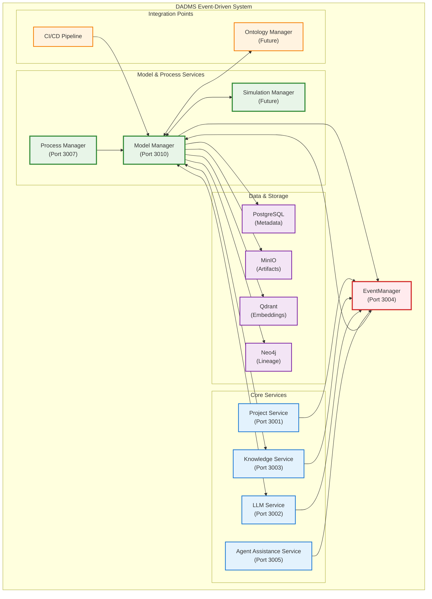
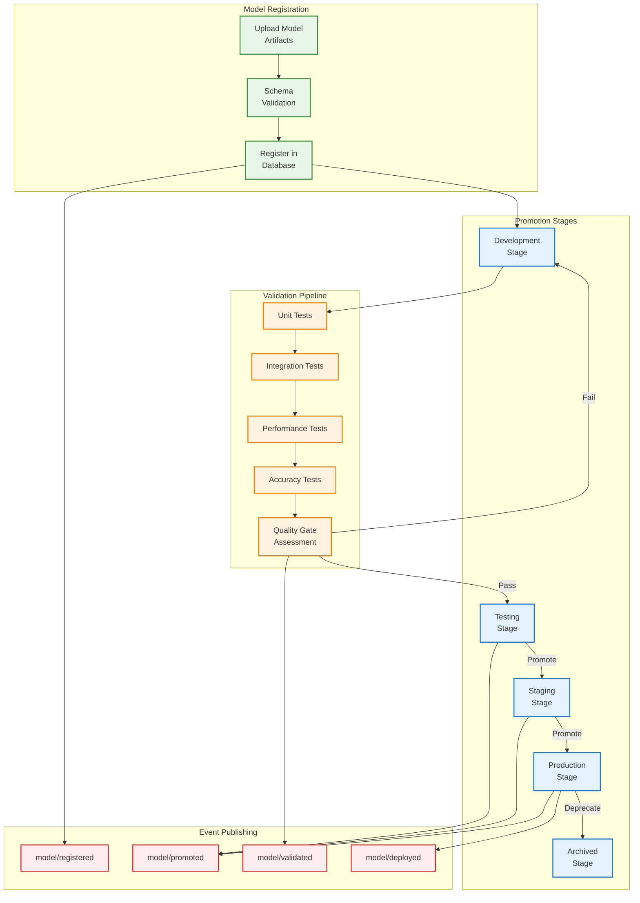
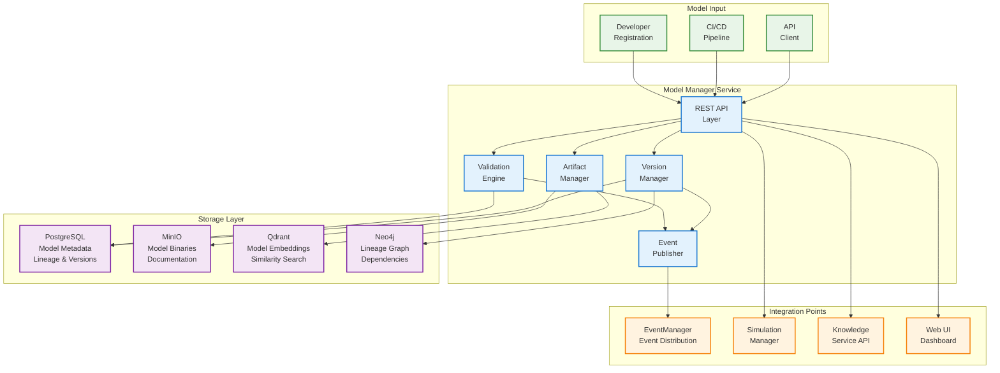
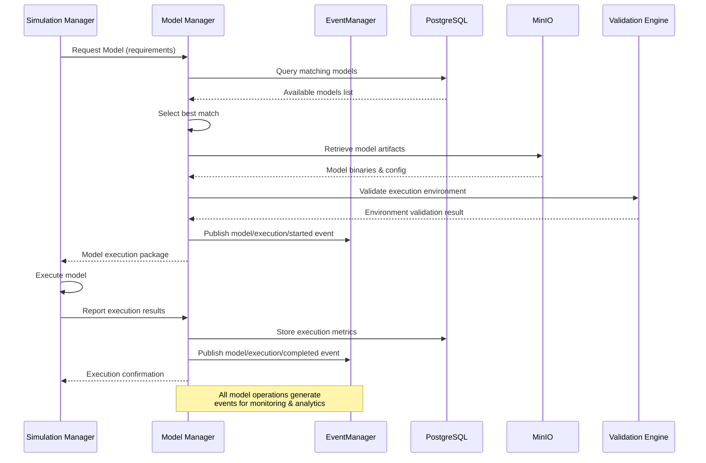

# DADMS Model Manager Service Specification

## 1. Purpose & Responsibilities

The `ModelManager` serves as the central registry and lifecycle management hub for computational models in DADMS's Event-Driven System (EDS), providing comprehensive model versioning, metadata management, and integration capabilities for ML, simulation, physics, and mission models.

### Core Responsibilities

- **Model Registration**: Register and catalog computational models with rich metadata and provenance tracking
- **Version Management**: Comprehensive versioning system with promotion workflows (dev → test → production)
- **Artifact Storage**: Secure storage and retrieval of model binaries and associated files
- **Schema Validation**: Enforce model metadata schemas and input/output specifications
- **Lineage Tracking**: Track model relationships, training data dependencies, and deployment history
- **Integration Gateway**: Provide standardized interfaces for downstream consumption by SimulationManager and other services
- **Performance Monitoring**: Track model performance metrics and enable comparison across versions
- **Access Control**: Role-based access control for model registration, promotion, and deletion

## 2. Architecture & Integration Diagrams

### 2.1 Model Manager Integration Architecture


### 2.2 Model Lifecycle & Version Management


### 2.3 Data Flow & Storage Architecture


### 2.4 Model Execution & Deployment Flow


## 3. Model Schema & Data Types

### Model Metadata Structure
```typescript
interface ModelMetadata {
  id: string;                     // UUID for unique identification
  name: string;                   // Human-readable model name
  version: string;                // Semantic version (major.minor.patch)
  model_type: ModelType;          // Type of computational model
  description: string;            // Detailed model description
  tags: string[];                 // Searchable tags and labels
  stage: ModelStage;              // Current deployment stage
  status: ModelStatus;            // Current model status
  
  // Schema & Interface Definitions
  input_schema: JsonSchema;       // Input parameter schema
  output_schema: JsonSchema;      // Output schema definition
  dependencies: ModelDependency[]; // Required dependencies
  runtime_requirements: RuntimeRequirements; // Execution requirements
  
  // Provenance & Lineage
  lineage: ModelLineage;          // Training data and model lineage
  training_info?: TrainingInfo;   // ML model training details
  validation_results: ValidationResult[]; // Model validation outcomes
  
  // Metadata
  metadata: ModelMetaData;        // Rich metadata and context
  artifacts: ModelArtifact[];     // Associated files and binaries
  
  // Lifecycle
  created_at: Date;
  updated_at: Date;
  created_by: string;             // User who registered the model
  promoted_by?: string;           // User who promoted the model
  promoted_at?: Date;             // When model was promoted
}

enum ModelType {
  MACHINE_LEARNING = "ml",        // Trained ML models (TensorFlow, PyTorch, etc.)
  SIMULATION = "simulation",      // Simulation models (Simulink, MATLAB, etc.)
  PHYSICS = "physics",            // Physics-based models and equations
  MISSION = "mission",            // Mission-specific models and scenarios
  STATISTICAL = "statistical",   // Statistical and mathematical models
  RULE_BASED = "rule_based",      // Rule-based systems and expert systems
  HYBRID = "hybrid",              // Combination of multiple model types
  FMI = "fmi",                    // Functional Mock-up Interface models
  PYTHON_SCRIPT = "python_script", // Python-based computational scripts
  EXECUTABLE = "executable"       // Compiled executables and binaries
}

enum ModelStage {
  DEVELOPMENT = "development",    // Under development
  TESTING = "testing",            // In testing phase
  STAGING = "staging",            // Pre-production validation
  PRODUCTION = "production",      // Production deployment
  ARCHIVED = "archived",          // Archived/deprecated
  EXPERIMENTAL = "experimental"   // Experimental/research models
}

enum ModelStatus {
  REGISTERED = "registered",      // Successfully registered
  VALIDATING = "validating",      // Undergoing validation
  VALIDATED = "validated",        // Validation complete
  FAILED_VALIDATION = "failed_validation", // Validation failed
  PROMOTING = "promoting",        // Being promoted to next stage
  ACTIVE = "active",              // Active and available
  DEPRECATED = "deprecated",      // Deprecated but available
  DISABLED = "disabled"           // Disabled/unavailable
}
```

### Model Lineage & Training Information
```typescript
interface ModelLineage {
  training_datasets: DatasetReference[]; // Training data sources
  parent_models?: string[];         // Parent/base models if applicable
  derived_models: string[];         // Models derived from this model
  training_pipeline: PipelineReference; // Training pipeline information
  experiments: ExperimentReference[]; // Related experiments
  publications?: PublicationReference[]; // Associated research papers
}

interface TrainingInfo {
  framework: string;                // TensorFlow, PyTorch, Scikit-learn, etc.
  framework_version: string;        // Framework version used
  hyperparameters: Record<string, any>; // Training hyperparameters
  metrics: TrainingMetrics;         // Training performance metrics
  training_duration: number;       // Training time in seconds
  compute_resources: ComputeResources; // Hardware used for training
  checkpoints: CheckpointInfo[];    // Model checkpoints
}

interface ValidationResult {
  id: string;
  validation_type: ValidationType;  // UNIT_TEST, INTEGRATION_TEST, PERFORMANCE_TEST
  status: ValidationStatus;         // PASSED, FAILED, PENDING
  metrics: Record<string, number>;  // Validation metrics
  test_suite: string;               // Test suite identifier
  executed_at: Date;
  executed_by: string;
  details: string;                  // Detailed results or error messages
}

enum ValidationType {
  UNIT_TEST = "unit_test",
  INTEGRATION_TEST = "integration_test", 
  PERFORMANCE_TEST = "performance_test",
  ACCURACY_TEST = "accuracy_test",
  STRESS_TEST = "stress_test",
  REGRESSION_TEST = "regression_test"
}

enum ValidationStatus {
  PASSED = "passed",
  FAILED = "failed", 
  PENDING = "pending",
  SKIPPED = "skipped"
}
```

### Model Artifacts & Dependencies
```typescript
interface ModelArtifact {
  id: string;
  name: string;                     // Artifact name (model.pkl, weights.h5, etc.)
  type: ArtifactType;               // Type of artifact
  path: string;                     // Storage path/URL
  size: number;                     // File size in bytes
  hash: string;                     // SHA-256 hash for integrity
  mime_type: string;                // MIME type
  description?: string;             // Artifact description
  created_at: Date;
}

enum ArtifactType {
  MODEL_BINARY = "model_binary",    // Serialized model file
  WEIGHTS = "weights",              // Model weights file
  CONFIGURATION = "configuration",  // Configuration files
  DOCUMENTATION = "documentation",  // Model documentation
  SCHEMA = "schema",                // Input/output schemas
  EXECUTABLE = "executable",        // Executable files
  DOCKER_IMAGE = "docker_image",    // Docker container images
  NOTEBOOK = "notebook",            // Jupyter notebooks
  SCRIPT = "script",                // Python/R scripts
  DATA_SAMPLE = "data_sample"       // Sample input/output data
}

interface ModelDependency {
  name: string;                     // Dependency name
  type: DependencyType;             // Type of dependency
  version: string;                  // Required version or version range
  optional: boolean;                // Whether dependency is optional
  description?: string;             // Dependency description
}

enum DependencyType {
  PYTHON_PACKAGE = "python_package",
  SYSTEM_PACKAGE = "system_package", 
  DOCKER_IMAGE = "docker_image",
  EXTERNAL_SERVICE = "external_service",
  HARDWARE = "hardware",
  DATASET = "dataset",
  OTHER_MODEL = "other_model"
}

interface RuntimeRequirements {
  cpu_cores?: number;               // Required CPU cores
  memory_gb?: number;               // Required memory in GB
  gpu_required?: boolean;           // GPU requirement
  gpu_memory_gb?: number;           // GPU memory requirement
  disk_space_gb?: number;           // Required disk space
  network_access?: boolean;         // Network access required
  execution_timeout?: number;       // Max execution time in seconds
  environment_variables?: Record<string, string>; // Required env vars
}
```

## 4. API Specification

### Core ModelManager Interface
```typescript
interface ModelManager {
  // Model Registration & Management
  registerModel(metadata: ModelMetadata, artifacts: ModelArtifact[]): Promise<ModelRegistrationResult>;
  updateModel(id: string, updates: Partial<ModelMetadata>): Promise<ModelMetadata>;
  deleteModel(id: string, force?: boolean): Promise<void>;
  
  // Model Retrieval
  getModel(idOrName: string, version?: string): Promise<ModelMetadata>;
  getModelArtifact(modelId: string, artifactName: string): Promise<ModelArtifact>;
  listModels(filter?: ModelFilter): Promise<ModelSummary[]>;
  searchModels(query: string, filter?: ModelFilter): Promise<ModelSearchResult[]>;
  
  // Version Management
  promoteModel(id: string, targetStage: ModelStage): Promise<PromotionResult>;
  compareModels(model1Id: string, model2Id: string): Promise<ModelComparison>;
  getModelVersions(name: string): Promise<ModelVersion[]>;
  
  // Validation & Testing
  validateModel(id: string, validationType: ValidationType): Promise<ValidationResult>;
  runModelTests(id: string, testSuite?: string): Promise<ValidationResult[]>;
  
  // Lineage & Analytics
  getModelLineage(id: string): Promise<ModelLineage>;
  getModelMetrics(id: string, timeRange?: TimeRange): Promise<ModelMetrics>;
  getModelUsage(id: string): Promise<ModelUsageStats>;
  
  // Integration
  deployModel(id: string, deploymentConfig: DeploymentConfig): Promise<DeploymentResult>;
  executeModel(id: string, inputs: ModelInputs): Promise<ModelOutputs>;
}

interface ModelFilter {
  model_type?: ModelType[];
  stage?: ModelStage[];
  status?: ModelStatus[];
  tags?: string[];
  created_after?: Date;
  created_before?: Date;
  created_by?: string;
  search_term?: string;
  sort_by?: 'name' | 'created_at' | 'updated_at' | 'version';
  sort_order?: 'asc' | 'desc';
  limit?: number;
  offset?: number;
}

interface ModelSummary {
  id: string;
  name: string;
  version: string;
  model_type: ModelType;
  stage: ModelStage;
  status: ModelStatus;
  description: string;
  tags: string[];
  created_at: Date;
  updated_at: Date;
  created_by: string;
}
```

### REST API Endpoints
```typescript
// Model Registration & Management
POST   /api/v1/models                    // Register new model
PUT    /api/v1/models/{id}               // Update model metadata
DELETE /api/v1/models/{id}               // Delete model
GET    /api/v1/models/{id}               // Get model details
GET    /api/v1/models                    // List models with filtering

// Model Artifacts
POST   /api/v1/models/{id}/artifacts     // Upload model artifacts
GET    /api/v1/models/{id}/artifacts     // List model artifacts
GET    /api/v1/models/{id}/artifacts/{name} // Download artifact
DELETE /api/v1/models/{id}/artifacts/{name} // Delete artifact

// Version Management
POST   /api/v1/models/{id}/promote       // Promote model to next stage
GET    /api/v1/models/{id}/versions      // Get version history
POST   /api/v1/models/{id}/compare/{otherId} // Compare models

// Validation & Testing
POST   /api/v1/models/{id}/validate      // Run validation tests
GET    /api/v1/models/{id}/validations   // Get validation history
POST   /api/v1/models/{id}/test          // Execute test suite

// Analytics & Monitoring
GET    /api/v1/models/{id}/lineage       // Get model lineage
GET    /api/v1/models/{id}/metrics       // Get performance metrics
GET    /api/v1/models/{id}/usage         // Get usage statistics

// Search & Discovery
GET    /api/v1/models/search             // Search models
GET    /api/v1/models/tags               // Get available tags
GET    /api/v1/models/types              // Get supported model types

// Integration
POST   /api/v1/models/{id}/deploy        // Deploy model
POST   /api/v1/models/{id}/execute       // Execute model
GET    /api/v1/models/{id}/deployments   // Get deployment status
```

## 5. Event-Driven Integration

### EventManager Integration
The ModelManager publishes events to and subscribes to events from the EventManager for real-time system coordination:

#### Published Events
```typescript
// Model lifecycle events
'model/registered'        // New model registered
'model/updated'          // Model metadata updated
'model/deleted'          // Model deleted
'model/promoted'         // Model promoted to new stage
'model/validated'        // Model validation completed
'model/deployed'         // Model deployed
'model/executed'         // Model execution completed

// Artifact events
'model/artifact/uploaded'   // New artifact uploaded
'model/artifact/deleted'    // Artifact deleted

// Validation events
'model/validation/started'  // Validation started
'model/validation/completed' // Validation completed
'model/validation/failed'   // Validation failed
```

#### Subscribed Events
```typescript
// Project events
'project/created'         // New project - setup model namespace
'project/deleted'         // Project deleted - cleanup models

// Knowledge events
'knowledge/document/processed' // Document processed - extract model references

// Process events
'process/simulation/requested' // Simulation requested - provide model
```

### Event Payload Examples
```typescript
interface ModelRegisteredEvent {
  type: 'model/registered';
  payload: {
    model_id: string;
    name: string;
    version: string;
    model_type: ModelType;
    stage: ModelStage;
    created_by: string;
    project_id?: string;
  };
}

interface ModelPromotedEvent {
  type: 'model/promoted';
  payload: {
    model_id: string;
    name: string;
    version: string;
    from_stage: ModelStage;
    to_stage: ModelStage;
    promoted_by: string;
    promotion_reason?: string;
  };
}

interface ModelValidationCompletedEvent {
  type: 'model/validation/completed';
  payload: {
    model_id: string;
    validation_id: string;
    validation_type: ValidationType;
    status: ValidationStatus;
    metrics: Record<string, number>;
    duration_ms: number;
  };
}
```

## 6. Integration Architecture

### Service Integrations

#### OntologyManager Integration
```typescript
interface OntologyIntegration {
  // Tag models with ontological concepts
  tagModel(modelId: string, concepts: string[]): Promise<void>;
  
  // Extract domain concepts from model metadata
  extractConcepts(metadata: ModelMetadata): Promise<string[]>;
  
  // Find models by ontological similarity
  findSimilarModels(concepts: string[]): Promise<ModelSummary[]>;
}
```

#### SimulationManager Integration
```typescript
interface SimulationManagerIntegration {
  // Provide model for simulation execution
  getModelForSimulation(requirements: ModelRequirements): Promise<ModelExecutionPackage>;
  
  // Report simulation results back to model
  reportSimulationResults(modelId: string, results: SimulationResults): Promise<void>;
  
  // Track model usage in simulations
  trackModelUsage(modelId: string, simulationId: string): Promise<void>;
}
```

#### KnowledgeService Integration
```typescript
interface KnowledgeServiceIntegration {
  // Index model metadata for search
  indexModelMetadata(model: ModelMetadata): Promise<void>;
  
  // Search models using vector similarity
  searchModelsByEmbedding(embedding: number[]): Promise<ModelSummary[]>;
  
  // Link models to knowledge documents
  linkModelToDocuments(modelId: string, documentIds: string[]): Promise<void>;
}
```

### Storage Architecture

#### Database Schema (PostgreSQL)
```sql
-- Models table
CREATE TABLE models (
  id UUID PRIMARY KEY DEFAULT gen_random_uuid(),
  name VARCHAR(255) NOT NULL,
  version VARCHAR(50) NOT NULL,
  model_type model_type_enum NOT NULL,
  description TEXT,
  stage model_stage_enum NOT NULL DEFAULT 'development',
  status model_status_enum NOT NULL DEFAULT 'registered',
  input_schema JSONB NOT NULL,
  output_schema JSONB NOT NULL,
  runtime_requirements JSONB,
  metadata JSONB,
  created_at TIMESTAMP WITH TIME ZONE DEFAULT NOW(),
  updated_at TIMESTAMP WITH TIME ZONE DEFAULT NOW(),
  created_by VARCHAR(255) NOT NULL,
  promoted_by VARCHAR(255),
  promoted_at TIMESTAMP WITH TIME ZONE,
  UNIQUE(name, version)
);

-- Model artifacts table
CREATE TABLE model_artifacts (
  id UUID PRIMARY KEY DEFAULT gen_random_uuid(),
  model_id UUID NOT NULL REFERENCES models(id) ON DELETE CASCADE,
  name VARCHAR(255) NOT NULL,
  type artifact_type_enum NOT NULL,
  path VARCHAR(500) NOT NULL,
  size BIGINT NOT NULL,
  hash VARCHAR(64) NOT NULL,
  mime_type VARCHAR(100),
  description TEXT,
  created_at TIMESTAMP WITH TIME ZONE DEFAULT NOW(),
  UNIQUE(model_id, name)
);

-- Model validations table
CREATE TABLE model_validations (
  id UUID PRIMARY KEY DEFAULT gen_random_uuid(),
  model_id UUID NOT NULL REFERENCES models(id) ON DELETE CASCADE,
  validation_type validation_type_enum NOT NULL,
  status validation_status_enum NOT NULL,
  metrics JSONB,
  test_suite VARCHAR(255),
  details TEXT,
  executed_at TIMESTAMP WITH TIME ZONE DEFAULT NOW(),
  executed_by VARCHAR(255) NOT NULL
);

-- Model lineage table
CREATE TABLE model_lineage (
  id UUID PRIMARY KEY DEFAULT gen_random_uuid(),
  model_id UUID NOT NULL REFERENCES models(id) ON DELETE CASCADE,
  parent_model_id UUID REFERENCES models(id),
  lineage_type VARCHAR(50) NOT NULL, -- 'training_data', 'parent_model', 'derived_from'
  reference_id VARCHAR(255) NOT NULL,
  metadata JSONB,
  created_at TIMESTAMP WITH TIME ZONE DEFAULT NOW()
);

-- Model tags table
CREATE TABLE model_tags (
  model_id UUID NOT NULL REFERENCES models(id) ON DELETE CASCADE,
  tag VARCHAR(100) NOT NULL,
  PRIMARY KEY (model_id, tag)
);

-- Model dependencies table
CREATE TABLE model_dependencies (
  id UUID PRIMARY KEY DEFAULT gen_random_uuid(),
  model_id UUID NOT NULL REFERENCES models(id) ON DELETE CASCADE,
  name VARCHAR(255) NOT NULL,
  type dependency_type_enum NOT NULL,
  version VARCHAR(100) NOT NULL,
  optional BOOLEAN DEFAULT FALSE,
  description TEXT
);
```

#### Object Storage (MinIO)
```
/models/
├── {model_id}/
│   ├── artifacts/
│   │   ├── model.pkl
│   │   ├── weights.h5
│   │   ├── config.json
│   │   └── documentation.pdf
│   ├── checkpoints/
│   │   ├── checkpoint_001.pkl
│   │   └── checkpoint_002.pkl
│   └── validation/
│       ├── test_results.json
│       └── performance_reports.pdf
```

## 7. Non-Functional Requirements

### Performance & Scalability
- **Model Registry**: Support 100,000+ models with sub-second query response
- **Artifact Storage**: Handle artifacts up to 10GB with efficient upload/download
- **Concurrent Access**: Support 1,000+ concurrent API requests
- **Search Performance**: Model search results in <500ms
- **Bulk Operations**: Batch registration of 1,000+ models

### Security & Access Control
- **Authentication**: JWT-based authentication with service accounts
- **Authorization**: Role-based access control (RBAC)
  - `model:read` - View model metadata and artifacts
  - `model:write` - Register and update models
  - `model:promote` - Promote models between stages
  - `model:admin` - Full administrative access
- **Encryption**: Encrypt sensitive model artifacts at rest and in transit
- **Audit Logging**: Comprehensive audit trail for all operations

### Reliability & Monitoring
- **Availability**: 99.9% uptime SLA
- **Data Integrity**: Checksum validation for all artifacts
- **Backup & Recovery**: Daily automated backups with point-in-time recovery
- **Health Checks**: Comprehensive health monitoring with alerting
- **Circuit Breakers**: Fault tolerance for external dependencies

### Compliance & Governance
- **Data Retention**: Configurable retention policies for models and artifacts
- **Versioning**: Immutable model versions with audit trails
- **Lineage Tracking**: Complete provenance and lineage tracking
- **Export Controls**: Support for export control and compliance marking
- **Privacy**: PII detection and handling in model metadata

## 8. Implementation Roadmap

### Phase 1: Core Registry (Weeks 1-2)
- [ ] Basic model registration and metadata management
- [ ] PostgreSQL schema implementation
- [ ] Core REST API endpoints
- [ ] MinIO integration for artifact storage
- [ ] Basic validation framework

### Phase 2: Version Management (Weeks 3-4)
- [ ] Model promotion workflows
- [ ] Version comparison capabilities
- [ ] Advanced validation and testing
- [ ] CI/CD pipeline integration
- [ ] Automated quality gates

### Phase 3: Integration & Analytics (Weeks 5-6)
- [ ] EventManager integration
- [ ] OntologyManager integration
- [ ] SimulationManager integration
- [ ] Performance metrics and monitoring
- [ ] Advanced search and discovery

### Phase 4: Advanced Features (Weeks 7-8)
- [ ] Model execution capabilities
- [ ] Real-time model monitoring
- [ ] Advanced lineage tracking
- [ ] Compliance and governance features
- [ ] Performance optimization

## 9. Technology Stack

### Core Services
- **Runtime**: Node.js with TypeScript
- **Framework**: Express.js with OpenAPI documentation
- **Database**: PostgreSQL with Prisma ORM
- **Object Storage**: MinIO S3-compatible storage
- **Cache**: Redis for caching and session management
- **Message Queue**: Redis for background job processing

### Development & Deployment
- **Process Manager**: PM2 for local development
- **Containerization**: Docker with multi-stage builds
- **API Documentation**: OpenAPI 3.0 with Swagger UI
- **Testing**: Jest with comprehensive test coverage
- **CI/CD**: GitHub Actions with automated testing and deployment

### Integration Libraries
- **Event Bus**: Custom EventManager client
- **Authentication**: JWT with express-jwt middleware
- **Validation**: Joi schema validation
- **File Processing**: Multer for file uploads
- **Monitoring**: Prometheus metrics with Grafana dashboards

## 10. Port Allocation & Service Configuration

### Service Configuration
- **Port**: 3010 (following DADMS port allocation pattern)
- **Health Check**: `GET /health`
- **Metrics**: `GET /metrics` (Prometheus format)
- **API Base**: `/api/v1`
- **Documentation**: `/docs` (Swagger UI)

### Environment Configuration
```typescript
interface ModelManagerConfig {
  PORT: number;                    // Service port (default: 3010)
  DATABASE_URL: string;            // PostgreSQL connection string
  REDIS_URL: string;               // Redis connection string
  MINIO_ENDPOINT: string;          // MinIO endpoint
  MINIO_ACCESS_KEY: string;        // MinIO access key
  MINIO_SECRET_KEY: string;        // MinIO secret key
  MINIO_BUCKET: string;            // Models bucket name
  EVENTMANAGER_URL: string;        // EventManager service URL
  JWT_SECRET: string;              // JWT signing secret
  MAX_ARTIFACT_SIZE: number;       // Max artifact size in bytes
  VALIDATION_TIMEOUT: number;      // Validation timeout in seconds
}
```

## 11. Success Metrics & KPIs

### Performance Metrics
- **Registration Time**: Model registration < 30 seconds
- **Search Performance**: Model search < 500ms
- **Artifact Upload**: Large artifacts (1GB+) upload < 5 minutes
- **API Response Time**: 95th percentile < 200ms
- **System Throughput**: 1,000+ operations per minute

### Business Metrics
- **Model Adoption**: Number of models registered per month
- **Version Velocity**: Average time from dev to production
- **Validation Success Rate**: Percentage of models passing validation
- **Integration Usage**: Models consumed by SimulationManager
- **User Engagement**: Active users and API consumption

### Quality Metrics
- **Test Coverage**: >90% code coverage
- **API Uptime**: 99.9% availability
- **Data Integrity**: Zero data corruption incidents
- **Security Compliance**: All security audits passed
- **Documentation Coverage**: 100% API documentation

This specification provides a comprehensive foundation for implementing the DADMS Model Manager Service as a production-ready, scalable component of the Event-Driven System. 