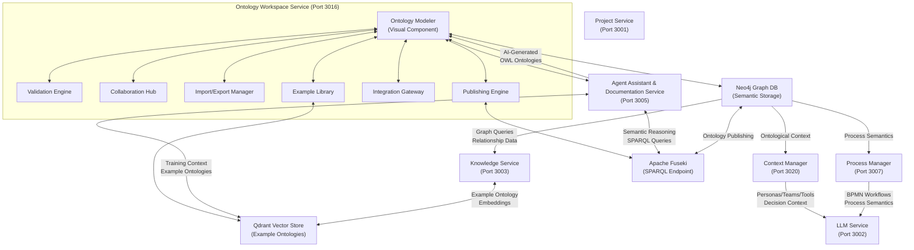
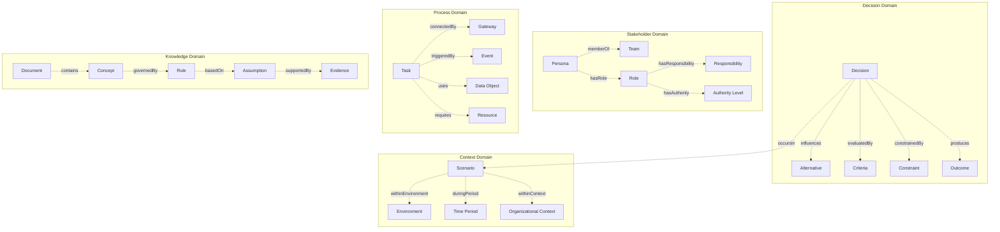
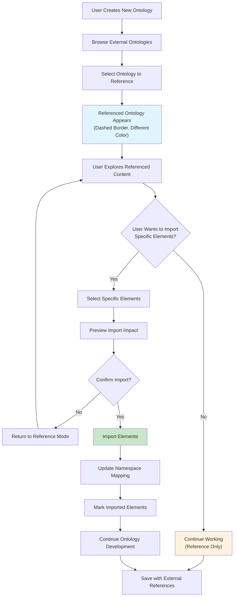
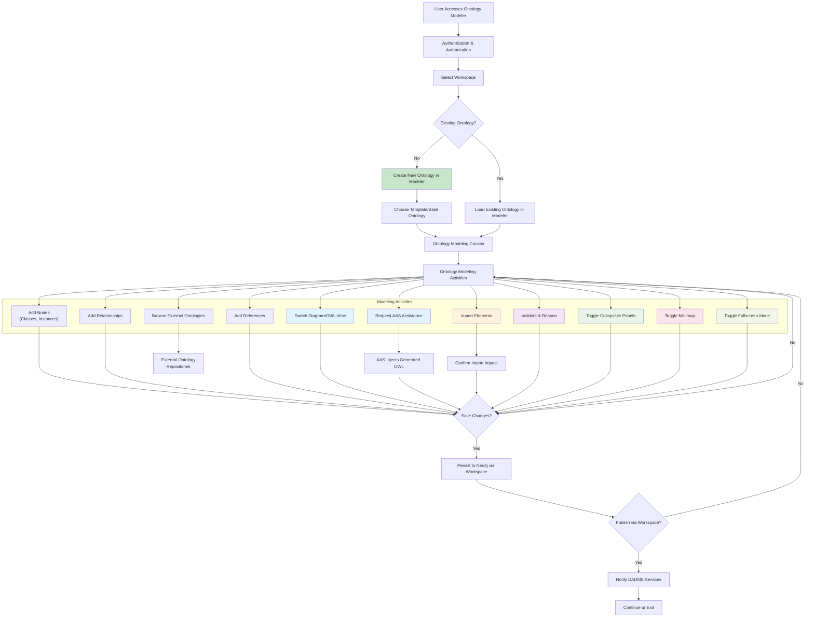
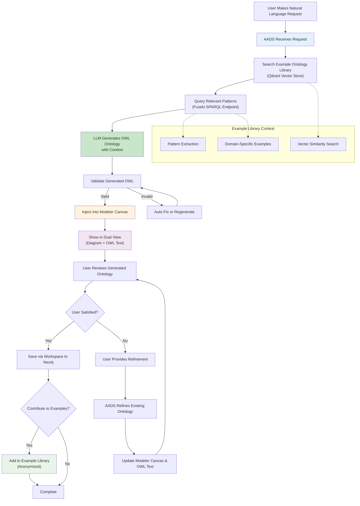
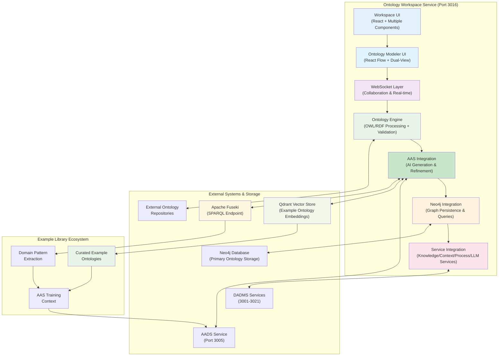
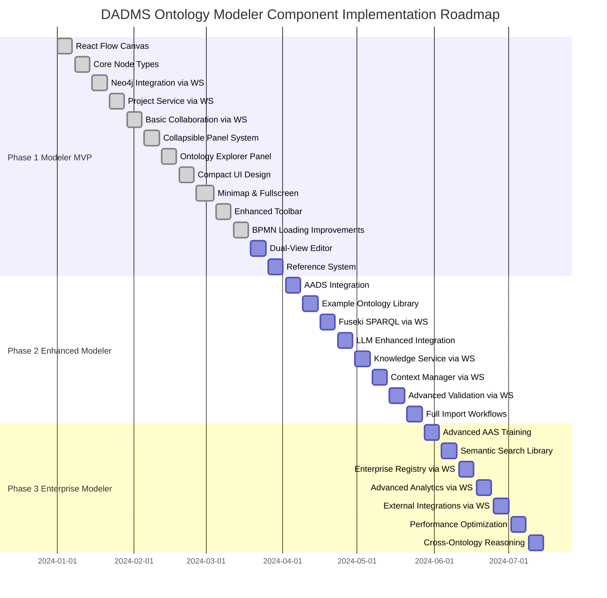

# DADMS Ontology Workspace Service – Ontology Modeler Component Specification

## 1. Introduction

The **Ontology Modeler** is a core visual component within the **DADMS Ontology Workspace Service (Port 3016)**. It provides an interactive, web-based interface for building, editing, and managing ontologies that support decision intelligence and knowledge management within the DADMS ecosystem. The modeler serves as the visual canvas for ontological modeling of decision contexts, stakeholder relationships, process elements, and domain knowledge.

**Component Purpose:** Enable intuitive visual semantic modeling of decision intelligence domains within the broader Ontology Workspace Service capabilities.

**Service Context:** The Ontology Modeler operates within the Ontology Workspace Service alongside other components including validation engines, collaboration features, import/export capabilities, and publishing tools.

---

## 2. Ontology Workspace Service Architecture

### 2.1. Service Components Overview

The **Ontology Workspace Service (Port 3016)** consists of several integrated components:

* **Ontology Modeler** - Visual drag-and-drop modeling interface (this specification)
* **Validation Engine** - OWL/RDF validation and reasoning capabilities  
* **Collaboration Hub** - Real-time collaborative editing and discussion features
* **Import/Export Manager** - Multi-format file handling and transformation
* **Publishing Engine** - Fuseki and web platform publishing capabilities
* **Integration Gateway** - External tool integrations (Cemento, draw.io, etc.)
* **Example Library** - Curated ontology templates and training context

### 2.2. DADMS Ecosystem Integration

* **Agent Assistant & Documentation Service - AADS (3005):** AI-powered ontology generation from natural language requests, ontology finalization assistance
* **Knowledge Service (3003):** Provides ontology-enhanced RAG search and document semantic relationships, vector store for example ontologies
* **Context Manager (3020):** Leverages ontologies for persona/team/tool relationship modeling  
* **LLM Service (3002):** Consumes ontological context for enhanced reasoning and decision support
* **Process Manager (3007):** Uses ontologies to model BPMN process semantics and stakeholder relationships
* **Neo4j Graph Database:** Primary persistence layer for ontological data and relationship storage
* **Qdrant Vector Store:** Storage for example ontology embeddings and semantic search context
* **Apache Fuseki:** SPARQL endpoint for example ontology repository and reasoning
* **Project Service (3001):** Project-scoped ontology management and versioning

### 2.3. Component Data Flow Integration

---

## 3. Ontology Modeler Component Features

### 3.1. Visual Modeling Canvas

* **Framework:** React Flow with DADMS-specific node types and semantic relationships
* **Purpose:** Visual modeling of decision contexts, stakeholder networks, and knowledge domains
* **DADMS-Specific Interactions:**
  * Decision tree and influence diagram integration
  * Stakeholder relationship mapping
  * Process-ontology linking for BPMN enhancement
  * Multi-project ontology inheritance and extension

### 3.2. Enhanced UI Components (Latest Implementation)

#### 3.2.1. Collapsible Panel System
* **Collapsible Ontology Elements Panel:** Toggle visibility of ontology element types with smooth animations
* **Collapsible Properties Panel:** Expandable/collapsible property editing interface
* **Collapsible References Panel:** Toggle external ontology reference display
* **Compact Header Design:** Reduced vertical heights and simplified text-based headers matching BPMN canvas style
* **Theme-Consistent Styling:** All panels use DADMS theme variables for seamless light/dark mode switching

#### 3.2.2. Ontology Explorer Panel
* **Visual Ontology Browser:** Hierarchical display of ontology elements with proper icons
* **VS Code Codicon Integration:** Consistent icon system using VS Code codicon names
* **Theme-Aware Icons:** Icons automatically adapt to light/dark theme changes
* **Smooth Transitions:** CSS transitions for panel expand/collapse animations
* **Compact Layout:** Reduced padding and toolbar heights for efficient space usage

#### 3.2.3. Advanced Canvas Controls
* **Minimap Toggle:** Show/hide minimap for large ontology navigation
* **Fullscreen Mode:** Toggle fullscreen mode with fixed positioning and full viewport usage
* **Properties/References Toggle:** Icon-only toggle buttons moved from canvas header to toolbar
* **Enhanced Toolbar:** Streamlined toolbar with essential controls and improved UX

#### 3.2.4. BPMN Workspace Integration
* **Improved Loading Performance:** Enhanced iframe loading with retry logic and timeout handling
* **Theme Synchronization:** Robust theme message passing between parent and iframe
* **Error Handling:** Comprehensive error handling for iframe loading failures
* **Loading States:** Better user feedback during BPMN modeler initialization

### 3.3. DADMS Ontology Types

* **Decision Entities:** Decisions, Alternatives, Criteria, Constraints, Outcomes
* **Stakeholder Entities:** Personas, Teams, Roles, Responsibilities, Authority Levels
* **Process Entities:** Tasks, Gateways, Events, Data Objects, Resources
* **Knowledge Entities:** Documents, Concepts, Rules, Assumptions, Evidence
* **Context Entities:** Scenarios, Environments, Time Periods, Organizational Contexts
* **Relationship Types:** Influences, DependsOn, ConflictsWith, SupportsDecision, RequiresApproval

#### 3.3.1. DADMS Ontology Type Hierarchy

### 3.4. AI-Assisted Ontology Generation (AADS Integration)

* **Natural Language Ontology Creation:** Users can request ontologies using natural language via AADS integration
* **AI-Generated OWL Injection:** AADS generates complete OWL ontologies and injects them directly into the modeler canvas
* **Context-Aware Generation:** AAS leverages example ontology library from vector store for informed generation
* **Iterative Refinement:** Users can request modifications and the AAS updates the ontology accordingly
* **Domain-Specific Templates:** AAS can generate ontologies for specific decision intelligence domains (risk assessment, stakeholder analysis, process optimization)
* **Validation and Reasoning:** AI-generated ontologies automatically validated and reasoned upon injection

### 3.5. Dual-View Editor (Diagram/OWL Mode)

* **Visual Diagram Mode:** Primary React Flow canvas for interactive ontology modeling and visualization
* **OWL Text Mode:** Switchable text editor showing complete OWL/RDF/Turtle representation of the ontology
* **Live Synchronization:** Real-time bidirectional sync between diagram changes and OWL text updates
* **Syntax Highlighting:** Advanced syntax highlighting and validation for OWL/RDF/Turtle formats
* **Direct Text Editing:** Power users can edit OWL directly with automatic diagram updates and error handling
* **Format Selection:** Support for multiple serialization formats (OWL/XML, RDF/XML, Turtle, N-Triples, JSON-LD)
* **Export Compatibility:** Generated OWL text fully compatible with Protégé, TopBraid, and other ontology tools

### 3.6. Ontology Import and Reference Management

* **External Ontology Discovery:** Browse and search available ontologies from DADMS registry, external repositories, and standard ontology libraries
* **Reference Mode (Default):** External ontologies appear as linked nodes in the diagram with distinct visual styling (dashed borders, different colors)
* **Selective Import:** Users can choose specific concepts, relationships, or entire branches from referenced ontologies to import into their working ontology
* **Import Confirmation:** Explicit user confirmation required before actual import - prevents accidental incorporation of large external ontologies
* **Version Tracking:** Track versions of referenced ontologies and alert users to updates or changes
* **Dependency Visualization:** Clear visual indication of what elements come from external sources vs. local definitions
* **Namespace Management:** Automatic namespace handling to prevent URI conflicts between imported and local ontologies
* **Impact Analysis:** Show potential impacts before importing external ontology elements

#### 3.6.1. Ontology Import Workflow

### 3.7. DADMS Theme Integration

* **Seamless UI:** Full integration with DADMS design system and theme switching
* **Responsive Design:** Optimized for desktop, tablet, and mobile decision-making scenarios
* **Accessibility:** WCAG 2.1 AA compliance for inclusive decision support
* **Customization:** Role-based UI customization for different user types (analysts, executives, SMEs)
* **Compact Layout:** Reduced vertical heights and efficient space utilization
* **Icon System:** VS Code codicon integration for consistent visual language

#### 3.7.1. User Interaction Flow

#### 3.7.2. AAS-Assisted Ontology Generation Workflow

---

## 4. Component Integration with Workspace Service

### 4.1. Workspace Service Component Architecture

### 4.2. API Integration Points (Modeler-Specific)

* **POST /workspaces/{workspaceId}/modeler/generate** - Request AAS to generate ontology from natural language
* **GET /workspaces/{workspaceId}/ontologies/{ontologyId}/dual-view** - Switch between diagram and OWL text modes
* **PUT /workspaces/{workspaceId}/ontologies/{ontologyId}/owl-text** - Update ontology via direct OWL text editing
* **POST /workspaces/{workspaceId}/modeler/import/reference** - Add external ontology reference to modeler
* **POST /workspaces/{workspaceId}/modeler/import/selective** - Import specific elements with confirmation
* **GET /workspaces/{workspaceId}/modeler/examples/search** - Search example ontology library for patterns
* **WebSocket /ws/workspaces/{workspaceId}/modeler** - Real-time collaborative modeling updates
* **PUT /workspaces/{workspaceId}/modeler/ui/preferences** - Update UI preferences (panel visibility, minimap, fullscreen)
* **GET /workspaces/{workspaceId}/modeler/ui/state** - Get current UI state for persistence

### 4.3. Example Ontology Library Integration

* **Curated Example Repository:** Comprehensive library of pre-built ontologies covering common decision intelligence scenarios
* **Vector Store Integration:** All example ontologies stored as embeddings in Qdrant for semantic similarity search
* **Fuseki SPARQL Endpoint:** Complete ontology repository accessible via SPARQL for complex querying and reasoning
* **Domain Coverage:** Examples include stakeholder analysis, risk assessment, process optimization, decision trees, influence diagrams
* **AAS Training Context:** Example ontologies serve as training data and context for AI-assisted ontology generation
* **Semantic Search:** Users can search examples by domain, use case, complexity, or semantic similarity to their needs
* **Template Extraction:** Common patterns and structures extracted from examples for rapid ontology bootstrapping
* **Continuous Learning:** New user-created ontologies can be anonymized and added to example library for community benefit
* **Quality Metrics:** Examples rated and validated for completeness, consistency, and real-world applicability
* **Version Evolution:** Track how example ontologies evolve and improve over time based on usage patterns

---

## 5. Implementation Roadmap

### 5.1. Phase 1 (Modeler MVP - Weeks 1-4)
- [x] Basic React Flow canvas with DADMS theming within workspace
- [x] Core ontology node types and relationships for decision intelligence
- [x] Neo4j integration via workspace service
- [x] Project Service integration via workspace
- [x] Basic collaboration features through workspace WebSocket
- [x] Collapsible panel system with smooth animations
- [x] Ontology explorer panel with VS Code codicon integration
- [x] Compact UI design with reduced vertical heights
- [x] Minimap toggle and fullscreen mode
- [x] Enhanced toolbar with icon-only controls
- [x] Improved BPMN workspace loading performance
- [ ] Dual-view editor (diagram/OWL text mode)
- [ ] External ontology reference system (visual only)
- [ ] Basic import preview functionality

### 5.2. Phase 2 (Enhanced Modeler - Weeks 5-8)
- [ ] AADS integration for AI-assisted ontology generation within modeler
- [ ] Example ontology library with Qdrant vector store integration
- [ ] Fuseki SPARQL endpoint integration via workspace
- [ ] LLM Service integration for enhanced AI assistance
- [ ] Knowledge Service integration for document linking
- [ ] Context Manager integration for persona/team modeling
- [ ] Advanced validation and reasoning through workspace
- [ ] Full ontology import with confirmation workflows
- [ ] Namespace management and conflict resolution

### 5.3. Phase 3 (Enterprise Modeler - Weeks 9-12)
- [ ] Advanced AAS training context and continuous learning
- [ ] Semantic search across example ontology library
- [ ] Enterprise ontology registry through workspace
- [ ] Advanced analytics and reporting
- [ ] External system integrations via workspace
- [ ] Performance optimization for large ontologies
- [ ] Automated dependency tracking and updates
- [ ] Cross-ontology reasoning and inference

#### 5.4. Implementation Timeline

---

## 6. Success Metrics & KPIs

### 6.1. Modeler Performance Metrics
* **Ontology Creation:** < 15 minutes for basic decision context modeling in modeler
* **Graph Query Response:** < 2 seconds for semantic relationship queries through workspace
* **Collaboration Latency:** < 500ms for real-time collaborative edits in modeler
* **Integration Response:** < 3 seconds for cross-service semantic context retrieval
* **UI Responsiveness:** < 100ms for panel toggle animations and theme switching
* **BPMN Loading Time:** < 5 seconds for BPMN workspace initialization (target optimization)

### 6.2. Modeler User Adoption Metrics
* **Decision Context Coverage:** >80% of decisions have associated ontological context created in modeler
* **Stakeholder Network Completeness:** >90% of key stakeholders modeled with relationships
* **Reuse Rate:** >60% of ontological elements reused across projects through modeler
* **User Engagement:** >70% of decision analysts actively using ontology modeler
* **Panel Usage:** >85% of users utilize collapsible panels for workspace organization
* **Fullscreen Adoption:** >60% of users utilize fullscreen mode for complex modeling sessions

### 6.3. Modeler Quality Metrics
* **Semantic Consistency:** >95% of ontologies created in modeler pass consistency validation
* **Relationship Completeness:** <5% missing critical relationships in decision contexts
* **Knowledge Integration:** >80% of project documents linked to ontological concepts via modeler
* **Decision Support Effectiveness:** >75% improvement in decision quality metrics
* **UI Accessibility:** 100% WCAG 2.1 AA compliance for inclusive decision support
* **Theme Consistency:** 100% theme variable usage across all UI components

### 6.4. AAS Integration Metrics (Modeler-Specific)
* **AI Generation Success Rate:** >90% of AAS-generated ontologies in modeler validate successfully
* **User Acceptance of AI Ontologies:** >80% of AI-generated ontologies accepted with minimal modifications
* **Context Utilization:** >75% of AI generations leverage relevant examples from the library
* **Generation Speed:** <30 seconds for basic domain ontologies, <2 minutes for complex ontologies
* **Refinement Iterations:** <3 average iterations to achieve user satisfaction

### 6.5. Example Library Metrics (Modeler Access)
* **Library Coverage:** >100 curated examples across major decision intelligence domains
* **Search Relevance:** >85% semantic search results rated as relevant by modeler users
* **Pattern Reuse:** >60% of new ontologies incorporate patterns from example library
* **Community Contribution:** >40% of users contribute anonymized ontologies to example library
* **Training Effectiveness:** Measurable improvement in AAS generation quality as library grows

---

**This specification provides the comprehensive requirements for implementing the Ontology Modeler as a core visual component within the DADMS Ontology Workspace Service, with specific focus on decision intelligence modeling, AAS integration, and seamless operation within the broader workspace ecosystem. The latest implementation includes enhanced UI components with collapsible panels, compact design, advanced canvas controls, and improved BPMN workspace integration.**
