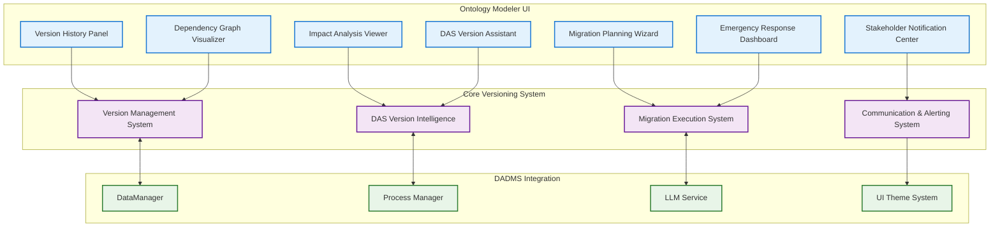

# Ontology Modeler Versioning UI Components Extension

## Section 3.2.5: Advanced Versioning UI Components

The Ontology Modeler includes sophisticated versioning UI components that integrate seamlessly with the comprehensive versioning system detailed in the [Ontology Workspace Versioning Extension](./ontology_workspace_versioning_extension.md).

### Version Management Panel System

#### 3.2.5.1. Version History Panel
```typescript
interface VersionHistoryPanel extends React.FC {
  props: {
    ontologyId: string;
    currentVersion: string;
    onVersionSelect: (versionId: string) => void;
    onVersionCompare: (fromVersion: string, toVersion: string) => void;
    onCreateVersion: () => void;
  };
  features: {
    timelineView: boolean;           // Visual timeline of version history
    branchVisualization: boolean;   // Git-like branch visualization
    collaboratorInfo: boolean;      // Show who created each version
    changeMetrics: boolean;         // Display change statistics
    filteringOptions: boolean;      // Filter by version type, author, date
  };
}
```

**Features:**
* **Interactive Timeline:** Visual timeline showing version progression with branch points
* **Change Visualization:** Heat map showing areas of change between versions
* **Collaboration Indicators:** Avatar displays for version creators and contributors
* **Quick Actions:** One-click version comparison, rollback, and branching
* **Search & Filter:** Advanced filtering by author, date range, change type, impact level

#### 3.2.5.2. Impact Analysis Viewer
```typescript
interface ImpactAnalysisViewer extends React.FC {
  props: {
    proposedChanges: ChangeSet;
    currentAnalysis: ImpactAnalysisResult;
    onRefreshAnalysis: () => void;
    onViewDetails: (impactId: string) => void;
    onAcceptChanges: () => void;
  };
  features: {
    realTimeAnalysis: boolean;      // Real-time impact calculation
    dependencyGraph: boolean;       // Interactive dependency visualization
    riskAssessment: boolean;        // Visual risk indicators
    mitigationSuggestions: boolean; // DAS-generated mitigation suggestions
    stakeholderImpact: boolean;     // Stakeholder-specific impact breakdown
  };
}
```

**Features:**
* **Real-Time Impact Calculation:** Live updates as users make changes
* **Interactive Dependency Graph:** Zoomable, filterable graph of affected systems
* **Risk Heat Map:** Visual representation of change risks across systems
* **DAS Recommendations:** AI-generated suggestions for safe change implementation
* **Stakeholder Notifications:** Preview of notifications that will be sent

#### 3.2.5.3. Migration Planning Wizard
```typescript
interface MigrationPlanningWizard extends React.FC {
  props: {
    fromVersion: string;
    toVersion: string;
    migrationRequirements: MigrationRequirements;
    onPlanGenerated: (plan: MigrationPlan) => void;
    onExecuteMigration: (plan: MigrationPlan) => void;
  };
  features: {
    stepByStepWizard: boolean;      // Guided migration planning
    riskAssessment: boolean;        // Risk evaluation at each step
    resourcePlanning: boolean;      // Resource requirement calculation
    timelineEstimation: boolean;    // Migration timeline estimation
    rollbackPlanning: boolean;      // Automatic rollback plan generation
  };
}
```

**Features:**
* **Step-by-Step Guidance:** Wizard interface for complex migration planning
* **Resource Calculator:** Estimates time, personnel, and system resources needed
* **Risk Mitigation Planner:** Interactive risk identification and mitigation planning
* **Timeline Optimizer:** DAS-assisted optimal timing recommendations
* **Rollback Strategy Designer:** Visual rollback plan with decision points

#### 3.2.5.4. Dependency Graph Visualizer
```typescript
interface DependencyGraphVisualizer extends React.FC {
  props: {
    ontologyId: string;
    dependencyGraph: ComprehensiveDependencyGraph;
    onNodeSelect: (nodeId: string) => void;
    onEdgeSelect: (edgeId: string) => void;
    onFilterChange: (filters: DependencyFilters) => void;
  };
  features: {
    interactiveGraph: boolean;      // Zoomable, pannable graph visualization
    layeredView: boolean;           // Hierarchical layers (direct, indirect, hidden)
    riskIndicators: boolean;        // Visual risk indicators on nodes/edges
    impactSimulation: boolean;      // Simulate change impacts visually
    exportCapabilities: boolean;    // Export graph in various formats
  };
}
```

**Features:**
* **Multi-Layer Visualization:** Show direct, indirect, and hidden dependencies
* **Interactive Risk Assessment:** Click nodes to see impact potential
* **Live Simulation:** Simulate changes and see real-time impact propagation
* **Stakeholder Mapping:** Show which teams/people are affected by each dependency
* **Export Options:** Generate dependency reports and diagrams

#### 3.2.5.5. Change Comparison Interface
```typescript
interface ChangeComparisonInterface extends React.FC {
  props: {
    fromVersion: OntologyVersion;
    toVersion: OntologyVersion;
    comparisonResult: VersionComparison;
    onDrillDown: (changeId: string) => void;
    onApplyChange: (changeId: string) => void;
  };
  features: {
    sideBySideComparison: boolean;  // Split-screen version comparison
    unifiedDiffView: boolean;       // Unified diff visualization
    semanticHighlighting: boolean;  // Highlight semantic vs. structural changes
    changeStatistics: boolean;      // Statistical summary of changes
    approvalWorkflow: boolean;      // Change approval interface
  };
}
```

**Features:**
* **Dual-Pane Comparison:** Side-by-side visualization of ontology versions
* **Semantic Highlighting:** Different colors for different types of changes
* **Change Navigation:** Easy navigation through all changes with impact indicators
* **Approval Interface:** Integrated approval workflow for significant changes
* **Export Comparisons:** Generate change reports for documentation

#### 3.2.5.6. Stakeholder Notification Center
```typescript
interface StakeholderNotificationCenter extends React.FC {
  props: {
    changes: ChangeSet;
    affectedStakeholders: ComprehensiveStakeholderMap;
    onSendNotifications: (notifications: PersonalizedNotification[]) => void;
    onPreviewNotification: (stakeholderId: string) => void;
  };
  features: {
    stakeholderMapping: boolean;    // Visual mapping of affected stakeholders
    notificationPreview: boolean;   // Preview personalized notifications
    batchNotifications: boolean;    // Send notifications in batches
    responseTracking: boolean;      // Track stakeholder responses
    escalationManagement: boolean;  // Manage notification escalations
  };
}
```

**Features:**
* **Stakeholder Impact Mapping:** Visual representation of who's affected and how
* **Personalized Previews:** See exactly what each stakeholder will receive
* **Response Tracking:** Monitor acknowledgments and action completion
* **Escalation Management:** Automatic escalation for critical notifications
* **Communication Templates:** DAS-generated, role-specific communication templates

### Advanced Versioning Workflow Components

#### 3.2.5.7. Version Branch Manager
```typescript
interface VersionBranchManager extends React.FC {
  props: {
    ontologyId: string;
    branches: VersionBranch[];
    onCreateBranch: (branchName: string, fromVersion: string) => void;
    onMergeBranch: (branchId: string, targetVersion: string) => void;
    onDeleteBranch: (branchId: string) => void;
  };
  features: {
    gitLikeInterface: boolean;      // Git-style branching interface
    mergeConflictResolution: boolean; // Visual merge conflict resolution
    branchComparison: boolean;      // Compare branches before merging
    collaborativeReview: boolean;   // Multi-user branch review process
    automatedTesting: boolean;      // Automated validation of branches
  };
}
```

#### 3.2.5.8. Emergency Response Dashboard
```typescript
interface EmergencyResponseDashboard extends React.FC {
  props: {
    emergencyConditions: EmergencyCondition[];
    activeIncidents: EmergencyIncident[];
    onInitiateResponse: (emergency: EmergencyCondition) => void;
    onExecuteRollback: (rollbackPlan: IntelligentRollbackPlan) => void;
  };
  features: {
    realTimeMonitoring: boolean;    // Real-time system health monitoring
    alertManagement: boolean;       // Manage and prioritize alerts
    quickActions: boolean;          // One-click emergency responses
    statusDashboard: boolean;       // System-wide status visualization
    communicationCenter: boolean;   // Emergency communication hub
  };
}
```

#### 3.2.5.9. DAS Version Intelligence Assistant
```typescript
interface DASVersionIntelligenceAssistant extends React.FC {
  props: {
    ontologyId: string;
    currentContext: VersioningContext;
    onRequestGuidance: (scenario: VersioningScenario) => void;
    onAcceptRecommendation: (recommendationId: string) => void;
  };
  features: {
    intelligentRecommendations: boolean; // AI-powered versioning suggestions
    contextualGuidance: boolean;    // Context-aware help and tips
    predictiveInsights: boolean;    // Predictions about change outcomes
    learningFeedback: boolean;      // Feedback loop for DAS learning
    proactiveAlerts: boolean;       // Proactive warnings about potential issues
  };
}
```

### Integration with Existing UI Components

#### Enhanced Toolbar Integration
```typescript
interface EnhancedVersioningToolbar extends React.FC {
  components: {
    versionSelector: VersionSelector;        // Quick version switching
    branchIndicator: BranchIndicator;       // Current branch display
    changeIndicator: ChangeIndicator;       // Unsaved changes indicator
    collaborationStatus: CollaborationStatus; // Real-time collaboration info
    impactMeter: ImpactMeter;              // Real-time impact assessment
    dasAssistant: DASAssistantButton;      // Quick access to DAS guidance
  };
}
```

#### Canvas Integration Features
```typescript
interface VersioningCanvasFeatures {
  overlays: {
    changeHighlighting: boolean;           // Highlight modified elements
    impactIndicators: boolean;             // Show impact levels on elements
    dependencyConnections: boolean;        // Show dependency relationships
    collaboratorCursors: boolean;          // Show other users' cursors
    conflictMarkers: boolean;              // Indicate merge conflicts
  };
  
  interactions: {
    versionScrubbing: boolean;            // Scrub through version history
    changePreview: boolean;               // Preview changes before applying
    contextualHelp: boolean;              // Context-sensitive versioning help
    dragDropVersioning: boolean;          // Drag elements between versions
    collaborativeEditing: boolean;        // Real-time collaborative editing
  };
}
```

### Responsive Design & Accessibility

#### Mobile-Optimized Versioning
```typescript
interface MobileVersioningComponents {
  compactVersionPanel: React.FC;          // Collapsible version panel for mobile
  swipeNavigation: SwipeGestureHandler;   // Swipe between versions
  touchOptimizedGraph: TouchGraphViewer; // Touch-friendly dependency graph
  voiceCommands: VoiceCommandHandler;     // Voice-activated versioning commands
  screenReader: VersioningScreenReader;  // Accessibility for version information
}
```

#### Accessibility Features
* **WCAG 2.1 AA Compliance:** All versioning components meet accessibility standards
* **Keyboard Navigation:** Full keyboard accessibility for all versioning features
* **Screen Reader Support:** Comprehensive screen reader descriptions for version information
* **High Contrast Mode:** Enhanced visibility for version differences and impact indicators
* **Voice Commands:** Voice-activated versioning operations for accessibility

### Performance Optimization

#### Optimized Rendering
```typescript
interface VersioningPerformanceFeatures {
  virtualizedLists: boolean;             // Virtualized version history for large lists
  lazyLoading: boolean;                  // Lazy load version details and comparisons
  memoizedComponents: boolean;           // React memoization for expensive operations
  webWorkers: boolean;                   // Background processing for impact analysis
  caching: boolean;                      // Intelligent caching of version data
}
```

### Integration Architecture



This comprehensive UI component system transforms the Ontology Modeler into a sophisticated versioning management interface that provides intuitive access to all advanced versioning capabilities while maintaining the clean, efficient design principles of the DADMS UI system.