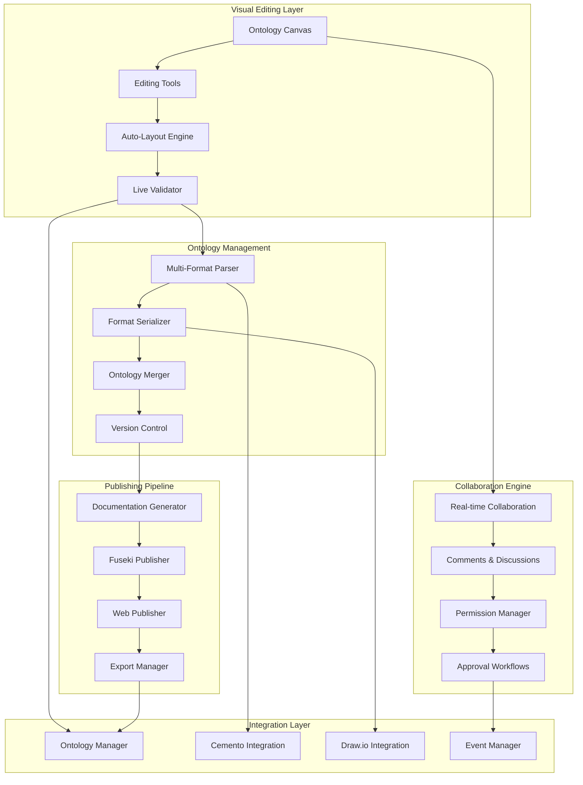
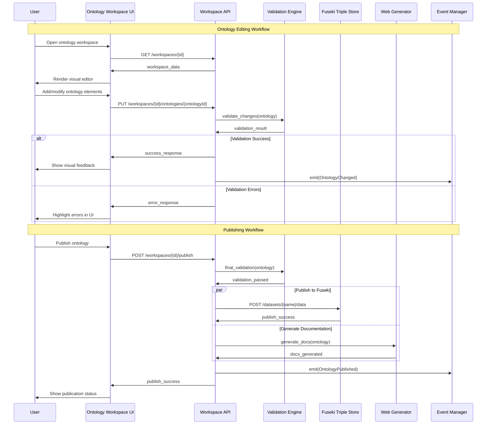
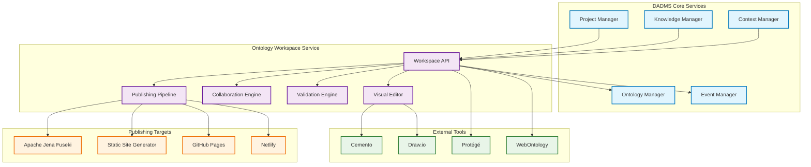
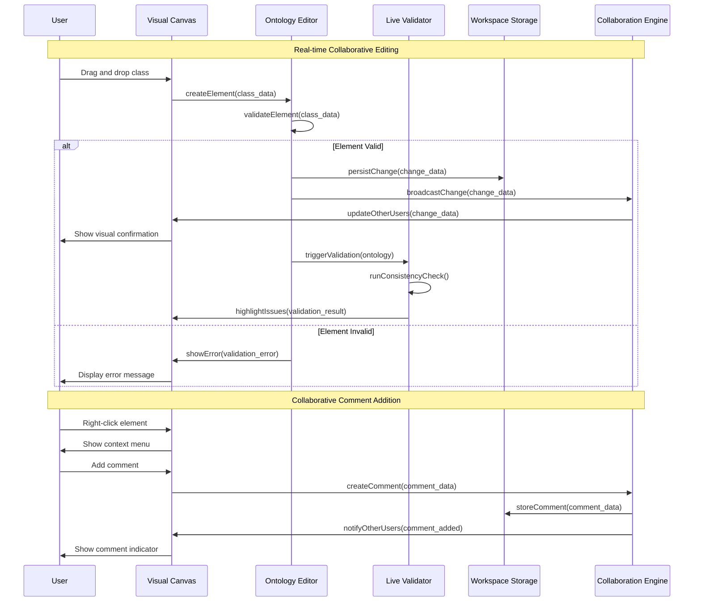
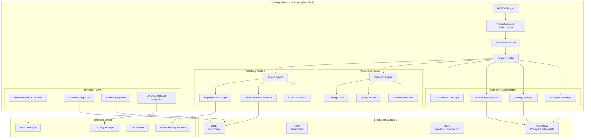

# DADMS 2.0 – Ontology Workspace Service Specification

## Executive Summary

The Ontology Workspace service provides a visual, collaborative environment for authoring, editing, and validating ontologies within the DADMS ecosystem. This service bridges the gap between automated ontology extraction (Ontology Builder) and practical ontology engineering, offering intuitive graph-based editing tools, multi-format import/export capabilities, and seamless integration with triple stores and web publishing platforms.

## 1. Purpose & Responsibilities

### 1.1 Core Purpose

The Ontology Workspace serves as the comprehensive visual ontology engineering environment, providing:

- **Visual Ontology Authoring**: Intuitive drag-and-drop interface for creating and editing ontologies
- **Standards Compliance**: Support for OWL, Turtle, RDF/XML, and ROBOT formats
- **Collaborative Editing**: Multi-user sessions with real-time collaboration and change tracking
- **Publishing Integration**: Seamless publishing to Fuseki triple stores and web documentation
- **Tool Integration**: Integration with professional ontology tools like Cemento and draw.io
- **Validation & Quality**: Live validation, consistency checking, and quality metrics

### 1.2 Key Responsibilities

#### Visual Ontology Engineering
- Provide intuitive graph-based editing interface with drag-and-drop functionality
- Support hierarchical class structures, property definitions, and relationship modeling
- Enable visual representation of complex ontological patterns and constraints
- Auto-layout algorithms for optimal ontology visualization and organization
- Color coding and grouping for different ontology components (classes, properties, individuals)

#### Multi-Format Import/Export
- Support import from OWL, Turtle, RDF/XML, ROBOT, and JSON-LD formats
- Enable export to multiple standard ontology formats with validation
- Integration with external tools (Cemento, draw.io, Protégé) for advanced editing
- Bulk import/export operations for large ontology sets
- Format conversion utilities with lossless transformation guarantees

#### Publishing & Documentation
- Generate human-readable ontology documentation (HTML, Markdown, PDF)
- Publish ontologies to Apache Jena Fuseki for SPARQL querying
- Create interactive web-based ontology browsers and explorers
- Support for ontology versioning and change documentation
- Integration with static site generators for comprehensive documentation sites

#### Collaboration & Workflow
- Real-time collaborative editing with conflict resolution
- Role-based permissions for ontology authoring and publishing
- Comment and discussion threads on ontology elements
- Change tracking, approval workflows, and audit trails
- Integration with project management and decision workflows

#### Validation & Quality Assurance
- Live ontology validation using OWL reasoners (HermiT, Pellet, ELK)
- Consistency checking and error highlighting in visual interface
- Quality metrics and best practice recommendations
- Integration with Ontology Manager for usage analytics and impact assessment
- Automated testing and continuous integration for ontology changes

## 2. Core Concepts & Data Models

### 2.1 Ontology Workspace Architecture



### 2.2 Core Data Models

#### Ontology Workspace Structure

```typescript
interface OntologyWorkspace {
  id: string;                              // Unique workspace identifier
  name: string;                            // Human-readable workspace name
  description?: string;                    // Workspace description
  project_id: string;                      // Associated DADMS project
  ontology_collection: OntologyCollection; // Collection of ontologies in workspace
  collaboration_settings: CollaborationSettings; // Collaboration configuration
  publishing_settings: PublishingSettings; // Publishing configuration
  visual_settings: VisualSettings;         // Visual appearance settings
  permissions: WorkspacePermissions;       // Access control settings
  metadata: WorkspaceMetadata;             // Additional metadata
  created_at: Date;
  updated_at: Date;
  last_published_at?: Date;
}

interface OntologyCollection {
  ontologies: Map<string, OntologyDocument>; // Map of ontology ID to document
  import_mappings: ImportMapping[];          // External ontology imports
  namespace_mappings: NamespaceMapping[];    // Namespace prefix mappings
  dependency_graph: DependencyGraph;         // Ontology dependencies
  validation_status: ValidationStatus;       // Overall validation state
}

interface OntologyDocument {
  id: string;                              // Unique ontology identifier
  uri: string;                            // Ontology URI/IRI
  version: string;                        // Ontology version
  format: OntologyFormat;                 // Source format (OWL, TTL, etc.)
  content: OntologyContent;               // Structured ontology content
  visual_layout: VisualLayout;            // Visual positioning and styling
  metadata: OntologyMetadata;             // Dublin Core and custom metadata
  validation_results: ValidationResult[]; // Validation and reasoning results
  change_history: ChangeRecord[];         // Version history and changes
  collaboration_data: CollaborationData;  // Comments, discussions, annotations
  created_at: Date;
  updated_at: Date;
}

enum OntologyFormat {
  OWL_XML = "owl_xml",
  OWL_FUNCTIONAL = "owl_functional", 
  TURTLE = "turtle",
  RDF_XML = "rdf_xml",
  JSON_LD = "json_ld",
  N_TRIPLES = "n_triples",
  N_QUADS = "n_quads",
  ROBOT = "robot"
}

interface OntologyContent {
  classes: Map<string, OWLClass>;         // OWL classes
  object_properties: Map<string, ObjectProperty>; // Object properties
  data_properties: Map<string, DataProperty>;     // Data properties
  annotation_properties: Map<string, AnnotationProperty>; // Annotation properties
  individuals: Map<string, Individual>;   // Named individuals
  axioms: OWLAxiom[];                     // Additional axioms
  imports: Import[];                      // Import declarations
  annotations: Annotation[];              // Ontology-level annotations
}

interface OWLClass {
  iri: string;                            // Class IRI
  local_name: string;                     // Local name (fragment)
  labels: LocalizedString[];              // rdfs:label annotations
  comments: LocalizedString[];            // rdfs:comment annotations
  subclass_of: string[];                  // Parent class IRIs
  equivalent_classes: string[];           // Equivalent class IRIs
  disjoint_with: string[];               // Disjoint class IRIs
  restrictions: Restriction[];            // Property restrictions
  annotations: Annotation[];              // Additional annotations
  custom_annotations: CustomAnnotation[]; // Domain-specific annotations
}

interface ObjectProperty {
  iri: string;                            // Property IRI
  local_name: string;                     // Local name
  labels: LocalizedString[];              // rdfs:label annotations
  comments: LocalizedString[];            // rdfs:comment annotations
  domain: string[];                       // Domain class IRIs
  range: string[];                        // Range class IRIs
  subproperty_of: string[];              // Parent property IRIs
  inverse_of?: string;                    // Inverse property IRI
  characteristics: PropertyCharacteristic[]; // Functional, symmetric, etc.
  annotations: Annotation[];              // Additional annotations
}

interface DataProperty {
  iri: string;                            // Property IRI
  local_name: string;                     // Local name
  labels: LocalizedString[];              // rdfs:label annotations
  comments: LocalizedString[];            // rdfs:comment annotations
  domain: string[];                       // Domain class IRIs
  range: string[];                        // Range datatype IRIs
  subproperty_of: string[];              // Parent property IRIs
  characteristics: PropertyCharacteristic[]; // Functional, etc.
  annotations: Annotation[];              // Additional annotations
}

interface Individual {
  iri: string;                            // Individual IRI
  local_name: string;                     // Local name
  types: string[];                        // Class membership (rdf:type)
  same_as: string[];                      // owl:sameAs assertions
  different_from: string[];               // owl:differentFrom assertions
  property_assertions: PropertyAssertion[]; // Property value assertions
  annotations: Annotation[];              // Additional annotations
}

interface Restriction {
  type: RestrictionType;                  // Type of restriction
  property: string;                       // Property IRI
  filler?: string;                        // Class or value filler
  cardinality?: CardinalityRestriction;   // Cardinality constraints
}

enum RestrictionType {
  SOME_VALUES_FROM = "some_values_from",     // ∃
  ALL_VALUES_FROM = "all_values_from",       // ∀
  HAS_VALUE = "has_value",                   // ∃ p.{v}
  HAS_SELF = "has_self",                     // ∃ p.Self
  MIN_CARDINALITY = "min_cardinality",       // ≥ n
  MAX_CARDINALITY = "max_cardinality",       // ≤ n
  EXACT_CARDINALITY = "exact_cardinality"    // = n
}

interface CardinalityRestriction {
  value: number;                          // Cardinality value
  qualified_class?: string;               // Qualified cardinality class
}

enum PropertyCharacteristic {
  FUNCTIONAL = "functional",
  INVERSE_FUNCTIONAL = "inverse_functional",
  TRANSITIVE = "transitive", 
  SYMMETRIC = "symmetric",
  ASYMMETRIC = "asymmetric",
  REFLEXIVE = "reflexive",
  IRREFLEXIVE = "irreflexive"
}

interface PropertyAssertion {
  property: string;                       // Property IRI
  value: AssertionValue;                  // Property value
  annotations: Annotation[];              // Assertion annotations
}

interface AssertionValue {
  type: ValueType;                        // Value type
  value: string;                          // Actual value
  datatype?: string;                      // Datatype for literals
  language?: string;                      // Language tag for literals
}

enum ValueType {
  IRI = "iri",
  LITERAL = "literal",
  BLANK_NODE = "blank_node"
}

interface LocalizedString {
  value: string;                          // String content
  language?: string;                      // Language tag (e.g., "en", "es")
}

interface Annotation {
  property: string;                       // Annotation property IRI
  value: AssertionValue;                  // Annotation value
  annotations: Annotation[];              // Nested annotations
}

interface CustomAnnotation {
  namespace: string;                      // Custom namespace
  property: string;                       // Property name
  value: any;                            // Custom value (any type)
  metadata?: Record<string, any>;         // Additional metadata
}
```

#### Visual Layout & Collaboration Models

```typescript
interface VisualLayout {
  canvas_settings: CanvasSettings;        // Canvas configuration
  node_positions: Map<string, Position>;  // Element positions
  edge_routing: Map<string, EdgeRoute>;   // Edge routing information
  groupings: VisualGroup[];              // Visual groupings
  styling: StyleDefinition[];            // Custom styling rules
  layout_algorithm?: LayoutAlgorithm;     // Auto-layout settings
}

interface CanvasSettings {
  width: number;                          // Canvas width
  height: number;                         // Canvas height
  zoom_level: number;                     // Current zoom level
  pan_position: Position;                 // Current pan position
  grid_enabled: boolean;                  // Grid visibility
  snap_to_grid: boolean;                  // Snap to grid enabled
  background_color: string;               // Canvas background
}

interface Position {
  x: number;                             // X coordinate
  y: number;                             // Y coordinate
  z?: number;                            // Z-index for layering
}

interface EdgeRoute {
  source: string;                        // Source element IRI
  target: string;                        // Target element IRI
  waypoints: Position[];                 // Intermediate waypoints
  style: EdgeStyle;                      // Edge styling
}

interface VisualGroup {
  id: string;                            // Group identifier
  name: string;                          // Group name
  members: string[];                     // Member element IRIs
  collapsed: boolean;                    // Collapse state
  style: GroupStyle;                     // Group styling
  position: Position;                    // Group position
  size: Size;                           // Group dimensions
}

interface Size {
  width: number;                         // Width
  height: number;                        // Height
}

interface StyleDefinition {
  selector: string;                      // CSS-style selector
  properties: StyleProperties;           // Style properties
  condition?: StyleCondition;            // Conditional styling
}

interface StyleProperties {
  fill_color?: string;                   // Fill color
  stroke_color?: string;                 // Stroke color
  stroke_width?: number;                 // Stroke width
  font_family?: string;                  // Font family
  font_size?: number;                    // Font size
  font_weight?: string;                  // Font weight
  opacity?: number;                      // Opacity (0-1)
  border_radius?: number;                // Border radius
  shadow?: ShadowDefinition;             // Drop shadow
}

interface ShadowDefinition {
  offset_x: number;                      // Shadow X offset
  offset_y: number;                      // Shadow Y offset
  blur_radius: number;                   // Blur radius
  color: string;                         // Shadow color
}

interface StyleCondition {
  type: ConditionType;                   // Condition type
  property: string;                      // Property to check
  operator: ComparisonOperator;          // Comparison operator
  value: any;                           // Comparison value
}

enum ConditionType {
  PROPERTY_VALUE = "property_value",
  VALIDATION_STATUS = "validation_status",
  CHANGE_STATUS = "change_status",
  ANNOTATION_PRESENCE = "annotation_presence"
}

enum ComparisonOperator {
  EQUALS = "equals",
  NOT_EQUALS = "not_equals",
  CONTAINS = "contains",
  STARTS_WITH = "starts_with",
  ENDS_WITH = "ends_with",
  REGEX_MATCH = "regex_match"
}

interface EdgeStyle {
  line_style: LineStyle;                 // Line style
  arrow_head: ArrowStyle;                // Arrow head style
  arrow_tail: ArrowStyle;                // Arrow tail style
  color: string;                         // Edge color
  width: number;                         // Edge width
  dash_pattern?: number[];               // Dash pattern for dashed lines
}

enum LineStyle {
  SOLID = "solid",
  DASHED = "dashed",
  DOTTED = "dotted",
  DOUBLE = "double"
}

enum ArrowStyle {
  NONE = "none",
  TRIANGLE = "triangle",
  DIAMOND = "diamond",
  CIRCLE = "circle",
  SQUARE = "square"
}

interface GroupStyle {
  background_color: string;              // Group background
  border_color: string;                  // Group border
  border_width: number;                  // Border width
  border_style: LineStyle;               // Border style
  corner_radius: number;                 // Corner radius
  header_style: HeaderStyle;             // Group header styling
}

interface HeaderStyle {
  background_color: string;              // Header background
  text_color: string;                    // Header text color
  font_size: number;                     // Header font size
  font_weight: string;                   // Header font weight
  height: number;                        // Header height
}

enum LayoutAlgorithm {
  HIERARCHICAL = "hierarchical",         // Tree-like layout
  FORCE_DIRECTED = "force_directed",     // Physics-based layout
  CIRCULAR = "circular",                 // Circular arrangement
  GRID = "grid",                        // Grid-based layout
  ORGANIC = "organic",                  // Organic/natural layout
  ORTHOGONAL = "orthogonal",            // Right-angle connections
  CUSTOM = "custom"                     // Custom algorithm
}

interface CollaborationData {
  comments: Comment[];                   // Comments on ontology elements
  discussions: Discussion[];             // Discussion threads
  annotations: CollaborativeAnnotation[]; // Collaborative annotations
  change_requests: ChangeRequest[];      // Proposed changes
  reviews: Review[];                     // Peer reviews
}

interface Comment {
  id: string;                            // Comment identifier
  element_iri?: string;                  // Target element IRI (if element-specific)
  author: User;                          // Comment author
  content: string;                       // Comment content
  timestamp: Date;                       // Creation timestamp
  replies: Comment[];                    // Nested replies
  status: CommentStatus;                 // Comment status
  mentions: string[];                    // Mentioned user IDs
  attachments: Attachment[];             // File attachments
}

interface Discussion {
  id: string;                            // Discussion identifier
  title: string;                         // Discussion title
  description: string;                   // Discussion description
  participants: User[];                  // Discussion participants
  comments: Comment[];                   // Discussion comments
  status: DiscussionStatus;              // Discussion status
  tags: string[];                        // Discussion tags
  created_at: Date;
  updated_at: Date;
}

interface CollaborativeAnnotation {
  id: string;                            // Annotation identifier
  element_iri: string;                   // Target element IRI
  annotation_type: AnnotationType;       // Type of annotation
  content: string;                       // Annotation content
  author: User;                          // Annotation author
  visibility: VisibilityLevel;           // Visibility level
  timestamp: Date;                       // Creation timestamp
  expires_at?: Date;                     // Expiration date
}

interface ChangeRequest {
  id: string;                            // Change request identifier
  title: string;                         // Change request title
  description: string;                   // Detailed description
  proposed_changes: ChangeOperation[];   // Proposed modifications
  author: User;                          // Change proposer
  reviewers: User[];                     // Assigned reviewers
  status: ChangeRequestStatus;           // Current status
  priority: Priority;                    // Request priority
  due_date?: Date;                       // Due date
  created_at: Date;
  updated_at: Date;
}

interface Review {
  id: string;                            // Review identifier
  change_request_id: string;             // Associated change request
  reviewer: User;                        // Reviewer
  status: ReviewStatus;                  // Review status
  comments: Comment[];                   // Review comments
  approval_level: ApprovalLevel;         // Level of approval
  submitted_at: Date;
}

enum CommentStatus {
  ACTIVE = "active",
  RESOLVED = "resolved",
  ARCHIVED = "archived"
}

enum DiscussionStatus {
  OPEN = "open",
  CLOSED = "closed",
  ARCHIVED = "archived"
}

enum AnnotationType {
  NOTE = "note",
  WARNING = "warning",
  SUGGESTION = "suggestion",
  QUESTION = "question",
  HIGHLIGHT = "highlight"
}

enum VisibilityLevel {
  PRIVATE = "private",
  TEAM = "team",
  PROJECT = "project",
  PUBLIC = "public"
}

enum ChangeRequestStatus {
  DRAFT = "draft",
  SUBMITTED = "submitted",
  UNDER_REVIEW = "under_review",
  APPROVED = "approved",
  REJECTED = "rejected",
  IMPLEMENTED = "implemented"
}

enum Priority {
  LOW = "low",
  MEDIUM = "medium",
  HIGH = "high",
  CRITICAL = "critical"
}

enum ReviewStatus {
  PENDING = "pending",
  IN_PROGRESS = "in_progress",
  COMPLETED = "completed"
}

enum ApprovalLevel {
  APPROVED = "approved",
  APPROVED_WITH_CHANGES = "approved_with_changes",
  REJECTED = "rejected"
}

interface User {
  id: string;                            // User identifier
  name: string;                          // Display name
  email: string;                         // Email address
  avatar_url?: string;                   // Avatar image URL
  role: UserRole;                        // User role
  permissions: string[];                 // Specific permissions
}

enum UserRole {
  VIEWER = "viewer",
  EDITOR = "editor",
  REVIEWER = "reviewer",
  ADMIN = "admin",
  OWNER = "owner"
}

interface Attachment {
  id: string;                            // Attachment identifier
  filename: string;                      // Original filename
  content_type: string;                  // MIME type
  size_bytes: number;                    // File size
  url: string;                          // Download URL
  uploaded_at: Date;                     // Upload timestamp
  uploaded_by: string;                   // Uploader user ID
}
```

#### Validation & Quality Models

```typescript
interface ValidationResult {
  validation_id: string;                 // Validation run identifier
  ontology_id: string;                   // Target ontology ID
  validator: ValidatorInfo;               // Validator information
  timestamp: Date;                       // Validation timestamp
  overall_status: ValidationStatus;      // Overall validation result
  consistency_check: ConsistencyResult;  // Consistency check results
  profile_compliance: ProfileCompliance[]; // OWL profile compliance
  quality_metrics: QualityMetrics;       // Quality assessment
  errors: ValidationError[];             // Validation errors
  warnings: ValidationWarning[];         // Validation warnings
  suggestions: ValidationSuggestion[];   // Improvement suggestions
  performance_metrics: ValidationPerformance; // Performance metrics
}

interface ValidatorInfo {
  name: string;                          // Validator name (HermiT, Pellet, etc.)
  version: string;                       // Validator version
  configuration: ValidatorConfig;        // Validator configuration
}

interface ValidatorConfig {
  reasoner_type: ReasonerType;           // Type of reasoner
  timeout_seconds: number;               // Reasoning timeout
  memory_limit_mb: number;               // Memory limit
  optimization_level: OptimizationLevel; // Optimization level
  additional_options: Record<string, any>; // Reasoner-specific options
}

enum ReasonerType {
  HERMIT = "hermit",
  PELLET = "pellet",
  ELK = "elk",
  FACT_PLUS_PLUS = "fact_plus_plus",
  JFACT = "jfact",
  KONCLUDE = "konclude"
}

enum OptimizationLevel {
  NONE = "none",
  BASIC = "basic",
  STANDARD = "standard",
  AGGRESSIVE = "aggressive"
}

enum ValidationStatus {
  VALID = "valid",                       // No errors found
  INVALID = "invalid",                   // Errors found
  INCONSISTENT = "inconsistent",         // Logical inconsistency
  TIMEOUT = "timeout",                   // Validation timed out
  ERROR = "error",                       // Validation failed
  UNKNOWN = "unknown"                    // Status unknown
}

interface ConsistencyResult {
  is_consistent: boolean;                // Overall consistency
  consistency_explanations: InconsistencyExplanation[]; // Explanations for inconsistencies
  unsatisfiable_classes: UnsatisfiableClass[]; // Classes that are unsatisfiable
  property_chains: PropertyChainResult[]; // Property chain analysis
}

interface InconsistencyExplanation {
  axioms: string[];                      // Axioms involved in inconsistency
  explanation: string;                   // Human-readable explanation
  suggestion: string;                    // Suggested fix
  confidence: number;                    // Confidence in explanation (0-1)
}

interface UnsatisfiableClass {
  class_iri: string;                     // Unsatisfiable class IRI
  reasons: string[];                     // Reasons for unsatisfiability
  suggested_fixes: string[];             // Suggested corrections
}

interface PropertyChainResult {
  property_iri: string;                  // Property IRI
  chain_axioms: string[];                // Property chain axioms
  issues: PropertyChainIssue[];          // Detected issues
}

interface PropertyChainIssue {
  issue_type: PropertyChainIssueType;    // Type of issue
  description: string;                   // Issue description
  severity: Severity;                    // Issue severity
}

enum PropertyChainIssueType {
  CIRCULAR_CHAIN = "circular_chain",
  INVALID_COMPOSITION = "invalid_composition",
  AMBIGUOUS_CHAIN = "ambiguous_chain"
}

interface ProfileCompliance {
  profile: OWLProfile;                   // OWL profile
  is_compliant: boolean;                 // Compliance status
  violations: ProfileViolation[];        // Profile violations
}

enum OWLProfile {
  OWL_EL = "owl_el",
  OWL_QL = "owl_ql", 
  OWL_RL = "owl_rl",
  OWL_DL = "owl_dl",
  OWL_FULL = "owl_full"
}

interface ProfileViolation {
  violation_type: ViolationType;         // Type of violation
  element_iri: string;                   // Violating element
  description: string;                   // Violation description
  suggestion: string;                    // Suggested fix
}

enum ViolationType {
  UNSUPPORTED_CONSTRUCT = "unsupported_construct",
  COMPLEX_CLASS_EXPRESSION = "complex_class_expression",
  PROPERTY_CHARACTERISTIC = "property_characteristic",
  AXIOM_TYPE = "axiom_type"
}

interface QualityMetrics {
  complexity_metrics: ComplexityMetrics; // Ontology complexity
  design_metrics: DesignMetrics;         // Design quality
  documentation_metrics: DocumentationMetrics; // Documentation quality
  reusability_metrics: ReusabilityMetrics; // Reusability assessment
  maintainability_score: number;         // Overall maintainability (0-1)
}

interface ComplexityMetrics {
  class_count: number;                   // Number of classes
  property_count: number;                // Number of properties
  individual_count: number;              // Number of individuals
  axiom_count: number;                   // Number of axioms
  max_depth: number;                     // Maximum hierarchy depth
  average_branching_factor: number;      // Average branching factor
  cyclomatic_complexity: number;         // Cyclomatic complexity
  coupling_metrics: CouplingMetrics;     // Coupling measurements
}

interface CouplingMetrics {
  afferent_coupling: number;             // Incoming dependencies
  efferent_coupling: number;             // Outgoing dependencies
  coupling_ratio: number;                // Coupling ratio
  instability: number;                   // Instability measure
}

interface DesignMetrics {
  naming_consistency: number;            // Naming consistency (0-1)
  annotation_coverage: number;           // Annotation coverage (0-1)
  hierarchy_balance: number;             // Hierarchy balance (0-1)
  modularity_score: number;              // Modularity assessment (0-1)
  redundancy_score: number;              // Redundancy detection (0-1)
}

interface DocumentationMetrics {
  label_coverage: number;                // Percentage with labels
  comment_coverage: number;              // Percentage with comments
  example_coverage: number;              // Percentage with examples
  definition_coverage: number;           // Percentage with definitions
  multilingual_support: number;          // Multilingual annotation coverage
}

interface ReusabilityMetrics {
  domain_independence: number;           // Domain independence (0-1)
  interface_quality: number;             // Interface quality (0-1)
  standard_compliance: number;           // Standards compliance (0-1)
  import_friendliness: number;           // Import friendliness (0-1)
}

interface ValidationError {
  error_id: string;                      // Error identifier
  error_type: ErrorType;                // Type of error
  severity: Severity;                    // Error severity
  element_iri?: string;                  // Associated element IRI
  message: string;                       // Error message
  detailed_explanation: string;          // Detailed explanation
  location: ErrorLocation;               // Error location
  suggested_fixes: SuggestedFix[];       // Suggested corrections
  related_errors: string[];              // Related error IDs
}

interface ValidationWarning {
  warning_id: string;                    // Warning identifier
  warning_type: WarningType;             // Type of warning
  element_iri?: string;                  // Associated element IRI
  message: string;                       // Warning message
  explanation: string;                   // Warning explanation
  impact_assessment: string;             // Potential impact
  suggested_actions: string[];           // Suggested actions
}

interface ValidationSuggestion {
  suggestion_id: string;                 // Suggestion identifier
  suggestion_type: SuggestionType;       // Type of suggestion
  element_iri?: string;                  // Associated element IRI
  title: string;                         // Suggestion title
  description: string;                   // Detailed description
  benefit: string;                       // Expected benefit
  implementation_effort: EffortLevel;    // Implementation effort
  priority: Priority;                    // Suggestion priority
  automated_fix_available: boolean;      // Whether automated fix exists
}

enum ErrorType {
  SYNTAX_ERROR = "syntax_error",
  SEMANTIC_ERROR = "semantic_error",
  LOGICAL_ERROR = "logical_error",
  CONSTRAINT_VIOLATION = "constraint_violation",
  REFERENCE_ERROR = "reference_error",
  IMPORT_ERROR = "import_error"
}

enum WarningType {
  NAMING_CONVENTION = "naming_convention",
  MISSING_ANNOTATION = "missing_annotation",
  POTENTIAL_INCONSISTENCY = "potential_inconsistency",
  PERFORMANCE_CONCERN = "performance_concern",
  DESIGN_SMELL = "design_smell",
  DEPRECATED_CONSTRUCT = "deprecated_construct"
}

enum SuggestionType {
  REFACTORING = "refactoring",
  OPTIMIZATION = "optimization",
  DOCUMENTATION = "documentation",
  STANDARDIZATION = "standardization",
  MODULARIZATION = "modularization",
  SIMPLIFICATION = "simplification"
}

enum Severity {
  INFO = "info",
  LOW = "low",
  MEDIUM = "medium",
  HIGH = "high",
  CRITICAL = "critical"
}

enum EffortLevel {
  TRIVIAL = "trivial",
  LOW = "low",
  MEDIUM = "medium",
  HIGH = "high",
  MAJOR = "major"
}

interface ErrorLocation {
  line_number?: number;                  // Line number (if applicable)
  column_number?: number;                // Column number (if applicable)
  axiom_id?: string;                     // Axiom identifier
  context: string;                       // Contextual information
}

interface SuggestedFix {
  fix_id: string;                        // Fix identifier
  title: string;                         // Fix title
  description: string;                   // Fix description
  operation: FixOperation;               // Fix operation
  automated: boolean;                    // Whether fix can be automated
  confidence: number;                    // Confidence in fix (0-1)
  preview: string;                       // Preview of changes
}

interface FixOperation {
  type: OperationType;                   // Type of operation
  target: string;                        // Target element/axiom
  parameters: Record<string, any>;       // Operation parameters
}

enum OperationType {
  ADD_AXIOM = "add_axiom",
  REMOVE_AXIOM = "remove_axiom",
  MODIFY_AXIOM = "modify_axiom",
  ADD_ANNOTATION = "add_annotation",
  REMOVE_ANNOTATION = "remove_annotation",
  RENAME_ELEMENT = "rename_element",
  CHANGE_HIERARCHY = "change_hierarchy"
}

interface ValidationPerformance {
  total_time_ms: number;                 // Total validation time
  parsing_time_ms: number;               // Parsing time
  reasoning_time_ms: number;             // Reasoning time
  consistency_time_ms: number;           // Consistency check time
  memory_used_mb: number;                // Memory usage
  cpu_usage_percent: number;             // CPU usage
}
```

#### Publishing & Integration Models

```typescript
interface PublishingSettings {
  fuseki_config: FusekiConfiguration;    // Fuseki publishing settings
  web_publishing: WebPublishingConfig;   // Web documentation settings
  export_formats: ExportConfiguration[]; // Export format settings
  automation_rules: AutomationRule[];    // Automated publishing rules
  notifications: NotificationSettings;   // Publishing notifications
}

interface FusekiConfiguration {
  server_url: string;                    // Fuseki server URL
  dataset_name: string;                  // Target dataset name
  authentication: FusekiAuth;            // Authentication settings
  update_mode: UpdateMode;               // How to handle updates
  backup_settings: BackupSettings;       // Backup configuration
  query_optimization: QueryOptimization; // Query optimization settings
}

interface FusekiAuth {
  auth_type: AuthType;                   // Authentication type
  username?: string;                     // Username (if basic auth)
  password?: string;                     // Password (if basic auth)
  api_key?: string;                      // API key (if key auth)
  certificate?: CertificateConfig;       // Certificate (if cert auth)
}

enum AuthType {
  NONE = "none",
  BASIC = "basic",
  API_KEY = "api_key",
  CERTIFICATE = "certificate",
  OAUTH2 = "oauth2"
}

interface CertificateConfig {
  cert_path: string;                     // Certificate file path
  key_path: string;                      // Private key file path
  ca_path?: string;                      // CA certificate path
}

enum UpdateMode {
  REPLACE = "replace",                   // Replace entire dataset
  MERGE = "merge",                       // Merge with existing data
  APPEND = "append",                     // Append new data only
  INCREMENTAL = "incremental"            // Incremental updates only
}

interface BackupSettings {
  enabled: boolean;                      // Whether backups are enabled
  retention_days: number;                // Backup retention period
  backup_location: string;               // Backup storage location
  compression: boolean;                  // Whether to compress backups
}

interface QueryOptimization {
  enable_caching: boolean;               // Enable query caching
  cache_size_mb: number;                 // Cache size limit
  index_optimization: boolean;           // Enable index optimization
  parallel_queries: boolean;             // Enable parallel query execution
}

interface WebPublishingConfig {
  enabled: boolean;                      // Whether web publishing is enabled
  target_platform: WebPlatform;         // Target publishing platform
  base_url: string;                      // Base URL for published content
  template_config: TemplateConfiguration; // Template configuration
  content_settings: ContentSettings;     // Content generation settings
  deployment_settings: DeploymentSettings; // Deployment configuration
}

enum WebPlatform {
  STATIC_SITE = "static_site",           // Static site generator
  GITHUB_PAGES = "github_pages",         // GitHub Pages
  NETLIFY = "netlify",                   // Netlify
  VERCEL = "vercel",                     // Vercel
  CUSTOM = "custom"                      // Custom platform
}

interface TemplateConfiguration {
  template_name: string;                 // Template name
  theme: string;                         // Theme name
  customization: TemplateCustomization;  // Template customizations
  navigation: NavigationConfig;          // Navigation configuration
  footer: FooterConfig;                  // Footer configuration
}

interface TemplateCustomization {
  primary_color: string;                 // Primary brand color
  secondary_color: string;               // Secondary brand color
  logo_url?: string;                     // Logo image URL
  favicon_url?: string;                  // Favicon URL
  custom_css?: string;                   // Custom CSS
  custom_js?: string;                    // Custom JavaScript
}

interface NavigationConfig {
  show_hierarchy: boolean;               // Show class hierarchy
  show_properties: boolean;              // Show property listings
  show_individuals: boolean;             // Show individual listings
  show_search: boolean;                  // Show search functionality
  custom_links: NavigationLink[];        // Custom navigation links
}

interface NavigationLink {
  title: string;                         // Link title
  url: string;                          // Link URL
  target: LinkTarget;                    // Link target
  icon?: string;                         // Link icon
}

enum LinkTarget {
  SAME_WINDOW = "same_window",
  NEW_WINDOW = "new_window",
  NEW_TAB = "new_tab"
}

interface FooterConfig {
  show_license: boolean;                 // Show license information
  show_version: boolean;                 // Show ontology version
  show_last_updated: boolean;            // Show last updated date
  custom_text?: string;                  // Custom footer text
  contact_info?: ContactInfo;            // Contact information
}

interface ContactInfo {
  email?: string;                        // Contact email
  website?: string;                      // Website URL
  organization?: string;                 // Organization name
}

interface ContentSettings {
  include_documentation: boolean;        // Include generated docs
  include_examples: boolean;             // Include usage examples
  include_diagrams: boolean;             // Include visual diagrams
  include_statistics: boolean;           // Include ontology statistics
  multilingual: boolean;                 // Enable multilingual content
  supported_languages: string[];        // Supported language codes
}

interface DeploymentSettings {
  auto_deploy: boolean;                  // Automatic deployment
  build_command: string;                 // Build command
  output_directory: string;              // Output directory
  environment_variables: Record<string, string>; // Environment variables
  deployment_hooks: DeploymentHook[];    // Pre/post deployment hooks
}

interface DeploymentHook {
  stage: DeploymentStage;                // Deployment stage
  command: string;                       // Command to execute
  timeout_seconds: number;               // Command timeout
  failure_behavior: FailureBehavior;     // Behavior on failure
}

enum DeploymentStage {
  PRE_BUILD = "pre_build",
  POST_BUILD = "post_build",
  PRE_DEPLOY = "pre_deploy",
  POST_DEPLOY = "post_deploy"
}

enum FailureBehavior {
  CONTINUE = "continue",
  ABORT = "abort",
  RETRY = "retry"
}

interface ExportConfiguration {
  format: OntologyFormat;                // Export format
  enabled: boolean;                      // Whether export is enabled
  output_settings: OutputSettings;       // Output configuration
  validation_settings: ValidationSettings; // Validation before export
  transformation_rules: TransformationRule[]; // Transformation rules
}

interface OutputSettings {
  filename_template: string;             // Filename template
  compression: CompressionType;          // Compression type
  encoding: string;                      // Character encoding
  line_endings: LineEndings;             // Line ending style
  pretty_print: boolean;                 // Pretty print formatting
}

enum CompressionType {
  NONE = "none",
  GZIP = "gzip",
  ZIP = "zip",
  BZIP2 = "bzip2"
}

enum LineEndings {
  LF = "lf",                            // Unix style (\n)
  CRLF = "crlf",                        // Windows style (\r\n)
  CR = "cr"                             // Classic Mac style (\r)
}

interface ValidationSettings {
  validate_before_export: boolean;       // Validate before exporting
  required_validation_level: ValidationStatus; // Minimum validation level
  block_on_errors: boolean;              // Block export on validation errors
  include_validation_report: boolean;    // Include validation report
}

interface TransformationRule {
  rule_id: string;                       // Rule identifier
  rule_type: TransformationType;         // Type of transformation
  source_pattern: string;                // Source pattern (regex/XPath)
  target_pattern: string;                // Target pattern
  conditions: TransformationCondition[]; // Application conditions
  enabled: boolean;                      // Whether rule is enabled
}

enum TransformationType {
  RENAME = "rename",                     // Rename elements
  NAMESPACE_CHANGE = "namespace_change", // Change namespace
  ANNOTATION_TRANSFORM = "annotation_transform", // Transform annotations
  STRUCTURE_CHANGE = "structure_change", // Structural changes
  FILTERING = "filtering"                // Filter elements
}

interface TransformationCondition {
  condition_type: ConditionType;         // Condition type
  field: string;                         // Field to check
  operator: ComparisonOperator;          // Comparison operator
  value: string;                         // Comparison value
}

interface AutomationRule {
  rule_id: string;                       // Rule identifier
  name: string;                          // Rule name
  description: string;                   // Rule description
  trigger: AutomationTrigger;            // Trigger condition
  actions: AutomationAction[];           // Actions to perform
  enabled: boolean;                      // Whether rule is enabled
  schedule?: ScheduleConfig;             // Schedule configuration
}

interface AutomationTrigger {
  trigger_type: TriggerType;             // Type of trigger
  conditions: TriggerCondition[];        // Trigger conditions
  cooldown_minutes?: number;             // Cooldown period
}

enum TriggerType {
  ONTOLOGY_CHANGED = "ontology_changed",
  VALIDATION_COMPLETED = "validation_completed",
  TIME_BASED = "time_based",
  MANUAL = "manual",
  EXTERNAL_EVENT = "external_event"
}

interface TriggerCondition {
  field: string;                         // Field to monitor
  operator: ComparisonOperator;          // Comparison operator
  value: string;                         // Trigger value
}

interface AutomationAction {
  action_type: ActionType;               // Type of action
  parameters: Record<string, any>;       // Action parameters
  retry_policy: RetryPolicy;             // Retry configuration
}

enum ActionType {
  PUBLISH_TO_FUSEKI = "publish_to_fuseki",
  GENERATE_DOCUMENTATION = "generate_documentation",
  SEND_NOTIFICATION = "send_notification",
  EXPORT_ONTOLOGY = "export_ontology",
  RUN_VALIDATION = "run_validation",
  TRIGGER_WORKFLOW = "trigger_workflow"
}

interface RetryPolicy {
  max_retries: number;                   // Maximum retry attempts
  retry_delay_seconds: number;           // Delay between retries
  exponential_backoff: boolean;          // Use exponential backoff
}

interface ScheduleConfig {
  schedule_type: ScheduleType;           // Type of schedule
  cron_expression?: string;              // Cron expression (if cron)
  interval_minutes?: number;             // Interval (if interval)
  specific_times?: Date[];               // Specific times (if one-time)
}

enum ScheduleType {
  CRON = "cron",
  INTERVAL = "interval",
  ONE_TIME = "one_time"
}

interface NotificationSettings {
  email_notifications: EmailNotificationConfig; // Email notifications
  webhook_notifications: WebhookNotificationConfig; // Webhook notifications
  slack_notifications: SlackNotificationConfig; // Slack notifications
}

interface EmailNotificationConfig {
  enabled: boolean;                      // Whether email notifications are enabled
  recipients: string[];                  // Email recipients
  template: EmailTemplate;               // Email template
  events: NotificationEvent[];           // Events to notify about
}

interface EmailTemplate {
  subject_template: string;              // Subject line template
  body_template: string;                 // Email body template
  format: EmailFormat;                   // Email format
}

enum EmailFormat {
  TEXT = "text",
  HTML = "html",
  MULTIPART = "multipart"
}

interface WebhookNotificationConfig {
  enabled: boolean;                      // Whether webhook notifications are enabled
  webhook_url: string;                   // Webhook URL
  authentication: WebhookAuth;           // Webhook authentication
  payload_template: string;              // Payload template
  events: NotificationEvent[];           // Events to notify about
}

interface WebhookAuth {
  auth_type: WebhookAuthType;            // Authentication type
  secret?: string;                       // Shared secret
  headers?: Record<string, string>;      // Additional headers
}

enum WebhookAuthType {
  NONE = "none",
  BEARER_TOKEN = "bearer_token",
  HMAC_SHA256 = "hmac_sha256",
  CUSTOM_HEADER = "custom_header"
}

interface SlackNotificationConfig {
  enabled: boolean;                      // Whether Slack notifications are enabled
  webhook_url: string;                   // Slack webhook URL
  channel: string;                       // Target channel
  username: string;                      // Bot username
  icon_emoji?: string;                   // Bot icon emoji
  events: NotificationEvent[];           // Events to notify about
}

enum NotificationEvent {
  ONTOLOGY_PUBLISHED = "ontology_published",
  VALIDATION_FAILED = "validation_failed",
  EXPORT_COMPLETED = "export_completed",
  COLLABORATION_ACTIVITY = "collaboration_activity",
  AUTOMATION_FAILED = "automation_failed"
}
```

### 2.3 Workspace Operations & Workflow



## 3. API Specification

### 3.1 Core Ontology Workspace Interface

```typescript
interface OntologyWorkspaceAPI {
  // Workspace Management
  createWorkspace(config: CreateWorkspaceRequest): Promise<OntologyWorkspace>;
  getWorkspace(id: string): Promise<OntologyWorkspace>;
  updateWorkspace(id: string, updates: UpdateWorkspaceRequest): Promise<void>;
  deleteWorkspace(id: string): Promise<void>;
  listWorkspaces(filter?: WorkspaceFilter): Promise<OntologyWorkspace[]>;
  
  // Ontology Management within Workspace
  addOntology(workspaceId: string, ontology: AddOntologyRequest): Promise<string>;
  getOntology(workspaceId: string, ontologyId: string): Promise<OntologyDocument>;
  updateOntology(workspaceId: string, ontologyId: string, updates: UpdateOntologyRequest): Promise<void>;
  removeOntology(workspaceId: string, ontologyId: string): Promise<void>;
  listOntologies(workspaceId: string): Promise<OntologyDocument[]>;
  
  // Import/Export Operations
  importOntology(workspaceId: string, importRequest: ImportOntologyRequest): Promise<ImportResult>;
  exportOntology(workspaceId: string, ontologyId: string, format: OntologyFormat): Promise<ExportResult>;
  exportWorkspace(workspaceId: string, options: ExportWorkspaceOptions): Promise<ExportResult>;
  
  // Visual Editing Operations
  updateVisualLayout(workspaceId: string, ontologyId: string, layout: VisualLayout): Promise<void>;
  getVisualLayout(workspaceId: string, ontologyId: string): Promise<VisualLayout>;
  autoLayout(workspaceId: string, ontologyId: string, algorithm: LayoutAlgorithm): Promise<VisualLayout>;
  applyStyle(workspaceId: string, ontologyId: string, style: StyleDefinition[]): Promise<void>;
  
  // Validation Operations
  validateOntology(workspaceId: string, ontologyId: string, options?: ValidationOptions): Promise<ValidationResult>;
  validateWorkspace(workspaceId: string, options?: ValidationOptions): Promise<ValidationResult[]>;
  getValidationHistory(workspaceId: string, ontologyId: string): Promise<ValidationResult[]>;
  
  // Collaboration Operations
  addComment(workspaceId: string, comment: AddCommentRequest): Promise<string>;
  getComments(workspaceId: string, elementIri?: string): Promise<Comment[]>;
  updateComment(workspaceId: string, commentId: string, updates: UpdateCommentRequest): Promise<void>;
  deleteComment(workspaceId: string, commentId: string): Promise<void>;
  
  createDiscussion(workspaceId: string, discussion: CreateDiscussionRequest): Promise<string>;
  getDiscussions(workspaceId: string): Promise<Discussion[]>;
  joinDiscussion(workspaceId: string, discussionId: string): Promise<void>;
  
  createChangeRequest(workspaceId: string, request: CreateChangeRequestRequest): Promise<string>;
  reviewChangeRequest(workspaceId: string, requestId: string, review: SubmitReviewRequest): Promise<void>;
  approveChangeRequest(workspaceId: string, requestId: string): Promise<void>;
  implementChangeRequest(workspaceId: string, requestId: string): Promise<void>;
  
  // Publishing Operations
  publishToFuseki(workspaceId: string, ontologyId: string, config?: FusekiConfiguration): Promise<PublishResult>;
  generateDocumentation(workspaceId: string, ontologyId: string, config?: WebPublishingConfig): Promise<DocumentationResult>;
  publishToWeb(workspaceId: string, ontologyId: string, config?: WebPublishingConfig): Promise<WebPublishResult>;
  getPublishingStatus(workspaceId: string, ontologyId: string): Promise<PublishingStatus>;
  
  // Integration Operations
  syncWithOntologyManager(workspaceId: string, ontologyId: string): Promise<SyncResult>;
  importFromCemento(workspaceId: string, cementoFile: File): Promise<ImportResult>;
  exportToDrawIO(workspaceId: string, ontologyId: string): Promise<DrawIOExport>;
  
  // Workspace Analytics
  getWorkspaceStatistics(workspaceId: string): Promise<WorkspaceStatistics>;
  getUsageAnalytics(workspaceId: string, timeRange: TimeRange): Promise<UsageAnalytics>;
  getCollaborationMetrics(workspaceId: string): Promise<CollaborationMetrics>;
}

// Supporting Request/Response Types

interface CreateWorkspaceRequest {
  name: string;
  description?: string;
  project_id: string;
  template?: WorkspaceTemplate;
  collaboration_settings?: CollaborationSettings;
  publishing_settings?: PublishingSettings;
  visual_settings?: VisualSettings;
}

interface WorkspaceTemplate {
  template_id: string;
  template_name: string;
  base_ontologies: string[];
  default_styling: StyleDefinition[];
  default_layout: LayoutAlgorithm;
}

interface UpdateWorkspaceRequest {
  name?: string;
  description?: string;
  collaboration_settings?: CollaborationSettings;
  publishing_settings?: PublishingSettings;
  visual_settings?: VisualSettings;
}

interface WorkspaceFilter {
  project_id?: string;
  name_contains?: string;
  created_after?: Date;
  created_before?: Date;
  has_ontologies?: boolean;
}

interface AddOntologyRequest {
  name: string;
  uri: string;
  version?: string;
  format?: OntologyFormat;
  content?: string;                      // Ontology content (if creating new)
  import_from?: ImportSource;            // Import from external source
}

interface ImportSource {
  source_type: ImportSourceType;
  source_url?: string;
  file_content?: string;
  cemento_project?: CementoProject;
}

enum ImportSourceType {
  URL = "url",
  FILE = "file",
  CEMENTO = "cemento",
  PROTEGE = "protege",
  DRAW_IO = "draw_io"
}

interface CementoProject {
  project_file: string;
  selected_ontologies?: string[];
}

interface UpdateOntologyRequest {
  name?: string;
  version?: string;
  content?: OntologyContent;
  visual_layout?: VisualLayout;
  metadata?: OntologyMetadata;
}

interface ImportOntologyRequest {
  source: ImportSource;
  target_workspace_id: string;
  import_options: ImportOptions;
}

interface ImportOptions {
  merge_strategy: MergeStrategy;
  namespace_handling: NamespaceHandling;
  conflict_resolution: ConflictResolution;
  preserve_visual_layout: boolean;
  import_annotations: boolean;
  import_individuals: boolean;
}

enum MergeStrategy {
  REPLACE = "replace",
  MERGE = "merge",
  CREATE_NEW = "create_new"
}

enum NamespaceHandling {
  PRESERVE = "preserve",
  REBASE = "rebase",
  PREFIX = "prefix"
}

enum ConflictResolution {
  MANUAL = "manual",
  AUTO_RESOLVE = "auto_resolve",
  PREFER_EXISTING = "prefer_existing",
  PREFER_INCOMING = "prefer_incoming"
}

interface ImportResult {
  import_id: string;
  status: ImportStatus;
  ontology_id?: string;
  conflicts: ImportConflict[];
  warnings: string[];
  statistics: ImportStatistics;
}

enum ImportStatus {
  SUCCESS = "success",
  PARTIAL_SUCCESS = "partial_success",
  FAILED = "failed",
  REQUIRES_MANUAL_RESOLUTION = "requires_manual_resolution"
}

interface ImportConflict {
  conflict_id: string;
  conflict_type: ConflictType;
  element_iri: string;
  existing_definition: string;
  incoming_definition: string;
  suggested_resolution: string;
}

enum ConflictType {
  DUPLICATE_CLASS = "duplicate_class",
  DUPLICATE_PROPERTY = "duplicate_property",
  NAMESPACE_COLLISION = "namespace_collision",
  ANNOTATION_CONFLICT = "annotation_conflict",
  STRUCTURAL_CONFLICT = "structural_conflict"
}

interface ImportStatistics {
  total_elements: number;
  imported_classes: number;
  imported_properties: number;
  imported_individuals: number;
  imported_axioms: number;
  skipped_elements: number;
  processing_time_ms: number;
}

interface ExportResult {
  export_id: string;
  format: OntologyFormat;
  file_url: string;
  file_size_bytes: number;
  checksum: string;
  expires_at: Date;
}

interface ExportWorkspaceOptions {
  include_ontologies: string[];          // Specific ontologies to include
  export_format: OntologyFormat;
  include_visual_layout: boolean;
  include_collaboration_data: boolean;
  compression: CompressionType;
}

interface ValidationOptions {
  validator: ReasonerType;
  timeout_seconds?: number;
  check_consistency: boolean;
  check_profile_compliance: boolean;
  generate_explanations: boolean;
  include_quality_metrics: boolean;
}

interface AddCommentRequest {
  element_iri?: string;
  content: string;
  comment_type: CommentType;
  visibility: VisibilityLevel;
  mentions?: string[];
}

enum CommentType {
  GENERAL = "general",
  QUESTION = "question",
  SUGGESTION = "suggestion",
  ISSUE = "issue"
}

interface UpdateCommentRequest {
  content?: string;
  status?: CommentStatus;
}

interface CreateDiscussionRequest {
  title: string;
  description: string;
  tags?: string[];
  participants?: string[];
}

interface CreateChangeRequestRequest {
  title: string;
  description: string;
  proposed_changes: ChangeOperation[];
  priority: Priority;
  due_date?: Date;
  reviewers?: string[];
}

interface ChangeOperation {
  operation_type: OperationType;
  target: string;
  parameters: Record<string, any>;
  justification: string;
}

interface SubmitReviewRequest {
  approval_level: ApprovalLevel;
  comments: string;
  suggested_modifications?: ChangeOperation[];
}

interface PublishResult {
  publish_id: string;
  status: PublishStatus;
  fuseki_dataset_url?: string;
  published_at: Date;
  statistics: PublishStatistics;
}

enum PublishStatus {
  SUCCESS = "success",
  FAILED = "failed",
  PARTIAL = "partial"
}

interface PublishStatistics {
  total_triples: number;
  published_triples: number;
  skipped_triples: number;
  processing_time_ms: number;
}

interface DocumentationResult {
  documentation_id: string;
  status: DocumentationStatus;
  output_files: DocumentationFile[];
  generated_at: Date;
}

enum DocumentationStatus {
  GENERATED = "generated",
  FAILED = "failed",
  IN_PROGRESS = "in_progress"
}

interface DocumentationFile {
  filename: string;
  content_type: string;
  file_url: string;
  file_size_bytes: number;
}

interface WebPublishResult {
  publish_id: string;
  status: WebPublishStatus;
  published_url?: string;
  deployment_log: DeploymentLogEntry[];
}

enum WebPublishStatus {
  DEPLOYED = "deployed",
  FAILED = "failed",
  IN_PROGRESS = "in_progress"
}

interface DeploymentLogEntry {
  timestamp: Date;
  level: LogLevel;
  message: string;
  details?: Record<string, any>;
}

enum LogLevel {
  DEBUG = "debug",
  INFO = "info",
  WARN = "warn",
  ERROR = "error"
}

interface PublishingStatus {
  ontology_id: string;
  last_published_at?: Date;
  fuseki_status: FusekiStatus;
  web_status: WebStatus;
  pending_changes: boolean;
}

interface FusekiStatus {
  is_published: boolean;
  dataset_url?: string;
  last_sync_at?: Date;
  triple_count?: number;
}

interface WebStatus {
  is_published: boolean;
  published_url?: string;
  last_deployment_at?: Date;
  deployment_status: WebPublishStatus;
}

interface SyncResult {
  sync_id: string;
  status: SyncStatus;
  changes_applied: ChangeOperation[];
  conflicts: SyncConflict[];
}

enum SyncStatus {
  SUCCESS = "success",
  CONFLICTS = "conflicts",
  FAILED = "failed"
}

interface SyncConflict {
  element_iri: string;
  workspace_version: string;
  manager_version: string;
  resolution_required: boolean;
}

interface DrawIOExport {
  export_id: string;
  drawio_xml: string;
  file_url: string;
  mapping_info: DrawIOMapping[];
}

interface DrawIOMapping {
  ontology_element: string;
  drawio_element_id: string;
  element_type: string;
}

interface WorkspaceStatistics {
  total_ontologies: number;
  total_classes: number;
  total_properties: number;
  total_individuals: number;
  total_axioms: number;
  validation_summary: ValidationSummary;
  collaboration_summary: CollaborationSummary;
  publishing_summary: PublishingSummary;
}

interface ValidationSummary {
  last_validation_at?: Date;
  overall_status: ValidationStatus;
  error_count: number;
  warning_count: number;
  suggestion_count: number;
}

interface CollaborationSummary {
  active_users: number;
  total_comments: number;
  open_discussions: number;
  pending_change_requests: number;
}

interface PublishingSummary {
  published_ontologies: number;
  last_publish_at?: Date;
  fuseki_datasets: number;
  web_deployments: number;
}

interface CollaborationMetrics {
  user_activity: UserActivity[];
  comment_trends: CommentTrend[];
  discussion_engagement: DiscussionEngagement[];
  change_request_metrics: ChangeRequestMetrics;
}

interface UserActivity {
  user_id: string;
  user_name: string;
  edit_count: number;
  comment_count: number;
  last_active: Date;
}

interface CommentTrend {
  date: Date;
  comment_count: number;
  resolution_rate: number;
}

interface DiscussionEngagement {
  discussion_id: string;
  participant_count: number;
  message_count: number;
  avg_response_time_hours: number;
}

interface ChangeRequestMetrics {
  total_requests: number;
  approved_requests: number;
  rejected_requests: number;
  pending_requests: number;
  avg_review_time_hours: number;
}
```

## 4. Integration Architecture

### 4.1 Service Integration Flow



### 4.2 Visual Editing Architecture



## 5. Implementation Architecture

### 5.1 Service Architecture



### 5.2 PostgreSQL Schema Design

```sql
-- Ontology Workspace Schema
CREATE SCHEMA ontology_workspace;

-- Workspaces table
CREATE TABLE ontology_workspace.workspaces (
    id UUID PRIMARY KEY DEFAULT gen_random_uuid(),
    name VARCHAR(255) NOT NULL,
    description TEXT,
    project_id VARCHAR(255) NOT NULL,
    collaboration_settings JSONB NOT NULL DEFAULT '{}',
    publishing_settings JSONB NOT NULL DEFAULT '{}',
    visual_settings JSONB NOT NULL DEFAULT '{}',
    permissions JSONB NOT NULL DEFAULT '{}',
    metadata JSONB,
    created_at TIMESTAMP WITH TIME ZONE DEFAULT NOW(),
    updated_at TIMESTAMP WITH TIME ZONE DEFAULT NOW(),
    last_published_at TIMESTAMP WITH TIME ZONE,
    
    -- Indexes for efficient querying
    CONSTRAINT workspaces_name_project_unique UNIQUE(name, project_id)
);

-- Ontologies within workspaces
CREATE TABLE ontology_workspace.ontologies (
    id UUID PRIMARY KEY DEFAULT gen_random_uuid(),
    workspace_id UUID REFERENCES ontology_workspace.workspaces(id) ON DELETE CASCADE,
    name VARCHAR(255) NOT NULL,
    uri TEXT NOT NULL,
    version VARCHAR(100) NOT NULL,
    format VARCHAR(50) NOT NULL,
    content JSONB NOT NULL,
    visual_layout JSONB,
    metadata JSONB,
    validation_status JSONB,
    collaboration_data JSONB,
    created_at TIMESTAMP WITH TIME ZONE DEFAULT NOW(),
    updated_at TIMESTAMP WITH TIME ZONE DEFAULT NOW(),
    
    CONSTRAINT ontologies_uri_workspace_unique UNIQUE(uri, workspace_id)
);

-- Validation results
CREATE TABLE ontology_workspace.validation_results (
    id UUID PRIMARY KEY DEFAULT gen_random_uuid(),
    ontology_id UUID REFERENCES ontology_workspace.ontologies(id) ON DELETE CASCADE,
    validator_name VARCHAR(100) NOT NULL,
    validator_version VARCHAR(50) NOT NULL,
    validator_config JSONB,
    validation_timestamp TIMESTAMP WITH TIME ZONE DEFAULT NOW(),
    overall_status VARCHAR(20) NOT NULL,
    consistency_result JSONB,
    profile_compliance JSONB,
    quality_metrics JSONB,
    errors JSONB,
    warnings JSONB,
    suggestions JSONB,
    performance_metrics JSONB
);

-- Comments and collaboration
CREATE TABLE ontology_workspace.comments (
    id UUID PRIMARY KEY DEFAULT gen_random_uuid(),
    workspace_id UUID REFERENCES ontology_workspace.workspaces(id) ON DELETE CASCADE,
    element_iri TEXT,
    author_id VARCHAR(255) NOT NULL,
    content TEXT NOT NULL,
    comment_type VARCHAR(50) NOT NULL DEFAULT 'general',
    status VARCHAR(20) NOT NULL DEFAULT 'active',
    visibility VARCHAR(20) NOT NULL DEFAULT 'team',
    mentions TEXT[],
    attachments JSONB,
    created_at TIMESTAMP WITH TIME ZONE DEFAULT NOW(),
    updated_at TIMESTAMP WITH TIME ZONE DEFAULT NOW()
);

-- Comment replies (self-referencing)
CREATE TABLE ontology_workspace.comment_replies (
    id UUID PRIMARY KEY DEFAULT gen_random_uuid(),
    comment_id UUID REFERENCES ontology_workspace.comments(id) ON DELETE CASCADE,
    reply_id UUID REFERENCES ontology_workspace.comments(id) ON DELETE CASCADE,
    created_at TIMESTAMP WITH TIME ZONE DEFAULT NOW(),
    
    CONSTRAINT comment_replies_no_self_reference CHECK (comment_id != reply_id)
);

-- Discussions
CREATE TABLE ontology_workspace.discussions (
    id UUID PRIMARY KEY DEFAULT gen_random_uuid(),
    workspace_id UUID REFERENCES ontology_workspace.workspaces(id) ON DELETE CASCADE,
    title VARCHAR(255) NOT NULL,
    description TEXT,
    status VARCHAR(20) NOT NULL DEFAULT 'open',
    tags TEXT[],
    created_by VARCHAR(255) NOT NULL,
    created_at TIMESTAMP WITH TIME ZONE DEFAULT NOW(),
    updated_at TIMESTAMP WITH TIME ZONE DEFAULT NOW()
);

-- Discussion participants
CREATE TABLE ontology_workspace.discussion_participants (
    id UUID PRIMARY KEY DEFAULT gen_random_uuid(),
    discussion_id UUID REFERENCES ontology_workspace.discussions(id) ON DELETE CASCADE,
    user_id VARCHAR(255) NOT NULL,
    joined_at TIMESTAMP WITH TIME ZONE DEFAULT NOW(),
    
    UNIQUE(discussion_id, user_id)
);

-- Change requests
CREATE TABLE ontology_workspace.change_requests (
    id UUID PRIMARY KEY DEFAULT gen_random_uuid(),
    workspace_id UUID REFERENCES ontology_workspace.workspaces(id) ON DELETE CASCADE,
    title VARCHAR(255) NOT NULL,
    description TEXT NOT NULL,
    proposed_changes JSONB NOT NULL,
    author_id VARCHAR(255) NOT NULL,
    status VARCHAR(20) NOT NULL DEFAULT 'draft',
    priority VARCHAR(20) NOT NULL DEFAULT 'medium',
    due_date TIMESTAMP WITH TIME ZONE,
    created_at TIMESTAMP WITH TIME ZONE DEFAULT NOW(),
    updated_at TIMESTAMP WITH TIME ZONE DEFAULT NOW()
);

-- Change request reviewers
CREATE TABLE ontology_workspace.change_request_reviewers (
    id UUID PRIMARY KEY DEFAULT gen_random_uuid(),
    change_request_id UUID REFERENCES ontology_workspace.change_requests(id) ON DELETE CASCADE,
    reviewer_id VARCHAR(255) NOT NULL,
    assigned_at TIMESTAMP WITH TIME ZONE DEFAULT NOW(),
    
    UNIQUE(change_request_id, reviewer_id)
);

-- Reviews
CREATE TABLE ontology_workspace.reviews (
    id UUID PRIMARY KEY DEFAULT gen_random_uuid(),
    change_request_id UUID REFERENCES ontology_workspace.change_requests(id) ON DELETE CASCADE,
    reviewer_id VARCHAR(255) NOT NULL,
    status VARCHAR(20) NOT NULL DEFAULT 'pending',
    approval_level VARCHAR(20),
    comments TEXT,
    suggested_modifications JSONB,
    submitted_at TIMESTAMP WITH TIME ZONE DEFAULT NOW(),
    
    UNIQUE(change_request_id, reviewer_id)
);

-- Publishing history
CREATE TABLE ontology_workspace.publishing_history (
    id UUID PRIMARY KEY DEFAULT gen_random_uuid(),
    ontology_id UUID REFERENCES ontology_workspace.ontologies(id) ON DELETE CASCADE,
    publish_type VARCHAR(50) NOT NULL, -- 'fuseki', 'web', 'export'
    target_location TEXT,
    status VARCHAR(20) NOT NULL,
    published_by VARCHAR(255) NOT NULL,
    configuration JSONB,
    statistics JSONB,
    published_at TIMESTAMP WITH TIME ZONE DEFAULT NOW()
);

-- Import/Export operations
CREATE TABLE ontology_workspace.import_export_operations (
    id UUID PRIMARY KEY DEFAULT gen_random_uuid(),
    workspace_id UUID REFERENCES ontology_workspace.workspaces(id) ON DELETE CASCADE,
    operation_type VARCHAR(20) NOT NULL, -- 'import', 'export'
    source_type VARCHAR(50), -- 'file', 'url', 'cemento', etc.
    target_format VARCHAR(50),
    status VARCHAR(20) NOT NULL,
    options JSONB,
    result_data JSONB,
    error_message TEXT,
    initiated_by VARCHAR(255) NOT NULL,
    started_at TIMESTAMP WITH TIME ZONE DEFAULT NOW(),
    completed_at TIMESTAMP WITH TIME ZONE
);

-- Collaborative annotations
CREATE TABLE ontology_workspace.collaborative_annotations (
    id UUID PRIMARY KEY DEFAULT gen_random_uuid(),
    workspace_id UUID REFERENCES ontology_workspace.workspaces(id) ON DELETE CASCADE,
    element_iri TEXT NOT NULL,
    annotation_type VARCHAR(50) NOT NULL,
    content TEXT NOT NULL,
    author_id VARCHAR(255) NOT NULL,
    visibility VARCHAR(20) NOT NULL DEFAULT 'team',
    created_at TIMESTAMP WITH TIME ZONE DEFAULT NOW(),
    expires_at TIMESTAMP WITH TIME ZONE
);

-- Real-time session tracking
CREATE TABLE ontology_workspace.active_sessions (
    id UUID PRIMARY KEY DEFAULT gen_random_uuid(),
    workspace_id UUID REFERENCES ontology_workspace.workspaces(id) ON DELETE CASCADE,
    user_id VARCHAR(255) NOT NULL,
    session_token VARCHAR(255) NOT NULL,
    last_activity TIMESTAMP WITH TIME ZONE DEFAULT NOW(),
    user_agent TEXT,
    ip_address INET,
    
    UNIQUE(workspace_id, user_id, session_token)
);

-- Workspace analytics
CREATE TABLE ontology_workspace.workspace_analytics (
    id UUID PRIMARY KEY DEFAULT gen_random_uuid(),
    workspace_id UUID REFERENCES ontology_workspace.workspaces(id) ON DELETE CASCADE,
    date DATE NOT NULL,
    metrics JSONB NOT NULL,
    
    UNIQUE(workspace_id, date)
);

-- Indexes for performance
CREATE INDEX idx_workspaces_project_id ON ontology_workspace.workspaces(project_id);
CREATE INDEX idx_workspaces_updated_at ON ontology_workspace.workspaces(updated_at);

CREATE INDEX idx_ontologies_workspace_id ON ontology_workspace.ontologies(workspace_id);
CREATE INDEX idx_ontologies_uri ON ontology_workspace.ontologies(uri);
CREATE INDEX idx_ontologies_updated_at ON ontology_workspace.ontologies(updated_at);

CREATE INDEX idx_validation_results_ontology_id ON ontology_workspace.validation_results(ontology_id);
CREATE INDEX idx_validation_results_timestamp ON ontology_workspace.validation_results(validation_timestamp);
CREATE INDEX idx_validation_results_status ON ontology_workspace.validation_results(overall_status);

CREATE INDEX idx_comments_workspace_id ON ontology_workspace.comments(workspace_id);
CREATE INDEX idx_comments_element_iri ON ontology_workspace.comments(element_iri);
CREATE INDEX idx_comments_author_id ON ontology_workspace.comments(author_id);
CREATE INDEX idx_comments_created_at ON ontology_workspace.comments(created_at);

CREATE INDEX idx_discussions_workspace_id ON ontology_workspace.discussions(workspace_id);
CREATE INDEX idx_discussions_status ON ontology_workspace.discussions(status);
CREATE INDEX idx_discussions_created_at ON ontology_workspace.discussions(created_at);

CREATE INDEX idx_change_requests_workspace_id ON ontology_workspace.change_requests(workspace_id);
CREATE INDEX idx_change_requests_status ON ontology_workspace.change_requests(status);
CREATE INDEX idx_change_requests_author_id ON ontology_workspace.change_requests(author_id);
CREATE INDEX idx_change_requests_created_at ON ontology_workspace.change_requests(created_at);

CREATE INDEX idx_publishing_history_ontology_id ON ontology_workspace.publishing_history(ontology_id);
CREATE INDEX idx_publishing_history_type ON ontology_workspace.publishing_history(publish_type);
CREATE INDEX idx_publishing_history_published_at ON ontology_workspace.publishing_history(published_at);

CREATE INDEX idx_active_sessions_workspace_id ON ontology_workspace.active_sessions(workspace_id);
CREATE INDEX idx_active_sessions_user_id ON ontology_workspace.active_sessions(user_id);
CREATE INDEX idx_active_sessions_last_activity ON ontology_workspace.active_sessions(last_activity);

-- Functions for workspace management
CREATE OR REPLACE FUNCTION ontology_workspace.update_workspace_timestamp()
RETURNS TRIGGER AS $$
BEGIN
    NEW.updated_at = NOW();
    RETURN NEW;
END;
$$ LANGUAGE plpgsql;

-- Triggers to update timestamps
CREATE TRIGGER trigger_workspaces_updated_at
    BEFORE UPDATE ON ontology_workspace.workspaces
    FOR EACH ROW
    EXECUTE FUNCTION ontology_workspace.update_workspace_timestamp();

CREATE TRIGGER trigger_ontologies_updated_at
    BEFORE UPDATE ON ontology_workspace.ontologies
    FOR EACH ROW
    EXECUTE FUNCTION ontology_workspace.update_workspace_timestamp();

-- Function to clean up expired sessions
CREATE OR REPLACE FUNCTION ontology_workspace.cleanup_expired_sessions()
RETURNS INTEGER AS $$
DECLARE
    expired_count INTEGER;
BEGIN
    DELETE FROM ontology_workspace.active_sessions 
    WHERE last_activity < NOW() - INTERVAL '24 hours';
    
    GET DIAGNOSTICS expired_count = ROW_COUNT;
    
    RETURN expired_count;
END;
$$ LANGUAGE plpgsql;

-- Function to update workspace analytics
CREATE OR REPLACE FUNCTION ontology_workspace.update_workspace_analytics(p_workspace_id UUID)
RETURNS VOID AS $$
DECLARE
    analytics_data JSONB;
BEGIN
    SELECT jsonb_build_object(
        'ontology_count', COUNT(o.id),
        'total_classes', COALESCE(SUM((o.content->>'class_count')::INTEGER), 0),
        'total_properties', COALESCE(SUM((o.content->>'property_count')::INTEGER), 0),
        'total_individuals', COALESCE(SUM((o.content->>'individual_count')::INTEGER), 0),
        'comment_count', (
            SELECT COUNT(*) FROM ontology_workspace.comments 
            WHERE workspace_id = p_workspace_id AND created_at::DATE = CURRENT_DATE
        ),
        'active_users', (
            SELECT COUNT(DISTINCT user_id) FROM ontology_workspace.active_sessions
            WHERE workspace_id = p_workspace_id AND last_activity > NOW() - INTERVAL '1 hour'
        )
    ) INTO analytics_data
    FROM ontology_workspace.ontologies o
    WHERE o.workspace_id = p_workspace_id;
    
    INSERT INTO ontology_workspace.workspace_analytics (workspace_id, date, metrics)
    VALUES (p_workspace_id, CURRENT_DATE, analytics_data)
    ON CONFLICT (workspace_id, date) 
    DO UPDATE SET metrics = analytics_data;
END;
$$ LANGUAGE plpgsql;
```

## 6. Implementation Roadmap

### Phase 1: Core Workspace Infrastructure (Weeks 1-2)
- ✅ **Foundation Setup**
  - Service skeleton and API structure
  - Database schema implementation
  - Basic workspace CRUD operations
  - Authentication and authorization

- ✅ **Visual Editor Foundation**
  - Basic canvas implementation
  - Drag-and-drop ontology element creation
  - Simple visual layout management
  - Basic import/export for OWL and Turtle formats

### Phase 2: Validation & Collaboration (Weeks 3-4)
- ✅ **Validation Engine**
  - Integration with OWL reasoners (HermiT, Pellet)
  - Live validation with error highlighting
  - Quality metrics calculation
  - Validation history and reporting

- ✅ **Collaboration Features**
  - Real-time collaborative editing
  - Comment and discussion system
  - Change request workflow
  - User presence and activity tracking

### Phase 3: Publishing & Integration (Weeks 5-6)
- ✅ **Publishing Pipeline**
  - Fuseki triple store integration
  - Web documentation generation
  - Multi-format export capabilities
  - Automated publishing workflows

- ✅ **External Tool Integration**
  - Cemento import/export
  - Draw.io integration
  - Protégé compatibility
  - Ontology Manager synchronization

### Phase 4: Advanced Features (Weeks 7-8)
- ✅ **Advanced Editing**
  - Auto-layout algorithms
  - Custom styling and theming
  - Visual grouping and organization
  - Advanced ontology patterns

- ✅ **Analytics & Optimization**
  - Workspace usage analytics
  - Collaboration metrics
  - Performance optimization
  - Quality improvement suggestions

### Success Metrics
- **Usability**: 90%+ user satisfaction with visual editing experience
- **Collaboration**: Real-time editing for 10+ concurrent users
- **Validation**: Sub-5 second validation for ontologies with <1000 classes
- **Publishing**: Automated publishing to Fuseki and web in <30 seconds
- **Integration**: Seamless import from Cemento and export to standard formats
- **Quality**: Automated detection of 80%+ common ontology design issues

This comprehensive Ontology Workspace specification provides the foundation for intuitive, collaborative ontology engineering that bridges the gap between automated extraction and practical knowledge modeling within the DADMS ecosystem. 