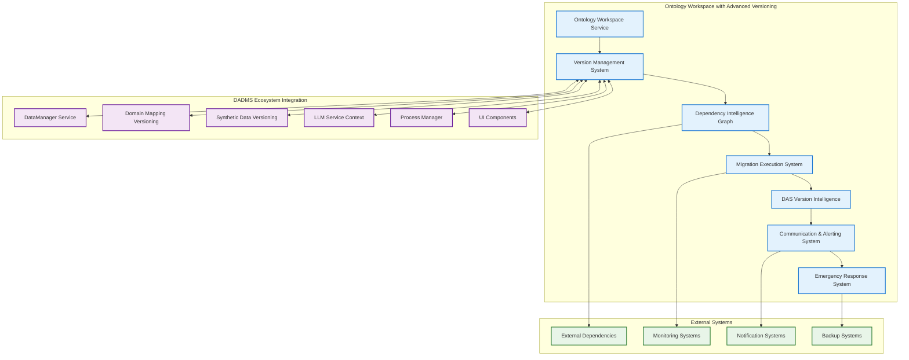

# DADMS Ontology Workspace - Comprehensive Versioning & Ripple Effect Management

## Section 7: Advanced Ontology Versioning Strategy

### 7.1 Ontology Versioning Philosophy

Managing ontology versions in DADMS requires a sophisticated approach that balances semantic evolution with system stability. Unlike simple data versioning, ontology changes can have profound cascading effects across the entire DADMS ecosystem, potentially invalidating data models, domain mappings, validation schemas, and synthetic datasets.

#### Core Versioning Principles

```typescript
interface OntologyVersioningStrategy {
  // Semantic versioning for ontologies with impact assessment
  version_strategy: SemanticVersioningStrategy;
  
  // Comprehensive dependency tracking across DADMS
  dependency_manager: OntologyDependencyManager;
  
  // Migration orchestration with compatibility bridges
  migration_engine: OntologyMigrationEngine;
  
  // DAS intelligent change management
  das_version_intelligence: DASVersionIntelligence;
  
  // Tight integration with DataManager versioning
  data_manager_integration: DataManagerVersionIntegration;
}

interface SemanticVersioningStrategy {
  version_format: string;                    // "major.minor.patch-stability.build"
  breaking_change_policies: BreakingChangePolicy[];
  backward_compatibility_rules: CompatibilityRule[];
  deprecation_timeline: DeprecationTimeline;
  release_stability_levels: StabilityLevel[];
  ecosystem_coordination: EcosystemCoordination;
}

interface BreakingChangePolicy {
  change_type: OntologyChangeType;           // Class deletion, property modification, etc.
  impact_severity: ImpactSeverity;           // Critical, major, minor
  migration_requirement: MigrationRequirement; // Automatic, assisted, manual
  notification_timeline: NotificationTimeline; // How far in advance to notify
  das_assistance_level: DASAssistanceLevel; // Level of DAS automation
}

enum OntologyChangeType {
  CLASS_DELETION = "class_deletion",
  CLASS_RENAME = "class_rename", 
  PROPERTY_DELETION = "property_deletion",
  PROPERTY_TYPE_CHANGE = "property_type_change",
  HIERARCHY_RESTRUCTURE = "hierarchy_restructure",
  NAMESPACE_CHANGE = "namespace_change",
  AXIOM_REMOVAL = "axiom_removal",
  CONSTRAINT_TIGHTENING = "constraint_tightening",
  SEMANTIC_SHIFT = "semantic_shift",
  CARDINALITY_RESTRICTION = "cardinality_restriction",
  DOMAIN_RANGE_MODIFICATION = "domain_range_modification"
}

enum ImpactSeverity {
  CRITICAL = "critical",                     // Breaks existing data/systems
  MAJOR = "major",                           // Requires updates to dependent systems
  MINOR = "minor",                           // Minor adjustments needed
  PATCH = "patch",                           // Non-breaking fixes
  ENHANCEMENT = "enhancement"                // Additive changes only
}

enum StabilityLevel {
  ALPHA = "alpha",                           // Early development, unstable
  BETA = "beta",                             // Feature complete, testing
  RELEASE_CANDIDATE = "release_candidate",   // Production ready, final testing
  STABLE = "stable",                         // Production stable
  DEPRECATED = "deprecated",                 // Marked for removal
  EOL = "end_of_life"                       // No longer supported
}
```

### 7.2 Comprehensive Dependency Tracking

Understanding what depends on an ontology is crucial for managing changes safely. The system tracks dependencies at multiple levels and provides comprehensive impact analysis across the entire DADMS ecosystem.

#### Dependency Graph Management

```typescript
interface OntologyDependencyManager {
  // Comprehensive dependency discovery
  discoverAllDependencies(ontologyId: string): Promise<ComprehensiveDependencyGraph>;
  trackCrossDomainDependencies(ontologyId: string): Promise<CrossDomainDependency[]>;
  monitorRealTimeDependencyChanges(ontologyId: string): AsyncIterable<DependencyChangeEvent>;
  
  // Advanced impact analysis
  analyzeEcosystemImpact(ontologyId: string, proposedChanges: ChangeSet): Promise<EcosystemImpactAnalysis>;
  simulateVersionUpgrade(fromVersion: string, toVersion: string): Promise<UpgradeSimulationResult>;
  predictCascadeEffects(changes: ChangeSet): Promise<CascadeEffectPrediction>;
  
  // Risk assessment and mitigation
  assessBreakingChangeRisk(changes: ChangeSet): Promise<ComprehensiveRiskAssessment>;
  identifyHighRiskDependencies(ontologyId: string): Promise<HighRiskDependency[]>;
  generateRiskMitigationPlan(riskAssessment: RiskAssessment): Promise<RiskMitigationPlan>;
}

interface ComprehensiveDependencyGraph {
  ontology_id: string;
  version: string;
  
  // Direct dependencies within DADMS
  direct_dependencies: DirectDependency[];
  
  // Indirect dependencies through other systems
  indirect_dependencies: IndirectDependency[];
  
  // Cross-domain mappings that depend on this ontology
  domain_mapping_dependencies: DomainMappingDependency[];
  
  // Data models and validation schemas
  data_model_dependencies: DataModelDependency[];
  
  // Synthetic datasets using this ontology
  synthetic_dataset_dependencies: SyntheticDatasetDependency[];
  
  // LLM contexts and reasoning systems
  llm_context_dependencies: LLMContextDependency[];
  
  // Process definitions and workflows
  process_dependencies: ProcessDependency[];
  
  // External system integrations
  external_dependencies: ExternalDependency[];
  
  // Reverse dependencies (what this ontology depends on)
  reverse_dependencies: ReverseDependency[];
  
  // Circular dependency detection
  circular_dependencies: CircularDependency[];
  
  // Dependency health and metrics
  dependency_metrics: DependencyMetrics;
}

interface DirectDependency {
  dependent_id: string;                     // ID of dependent system/ontology
  dependent_type: DependentType;            // Type of dependent
  dependency_nature: DependencyNature;      // How it's used
  usage_patterns: UsagePattern[];           // How frequently/extensively used
  criticality_level: CriticalityLevel;      // How critical this dependency is
  last_verified: Date;                      // When dependency was last verified
  contact_info: ContactInfo;                // Who to notify about changes
  auto_migration_possible: boolean;         // Can changes be automatically migrated
  migration_complexity: MigrationComplexity; // How complex migration would be
}

enum DependentType {
  DATA_MANAGER_MAPPING = "data_manager_mapping",
  SYNTHETIC_DATASET = "synthetic_dataset", 
  DOMAIN_MAPPING = "domain_mapping",
  VALIDATION_SCHEMA = "validation_schema",
  LLM_CONTEXT = "llm_context",
  PROCESS_DEFINITION = "process_definition",
  USER_INTERFACE = "user_interface",
  EXTERNAL_SYSTEM = "external_system",
  CHILD_ONTOLOGY = "child_ontology",
  REASONING_ENGINE = "reasoning_engine",
  CLASSIFICATION_MODEL = "classification_model",
  SEARCH_INDEX = "search_index"
}

enum DependencyNature {
  SCHEMA_VALIDATION = "schema_validation",   // Uses ontology for validation
  SEMANTIC_MAPPING = "semantic_mapping",     // Uses for cross-domain mapping
  CONCEPT_DEFINITION = "concept_definition", // Relies on concept definitions
  RELATIONSHIP_MODEL = "relationship_model", // Uses relationship patterns
  CONSTRAINT_ENFORCEMENT = "constraint_enforcement", // Enforces ontology constraints
  INFERENCE_RULES = "inference_rules",       // Uses for reasoning
  CLASSIFICATION = "classification",         // Uses for data classification
  SEARCH_ENHANCEMENT = "search_enhancement", // Enhances search with semantics
  WORKFLOW_SEMANTICS = "workflow_semantics", // Provides workflow semantic context
  UI_GENERATION = "ui_generation",          // Generates UI elements from ontology
  API_DOCUMENTATION = "api_documentation"   // Documents APIs using ontology
}

interface EcosystemImpactAnalysis {
  analysis_id: string;
  ontology_id: string;
  analyzed_changes: ChangeSet;
  overall_ecosystem_impact_score: number;   // 0-1 scale
  
  // Detailed impact breakdown by system
  data_manager_impacts: DataManagerImpact[];
  domain_mapping_impacts: DomainMappingImpact[];
  synthetic_data_impacts: SyntheticDataImpact[];
  llm_context_impacts: LLMContextImpact[];
  process_impacts: ProcessImpact[];
  ui_impacts: UIImpact[];
  external_system_impacts: ExternalSystemImpact[];
  
  // Cross-system cascade analysis
  cascade_effects: CascadeEffect[];
  critical_path_analysis: CriticalPathAnalysis;
  
  // Migration requirements and complexity
  migration_complexity: EcosystemMigrationComplexity;
  estimated_migration_effort: EcosystemEffortEstimate;
  
  // Risk assessment
  ecosystem_risk_assessment: EcosystemRiskAssessment;
  mitigation_recommendations: EcosystemMitigationRecommendation[];
  
  // DAS recommendations and guidance
  das_ecosystem_guidance: DASEcosystemGuidance;
}
```

### 7.3 DAS-Assisted Change Management

The Digital Assistance System provides intelligent guidance for managing ontology changes, minimizing disruption while enabling semantic evolution across the entire DADMS ecosystem.

#### DAS Version Intelligence

```typescript
interface DASVersionIntelligence {
  // Advanced change impact prediction
  predictEcosystemImpact(ontologyId: string, proposedChanges: ChangeSet): Promise<DASEcosystemImpactPrediction>;
  
  // Intelligent migration strategy generation
  generateOptimalMigrationStrategy(fromVersion: string, toVersion: string, constraints: MigrationConstraints): Promise<DASMigrationStrategy>;
  
  // Proactive risk mitigation
  suggestProactiveRiskMitigations(riskAssessment: RiskAssessment): Promise<DASMitigationPlan>;
  
  // Intelligent communication assistance
  generateStakeholderCommunications(impact: ImpactAnalysisResult): Promise<DASCommunicationPlan>;
  
  // Emergency response and rollback
  planEmergencyResponse(version: OntologyVersion, emergencyType: EmergencyType): Promise<DASEmergencyPlan>;
  
  // Continuous learning from outcomes
  learnFromMigrationOutcomes(migrationId: string, actualOutcome: MigrationOutcome): Promise<LearningUpdate>;
  
  // Predictive maintenance for ontologies
  predictMaintenanceNeeds(ontologyId: string): Promise<MaintenancePrediction>;
}

interface DASEcosystemImpactPrediction {
  prediction_id: string;
  confidence: number;                        // 0-1 confidence in prediction
  prediction_accuracy_history: number;      // DAS track record on similar predictions
  
  // Comprehensive impact predictions
  predicted_impacts: PredictedEcosystemImpact[];
  hidden_dependencies: HiddenDependency[];   // Dependencies not in explicit graph
  cascade_effects: CascadeEffect[];          // Secondary effects of changes
  timing_recommendations: TimingRecommendation[];
  alternative_approaches: AlternativeApproach[];
  
  // Resource and effort predictions
  predicted_migration_effort: PredictedEffort;
  predicted_downtime: PredictedDowntime;
  predicted_resource_requirements: PredictedResources;
  
  // Success probability assessment
  migration_success_probability: number;    // 0-1 probability of successful migration
  risk_factors: RiskFactor[];               // Factors that could cause failure
  success_enablers: SuccessEnabler[];       // Factors that increase success probability
  
  // DAS confidence and reasoning
  das_reasoning: DASReasoning;
  confidence_intervals: ConfidenceInterval[];
}

interface PredictedEcosystemImpact {
  system_id: string;
  system_type: DependentType;
  impact_probability: number;               // 0-1 probability of impact
  impact_severity: ImpactSeverity;
  impact_description: string;
  estimated_recovery_time: Duration;
  automatic_mitigation_available: boolean;
  
  // DAS reasoning
  confidence_factors: string[];             // What makes DAS confident in this prediction
  uncertainty_factors: string[];           // Sources of uncertainty
  historical_analogies: HistoricalAnalogy[]; // Similar past situations
  monitoring_recommendations: string[];    // How to verify prediction
}

interface HiddenDependency {
  dependency_id: string;
  dependent_system: string;
  dependency_type: HiddenDependencyType;
  discovery_confidence: number;             // How confident DAS is this exists
  discovery_method: DiscoveryMethod;        // How DAS found this dependency
  validation_steps: ValidationStep[];      // Steps to verify this dependency
  potential_impact: PredictedEcosystemImpact;
  recommended_investigation: InvestigationRecommendation;
}

enum HiddenDependencyType {
  IMPLICIT_SCHEMA_DEPENDENCY = "implicit_schema_dependency",
  TRANSITIVE_MAPPING = "transitive_mapping",
  CACHED_INFERENCE_RESULTS = "cached_inference_results",
  DERIVED_VALIDATION_RULES = "derived_validation_rules",
  EMERGENT_USE_PATTERN = "emergent_use_pattern",
  HISTORICAL_DATA_STRUCTURE = "historical_data_structure",
  ALGORITHMIC_DEPENDENCY = "algorithmic_dependency",
  USER_WORKFLOW_DEPENDENCY = "user_workflow_dependency",
  INTEGRATION_ASSUMPTION = "integration_assumption"
}

interface DASMigrationStrategy {
  strategy_id: string;
  strategy_type: MigrationStrategyType;
  
  // Intelligent migration approach
  migration_approach: IntelligentMigrationApproach;
  phased_rollout: OptimizedPhasedRollout;
  risk_mitigation: ProactiveRiskMitigation;
  communication_plan: IntelligentCommunicationPlan;
  
  // Success optimization
  success_metrics: SuccessMetric[];
  optimization_recommendations: OptimizationRecommendation[];
  contingency_plans: IntelligentContingencyPlan[];
  
  // Resource optimization
  resource_optimization: ResourceOptimization;
  timeline_optimization: TimelineOptimization;
  
  // DAS assistance throughout migration
  das_assistance_plan: DASAssistancePlan;
  automated_monitoring: AutomatedMonitoring;
  adaptive_adjustments: AdaptiveAdjustment[];
}

enum MigrationStrategyType {
  GRADUAL_PARALLEL = "gradual_parallel",    // Run versions in parallel, migrate gradually
  COMPATIBILITY_BRIDGE = "compatibility_bridge", // Use adapters to bridge versions
  COORDINATED_ECOSYSTEM = "coordinated_ecosystem", // Coordinate across all systems
  EXPERIMENTAL_VALIDATION = "experimental_validation", // Validate in isolated environment first
  ROLLBACK_READY = "rollback_ready",        // Ready for instant rollback if needed
  MINIMAL_DISRUPTION = "minimal_disruption" // Minimize any service disruption
}
```

### 7.4 Migration Orchestration Engine

Sophisticated migration orchestration that coordinates changes across the entire DADMS ecosystem while maintaining system stability.

#### Advanced Migration Management

```typescript
interface OntologyMigrationEngine {
  // Comprehensive migration planning
  planEcosystemMigration(fromVersion: string, toVersion: string, requirements: EcosystemMigrationRequirements): Promise<EcosystemMigrationPlan>;
  
  // Coordinated migration execution
  executeCoordinatedMigration(migrationPlan: EcosystemMigrationPlan): Promise<EcosystemMigrationResult>;
  
  // Real-time migration monitoring and adjustment
  monitorMigrationProgress(migrationId: string): AsyncIterable<MigrationProgressUpdate>;
  adjustMigrationStrategy(migrationId: string, adjustments: MigrationAdjustment[]): Promise<AdjustmentResult>;
  
  // Advanced data migration assistance
  generateEcosystemMigrationScripts(changes: ChangeSet): Promise<EcosystemMigrationScript[]>;
  
  // Cross-system mapping updates
  orchestrateMappingUpdates(ontologyChanges: ChangeSet): Promise<MappingUpdateOrchestrationResult>;
  
  // Validation and quality assurance
  validateMigrationReadiness(migrationPlan: EcosystemMigrationPlan): Promise<ReadinessAssessment>;
  performPostMigrationValidation(migrationResult: EcosystemMigrationResult): Promise<PostMigrationValidation>;
  
  // Emergency response and rollback
  executeEmergencyRollback(migrationId: string, rollbackReason: RollbackReason): Promise<EmergencyRollbackResult>;
  createRecoveryPlan(failedMigration: FailedMigration): Promise<RecoveryPlan>;
}

interface EcosystemMigrationPlan {
  plan_id: string;
  from_version: string;
  to_version: string;
  migration_strategy: EcosystemMigrationStrategy;
  
  // Comprehensive migration phases
  pre_migration_preparation: PreparationPhase[];
  core_migration_phases: CoreMigrationPhase[];
  post_migration_validation: ValidationPhase[];
  cleanup_phases: CleanupPhase[];
  
  // Cross-system coordination
  system_coordination: SystemCoordination[];
  dependency_resolution: DependencyResolution[];
  synchronization_points: SynchronizationPoint[];
  
  // Advanced risk management
  risk_assessment: EcosystemRiskAssessment;
  mitigation_strategies: MitigationStrategy[];
  contingency_plans: ContingencyPlan[];
  rollback_strategies: RollbackStrategy[];
  
  // Resource and timeline management
  resource_requirements: EcosystemResourceRequirement[];
  timeline_constraints: TimelineConstraint[];
  critical_path: CriticalPath[];
  
  // Quality assurance
  validation_gates: ValidationGate[];
  success_criteria: SuccessCriteria[];
  quality_checkpoints: QualityCheckpoint[];
  
  // DAS assistance and monitoring
  das_guidance: DASMigrationGuidance;
  automated_monitoring: AutomatedMonitoring;
  adaptive_capabilities: AdaptiveCapability[];
}

interface CoreMigrationPhase {
  phase_id: string;
  phase_name: string;
  phase_type: MigrationPhaseType;
  description: string;
  
  // Target systems and scope
  target_systems: TargetSystem[];
  migration_scope: MigrationScope;
  
  // Execution details
  automation_level: AutomationLevel;
  execution_order: number;
  estimated_duration: Duration;
  resource_requirements: PhaseResourceRequirement[];
  
  // Dependencies and prerequisites
  prerequisites: Prerequisite[];
  dependencies: PhaseDependency[];
  parallel_execution_possible: boolean;
  
  // Safety and validation
  validation_criteria: ValidationCriteria[];
  rollback_procedure: RollbackProcedure;
  success_indicators: SuccessIndicator[];
  failure_indicators: FailureIndicator[];
  
  // DAS assistance
  das_guidance: PhaseDASGuidance;
  automated_monitoring: PhaseMonitoring;
  adaptive_adjustments: PhaseAdaptiveAdjustment[];
}

enum MigrationPhaseType {
  PREPARATION = "preparation",               // Setup and validation
  COMPATIBILITY_BRIDGE_DEPLOYMENT = "compatibility_bridge_deployment", // Deploy compatibility adapters
  PILOT_MIGRATION = "pilot_migration",       // Small-scale testing
  INCREMENTAL_ROLLOUT = "incremental_rollout", // Gradual deployment
  FULL_ECOSYSTEM_DEPLOYMENT = "full_ecosystem_deployment", // Complete migration
  CROSS_SYSTEM_VALIDATION = "cross_system_validation", // Validate across systems
  PERFORMANCE_VALIDATION = "performance_validation", // Performance testing
  CLEANUP_AND_OPTIMIZATION = "cleanup_and_optimization" // Remove old versions and optimize
}

enum AutomationLevel {
  FULLY_AUTOMATED = "fully_automated",      // No human intervention required
  SEMI_AUTOMATED = "semi_automated",        // Human approval/supervision required
  HUMAN_GUIDED = "human_guided",            // DAS guides human execution
  MANUAL = "manual",                        // Manual execution required
  EMERGENCY_MANUAL = "emergency_manual"     // Manual intervention for emergencies
}
```

### 7.5 Seamless DataManager Integration

Tight integration with DataManager versioning ensures coherent version management across the entire DADMS ecosystem.

#### Synchronized Ecosystem Versioning

```typescript
interface DataManagerVersionIntegration {
  // Comprehensive version synchronization
  synchronizeEcosystemVersions(ontologyVersion: OntologyVersion): Promise<EcosystemSynchronizationResult>;
  
  // Bidirectional impact propagation
  propagateOntologyChangesToData(ontologyChanges: ChangeSet): Promise<DataPropagationResult>;
  propagateDataChangesToOntology(dataChanges: DataChangeSet): Promise<OntologyPropagationResult>;
  
  // Cross-system dependency tracking
  trackOntologyDataDependencies(ontologyId: string): Promise<OntologyDataDependency[]>;
  trackDataOntologyDependencies(datasetId: string): Promise<DataOntologyDependency[]>;
  
  // Coordinated migration planning
  planJointEcosystemMigration(ontologyChanges: ChangeSet, dataChanges: DataChangeSet): Promise<JointEcosystemMigrationPlan>;
  
  // Cross-system consistency validation
  validateEcosystemConsistency(ontologyVersion: string, dataVersion: string): Promise<EcosystemConsistencyReport>;
  
  // Joint rollback and recovery
  executeJointRollback(ontologyRollback: OntologyRollback, dataRollback: DataRollback): Promise<JointRollbackResult>;
}

interface EcosystemSynchronizationResult {
  sync_id: string;
  sync_timestamp: Date;
  ontology_version: string;
  
  // Synchronized system versions
  data_manager_versions: DataManagerVersionReference[];
  domain_mapping_versions: DomainMappingVersionReference[];
  synthetic_dataset_versions: SyntheticDatasetVersionReference[];
  validation_schema_versions: ValidationSchemaVersionReference[];
  llm_context_versions: LLMContextVersionReference[];
  process_definition_versions: ProcessDefinitionVersionReference[];
  
  // Synchronization status and results
  sync_status: EcosystemSynchronizationStatus;
  sync_conflicts: EcosystemSyncConflict[];
  resolution_actions: EcosystemResolutionAction[];
  
  // Impact tracking across systems
  affected_systems: AffectedSystemReference[];
  notification_sent: EcosystemNotificationReference[];
  performance_impact: SynchronizationPerformanceImpact;
  
  // Quality assurance
  consistency_validation: EcosystemConsistencyValidation;
  integrity_checks: EcosystemIntegrityCheck[];
}

interface JointEcosystemMigrationPlan {
  plan_id: string;
  
  // Coordinated migration components
  ontology_migration: OntologyMigrationPlan;
  data_manager_migration: DataManagerMigrationPlan;
  domain_mapping_migration: DomainMappingMigrationPlan;
  synthetic_data_migration: SyntheticDataMigrationPlan;
  validation_migration: ValidationMigrationPlan;
  
  // Sophisticated coordination
  migration_coordination: EcosystemMigrationCoordination;
  dependency_resolution: EcosystemDependencyResolution;
  synchronization_points: EcosystemSynchronizationPoint[];
  
  // Comprehensive risk management
  joint_risk_assessment: JointEcosystemRiskAssessment;
  contingency_planning: EcosystemContingencyPlanning;
  recovery_strategies: EcosystemRecoveryStrategy[];
  
  // Advanced DAS orchestration
  das_orchestration: DASEcosystemOrchestration;
  intelligent_monitoring: IntelligentEcosystemMonitoring;
  adaptive_optimization: AdaptiveEcosystemOptimization;
}

interface EcosystemMigrationCoordination {
  coordination_strategy: EcosystemCoordinationStrategy;
  timing_constraints: EcosystemTimingConstraint[];
  resource_sharing: EcosystemResourceSharing[];
  conflict_resolution: EcosystemConflictResolution[];
  communication_protocol: EcosystemCommunicationProtocol;
  
  // Advanced coordination features
  load_balancing: MigrationLoadBalancing;
  priority_management: MigrationPriorityManagement;
  bottleneck_resolution: BottleneckResolution[];
}

enum EcosystemCoordinationStrategy {
  SEQUENTIAL_ORDERED = "sequential_ordered",     // Strict order: ontology → data → mappings → synthetic
  PARALLEL_COORDINATED = "parallel_coordinated", // Simultaneous with coordination points
  DEPENDENCY_DRIVEN = "dependency_driven",       // Based on actual dependency graph
  ADAPTIVE_DYNAMIC = "adaptive_dynamic",         // DAS adjusts strategy in real-time
  RISK_MINIMIZED = "risk_minimized",            // Prioritize risk minimization
  PERFORMANCE_OPTIMIZED = "performance_optimized" // Optimize for speed and efficiency
}
```

### 7.6 Intelligent Stakeholder Communication

DAS assists in proactive communication and change management across all stakeholders in the DADMS ecosystem.

#### Advanced Communication Management

```typescript
interface DASCommunicationAssistant {
  // Intelligent stakeholder identification
  identifyAllAffectedStakeholders(ontologyChanges: ChangeSet): Promise<ComprehensiveStakeholderMap>;
  
  // Personalized communication generation
  generatePersonalizedCommunications(changes: ChangeSet, impact: ImpactAnalysisResult): Promise<PersonalizedCommunication[]>;
  
  // Proactive change management
  createChangeManagementPlan(changes: ChangeSet): Promise<ChangeManagementPlan>;
  
  // Real-time progress communication
  generateRealTimeProgressUpdates(migrationPlan: MigrationPlan, currentStatus: MigrationStatus): Promise<ProgressUpdate[]>;
  
  // Issue and incident communication
  generateIncidentCommunications(issues: MigrationIssue[]): Promise<IncidentCommunication[]>;
  
  // Success and completion communication
  generateSuccessCommunications(migrationResult: MigrationResult): Promise<SuccessCommunication[]>;
  
  // Feedback collection and analysis
  collectStakeholderFeedback(communicationId: string): Promise<StakeholderFeedback[]>;
  analyzeCommuncationEffectiveness(communicationCampaign: CommunicationCampaign): Promise<EffectivenessAnalysis>;
}

interface ComprehensiveStakeholderMap {
  stakeholder_ecosystem: StakeholderEcosystem;
  communication_preferences: EcosystemCommunicationPreference[];
  escalation_hierarchies: EscalationHierarchy[];
  decision_authorities: DecisionAuthority[];
  technical_expertise_levels: TechnicalExpertiseMap;
  
  // Advanced stakeholder analytics
  influence_network: InfluenceNetwork;
  communication_effectiveness_history: CommunicationHistory[];
  change_resistance_factors: ChangeResistanceFactor[];
}

interface StakeholderEcosystem {
  // Technical stakeholders
  data_science_teams: DataScienceTeam[];
  system_administrators: SystemAdministrator[];
  application_developers: ApplicationDeveloper[];
  ontology_engineers: OntologyEngineer[];
  quality_assurance_teams: QATeam[];
  
  // Business stakeholders
  business_analysts: BusinessAnalyst[];
  domain_experts: DomainExpert[];
  product_managers: ProductManager[];
  project_managers: ProjectManager[];
  
  // Leadership and governance
  technical_leadership: TechnicalLeader[];
  business_leadership: BusinessLeader[];
  governance_committees: GovernanceCommittee[];
  
  // End users and consumers
  end_users: EndUser[];
  external_consumers: ExternalConsumer[];
  integration_partners: IntegrationPartner[];
}

interface PersonalizedCommunication {
  communication_id: string;
  recipient: Stakeholder;
  communication_type: CommunicationType;
  
  // Personalized content
  personalized_summary: string;
  relevant_impacts: RelevantImpact[];
  specific_actions_required: SpecificAction[];
  customized_timeline: CustomizedTimeline;
  personalized_risk_assessment: PersonalizedRiskAssessment;
  
  // Support and resources
  relevant_documentation: DocumentationReference[];
  suggested_training: TrainingRecommendation[];
  support_contacts: SupportContact[];
  escalation_paths: EscalationPath[];
  
  // DAS assistance
  das_recommendations: DASStakeholderRecommendation[];
  automated_support_available: AutomatedSupport[];
  follow_up_schedule: FollowUpSchedule;
}

enum CommunicationType {
  ADVANCE_NOTIFICATION = "advance_notification",    // Early warning of upcoming changes
  IMPACT_BRIEFING = "impact_briefing",             // Detailed impact analysis
  ACTION_REQUIRED = "action_required",             // Specific actions needed
  PROGRESS_UPDATE = "progress_update",             // Migration progress updates
  ISSUE_ALERT = "issue_alert",                     // Problems detected
  SUCCESS_CONFIRMATION = "success_confirmation",   // Successful completion
  TRAINING_INVITATION = "training_invitation",     // Training opportunities
  FEEDBACK_REQUEST = "feedback_request"            // Request for feedback
}
```

### 7.7 Emergency Response and Rollback

Comprehensive emergency response capabilities for when ontology changes cause unexpected issues across the ecosystem.

#### Emergency Management System

```typescript
interface EmergencyResponseSystem {
  // Emergency detection and classification
  detectEmergencyConditions(monitoringData: MonitoringData): Promise<EmergencyDetection>;
  classifyEmergencyType(emergencyCondition: EmergencyCondition): Promise<EmergencyClassification>;
  
  // Immediate response coordination
  initiateEmergencyResponse(emergency: EmergencyClassification): Promise<EmergencyResponse>;
  coordinateEmergencyActions(response: EmergencyResponse): Promise<EmergencyActionResult>;
  
  // Intelligent rollback orchestration
  planIntelligentRollback(emergency: EmergencyClassification): Promise<IntelligentRollbackPlan>;
  executeEmergencyRollback(rollbackPlan: IntelligentRollbackPlan): Promise<EmergencyRollbackResult>;
  
  // Recovery and stabilization
  orchestrateRecovery(rollbackResult: EmergencyRollbackResult): Promise<RecoveryOrchestration>;
  validateSystemStabilization(recovery: RecoveryOrchestration): Promise<StabilizationValidation>;
  
  // Post-incident analysis and learning
  conductPostIncidentAnalysis(incident: EmergencyIncident): Promise<PostIncidentAnalysis>;
  updateEmergencyProcedures(learnings: PostIncidentAnalysis): Promise<ProcedureUpdate>;
}

interface EmergencyClassification {
  emergency_id: string;
  emergency_type: EmergencyType;
  severity_level: EmergencySeverityLevel;
  scope_of_impact: EmergencyScopeOfImpact;
  
  // Affected systems and components
  affected_systems: AffectedSystemInEmergency[];
  critical_systems_impacted: CriticalSystemImpact[];
  data_integrity_risks: DataIntegrityRisk[];
  
  // Response requirements
  immediate_action_required: ImmediateAction[];
  stakeholder_notification_urgency: NotificationUrgency;
  escalation_requirements: EscalationRequirement[];
  
  // DAS emergency analysis
  das_emergency_analysis: DASEmergencyAnalysis;
  automated_response_available: AutomatedEmergencyResponse[];
  manual_intervention_required: ManualInterventionRequirement[];
}

enum EmergencyType {
  ONTOLOGY_CORRUPTION = "ontology_corruption",              // Ontology data corrupted
  MASSIVE_VALIDATION_FAILURE = "massive_validation_failure", // Widespread validation failures
  DEPENDENCY_CASCADE_FAILURE = "dependency_cascade_failure", // Cascade failure across systems
  DATA_INCONSISTENCY_CRISIS = "data_inconsistency_crisis",  // Major data inconsistencies
  PERFORMANCE_DEGRADATION = "performance_degradation",       // Severe performance issues
  SECURITY_COMPROMISE = "security_compromise",               // Security breach related to changes
  MIGRATION_FAILURE = "migration_failure",                   // Migration process failed
  ROLLBACK_FAILURE = "rollback_failure"                     // Rollback attempt failed
}

enum EmergencySeverityLevel {
  CRITICAL = "critical",                 // System down, immediate action required
  HIGH = "high",                        // Major functionality impacted
  MEDIUM = "medium",                    // Significant but contained impact
  LOW = "low"                          // Minor issues with workarounds available
}

interface IntelligentRollbackPlan {
  rollback_id: string;
  emergency_reference: string;
  rollback_strategy: RollbackStrategy;
  
  // Comprehensive rollback phases
  immediate_stabilization: ImmediateStabilizationPhase[];
  systematic_rollback: SystematicRollbackPhase[];
  data_recovery: DataRecoveryPhase[];
  validation_and_verification: ValidationPhase[];
  
  // Risk mitigation during rollback
  rollback_risk_assessment: RollbackRiskAssessment;
  risk_mitigation_actions: RollbackRiskMitigation[];
  
  // Communication during emergency
  emergency_communication_plan: EmergencyCommunicationPlan;
  stakeholder_updates: EmergencyStakeholderUpdate[];
  
  // DAS emergency assistance
  das_emergency_guidance: DASEmergencyGuidance;
  automated_recovery_actions: AutomatedRecoveryAction[];
}
```

### 7.8 Enhanced API Interface

```typescript
// Comprehensive enhanced Ontology Workspace API with advanced versioning
interface AdvancedOntologyWorkspaceAPI extends OntologyWorkspaceAPI {
  // Advanced Ontology Versioning
  createAdvancedOntologyVersion(workspaceId: string, ontologyId: string, versionData: AdvancedVersionRequest): Promise<OntologyVersion>;
  getComprehensiveVersionHistory(workspaceId: string, ontologyId: string, filters?: AdvancedVersionFilters): Promise<ComprehensiveVersionHistory>;
  compareVersionsWithImpactAnalysis(workspaceId: string, ontologyId: string, fromVersion: string, toVersion: string): Promise<AdvancedVersionComparison>;
  
  // Ecosystem Impact Analysis
  analyzeEcosystemImpact(workspaceId: string, ontologyId: string, proposedChanges: ChangeSet): Promise<EcosystemImpactAnalysis>;
  getComprehensiveDependencyGraph(workspaceId: string, ontologyId: string): Promise<ComprehensiveDependencyGraph>;
  predictEcosystemEffects(workspaceId: string, ontologyId: string, changes: ChangeSet): Promise<DASEcosystemImpactPrediction>;
  discoverHiddenDependencies(workspaceId: string, ontologyId: string): Promise<HiddenDependency[]>;
  
  // Advanced Migration Management
  planEcosystemMigration(workspaceId: string, ontologyId: string, fromVersion: string, toVersion: string, requirements: EcosystemMigrationRequirements): Promise<EcosystemMigrationPlan>;
  executeCoordinatedMigration(workspaceId: string, migrationPlan: EcosystemMigrationPlan): Promise<EcosystemMigrationResult>;
  monitorMigrationProgress(workspaceId: string, migrationId: string): AsyncIterable<MigrationProgressUpdate>;
  validateMigrationReadiness(workspaceId: string, migrationPlan: EcosystemMigrationPlan): Promise<ReadinessAssessment>;
  
  // Compatibility and Adaptation
  assessEcosystemCompatibility(workspaceId: string, ontologyId: string, fromVersion: string, toVersion: string): Promise<EcosystemCompatibilityAssessment>;
  generateCompatibilityBridges(workspaceId: string, fromVersion: string, toVersion: string): Promise<CompatibilityBridge[]>;
  enableParallelVersionSupport(workspaceId: string, ontologyId: string, versions: string[]): Promise<ParallelVersionResult>;
  
  // DAS Integration
  requestDASEcosystemGuidance(workspaceId: string, ontologyId: string, scenario: EcosystemVersioningScenario): Promise<DASEcosystemGuidance>;
  getDASMigrationStrategy(workspaceId: string, migrationRequirements: EcosystemMigrationRequirements): Promise<DASMigrationStrategy>;
  requestDASEmergencyAssistance(workspaceId: string, emergency: EmergencyCondition): Promise<DASEmergencyAssistance>;
  
  // DataManager Integration
  synchronizeWithEcosystem(workspaceId: string, ontologyId: string, version: string): Promise<EcosystemSynchronizationResult>;
  analyzeDataManagerEcosystemImpact(workspaceId: string, ontologyChanges: ChangeSet): Promise<DataManagerEcosystemImpact>;
  planJointEcosystemMigration(workspaceId: string, ontologyChanges: ChangeSet, dataChanges: DataChangeSet): Promise<JointEcosystemMigrationPlan>;
  
  // Communication & Stakeholder Management
  generateComprehensiveChangeAnnouncements(workspaceId: string, changes: ChangeSet): Promise<ComprehensiveChangeAnnouncement[]>;
  getPersonalizedStakeholderNotifications(workspaceId: string, stakeholderId: string): Promise<PersonalizedNotification[]>;
  trackEcosystemMigrationProgress(workspaceId: string, migrationId: string): Promise<EcosystemMigrationProgressReport>;
  manageStakeholderCommunications(workspaceId: string, communicationPlan: CommunicationPlan): Promise<CommunicationResult>;
  
  // Emergency Response
  detectEmergencyConditions(workspaceId: string, monitoringData: MonitoringData): Promise<EmergencyDetection>;
  initiateEmergencyResponse(workspaceId: string, emergency: EmergencyClassification): Promise<EmergencyResponse>;
  executeEmergencyRollback(workspaceId: string, rollbackPlan: IntelligentRollbackPlan): Promise<EmergencyRollbackResult>;
  
  // Analytics and Learning
  getEcosystemVersioningAnalytics(workspaceId: string): Promise<EcosystemVersioningAnalytics>;
  trackVersioningPatterns(workspaceId: string, timeRange: TimeRange): Promise<VersioningPatternAnalysis>;
  getVersioningLessonsLearned(workspaceId: string): Promise<VersioningLessonsLearned>;
}
```

### 7.9 Integration Architecture



This comprehensive versioning extension ensures that DADMS can evolve ontologies safely while maintaining system stability across the entire ecosystem. The DAS-assisted approach transforms complex change management into an intelligent, automated process that minimizes disruption while enabling semantic evolution.