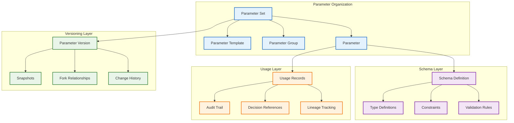
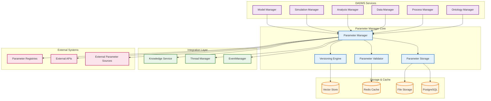

# DADMS 2.0 – Parameter Manager Service Specification

## Executive Summary

The Parameter Manager service provides centralized management of decision model parameters across the DADMS Event-Driven System (EDS). It enables creation, versioning, validation, and traceability of parameter sets used in simulations, analyses, and decision workflows, ensuring reproducible and auditable decision-making processes.

## 1. Purpose & Responsibilities

### 1.1 Core Purpose

The Parameter Manager serves as the central repository and management system for all decision model parameters within DADMS, providing:

- **Centralized Parameter Storage**: Single source of truth for all parameter definitions
- **Version Control**: Immutable versioning for executed decisions and reproducibility
- **Validation & Constraints**: Type checking, range validation, and constraint enforcement
- **Semantic Linking**: Integration with ontologies for parameter meaning and relationships
- **Traceability**: Complete audit trail of parameter usage in decisions and outcomes
- **Reusability**: Shared parameter sets across models, simulations, and analyses

### 1.2 Key Responsibilities

#### Parameter Set Management
- Create, store, and organize parameter sets with metadata
- Support both independent parameters (inputs) and dependent parameters (derived values)
- Maintain parameter schemas for different domains and use cases
- Enable parameter set templates and inheritance

#### Version Control & Immutability
- Immutable parameter sets for executed decisions
- Fork-based updates for iterative refinement
- Complete version history with change justification
- Snapshot capabilities for point-in-time parameter states

#### Validation & Quality Assurance
- Type validation (numeric, string, boolean, enum, etc.)
- Range and constraint checking (min/max, regex patterns)
- Cross-parameter validation rules
- Schema compliance verification

#### Integration & Interoperability
- Parameter supply for Model Manager and Simulation Manager
- Integration with Decision Logs and Context Threads
- Ontological tagging and semantic enrichment
- Event-driven parameter change notifications

## 2. Core Concepts & Data Models

### 2.1 Parameter Hierarchy



### 2.2 Core Data Models

#### ParameterSet Definition
```typescript
interface ParameterSet {
    id: string;                         // Unique parameter set identifier
    name: string;                       // Human-readable name
    description: string;                // Detailed description
    version: string;                    // Semantic version (e.g., "1.2.3")
    
    // Organization
    domain: string;                     // Domain classification (physics, economics, etc.)
    category: ParameterCategory;        // Category type
    tags: string[];                     // Semantic tags for discovery
    
    // Parameters
    parameters: Record<string, Parameter>; // Parameter definitions
    parameter_groups: ParameterGroup[];    // Logical groupings
    
    // Schema & Validation
    schema_version: string;             // Associated schema version
    validation_rules: ValidationRule[]; // Cross-parameter validation
    
    // Metadata
    author: string;                     // Creator identifier
    organization?: string;              // Owning organization
    source_provenance: string;          // Data source/derivation
    usage_context: string[];            // Intended use cases
    
    // Lifecycle
    status: ParameterSetStatus;         // Active, deprecated, archived
    is_immutable: boolean;              // Whether set is frozen
    parent_set_id?: string;             // For forked/derived sets
    
    // Timestamps
    created_at: Date;
    updated_at: Date;
    locked_at?: Date;                   // When set became immutable
    archived_at?: Date;
}

enum ParameterCategory {
    SIMULATION = "simulation",          // Simulation model parameters
    ANALYSIS = "analysis",              // Analysis configuration
    SCORING = "scoring",                // Scoring weights and thresholds
    PHYSICS = "physics",                // Physical constants and models
    ECONOMIC = "economic",              // Economic model parameters
    STATISTICAL = "statistical",        // Statistical analysis parameters
    ONTOLOGY = "ontology",              // Ontological mappings
    WORKFLOW = "workflow",              // Process parameters
    CUSTOM = "custom"                   // User-defined categories
}

enum ParameterSetStatus {
    DRAFT = "draft",                    // Under development
    ACTIVE = "active",                  // Available for use
    DEPRECATED = "deprecated",          // Superseded but usable
    ARCHIVED = "archived",              // Historical only
    LOCKED = "locked"                   // Immutable for executed decisions
}
```

#### Parameter Definition
```typescript
interface Parameter {
    name: string;                       // Parameter name/key
    display_name?: string;              // Human-readable name
    description: string;                // Parameter description
    
    // Type & Value
    type: ParameterType;                // Data type
    value: any;                         // Current/default value
    unit?: string;                      // Unit of measurement
    
    // Classification
    parameter_class: ParameterClass;    // Independent vs dependent
    source_type: ParameterSourceType;   // How parameter is derived
    
    // Validation
    constraints: ParameterConstraints;  // Validation rules
    validation_function?: string;       // Custom validation function
    
    // Dependency
    depends_on: string[];               // Parameter dependencies
    derived_from?: DerivedDefinition;   // Derivation specification
    
    // Metadata
    tags: string[];                     // Semantic tags
    sensitivity_level: SensitivityLevel; // Security classification
    documentation_url?: string;        // Reference documentation
    
    // Lifecycle
    is_required: boolean;               // Whether parameter is mandatory
    is_configurable: boolean;           // Whether user can modify
    default_value?: any;                // Default if not specified
    
    // Audit
    last_validated_at?: Date;
    validation_status: ValidationStatus;
}

enum ParameterType {
    NUMBER = "number",
    INTEGER = "integer", 
    FLOAT = "float",
    STRING = "string",
    BOOLEAN = "boolean",
    ENUM = "enum",
    ARRAY = "array",
    OBJECT = "object",
    DATE = "date",
    DURATION = "duration",
    UNIT_VALUE = "unit_value"           // Value with units
}

enum ParameterClass {
    INDEPENDENT = "independent",        // User inputs, environmental values
    DEPENDENT = "dependent",            // Derived from other parameters/models
    COMPUTED = "computed",              // Calculated during execution
    CONSTANT = "constant"               // Fixed values
}

enum ParameterSourceType {
    USER_INPUT = "user_input",          // User-provided values
    ENVIRONMENTAL = "environmental",    // Environmental/external data
    MODEL_OUTPUT = "model_output",      // Output from other models
    CALCULATED = "calculated",          // Computed from formula
    LOOKUP = "lookup",                  // Retrieved from lookup table
    DEFAULT = "default",                // System default value
    INHERITED = "inherited"             // Inherited from parent set
}

enum SensitivityLevel {
    PUBLIC = "public",                  // No restrictions
    INTERNAL = "internal",              // Internal use only
    CONFIDENTIAL = "confidential",      // Restricted access
    CLASSIFIED = "classified"           // Highest security
}

enum ValidationStatus {
    VALID = "valid",
    INVALID = "invalid", 
    WARNING = "warning",
    PENDING = "pending",
    UNKNOWN = "unknown"
}
```

#### Parameter Constraints
```typescript
interface ParameterConstraints {
    // Numeric constraints
    min_value?: number;
    max_value?: number;
    step?: number;                      // Increment step
    precision?: number;                 // Decimal places
    
    // String constraints
    min_length?: number;
    max_length?: number;
    pattern?: string;                   // Regex pattern
    format?: StringFormat;              // Predefined format
    
    // Array constraints
    min_items?: number;
    max_items?: number;
    unique_items?: boolean;
    item_type?: ParameterType;
    
    // Enum constraints
    allowed_values?: any[];
    
    // Cross-parameter constraints
    conditional_rules?: ConditionalRule[];
    
    // Custom constraints
    custom_validators?: string[];       // Custom validation functions
}

enum StringFormat {
    EMAIL = "email",
    URL = "url", 
    UUID = "uuid",
    DATE_ISO = "date-iso",
    TIME_ISO = "time-iso",
    REGEX = "regex"
}

interface ConditionalRule {
    condition: string;                  // Condition expression
    then_constraint: ParameterConstraints; // Constraint if true
    else_constraint?: ParameterConstraints; // Constraint if false
    description: string;
}
```

#### Parameter Versioning
```typescript
interface ParameterVersion {
    version_id: string;                 // Version identifier
    parameter_set_id: string;           // Parent parameter set
    version_number: string;             // Semantic version
    
    // Change Information
    change_type: ChangeType;            // Type of change
    change_summary: string;             // Brief change description
    change_justification: string;       // Detailed reasoning
    breaking_changes: string[];         // Breaking change notes
    
    // Relationships
    parent_version_id?: string;         // Previous version
    fork_source_id?: string;            // Source if forked
    
    // Content
    parameter_snapshot: Record<string, Parameter>; // Parameter state
    schema_changes: SchemaChange[];     // Schema modifications
    
    // Metadata
    created_by: string;                 // Author of changes
    approved_by?: string;               // Approver if required
    change_request_id?: string;         // Associated change request
    
    // Timestamps
    created_at: Date;
    effective_date?: Date;              // When changes take effect
    
    // Usage tracking
    usage_count: number;                // How many times used
    last_used_at?: Date;
}

enum ChangeType {
    MAJOR = "major",                    // Breaking changes
    MINOR = "minor",                    // New features, non-breaking
    PATCH = "patch",                    // Bug fixes
    HOTFIX = "hotfix",                  // Critical fixes
    FORK = "fork"                       // Forked from another set
}

interface SchemaChange {
    parameter_name: string;
    change_operation: 'add' | 'remove' | 'modify';
    old_definition?: Parameter;
    new_definition?: Parameter;
    impact_assessment: string;
}
```

### 2.3 Parameter Templates & Inheritance

```typescript
interface ParameterTemplate {
    id: string;
    name: string;
    description: string;
    category: ParameterCategory;
    
    // Template structure
    parameter_definitions: ParameterDefinition[];
    required_parameters: string[];
    optional_parameters: string[];
    
    // Inheritance
    extends_template?: string;          // Parent template
    overrides: Record<string, any>;     // Parameter overrides
    
    // Usage
    usage_examples: ParameterSetExample[];
    documentation: string;
    
    // Lifecycle
    is_active: boolean;
    created_at: Date;
    updated_at: Date;
}

interface ParameterDefinition {
    name: string;
    type: ParameterType;
    description: string;
    constraints?: ParameterConstraints;
    default_value?: any;
    is_required: boolean;
    group?: string;
}

interface ParameterSetExample {
    name: string;
    description: string;
    use_case: string;
    parameter_values: Record<string, any>;
}
```

## 3. Parameter Validation Framework

### 3.1 Validation Engine

```typescript
interface ParameterValidator {
    validateParameterSet(parameterSet: ParameterSet): ValidationResult;
    validateParameter(parameter: Parameter, context?: ValidationContext): ParameterValidationResult;
    validateCrossParameterRules(parameters: Record<string, Parameter>, rules: ValidationRule[]): CrossValidationResult;
    validateAgainstSchema(parameterSet: ParameterSet, schema: ParameterSchema): SchemaValidationResult;
}

interface ValidationResult {
    is_valid: boolean;
    overall_score: number;              // 0.0 - 1.0
    validation_summary: ValidationSummary;
    parameter_results: Record<string, ParameterValidationResult>;
    cross_validation_results: CrossValidationResult;
    schema_validation: SchemaValidationResult;
    recommendations: ValidationRecommendation[];
}

interface ParameterValidationResult {
    parameter_name: string;
    is_valid: boolean;
    validation_errors: ValidationError[];
    validation_warnings: ValidationWarning[];
    constraint_violations: ConstraintViolation[];
    suggestions: string[];
}

interface ValidationError {
    error_code: string;
    error_message: string;
    parameter_path: string;
    current_value: any;
    expected_constraint: string;
    severity: 'critical' | 'high' | 'medium' | 'low';
}
```

### 3.2 Schema Framework

```typescript
interface ParameterSchema {
    schema_id: string;
    name: string;
    version: string;
    description: string;
    
    // Schema definition
    schema_type: SchemaType;
    parameter_definitions: Record<string, ParameterSchemaDefinition>;
    required_parameters: string[];
    
    // Validation rules
    global_constraints: GlobalConstraint[];
    conditional_rules: ConditionalRule[];
    cross_parameter_rules: CrossParameterRule[];
    
    // Metadata
    domain: string;
    category: ParameterCategory;
    applicable_contexts: string[];
    
    // Lifecycle
    status: SchemaStatus;
    created_at: Date;
    updated_at: Date;
}

enum SchemaType {
    STRICT = "strict",                  // All parameters must match exactly
    FLEXIBLE = "flexible",              // Additional parameters allowed
    TEMPLATE = "template",              // Template-based with inheritance
    EXTENSIBLE = "extensible"           // User can extend schema
}

enum SchemaStatus {
    DRAFT = "draft",
    ACTIVE = "active", 
    DEPRECATED = "deprecated",
    ARCHIVED = "archived"
}

interface ParameterSchemaDefinition {
    type: ParameterType;
    description: string;
    constraints: ParameterConstraints;
    metadata: ParameterMetadata;
    examples?: any[];
}

interface GlobalConstraint {
    constraint_id: string;
    description: string;
    constraint_expression: string;
    error_message: string;
}

interface CrossParameterRule {
    rule_id: string;
    description: string;
    parameters_involved: string[];
    rule_expression: string;
    validation_level: 'error' | 'warning' | 'info';
}
```

## 4. API Specification

### 4.1 Core API Interface

```typescript
interface ParameterManagerAPI {
    // Parameter Set Management
    registerParameterSet(parameterSet: ParameterSetRequest): Promise<ParameterSetResponse>;
    getParameterSet(id: string, version?: string): Promise<ParameterSet>;
    updateParameterSet(id: string, updates: ParameterSetUpdate): Promise<ParameterSetResponse>;
    deleteParameterSet(id: string): Promise<void>;
    listParameterSets(filter?: ParameterSetFilter): Promise<ParameterSetSummary[]>;
    
    // Parameter Set Operations
    forkParameterSet(sourceId: string, forkRequest: ForkRequest): Promise<ParameterSetResponse>;
    lockParameterSet(id: string, lockReason: string): Promise<void>;
    archiveParameterSet(id: string, archiveReason: string): Promise<void>;
    compareParameterSets(id1: string, id2: string): Promise<ParameterSetComparison>;
    
    // Parameter Management
    addParameter(setId: string, parameter: Parameter): Promise<void>;
    updateParameter(setId: string, paramName: string, updates: ParameterUpdate): Promise<void>;
    removeParameter(setId: string, paramName: string): Promise<void>;
    validateParameter(setId: string, paramName: string): Promise<ParameterValidationResult>;
    
    // Validation & Quality
    validateParameterSet(id: string): Promise<ValidationResult>;
    validateParameterValues(setId: string, values: Record<string, any>): Promise<ValidationResult>;
    suggestParameterValues(setId: string, context?: ValidationContext): Promise<ParameterSuggestions>;
    
    // Schema Management
    registerSchema(schema: ParameterSchema): Promise<SchemaResponse>;
    getSchema(schemaId: string, version?: string): Promise<ParameterSchema>;
    listSchemas(filter?: SchemaFilter): Promise<SchemaSummary[]>;
    validateAgainstSchema(setId: string, schemaId: string): Promise<SchemaValidationResult>;
    
    // Templates
    createTemplate(template: ParameterTemplate): Promise<TemplateResponse>;
    getTemplate(templateId: string): Promise<ParameterTemplate>;
    listTemplates(filter?: TemplateFilter): Promise<TemplateSummary[]>;
    instantiateFromTemplate(templateId: string, overrides?: Record<string, any>): Promise<ParameterSetResponse>;
    
    // Version Management
    getVersionHistory(setId: string): Promise<ParameterVersion[]>;
    getVersion(setId: string, versionId: string): Promise<ParameterVersion>;
    createVersion(setId: string, versionRequest: VersionRequest): Promise<ParameterVersion>;
    rollbackToVersion(setId: string, versionId: string): Promise<ParameterSetResponse>;
    
    // Usage & Lineage
    getUsageHistory(setId: string): Promise<UsageRecord[]>;
    getParameterLineage(setId: string, paramName: string): Promise<ParameterLineage>;
    findParametersUsedInDecision(decisionId: string): Promise<ParameterUsageSummary[]>;
    
    // Search & Discovery
    searchParameters(query: ParameterSearchQuery): Promise<ParameterSearchResult[]>;
    getParametersByTag(tags: string[]): Promise<ParameterSummary[]>;
    getSimilarParameterSets(setId: string): Promise<SimilarityResult[]>;
    
    // Export & Import
    exportParameterSet(setId: string, format: ExportFormat): Promise<ExportResult>;
    importParameterSet(importData: ImportRequest): Promise<ParameterSetResponse>;
    
    // Health & Monitoring
    getHealth(): Promise<HealthStatus>;
    getMetrics(): Promise<ParameterManagerMetrics>;
}
```

### 4.2 Request/Response Models

```typescript
interface ParameterSetRequest {
    name: string;
    description: string;
    domain: string;
    category: ParameterCategory;
    parameters: Record<string, Parameter>;
    tags?: string[];
    usage_context?: string[];
    template_id?: string;
}

interface ParameterSetResponse {
    id: string;
    parameter_set: ParameterSet;
    validation_result: ValidationResult;
    created_at: Date;
}

interface ParameterSetUpdate {
    name?: string;
    description?: string;
    parameters?: Record<string, Parameter>;
    tags?: string[];
    add_parameters?: Record<string, Parameter>;
    remove_parameters?: string[];
    update_parameters?: Record<string, Partial<Parameter>>;
}

interface ForkRequest {
    name: string;
    description: string;
    reason: string;
    modifications?: Record<string, any>;
}

interface ParameterSetFilter {
    domain?: string;
    category?: ParameterCategory;
    tags?: string[];
    status?: ParameterSetStatus;
    author?: string;
    created_after?: Date;
    created_before?: Date;
    search_term?: string;
    limit?: number;
    offset?: number;
}

interface ParameterSetComparison {
    set1_id: string;
    set2_id: string;
    differences: ParameterDifference[];
    similarity_score: number;
    compatibility_assessment: CompatibilityAssessment;
}

interface ParameterDifference {
    parameter_name: string;
    difference_type: 'added' | 'removed' | 'modified' | 'value_changed';
    set1_value?: any;
    set2_value?: any;
    impact_level: 'critical' | 'major' | 'minor' | 'none';
}
```

## 5. Integration Architecture

### 5.1 Service Integration



### 5.2 Event-Driven Integration

```typescript
interface ParameterManagerEvents {
    // Parameter Set Events
    "parameter.set.created": ParameterSetCreatedEvent;
    "parameter.set.updated": ParameterSetUpdatedEvent;
    "parameter.set.locked": ParameterSetLockedEvent;
    "parameter.set.archived": ParameterSetArchivedEvent;
    "parameter.set.forked": ParameterSetForkedEvent;
    
    // Parameter Events
    "parameter.added": ParameterAddedEvent;
    "parameter.updated": ParameterUpdatedEvent;
    "parameter.removed": ParameterRemovedEvent;
    "parameter.validated": ParameterValidatedEvent;
    
    // Usage Events
    "parameter.set.used": ParameterSetUsedEvent;
    "parameter.accessed": ParameterAccessedEvent;
    "parameter.value.changed": ParameterValueChangedEvent;
    
    // Validation Events
    "parameter.validation.failed": ParameterValidationFailedEvent;
    "parameter.constraint.violated": ParameterConstraintViolatedEvent;
    "parameter.schema.mismatch": ParameterSchemaMismatchEvent;
    
    // Version Events
    "parameter.version.created": ParameterVersionCreatedEvent;
    "parameter.rollback.performed": ParameterRollbackEvent;
    
    // Administrative Events
    "parameter.template.created": ParameterTemplateCreatedEvent;
    "parameter.schema.registered": ParameterSchemaRegisteredEvent;
}

interface ParameterSetUsedEvent {
    parameter_set_id: string;
    version: string;
    used_by_service: string;
    used_by_component: string;
    usage_context: string;
    parameters_accessed: string[];
    decision_id?: string;
    simulation_id?: string;
    analysis_id?: string;
    timestamp: Date;
}

interface ParameterValidationFailedEvent {
    parameter_set_id: string;
    parameter_name: string;
    validation_errors: ValidationError[];
    current_value: any;
    expected_constraints: string[];
    severity: 'critical' | 'high' | 'medium' | 'low';
    remediation_suggestions: string[];
}
```

## 6. Security & Access Control

### 6.1 Security Framework

```typescript
interface ParameterSecurity {
    // Access Control
    access_policies: AccessPolicy[];
    role_permissions: RolePermission[];
    
    // Data Protection
    encryption_config: EncryptionConfig;
    sensitive_parameter_handling: SensitiveHandlingConfig;
    
    // Audit & Compliance
    audit_configuration: AuditConfig;
    compliance_requirements: ComplianceRequirement[];
}

interface AccessPolicy {
    policy_id: string;
    resource_pattern: string;          // Which parameters/sets
    principals: string[];              // Users/roles/services
    permissions: Permission[];
    conditions?: AccessCondition[];
    expiry_date?: Date;
}

enum Permission {
    READ = "read",
    WRITE = "write", 
    DELETE = "delete",
    FORK = "fork",
    LOCK = "lock",
    ARCHIVE = "archive",
    VALIDATE = "validate",
    EXPORT = "export",
    ADMINISTER = "administer"
}

interface SensitiveHandlingConfig {
    encryption_required: boolean;
    masking_rules: MaskingRule[];
    access_logging: boolean;
    retention_policy: RetentionPolicy;
}

interface MaskingRule {
    parameter_pattern: string;
    masking_type: 'full' | 'partial' | 'hash' | 'none';
    reveal_conditions: string[];
}
```

### 6.2 Audit & Compliance

```typescript
interface AuditRecord {
    audit_id: string;
    timestamp: Date;
    user_id: string;
    service_id?: string;
    
    // Operation details
    operation: AuditOperation;
    resource_type: 'parameter_set' | 'parameter' | 'schema' | 'template';
    resource_id: string;
    
    // Change details
    old_value?: any;
    new_value?: any;
    change_reason?: string;
    
    // Context
    session_id?: string;
    request_id?: string;
    decision_context?: string;
    
    // Metadata
    ip_address?: string;
    user_agent?: string;
    compliance_flags: string[];
}

enum AuditOperation {
    CREATE = "create",
    READ = "read",
    UPDATE = "update", 
    DELETE = "delete",
    LOCK = "lock",
    FORK = "fork",
    ARCHIVE = "archive",
    EXPORT = "export",
    VALIDATE = "validate"
}
```

## 7. Implementation Architecture

### 7.1 Service Architecture

```typescript
class ParameterManagerService {
    private parameterRepository: ParameterRepository;
    private validationEngine: ValidationEngine;
    private versioningService: VersioningService;
    private schemaService: SchemaService;
    private auditService: AuditService;
    private eventPublisher: EventPublisher;
    
    // Core operations
    async registerParameterSet(request: ParameterSetRequest): Promise<ParameterSetResponse>;
    async getParameterSet(id: string, version?: string): Promise<ParameterSet>;
    async updateParameterSet(id: string, updates: ParameterSetUpdate): Promise<ParameterSetResponse>;
    
    // Validation operations
    async validateParameterSet(id: string): Promise<ValidationResult>;
    async validateParameterValues(setId: string, values: Record<string, any>): Promise<ValidationResult>;
    
    // Version operations
    async createVersion(setId: string, versionRequest: VersionRequest): Promise<ParameterVersion>;
    async forkParameterSet(sourceId: string, forkRequest: ForkRequest): Promise<ParameterSetResponse>;
    
    // Schema operations
    async registerSchema(schema: ParameterSchema): Promise<SchemaResponse>;
    async validateAgainstSchema(setId: string, schemaId: string): Promise<SchemaValidationResult>;
}
```

### 7.2 Storage Architecture

#### PostgreSQL Schema
```sql
-- Parameter sets
CREATE TABLE parameter_sets (
    id UUID PRIMARY KEY DEFAULT gen_random_uuid(),
    name VARCHAR(255) NOT NULL,
    description TEXT,
    version VARCHAR(50) NOT NULL,
    domain VARCHAR(100) NOT NULL,
    category VARCHAR(50) NOT NULL,
    tags TEXT[],
    author VARCHAR(255) NOT NULL,
    organization VARCHAR(255),
    source_provenance TEXT,
    usage_context TEXT[],
    status VARCHAR(50) NOT NULL,
    is_immutable BOOLEAN DEFAULT FALSE,
    parent_set_id UUID REFERENCES parameter_sets(id),
    schema_version VARCHAR(50),
    created_at TIMESTAMP NOT NULL DEFAULT NOW(),
    updated_at TIMESTAMP NOT NULL DEFAULT NOW(),
    locked_at TIMESTAMP,
    archived_at TIMESTAMP,
    
    UNIQUE(name, version)
);

-- Individual parameters
CREATE TABLE parameters (
    id UUID PRIMARY KEY DEFAULT gen_random_uuid(),
    parameter_set_id UUID NOT NULL REFERENCES parameter_sets(id) ON DELETE CASCADE,
    name VARCHAR(255) NOT NULL,
    display_name VARCHAR(255),
    description TEXT,
    parameter_type VARCHAR(50) NOT NULL,
    parameter_class VARCHAR(50) NOT NULL,
    source_type VARCHAR(50) NOT NULL,
    value JSONB,
    unit VARCHAR(50),
    constraints JSONB,
    depends_on TEXT[],
    derived_from JSONB,
    tags TEXT[],
    sensitivity_level VARCHAR(50) NOT NULL,
    is_required BOOLEAN DEFAULT TRUE,
    is_configurable BOOLEAN DEFAULT TRUE,
    default_value JSONB,
    validation_status VARCHAR(50),
    last_validated_at TIMESTAMP,
    
    UNIQUE(parameter_set_id, name)
);

-- Parameter versions
CREATE TABLE parameter_versions (
    version_id UUID PRIMARY KEY DEFAULT gen_random_uuid(),
    parameter_set_id UUID NOT NULL REFERENCES parameter_sets(id),
    version_number VARCHAR(50) NOT NULL,
    change_type VARCHAR(50) NOT NULL,
    change_summary TEXT NOT NULL,
    change_justification TEXT,
    breaking_changes TEXT[],
    parent_version_id UUID REFERENCES parameter_versions(version_id),
    fork_source_id UUID REFERENCES parameter_versions(version_id),
    parameter_snapshot JSONB NOT NULL,
    schema_changes JSONB,
    created_by VARCHAR(255) NOT NULL,
    approved_by VARCHAR(255),
    change_request_id VARCHAR(255),
    created_at TIMESTAMP NOT NULL DEFAULT NOW(),
    effective_date TIMESTAMP,
    usage_count INTEGER DEFAULT 0,
    last_used_at TIMESTAMP,
    
    UNIQUE(parameter_set_id, version_number)
);

-- Parameter schemas
CREATE TABLE parameter_schemas (
    schema_id UUID PRIMARY KEY DEFAULT gen_random_uuid(),
    name VARCHAR(255) NOT NULL,
    version VARCHAR(50) NOT NULL,
    description TEXT,
    schema_type VARCHAR(50) NOT NULL,
    parameter_definitions JSONB NOT NULL,
    required_parameters TEXT[],
    global_constraints JSONB,
    conditional_rules JSONB,
    cross_parameter_rules JSONB,
    domain VARCHAR(100),
    category VARCHAR(50),
    applicable_contexts TEXT[],
    status VARCHAR(50) NOT NULL,
    created_at TIMESTAMP NOT NULL DEFAULT NOW(),
    updated_at TIMESTAMP NOT NULL DEFAULT NOW(),
    
    UNIQUE(name, version)
);

-- Usage tracking
CREATE TABLE parameter_usage (
    usage_id UUID PRIMARY KEY DEFAULT gen_random_uuid(),
    parameter_set_id UUID NOT NULL REFERENCES parameter_sets(id),
    version_id UUID REFERENCES parameter_versions(version_id),
    used_by_service VARCHAR(255) NOT NULL,
    used_by_component VARCHAR(255),
    usage_context VARCHAR(255),
    parameters_accessed TEXT[],
    decision_id VARCHAR(255),
    simulation_id VARCHAR(255), 
    analysis_id VARCHAR(255),
    used_at TIMESTAMP NOT NULL DEFAULT NOW(),
    
    INDEX (parameter_set_id, used_at),
    INDEX (used_by_service, used_at)
);

-- Audit trail
CREATE TABLE parameter_audit (
    audit_id UUID PRIMARY KEY DEFAULT gen_random_uuid(),
    timestamp TIMESTAMP NOT NULL DEFAULT NOW(),
    user_id VARCHAR(255) NOT NULL,
    service_id VARCHAR(255),
    operation VARCHAR(50) NOT NULL,
    resource_type VARCHAR(50) NOT NULL,
    resource_id VARCHAR(255) NOT NULL,
    old_value JSONB,
    new_value JSONB,
    change_reason TEXT,
    session_id VARCHAR(255),
    request_id VARCHAR(255),
    decision_context VARCHAR(255),
    ip_address INET,
    user_agent TEXT,
    compliance_flags TEXT[],
    
    INDEX (timestamp),
    INDEX (user_id, timestamp),
    INDEX (resource_type, resource_id)
);
```

### 7.3 Performance Considerations

#### Caching Strategy
```typescript
interface ParameterCacheStrategy {
    // Frequently accessed parameter sets (TTL: 1 hour)
    parameter_sets: Map<string, ParameterSet>;
    
    // Parameter schemas (TTL: 24 hours)
    schemas: Map<string, ParameterSchema>;
    
    // Validation results (TTL: 30 minutes)
    validation_cache: Map<string, ValidationResult>;
    
    // Parameter templates (TTL: 12 hours)
    templates: Map<string, ParameterTemplate>;
    
    // Usage statistics (TTL: 1 hour)
    usage_stats: Map<string, UsageStatistics>;
}
```

#### Performance Optimizations
1. **Read Replicas**: Distribute read load across multiple database replicas
2. **Connection Pooling**: Efficient database connection management
3. **Lazy Loading**: Load parameter details on demand
4. **Batch Operations**: Optimize bulk parameter operations
5. **Compression**: Compress large parameter sets in storage

## 8. Implementation Roadmap

### 8.1 Phase 1: Core Infrastructure (Weeks 1-4)
**Goal**: Basic parameter management capabilities

**Deliverables**:
- Basic CRUD operations for parameter sets
- Simple validation framework
- PostgreSQL schema implementation
- REST API endpoints
- Basic version control

**Success Criteria**:
- Can create, read, update parameter sets
- Basic type and constraint validation
- Immutable parameter sets for executed decisions
- API response time < 200ms

### 8.2 Phase 2: Advanced Features (Weeks 5-8)
**Goal**: Enhanced validation and schema support

**Deliverables**:
- Advanced validation engine
- Parameter schema framework
- Template system
- Cross-parameter validation
- Fork and merge capabilities

**Success Criteria**:
- Complex validation rules work correctly
- Schema-based parameter validation
- Template instantiation functional
- Fork/merge operations maintain integrity

### 8.3 Phase 3: Integration & Intelligence (Weeks 9-12)
**Goal**: Service integration and smart features

**Deliverables**:
- EventManager integration
- Service-to-service integration (Model/Simulation Manager)
- Parameter lineage tracking
- Usage analytics
- Search and discovery features

**Success Criteria**:
- Seamless integration with other DADMS services
- Complete parameter usage tracking
- Intelligent parameter suggestions
- Real-time event notifications

### 8.4 Phase 4: Enterprise Features (Weeks 13-16)
**Goal**: Security, compliance, and enterprise readiness

**Deliverables**:
- Advanced security framework
- Audit and compliance features
- Role-based access control
- Performance optimizations
- Monitoring and alerting

**Success Criteria**:
- Security controls fully functional
- Compliance audit trails complete
- Performance targets met (1000+ req/sec)
- Production-ready monitoring

---

## Conclusion

The Parameter Manager service provides DADMS with a robust, secure, and intelligent system for managing decision model parameters across all workflows. By implementing comprehensive validation, versioning, and traceability capabilities, it ensures reproducible and auditable decision-making processes while enabling efficient parameter reuse and collaborative parameter development.

The service integrates seamlessly with the DADMS ecosystem, providing parameter supply for simulations and analyses while maintaining complete audit trails for regulatory compliance and decision reproducibility.

**Next Steps**: Proceed with Phase 1 implementation, focusing on core CRUD operations and basic validation framework.

**Document Version**: 1.0  
**Service Port**: 3013  
**Status**: Approved for Implementation 