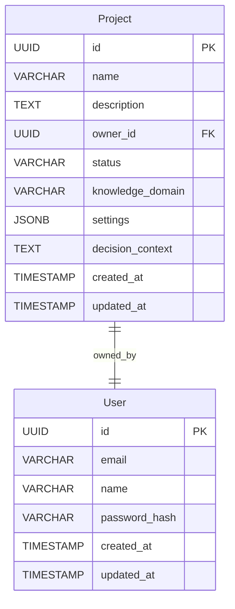
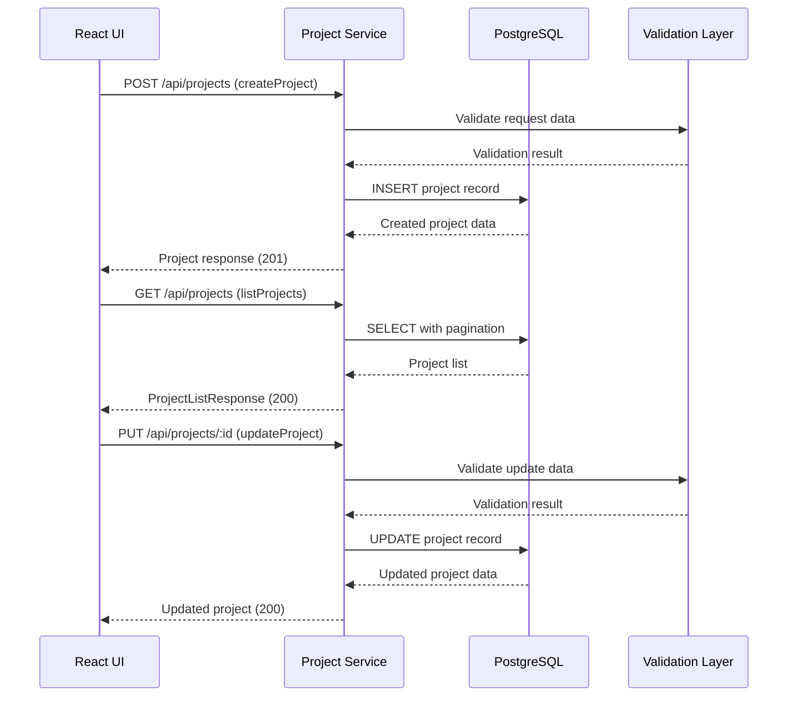
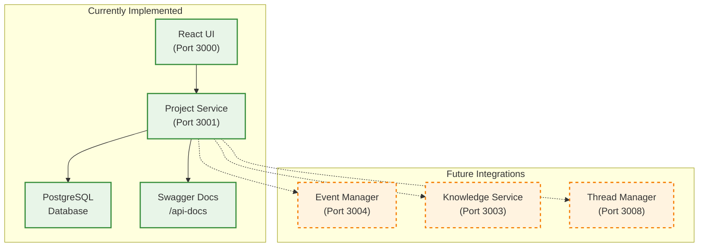
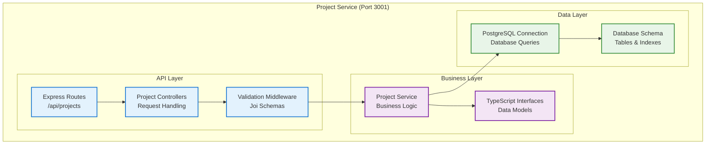

# DADMS 2.0 - Project Service Specification

## Executive Summary

The Project Service is a fundamental microservice in DADMS 2.0's Event-Driven System (EDS), providing comprehensive project lifecycle management for decision intelligence workflows. This service manages project creation, metadata, user assignments, and serves as the central hub for organizing decision analysis activities across the platform.

**Current Status**: ✅ **IMPLEMENTED** - Core functionality operational with React UI integration  
**Port**: 3001  
**Version**: 2.0.0-alpha.2

## Purpose & Responsibilities

### Core Project Management
- **Project Lifecycle**: Create, read, update, delete (CRUD) operations for projects
- **Metadata Management**: Rich project context including decision domains and settings
- **Status Tracking**: Project status management (active/completed)
- **User Association**: Project ownership and access control

### Integration Hub
- **UI Integration**: Full React frontend integration with real-time project management
- **Database Persistence**: PostgreSQL with proper schema and indexing
- **API Standards**: RESTful endpoints with comprehensive validation
- **Documentation**: Swagger/OpenAPI integration for developer experience

## Core Concepts & Data Models

### Project Entity Architecture



### TypeScript Data Models

```typescript
// Core Project Interface
interface Project {
    id: string;
    name: string;
    description: string;
    owner_id: string;
    status: 'active' | 'completed';
    knowledge_domain: string;
    settings: ProjectSettings;
    created_at: Date;
    updated_at: Date;
    decision_context?: string;
}

// Project Settings Configuration
interface ProjectSettings {
    default_llm: string;           // e.g., "openai/gpt-4"
    personas: string[];           // Available agent personas
    tools_enabled: string[];      // e.g., ["rag_search", "web_search"]
}

// Request/Response Models
interface CreateProjectRequest {
    name: string;
    description: string;
    knowledge_domain: string;
    settings?: Partial<ProjectSettings>;
    decision_context?: string;
}

interface UpdateProjectRequest {
    name?: string;
    description?: string;
    knowledge_domain?: string;
    status?: 'active' | 'completed';
    settings?: Partial<ProjectSettings>;
    decision_context?: string;
}

interface ProjectListResponse {
    projects: Project[];
    total: number;
    page: number;
    limit: number;
}

// Standard API Response
interface ApiResponse<T> {
    success: boolean;
    data?: T;
    error?: string;
    message?: string;
    timestamp: string;
}
```

## API Specification

### Core API Interface

```typescript
interface ProjectServiceAPI {
    // Core CRUD Operations
    createProject(userId: string, projectData: CreateProjectRequest): Promise<Project>;
    getUserProjects(userId: string, page?: number, limit?: number): Promise<ProjectListResponse>;
    getProject(projectId: string, userId: string): Promise<Project | null>;
    updateProject(projectId: string, userId: string, updateData: UpdateProjectRequest): Promise<Project | null>;
    deleteProject(projectId: string, userId: string): Promise<boolean>;
}
```

### Request/Response Models

```typescript
// Validation Schemas (Joi)
const createProjectSchema = Joi.object({
    name: Joi.string().min(1).max(255).required(),
    description: Joi.string().max(1000).allow(''),
    knowledge_domain: Joi.string().min(1).max(100).required(),
    settings: Joi.object({
        default_llm: Joi.string(),
        personas: Joi.array().items(Joi.string()),
        tools_enabled: Joi.array().items(Joi.string())
    }).optional(),
    decision_context: Joi.string().max(2000).allow('').optional()
});

const updateProjectSchema = Joi.object({
    name: Joi.string().min(1).max(255).optional(),
    description: Joi.string().max(1000).allow('').optional(),
    knowledge_domain: Joi.string().min(1).max(100).optional(),
    status: Joi.string().valid('active', 'completed').optional(),
    settings: Joi.object({
        default_llm: Joi.string(),
        personas: Joi.array().items(Joi.string()),
        tools_enabled: Joi.array().items(Joi.string())
    }).optional(),
    decision_context: Joi.string().max(2000).allow('').optional()
});
```

## Service Integration Architecture

### Current Integration Flow



### Service Integration Points



## Implementation Architecture

### Service Architecture



### PostgreSQL Schema

```sql
-- Enable UUID extension
CREATE EXTENSION IF NOT EXISTS "uuid-ossp";

-- Users table
CREATE TABLE IF NOT EXISTS users (
    id UUID PRIMARY KEY DEFAULT uuid_generate_v4(),
    email VARCHAR(255) UNIQUE NOT NULL,
    name VARCHAR(255) NOT NULL,
    password_hash VARCHAR(255) NOT NULL,
    created_at TIMESTAMP DEFAULT NOW(),
    updated_at TIMESTAMP DEFAULT NOW()
);

-- Projects table
CREATE TABLE IF NOT EXISTS projects (
    id UUID PRIMARY KEY DEFAULT uuid_generate_v4(),
    name VARCHAR(255) NOT NULL,
    description TEXT,
    owner_id UUID NOT NULL,
    status VARCHAR(50) DEFAULT 'active' CHECK (status IN ('active', 'completed')),
    knowledge_domain VARCHAR(100),
    settings JSONB DEFAULT '{
        "default_llm": "openai/gpt-4",
        "personas": [],
        "tools_enabled": ["rag_search", "web_search"]
    }'::jsonb,
    decision_context TEXT,
    created_at TIMESTAMP DEFAULT NOW(),
    updated_at TIMESTAMP DEFAULT NOW(),
    
    CONSTRAINT fk_project_owner FOREIGN KEY (owner_id) REFERENCES users(id) ON DELETE CASCADE
);

-- Performance indexes
CREATE INDEX IF NOT EXISTS idx_projects_owner_id ON projects(owner_id);
CREATE INDEX IF NOT EXISTS idx_projects_status ON projects(status);
CREATE INDEX IF NOT EXISTS idx_projects_knowledge_domain ON projects(knowledge_domain);
CREATE INDEX IF NOT EXISTS idx_projects_created_at ON projects(created_at);

-- Auto-update timestamps
CREATE OR REPLACE FUNCTION update_updated_at_column()
RETURNS TRIGGER AS $$
BEGIN
    NEW.updated_at = NOW();
    RETURN NEW;
END;
$$ language 'plpgsql';

CREATE TRIGGER update_projects_updated_at 
    BEFORE UPDATE ON projects 
    FOR EACH ROW 
    EXECUTE FUNCTION update_updated_at_column();
```

### Technology Stack

```typescript
// Dependencies (package.json)
{
  "dependencies": {
    "express": "^4.18.2",           // Web framework
    "cors": "^2.8.5",               // Cross-origin requests
    "helmet": "^7.1.0",             // Security headers
    "morgan": "^1.10.0",            // HTTP logging
    "pg": "^8.11.3",                // PostgreSQL client
    "uuid": "^9.0.1",               // UUID generation
    "joi": "^17.11.0",              // Request validation
    "dotenv": "^16.3.1",            // Environment variables
    "swagger-jsdoc": "^6.2.8",      // API documentation
    "swagger-ui-express": "^5.0.0"  // Swagger UI
  },
  "devDependencies": {
    "@types/express": "^4.17.21",   // TypeScript types
    "typescript": "^5.2.2",         // TypeScript compiler
    "nodemon": "^3.0.1",            // Development server
    "ts-node": "^10.9.1",           // TypeScript execution
    "jest": "^29.7.0",              // Testing framework
    "eslint": "^8.54.0"             // Code linting
  }
}
```

## Performance Considerations

### Database Optimization
- **UUID Primary Keys**: Efficient unique identification
- **Indexing Strategy**: Owner ID, status, domain, and temporal indexes
- **JSONB Settings**: Flexible configuration storage with query optimization
- **Connection Pooling**: Efficient database connection management

### API Performance
- **Pagination**: Default limit of 10, maximum of 50 results per page
- **Validation**: Joi schema validation with early request rejection
- **Error Handling**: Comprehensive error middleware with proper HTTP status codes
- **Logging**: Morgan HTTP request logging for monitoring

### Scalability Patterns
- **Stateless Design**: No server-side session storage
- **Database Connection Pool**: Efficient resource utilization
- **Middleware Pipeline**: Optimized request processing
- **JSON Response Caching**: Future implementation consideration

## Security & Access Control

### Current Security Model
```typescript
// Authentication (Simple Implementation)
interface AuthContext {
    userId: string;  // Extracted from 'user-id' header
}

// Authorization (Owner-based)
async function authorizeProjectAccess(projectId: string, userId: string): Promise<boolean> {
    const project = await getProject(projectId, userId);
    return project?.owner_id === userId;
}
```

### Security Framework
- **Input Validation**: Joi schema validation for all requests
- **SQL Injection Prevention**: Parameterized queries with pg library
- **XSS Protection**: Helmet middleware security headers
- **CORS Configuration**: Controlled cross-origin access
- **Request Size Limits**: 10MB JSON payload limit

### Future Security Enhancements
- **JWT Authentication**: Replace simple user-id header
- **Role-Based Access Control**: Multi-user project access
- **Rate Limiting**: Request throttling and abuse prevention
- **Audit Logging**: Comprehensive security event tracking

## Implementation Roadmap

### Phase 1: ✅ **COMPLETED** - Core Functionality
**Timeline**: Implemented  
**Status**: Production-ready

- [x] **Database Schema**: PostgreSQL tables with proper relationships
- [x] **CRUD Operations**: Complete project lifecycle management
- [x] **API Endpoints**: RESTful interface with validation
- [x] **React Integration**: Full UI with create/list/update/delete
- [x] **Documentation**: Swagger/OpenAPI integration
- [x] **Error Handling**: Comprehensive error middleware
- [x] **Development Environment**: Hot reload and TypeScript compilation

### Phase 2: 🔄 **PLANNED** - Enhanced Features
**Timeline**: Next 2-4 weeks  
**Dependencies**: Event Manager, Knowledge Service

**Core Enhancements:**
- [ ] **JWT Authentication**: Replace simple authentication
- [ ] **User Management**: Multi-user project collaboration
- [ ] **Project Templates**: Reusable project configurations
- [ ] **Enhanced Search**: Full-text search with filters
- [ ] **Bulk Operations**: Multi-project management

**Integration Features:**
- [ ] **Event Publishing**: Project lifecycle events to Event Manager
- [ ] **Knowledge Integration**: Link projects to Knowledge Service
- [ ] **Thread Management**: Connect to Thread Manager for workflows

### Phase 3: 🚀 **FUTURE** - Advanced Intelligence
**Timeline**: Month 2-3  
**Dependencies**: Full EDS ecosystem

**Advanced Features:**
- [ ] **Analytics Dashboard**: Project performance metrics
- [ ] **AI-Powered Insights**: Project success prediction
- [ ] **Advanced Workflows**: BPMN integration
- [ ] **Compliance Tracking**: Audit and governance features
- [ ] **Advanced Permissions**: Fine-grained access control

**Scaling Features:**
- [ ] **Caching Layer**: Redis integration for performance
- [ ] **Background Jobs**: Async processing for heavy operations
- [ ] **Real-time Updates**: WebSocket integration
- [ ] **Advanced Search**: Elasticsearch integration

## Success Metrics

### Current Performance (Phase 1)
- **✅ Project Creation**: < 200ms response time
- **✅ Project Listing**: < 150ms with pagination
- **✅ UI Integration**: Seamless React frontend
- **✅ Database Performance**: Efficient queries with indexes
- **✅ Developer Experience**: Comprehensive Swagger documentation

### Target Performance (Phase 2)
- **🎯 Response Time**: < 100ms for all operations
- **🎯 Concurrent Users**: Support 100+ simultaneous users
- **🎯 Search Performance**: < 50ms full-text search
- **🎯 Event Processing**: < 10ms event publishing
- **🎯 System Integration**: < 200ms cross-service calls

### Quality Metrics
- **🎯 Test Coverage**: > 85% code coverage
- **🎯 API Documentation**: 100% endpoint coverage
- **🎯 Error Handling**: < 1% unhandled errors
- **🎯 Security Compliance**: Zero critical vulnerabilities
- **🎯 Performance SLA**: 99.9% uptime

---

**Status**: ✅ Core implementation complete and operational  
**Last Updated**: Current  
**Version**: 2.0.0-alpha.2  
**Port**: 3001 