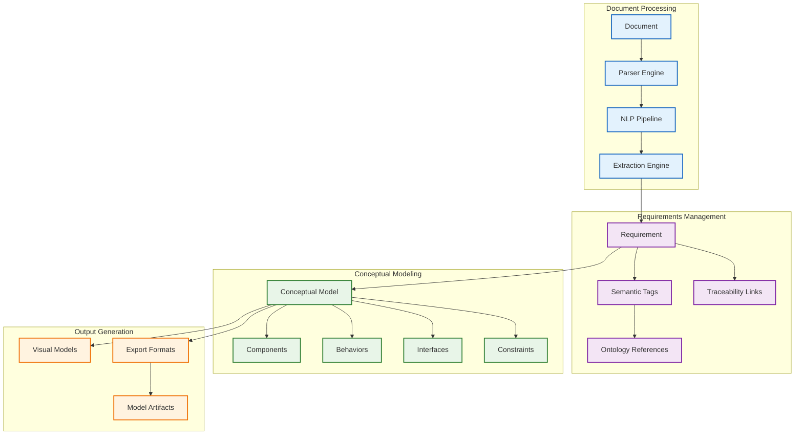
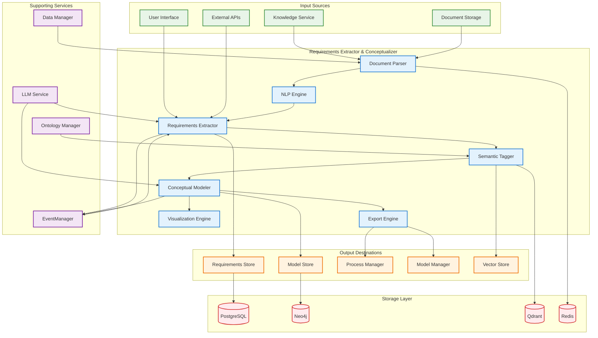

# DADMS 2.0 – Requirements Extractor & Conceptualizer Service Specification

## Executive Summary

The Requirements Extractor & Conceptualizer service provides intelligent automation for transforming unstructured knowledge artifacts into actionable, semantically enriched requirements and bootstrapped conceptual system models. This service combines advanced NLP processing with ontology-aligned semantic understanding to accelerate the transition from initial documentation to structured system design within the DADMS ecosystem.

## 1. Purpose & Responsibilities

### 1.1 Core Purpose

The Requirements Extractor & Conceptualizer serves as the intelligent bridge between raw documentation and structured system design, providing:

- **Automated Requirements Discovery**: Extract candidate requirements from diverse document formats
- **Semantic Enrichment**: Align extracted requirements with domain ontologies for consistency
- **Conceptual Model Generation**: Bootstrap initial system architectures from requirement sets
- **Traceability Maintenance**: Preserve bidirectional links between artifacts and source materials
- **Human-AI Collaboration**: Enable refined workflows with expert validation and correction
- **Multi-Format Export**: Generate outputs compatible with downstream DADMS services

### 1.2 Key Responsibilities

#### Requirements Extraction Engine
- Process structured and unstructured documents (PDF, Word, Markdown, plaintext)
- Identify candidate requirements using hybrid NLP, LLM, and rule-based approaches
- Extract requirement metadata including priority, type, domain classification
- Support batch and streaming extraction workflows
- Enable iterative refinement with human-in-the-loop validation
- **Probability-based iterative extraction** with convergence analysis for comprehensive coverage
- **Constraint extraction and categorization** for validation and evaluation workflows
- **Multi-pass extraction** to identify requirement clusters and alternative formulations

#### Semantic Alignment & Tagging
- Integrate with Ontology Manager for domain-specific semantic understanding
- Tag requirements with ontology references (classes, functions, properties)
- Maintain source document lineage and context preservation
- Support multi-ontology alignment for cross-domain requirements
- Enable semantic consistency checking and validation
- **Concept clustering and entity resolution** (airplane/air vehicle/aircraft → master concept)
- **Similarity analysis** against existing domain requirements and knowledge base
- **LLM-powered requirement review** with improvement suggestions and quality assessment

#### System Conceptualization Engine
- Transform requirement sets into preliminary system architectures
- Generate functional decomposition and component identification
- Model system behaviors, interfaces, and constraints
- Create visual representations (SysML-like, graph-based)
- Support iterative model refinement and validation
- **Impact analysis** for requirements within overall DADMS architecture context
- **Constraint modeling and evaluation** for system feasibility assessment
- **Alternative solution generation** from clustered requirements and concepts

#### Ontology-Constrained Conceptualization
- **Ontology Binding**: All extracted concepts must align with specified domain ontology
- **Concept Validation**: Validate extracted concepts against ontology class hierarchy
- **Semantic Compliance**: Ensure conceptual models conform to ontological constraints
- **Ontology-Guided Generation**: Use ontology structure to guide component and behavior identification
- **Constraint Inheritance**: Apply ontological constraints to derived system elements
- **Fallback Mechanisms**: Handle partial matches and propose ontology extensions
- **Multi-Ontology Support**: Support multiple domain ontologies with conflict resolution
- **Ontology Versioning**: Track ontology versions and manage compatibility

#### Integration & Export
- Seamless integration with Knowledge Service for document access
- Export capabilities for Process Manager, Model Manager integration
- Support multiple output formats (JSON, BPMN, GraphML, SysML)
- Event-driven notifications for workflow automation
- Comprehensive audit trails and version management
- **Enhanced GraphDB integration** for concept relationships and lineage tracking
- **Advanced Vector Store integration** for semantic similarity and retrieval
- **Comprehensive traceability** from source documents to conceptual models

#### Advanced Intelligence Capabilities
- **Convergence-Based Extraction**: Multi-pass iterative extraction until requirement sets converge
- **Intelligent Quality Assessment**: LLM-powered analysis of requirement completeness and clarity
- **Cross-Domain Knowledge Transfer**: Leverage existing domain knowledge for improved extraction
- **Adaptive Learning**: System learns from validation feedback to improve future extractions

## 2. Core Concepts & Data Models

### 2.1 Requirements Framework



### 2.2 Core Data Models

#### Document Processing Models
```typescript
interface DocumentInput {
    document_id: string;                    // From Knowledge Service
    document_name: string;                  // Original filename
    document_type: DocumentType;           // File format classification
    content_text: string;                  // Extracted text content
    metadata: DocumentMetadata;            // Document-level metadata
    
    // Processing options
    extraction_options: ExtractionOptions; // Extraction configuration
    processing_mode: ProcessingMode;        // Batch vs streaming
    
    // Source information
    uploaded_by: string;                    // User identifier
    uploaded_at: Date;                      // Upload timestamp
    project_id: string;                     // Associated project
    
    // Processing status
    processing_status: ProcessingStatus;    // Current processing state
    last_processed_at?: Date;               // Last processing timestamp
}

enum DocumentType {
    PDF = "pdf",
    WORD = "word",
    MARKDOWN = "markdown",
    PLAINTEXT = "plaintext",
    HTML = "html",
    XML = "xml",
    STRUCTURED_DATA = "structured_data",
    UNKNOWN = "unknown"
}

interface DocumentMetadata {
    file_size: number;                      // File size in bytes
    page_count?: number;                    // Number of pages (if applicable)
    word_count: number;                     // Total word count
    language: string;                       // Detected language
    encoding: string;                       // Character encoding
    creation_date?: Date;                   // Document creation date
    modification_date?: Date;               // Last modification date
    author?: string;                        // Document author
    title?: string;                         // Document title
    subject?: string;                       // Document subject
    keywords?: string[];                    // Document keywords
}

enum ProcessingMode {
    BATCH = "batch",                        // Process entire document at once
    STREAMING = "streaming",                // Process in chunks
    INCREMENTAL = "incremental"             // Process new content only
}

enum ProcessingStatus {
    PENDING = "pending",                    // Queued for processing
    PROCESSING = "processing",              // Currently being processed
    COMPLETED = "completed",                // Processing completed successfully
    FAILED = "failed",                      // Processing failed
    CANCELLED = "cancelled"                 // Processing was cancelled
}
```

#### Requirements Models
```typescript
interface Requirement {
    id: string;                             // Unique requirement identifier
    requirement_text: string;              // Original requirement text
    normalized_text: string;               // Cleaned/normalized version
    
    // Classification
    requirement_type: RequirementType;     // Functional, non-functional, etc.
    priority: RequirementPriority;         // Criticality level
    domain: string;                         // Domain classification
    category: string;                       // Requirement category
    
    // Semantic enrichment
    ontology_tags: OntologyTag[];           // Semantic annotations
    semantic_concepts: SemanticConcept[];   // Identified concepts
    related_requirements: string[];         // Related requirement IDs
    
    // Source traceability
    source_document: DocumentReference;    // Source document information
    extraction_context: ExtractionContext; // Context around extraction
    confidence_score: number;              // Extraction confidence (0-1)
    
    // Validation & refinement
    validation_status: ValidationStatus;   // Human validation state
    refinement_history: RefinementRecord[]; // Change history
    validation_comments: string[];         // Human feedback
    
    // Metadata
    extracted_by: string;                  // Extraction method/agent
    extracted_at: Date;                    // Extraction timestamp
    last_updated_at: Date;                 // Last modification
    version: string;                       // Requirement version
    
    // Relationships
    parent_requirement_id?: string;        // Parent requirement (hierarchical)
    child_requirement_ids: string[];       // Child requirements
    dependency_ids: string[];              // Dependencies on other requirements
    
    // Custom attributes
    custom_attributes: Record<string, any>; // Domain-specific attributes
}

enum RequirementType {
    FUNCTIONAL = "functional",              // System functionality requirements
    NON_FUNCTIONAL = "non_functional",      // Quality, performance requirements
    BUSINESS = "business",                  // Business rules and constraints
    USER = "user",                          // User experience requirements
    TECHNICAL = "technical",                // Technical constraints
    REGULATORY = "regulatory",              // Compliance requirements
    INTERFACE = "interface",                // Interface specifications
    DATA = "data",                          // Data requirements
    SECURITY = "security",                  // Security requirements
    OPERATIONAL = "operational"             // Operational requirements
}

enum RequirementPriority {
    CRITICAL = "critical",                  // Must have - system fails without
    HIGH = "high",                          // Should have - important for success
    MEDIUM = "medium",                      // Could have - nice to have
    LOW = "low",                            // Won't have this time - future consideration
    UNDEFINED = "undefined"                 // Priority not yet determined
}

interface OntologyTag {
    ontology_id: string;                    // Reference to ontology
    class_uri: string;                      // Ontology class URI
    property_uri?: string;                  // Ontology property URI
    label: string;                          // Human-readable label
    confidence: number;                     // Tagging confidence (0-1)
    context: string;                        // Context where tag applies
    tagged_by: string;                      // Tagging method/agent
    tagged_at: Date;                        // Tagging timestamp
}

interface SemanticConcept {
    concept_id: string;                     // Unique concept identifier
    concept_label: string;                  // Human-readable label
    concept_type: ConceptType;              // Type of concept
    definition: string;                     // Concept definition
    aliases: string[];                      // Alternative names
    related_concepts: string[];             // Related concept IDs
    domain_relevance: number;               // Relevance to domain (0-1)
}

enum ConceptType {
    ENTITY = "entity",                      // System entities
    PROCESS = "process",                    // Business processes
    FUNCTION = "function",                  // System functions
    ATTRIBUTE = "attribute",                // Properties/attributes
    RELATIONSHIP = "relationship",          // Relationships between entities
    CONSTRAINT = "constraint",              // System constraints
    GOAL = "goal",                          // System objectives
    STAKEHOLDER = "stakeholder"             // System stakeholders
}

interface DocumentReference {
    document_id: string;                    // Source document ID
    document_name: string;                  // Document filename
    section: string;                        // Document section
    page_number?: number;                   // Page number (if applicable)
    paragraph_number?: number;              // Paragraph number
    line_range: { start: number; end: number }; // Line range in document
    character_range: { start: number; end: number }; // Character positions
}

interface ExtractionContext {
    surrounding_text: string;               // Text around the requirement
    section_heading: string;                // Section where found
    extraction_method: ExtractionMethod;    // How it was extracted
    extraction_patterns: string[];          // Patterns that matched
    linguistic_features: LinguisticFeature[]; // NLP analysis results
    document_structure: StructureInfo;      // Document structure context
}

enum ExtractionMethod {
    PATTERN_MATCHING = "pattern_matching",  // Rule-based pattern matching
    NLP_ANALYSIS = "nlp_analysis",         // Natural language processing
    LLM_EXTRACTION = "llm_extraction",     // Large language model
    HYBRID = "hybrid",                     // Combination of methods
    MANUAL = "manual"                      // Human-created
}

interface LinguisticFeature {
    feature_type: string;                   // Type of linguistic feature
    value: string;                          // Feature value
    confidence: number;                     // Analysis confidence
    source: string;                         // Analysis source/tool
}

interface StructureInfo {
    section_level: number;                  // Hierarchical section level
    section_path: string[];                 // Full section path
    list_context?: ListContext;             // List item context
    table_context?: TableContext;           // Table cell context
}

interface ListContext {
    list_type: 'ordered' | 'unordered';    // List type
    item_number: number;                    // Item position in list
    nesting_level: number;                  // List nesting level
}

interface TableContext {
    table_id: string;                       // Table identifier
    row_number: number;                     // Row position
    column_number: number;                  // Column position
    column_header: string;                  // Column header text
    row_header?: string;                    // Row header text (if applicable)
}

enum ValidationStatus {
    UNVALIDATED = "unvalidated",            // Not yet reviewed
    VALIDATED = "validated",                // Confirmed as requirement
    REJECTED = "rejected",                  // Not a valid requirement
    MODIFIED = "modified",                  // Requirement was modified
    DUPLICATE = "duplicate",                // Duplicate of another requirement
    INCOMPLETE = "incomplete"               // Needs more information
}

interface RefinementRecord {
    refinement_id: string;                  // Unique refinement ID
    refined_by: string;                     // User/agent who made changes
    refined_at: Date;                       // Refinement timestamp
    change_type: ChangeType;                // Type of change made
    old_value?: any;                        // Previous value
    new_value?: any;                        // New value
    rationale: string;                      // Reason for change
    confidence_impact: number;              // Impact on confidence score
}

enum ChangeType {
    TEXT_MODIFICATION = "text_modification", // Changed requirement text
    TYPE_CLASSIFICATION = "type_classification", // Changed requirement type
    PRIORITY_ADJUSTMENT = "priority_adjustment", // Changed priority
    TAG_ADDITION = "tag_addition",          // Added semantic tag
    TAG_REMOVAL = "tag_removal",            // Removed semantic tag
    RELATIONSHIP_ADDITION = "relationship_addition", // Added relationship
    RELATIONSHIP_REMOVAL = "relationship_removal", // Removed relationship
    STATUS_CHANGE = "status_change"         // Changed validation status
}
```

#### Enhanced Intelligence Models
```typescript
// Constraint Extraction and Management
interface ExtractedConstraint {
    constraint_id: string;                  // Unique constraint identifier
    constraint_text: string;               // Original constraint text
    constraint_type: ConstraintType;        // Classification of constraint
    constraint_category: ConstraintCategory; // Functional/non-functional category
    
    // Source traceability
    source_requirement_id: string;         // Source requirement
    extraction_context: ExtractionContext; // Context of extraction
    confidence_score: number;              // Extraction confidence (0-1)
    
    // Constraint specification
    formal_expression?: string;             // Mathematical/logical expression
    units?: string;                         // Units of measurement
    bounds: ConstraintBounds;              // Min/max/range values
    conditions: string[];                   // Conditional statements
    
    // Evaluation context
    evaluation_criteria: EvaluationCriteria[]; // How to evaluate this constraint
    test_scenarios: TestScenario[];         // Test cases for validation
    related_constraints: string[];          // Related constraint IDs
    
    // Metadata
    extracted_by: string;                  // Extraction method/agent
    extracted_at: Date;                    // Extraction timestamp
    validation_status: ValidationStatus;   // Human validation state
}

enum ConstraintType {
    PERFORMANCE = "performance",            // Performance constraints
    CAPACITY = "capacity",                  // Capacity/resource constraints
    TIMING = "timing",                      // Timing/temporal constraints
    SECURITY = "security",                  // Security constraints
    SAFETY = "safety",                      // Safety constraints
    REGULATORY = "regulatory",              // Regulatory/compliance constraints
    INTERFACE = "interface",                // Interface constraints
    ENVIRONMENTAL = "environmental",        // Environmental constraints
    OPERATIONAL = "operational",            // Operational constraints
    QUALITY = "quality"                     // Quality constraints
}

enum ConstraintCategory {
    FUNCTIONAL = "functional",              // Functional constraints
    NON_FUNCTIONAL = "non_functional",      // Non-functional constraints
    BUSINESS = "business",                  // Business rule constraints
    TECHNICAL = "technical",                // Technical constraints
    PHYSICAL = "physical"                   // Physical world constraints
}

interface ConstraintBounds {
    type: BoundsType;                       // Type of bounds
    min_value?: number;                     // Minimum value
    max_value?: number;                     // Maximum value
    exact_value?: number;                   // Exact required value
    acceptable_range?: { min: number; max: number }; // Acceptable range
    target_value?: number;                  // Target/preferred value
    units?: string;                         // Units of measurement
}

enum BoundsType {
    EXACT = "exact",                        // Must be exact value
    MINIMUM = "minimum",                    // Must be at least this value
    MAXIMUM = "maximum",                    // Must not exceed this value
    RANGE = "range",                        // Must be within range
    TARGET = "target",                      // Preferred value with tolerance
    THRESHOLD = "threshold"                 // Threshold-based constraint
}

// Concept Clustering and Entity Resolution
interface ConceptCluster {
    cluster_id: string;                     // Unique cluster identifier
    master_concept: MasterConcept;          // Canonical concept representation
    variant_concepts: VariantConcept[];     // Alternative representations
    cluster_confidence: number;             // Clustering confidence (0-1)
    
    // Clustering metadata
    clustering_method: ClusteringMethod;    // How cluster was formed
    clustering_criteria: ClusteringCriteria[]; // Criteria used for clustering
    created_by: string;                     // Clustering agent/method
    created_at: Date;                       // Cluster creation time
    
    // Domain context
    domain_scope: string[];                 // Applicable domains
    ontology_mappings: OntologyMapping[];   // Ontology alignments
    semantic_relationships: SemanticRelationship[]; // Relationships to other clusters
    
    // Validation and refinement
    validation_status: ClusterValidationStatus; // Human validation state
    manual_adjustments: ClusterAdjustment[]; // Human modifications
    quality_score: number;                  // Cluster quality assessment (0-1)
}

interface MasterConcept {
    preferred_label: string;                // Canonical name
    definition: string;                     // Formal definition
    concept_type: ConceptType;              // Type classification
    domain: string;                         // Primary domain
    
    // Properties
    properties: ConceptProperty[];          // Concept properties
    relationships: ConceptRelationship[];   // Relationships to other concepts
    constraints: string[];                  // Concept constraints
    
    // Selection rationale
    selection_criteria: SelectionCriteria; // Why this was chosen as master
    frequency_score: number;                // How often this variant appears
    authority_score: number;                // Score based on source authority
    clarity_score: number;                  // Score based on definition clarity
}

interface VariantConcept {
    variant_label: string;                  // Alternative name/label
    source_documents: string[];             // Where this variant appears
    frequency: number;                      // How often it appears
    context_examples: string[];             // Example usage contexts
    similarity_score: number;               // Similarity to master concept (0-1)
    
    // Variant characteristics
    linguistic_variations: LinguisticVariation[]; // Types of variation
    domain_specificity: string[];           // Domain-specific usage
    deprecation_status?: DeprecationStatus; // If variant should be phased out
}

enum ClusteringMethod {
    SEMANTIC_SIMILARITY = "semantic_similarity", // Based on semantic similarity
    LEXICAL_SIMILARITY = "lexical_similarity", // Based on text similarity
    ONTOLOGY_MAPPING = "ontology_mapping",   // Based on ontology relationships
    CONTEXT_ANALYSIS = "context_analysis",   // Based on usage context
    HYBRID = "hybrid",                       // Combination of methods
    MANUAL = "manual"                        // Human-created clusters
}

// Similarity Analysis and Cross-Domain Knowledge
interface SimilarityAnalysis {
    analysis_id: string;                    // Unique analysis identifier
    target_requirement_id: string;         // Requirement being analyzed
    similar_requirements: SimilarRequirement[]; // Found similar requirements
    analysis_method: SimilarityMethod;     // Analysis method used
    
    // Analysis configuration
    similarity_threshold: number;          // Minimum similarity score (0-1)
    domain_scope: string[];                // Domains to search
    include_cross_domain: boolean;         // Include other domains
    
    // Results
    highest_similarity_score: number;      // Best match score
    analysis_summary: string;              // Summary of findings
    recommendations: SimilarityRecommendation[]; // Recommended actions
    
    // Metadata
    analyzed_by: string;                   // Analysis agent/method
    analyzed_at: Date;                     // Analysis timestamp
    processing_time_ms: number;           // Processing time
}

interface SimilarRequirement {
    requirement_id: string;                // Similar requirement ID
    requirement_text: string;             // Requirement text
    similarity_score: number;             // Similarity score (0-1)
    similarity_type: SimilarityType;      // Type of similarity
    
    // Context
    source_domain: string;                 // Domain of similar requirement
    source_project?: string;               // Project context (if available)
    context_match: ContextMatch;          // How contexts compare
    
    // Differences and similarities
    key_similarities: string[];           // Main similarities
    key_differences: string[];            // Main differences
    semantic_overlap: SemanticOverlap;    // Semantic analysis
    
    // Actionability
    reuse_potential: ReusePotential;      // Potential for reuse
    adaptation_effort: AdaptationEffort;  // Effort to adapt for current use
    lessons_learned: string[];            // Insights from this requirement
}

enum SimilarityType {
    SEMANTIC = "semantic",                 // Semantic meaning similarity
    SYNTACTIC = "syntactic",               // Text structure similarity
    FUNCTIONAL = "functional",             // Functional purpose similarity
    CONTEXTUAL = "contextual",             // Context/domain similarity
    STRUCTURAL = "structural"              // Document structure similarity
}

// LLM-Powered Requirement Review and Suggestions
interface RequirementReview {
    review_id: string;                     // Unique review identifier
    requirement_id: string;               // Reviewed requirement ID
    review_timestamp: Date;                // When review was conducted
    reviewer_agent: string;                // LLM agent that performed review
    
    // Quality assessment
    quality_score: QualityScore;          // Overall quality assessment
    completeness_analysis: CompletenessAnalysis; // Completeness evaluation
    clarity_analysis: ClarityAnalysis;    // Clarity evaluation
    consistency_analysis: ConsistencyAnalysis; // Consistency evaluation
    
    // Improvement suggestions
    suggestions: ImprovementSuggestion[]; // Specific improvement recommendations
    alternative_formulations: AlternativeFormulation[]; // Alternative ways to express
    related_considerations: RelatedConsideration[]; // Additional considerations
    
    // Constraint and dependency analysis
    identified_constraints: string[];     // Constraints identified in requirement
    potential_dependencies: PotentialDependency[]; // Potential dependencies
    impact_analysis: RequirementImpactAnalysis; // Impact on system
    
    // Validation
    validation_questions: ValidationQuestion[]; // Questions for human validation
    confidence_indicators: ConfidenceIndicator[]; // Confidence in analysis
    review_status: ReviewStatus;          // Status of review
}

interface QualityScore {
    overall_score: number;                // Overall quality (0-1)
    completeness_score: number;          // Completeness (0-1)
    clarity_score: number;               // Clarity (0-1)
    testability_score: number;           // Testability (0-1)
    consistency_score: number;           // Consistency (0-1)
    
    // Detailed breakdown
    scoring_rationale: string;           // Explanation of scoring
    improvement_potential: number;       // Potential for improvement (0-1)
    critical_issues: CriticalIssue[];    // Major issues identified
}

interface ImprovementSuggestion {
    suggestion_id: string;               // Unique suggestion identifier
    suggestion_type: SuggestionType;     // Type of improvement
    priority: SuggestionPriority;       // Priority level
    
    // Suggestion details
    current_text: string;                // Current problematic text
    suggested_text: string;              // Suggested replacement
    rationale: string;                   // Why this improvement is suggested
    
    // Impact assessment
    improvement_impact: ImprovementImpact; // Expected impact of change
    effort_estimate: EffortEstimate;     // Estimated effort to implement
    risk_assessment: RiskAssessment;     // Risks of making this change
    
    // Context
    applies_to_range?: TextRange;        // Specific text range (if applicable)
    related_requirements: string[];      // Requirements that might be affected
    validation_criteria: string[];       // How to validate this improvement
}

enum SuggestionType {
    CLARITY_IMPROVEMENT = "clarity_improvement",
    COMPLETENESS_ENHANCEMENT = "completeness_enhancement",
    CONSISTENCY_FIX = "consistency_fix",
    TESTABILITY_ENHANCEMENT = "testability_enhancement",
    CONSTRAINT_CLARIFICATION = "constraint_clarification",
    DEPENDENCY_SPECIFICATION = "dependency_specification",
    TERMINOLOGY_STANDARDIZATION = "terminology_standardization",
    STRUCTURE_IMPROVEMENT = "structure_improvement"
}

// Iterative Extraction and Convergence Analysis
interface ExtractionIteration {
    iteration_id: string;                // Unique iteration identifier
    iteration_number: number;            // Sequential iteration number
    document_id: string;                 // Source document
    
    // Iteration configuration
    extraction_method: ExtractionMethod; // Method used this iteration
    focus_areas: string[];               // Areas of focus
    previous_results: string[];          // Requirements from previous iterations
    
    // Results
    new_requirements: string[];          // Requirements found this iteration
    modified_requirements: RequirementModification[]; // Modified existing requirements
    confidence_changes: ConfidenceChange[]; // Changes in confidence
    
    // Convergence analysis
    convergence_metrics: ConvergenceMetrics; // Metrics indicating convergence
    termination_criteria: TerminationCriteria; // Criteria for stopping
    continue_extraction: boolean;        // Whether to continue iterating
    
    // Quality metrics
    iteration_quality: IterationQuality; // Quality of this iteration
    cumulative_quality: CumulativeQuality; // Overall extraction quality
    
    // Metadata
    started_at: Date;                    // Iteration start time
    completed_at: Date;                  // Iteration completion time
    processing_time_ms: number;          // Processing duration
}

interface ConvergenceMetrics {
    new_requirement_rate: number;        // Rate of new requirement discovery
    modification_rate: number;           // Rate of requirement modifications
    confidence_stabilization: number;   // How much confidence scores are stabilizing
    semantic_saturation: number;        // Degree of semantic space coverage
    
    // Convergence indicators
    novelty_score: number;               // How novel the new findings are (0-1)
    redundancy_score: number;            // How much redundancy exists (0-1)
    coverage_completeness: number;       // Estimated coverage completeness (0-1)
    
    // Termination signals
    convergence_threshold_met: boolean;  // Whether convergence threshold is met
    diminishing_returns: boolean;        // Whether returns are diminishing
    resource_exhaustion: boolean;        // Whether computational resources are exhausted
}

// Ontology-Constrained Conceptualization
interface OntologyConstraint {
    constraint_id: string;               // Unique constraint identifier
    ontology_id: string;                 // Reference to domain ontology
    ontology_version: string;            // Ontology version
    constraint_type: OntologyConstraintType; // Type of ontological constraint
    
    // Constraint specification
    required_classes: OntologyClass[];   // Required ontology classes
    forbidden_classes: OntologyClass[];  // Forbidden ontology classes
    relationship_constraints: RelationshipConstraint[]; // Required/forbidden relationships
    property_constraints: PropertyConstraint[]; // Property value constraints
    
    // Validation settings
    validation_mode: ValidationMode;     // Strict, permissive, or guided
    fallback_strategy: FallbackStrategy; // How to handle constraint violations
    conflict_resolution: ConflictResolution; // How to resolve ontology conflicts
    
    // Metadata
    created_by: string;                  // Constraint creator
    created_at: Date;                    // Creation timestamp
    last_updated_at: Date;               // Last modification
    is_active: boolean;                  // Whether constraint is active
}

enum OntologyConstraintType {
    CLASS_MEMBERSHIP = "class_membership",        // Concepts must belong to specific classes
    RELATIONSHIP_EXISTENCE = "relationship_existence", // Required relationships must exist
    PROPERTY_VALUE = "property_value",           // Properties must have specific values
    INHERITANCE_COMPLIANCE = "inheritance_compliance", // Must respect inheritance hierarchy
    CARDINALITY = "cardinality",                 // Relationship cardinality constraints
    DOMAIN_RANGE = "domain_range",               // Domain and range constraints
    DISJOINTNESS = "disjointness",               // Disjoint class constraints
    COMPLETENESS = "completeness"                // Completeness constraints
}

interface OntologyClass {
    class_uri: string;                   // Ontology class URI
    class_label: string;                 // Human-readable label
    namespace: string;                   // Ontology namespace
    definition: string;                  // Class definition
    super_classes: string[];             // Parent class URIs
    sub_classes: string[];               // Child class URIs
    equivalent_classes: string[];        // Equivalent class URIs
    disjoint_classes: string[];          // Disjoint class URIs
    properties: OntologyProperty[];      // Associated properties
}

interface OntologyProperty {
    property_uri: string;                // Property URI
    property_label: string;              // Human-readable label
    property_type: PropertyType;         // Data property or object property
    domain_classes: string[];            // Valid domain classes
    range_classes: string[];             // Valid range classes
    cardinality: PropertyCardinality;    // Cardinality constraints
    is_functional: boolean;              // Whether property is functional
    is_inverse_functional: boolean;      // Whether property is inverse functional
}

enum PropertyType {
    DATA_PROPERTY = "data_property",     // Property with literal values
    OBJECT_PROPERTY = "object_property", // Property with object values
    ANNOTATION_PROPERTY = "annotation_property" // Annotation property
}

interface PropertyCardinality {
    min_cardinality?: number;            // Minimum cardinality
    max_cardinality?: number;            // Maximum cardinality
    exact_cardinality?: number;          // Exact cardinality
    qualified_cardinality?: QualifiedCardinality; // Qualified cardinality
}

interface QualifiedCardinality {
    cardinality: number;                 // Cardinality value
    qualifier_class: string;             // Qualifying class URI
    qualifier_property?: string;         // Qualifying property URI
}

interface RelationshipConstraint {
    constraint_id: string;               // Unique constraint identifier
    source_class: string;                // Source class URI
    target_class: string;                // Target class URI
    relationship_property: string;       // Relationship property URI
    constraint_type: RelationshipConstraintType; // Type of constraint
    is_required: boolean;                // Whether relationship is required
    cardinality: PropertyCardinality;    // Relationship cardinality
}

enum RelationshipConstraintType {
    MUST_EXIST = "must_exist",           // Relationship must exist
    MUST_NOT_EXIST = "must_not_exist",   // Relationship must not exist
    CONDITIONAL = "conditional",         // Relationship exists under conditions
    EXCLUSIVE = "exclusive"              // Mutually exclusive relationships
}

interface PropertyConstraint {
    constraint_id: string;               // Unique constraint identifier
    property_uri: string;                // Constrained property URI
    constraint_type: PropertyConstraintType; // Type of property constraint
    allowed_values: PropertyValue[];     // Allowed property values
    forbidden_values: PropertyValue[];   // Forbidden property values
    value_range: ValueRange;             // Range constraints for numeric values
    pattern_constraint?: string;         // Regex pattern for string values
    is_required: boolean;                // Whether property is required
}

enum PropertyConstraintType {
    VALUE_RESTRICTION = "value_restriction",     // Specific value restrictions
    RANGE_RESTRICTION = "range_restriction",     // Range restrictions
    PATTERN_RESTRICTION = "pattern_restriction", // Pattern restrictions
    EXISTENCE_RESTRICTION = "existence_restriction", // Existence requirements
    CARDINALITY_RESTRICTION = "cardinality_restriction" // Cardinality restrictions
}

interface PropertyValue {
    value: any;                          // Property value
    value_type: ValueType;               // Type of value
    language?: string;                   // Language tag for literals
    datatype?: string;                   // Datatype URI for typed literals
}

enum ValueType {
    LITERAL = "literal",                 // Literal value
    URI = "uri",                         // URI reference
    BLANK_NODE = "blank_node"            // Blank node
}

interface ValueRange {
    min_value?: number;                  // Minimum value
    max_value?: number;                  // Maximum value
    min_inclusive: boolean;              // Whether minimum is inclusive
    max_inclusive: boolean;              // Whether maximum is inclusive
}

enum ValidationMode {
    STRICT = "strict",                   // Strict ontology compliance required
    PERMISSIVE = "permissive",           // Allow minor deviations with warnings
    GUIDED = "guided",                   // Provide guidance for compliance
    BEST_EFFORT = "best_effort"          // Make best effort to comply
}

enum FallbackStrategy {
    REJECT = "reject",                   // Reject non-compliant concepts
    WARN = "warn",                       // Warn but allow non-compliant concepts
    ADAPT = "adapt",                     // Adapt concepts to comply with ontology
    EXTEND = "extend",                   // Propose ontology extensions
    MANUAL_REVIEW = "manual_review"      // Flag for manual review
}

enum ConflictResolution {
    PRIORITY_ORDER = "priority_order",   // Use ontology priority order
    USER_CHOICE = "user_choice",         // Let user choose resolution
    MERGE = "merge",                     // Attempt to merge conflicting concepts
    MOST_SPECIFIC = "most_specific",     // Choose most specific concept
    MOST_GENERAL = "most_general"        // Choose most general concept
}

interface ConceptValidationResult {
    validation_id: string;               // Unique validation identifier
    concept_id: string;                  // Validated concept identifier
    ontology_id: string;                 // Validating ontology identifier
    
    // Validation results
    is_valid: boolean;                   // Whether concept is valid
    validation_score: number;            // Validation score (0-1)
    compliance_level: ComplianceLevel;   // Level of ontological compliance
    
    // Detailed validation
    class_validation: ClassValidationResult; // Class membership validation
    property_validation: PropertyValidationResult[]; // Property validations
    relationship_validation: RelationshipValidationResult[]; // Relationship validations
    
    // Issues and recommendations
    validation_issues: ValidationIssue[]; // Identified validation issues
    recommendations: ValidationRecommendation[]; // Improvement recommendations
    ontology_suggestions: OntologySuggestion[]; // Suggested ontology mappings
    
    // Metadata
    validated_by: string;                // Validation agent/method
    validated_at: Date;                  // Validation timestamp
    ontology_version: string;            // Ontology version used
}

enum ComplianceLevel {
    FULL_COMPLIANCE = "full_compliance", // Fully compliant with ontology
    PARTIAL_COMPLIANCE = "partial_compliance", // Partially compliant
    SEMANTIC_COMPLIANCE = "semantic_compliance", // Semantically equivalent
    STRUCTURAL_COMPLIANCE = "structural_compliance", // Structurally similar
    NO_COMPLIANCE = "no_compliance"      // No compliance found
}

interface ClassValidationResult {
    is_class_valid: boolean;             // Whether class assignment is valid
    matched_classes: OntologyClass[];    // Matched ontology classes
    confidence_score: number;            // Confidence in class assignment
    class_hierarchy_position: HierarchyPosition; // Position in class hierarchy
    alternative_classes: OntologyClass[]; // Alternative class suggestions
}

interface HierarchyPosition {
    parent_classes: string[];            // Direct parent classes
    ancestor_classes: string[];          // All ancestor classes
    child_classes: string[];             // Direct child classes
    descendant_classes: string[];        // All descendant classes
    sibling_classes: string[];           // Sibling classes
    hierarchy_depth: number;             // Depth in hierarchy
}

interface PropertyValidationResult {
    property_uri: string;                // Validated property URI
    is_property_valid: boolean;          // Whether property usage is valid
    property_value_valid: boolean;       // Whether property value is valid
    cardinality_valid: boolean;          // Whether cardinality is valid
    domain_range_valid: boolean;         // Whether domain/range is valid
    validation_details: PropertyValidationDetails; // Detailed validation info
}

interface PropertyValidationDetails {
    expected_domain: string[];           // Expected domain classes
    actual_domain: string;               // Actual domain class
    expected_range: string[];            // Expected range classes/types
    actual_range: string;                // Actual range class/type
    expected_cardinality: PropertyCardinality; // Expected cardinality
    actual_cardinality: number;          // Actual cardinality
    constraint_violations: ConstraintViolation[]; // Specific violations
}

interface RelationshipValidationResult {
    relationship_id: string;             // Relationship identifier
    source_concept: string;              // Source concept identifier
    target_concept: string;              // Target concept identifier
    relationship_property: string;       // Relationship property URI
    is_relationship_valid: boolean;      // Whether relationship is valid
    validation_details: RelationshipValidationDetails; // Detailed validation
}

interface RelationshipValidationDetails {
    is_property_allowed: boolean;        // Whether property is allowed
    is_domain_valid: boolean;            // Whether source domain is valid
    is_range_valid: boolean;             // Whether target range is valid
    cardinality_constraints_met: boolean; // Whether cardinality is satisfied
    inverse_consistency: boolean;        // Whether inverse is consistent
    symmetry_constraints_met: boolean;   // Whether symmetry is maintained
}

interface ValidationIssue {
    issue_id: string;                    // Unique issue identifier
    issue_type: ValidationIssueType;     // Type of validation issue
    severity: IssueSeverity;             // Severity level
    description: string;                 // Issue description
    affected_element: string;            // Affected concept/property/relationship
    ontology_context: string;            // Relevant ontology context
    suggested_fix: string;               // Suggested resolution
}

enum ValidationIssueType {
    CLASS_MISMATCH = "class_mismatch",   // Concept doesn't match ontology class
    PROPERTY_VIOLATION = "property_violation", // Property constraint violation
    RELATIONSHIP_VIOLATION = "relationship_violation", // Relationship constraint violation
    CARDINALITY_VIOLATION = "cardinality_violation", // Cardinality constraint violation
    DOMAIN_RANGE_MISMATCH = "domain_range_mismatch", // Domain/range mismatch
    HIERARCHY_VIOLATION = "hierarchy_violation", // Class hierarchy violation
    COMPLETENESS_VIOLATION = "completeness_violation", // Completeness requirement violation
    DISJOINTNESS_VIOLATION = "disjointness_violation" // Disjoint class violation
}

enum IssueSeverity {
    CRITICAL = "critical",               // Critical issue preventing compliance
    HIGH = "high",                       // High priority issue
    MEDIUM = "medium",                   // Medium priority issue
    LOW = "low",                         // Low priority issue
    INFO = "info"                        // Informational issue
}

interface ValidationRecommendation {
    recommendation_id: string;           // Unique recommendation identifier
    recommendation_type: RecommendationType; // Type of recommendation
    priority: RecommendationPriority;    // Priority level
    description: string;                 // Recommendation description
    action_required: string;             // Required action
    expected_outcome: string;            // Expected result
    implementation_effort: EffortLevel;  // Implementation effort required
}

enum RecommendationType {
    CLASS_ASSIGNMENT = "class_assignment", // Assign to different class
    PROPERTY_ADDITION = "property_addition", // Add missing property
    PROPERTY_MODIFICATION = "property_modification", // Modify property value
    RELATIONSHIP_ADDITION = "relationship_addition", // Add missing relationship
    RELATIONSHIP_REMOVAL = "relationship_removal", // Remove invalid relationship
    CONCEPT_SPLIT = "concept_split",     // Split concept into multiple
    CONCEPT_MERGE = "concept_merge",     // Merge concepts
    ONTOLOGY_EXTENSION = "ontology_extension" // Extend ontology
}

enum RecommendationPriority {
    IMMEDIATE = "immediate",             // Immediate action required
    HIGH = "high",                       // High priority
    MEDIUM = "medium",                   // Medium priority
    LOW = "low",                         // Low priority
    OPTIONAL = "optional"                // Optional improvement
}

enum EffortLevel {
    MINIMAL = "minimal",                 // Minimal effort required
    LOW = "low",                         // Low effort required
    MEDIUM = "medium",                   // Medium effort required
    HIGH = "high",                       // High effort required
    EXTENSIVE = "extensive"              // Extensive effort required
}

interface OntologySuggestion {
    suggestion_id: string;               // Unique suggestion identifier
    suggested_class: string;             // Suggested ontology class URI
    suggested_label: string;             // Suggested class label
    confidence_score: number;            // Confidence in suggestion (0-1)
    similarity_score: number;            // Similarity to original concept (0-1)
    mapping_rationale: string;           // Rationale for mapping
    semantic_justification: string;      // Semantic justification
    usage_examples: string[];            // Examples of usage in ontology
}
```

#### Conceptual Model Framework
```typescript
interface ConceptualModel {
    model_id: string;                       // Unique model identifier
    model_name: string;                     // Human-readable model name
    model_description: string;              // Model description
    
    // Model composition
    functional_decomposition: FunctionalDecomposition; // System functions
    system_components: SystemComponent[];   // Identified components
    system_behaviors: SystemBehavior[];     // System behaviors
    interfaces: SystemInterface[];          // Component interfaces
    constraints: SystemConstraint[];        // System constraints
    
    // Requirements traceability
    source_requirements: string[];          // Source requirement IDs
    requirement_coverage: RequirementCoverage[]; // Coverage analysis
    gaps_identified: Gap[];                 // Identified gaps
    
    // Model metadata
    generated_by: string;                   // Generation method/agent
    generated_at: Date;                     // Generation timestamp
    last_updated_at: Date;                  // Last modification
    version: string;                        // Model version
    
    // Validation & quality
    validation_status: ModelValidationStatus; // Validation state
    quality_metrics: ModelQualityMetrics;  // Quality assessment
    review_comments: ReviewComment[];       // Expert feedback
    
    // Export & visualization
    visual_representations: VisualRepresentation[]; // Generated diagrams
    export_formats: ExportFormat[];         // Available export formats
    
    // Custom extensions
    domain_specific_elements: Record<string, any>; // Domain extensions
}

interface FunctionalDecomposition {
    root_function: SystemFunction;          // Top-level system function
    function_hierarchy: FunctionHierarchy; // Hierarchical function breakdown
    function_relationships: FunctionRelationship[]; // Inter-function relationships
    allocation_matrix: AllocationMatrix;    // Function-to-component allocation
}

interface SystemFunction {
    function_id: string;                    // Unique function identifier
    function_name: string;                  // Function name
    function_description: string;           // Detailed description
    function_type: FunctionType;           // Type of function
    
    // Function characteristics
    inputs: FunctionInput[];               // Function inputs
    outputs: FunctionOutput[];             // Function outputs
    preconditions: string[];               // Required preconditions
    postconditions: string[];              // Expected postconditions
    
    // Requirements traceability
    derived_from_requirements: string[];   // Source requirements
    performance_requirements: PerformanceRequirement[]; // Performance specs
    
    // Hierarchy
    parent_function_id?: string;           // Parent function
    child_function_ids: string[];          // Child functions
    function_level: number;                // Hierarchical level
    
    // Analysis
    complexity_score: number;              // Function complexity (0-1)
    criticality: FunctionCriticality;      // Function criticality
    implementation_priority: number;       // Implementation priority (1-10)
}

enum FunctionType {
    PRIMARY = "primary",                    // Primary system function
    SECONDARY = "secondary",                // Supporting function
    AUXILIARY = "auxiliary",                // Auxiliary/utility function
    CONTROL = "control",                    // Control/management function
    INTERFACE = "interface",                // Interface function
    DATA = "data"                          // Data processing function
}

enum FunctionCriticality {
    MISSION_CRITICAL = "mission_critical",  // System fails without this
    HIGH = "high",                          // Significant impact if missing
    MEDIUM = "medium",                      // Moderate impact
    LOW = "low"                            // Minimal impact
}

interface SystemComponent {
    component_id: string;                   // Unique component identifier
    component_name: string;                 // Component name
    component_description: string;          // Detailed description
    component_type: ComponentType;          // Type of component
    
    // Component characteristics
    responsibilities: string[];             // Component responsibilities
    allocated_functions: string[];          // Allocated function IDs
    interfaces: string[];                   // Interface IDs
    constraints: string[];                  // Component constraints
    
    // Architecture
    architectural_layer: ArchitecturalLayer; // System layer
    deployment_context: DeploymentContext; // Deployment information
    technology_stack: TechnologyReference[]; // Technology choices
    
    // Relationships
    depends_on: string[];                   // Component dependencies
    used_by: string[];                      // Components that use this
    composed_of: string[];                  // Sub-components
    
    // Quality attributes
    quality_attributes: QualityAttribute[]; // Non-functional requirements
    performance_characteristics: PerformanceCharacteristic[]; // Performance specs
    
    // Traceability
    derived_from_requirements: string[];   // Source requirements
    rationale: string;                      // Component justification
}

enum ComponentType {
    SERVICE = "service",                    // Microservice component
    MODULE = "module",                      // Software module
    DATABASE = "database",                  // Data storage component
    INTERFACE = "interface",                // Interface component
    EXTERNAL_SYSTEM = "external_system",    // External system integration
    HARDWARE = "hardware",                  // Hardware component
    FRAMEWORK = "framework",                // Framework/library
    UTILITY = "utility"                     // Utility component
}

enum ArchitecturalLayer {
    PRESENTATION = "presentation",          // UI/presentation layer
    BUSINESS = "business",                  // Business logic layer
    DATA = "data",                          // Data access layer
    INTEGRATION = "integration",            // Integration layer
    INFRASTRUCTURE = "infrastructure"       // Infrastructure layer
}

interface SystemBehavior {
    behavior_id: string;                    // Unique behavior identifier
    behavior_name: string;                  // Behavior name
    behavior_description: string;           // Detailed description
    behavior_type: BehaviorType;           // Type of behavior
    
    // Behavior specification
    trigger_conditions: TriggerCondition[]; // What triggers this behavior
    behavior_steps: BehaviorStep[];         // Sequence of actions
    expected_outcomes: string[];            // Expected results
    exception_handling: ExceptionHandler[]; // Error handling
    
    // Participants
    participating_components: string[];     // Involved components
    participating_actors: string[];         // External actors
    data_flows: DataFlow[];                // Data exchanges
    
    // Constraints
    timing_constraints: TimingConstraint[]; // Temporal requirements
    resource_constraints: ResourceConstraint[]; // Resource limitations
    business_rules: BusinessRule[];         // Applicable business rules
    
    // Traceability
    derived_from_requirements: string[];   // Source requirements
    implements_functions: string[];         // Implemented functions
}

enum BehaviorType {
    NORMAL_FLOW = "normal_flow",           // Standard operation flow
    ALTERNATIVE_FLOW = "alternative_flow", // Alternative operation path
    EXCEPTION_FLOW = "exception_flow",     // Error/exception handling
    INITIALIZATION = "initialization",     // System startup
    SHUTDOWN = "shutdown",                 // System shutdown
    MAINTENANCE = "maintenance"            // Maintenance operations
}

interface SystemInterface {
    interface_id: string;                   // Unique interface identifier
    interface_name: string;                 // Interface name
    interface_description: string;          // Detailed description
    interface_type: InterfaceType;         // Type of interface
    
    // Interface participants
    provider_component: string;             // Component providing interface
    consumer_components: string[];          // Components using interface
    
    // Interface specification
    operations: InterfaceOperation[];       // Available operations
    data_elements: DataElement[];           // Data structure definitions
    protocols: ProtocolSpecification[];    // Communication protocols
    
    // Quality characteristics
    performance_requirements: PerformanceRequirement[]; // Performance specs
    reliability_requirements: ReliabilityRequirement[]; // Reliability specs
    security_requirements: SecurityRequirement[]; // Security requirements
    
    // Constraints
    usage_constraints: string[];            // Usage limitations
    compatibility_requirements: string[];   // Compatibility needs
    
    // Traceability
    derived_from_requirements: string[];   // Source requirements
    supports_behaviors: string[];           // Supported behaviors
}

enum InterfaceType {
    API = "api",                           // Application Programming Interface
    UI = "ui",                             // User Interface
    DATABASE = "database",                 // Database interface
    MESSAGE = "message",                   // Message/event interface
    FILE = "file",                         // File interface
    NETWORK = "network",                   // Network interface
    HARDWARE = "hardware"                  // Hardware interface
}

interface SystemConstraint {
    constraint_id: string;                  // Unique constraint identifier
    constraint_name: string;                // Constraint name
    constraint_description: string;         // Detailed description
    constraint_type: ConstraintType;       // Type of constraint
    
    // Constraint specification
    constraint_expression: string;         // Formal constraint expression
    constraint_rationale: string;          // Why this constraint exists
    violation_consequences: string[];       // What happens if violated
    
    // Scope
    applies_to_components: string[];        // Affected components
    applies_to_behaviors: string[];         // Affected behaviors
    applies_to_interfaces: string[];        // Affected interfaces
    
    // Validation
    verification_method: VerificationMethod; // How to verify compliance
    test_cases: TestCase[];                 // Test cases for verification
    
    // Traceability
    derived_from_requirements: string[];   // Source requirements
    impacts_quality_attributes: string[];  // Affected quality attributes
}

enum ConstraintType {
    BUSINESS = "business",                  // Business constraints
    TECHNICAL = "technical",                // Technical constraints
    REGULATORY = "regulatory",              // Regulatory constraints
    RESOURCE = "resource",                  // Resource constraints
    TEMPORAL = "temporal",                  // Time-based constraints
    SECURITY = "security",                  // Security constraints
    INTEGRATION = "integration"             // Integration constraints
}

interface RequirementCoverage {
    requirement_id: string;                 // Requirement being covered
    coverage_type: CoverageType;           // Type of coverage
    covering_elements: CoveringElement[];   // Model elements providing coverage
    coverage_completeness: number;          // Coverage completeness (0-1)
    coverage_quality: number;               // Coverage quality (0-1)
    gaps_identified: string[];              // Identified coverage gaps
}

enum CoverageType {
    FULLY_COVERED = "fully_covered",       // Requirement fully addressed
    PARTIALLY_COVERED = "partially_covered", // Requirement partially addressed
    NOT_COVERED = "not_covered",           // Requirement not addressed
    OVER_SPECIFIED = "over_specified"      // More detail than requirement needs
}

interface CoveringElement {
    element_type: ModelElementType;         // Type of model element
    element_id: string;                     // Element identifier
    element_name: string;                   // Element name
    coverage_contribution: number;          // Contribution to coverage (0-1)
    coverage_notes: string;                 // Notes about coverage
}

enum ModelElementType {
    FUNCTION = "function",
    COMPONENT = "component",
    BEHAVIOR = "behavior",
    INTERFACE = "interface",
    CONSTRAINT = "constraint"
}
```

### 2.3 Processing Pipeline Architecture

```typescript
interface ProcessingPipeline {
    pipeline_id: string;                    // Unique pipeline identifier
    pipeline_name: string;                  // Pipeline name
    pipeline_description: string;           // Pipeline description
    
    // Pipeline stages
    stages: ProcessingStage[];              // Sequential processing stages
    stage_dependencies: StageDependency[]; // Inter-stage dependencies
    
    // Configuration
    configuration: PipelineConfiguration;  // Pipeline settings
    processing_options: ProcessingOptions; // Processing options
    
    // Monitoring
    execution_metrics: ExecutionMetrics;   // Performance metrics
    error_handling: ErrorHandling;         // Error handling configuration
    
    // Extensibility
    plugins: PluginConfiguration[];        // Plugin configurations
    custom_stages: CustomStage[];           // Custom processing stages
}

interface ProcessingStage {
    stage_id: string;                       // Unique stage identifier
    stage_name: string;                     // Stage name
    stage_type: StageType;                  // Type of processing stage
    stage_description: string;              // Stage description
    
    // Processing
    processor: ProcessorConfiguration;     // Processor configuration
    input_requirements: InputRequirement[]; // Required inputs
    output_specifications: OutputSpecification[]; // Expected outputs
    
    // Quality & validation
    quality_checks: QualityCheck[];         // Quality validation rules
    success_criteria: SuccessCriteria[];    // Success metrics
    
    // Performance
    performance_targets: PerformanceTarget[]; // Performance expectations
    resource_requirements: ResourceRequirement[]; // Resource needs
    
    // Error handling
    error_recovery: ErrorRecovery;          // Error recovery strategy
    retry_configuration: RetryConfiguration; // Retry settings
}

enum StageType {
    DOCUMENT_PARSING = "document_parsing",  // Document format parsing
    TEXT_EXTRACTION = "text_extraction",    // Text content extraction
    NLP_PROCESSING = "nlp_processing",      // Natural language processing
    PATTERN_MATCHING = "pattern_matching",  // Rule-based pattern matching
    LLM_ANALYSIS = "llm_analysis",         // Large language model analysis
    SEMANTIC_TAGGING = "semantic_tagging",  // Ontology-based tagging
    REQUIREMENT_VALIDATION = "requirement_validation", // Requirement validation
    CONCEPTUAL_MODELING = "conceptual_modeling", // Model generation
    VISUALIZATION = "visualization",        // Diagram generation
    EXPORT_GENERATION = "export_generation" // Output format generation
}
```

## 3. API Specification

### 3.1 Core API Interface

```typescript
interface RequirementsExtractorAPI {
    // Document processing
    processDocument(docId: string, options?: ExtractionOptions): Promise<ProcessingJob>;
    getProcessingStatus(jobId: string): Promise<ProcessingStatus>;
    cancelProcessing(jobId: string): Promise<void>;
    
    // Requirements extraction
    extractRequirements(docId: string, options?: ExtractionOptions): Promise<Requirement[]>;
    getExtractedRequirements(docId: string, filter?: RequirementFilter): Promise<Requirement[]>;
    getRequirement(requirementId: string): Promise<Requirement>;
    
    // Requirements management
    updateRequirement(requirementId: string, updates: RequirementUpdate): Promise<Requirement>;
    validateRequirement(requirementId: string): Promise<ValidationResult>;
    tagRequirement(requirementId: string, tags: OntologyTag[]): Promise<void>;
    deleteRequirement(requirementId: string): Promise<void>;
    
    // Batch operations
    batchProcessDocuments(docIds: string[], options?: BatchProcessingOptions): Promise<BatchProcessingJob>;
    batchUpdateRequirements(updates: BatchRequirementUpdate[]): Promise<BatchUpdateResult>;
    
    // Search and discovery
    searchRequirements(query: RequirementSearchQuery): Promise<RequirementSearchResult[]>;
    findSimilarRequirements(requirementId: string): Promise<SimilarityResult[]>;
    getRequirementsByTags(tags: string[]): Promise<Requirement[]>;
    
    // Traceability
    getRequirementLineage(requirementId: string): Promise<RequirementLineage>;
    getDocumentRequirements(docId: string): Promise<DocumentRequirementMap>;
    
    // Quality assurance
    validateExtraction(docId: string): Promise<ExtractionQualityReport>;
    getExtractionMetrics(docId?: string): Promise<ExtractionMetrics>;
    
    // Enhanced Intelligence Capabilities
    // LLM-powered requirement review
    reviewRequirement(requirementId: string, reviewOptions?: ReviewOptions): Promise<RequirementReview>;
    generateImprovementSuggestions(requirementId: string): Promise<ImprovementSuggestion[]>;
    getRequirementQualityScore(requirementId: string): Promise<QualityScore>;
    
    // Constraint extraction and management
    extractConstraints(requirementId: string): Promise<ExtractedConstraint[]>;
    getConstraints(filter?: ConstraintFilter): Promise<ExtractedConstraint[]>;
    validateConstraint(constraintId: string): Promise<ConstraintValidationResult>;
    linkConstraintsToRequirements(constraintId: string, requirementIds: string[]): Promise<void>;
    
    // Concept clustering and entity resolution
    clusterConcepts(conceptIds: string[], clusteringOptions?: ClusteringOptions): Promise<ConceptCluster>;
    getConceptClusters(filter?: ClusterFilter): Promise<ConceptCluster[]>;
    resolveDuplicateConcepts(conceptIds: string[]): Promise<ConceptResolutionResult>;
    getMasterConcept(clusterId: string): Promise<MasterConcept>;
    
    // Similarity analysis and cross-domain knowledge
    analyzeSimilarity(requirementId: string, analysisOptions?: SimilarityOptions): Promise<SimilarityAnalysis>;
    findCrossDomainSimilarities(requirementId: string, domains: string[]): Promise<SimilarRequirement[]>;
    getReusableRequirements(domain: string): Promise<ReusableRequirement[]>;
    
    // Iterative extraction and convergence
    startIterativeExtraction(docId: string, extractionConfig: IterativeExtractionConfig): Promise<ExtractionSession>;
    continueExtraction(sessionId: string): Promise<ExtractionIteration>;
    getExtractionConvergence(sessionId: string): Promise<ConvergenceAnalysis>;
    terminateExtraction(sessionId: string): Promise<ExtractionSessionSummary>;
    
    // Enhanced traceability
    getFullTraceability(requirementId: string): Promise<ComprehensiveTrace>;
    getImpactAnalysis(requirementId: string): Promise<RequirementImpactAnalysis>;
    getChangeImpactAnalysis(requirementId: string, proposedChanges: RequirementChange[]): Promise<ChangeImpactAnalysis>;
    
    // Integration with GraphDB and Vector Store
    syncToGraphDB(requirementIds: string[]): Promise<GraphSyncResult>;
    syncToVectorStore(requirementIds: string[]): Promise<VectorSyncResult>;
    getSemanticNeighbors(requirementId: string, neighborhoodSize?: number): Promise<SemanticNeighbor[]>;
    getKnowledgeGraph(rootRequirementId: string, depth?: number): Promise<KnowledgeGraphView>;
}

interface SystemConceptualizerAPI {
    // Conceptual model generation
    generateConceptualModel(requirements: string[], options?: ModelingOptions): Promise<ConceptualModel>;
    getConceptualModel(modelId: string): Promise<ConceptualModel>;
    updateConceptualModel(modelId: string, updates: ModelUpdate): Promise<ConceptualModel>;
    deleteConceptualModel(modelId: string): Promise<void>;
    
    // Model analysis
    analyzeRequirementCoverage(modelId: string): Promise<CoverageAnalysis>;
    identifyModelGaps(modelId: string): Promise<GapAnalysis>;
    validateModelConsistency(modelId: string): Promise<ConsistencyReport>;
    
    // Model refinement
    refineModel(modelId: string, refinements: ModelRefinement[]): Promise<ConceptualModel>;
    mergeModels(modelIds: string[], strategy: MergeStrategy): Promise<ConceptualModel>;
    compareModels(modelId1: string, modelId2: string): Promise<ModelComparison>;
    
    // Visualization
    generateModelVisualization(modelId: string, viewType: VisualizationType): Promise<VisualizationResult>;
    getAvailableViews(modelId: string): Promise<AvailableView[]>;
    
    // Export capabilities
    exportModel(modelId: string, format: ExportFormat): Promise<ExportResult>;
    getExportFormats(): Promise<ExportFormat[]>;
    
    // Model versioning
    createModelVersion(modelId: string, versionInfo: VersionInfo): Promise<ModelVersion>;
    getModelVersions(modelId: string): Promise<ModelVersion[]>;
    restoreModelVersion(modelId: string, versionId: string): Promise<ConceptualModel>;
    
    // Collaboration
    shareModel(modelId: string, shareOptions: ShareOptions): Promise<SharingResult>;
    getModelComments(modelId: string): Promise<ModelComment[]>;
    addModelComment(modelId: string, comment: CommentInput): Promise<ModelComment>;
    
    // Enhanced Intelligence Capabilities
    // LLM-powered model review and suggestions
    reviewConceptualModel(modelId: string): Promise<ModelReview>;
    generateModelImprovements(modelId: string): Promise<ModelImprovement[]>;
    getModelQualityMetrics(modelId: string): Promise<ModelQualityMetrics>;
    
    // Advanced impact analysis
    analyzeSystemImpact(modelId: string, impactScope: ImpactScope): Promise<SystemImpactAnalysis>;
    getArchitecturalImplications(modelId: string): Promise<ArchitecturalImplication[]>;
    assessImplementationComplexity(modelId: string): Promise<ComplexityAssessment>;
    
    // Alternative solution generation
    generateAlternativeSolutions(modelId: string, constraints?: DesignConstraint[]): Promise<AlternativeSolution[]>;
    compareModelAlternatives(modelIds: string[]): Promise<ModelComparisonMatrix>;
    optimizeModelForCriteria(modelId: string, criteria: OptimizationCriteria[]): Promise<OptimizedModel>;
    
    // Enhanced constraint modeling
    extractModelConstraints(modelId: string): Promise<SystemConstraint[]>;
    validateConstraintConsistency(modelId: string): Promise<ConstraintConsistencyReport>;
    propagateConstraintChanges(constraintId: string, changes: ConstraintChange[]): Promise<PropagationResult>;
    
    // Integration with enhanced knowledge management
    integrateWithKnowledgeGraph(modelId: string): Promise<KnowledgeIntegrationResult>;
    mapToExistingDomainModels(modelId: string, domains: string[]): Promise<DomainMappingResult>;
    enrichModelWithDomainKnowledge(modelId: string): Promise<EnrichedModel>;
    
    // Ontology-Constrained Conceptualization
    // Ontology constraint management
    createOntologyConstraint(constraint: OntologyConstraint): Promise<string>;
    updateOntologyConstraint(constraintId: string, updates: Partial<OntologyConstraint>): Promise<void>;
    deleteOntologyConstraint(constraintId: string): Promise<void>;
    getOntologyConstraint(constraintId: string): Promise<OntologyConstraint>;
    listOntologyConstraints(filter?: OntologyConstraintFilter): Promise<OntologyConstraint[]>;
    
    // Ontology-guided conceptualization
    generateConceptualModelWithOntology(requirements: string[], ontologyId: string, options?: OntologyModelingOptions): Promise<ConceptualModel>;
    validateConceptAgainstOntology(conceptId: string, ontologyId: string): Promise<ConceptValidationResult>;
    validateModelAgainstOntology(modelId: string, ontologyId: string): Promise<ModelValidationResult>;
    
    // Concept compliance and adaptation
    adaptConceptToOntology(conceptId: string, ontologyId: string, adaptationStrategy: AdaptationStrategy): Promise<ConceptAdaptationResult>;
    suggestOntologyMappings(conceptId: string, ontologyId: string): Promise<OntologySuggestion[]>;
    resolveOntologyConflicts(conflictIds: string[], resolutionStrategy: ConflictResolution): Promise<ConflictResolutionResult>;
    
    // Ontology extension and feedback
    proposeOntologyExtension(conceptId: string, ontologyId: string, justification: string): Promise<OntologyExtensionProposal>;
    validateOntologyExtension(proposalId: string): Promise<ExtensionValidationResult>;
    approveOntologyExtension(proposalId: string, approvalDetails: ApprovalDetails): Promise<OntologyUpdateResult>;
    
    // Compliance monitoring and reporting
    getOntologyComplianceReport(modelId: string, ontologyId: string): Promise<ComplianceReport>;
    monitorConceptCompliance(conceptIds: string[], ontologyId: string): Promise<ComplianceMonitoringResult>;
    generateComplianceDashboard(modelId: string): Promise<ComplianceDashboard>;
}
```

### 3.2 Processing Configuration

```typescript
interface ExtractionOptions {
    // Processing preferences
    extraction_methods: ExtractionMethod[]; // Preferred extraction methods
    confidence_threshold: number;           // Minimum confidence threshold
    language: string;                       // Document language
    
    // Content filtering
    sections_to_include: string[];          // Document sections to process
    sections_to_exclude: string[];          // Document sections to skip
    content_filters: ContentFilter[];       // Content filtering rules
    
    // Requirement identification
    requirement_patterns: RequirementPattern[]; // Custom requirement patterns
    keyword_lists: KeywordList[];          // Domain-specific keywords
    exclusion_patterns: string[];          // Patterns to exclude
    
    // Semantic processing
    ontology_references: string[];          // Ontologies to use for tagging
    semantic_similarity_threshold: number;  // Similarity threshold for concepts
    enable_concept_extraction: boolean;     // Extract semantic concepts
    
    // Output preferences
    include_context: boolean;               // Include extraction context
    preserve_formatting: boolean;          // Preserve original formatting
    generate_summaries: boolean;           // Generate requirement summaries
    
    // Quality control
    enable_human_validation: boolean;      // Enable human-in-the-loop
    validation_rules: ValidationRule[];    // Custom validation rules
    duplicate_detection: boolean;          // Detect duplicate requirements
    
    // Performance settings
    processing_mode: ProcessingMode;       // Batch vs streaming
    parallel_processing: boolean;          // Enable parallel processing
    cache_intermediate_results: boolean;   // Cache processing results
    
    // Enhanced Intelligence Settings
    // LLM review configuration
    enable_llm_review: boolean;           // Enable LLM-powered requirement review
    review_quality_threshold: number;     // Minimum quality score for review
    llm_model_preference: string;         // Preferred LLM model for review
    
    // Constraint extraction settings
    enable_constraint_extraction: boolean; // Extract constraints from requirements
    constraint_confidence_threshold: number; // Minimum confidence for constraints
    constraint_types_to_extract: ConstraintType[]; // Types of constraints to find
    
    // Concept clustering configuration
    enable_concept_clustering: boolean;   // Enable concept clustering
    clustering_similarity_threshold: number; // Similarity threshold for clustering
    clustering_method_preference: ClusteringMethod; // Preferred clustering method
    max_cluster_size: number;             // Maximum concepts per cluster
    
    // Similarity analysis settings
    enable_similarity_analysis: boolean;  // Enable similarity analysis
    cross_domain_analysis: boolean;       // Include cross-domain similarities
    similarity_search_scope: string[];    // Domains to search for similarities
    similarity_threshold: number;         // Minimum similarity score
    
    // Iterative extraction configuration
    enable_iterative_extraction: boolean; // Enable iterative extraction
    max_iterations: number;               // Maximum number of iterations
    convergence_threshold: number;        // Convergence criteria
    iteration_timeout_minutes: number;    // Timeout per iteration
    
    // Enhanced traceability settings
    enable_full_traceability: boolean;   // Enable comprehensive traceability
    track_intermediate_changes: boolean;  // Track all intermediate changes
    maintain_change_rationale: boolean;   // Maintain rationale for changes
    
    // GraphDB and Vector Store integration
    sync_to_graph_db: boolean;           // Automatically sync to GraphDB
    sync_to_vector_store: boolean;       // Automatically sync to Vector Store
    semantic_embedding_model: string;    // Model for semantic embeddings
    graph_relationship_depth: number;    // Depth of graph relationships to maintain
}

interface ModelingOptions {
    // Modeling approach
    modeling_methodology: ModelingMethodology; // Approach to use
    abstraction_level: AbstractionLevel;   // Level of detail
    decomposition_depth: number;           // Maximum decomposition depth
    
    // Component identification
    component_identification_strategy: ComponentStrategy; // How to identify components
    component_granularity: ComponentGranularity; // Component size preference
    reuse_existing_components: boolean;    // Reuse known components
    
    // Behavior modeling
    behavior_modeling_depth: BehaviorDepth; // Detail level for behaviors
    include_exception_flows: boolean;      // Model exception scenarios
    generate_sequence_diagrams: boolean;   // Create sequence diagrams
    
    // Interface modeling
    interface_specification_level: InterfaceLevel; // Interface detail level
    generate_api_specifications: boolean;  // Generate API specs
    
    // Constraints
    enforce_architectural_patterns: boolean; // Apply architectural patterns
    architectural_style: ArchitecturalStyle; // Preferred architecture
    quality_attribute_emphasis: QualityAttribute[]; // Emphasized quality attributes
    
    // Validation
    validation_rules: ModelValidationRule[]; // Model validation rules
    consistency_checks: ConsistencyCheck[]; // Consistency verification
    
    // Output preferences
    visualization_preferences: VisualizationPreference[]; // Diagram preferences
    export_formats: ExportFormat[];        // Desired export formats
    include_traceability_matrix: boolean;  // Generate traceability matrix
    
    // Ontology Constraint Settings
    ontology_binding: OntologyBinding;     // Ontology constraint configuration
    ontology_validation_mode: ValidationMode; // Validation strictness level
    fallback_strategy: FallbackStrategy;   // Handling of constraint violations
    conflict_resolution: ConflictResolution; // Ontology conflict resolution
    enable_ontology_extension: boolean;    // Allow proposing ontology extensions
    multi_ontology_support: boolean;       // Support multiple ontologies
    ontology_priority_order: string[];     // Priority order for multiple ontologies
}

interface OntologyBinding {
    ontology_id: string;                    // Primary ontology identifier
    ontology_version: string;               // Ontology version
    binding_mode: OntologyBindingMode;      // How strictly to bind to ontology
    constraint_scope: ConstraintScope;      // Scope of ontological constraints
    
    // Required ontology elements
    required_classes: string[];             // Required ontology classes
    required_properties: string[];          // Required ontology properties
    required_relationships: string[];       // Required relationships
    
    // Forbidden ontology elements
    forbidden_classes: string[];            // Forbidden ontology classes
    forbidden_properties: string[];         // Forbidden ontology properties
    forbidden_relationships: string[];      // Forbidden relationships
    
    // Constraint inheritance
    inherit_class_constraints: boolean;     // Inherit constraints from class hierarchy
    inherit_property_constraints: boolean;  // Inherit property constraints
    apply_cardinality_constraints: boolean; // Apply cardinality constraints
    
    // Compliance thresholds
    minimum_compliance_score: number;       // Minimum compliance score (0-1)
    warning_compliance_threshold: number;   // Threshold for warnings (0-1)
    
    // Extension policies
    allow_class_extension: boolean;         // Allow extending ontology classes
    allow_property_extension: boolean;      // Allow extending properties
    extension_approval_required: boolean;   // Require approval for extensions
}

enum OntologyBindingMode {
    STRICT = "strict",                      // Strict compliance required
    GUIDED = "guided",                      // Guided compliance with suggestions
    PERMISSIVE = "permissive",              // Permissive with warnings
    ADVISORY = "advisory"                   // Advisory only - no enforcement
}

enum ConstraintScope {
    ALL_CONCEPTS = "all_concepts",          // Apply to all extracted concepts
    SYSTEM_CONCEPTS = "system_concepts",    // Apply to system-level concepts only
    COMPONENT_CONCEPTS = "component_concepts", // Apply to component concepts only
    BEHAVIOR_CONCEPTS = "behavior_concepts", // Apply to behavior concepts only
    INTERFACE_CONCEPTS = "interface_concepts", // Apply to interface concepts only
    CUSTOM_SCOPE = "custom_scope"           // Custom-defined scope
}

interface OntologyModelingOptions extends ModelingOptions {
    // Ontology-specific modeling options
    ontology_binding: OntologyBinding;      // Ontology binding configuration
    concept_mapping_strategy: ConceptMappingStrategy; // How to map concepts
    validation_frequency: ValidationFrequency; // When to validate compliance
    adaptation_preferences: AdaptationPreferences; // How to adapt non-compliant concepts
    
    // Quality assurance
    enable_compliance_monitoring: boolean;  // Monitor compliance during modeling
    generate_compliance_reports: boolean;   // Generate compliance reports
    include_ontology_metadata: boolean;     // Include ontology metadata in output
    
    // Collaboration and review
    enable_expert_review: boolean;          // Enable expert review of mappings
    automatic_conflict_resolution: boolean; // Automatically resolve conflicts
    preserve_original_concepts: boolean;    // Preserve original concept information
}

enum ConceptMappingStrategy {
    EXACT_MATCH = "exact_match",            // Require exact ontology matches
    SEMANTIC_SIMILARITY = "semantic_similarity", // Use semantic similarity
    LEXICAL_SIMILARITY = "lexical_similarity", // Use lexical similarity
    HYBRID_APPROACH = "hybrid_approach",    // Combine multiple approaches
    MANUAL_MAPPING = "manual_mapping"       // Require manual mapping
}

enum ValidationFrequency {
    REAL_TIME = "real_time",                // Validate in real-time during extraction
    BATCH_VALIDATION = "batch_validation",  // Validate in batches
    ON_COMPLETION = "on_completion",        // Validate after completion
    ON_DEMAND = "on_demand"                 // Validate only when requested
}

interface AdaptationPreferences {
    prefer_generalization: boolean;         // Prefer more general ontology concepts
    prefer_specialization: boolean;         // Prefer more specific ontology concepts
    allow_approximation: boolean;           // Allow approximate concept matches
    similarity_threshold: number;           // Minimum similarity for matches (0-1)
    adaptation_methods: AdaptationMethod[]; // Preferred adaptation methods
}

enum AdaptationMethod {
    CLASS_SUBSTITUTION = "class_substitution", // Substitute with ontology class
    PROPERTY_ADDITION = "property_addition", // Add missing properties
    RELATIONSHIP_MODIFICATION = "relationship_modification", // Modify relationships
    CONCEPT_DECOMPOSITION = "concept_decomposition", // Break down complex concepts
    CONCEPT_COMPOSITION = "concept_composition", // Combine simple concepts
    SEMANTIC_MAPPING = "semantic_mapping"   // Map based on semantic equivalence
}

enum ModelingMethodology {
    STRUCTURED_ANALYSIS = "structured_analysis", // Traditional structured approach
    OBJECT_ORIENTED = "object_oriented",   // Object-oriented analysis
    SERVICE_ORIENTED = "service_oriented", // Service-oriented approach
    DOMAIN_DRIVEN = "domain_driven",       // Domain-driven design
    MICROSERVICES = "microservices",       // Microservices architecture
    EVENT_DRIVEN = "event_driven"          // Event-driven architecture
}

enum AbstractionLevel {
    CONCEPTUAL = "conceptual",              // High-level conceptual model
    LOGICAL = "logical",                    // Logical design model
    PHYSICAL = "physical"                   // Implementation-level model
}

enum ComponentStrategy {
    FUNCTIONAL_DECOMPOSITION = "functional_decomposition", // Based on functions
    DATA_FLOW = "data_flow",               // Based on data flows
    LAYERED = "layered",                   // Layered architecture
    DOMAIN_OBJECTS = "domain_objects",     // Domain entity based
    SERVICE_BOUNDARIES = "service_boundaries" // Service boundary based
}
```

## 4. Integration Architecture

### 4.1 Service Integration Flow



### 4.2 Event-Driven Integration

```typescript
interface RequirementsExtractorEvents {
    // Document processing events
    "document.processing.started": DocumentProcessingStartedEvent;
    "document.processing.completed": DocumentProcessingCompletedEvent;
    "document.processing.failed": DocumentProcessingFailedEvent;
    
    // Requirements extraction events
    "requirements.extracted": RequirementsExtractedEvent;
    "requirement.created": RequirementCreatedEvent;
    "requirement.updated": RequirementUpdatedEvent;
    "requirement.validated": RequirementValidatedEvent;
    "requirement.tagged": RequirementTaggedEvent;
    
    // Quality events
    "extraction.quality.assessed": ExtractionQualityAssessedEvent;
    "requirement.duplicate.detected": DuplicateDetectedEvent;
    "requirement.conflict.identified": ConflictIdentifiedEvent;
    
    // Conceptual modeling events
    "model.generation.started": ModelGenerationStartedEvent;
    "model.generated": ModelGeneratedEvent;
    "model.updated": ModelUpdatedEvent;
    "model.validated": ModelValidatedEvent;
    "model.exported": ModelExportedEvent;
    
    // Collaboration events
    "model.shared": ModelSharedEvent;
    "requirement.comment.added": RequirementCommentAddedEvent;
    "model.comment.added": ModelCommentAddedEvent;
    
    // Traceability events
    "traceability.link.created": TraceabilityLinkCreatedEvent;
    "traceability.link.updated": TraceabilityLinkUpdatedEvent;
    "coverage.analysis.completed": CoverageAnalysisCompletedEvent;
}

interface RequirementsExtractedEvent {
    document_id: string;
    document_name: string;
    extraction_job_id: string;
    requirements_count: number;
    extraction_method: ExtractionMethod;
    extraction_quality_score: number;
    processing_time_ms: number;
    extracted_requirements: string[];        // Requirement IDs
    project_id: string;
    extracted_by: string;
    extracted_at: Date;
}

interface ModelGeneratedEvent {
    model_id: string;
    model_name: string;
    source_requirements: string[];
    model_type: string;
    components_count: number;
    behaviors_count: number;
    interfaces_count: number;
    generation_method: string;
    generation_time_ms: number;
    quality_score: number;
    project_id: string;
    generated_by: string;
    generated_at: Date;
}
```

## 5. Implementation Architecture

### 5.1 Service Architecture

```typescript
class RequirementsExtractorService {
    private documentProcessor: DocumentProcessor;
    private nlpEngine: NLPEngine;
    private requirementsExtractor: RequirementsExtractor;
    private semanticTagger: SemanticTagger;
    private conceptualModeler: ConceptualModeler;
    private visualizationEngine: VisualizationEngine;
    private exportEngine: ExportEngine;
    private eventPublisher: EventPublisher;
    private requirementsRepository: RequirementsRepository;
    private modelsRepository: ModelsRepository;
    
    // Document processing
    async processDocument(docId: string, options?: ExtractionOptions): Promise<ProcessingJob>;
    async getProcessingStatus(jobId: string): Promise<ProcessingStatus>;
    
    // Requirements extraction
    async extractRequirements(docId: string, options?: ExtractionOptions): Promise<Requirement[]>;
    async updateRequirement(requirementId: string, updates: RequirementUpdate): Promise<Requirement>;
    async tagRequirement(requirementId: string, tags: OntologyTag[]): Promise<void>;
    
    // Conceptual modeling
    async generateConceptualModel(requirements: string[], options?: ModelingOptions): Promise<ConceptualModel>;
    async refineModel(modelId: string, refinements: ModelRefinement[]): Promise<ConceptualModel>;
    
    // Visualization and export
    async generateModelVisualization(modelId: string, viewType: VisualizationType): Promise<VisualizationResult>;
    async exportModel(modelId: string, format: ExportFormat): Promise<ExportResult>;
}

class DocumentProcessor {
    async parseDocument(docId: string): Promise<ParsedDocument>;
    async extractText(docId: string): Promise<string>;
    async identifyStructure(docId: string): Promise<DocumentStructure>;
    async preprocessText(text: string, options: PreprocessingOptions): Promise<string>;
}

class NLPEngine {
    async analyzeSentences(text: string): Promise<SentenceAnalysis[]>;
    async extractEntities(text: string): Promise<EntityExtraction[]>;
    async identifyPatterns(text: string, patterns: Pattern[]): Promise<PatternMatch[]>;
    async performSemanticAnalysis(text: string): Promise<SemanticAnalysis>;
}

class RequirementsExtractor {
    async extractFromText(text: string, options: ExtractionOptions): Promise<Requirement[]>;
    async validateRequirement(requirement: Requirement): Promise<ValidationResult>;
    async detectDuplicates(requirements: Requirement[]): Promise<DuplicateGroup[]>;
    async classifyRequirement(requirement: Requirement): Promise<RequirementClassification>;
}

class SemanticTagger {
    async tagWithOntology(requirement: Requirement, ontologyId: string): Promise<OntologyTag[]>;
    async extractConcepts(text: string): Promise<SemanticConcept[]>;
    async findSimilarRequirements(requirement: Requirement): Promise<SimilarityResult[]>;
    async validateSemanticConsistency(requirements: Requirement[]): Promise<ConsistencyReport>;
}

class ConceptualModeler {
    async generateModel(requirements: Requirement[], options: ModelingOptions): Promise<ConceptualModel>;
    async decomposeFunction(functions: SystemFunction[]): Promise<FunctionalDecomposition>;
    async identifyComponents(requirements: Requirement[]): Promise<SystemComponent[]>;
    async modelBehaviors(requirements: Requirement[]): Promise<SystemBehavior[]>;
    async designInterfaces(components: SystemComponent[]): Promise<SystemInterface[]>;
    async identifyConstraints(requirements: Requirement[]): Promise<SystemConstraint[]>;
    async analyzeCoverage(model: ConceptualModel): Promise<CoverageAnalysis>;
}
```

### 5.2 Storage Architecture

#### PostgreSQL Schema
```sql
-- Requirements storage
CREATE TABLE requirements (
    id UUID PRIMARY KEY DEFAULT gen_random_uuid(),
    requirement_text TEXT NOT NULL,
    normalized_text TEXT,
    requirement_type VARCHAR(50) NOT NULL,
    priority VARCHAR(50) NOT NULL,
    domain VARCHAR(100),
    category VARCHAR(100),
    confidence_score DECIMAL(3,2),
    validation_status VARCHAR(50) NOT NULL,
    version VARCHAR(20) NOT NULL,
    source_document_id UUID NOT NULL,
    extraction_context JSONB,
    custom_attributes JSONB,
    created_by VARCHAR(255) NOT NULL,
    created_at TIMESTAMP NOT NULL DEFAULT NOW(),
    updated_at TIMESTAMP NOT NULL DEFAULT NOW(),
    
    INDEX (requirement_type),
    INDEX (priority),
    INDEX (domain),
    INDEX (validation_status),
    INDEX (source_document_id),
    INDEX (created_at)
);

-- Ontology tags
CREATE TABLE requirement_ontology_tags (
    id UUID PRIMARY KEY DEFAULT gen_random_uuid(),
    requirement_id UUID NOT NULL REFERENCES requirements(id) ON DELETE CASCADE,
    ontology_id VARCHAR(255) NOT NULL,
    class_uri VARCHAR(500) NOT NULL,
    property_uri VARCHAR(500),
    label VARCHAR(255) NOT NULL,
    confidence DECIMAL(3,2) NOT NULL,
    context TEXT,
    tagged_by VARCHAR(255) NOT NULL,
    tagged_at TIMESTAMP NOT NULL DEFAULT NOW(),
    
    INDEX (requirement_id),
    INDEX (ontology_id),
    INDEX (class_uri)
);

-- Semantic concepts
CREATE TABLE semantic_concepts (
    id UUID PRIMARY KEY DEFAULT gen_random_uuid(),
    concept_label VARCHAR(255) NOT NULL,
    concept_type VARCHAR(50) NOT NULL,
    definition TEXT,
    aliases TEXT[],
    domain_relevance DECIMAL(3,2),
    created_at TIMESTAMP NOT NULL DEFAULT NOW(),
    
    UNIQUE(concept_label, concept_type),
    INDEX (concept_type),
    INDEX (domain_relevance)
);

-- Requirement-concept relationships
CREATE TABLE requirement_concepts (
    requirement_id UUID NOT NULL REFERENCES requirements(id) ON DELETE CASCADE,
    concept_id UUID NOT NULL REFERENCES semantic_concepts(id) ON DELETE CASCADE,
    relevance_score DECIMAL(3,2),
    context TEXT,
    
    PRIMARY KEY (requirement_id, concept_id),
    INDEX (relevance_score)
);

-- Conceptual models
CREATE TABLE conceptual_models (
    id UUID PRIMARY KEY DEFAULT gen_random_uuid(),
    model_name VARCHAR(255) NOT NULL,
    model_description TEXT,
    model_type VARCHAR(50),
    version VARCHAR(20) NOT NULL,
    validation_status VARCHAR(50) NOT NULL,
    quality_score DECIMAL(3,2),
    source_requirements UUID[],
    generated_by VARCHAR(255) NOT NULL,
    generated_at TIMESTAMP NOT NULL DEFAULT NOW(),
    updated_at TIMESTAMP NOT NULL DEFAULT NOW(),
    
    INDEX (model_type),
    INDEX (validation_status),
    INDEX (generated_at)
);

-- System components
CREATE TABLE system_components (
    id UUID PRIMARY KEY DEFAULT gen_random_uuid(),
    model_id UUID NOT NULL REFERENCES conceptual_models(id) ON DELETE CASCADE,
    component_name VARCHAR(255) NOT NULL,
    component_description TEXT,
    component_type VARCHAR(50) NOT NULL,
    architectural_layer VARCHAR(50),
    responsibilities TEXT[],
    allocated_functions TEXT[],
    derived_from_requirements UUID[],
    rationale TEXT,
    
    INDEX (model_id),
    INDEX (component_type),
    INDEX (architectural_layer)
);

-- System behaviors  
CREATE TABLE system_behaviors (
    id UUID PRIMARY KEY DEFAULT gen_random_uuid(),
    model_id UUID NOT NULL REFERENCES conceptual_models(id) ON DELETE CASCADE,
    behavior_name VARCHAR(255) NOT NULL,
    behavior_description TEXT,
    behavior_type VARCHAR(50) NOT NULL,
    trigger_conditions JSONB,
    behavior_steps JSONB,
    expected_outcomes TEXT[],
    participating_components UUID[],
    derived_from_requirements UUID[],
    
    INDEX (model_id),
    INDEX (behavior_type)
);

-- System interfaces
CREATE TABLE system_interfaces (
    id UUID PRIMARY KEY DEFAULT gen_random_uuid(),
    model_id UUID NOT NULL REFERENCES conceptual_models(id) ON DELETE CASCADE,
    interface_name VARCHAR(255) NOT NULL,
    interface_description TEXT,
    interface_type VARCHAR(50) NOT NULL,
    provider_component UUID REFERENCES system_components(id),
    consumer_components UUID[],
    operations JSONB,
    derived_from_requirements UUID[],
    
    INDEX (model_id),
    INDEX (interface_type),
    INDEX (provider_component)
);

-- Processing jobs
CREATE TABLE processing_jobs (
    id UUID PRIMARY KEY DEFAULT gen_random_uuid(),
    job_type VARCHAR(50) NOT NULL,
    document_id UUID,
    processing_status VARCHAR(50) NOT NULL,
    progress_percentage INTEGER DEFAULT 0,
    started_by VARCHAR(255) NOT NULL,
    started_at TIMESTAMP NOT NULL DEFAULT NOW(),
    completed_at TIMESTAMP,
    error_message TEXT,
    processing_options JSONB,
    results JSONB,
    
    INDEX (job_type),
    INDEX (processing_status),
    INDEX (started_at)
);

-- Traceability links
CREATE TABLE traceability_links (
    id UUID PRIMARY KEY DEFAULT gen_random_uuid(),
    source_type VARCHAR(50) NOT NULL,
    source_id UUID NOT NULL,
    target_type VARCHAR(50) NOT NULL,
    target_id UUID NOT NULL,
    link_type VARCHAR(50) NOT NULL,
    confidence DECIMAL(3,2),
    created_by VARCHAR(255) NOT NULL,
    created_at TIMESTAMP NOT NULL DEFAULT NOW(),
    
    INDEX (source_type, source_id),
    INDEX (target_type, target_id),
    INDEX (link_type)
);
```

### 5.3 Performance Considerations

#### Processing Optimization
```typescript
interface PerformanceOptimization {
    // Document processing
    document_chunking: ChunkingStrategy;     // Large document handling
    parallel_extraction: ParallelConfig;    // Parallel processing settings
    caching_strategy: CacheStrategy;        // Result caching
    
    // NLP optimization
    model_selection: ModelSelectionStrategy; // NLP model optimization
    batch_processing: BatchConfig;          // Batch processing settings
    gpu_acceleration: GPUConfig;            // GPU utilization
    
    // Database optimization
    query_optimization: QueryConfig;       // Database query optimization
    indexing_strategy: IndexStrategy;      // Database indexing
    connection_pooling: PoolConfig;        // Connection management
    
    // Memory management
    memory_limits: MemoryConfig;           // Memory usage limits
    garbage_collection: GCConfig;         // Garbage collection tuning
    streaming_processing: StreamConfig;    // Streaming for large datasets
}

interface CacheStrategy {
    document_cache_ttl: number;            // Document cache time-to-live
    extraction_cache_ttl: number;         // Extraction result cache TTL
    model_cache_ttl: number;               // Model cache TTL
    nlp_cache_size: number;                // NLP processing cache size
    enable_distributed_cache: boolean;    // Use distributed caching
}
```

## 6. Implementation Roadmap

### 6.1 Phase 1: Core Document Processing (Weeks 1-4)
**Goal**: Basic document ingestion and text extraction

**Deliverables**:
- Document parser for multiple formats (PDF, Word, Markdown, plaintext)
- Text extraction and preprocessing pipeline
- Basic NLP processing (sentence segmentation, tokenization)
- Simple pattern-based requirement identification
- PostgreSQL schema implementation
- REST API endpoints for document processing

**Success Criteria**:
- Can process documents of multiple formats
- Extract readable text with 95%+ accuracy
- Identify basic requirement patterns (SHALL, MUST, SHOULD)
- API response time < 30 seconds for typical documents
- Basic web interface for document upload and processing

### 6.2 Phase 2: Advanced Requirements Extraction (Weeks 5-8)
**Goal**: Sophisticated requirement extraction and classification

**Deliverables**:
- Advanced NLP pipeline with entity recognition
- LLM integration for intelligent requirement extraction
- Requirement classification and prioritization
- Semantic concept extraction
- Duplicate detection and validation
- Human-in-the-loop validation workflows

**Success Criteria**:
- Achieve 80%+ precision in requirement identification
- Successful requirement type classification
- Effective duplicate detection
- Human validation workflow functional
- Semantic concept extraction working

### 6.3 Phase 3: Semantic Integration & Modeling (Weeks 9-12)
**Goal**: Ontology integration and conceptual model generation

**Deliverables**:
- Ontology Manager integration for semantic tagging
- Conceptual model generation algorithms
- Functional decomposition and component identification
- System behavior modeling
- Interface and constraint identification
- Traceability matrix generation

**Success Criteria**:
- Semantic tagging with ontology references
- Generate coherent conceptual models
- Establish requirement-to-model traceability
- Model quality metrics implementation
- Visual model representation

### 6.4 Phase 4: Visualization & Export (Weeks 13-16)
**Goal**: Visual representations and multi-format export

**Deliverables**:
- Model visualization engine (diagrams, graphs)
- Multiple export formats (JSON, BPMN, GraphML, SysML)
- Advanced search and discovery capabilities
- Performance optimizations and caching
- Integration with Process Manager and Model Manager
- Comprehensive monitoring and metrics

**Success Criteria**:
- Generate professional-quality diagrams
- Export to multiple standard formats
- Sub-second search response times
- Full integration with DADMS ecosystem
- Production-ready performance and monitoring

---

## Conclusion

The Requirements Extractor & Conceptualizer service provides DADMS with intelligent automation capabilities for transforming unstructured documentation into structured, actionable requirements and preliminary system designs. By combining advanced NLP processing with ontology-driven semantic understanding, this service accelerates the transition from initial project documentation to structured system design.

The service integrates seamlessly with the DADMS ecosystem, leveraging the Knowledge Service for document access, the Ontology Manager for semantic understanding, and providing structured outputs to the Process Manager and Model Manager for downstream workflow automation.

**Next Steps**: Begin Phase 1 implementation focusing on core document processing and basic requirement extraction capabilities.

**Document Version**: 1.0  
**Service Port**: 3014  
**Status**: Approved for Implementation 