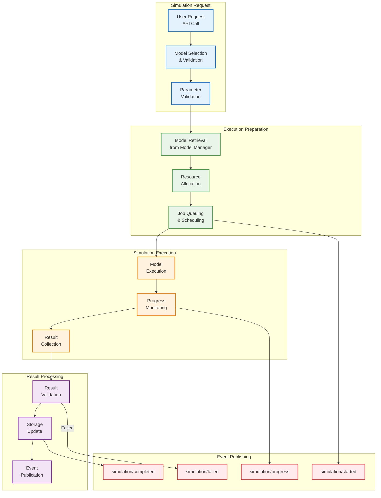
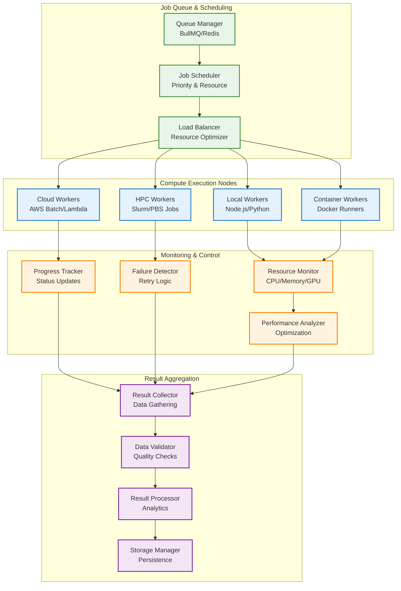
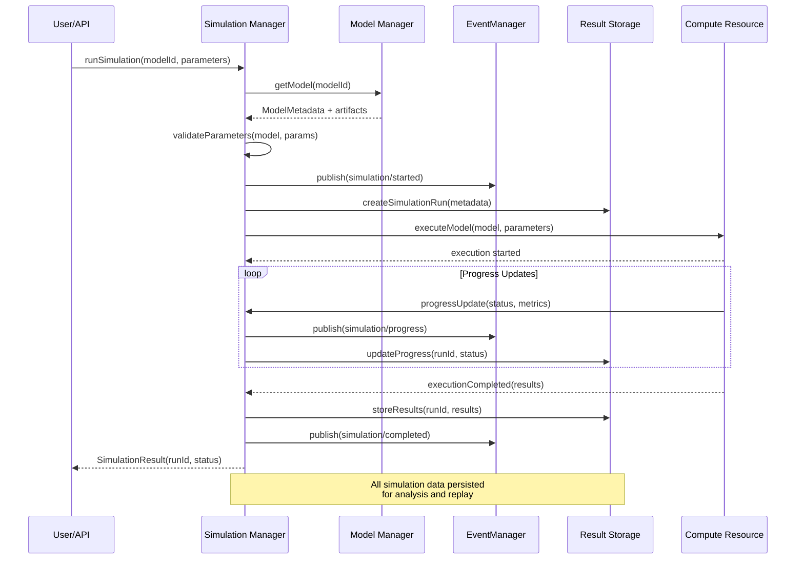

# DADMS Simulation Manager Service Specification

## 1. Purpose & Responsibilities

The `SimulationManager` serves as the execution orchestration hub for computational simulations in DADMS's Event-Driven System (EDS), providing scalable, observable, and resilient simulation execution capabilities across diverse computational models and distributed computing resources.

### Core Responsibilities

- **Simulation Orchestration**: Execute simulations for registered models from Model Manager
- **Execution Scaling**: Scale simulations across local, distributed, and cloud compute resources  
- **Parameter Management**: Handle run-specific configurations, parameter sweeps, and Monte Carlo simulations
- **Result Management**: Collect, store, and organize simulation outputs in queryable formats
- **Resource Optimization**: Efficient job scheduling, resource allocation, and compute optimization
- **Monitoring & Observability**: Real-time execution monitoring, logging, and performance analytics
- **Fault Tolerance**: Retry mechanisms, run isolation, and graceful error handling
- **Traceability**: Complete audit trail of simulation runs, parameters, and results

## 2. Architecture & Integration Diagrams

### 2.1 Simulation Manager System Architecture

```mermaid
%%{init: { 'flowchart': { 'curve': 'orthogonal' }}}%%
flowchart TD
    subgraph External["External Triggers"]
        UserInterface["User Interface<br/>Manual Triggers"]
        EventLoop["Event Loop<br/>Automated Workflows"]
        API["External API<br/>Clients"]
    end
    
    subgraph SimulationManager["Simulation Manager (Port 3011)"]
        API_Layer["REST API Layer"]
        JobScheduler["Job Scheduler<br/>& Queue Manager"]
        ExecutionEngine["Execution Engine<br/>& Resource Manager"]
        ResultCollector["Result Collector<br/>& Storage"]
        MonitoringAgent["Monitoring Agent<br/>& Health Tracker"]
    end
    
    subgraph DADMS_Services["DADMS Services"]
        ModelManager["Model Manager<br/>(Port 3010)"]
        EventManager["EventManager<br/>(Port 3004)"]
        AnalysisManager["Analysis Manager<br/>(Future)"]
        KnowledgeService["Knowledge Service<br/>(Port 3003)"]
    end
    
    subgraph ComputeResources["Compute Resources"]
        LocalCompute["Local Compute<br/>Node.js Workers"]
        ContainerRuntime["Container Runtime<br/>Docker/Podman"]
        CloudCompute["Cloud Compute<br/>AWS Batch/K8s Jobs"]
        HPC["HPC Clusters<br/>Slurm/PBS"]
    end
    
    subgraph Storage["Storage & Data"]
        JobQueue["Job Queue<br/>Redis/BullMQ"]
        SimulationDB["Simulation DB<br/>PostgreSQL"]
        ResultStore["Result Store<br/>MinIO/S3"]
        VectorStore["Vector Store<br/>Qdrant"]
    end
    
    %% External inputs
    UserInterface --> API_Layer
    EventLoop --> API_Layer
    API --> API_Layer
    
    %% Internal components
    API_Layer --> JobScheduler
    JobScheduler --> ExecutionEngine
    ExecutionEngine --> ResultCollector
    MonitoringAgent --> JobScheduler
    MonitoringAgent --> ExecutionEngine
    
    %% Service integrations
    API_Layer <--> ModelManager
    API_Layer --> EventManager
    ResultCollector --> AnalysisManager
    ResultCollector --> KnowledgeService
    
    %% Compute resources
    ExecutionEngine --> LocalCompute
    ExecutionEngine --> ContainerRuntime
    ExecutionEngine --> CloudCompute
    ExecutionEngine --> HPC
    
    %% Storage connections
    JobScheduler --> JobQueue
    API_Layer --> SimulationDB
    ResultCollector --> SimulationDB
    ResultCollector --> ResultStore
    ResultCollector --> VectorStore
    
    classDef external fill:#ffebee,stroke:#d32f2f,stroke-width:2px;
    classDef simManager fill:#e8f5e8,stroke:#388e3c,stroke-width:3px;
    classDef service fill:#e3f2fd,stroke:#1976d2,stroke-width:2px;
    classDef compute fill:#fff3e0,stroke:#f57c00,stroke-width:2px;
    classDef storage fill:#f3e5f5,stroke:#7b1fa2,stroke-width:2px;
    
    class UserInterface,EventLoop,API external;
    class API_Layer,JobScheduler,ExecutionEngine,ResultCollector,MonitoringAgent simManager;
    class ModelManager,EventManager,AnalysisManager,KnowledgeService service;
    class LocalCompute,ContainerRuntime,CloudCompute,HPC compute;
    class JobQueue,SimulationDB,ResultStore,VectorStore storage;
```


### 2.2 Simulation Execution Workflow


### 2.3 Scalable Execution Architecture


### 2.4 Integration Sequence with Model Manager


## 3. Data Models & Schema

### 3.1 Core Simulation Schemas
```typescript
interface SimulationRun {
  id: string;                    // UUID for unique identification
  name: string;                  // Human-readable run name
  model_id: string;              // Reference to Model Manager model
  model_version: string;         // Model version used
  simulation_type: SimulationType; // Type of simulation
  status: SimulationStatus;      // Current execution status
  
  // Configuration
  parameters: SimulationParameters; // Input parameters
  configuration: ExecutionConfig; // Execution configuration
  resource_requirements: ResourceRequirements; // Compute requirements
  
  // Execution Details
  started_at?: Date;             // Execution start time
  completed_at?: Date;           // Execution completion time
  duration_seconds?: number;     // Total execution time
  progress_percent: number;      // Current progress (0-100)
  
  // Results
  results?: SimulationResults;   // Simulation outputs
  metrics: ExecutionMetrics;     // Performance metrics
  artifacts: ResultArtifact[];   // Output files and data
  
  // Metadata
  created_by: string;            // User who initiated run
  tags: string[];                // Searchable tags
  description?: string;          // Run description
  project_id?: string;           // Associated project
  
  // Tracking
  created_at: Date;
  updated_at: Date;
  retry_count: number;           // Number of retry attempts
  error_message?: string;        // Error details if failed
}

enum SimulationType {
  DETERMINISTIC = "deterministic",    // Single deterministic run
  MONTE_CARLO = "monte_carlo",       // Monte Carlo simulation
  PARAMETER_SWEEP = "parameter_sweep", // Parameter space exploration
  SENSITIVITY_ANALYSIS = "sensitivity_analysis", // Sensitivity analysis
  OPTIMIZATION = "optimization",     // Optimization runs
  SCENARIO_BASED = "scenario_based", // Scenario-based simulation
  BATCH = "batch"                    // Batch processing
}

enum SimulationStatus {
  QUEUED = "queued",                 // Waiting in queue
  PREPARING = "preparing",           // Preparing for execution
  RUNNING = "running",               // Currently executing
  COMPLETED = "completed",           // Successfully completed
  FAILED = "failed",                 // Execution failed
  CANCELLED = "cancelled",           // User cancelled
  TIMEOUT = "timeout",               // Execution timed out
  RETRYING = "retrying"              // Retrying after failure
}
```

### 3.2 Execution Configuration
```typescript
interface ExecutionConfig {
  execution_mode: ExecutionMode;     // Local, container, cloud, etc.
  timeout_minutes: number;           // Maximum execution time
  retry_policy: RetryPolicy;         // Retry configuration
  scaling_policy: ScalingPolicy;     // Auto-scaling configuration
  environment_variables: Record<string, string>; // Environment setup
  compute_target: ComputeTarget;     // Target compute environment
  priority: ExecutionPriority;       // Job priority level
}

enum ExecutionMode {
  LOCAL = "local",                   // Local process execution
  CONTAINER = "container",           // Containerized execution
  CLOUD_BATCH = "cloud_batch",       // Cloud batch processing
  HPC_CLUSTER = "hpc_cluster",       // HPC cluster execution
  SERVERLESS = "serverless",         // Serverless functions
  DISTRIBUTED = "distributed"       // Distributed computing
}

interface RetryPolicy {
  max_retries: number;               // Maximum retry attempts
  retry_delay_seconds: number;       // Delay between retries
  exponential_backoff: boolean;      // Use exponential backoff
  retry_on_failure_types: string[]; // Specific failures to retry
}

interface ScalingPolicy {
  min_instances: number;             // Minimum compute instances
  max_instances: number;             // Maximum compute instances
  scale_up_threshold: number;        // CPU threshold for scaling up
  scale_down_threshold: number;      // CPU threshold for scaling down
  auto_scaling_enabled: boolean;     // Enable automatic scaling
}

interface ComputeTarget {
  provider: ComputeProvider;         // Compute provider
  instance_type: string;             // Instance/node type
  region?: string;                   // Geographic region
  availability_zone?: string;        // Specific availability zone
  custom_image?: string;             // Custom container/VM image
}

enum ComputeProvider {
  LOCAL = "local",
  AWS_BATCH = "aws_batch",
  AWS_LAMBDA = "aws_lambda",
  AZURE_BATCH = "azure_batch",
  GCP_COMPUTE = "gcp_compute",
  KUBERNETES = "kubernetes",
  SLURM = "slurm",
  PBS = "pbs"
}

enum ExecutionPriority {
  LOW = 0,
  NORMAL = 1,
  HIGH = 2,
  CRITICAL = 3
}
```

### 3.3 Simulation Parameters & Results
```typescript
interface SimulationParameters {
  inputs: Record<string, any>;       // Model input parameters
  parameter_sets?: ParameterSet[];   // Multiple parameter combinations
  random_seed?: number;              // Random seed for reproducibility
  monte_carlo_runs?: number;         // Number of MC iterations
  sweep_configuration?: SweepConfig; // Parameter sweep settings
}

interface ParameterSet {
  set_id: string;                    // Unique parameter set ID
  parameters: Record<string, any>;   // Parameter values
  weight?: number;                   // Weight for weighted runs
  description?: string;              // Parameter set description
}

interface SweepConfig {
  parameter_ranges: ParameterRange[]; // Parameters to sweep
  sampling_method: SamplingMethod;   // Sampling strategy
  total_samples: number;             // Total number of samples
}

interface ParameterRange {
  parameter_name: string;            // Parameter to vary
  min_value: number;                 // Minimum value
  max_value: number;                 // Maximum value
  step_size?: number;                // Step size for discrete sweep
  distribution?: string;             // Distribution for random sampling
}

enum SamplingMethod {
  GRID = "grid",                     // Grid sampling
  RANDOM = "random",                 // Random sampling
  LATIN_HYPERCUBE = "latin_hypercube", // Latin hypercube sampling
  SOBOL = "sobol",                   // Sobol sequence
  HALTON = "halton"                  // Halton sequence
}

interface SimulationResults {
  outputs: Record<string, any>;      // Primary simulation outputs
  summary_statistics: SummaryStats;  // Statistical summary
  convergence_metrics?: ConvergenceMetrics; // Convergence analysis
  sensitivity_indices?: SensitivityIndices; // Sensitivity analysis
  time_series?: TimeSeriesData[];    // Time-dependent outputs
  spatial_data?: SpatialData[];      // Spatial/geographic outputs
}

interface SummaryStats {
  mean: Record<string, number>;      // Mean values
  std_dev: Record<string, number>;   // Standard deviations
  min: Record<string, number>;       // Minimum values
  max: Record<string, number>;       // Maximum values
  percentiles: Record<string, Record<string, number>>; // Percentile values
}
```

### 3.4 Resource Management & Monitoring
```typescript
interface ResourceRequirements {
  cpu_cores: number;                 // Required CPU cores
  memory_gb: number;                 // Required memory in GB
  gpu_count?: number;                // Required GPU count
  gpu_memory_gb?: number;            // Required GPU memory
  storage_gb: number;                // Required storage space
  network_bandwidth_mbps?: number;   // Network bandwidth needs
  estimated_runtime_minutes: number; // Estimated execution time
}

interface ExecutionMetrics {
  resource_usage: ResourceUsage;     // Actual resource consumption
  performance_metrics: PerformanceMetrics; // Performance indicators
  cost_metrics?: CostMetrics;        // Cost tracking
  environmental_metrics?: EnvironmentalMetrics; // Carbon footprint
}

interface ResourceUsage {
  peak_cpu_percent: number;          // Peak CPU usage
  average_cpu_percent: number;       // Average CPU usage
  peak_memory_gb: number;            // Peak memory usage
  average_memory_gb: number;         // Average memory usage
  gpu_utilization_percent?: number;  // GPU utilization
  network_io_gb: number;             // Network I/O
  disk_io_gb: number;                // Disk I/O
}

interface PerformanceMetrics {
  throughput: number;                // Operations per second
  latency_ms: number;                // Response latency
  convergence_rate?: number;         // Convergence speed
  numerical_stability?: number;      // Numerical stability score
  accuracy_metrics?: Record<string, number>; // Accuracy measures
}

interface CostMetrics {
  compute_cost_usd: number;          // Compute cost
  storage_cost_usd: number;          // Storage cost
  network_cost_usd: number;          // Network cost
  total_cost_usd: number;            // Total cost
  cost_per_simulation: number;       // Unit cost
}
```

## 4. API Specification

### 4.1 Core Simulation Manager Interface
```typescript
interface SimulationManager {
  // Simulation Execution
  runSimulation(request: SimulationRequest): Promise<SimulationRun>;
  runBatchSimulation(requests: BatchSimulationRequest): Promise<BatchSimulationResult>;
  cancelSimulation(runId: string): Promise<void>;
  retrySimulation(runId: string): Promise<SimulationRun>;
  
  // Status & Monitoring
  getSimulationStatus(runId: string): Promise<SimulationRun>;
  getSimulationProgress(runId: string): Promise<ProgressUpdate>;
  getSimulationLogs(runId: string): Promise<ExecutionLog[]>;
  getSimulationMetrics(runId: string): Promise<ExecutionMetrics>;
  
  // Query & Discovery
  listSimulations(filter?: SimulationFilter): Promise<SimulationSummary[]>;
  searchSimulations(query: string, filter?: SimulationFilter): Promise<SimulationSearchResult[]>;
  getSimulationHistory(modelId: string): Promise<SimulationRun[]>;
  
  // Results & Analytics
  getSimulationResults(runId: string): Promise<SimulationResults>;
  downloadResultArtifacts(runId: string, artifactName?: string): Promise<Blob>;
  compareSimulations(runIds: string[]): Promise<SimulationComparison>;
  getResultSummary(runIds: string[]): Promise<ResultSummary>;
  
  // Resource Management
  getResourceUsage(): Promise<ResourceUsageReport>;
  getQueueStatus(): Promise<QueueStatus>;
  estimateExecutionCost(request: SimulationRequest): Promise<CostEstimate>;
  
  // Configuration
  getComputeTargets(): Promise<ComputeTarget[]>;
  validateSimulationRequest(request: SimulationRequest): Promise<ValidationResult>;
}

interface SimulationRequest {
  model_id: string;                  // Model to execute
  model_version?: string;            // Specific model version
  name?: string;                     // Simulation run name
  description?: string;              // Run description
  parameters: SimulationParameters;  // Input parameters
  configuration?: ExecutionConfig;   // Execution configuration
  tags?: string[];                   // Run tags
  project_id?: string;               // Associated project
}

interface BatchSimulationRequest {
  base_request: SimulationRequest;   // Base simulation configuration
  parameter_variations: ParameterSet[]; // Parameter variations
  execution_mode: BatchExecutionMode; // Sequential or parallel
  max_concurrent_runs?: number;      // Concurrent execution limit
}

enum BatchExecutionMode {
  SEQUENTIAL = "sequential",         // Run simulations sequentially
  PARALLEL = "parallel",             // Run simulations in parallel
  ADAPTIVE = "adaptive"              // Adapt based on resources
}
```

### 4.2 REST API Endpoints
```typescript
// Simulation Execution
POST   /api/v1/simulations              // Run new simulation
POST   /api/v1/simulations/batch        // Run batch simulations
POST   /api/v1/simulations/{id}/cancel  // Cancel simulation
POST   /api/v1/simulations/{id}/retry   // Retry simulation

// Status & Monitoring  
GET    /api/v1/simulations/{id}         // Get simulation details
GET    /api/v1/simulations/{id}/status  // Get status update
GET    /api/v1/simulations/{id}/progress // Get progress info
GET    /api/v1/simulations/{id}/logs    // Get execution logs
GET    /api/v1/simulations/{id}/metrics // Get performance metrics

// Query & Discovery
GET    /api/v1/simulations              // List simulations
GET    /api/v1/simulations/search       // Search simulations
GET    /api/v1/models/{id}/simulations  // Get model simulation history

// Results & Analytics
GET    /api/v1/simulations/{id}/results // Get simulation results
GET    /api/v1/simulations/{id}/artifacts/{name} // Download artifacts
POST   /api/v1/simulations/compare      // Compare multiple runs
POST   /api/v1/simulations/summary      // Get result summary

// Resource Management
GET    /api/v1/resources/usage          // Get resource usage
GET    /api/v1/queue/status             // Get queue status
POST   /api/v1/simulations/estimate     // Estimate execution cost

// Configuration
GET    /api/v1/compute-targets          // Get available compute targets
POST   /api/v1/simulations/validate     // Validate simulation request
```

## 5. Event-Driven Integration

### 5.1 EventManager Integration
The Simulation Manager publishes events to and subscribes to events from the EventManager for real-time system coordination:

#### Published Events
```typescript
// Simulation lifecycle events
'simulation/requested'        // Simulation request received
'simulation/queued'          // Simulation added to queue
'simulation/started'         // Simulation execution started
'simulation/progress'        // Progress update during execution
'simulation/completed'       // Simulation completed successfully
'simulation/failed'          // Simulation execution failed
'simulation/cancelled'       // Simulation cancelled by user
'simulation/retried'         // Simulation retry initiated

// Resource events
'simulation/resource/allocated'   // Resources allocated for simulation
'simulation/resource/released'    // Resources released after simulation
'simulation/queue/status'         // Queue status changes

// Result events
'simulation/results/available'    // Results ready for download
'simulation/results/analyzed'     // Results processed and analyzed
```

#### Subscribed Events
```typescript
// Model events
'model/updated'              // Model updated - may affect running sims
'model/deprecated'           // Model deprecated - handle gracefully

// Project events  
'project/deleted'            // Project deleted - cleanup simulations

// System events
'system/maintenance'         // System maintenance - pause new jobs
'system/resource/low'        // Low resources - adjust scheduling
```

### 5.2 Event Payload Examples
```typescript
interface SimulationStartedEvent {
  type: 'simulation/started';
  payload: {
    simulation_id: string;
    model_id: string;
    model_version: string;
    started_by: string;
    estimated_duration_minutes: number;
    resource_allocation: ResourceRequirements;
    project_id?: string;
  };
}

interface SimulationProgressEvent {
  type: 'simulation/progress';
  payload: {
    simulation_id: string;
    progress_percent: number;
    current_phase: string;
    estimated_completion: Date;
    resource_usage: ResourceUsage;
  };
}

interface SimulationCompletedEvent {
  type: 'simulation/completed';
  payload: {
    simulation_id: string;
    duration_seconds: number;
    total_cost_usd?: number;
    result_summary: {
      output_count: number;
      artifact_count: number;
      data_size_mb: number;
    };
    performance_metrics: PerformanceMetrics;
  };
}
```

## 6. Integration Architecture

### 6.1 Model Manager Integration
```typescript
interface ModelManagerIntegration {
  // Retrieve model for execution
  getModelForExecution(modelId: string, version?: string): Promise<ExecutableModel>;
  
  // Report simulation usage back to model
  reportModelUsage(modelId: string, simulationId: string, metrics: UsageMetrics): Promise<void>;
  
  // Validate model compatibility
  validateModelCompatibility(modelId: string, parameters: any): Promise<CompatibilityCheck>;
}

interface ExecutableModel {
  metadata: ModelMetadata;           // Model metadata from Model Manager
  artifacts: ModelArtifact[];        // Model files and dependencies
  execution_runtime: ExecutionRuntime; // Runtime environment info
  validation_schema: JsonSchema;     // Input validation schema
}

interface ExecutionRuntime {
  runtime_type: string;              // python, matlab, docker, etc.
  runtime_version: string;           // Runtime version
  dependencies: string[];            // Required dependencies
  entry_point: string;               // Execution entry point
  environment_setup: string[];       // Setup commands
}
```

### 6.2 Knowledge Service Integration
```typescript
interface KnowledgeServiceIntegration {
  // Index simulation metadata for search
  indexSimulationMetadata(simulation: SimulationRun): Promise<void>;
  
  // Store simulation context in vector store
  storeSimulationContext(simulationId: string, context: SimulationContext): Promise<void>;
  
  // Search similar simulations
  findSimilarSimulations(parameters: any, modelId?: string): Promise<SimulationSummary[]>;
}

interface SimulationContext {
  simulation_id: string;
  model_context: string;             // Model description and purpose
  parameter_context: string;         // Parameter meanings and values
  result_context: string;            // Result interpretation
  execution_context: string;         // Execution environment details
}
```

### 6.3 Analysis Manager Integration
```typescript
interface AnalysisManagerIntegration {
  // Send results for analysis
  submitForAnalysis(simulationId: string, analysisType: string[]): Promise<string>;
  
  // Trigger automated analysis workflows
  triggerAnalysisWorkflow(results: SimulationResults, workflowId: string): Promise<void>;
  
  // Get analysis results
  getAnalysisResults(simulationId: string): Promise<AnalysisResults>;
}
```

## 7. Storage Architecture

### 7.1 Database Schema (PostgreSQL)
```sql
-- Simulation runs table
CREATE TABLE simulation_runs (
  id UUID PRIMARY KEY DEFAULT gen_random_uuid(),
  name VARCHAR(255) NOT NULL,
  model_id UUID NOT NULL,
  model_version VARCHAR(50) NOT NULL,
  simulation_type simulation_type_enum NOT NULL,
  status simulation_status_enum NOT NULL DEFAULT 'queued',
  parameters JSONB NOT NULL,
  configuration JSONB,
  resource_requirements JSONB,
  started_at TIMESTAMP WITH TIME ZONE,
  completed_at TIMESTAMP WITH TIME ZONE,
  duration_seconds INTEGER,
  progress_percent INTEGER DEFAULT 0,
  results JSONB,
  metrics JSONB,
  created_by VARCHAR(255) NOT NULL,
  description TEXT,
  project_id UUID,
  created_at TIMESTAMP WITH TIME ZONE DEFAULT NOW(),
  updated_at TIMESTAMP WITH TIME ZONE DEFAULT NOW(),
  retry_count INTEGER DEFAULT 0,
  error_message TEXT
);

-- Simulation artifacts table
CREATE TABLE simulation_artifacts (
  id UUID PRIMARY KEY DEFAULT gen_random_uuid(),
  simulation_id UUID NOT NULL REFERENCES simulation_runs(id) ON DELETE CASCADE,
  name VARCHAR(255) NOT NULL,
  type artifact_type_enum NOT NULL,
  path VARCHAR(500) NOT NULL,
  size BIGINT NOT NULL,
  hash VARCHAR(64) NOT NULL,
  mime_type VARCHAR(100),
  description TEXT,
  created_at TIMESTAMP WITH TIME ZONE DEFAULT NOW(),
  UNIQUE(simulation_id, name)
);

-- Execution logs table
CREATE TABLE execution_logs (
  id UUID PRIMARY KEY DEFAULT gen_random_uuid(),
  simulation_id UUID NOT NULL REFERENCES simulation_runs(id) ON DELETE CASCADE,
  timestamp TIMESTAMP WITH TIME ZONE DEFAULT NOW(),
  level log_level_enum NOT NULL,
  message TEXT NOT NULL,
  component VARCHAR(100),
  metadata JSONB
);

-- Resource usage tracking
CREATE TABLE resource_usage (
  id UUID PRIMARY KEY DEFAULT gen_random_uuid(),
  simulation_id UUID NOT NULL REFERENCES simulation_runs(id) ON DELETE CASCADE,
  timestamp TIMESTAMP WITH TIME ZONE DEFAULT NOW(),
  cpu_percent DECIMAL(5,2),
  memory_gb DECIMAL(8,3),
  gpu_percent DECIMAL(5,2),
  network_io_mb DECIMAL(10,3),
  disk_io_mb DECIMAL(10,3)
);

-- Simulation tags table
CREATE TABLE simulation_tags (
  simulation_id UUID NOT NULL REFERENCES simulation_runs(id) ON DELETE CASCADE,
  tag VARCHAR(100) NOT NULL,
  PRIMARY KEY (simulation_id, tag)
);

-- Indexes for performance
CREATE INDEX idx_simulation_runs_model_id ON simulation_runs(model_id);
CREATE INDEX idx_simulation_runs_status ON simulation_runs(status);
CREATE INDEX idx_simulation_runs_created_by ON simulation_runs(created_by);
CREATE INDEX idx_simulation_runs_project_id ON simulation_runs(project_id);
CREATE INDEX idx_simulation_runs_created_at ON simulation_runs(created_at DESC);
CREATE INDEX idx_execution_logs_simulation_id ON execution_logs(simulation_id);
CREATE INDEX idx_resource_usage_simulation_id ON resource_usage(simulation_id);
```

### 7.2 Object Storage Structure (MinIO)
```
/simulations/
├── {simulation_id}/
│   ├── inputs/
│   │   ├── parameters.json
│   │   ├── model_artifacts/
│   │   └── configuration.json
│   ├── outputs/
│   │   ├── results.json
│   │   ├── data_files/
│   │   ├── plots/
│   │   └── reports/
│   ├── logs/
│   │   ├── execution.log
│   │   ├── error.log
│   │   └── performance.log
│   └── metadata/
│       ├── run_metadata.json
│       ├── resource_usage.json
│       └── provenance.json
```

## 8. Non-Functional Requirements

### 8.1 Performance & Scalability
- **Throughput**: Support 1,000+ concurrent simulations
- **Queue Management**: Handle 10,000+ queued jobs efficiently
- **Response Time**: API responses < 200ms for status queries
- **Batch Processing**: Support parameter sweeps with 100,000+ runs
- **Auto-scaling**: Dynamic resource allocation based on queue depth

### 8.2 Reliability & Fault Tolerance
- **Availability**: 99.9% uptime for simulation orchestration
- **Fault Recovery**: Automatic retry with exponential backoff
- **Data Integrity**: Atomic operations with rollback capability
- **Graceful Degradation**: Continue operation during partial failures
- **Circuit Breakers**: Isolate failing compute resources

### 8.3 Security & Compliance
- **Authentication**: JWT-based with service-to-service auth
- **Authorization**: Fine-grained RBAC for simulation access
- **Data Encryption**: Encrypt sensitive simulation data at rest
- **Audit Logging**: Complete audit trail for compliance
- **Resource Isolation**: Secure execution environments

### 8.4 Monitoring & Observability
- **Real-time Monitoring**: Live execution status and metrics
- **Performance Analytics**: Resource utilization optimization
- **Cost Tracking**: Detailed cost analysis and optimization
- **Alerting**: Proactive alerts for failures and resource issues
- **Distributed Tracing**: End-to-end execution tracing

## 9. Implementation Roadmap

### 9.1 Phase 1: Core Simulation Engine (Weeks 1-2)
- [ ] Basic simulation execution framework
- [ ] Model Manager integration
- [ ] Local compute execution
- [ ] Simple job queuing with Redis/BullMQ
- [ ] Basic result storage and retrieval
- [ ] REST API endpoints for core functionality

### 9.2 Phase 2: Scalability & Monitoring (Weeks 3-4)
- [ ] Container-based execution (Docker)
- [ ] Resource monitoring and management
- [ ] Advanced queue management and prioritization
- [ ] EventManager integration
- [ ] Performance metrics and logging
- [ ] Basic fault tolerance and retry logic

### 9.3 Phase 3: Advanced Features (Weeks 5-6)
- [ ] Cloud compute integration (AWS Batch/Lambda)
- [ ] Parameter sweep and Monte Carlo capabilities
- [ ] Result analytics and comparison tools
- [ ] Knowledge Service integration
- [ ] Advanced monitoring and alerting
- [ ] Cost tracking and optimization

### 9.4 Phase 4: Enterprise Features (Weeks 7-8)
- [ ] HPC cluster integration (Slurm/PBS)
- [ ] Advanced scheduling algorithms
- [ ] Multi-tenant resource isolation
- [ ] Compliance and audit features
- [ ] Performance optimization
- [ ] Documentation and training materials

## 10. Technology Stack

### 10.1 Core Services
- **Runtime**: Node.js with TypeScript
- **Framework**: Express.js with OpenAPI documentation
- **Job Queue**: BullMQ with Redis for job management
- **Database**: PostgreSQL with Prisma ORM
- **Object Storage**: MinIO S3-compatible storage
- **Container Runtime**: Docker with container orchestration

### 10.2 Compute Integration
- **Local Execution**: Node.js child processes and worker threads
- **Container Execution**: Docker API integration
- **Cloud Compute**: AWS SDK for Batch/Lambda integration
- **HPC Integration**: SSH-based job submission and monitoring
- **Kubernetes**: K8s API for pod-based execution

### 10.3 Monitoring & Analytics
- **Metrics**: Prometheus with custom metrics
- **Logging**: Structured JSON logging with Winston
- **Tracing**: OpenTelemetry for distributed tracing
- **Alerting**: Grafana for dashboards and alerts
- **Cost Tracking**: Custom cost analytics service

## 11. Port Allocation & Service Configuration

### 11.1 Service Configuration
- **Port**: 3011 (following DADMS port allocation pattern)
- **Health Check**: `GET /health`
- **Metrics**: `GET /metrics` (Prometheus format)
- **API Base**: `/api/v1`
- **Documentation**: `/docs` (Swagger UI)
- **WebSocket**: `/ws` (real-time updates)

### 11.2 Environment Configuration
```typescript
interface SimulationManagerConfig {
  PORT: number;                    // Service port (default: 3011)
  DATABASE_URL: string;            // PostgreSQL connection string
  REDIS_URL: string;               // Redis connection string
  MINIO_ENDPOINT: string;          // MinIO endpoint
  MINIO_ACCESS_KEY: string;        // MinIO access key
  MINIO_SECRET_KEY: string;        // MinIO secret key
  MINIO_BUCKET: string;            // Simulations bucket name
  
  // Service Integration
  MODEL_MANAGER_URL: string;       // Model Manager service URL
  EVENTMANAGER_URL: string;        // EventManager service URL
  KNOWLEDGE_SERVICE_URL: string;   // Knowledge Service URL
  
  // Execution Configuration
  MAX_CONCURRENT_JOBS: number;     // Maximum concurrent executions
  DEFAULT_TIMEOUT_MINUTES: number; // Default execution timeout
  MAX_RETRY_ATTEMPTS: number;      // Maximum retry attempts
  
  // Security
  JWT_SECRET: string;              // JWT signing secret
  ENCRYPTION_KEY: string;          // Data encryption key
  
  // Cloud Configuration (optional)
  AWS_ACCESS_KEY_ID?: string;      // AWS credentials
  AWS_SECRET_ACCESS_KEY?: string;  // AWS credentials
  AWS_REGION?: string;             // AWS region
  AWS_BATCH_JOB_QUEUE?: string;    // AWS Batch job queue
}
```

## 12. Success Metrics & KPIs

### 12.1 Performance Metrics
- **Execution Latency**: Simulation start time < 30 seconds
- **Queue Processing**: Queue drain rate > 100 jobs/minute
- **Resource Utilization**: Average compute utilization > 75%
- **API Response Time**: 95th percentile < 200ms
- **System Throughput**: 1,000+ concurrent simulations

### 12.2 Business Metrics
- **Simulation Success Rate**: >95% successful completion rate
- **User Adoption**: Number of simulations per month
- **Cost Efficiency**: Cost per simulation optimization
- **Time to Results**: Average simulation turnaround time
- **Resource Efficiency**: Compute cost per successful simulation

### 12.3 Quality Metrics
- **Test Coverage**: >90% code coverage
- **API Uptime**: 99.9% availability
- **Data Integrity**: Zero data loss incidents
- **Security Compliance**: All security audits passed
- **Documentation Coverage**: 100% API documentation

This specification provides a comprehensive foundation for implementing the DADMS Simulation Manager Service as a production-ready, scalable component that seamlessly integrates with the existing Event-Driven System architecture. 