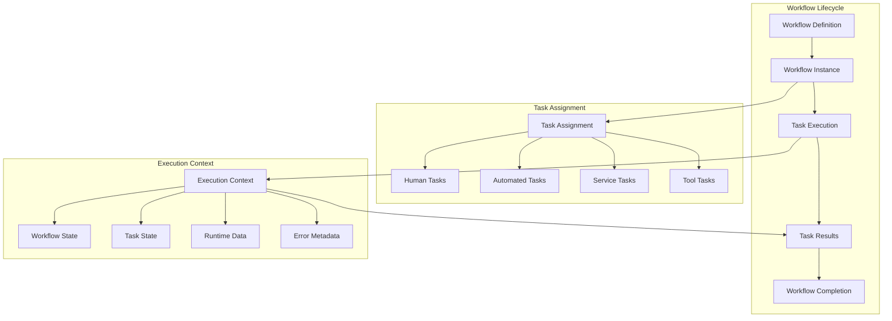
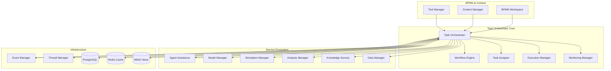
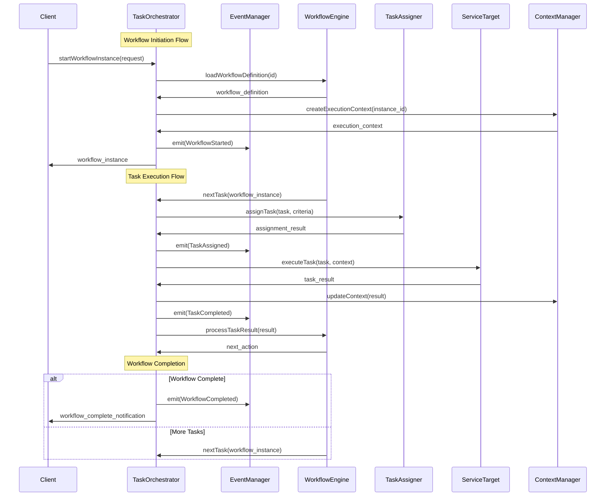
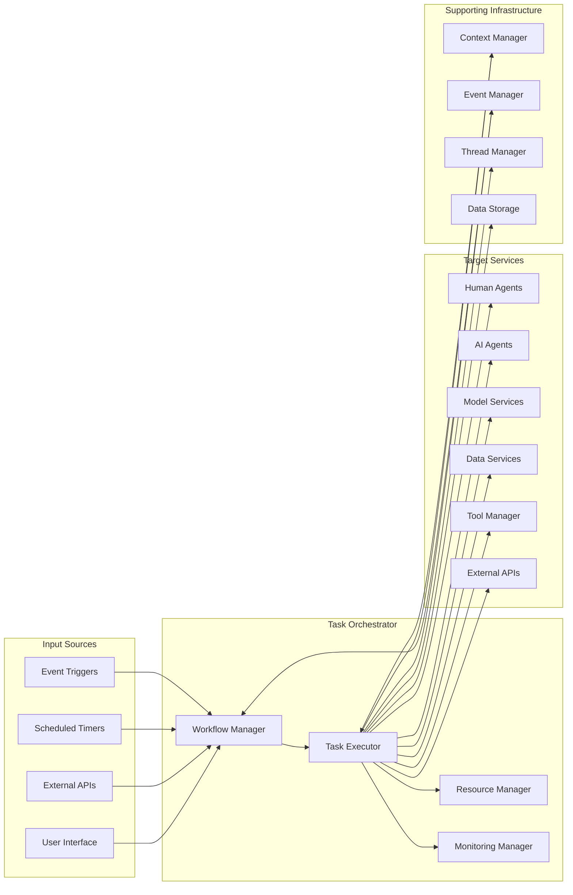
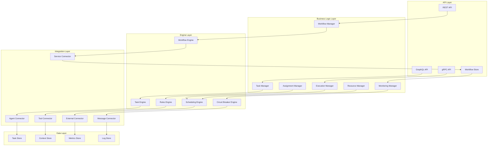

# DADMS 2.0 - Task Orchestrator Service Specification

## Executive Summary

The **Task Orchestrator Service** serves as the central execution engine for DADMS 2.0's Event-Driven System (EDS), orchestrating complex workflows and managing task execution across the entire service ecosystem. This service bridges BPMN process models with intelligent task assignment, dynamic service coordination, and comprehensive execution monitoring.

**Key Capabilities:**
- **Workflow Orchestration**: Load, parse, and execute BPMN process models with full lifecycle management
- **Intelligent Task Assignment**: Dynamic assignment to agents (human/AI), services, tools, and external APIs
- **Robust Execution**: Fault-tolerant execution with retry policies, error recovery, and transaction management
- **Real-time Monitoring**: Comprehensive observability with execution tracking, performance metrics, and audit trails
- **Context-Aware Coordination**: Integration with Context Manager for situational awareness and intelligent decision-making

## Purpose & Responsibilities

### Core Orchestration Engine
- **BPMN Workflow Management**: Load, validate, and execute BPMN 2.0 process definitions
- **Dynamic Task Scheduling**: Intelligent scheduling and coordination of workflow tasks across the service ecosystem
- **Service Integration**: Seamless coordination with all DADMS services, external APIs, and tool integrations
- **Execution Context Management**: Maintain comprehensive execution state and context throughout workflow instances

### Intelligent Task Assignment & Execution
- **Multi-Modal Task Assignment**: Assign tasks to humans, AI agents, automated services, and external tools
- **Service Orchestration**: Coordinate execution across Model Manager, Simulation Manager, Analysis Manager, and other services
- **Tool Integration**: Leverage Tool Manager for dynamic access to domain-specific utilities and calculators
- **External API Management**: Handle integrations with third-party services and cloud providers

### Reliability & Observability
- **Fault-Tolerant Execution**: Robust error handling, retry mechanisms, and failure recovery
- **Comprehensive Monitoring**: Real-time execution tracking, performance metrics, and health monitoring
- **Audit & Compliance**: Complete audit trails for workflow execution, task assignments, and results
- **Event-Driven Integration**: Seamless integration with Event Manager for workflow triggers and status updates

## Core Concepts & Data Models

### Workflow Management Framework



### TypeScript Data Models

```typescript
// Core Workflow Models
interface WorkflowDefinition {
  id: string;
  name: string;
  description?: string;
  version: string;
  bpmn_content: string;
  bpmn_format: 'xml' | 'json';
  created_at: Date;
  updated_at: Date;
  created_by: string;
  status: WorkflowDefinitionStatus;
  validation_result?: ValidationResult;
  metadata: {
    category?: string;
    tags?: string[];
    complexity_score?: number;
    estimated_duration?: number;
    dependencies?: string[];
  };
}

enum WorkflowDefinitionStatus {
  DRAFT = 'draft',
  VALIDATED = 'validated',
  PUBLISHED = 'published',
  DEPRECATED = 'deprecated',
  ARCHIVED = 'archived'
}

interface WorkflowInstance {
  id: string;
  workflow_definition_id: string;
  name: string;
  description?: string;
  status: WorkflowInstanceStatus;
  priority: TaskPriority;
  initiated_by: string;
  initiated_at: Date;
  started_at?: Date;
  completed_at?: Date;
  cancelled_at?: Date;
  input_data: Record<string, any>;
  output_data?: Record<string, any>;
  execution_context: ExecutionContext;
  tasks: Task[];
  events: WorkflowEvent[];
  metadata: {
    project_id?: string;
    parent_workflow_id?: string;
    correlation_id?: string;
    business_key?: string;
    environment?: string;
  };
}

enum WorkflowInstanceStatus {
  PENDING = 'pending',
  RUNNING = 'running',
  SUSPENDED = 'suspended',
  COMPLETED = 'completed',
  FAILED = 'failed',
  CANCELLED = 'cancelled',
  TERMINATED = 'terminated'
}

// Task Management Models
interface Task {
  id: string;
  workflow_instance_id: string;
  task_definition_key: string;
  name: string;
  description?: string;
  type: TaskType;
  status: TaskStatus;
  priority: TaskPriority;
  created_at: Date;
  started_at?: Date;
  completed_at?: Date;
  cancelled_at?: Date;
  due_date?: Date;
  input_data: Record<string, any>;
  output_data?: Record<string, any>;
  assignment: TaskAssignment;
  execution_config: TaskExecutionConfig;
  retry_config: RetryConfig;
  results: TaskResult[];
  events: TaskEvent[];
  dependencies: string[];
  metadata: {
    bpmn_element_id?: string;
    sequence_number?: number;
    parallel_group?: string;
    estimated_duration?: number;
    actual_duration?: number;
  };
}

enum TaskType {
  HUMAN_TASK = 'human_task',
  SERVICE_TASK = 'service_task',
  SCRIPT_TASK = 'script_task',
  USER_TASK = 'user_task',
  SEND_TASK = 'send_task',
  RECEIVE_TASK = 'receive_task',
  MANUAL_TASK = 'manual_task',
  BUSINESS_RULE_TASK = 'business_rule_task',
  CALL_ACTIVITY = 'call_activity',
  SUB_PROCESS = 'sub_process'
}

enum TaskStatus {
  CREATED = 'created',
  ASSIGNED = 'assigned',
  STARTED = 'started',
  IN_PROGRESS = 'in_progress',
  SUSPENDED = 'suspended',
  COMPLETED = 'completed',
  FAILED = 'failed',
  CANCELLED = 'cancelled',
  SKIPPED = 'skipped'
}

enum TaskPriority {
  LOW = 'low',
  NORMAL = 'normal',
  HIGH = 'high',
  CRITICAL = 'critical',
  URGENT = 'urgent'
}

// Task Assignment Models
interface TaskAssignment {
  id: string;
  task_id: string;
  assignment_type: AssignmentType;
  assignee: TaskAssignee;
  assigned_at: Date;
  accepted_at?: Date;
  started_at?: Date;
  completed_at?: Date;
  delegation_history: DelegationRecord[];
  capabilities_required: string[];
  constraints: AssignmentConstraints;
}

enum AssignmentType {
  HUMAN = 'human',
  AI_AGENT = 'ai_agent',
  SERVICE = 'service',
  TOOL = 'tool',
  EXTERNAL_API = 'external_api',
  HYBRID = 'hybrid'
}

interface TaskAssignee {
  type: AssignmentType;
  identifier: string;
  name: string;
  endpoint?: string;
  credentials?: CredentialReference;
  capabilities: string[];
  load_balancing?: LoadBalancingConfig;
  fallback_assignees?: TaskAssignee[];
}

interface AssignmentConstraints {
  max_concurrent_tasks?: number;
  required_permissions?: string[];
  geographical_restrictions?: string[];
  time_restrictions?: TimeRestriction[];
  resource_requirements?: ResourceRequirement[];
}

// Execution Configuration Models
interface TaskExecutionConfig {
  timeout_seconds: number;
  max_retries: number;
  retry_delay_seconds: number;
  exponential_backoff: boolean;
  circuit_breaker?: CircuitBreakerConfig;
  execution_mode: ExecutionMode;
  parallelism_config?: ParallelismConfig;
  resource_limits?: ResourceLimits;
  monitoring_config: MonitoringConfig;
}

enum ExecutionMode {
  SYNCHRONOUS = 'synchronous',
  ASYNCHRONOUS = 'asynchronous',
  BATCH = 'batch',
  STREAMING = 'streaming'
}

interface RetryConfig {
  max_attempts: number;
  initial_delay_ms: number;
  max_delay_ms: number;
  multiplier: number;
  jitter: boolean;
  retry_conditions: RetryCondition[];
  backoff_strategy: BackoffStrategy;
}

enum BackoffStrategy {
  FIXED = 'fixed',
  LINEAR = 'linear',
  EXPONENTIAL = 'exponential',
  FIBONACCI = 'fibonacci'
}

// Context and State Management
interface ExecutionContext {
  workflow_instance_id: string;
  current_state: WorkflowState;
  variables: Record<string, ContextVariable>;
  active_tasks: string[];
  completed_tasks: string[];
  failed_tasks: string[];
  execution_path: ExecutionPathEntry[];
  resource_usage: ResourceUsage;
  performance_metrics: PerformanceMetrics;
  error_history: ErrorRecord[];
}

interface WorkflowState {
  current_step: string;
  active_tokens: Token[];
  waiting_events: string[];
  process_variables: Record<string, any>;
  boundary_events: BoundaryEvent[];
  escalations: Escalation[];
}

interface ContextVariable {
  name: string;
  value: any;
  type: string;
  scope: VariableScope;
  created_at: Date;
  updated_at: Date;
  access_control?: AccessControl;
}

enum VariableScope {
  GLOBAL = 'global',
  WORKFLOW = 'workflow',
  TASK = 'task',
  LOCAL = 'local'
}

// Results and Monitoring
interface TaskResult {
  id: string;
  task_id: string;
  execution_id: string;
  status: TaskResultStatus;
  start_time: Date;
  end_time?: Date;
  duration_ms?: number;
  output_data: Record<string, any>;
  metrics: ExecutionMetrics;
  errors: ExecutionError[];
  logs: LogEntry[];
  artifacts: ResultArtifact[];
}

enum TaskResultStatus {
  SUCCESS = 'success',
  PARTIAL_SUCCESS = 'partial_success',
  FAILURE = 'failure',
  TIMEOUT = 'timeout',
  CANCELLED = 'cancelled'
}

interface ExecutionMetrics {
  cpu_usage_percent?: number;
  memory_usage_mb?: number;
  network_io_kb?: number;
  disk_io_kb?: number;
  api_calls_count?: number;
  error_rate?: number;
  throughput?: number;
  latency_ms?: number;
}

// Event Management
interface WorkflowEvent {
  id: string;
  workflow_instance_id: string;
  event_type: WorkflowEventType;
  timestamp: Date;
  source: string;
  data: Record<string, any>;
  correlation_id?: string;
  causation_id?: string;
  metadata: {
    user_id?: string;
    session_id?: string;
    trace_id?: string;
    span_id?: string;
  };
}

enum WorkflowEventType {
  WORKFLOW_STARTED = 'workflow_started',
  WORKFLOW_COMPLETED = 'workflow_completed',
  WORKFLOW_FAILED = 'workflow_failed',
  WORKFLOW_CANCELLED = 'workflow_cancelled',
  TASK_CREATED = 'task_created',
  TASK_ASSIGNED = 'task_assigned',
  TASK_STARTED = 'task_started',
  TASK_COMPLETED = 'task_completed',
  TASK_FAILED = 'task_failed',
  TASK_CANCELLED = 'task_cancelled',
  GATEWAY_REACHED = 'gateway_reached',
  TIMER_TRIGGERED = 'timer_triggered',
  MESSAGE_RECEIVED = 'message_received',
  SIGNAL_RECEIVED = 'signal_received',
  ERROR_OCCURRED = 'error_occurred',
  ESCALATION_TRIGGERED = 'escalation_triggered'
}

interface TaskEvent {
  id: string;
  task_id: string;
  event_type: TaskEventType;
  timestamp: Date;
  source: string;
  data: Record<string, any>;
  metadata: Record<string, any>;
}

enum TaskEventType {
  TASK_CREATED = 'task_created',
  TASK_ASSIGNED = 'task_assigned',
  TASK_STARTED = 'task_started',
  TASK_PROGRESS_UPDATED = 'task_progress_updated',
  TASK_SUSPENDED = 'task_suspended',
  TASK_RESUMED = 'task_resumed',
  TASK_COMPLETED = 'task_completed',
  TASK_FAILED = 'task_failed',
  TASK_CANCELLED = 'task_cancelled',
  TASK_DELEGATED = 'task_delegated',
  TASK_ESCALATED = 'task_escalated'
}
```

### Service Integration Architecture



## API Specification

### Core API Interface

```typescript
interface TaskOrchestrator {
  // Workflow Management
  createWorkflowDefinition(definition: CreateWorkflowDefinitionRequest): Promise<WorkflowDefinition>;
  getWorkflowDefinition(id: string): Promise<WorkflowDefinition>;
  updateWorkflowDefinition(id: string, updates: UpdateWorkflowDefinitionRequest): Promise<void>;
  deleteWorkflowDefinition(id: string): Promise<void>;
  listWorkflowDefinitions(filter?: WorkflowDefinitionFilter): Promise<WorkflowDefinitionSummary[]>;
  
  // Workflow Instance Management
  startWorkflowInstance(request: StartWorkflowInstanceRequest): Promise<WorkflowInstance>;
  getWorkflowInstance(id: string): Promise<WorkflowInstance>;
  suspendWorkflowInstance(id: string, reason?: string): Promise<void>;
  resumeWorkflowInstance(id: string): Promise<void>;
  cancelWorkflowInstance(id: string, reason?: string): Promise<void>;
  listWorkflowInstances(filter?: WorkflowInstanceFilter): Promise<WorkflowInstanceSummary[]>;
  
  // Task Management
  getTask(id: string): Promise<Task>;
  assignTask(id: string, assignment: TaskAssignmentRequest): Promise<void>;
  startTask(id: string, context?: Record<string, any>): Promise<void>;
  completeTask(id: string, result: TaskCompletionRequest): Promise<void>;
  failTask(id: string, error: TaskFailureRequest): Promise<void>;
  cancelTask(id: string, reason?: string): Promise<void>;
  listTasks(filter?: TaskFilter): Promise<TaskSummary[]>;
  
  // Execution Control
  pauseExecution(workflowInstanceId: string): Promise<void>;
  resumeExecution(workflowInstanceId: string): Promise<void>;
  retryTask(taskId: string, config?: RetryConfig): Promise<void>;
  escalateTask(taskId: string, escalation: EscalationRequest): Promise<void>;
  
  // Monitoring & Analytics
  getExecutionStatus(workflowInstanceId: string): Promise<ExecutionStatus>;
  getTaskMetrics(taskId: string): Promise<TaskMetrics>;
  getWorkflowMetrics(workflowInstanceId: string): Promise<WorkflowMetrics>;
  getSystemMetrics(): Promise<SystemMetrics>;
  
  // Event Management
  getWorkflowEvents(workflowInstanceId: string, filter?: EventFilter): Promise<WorkflowEvent[]>;
  getTaskEvents(taskId: string, filter?: EventFilter): Promise<TaskEvent[]>;
  subscribeToWorkflowEvents(workflowInstanceId: string, callback: EventCallback): Promise<Subscription>;
  subscribeToTaskEvents(taskId: string, callback: EventCallback): Promise<Subscription>;
}
```

### Request/Response Models

```typescript
interface CreateWorkflowDefinitionRequest {
  name: string;
  description?: string;
  bpmn_content: string;
  bpmn_format: 'xml' | 'json';
  metadata?: {
    category?: string;
    tags?: string[];
    complexity_score?: number;
    estimated_duration?: number;
    dependencies?: string[];
  };
}

interface StartWorkflowInstanceRequest {
  workflow_definition_id: string;
  name?: string;
  description?: string;
  priority?: TaskPriority;
  input_data: Record<string, any>;
  execution_options?: ExecutionOptions;
  metadata?: {
    project_id?: string;
    business_key?: string;
    correlation_id?: string;
    environment?: string;
  };
}

interface TaskCompletionRequest {
  output_data: Record<string, any>;
  execution_summary?: string;
  artifacts?: ResultArtifact[];
  next_assignee?: string;
}

interface TaskFailureRequest {
  error_code: string;
  error_message: string;
  error_details?: Record<string, any>;
  retry_recommended: boolean;
  escalation_required: boolean;
}

interface ExecutionStatus {
  workflow_instance_id: string;
  current_status: WorkflowInstanceStatus;
  progress_percentage: number;
  active_tasks: TaskSummary[];
  completed_tasks_count: number;
  failed_tasks_count: number;
  estimated_completion?: Date;
  bottlenecks: BottleneckAnalysis[];
}
```

## Integration Architecture

### Event-Driven Workflow Execution



### Service Integration Flow



## Implementation Architecture

### Service Architecture



### PostgreSQL Schema Design

```sql
-- Workflow Definitions
CREATE TABLE workflow_definitions (
    id UUID PRIMARY KEY DEFAULT gen_random_uuid(),
    name VARCHAR(255) NOT NULL,
    description TEXT,
    version VARCHAR(50) NOT NULL,
    bpmn_content TEXT NOT NULL,
    bpmn_format VARCHAR(10) NOT NULL DEFAULT 'xml',
    status VARCHAR(20) NOT NULL DEFAULT 'draft',
    created_at TIMESTAMPTZ NOT NULL DEFAULT NOW(),
    updated_at TIMESTAMPTZ NOT NULL DEFAULT NOW(),
    created_by VARCHAR(255) NOT NULL,
    validation_result JSONB,
    metadata JSONB DEFAULT '{}',
    
    CONSTRAINT valid_bpmn_format CHECK (bpmn_format IN ('xml', 'json')),
    CONSTRAINT valid_status CHECK (status IN ('draft', 'validated', 'published', 'deprecated', 'archived'))
);

-- Workflow Instances
CREATE TABLE workflow_instances (
    id UUID PRIMARY KEY DEFAULT gen_random_uuid(),
    workflow_definition_id UUID NOT NULL REFERENCES workflow_definitions(id),
    name VARCHAR(255) NOT NULL,
    description TEXT,
    status VARCHAR(20) NOT NULL DEFAULT 'pending',
    priority VARCHAR(20) NOT NULL DEFAULT 'normal',
    initiated_by VARCHAR(255) NOT NULL,
    initiated_at TIMESTAMPTZ NOT NULL DEFAULT NOW(),
    started_at TIMESTAMPTZ,
    completed_at TIMESTAMPTZ,
    cancelled_at TIMESTAMPTZ,
    input_data JSONB NOT NULL DEFAULT '{}',
    output_data JSONB,
    execution_context JSONB NOT NULL DEFAULT '{}',
    metadata JSONB DEFAULT '{}',
    
    CONSTRAINT valid_status CHECK (status IN ('pending', 'running', 'suspended', 'completed', 'failed', 'cancelled', 'terminated')),
    CONSTRAINT valid_priority CHECK (priority IN ('low', 'normal', 'high', 'critical', 'urgent'))
);

-- Tasks
CREATE TABLE tasks (
    id UUID PRIMARY KEY DEFAULT gen_random_uuid(),
    workflow_instance_id UUID NOT NULL REFERENCES workflow_instances(id),
    task_definition_key VARCHAR(255) NOT NULL,
    name VARCHAR(255) NOT NULL,
    description TEXT,
    type VARCHAR(30) NOT NULL,
    status VARCHAR(20) NOT NULL DEFAULT 'created',
    priority VARCHAR(20) NOT NULL DEFAULT 'normal',
    created_at TIMESTAMPTZ NOT NULL DEFAULT NOW(),
    started_at TIMESTAMPTZ,
    completed_at TIMESTAMPTZ,
    cancelled_at TIMESTAMPTZ,
    due_date TIMESTAMPTZ,
    input_data JSONB NOT NULL DEFAULT '{}',
    output_data JSONB,
    execution_config JSONB NOT NULL DEFAULT '{}',
    retry_config JSONB NOT NULL DEFAULT '{}',
    dependencies TEXT[] DEFAULT '{}',
    metadata JSONB DEFAULT '{}',
    
    CONSTRAINT valid_type CHECK (type IN ('human_task', 'service_task', 'script_task', 'user_task', 'send_task', 'receive_task', 'manual_task', 'business_rule_task', 'call_activity', 'sub_process')),
    CONSTRAINT valid_status CHECK (status IN ('created', 'assigned', 'started', 'in_progress', 'suspended', 'completed', 'failed', 'cancelled', 'skipped'))
);

-- Task Assignments
CREATE TABLE task_assignments (
    id UUID PRIMARY KEY DEFAULT gen_random_uuid(),
    task_id UUID NOT NULL REFERENCES tasks(id),
    assignment_type VARCHAR(20) NOT NULL,
    assignee JSONB NOT NULL,
    assigned_at TIMESTAMPTZ NOT NULL DEFAULT NOW(),
    accepted_at TIMESTAMPTZ,
    started_at TIMESTAMPTZ,
    completed_at TIMESTAMPTZ,
    delegation_history JSONB DEFAULT '[]',
    capabilities_required TEXT[] DEFAULT '{}',
    constraints JSONB DEFAULT '{}',
    
    CONSTRAINT valid_assignment_type CHECK (assignment_type IN ('human', 'ai_agent', 'service', 'tool', 'external_api', 'hybrid'))
);

-- Task Results
CREATE TABLE task_results (
    id UUID PRIMARY KEY DEFAULT gen_random_uuid(),
    task_id UUID NOT NULL REFERENCES tasks(id),
    execution_id VARCHAR(255) NOT NULL,
    status VARCHAR(20) NOT NULL,
    start_time TIMESTAMPTZ NOT NULL,
    end_time TIMESTAMPTZ,
    duration_ms INTEGER,
    output_data JSONB NOT NULL DEFAULT '{}',
    metrics JSONB DEFAULT '{}',
    errors JSONB DEFAULT '[]',
    logs JSONB DEFAULT '[]',
    artifacts JSONB DEFAULT '[]',
    
    CONSTRAINT valid_status CHECK (status IN ('success', 'partial_success', 'failure', 'timeout', 'cancelled'))
);

-- Workflow Events
CREATE TABLE workflow_events (
    id UUID PRIMARY KEY DEFAULT gen_random_uuid(),
    workflow_instance_id UUID NOT NULL REFERENCES workflow_instances(id),
    event_type VARCHAR(50) NOT NULL,
    timestamp TIMESTAMPTZ NOT NULL DEFAULT NOW(),
    source VARCHAR(255) NOT NULL,
    data JSONB NOT NULL DEFAULT '{}',
    correlation_id VARCHAR(255),
    causation_id VARCHAR(255),
    metadata JSONB DEFAULT '{}',
    
    INDEX idx_workflow_events_instance_id (workflow_instance_id),
    INDEX idx_workflow_events_type (event_type),
    INDEX idx_workflow_events_timestamp (timestamp)
);

-- Task Events
CREATE TABLE task_events (
    id UUID PRIMARY KEY DEFAULT gen_random_uuid(),
    task_id UUID NOT NULL REFERENCES tasks(id),
    event_type VARCHAR(50) NOT NULL,
    timestamp TIMESTAMPTZ NOT NULL DEFAULT NOW(),
    source VARCHAR(255) NOT NULL,
    data JSONB NOT NULL DEFAULT '{}',
    metadata JSONB DEFAULT '{}',
    
    INDEX idx_task_events_task_id (task_id),
    INDEX idx_task_events_type (event_type),
    INDEX idx_task_events_timestamp (timestamp)
);

-- Execution Metrics
CREATE TABLE execution_metrics (
    id UUID PRIMARY KEY DEFAULT gen_random_uuid(),
    entity_type VARCHAR(20) NOT NULL, -- 'workflow' or 'task'
    entity_id UUID NOT NULL,
    metric_name VARCHAR(100) NOT NULL,
    metric_value DECIMAL(15,6) NOT NULL,
    timestamp TIMESTAMPTZ NOT NULL DEFAULT NOW(),
    labels JSONB DEFAULT '{}',
    
    INDEX idx_execution_metrics_entity (entity_type, entity_id),
    INDEX idx_execution_metrics_timestamp (timestamp),
    INDEX idx_execution_metrics_name (metric_name)
);
```

### Performance Considerations

#### Scalability Architecture
- **Horizontal Scaling**: Stateless service design enabling easy horizontal scaling
- **Load Balancing**: Intelligent task distribution across multiple orchestrator instances
- **Resource Pooling**: Efficient resource allocation and pooling for concurrent workflow execution
- **Caching Strategy**: Multi-level caching for workflow definitions, task metadata, and execution context

#### Optimization Strategies
- **Workflow Optimization**: BPMN analysis and optimization for performance bottlenecks
- **Task Batching**: Intelligent batching of similar tasks for improved throughput
- **Parallel Execution**: Maximum utilization of parallel execution opportunities in workflows
- **Resource Prediction**: ML-based resource requirement prediction for proactive scaling

#### Monitoring & Observability
- **Real-time Metrics**: Comprehensive metrics collection for workflows, tasks, and system performance
- **Distributed Tracing**: End-to-end tracing across all service interactions
- **Health Checks**: Multi-level health monitoring with automated alerting
- **Performance Analytics**: Advanced analytics for workflow optimization and capacity planning

## Security & Access Control

### Authentication & Authorization
- **JWT-based Authentication**: Secure token-based authentication for all API endpoints
- **Role-based Access Control (RBAC)**: Fine-grained permissions for workflow and task management
- **Service-to-Service Authentication**: Secure communication with all integrated services
- **API Key Management**: Secure management of external service API keys and credentials

### Data Security
- **Encryption at Rest**: All sensitive data encrypted in PostgreSQL and object storage
- **Encryption in Transit**: TLS encryption for all service communications
- **Sensitive Data Handling**: Special handling for PII and business-critical data in workflow execution
- **Audit Logging**: Comprehensive audit trails for all workflow and task operations

### Compliance & Governance
- **Data Governance**: Integration with data governance policies for workflow execution
- **Compliance Monitoring**: Automated compliance checking for regulatory requirements
- **Access Audit**: Complete audit trails for access control and data handling
- **Privacy Controls**: GDPR and privacy regulation compliance in workflow data handling

## Implementation Roadmap

### Phase 1: Core Orchestration Engine (Weeks 1-2)
**Week 1: Foundation**
- [ ] Basic workflow definition management (CRUD operations)
- [ ] Simple BPMN parser and validator
- [ ] Task creation and basic assignment
- [ ] PostgreSQL schema implementation
- [ ] REST API endpoints for core operations

**Week 2: Execution Engine**
- [ ] Workflow instance lifecycle management
- [ ] Task execution engine with basic retry logic
- [ ] Event Manager integration for workflow events
- [ ] Basic monitoring and health checks
- [ ] Simple task assignment algorithms

### Phase 2: Advanced Features (Weeks 3-4)
**Week 3: Service Integration**
- [ ] Context Manager integration for execution context
- [ ] Tool Manager integration for tool task execution
- [ ] Agent Assistance Service integration
- [ ] Model/Simulation/Analysis service connectors
- [ ] Advanced retry and error handling mechanisms

**Week 4: Intelligence & Optimization**
- [ ] Intelligent task assignment algorithms
- [ ] Performance optimization and caching
- [ ] Advanced monitoring and metrics collection
- [ ] Load balancing and scaling capabilities
- [ ] Workflow analytics and optimization suggestions

### Phase 3: Enterprise Features (Weeks 5-6)
**Week 5: Reliability & Security**
- [ ] Circuit breaker patterns for service integration
- [ ] Comprehensive security and access control
- [ ] Data encryption and compliance features
- [ ] Disaster recovery and backup procedures
- [ ] Advanced audit and compliance reporting

**Week 6: Advanced Orchestration**
- [ ] Complex workflow patterns (parallel gateways, sub-processes)
- [ ] Human-in-the-loop task management
- [ ] Workflow versioning and migration
- [ ] Advanced analytics and reporting dashboard
- [ ] Performance benchmarking and optimization

### Phase 4: AI & Analytics (Weeks 7-8)
**Week 7: AI Integration**
- [ ] AI-powered task assignment optimization
- [ ] Predictive workflow analytics
- [ ] Automated workflow optimization suggestions
- [ ] Intelligent resource allocation
- [ ] Smart failure prediction and prevention

**Week 8: Advanced Analytics**
- [ ] Real-time workflow analytics dashboard
- [ ] Historical performance analysis
- [ ] Bottleneck identification and resolution
- [ ] Capacity planning and forecasting
- [ ] Custom reporting and visualization tools

---

**Technology Stack:**
- **Runtime**: Node.js with TypeScript
- **Framework**: Express.js with comprehensive middleware
- **Database**: PostgreSQL for persistent storage
- **Cache**: Redis for session management and performance optimization
- **Message Queue**: BullMQ for task queue management
- **Storage**: MinIO for large artifact storage
- **Monitoring**: Prometheus metrics with Grafana dashboards
- **Documentation**: OpenAPI 3.0 with automated documentation generation 