# DADMS 2.0 - User Interface Specification

## Executive Summary

The DADMS 2.0 User Interface is a modern, professional React-based application built with Next.js that provides a comprehensive interface for decision intelligence workflows. Designed with a VS Code-inspired layout and professional color scheme, the UI delivers an intuitive, powerful experience for decision analysis, knowledge management, process execution, and collaborative decision-making.

**Current Status**: 📋 **SPECIFICATION** - Ready for implementation with established architecture and components  
**Technology**: Next.js 15.4.1, React 19.1.0, TypeScript 5+, Material-UI 7.2.0  
**Port**: 3000 (primary), 3002 (fallback)

## Architecture Overview

### Technology Stack

```typescript
interface TechnologyStack {
    // Core Framework
    framework: "Next.js 15.4.1";
    runtime: "React 19.1.0";
    language: "TypeScript 5+";
    
    // UI Components & Styling
    component_library: "Material-UI 7.2.0";
    styling: "TailwindCSS 4.0";
    icons: "VSCode Codicons 0.0.36";
    
    // Code Editor
    editor: "Monaco Editor 0.52.0";
    
    // Development & Build
    build_tool: "Turbopack";
    linting: "ESLint 9";
    package_manager: "pnpm";
}
```

### UI Architecture Pattern

```mermaid
%%{init: { 'flowchart': { 'curve': 'orthogonal' }}}%%
flowchart TD
    subgraph Layout["Application Layout"]
        TitleBar["Title Bar<br/>Application Branding"]
        ActivityBar["Activity Bar<br/>Main Navigation"]
        Sidebar["Sidebar<br/>Contextual Navigation"]
        TabBar["Tab Bar<br/>Open Views"]
        EditorArea["Editor Area<br/>Main Content"]
        StatusBar["Status Bar<br/>Status Information"]
    end
    
    subgraph Components["Component Architecture"]
        PageComponents["Page Components<br/>/app/[route]/page.tsx"]
        SharedComponents["Shared Components<br/>/components/"]
        ServiceClients["Service Clients<br/>/services/"]
        TypeDefinitions["Type Definitions<br/>/types/"]
    end
    
    subgraph Services["Backend Integration"]
        ProjectAPI["Project API<br/>Port 3001"]
        AADSAPI["AADS API<br/>Port 3005"]
        KnowledgeAPI["Knowledge API<br/>Port 3003"]
        ProcessAPI["Process API<br/>Port 3007"]
        ThreadAPI["Thread API<br/>Port 3008"]
    end
    
    Layout --> Components
    Components --> Services
    
    classDef layout fill:#e3f2fd,stroke:#1976d2,stroke-width:2px;
    classDef components fill:#e8f5e8,stroke:#388e3c,stroke-width:2px;
    classDef services fill:#fff3e0,stroke:#f57c00,stroke-width:2px;
    
    class TitleBar,ActivityBar,Sidebar,TabBar,EditorArea,StatusBar layout;
    class PageComponents,SharedComponents,ServiceClients,TypeDefinitions components;
    class ProjectAPI,AADSAPI,KnowledgeAPI,ProcessAPI,ThreadAPI services;
```



## Design System

### VS Code Inspired Layout

The DADMS 2.0 UI follows a professional VS Code-inspired layout pattern that provides familiarity for technical users while maintaining efficiency and clarity.

#### Layout Structure
```typescript
interface LayoutStructure {
    titleBar: {
        height: "35px";
        purpose: "Application branding and window controls";
        content: "DADMS 2.0 - Decision Analysis & Decision Management System";
    };
    
    activityBar: {
        width: "48px";
        purpose: "Primary navigation between major functional areas";
        items: [
            "Explorer (Files)",
            "Search", 
            "Source Control",
            "Debug",
            "Extensions"
        ];
    };
    
    sidebar: {
        width: "320px";
        purpose: "Contextual navigation and secondary actions";
        adaptive: true;
        collapsible: true;
    };
    
    editorArea: {
        flex: "1";
        purpose: "Primary content and interaction area";
        tabs: true;
        scrollable: true;
    };
    
    statusBar: {
        height: "22px";
        purpose: "Status information and quick actions";
        sections: ["left", "right"];
    };
}
```

### Color System

```css
/* Professional Dark Theme */
:root {
    /* Background Hierarchy */
    --vscode-editor-background: #1e1e1e;        /* Primary content */
    --vscode-sidebar-background: #252526;       /* Secondary panels */
    --vscode-activityBar-background: #333333;   /* Navigation */
    --vscode-statusBar-background: #007acc;     /* Status accent */
    --vscode-titleBar-background: #3c3c3c;      /* Window chrome */
    
    /* Text Hierarchy */
    --vscode-foreground: #cccccc;               /* Primary text */
    --vscode-editor-foreground: #d4d4d4;        /* Editor text */
    --vscode-activityBar-foreground: #ffffff;   /* Active navigation */
    --vscode-sideBar-foreground: #cccccc;       /* Secondary text */
    
    /* Interactive States */
    --vscode-list-hoverBackground: #2a2d2e;
    --vscode-list-activeSelectionBackground: #37373d;
    --vscode-button-background: #0e639c;
    --vscode-button-hoverBackground: #1177bb;
    
    /* Borders and Dividers */
    --vscode-panel-border: #2d2d30;
    --vscode-sideBar-border: #2d2d30;
}
```

### Typography System

```typescript
interface TypographyScale {
    // Font Families
    primaryFont: "-apple-system, BlinkMacSystemFont, 'Segoe UI', Roboto, Helvetica, Arial, sans-serif";
    monoFont: "'SF Mono', Monaco, 'Cascadia Code', 'Roboto Mono', Consolas, 'Courier New', monospace";
    
    // Font Sizes
    fontSize: {
        xs: "11px";    // Status bar, metadata
        sm: "12px";    // UI chrome, secondary text
        base: "13px";  // Primary UI text
        lg: "14px";    // Headings, emphasis
        xl: "16px";    // Page titles
        "2xl": "20px"; // Section headers
    };
    
    // Line Heights
    lineHeight: {
        tight: 1.2;
        normal: 1.4;
        relaxed: 1.6;
    };
    
    // Font Weights
    fontWeight: {
        normal: 400;
        medium: 500;
        semibold: 600;
        bold: 700;
    };
}
```

### Component Patterns

#### Material-UI Integration
```typescript
// Theme configuration for Material-UI components
interface MUIThemeConfig {
    palette: {
        mode: 'dark';
        primary: {
            main: '#007acc';
            light: '#1177bb';
            dark: '#0e639c';
        };
        secondary: {
            main: '#37373d';
            light: '#2a2d2e';
            dark: '#252526';
        };
        background: {
            default: '#1e1e1e';
            paper: '#252526';
        };
        text: {
            primary: '#cccccc';
            secondary: '#969696';
        };
    };
    
    typography: {
        fontFamily: TypographyScale.primaryFont;
        fontSize: 13;
    };
    
    components: {
        MuiButton: VSCodeButtonStyles;
        MuiTextField: VSCodeInputStyles;
        MuiCard: VSCodePanelStyles;
        MuiTabs: VSCodeTabStyles;
    };
}
```

## Application Structure

### File System Organization

```
dadms-ui/
├── src/
│   ├── app/                    # Next.js App Router pages
│   │   ├── layout.tsx         # Root layout with VS Code chrome
│   │   ├── page.tsx           # Dashboard landing page
│   │   ├── projects/          # Project management pages
│   │   ├── knowledge/         # Knowledge base interface
│   │   ├── llm/              # LLM playground
│   │   ├── context/          # Context manager
│   │   ├── bpmn/             # BPMN workspace
│   │   ├── process/          # Process manager
│   │   ├── thread/           # Thread manager
│   │   ├── aads/             # Decision assistant
│   │   └── ontology/         # Ontology builder
│   │
│   ├── components/            # Reusable UI components
│   │   ├── ProjectDashboard/ # Project-specific components
│   │   ├── Knowledge/        # Knowledge-specific components
│   │   ├── ContextManager/   # Context management components
│   │   ├── ProcessManager.tsx
│   │   ├── ThreadManager.tsx
│   │   ├── AASCar.tsx       # Agent assistance overlay
│   │   └── VSCodeEditor.tsx  # Monaco editor wrapper
│   │
│   ├── services/             # API service clients
│   │   ├── aadsApi.ts       # AADS service client
│   │   ├── projectApi.ts    # Project service client
│   │   └── [service]Api.ts  # Other service clients
│   │
│   ├── types/               # TypeScript type definitions
│   │   ├── project.ts       # Project-related types
│   │   ├── api.ts          # API response types
│   │   └── component.ts     # Component prop types
│   │
│   └── pages/               # Legacy pages (if needed)
```

### Navigation Architecture

#### Primary Navigation (Activity Bar)
```typescript
interface ActivityBarItem {
    id: string;
    icon: string;        // VS Code codicon identifier
    label: string;       // Accessibility label
    view: string;        // Associated sidebar view
    shortcut?: string;   // Keyboard shortcut
}

const activityBarItems: ActivityBarItem[] = [
    { 
        id: 'explorer', 
        icon: 'files', 
        label: 'Explorer', 
        view: 'explorer',
        shortcut: 'Ctrl+Shift+E'
    },
    { 
        id: 'search', 
        icon: 'search', 
        label: 'Search', 
        view: 'search',
        shortcut: 'Ctrl+Shift+F'
    },
    { 
        id: 'scm', 
        icon: 'source-control', 
        label: 'Source Control', 
        view: 'scm',
        shortcut: 'Ctrl+Shift+G'
    },
    { 
        id: 'debug', 
        icon: 'debug-alt', 
        label: 'Run and Debug', 
        view: 'debug',
        shortcut: 'Ctrl+Shift+D'
    },
    { 
        id: 'extensions', 
        icon: 'extensions', 
        label: 'Extensions', 
        view: 'extensions',
        shortcut: 'Ctrl+Shift+X'
    }
];
```

#### Secondary Navigation (Explorer View)
```typescript
interface DADMSPage {
    name: string;
    href: string;
    icon: string;
    description: string;
    type: 'folder' | 'file';
    category: 'core' | 'process' | 'analysis' | 'management';
    requirements?: string[];
}

const dadmsPages: DADMSPage[] = [
    {
        name: 'Projects',
        href: '/projects',
        icon: 'project',
        description: 'Manage decision projects',
        type: 'folder',
        category: 'core'
    },
    {
        name: 'Knowledge Base',
        href: '/knowledge',
        icon: 'library',
        description: 'Document & search knowledge',
        type: 'folder',
        category: 'core'
    },
    {
        name: 'Ontology Builder',
        href: '/ontology',
        icon: 'type-hierarchy',
        description: 'Extract & manage domain ontologies',
        type: 'folder',
        category: 'analysis'
    },
    {
        name: 'LLM Playground',
        href: '/llm',
        icon: 'robot',
        description: 'AI model testing & experimentation',
        type: 'file',
        category: 'analysis'
    },
    {
        name: 'Context Manager',
        href: '/context',
        icon: 'settings-gear',
        description: 'Manage prompts, personas & tools',
        type: 'file',
        category: 'management'
    },
    {
        name: 'BPMN Workspace',
        href: '/bpmn',
        icon: 'graph',
        description: 'Design decision workflows',
        type: 'file',
        category: 'process'
    },
    {
        name: 'Process Manager',
        href: '/process',
        icon: 'pulse',
        description: 'Monitor workflow execution',
        type: 'file',
        category: 'process'
    },
    {
        name: 'Thread Manager',
        href: '/thread',
        icon: 'list-tree',
        description: 'Trace decision threads',
        type: 'file',
        category: 'process'
    },
    {
        name: 'Decision Assistant',
        href: '/aads',
        icon: 'star-full',
        description: 'Finalize decisions',
        type: 'file',
        category: 'core'
    }
];
```

## Component Architecture

### Component Hierarchy

```typescript
// Root Layout Component
interface RootLayoutProps {
    children: React.ReactNode;
}

// Primary Layout Components
interface ActivityBarProps {
    activeView: string;
    onViewChange: (view: string) => void;
}

interface SidebarViewProps {
    activeView: string;
}

interface TabBarProps {
    activeTabs: Tab[];
    activeTab: string;
    onTabChange: (tabId: string) => void;
    onTabClose: (tabId: string) => void;
}

// Page Components
interface PageComponentProps {
    params?: Record<string, string>;
    searchParams?: Record<string, string>;
}

// Service-Specific Components
interface ProjectDashboardProps {
    projectId?: string;
    view: 'list' | 'grid' | 'timeline';
    onProjectSelect: (projectId: string) => void;
}

interface KnowledgeSearchProps {
    query: string;
    filters: KnowledgeFilter[];
    onSearch: (query: string, filters: KnowledgeFilter[]) => void;
    results: KnowledgeSearchResult[];
}
```

### Component Design Patterns

#### 1. Container/Presentation Pattern
```typescript
// Container Component (handles logic and state)
const ProjectDashboardContainer: React.FC = () => {
    const [projects, setProjects] = useState<Project[]>([]);
    const [loading, setLoading] = useState(true);
    const [error, setError] = useState<string | null>(null);
    
    const loadProjects = useCallback(async () => {
        try {
            setLoading(true);
            const data = await projectApi.getProjects();
            setProjects(data);
        } catch (err) {
            setError(err.message);
        } finally {
            setLoading(false);
        }
    }, []);
    
    return (
        <ProjectDashboardPresentation
            projects={projects}
            loading={loading}
            error={error}
            onRefresh={loadProjects}
        />
    );
};

// Presentation Component (pure UI)
interface ProjectDashboardPresentationProps {
    projects: Project[];
    loading: boolean;
    error: string | null;
    onRefresh: () => void;
}

const ProjectDashboardPresentation: React.FC<ProjectDashboardPresentationProps> = ({
    projects,
    loading,
    error,
    onRefresh
}) => {
    if (loading) return <LoadingSpinner />;
    if (error) return <ErrorDisplay error={error} onRetry={onRefresh} />;
    
    return (
        <div className="project-dashboard">
            <ProjectGrid projects={projects} />
        </div>
    );
};
```

#### 2. Compound Component Pattern
```typescript
// Main component with sub-components
const KnowledgeExplorer = {
    Root: KnowledgeExplorerRoot,
    SearchBar: KnowledgeSearchBar,
    FilterPanel: KnowledgeFilterPanel,
    ResultsList: KnowledgeResultsList,
    ResultItem: KnowledgeResultItem
};

// Usage
const KnowledgePage = () => (
    <KnowledgeExplorer.Root>
        <KnowledgeExplorer.SearchBar onSearch={handleSearch} />
        <KnowledgeExplorer.FilterPanel filters={filters} onFilterChange={handleFilterChange} />
        <KnowledgeExplorer.ResultsList>
            {results.map(result => (
                <KnowledgeExplorer.ResultItem key={result.id} result={result} />
            ))}
        </KnowledgeExplorer.ResultsList>
    </KnowledgeExplorer.Root>
);
```

#### 3. Hook-Based State Management
```typescript
// Custom hooks for specific functionality
const useProjects = () => {
    const [projects, setProjects] = useState<Project[]>([]);
    const [loading, setLoading] = useState(false);
    const [error, setError] = useState<string | null>(null);
    
    const loadProjects = useCallback(async () => {
        setLoading(true);
        setError(null);
        try {
            const data = await projectApi.getProjects();
            setProjects(data);
        } catch (err) {
            setError(err.message);
        } finally {
            setLoading(false);
        }
    }, []);
    
    const createProject = useCallback(async (projectData: CreateProjectRequest) => {
        const newProject = await projectApi.createProject(projectData);
        setProjects(prev => [...prev, newProject]);
        return newProject;
    }, []);
    
    return {
        projects,
        loading,
        error,
        loadProjects,
        createProject
    };
};

// Usage in components
const ProjectDashboard = () => {
    const { projects, loading, error, loadProjects, createProject } = useProjects();
    
    useEffect(() => {
        loadProjects();
    }, [loadProjects]);
    
    // Component implementation
};
```

## API Integration Patterns

### Service Client Architecture

```typescript
// Base API client configuration
interface APIClientConfig {
    baseURL: string;
    timeout: number;
    retries: number;
    headers: Record<string, string>;
}

// Generic API client class
class APIClient {
    private config: APIClientConfig;
    
    constructor(config: APIClientConfig) {
        this.config = config;
    }
    
    async request<T>(
        method: 'GET' | 'POST' | 'PUT' | 'DELETE',
        endpoint: string,
        data?: any,
        options?: RequestInit
    ): Promise<T> {
        const url = `${this.config.baseURL}${endpoint}`;
        
        const requestOptions: RequestInit = {
            method,
            headers: {
                'Content-Type': 'application/json',
                ...this.config.headers,
                ...options?.headers
            },
            body: data ? JSON.stringify(data) : undefined,
            ...options
        };
        
        const response = await fetch(url, requestOptions);
        
        if (!response.ok) {
            throw new Error(`API Error: ${response.status} ${response.statusText}`);
        }
        
        return response.json();
    }
    
    get<T>(endpoint: string, options?: RequestInit): Promise<T> {
        return this.request<T>('GET', endpoint, undefined, options);
    }
    
    post<T>(endpoint: string, data?: any, options?: RequestInit): Promise<T> {
        return this.request<T>('POST', endpoint, data, options);
    }
    
    put<T>(endpoint: string, data?: any, options?: RequestInit): Promise<T> {
        return this.request<T>('PUT', endpoint, data, options);
    }
    
    delete<T>(endpoint: string, options?: RequestInit): Promise<T> {
        return this.request<T>('DELETE', endpoint, undefined, options);
    }
}
```

### Service-Specific Clients

```typescript
// AADS Service Client
class AADSServiceClient extends APIClient {
    constructor() {
        super({
            baseURL: process.env.NEXT_PUBLIC_AADS_API_URL || 'http://localhost:3005',
            timeout: 10000,
            retries: 3,
            headers: {
                'X-Service': 'dadms-ui'
            }
        });
    }
    
    // Decision Management
    async getDecisions(params?: GetDecisionsParams): Promise<DecisionReview[]> {
        return this.get<DecisionReview[]>('/decisions', { 
            params: new URLSearchParams(params as any) 
        });
    }
    
    async createDecision(data: CreateDecisionRequest): Promise<DecisionReview> {
        return this.post<DecisionReview>('/decisions', data);
    }
    
    async getDecision(id: string): Promise<DecisionReview> {
        return this.get<DecisionReview>(`/decisions/${id}`);
    }
    
    async updateDecision(id: string, data: UpdateDecisionRequest): Promise<DecisionReview> {
        return this.put<DecisionReview>(`/decisions/${id}`, data);
    }
    
    // Collaboration
    async getMessages(decisionId: string): Promise<CollaborationMessage[]> {
        return this.get<CollaborationMessage[]>(`/decisions/${decisionId}/messages`);
    }
    
    async sendMessage(decisionId: string, message: SendMessageRequest): Promise<CollaborationMessage> {
        return this.post<CollaborationMessage>(`/decisions/${decisionId}/messages`, message);
    }
    
    // AI Assistant
    async getAIAssistance(decisionId: string, request: AIAssistantRequest): Promise<AIAssistantResponse> {
        return this.post<AIAssistantResponse>(`/decisions/${decisionId}/ai-assistant`, request);
    }
    
    // White Paper Management
    async getWhitePaper(decisionId: string): Promise<WhitePaper> {
        return this.get<WhitePaper>(`/decisions/${decisionId}/whitepaper`);
    }
    
    async updateWhitePaper(decisionId: string, data: UpdateWhitePaperRequest): Promise<WhitePaper> {
        return this.put<WhitePaper>(`/decisions/${decisionId}/whitepaper`, data);
    }
    
    async generateContent(decisionId: string, request: ContentGenerationRequest): Promise<GeneratedContent> {
        return this.post<GeneratedContent>(`/decisions/${decisionId}/whitepaper/generate`, request);
    }
    
    async exportWhitePaper(decisionId: string, format: ExportFormat): Promise<Blob> {
        const response = await fetch(`${this.config.baseURL}/decisions/${decisionId}/whitepaper/export?format=${format}`);
        return response.blob();
    }
    
    // Approval Management
    async submitForApproval(decisionId: string, request: ApprovalRequest): Promise<ApprovalSubmission> {
        return this.post<ApprovalSubmission>(`/decisions/${decisionId}/approval`, request);
    }
    
    async getApprovalStatus(decisionId: string): Promise<ApprovalSubmission> {
        return this.get<ApprovalSubmission>(`/decisions/${decisionId}/approval`);
    }
}

// Export singleton instance
export const aadsApi = new AADSServiceClient();
```

### Error Handling Pattern

```typescript
// Global error handling utility
class APIError extends Error {
    constructor(
        message: string,
        public status: number,
        public code: string,
        public details?: any
    ) {
        super(message);
        this.name = 'APIError';
    }
}

// Error handling hook
const useErrorHandler = () => {
    const [error, setError] = useState<APIError | null>(null);
    
    const handleError = useCallback((error: unknown) => {
        if (error instanceof APIError) {
            setError(error);
        } else if (error instanceof Error) {
            setError(new APIError(error.message, 0, 'UNKNOWN_ERROR'));
        } else {
            setError(new APIError('An unexpected error occurred', 0, 'UNKNOWN_ERROR'));
        }
    }, []);
    
    const clearError = useCallback(() => {
        setError(null);
    }, []);
    
    return { error, handleError, clearError };
};

// Error boundary component
class ErrorBoundary extends React.Component<
    { children: React.ReactNode; fallback: React.ComponentType<{error: Error}> },
    { hasError: boolean; error: Error | null }
> {
    constructor(props: any) {
        super(props);
        this.state = { hasError: false, error: null };
    }
    
    static getDerivedStateFromError(error: Error) {
        return { hasError: true, error };
    }
    
    componentDidCatch(error: Error, errorInfo: React.ErrorInfo) {
        console.error('Error caught by boundary:', error, errorInfo);
    }
    
    render() {
        if (this.state.hasError && this.state.error) {
            return <this.props.fallback error={this.state.error} />;
        }
        
        return this.props.children;
    }
}
```

## State Management Strategy

### Local State Management

```typescript
// React hooks for local component state
const useLocalState = <T>(initialValue: T) => {
    const [value, setValue] = useState<T>(initialValue);
    
    const updateValue = useCallback((newValue: T | ((prev: T) => T)) => {
        setValue(newValue);
    }, []);
    
    const resetValue = useCallback(() => {
        setValue(initialValue);
    }, [initialValue]);
    
    return [value, updateValue, resetValue] as const;
};

// Form state management
const useFormState = <T extends Record<string, any>>(initialValues: T) => {
    const [values, setValues] = useState<T>(initialValues);
    const [errors, setErrors] = useState<Partial<Record<keyof T, string>>>({});
    const [touched, setTouched] = useState<Partial<Record<keyof T, boolean>>>({});
    
    const setValue = useCallback((name: keyof T, value: any) => {
        setValues(prev => ({ ...prev, [name]: value }));
        setErrors(prev => ({ ...prev, [name]: undefined }));
    }, []);
    
    const setError = useCallback((name: keyof T, error: string) => {
        setErrors(prev => ({ ...prev, [name]: error }));
    }, []);
    
    const setTouched = useCallback((name: keyof T) => {
        setTouched(prev => ({ ...prev, [name]: true }));
    }, []);
    
    const reset = useCallback(() => {
        setValues(initialValues);
        setErrors({});
        setTouched({});
    }, [initialValues]);
    
    return {
        values,
        errors,
        touched,
        setValue,
        setError,
        setTouched,
        reset
    };
};
```

### Global State Management

```typescript
// Context-based global state for application-wide data
interface AppContextState {
    user: User | null;
    currentProject: Project | null;
    theme: 'light' | 'dark';
    sidebar: {
        collapsed: boolean;
        activeView: string;
    };
    notifications: Notification[];
}

interface AppContextActions {
    setUser: (user: User | null) => void;
    setCurrentProject: (project: Project | null) => void;
    setTheme: (theme: 'light' | 'dark') => void;
    setSidebarCollapsed: (collapsed: boolean) => void;
    setSidebarActiveView: (view: string) => void;
    addNotification: (notification: Omit<Notification, 'id'>) => void;
    removeNotification: (id: string) => void;
}

const AppContext = createContext<{
    state: AppContextState;
    actions: AppContextActions;
} | null>(null);

// Context provider with reducer pattern
const appReducer = (state: AppContextState, action: any): AppContextState => {
    switch (action.type) {
        case 'SET_USER':
            return { ...state, user: action.payload };
        case 'SET_CURRENT_PROJECT':
            return { ...state, currentProject: action.payload };
        case 'SET_THEME':
            return { ...state, theme: action.payload };
        case 'SET_SIDEBAR_COLLAPSED':
            return { ...state, sidebar: { ...state.sidebar, collapsed: action.payload } };
        case 'SET_SIDEBAR_ACTIVE_VIEW':
            return { ...state, sidebar: { ...state.sidebar, activeView: action.payload } };
        case 'ADD_NOTIFICATION':
            return { 
                ...state, 
                notifications: [...state.notifications, { ...action.payload, id: generateId() }] 
            };
        case 'REMOVE_NOTIFICATION':
            return { 
                ...state, 
                notifications: state.notifications.filter(n => n.id !== action.payload) 
            };
        default:
            return state;
    }
};

export const AppProvider: React.FC<{ children: React.ReactNode }> = ({ children }) => {
    const [state, dispatch] = useReducer(appReducer, initialState);
    
    const actions: AppContextActions = {
        setUser: (user) => dispatch({ type: 'SET_USER', payload: user }),
        setCurrentProject: (project) => dispatch({ type: 'SET_CURRENT_PROJECT', payload: project }),
        setTheme: (theme) => dispatch({ type: 'SET_THEME', payload: theme }),
        setSidebarCollapsed: (collapsed) => dispatch({ type: 'SET_SIDEBAR_COLLAPSED', payload: collapsed }),
        setSidebarActiveView: (view) => dispatch({ type: 'SET_SIDEBAR_ACTIVE_VIEW', payload: view }),
        addNotification: (notification) => dispatch({ type: 'ADD_NOTIFICATION', payload: notification }),
        removeNotification: (id) => dispatch({ type: 'REMOVE_NOTIFICATION', payload: id }),
    };
    
    return (
        <AppContext.Provider value={{ state, actions }}>
            {children}
        </AppContext.Provider>
    );
};

// Custom hook to use app context
export const useAppContext = () => {
    const context = useContext(AppContext);
    if (!context) {
        throw new Error('useAppContext must be used within AppProvider');
    }
    return context;
};
```

## Performance Optimization

### Code Splitting and Lazy Loading

```typescript
// Page-level code splitting with Next.js dynamic imports
const ProjectDashboard = dynamic(() => import('../components/ProjectDashboard'), {
    loading: () => <PageLoadingSpinner />,
    ssr: false
});

const KnowledgeExplorer = dynamic(() => import('../components/Knowledge/KnowledgeExplorer'), {
    loading: () => <ComponentLoadingSpinner />
});

// Component-level lazy loading
const ExpensiveChart = lazy(() => import('../components/Charts/ExpensiveChart'));

const ChartContainer = () => (
    <Suspense fallback={<ChartLoadingSpinner />}>
        <ExpensiveChart data={chartData} />
    </Suspense>
);
```

### Memoization Strategies

```typescript
// Component memoization
const ProjectCard = memo<ProjectCardProps>(({ project, onSelect }) => {
    const handleSelect = useCallback(() => {
        onSelect(project.id);
    }, [project.id, onSelect]);
    
    return (
        <Card onClick={handleSelect}>
            <CardContent>
                <Typography variant="h6">{project.name}</Typography>
                <Typography variant="body2">{project.description}</Typography>
            </CardContent>
        </Card>
    );
});

// Expensive calculation memoization
const useExpensiveCalculation = (data: DataSet[]) => {
    return useMemo(() => {
        return data.reduce((acc, item) => {
            // Expensive calculation
            return acc + complexCalculation(item);
        }, 0);
    }, [data]);
};

// API response caching
const useAPICache = <T>(key: string, fetcher: () => Promise<T>) => {
    const [cache, setCache] = useState<Map<string, { data: T; timestamp: number }>>(new Map());
    
    const getCachedData = useCallback(async (): Promise<T> => {
        const cached = cache.get(key);
        const now = Date.now();
        
        if (cached && (now - cached.timestamp) < 5 * 60 * 1000) { // 5 minute cache
            return cached.data;
        }
        
        const data = await fetcher();
        setCache(prev => new Map(prev.set(key, { data, timestamp: now })));
        return data;
    }, [key, fetcher, cache]);
    
    return getCachedData;
};
```

### Virtual Scrolling for Large Lists

```typescript
// Virtual scrolling implementation for large datasets
const VirtualizedList = <T,>({
    items,
    renderItem,
    itemHeight,
    containerHeight
}: {
    items: T[];
    renderItem: (item: T, index: number) => React.ReactNode;
    itemHeight: number;
    containerHeight: number;
}) => {
    const [scrollTop, setScrollTop] = useState(0);
    
    const visibleStart = Math.floor(scrollTop / itemHeight);
    const visibleEnd = Math.min(
        visibleStart + Math.ceil(containerHeight / itemHeight) + 1,
        items.length
    );
    
    const visibleItems = items.slice(visibleStart, visibleEnd);
    
    return (
        <div
            style={{ height: containerHeight, overflow: 'auto' }}
            onScroll={(e) => setScrollTop(e.currentTarget.scrollTop)}
        >
            <div style={{ height: items.length * itemHeight, position: 'relative' }}>
                <div
                    style={{
                        transform: `translateY(${visibleStart * itemHeight}px)`,
                        position: 'absolute',
                        top: 0,
                        left: 0,
                        right: 0
                    }}
                >
                    {visibleItems.map((item, index) => (
                        <div key={visibleStart + index} style={{ height: itemHeight }}>
                            {renderItem(item, visibleStart + index)}
                        </div>
                    ))}
                </div>
            </div>
        </div>
    );
};
```

## Accessibility Guidelines

### WCAG 2.1 AA Compliance

```typescript
// Accessibility utilities
const useA11y = () => {
    const announceToScreenReader = useCallback((message: string) => {
        const announcement = document.createElement('div');
        announcement.setAttribute('aria-live', 'polite');
        announcement.setAttribute('aria-atomic', 'true');
        announcement.className = 'sr-only';
        announcement.textContent = message;
        
        document.body.appendChild(announcement);
        setTimeout(() => document.body.removeChild(announcement), 1000);
    }, []);
    
    const generateId = useCallback((prefix: string = 'element') => {
        return `${prefix}-${Math.random().toString(36).substr(2, 9)}`;
    }, []);
    
    return { announceToScreenReader, generateId };
};

// Accessible component patterns
const AccessibleButton: React.FC<{
    children: React.ReactNode;
    onClick: () => void;
    ariaLabel?: string;
    disabled?: boolean;
}> = ({ children, onClick, ariaLabel, disabled = false }) => {
    return (
        <button
            onClick={onClick}
            disabled={disabled}
            aria-label={ariaLabel}
            className="accessible-button"
            type="button"
        >
            {children}
        </button>
    );
};

const AccessibleForm: React.FC<{
    children: React.ReactNode;
    onSubmit: (e: React.FormEvent) => void;
    ariaLabel: string;
}> = ({ children, onSubmit, ariaLabel }) => {
    return (
        <form onSubmit={onSubmit} aria-label={ariaLabel} noValidate>
            {children}
        </form>
    );
};
```

### Keyboard Navigation

```typescript
// Keyboard navigation utilities
const useKeyboardNavigation = (items: string[], onSelect: (item: string) => void) => {
    const [focusedIndex, setFocusedIndex] = useState(0);
    
    const handleKeyDown = useCallback((e: KeyboardEvent) => {
        switch (e.key) {
            case 'ArrowDown':
                e.preventDefault();
                setFocusedIndex(prev => Math.min(prev + 1, items.length - 1));
                break;
            case 'ArrowUp':
                e.preventDefault();
                setFocusedIndex(prev => Math.max(prev - 1, 0));
                break;
            case 'Enter':
            case ' ':
                e.preventDefault();
                onSelect(items[focusedIndex]);
                break;
            case 'Home':
                e.preventDefault();
                setFocusedIndex(0);
                break;
            case 'End':
                e.preventDefault();
                setFocusedIndex(items.length - 1);
                break;
        }
    }, [items, focusedIndex, onSelect]);
    
    useEffect(() => {
        document.addEventListener('keydown', handleKeyDown);
        return () => document.removeEventListener('keydown', handleKeyDown);
    }, [handleKeyDown]);
    
    return { focusedIndex, setFocusedIndex };
};

// Focus management
const useFocusManagement = () => {
    const focusElementById = useCallback((id: string) => {
        const element = document.getElementById(id);
        element?.focus();
    }, []);
    
    const focusFirstElement = useCallback((container: HTMLElement) => {
        const focusableElements = container.querySelectorAll(
            'button, [href], input, select, textarea, [tabindex]:not([tabindex="-1"])'
        );
        (focusableElements[0] as HTMLElement)?.focus();
    }, []);
    
    const trapFocus = useCallback((container: HTMLElement) => {
        const focusableElements = container.querySelectorAll(
            'button, [href], input, select, textarea, [tabindex]:not([tabindex="-1"])'
        ) as NodeListOf<HTMLElement>;
        
        const firstElement = focusableElements[0];
        const lastElement = focusableElements[focusableElements.length - 1];
        
        const handleTabKey = (e: KeyboardEvent) => {
            if (e.key === 'Tab') {
                if (e.shiftKey) {
                    if (document.activeElement === firstElement) {
                        e.preventDefault();
                        lastElement.focus();
                    }
                } else {
                    if (document.activeElement === lastElement) {
                        e.preventDefault();
                        firstElement.focus();
                    }
                }
            }
        };
        
        container.addEventListener('keydown', handleTabKey);
        return () => container.removeEventListener('keydown', handleTabKey);
    }, []);
    
    return { focusElementById, focusFirstElement, trapFocus };
};
```

## Testing Strategy

### Component Testing with React Testing Library

```typescript
// Testing utilities
const renderWithProviders = (
    ui: React.ReactElement,
    options?: {
        initialState?: Partial<AppContextState>;
        [key: string]: any;
    }
) => {
    const { initialState, ...renderOptions } = options || {};
    
    const Wrapper: React.FC<{ children: React.ReactNode }> = ({ children }) => (
        <AppProvider initialState={initialState}>
            <ThemeProvider theme={theme}>
                {children}
            </ThemeProvider>
        </AppProvider>
    );
    
    return render(ui, { wrapper: Wrapper, ...renderOptions });
};

// Component test example
describe('ProjectCard', () => {
    const mockProject: Project = {
        id: 'project-1',
        name: 'Test Project',
        description: 'A test project',
        status: 'active',
        createdAt: new Date().toISOString()
    };
    
    it('renders project information correctly', () => {
        const onSelect = jest.fn();
        
        renderWithProviders(
            <ProjectCard project={mockProject} onSelect={onSelect} />
        );
        
        expect(screen.getByText('Test Project')).toBeInTheDocument();
        expect(screen.getByText('A test project')).toBeInTheDocument();
    });
    
    it('calls onSelect when clicked', async () => {
        const onSelect = jest.fn();
        const user = userEvent.setup();
        
        renderWithProviders(
            <ProjectCard project={mockProject} onSelect={onSelect} />
        );
        
        await user.click(screen.getByRole('button'));
        
        expect(onSelect).toHaveBeenCalledWith('project-1');
    });
    
    it('is accessible', async () => {
        const onSelect = jest.fn();
        
        const { container } = renderWithProviders(
            <ProjectCard project={mockProject} onSelect={onSelect} />
        );
        
        const results = await axe(container);
        expect(results).toHaveNoViolations();
    });
});
```

### API Testing

```typescript
// API service testing
describe('AADSServiceClient', () => {
    let aadsClient: AADSServiceClient;
    
    beforeEach(() => {
        aadsClient = new AADSServiceClient();
        fetchMock.resetMocks();
    });
    
    describe('getDecisions', () => {
        it('fetches decisions successfully', async () => {
            const mockDecisions: DecisionReview[] = [
                { id: '1', title: 'Test Decision', status: 'draft' }
            ];
            
            fetchMock.mockResponseOnce(JSON.stringify(mockDecisions));
            
            const result = await aadsClient.getDecisions();
            
            expect(fetchMock).toHaveBeenCalledWith(
                'http://localhost:3005/decisions',
                expect.objectContaining({
                    method: 'GET',
                    headers: expect.objectContaining({
                        'Content-Type': 'application/json'
                    })
                })
            );
            expect(result).toEqual(mockDecisions);
        });
        
        it('handles API errors correctly', async () => {
            fetchMock.mockRejectOnce(new Error('Network error'));
            
            await expect(aadsClient.getDecisions()).rejects.toThrow('Network error');
        });
    });
});
```

### End-to-End Testing with Playwright

```typescript
// E2E test example
import { test, expect } from '@playwright/test';

test.describe('DADMS Decision Workflow', () => {
    test('user can create and finalize a decision', async ({ page }) => {
        // Navigate to application
        await page.goto('/');
        
        // Navigate to projects
        await page.click('[data-testid="nav-projects"]');
        await expect(page.locator('h1')).toContainText('Projects');
        
        // Create new project
        await page.click('[data-testid="create-project-button"]');
        await page.fill('[data-testid="project-name-input"]', 'Test Decision Project');
        await page.fill('[data-testid="project-description-input"]', 'A test project for decision making');
        await page.click('[data-testid="save-project-button"]');
        
        // Navigate to AADS for decision finalization
        await page.click('[data-testid="nav-decision-assistant"]');
        await expect(page.locator('h1')).toContainText('Decision Assistant');
        
        // Complete decision workflow
        await page.fill('[data-testid="decision-summary-input"]', 'Test decision summary');
        await page.click('[data-testid="generate-whitepaper-button"]');
        
        // Verify white paper generation
        await expect(page.locator('[data-testid="whitepaper-content"]')).toBeVisible();
        
        // Submit for approval
        await page.click('[data-testid="submit-approval-button"]');
        await expect(page.locator('[data-testid="approval-status"]')).toContainText('Submitted');
    });
});
```

## Development Guidelines

### Code Organization Principles

1. **Single Responsibility**: Each component should have one clear purpose
2. **Composition over Inheritance**: Use composition patterns for reusability
3. **Explicit Dependencies**: All dependencies should be clearly defined
4. **Type Safety**: Comprehensive TypeScript usage with strict settings
5. **Testing**: All components should have corresponding tests

### File Naming Conventions

```
// Components (PascalCase)
ProjectDashboard.tsx
KnowledgeExplorer.tsx
AADSDecisionReview.tsx

// Hooks (camelCase with use prefix)
useProjects.ts
useKnowledgeSearch.ts
useFormValidation.ts

// Services (camelCase with service suffix)
projectApi.ts
aadsApi.ts
knowledgeApi.ts

// Types (camelCase)
project.ts
decision.ts
api.ts

// Utilities (camelCase)
formatDate.ts
validation.ts
constants.ts
```

### Component Documentation Pattern

```typescript
/**
 * ProjectCard Component
 * 
 * Displays a project in card format with basic information and actions.
 * Supports click handling for project selection and navigation.
 * 
 * @example
 * ```tsx
 * <ProjectCard 
 *   project={project} 
 *   onSelect={(id) => navigate(`/projects/${id}`)}
 *   variant="compact"
 * />
 * ```
 */
interface ProjectCardProps {
    /** Project data to display */
    project: Project;
    
    /** Callback fired when project is selected */
    onSelect: (projectId: string) => void;
    
    /** Visual variant of the card */
    variant?: 'default' | 'compact' | 'detailed';
    
    /** Whether the card is currently selected */
    selected?: boolean;
    
    /** Additional CSS classes */
    className?: string;
}

const ProjectCard: React.FC<ProjectCardProps> = ({
    project,
    onSelect,
    variant = 'default',
    selected = false,
    className
}) => {
    // Component implementation
};
```

### Performance Guidelines

1. **Avoid Inline Objects**: Define objects and functions outside render when possible
2. **Use useMemo for Expensive Calculations**: Memoize complex calculations
3. **Implement Virtual Scrolling**: For lists with more than 100 items
4. **Code Splitting**: Split routes and heavy components
5. **Image Optimization**: Use Next.js Image component with proper sizing

### Security Considerations

1. **Input Sanitization**: Sanitize all user inputs before display
2. **XSS Prevention**: Use dangerouslySetInnerHTML cautiously
3. **API Security**: Implement proper authentication headers
4. **Environment Variables**: Store sensitive data in environment variables
5. **Content Security Policy**: Implement CSP headers

## Deployment & Production

### Build Configuration

```typescript
// next.config.js
const nextConfig = {
    // Turbopack for faster development
    experimental: {
        turbo: {
            resolveAlias: {
                '@': './src',
                '@components': './src/components',
                '@services': './src/services',
                '@types': './src/types'
            }
        }
    },
    
    // Production optimizations
    compiler: {
        removeConsole: process.env.NODE_ENV === 'production'
    },
    
    // Image optimization
    images: {
        domains: ['localhost', 'api.dadms.com'],
        formats: ['image/webp', 'image/avif']
    },
    
    // Bundle analysis
    webpack: (config, { isServer }) => {
        if (!isServer) {
            config.resolve.fallback = {
                fs: false,
                net: false,
                tls: false
            };
        }
        return config;
    }
};

module.exports = nextConfig;
```

### Environment Configuration

```bash
# Development
NEXT_PUBLIC_API_BASE_URL=http://localhost:3001
NEXT_PUBLIC_AADS_API_URL=http://localhost:3005
NEXT_PUBLIC_KNOWLEDGE_API_URL=http://localhost:3003
NEXT_PUBLIC_PROCESS_API_URL=http://localhost:3007
NEXT_PUBLIC_THREAD_API_URL=http://localhost:3008

# Production
NEXT_PUBLIC_API_BASE_URL=https://api.dadms.com
NEXT_PUBLIC_AADS_API_URL=https://aads.dadms.com
NEXT_PUBLIC_KNOWLEDGE_API_URL=https://knowledge.dadms.com
NEXT_PUBLIC_PROCESS_API_URL=https://process.dadms.com
NEXT_PUBLIC_THREAD_API_URL=https://thread.dadms.com

# Feature flags
NEXT_PUBLIC_ENABLE_BETA_FEATURES=false
NEXT_PUBLIC_ENABLE_ANALYTICS=true
NEXT_PUBLIC_ENABLE_ERROR_REPORTING=true
```

### Docker Configuration

```dockerfile
# Multi-stage build for production
FROM node:18-alpine AS base

# Install dependencies only when needed
FROM base AS deps
RUN apk add --no-cache libc6-compat
WORKDIR /app

COPY package.json pnpm-lock.yaml* ./
RUN npm install -g pnpm && pnpm install --frozen-lockfile

# Rebuild the source code only when needed
FROM base AS builder
WORKDIR /app
COPY --from=deps /app/node_modules ./node_modules
COPY . .

RUN npm install -g pnpm && pnpm run build

# Production image, copy all the files and run next
FROM base AS runner
WORKDIR /app

ENV NODE_ENV=production

RUN addgroup --system --gid 1001 nodejs
RUN adduser --system --uid 1001 nextjs

COPY --from=builder /app/public ./public

# Automatically leverage output traces to reduce image size
COPY --from=builder --chown=nextjs:nodejs /app/.next/standalone ./
COPY --from=builder --chown=nextjs:nodejs /app/.next/static ./.next/static

USER nextjs

EXPOSE 3000

ENV PORT=3000

CMD ["node", "server.js"]
```

## Success Metrics

### Technical Metrics
- **Performance**: < 2s initial page load, < 500ms subsequent navigation
- **Accessibility**: WCAG 2.1 AA compliance, keyboard navigation support
- **Browser Support**: Modern browsers (Chrome 90+, Firefox 88+, Safari 14+, Edge 90+)
- **Mobile Responsiveness**: Functional on tablets and mobile devices

### User Experience Metrics
- **Usability**: 90% task completion rate for core workflows
- **Satisfaction**: 4.5+ rating on usability testing
- **Efficiency**: 30% reduction in time-to-complete decision workflows
- **Error Rate**: < 2% user error rate in critical paths

### Development Metrics
- **Code Quality**: 90%+ TypeScript coverage, comprehensive ESLint rules
- **Testing**: 80%+ code coverage, automated testing pipeline
- **Performance Budget**: < 1MB initial bundle, < 500KB route chunks
- **Accessibility**: 100% automated accessibility test pass rate

## Conclusion

The DADMS 2.0 User Interface specification provides a comprehensive foundation for building a professional, accessible, and performant decision intelligence platform. By following VS Code design patterns, implementing robust TypeScript architecture, and maintaining high quality standards, the UI delivers an intuitive and powerful experience for complex decision-making workflows.

The specification emphasizes modularity, maintainability, and scalability while ensuring excellent user experience and accessibility compliance, creating a platform that can grow and evolve with organizational needs. 