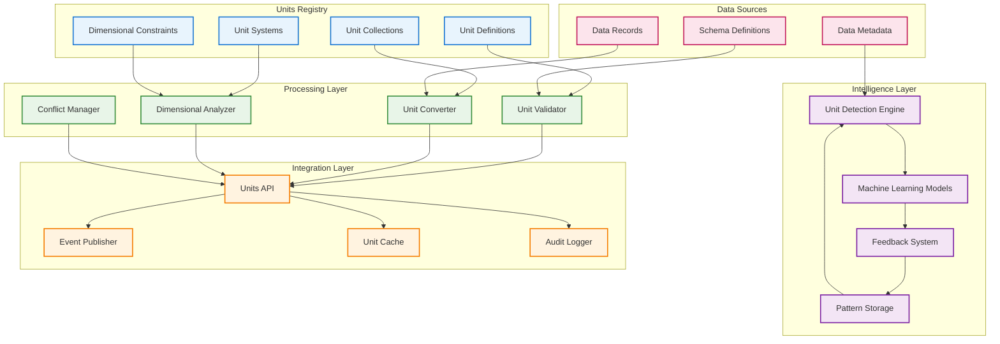
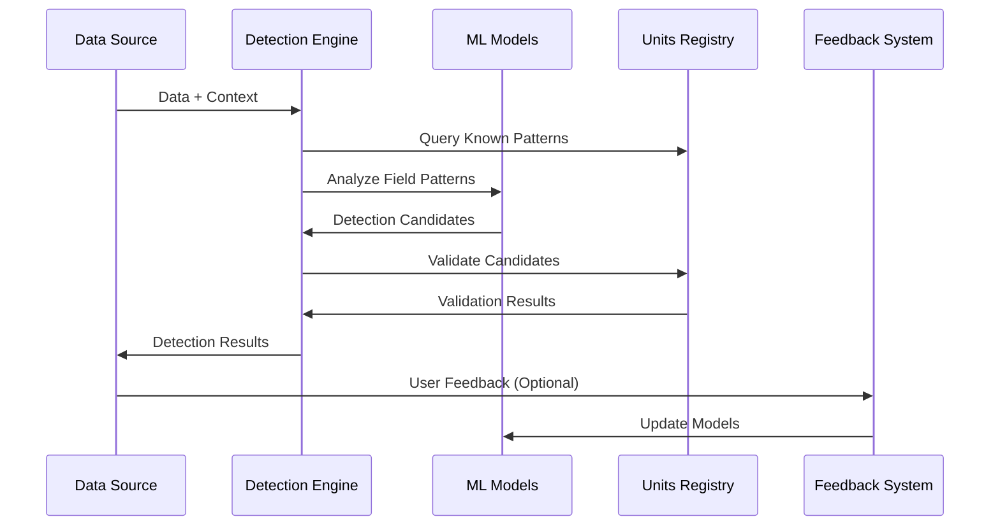

# DADMS 2.0 – Units Management Specification

## Executive Summary

This document defines the comprehensive units management framework for DADMS 2.0, establishing how the system handles unit definitions, conversions, validation, and dimensional analysis across all data flows. Units management is implemented primarily through the DataManager service but impacts all components that process numerical data.

## 1. Overview & Objectives

### 1.1 Purpose

DADMS requires robust units management to ensure:
- **Data Integrity**: Consistent unit handling across diverse data sources
- **Interoperability**: Seamless integration of data with different unit conventions
- **Scientific Accuracy**: Preservation of dimensional relationships and physical laws
- **User Experience**: Intelligent unit detection and transparent conversions
- **Decision Support**: Reliable quantitative analysis for decision-making

### 1.2 Scope

This specification covers:
- Unit definition and registration framework
- Unit systems and categorization
- Dimensional analysis engine
- Conversion algorithms and precision handling
- Validation and consistency checking
- Intelligence capabilities (detection, learning, feedback)
- Integration patterns with DADMS services
- Event-driven units management workflows

### 1.3 Key Principles

1. **Standards Compliance**: Adherence to ISO, NIST, and domain-specific standards
2. **Extensibility**: Support for custom units and domain-specific conventions
3. **Transparency**: Clear audit trails for all unit operations
4. **Intelligence**: Machine learning-enhanced unit detection and validation
5. **Performance**: Efficient processing for high-volume data streams
6. **Reliability**: Robust error handling and graceful degradation

## 2. Conceptual Framework

### 2.1 Core Concepts

#### Unit Definition
A unit is defined by:
- **Identity**: Unique identifier, symbol, and name
- **Dimensionality**: Seven-dimensional vector following SI base dimensions
- **Conversion**: Mathematical relationship to base units
- **Metadata**: Standards compliance, aliases, descriptions
- **Lineage**: Derivation from other units (for derived units)

#### Unit Systems
Organized collections of units that form coherent measurement frameworks:
- **SI (International System)**: Primary standard (meter, kilogram, second, etc.)
- **Imperial**: Traditional British units (foot, pound, etc.)
- **US Customary**: American variant of Imperial system
- **Domain-Specific**: Aviation (nautical miles, knots), medical, etc.
- **Custom**: User-defined unit systems for specialized applications

#### Dimensional Analysis
Mathematical framework ensuring physical consistency:
- **Base Dimensions**: Length [L], Mass [M], Time [T], Electric Current [I], Temperature [Θ], Amount of Substance [N], Luminous Intensity [J]
- **Derived Dimensions**: Combinations of base dimensions (e.g., velocity = [L][T]⁻¹)
- **Dimensional Equations**: Mathematical relationships between quantities

### 2.2 Data Architecture



## 3. Unit Definition Framework

### 3.1 Unit Definition Structure

```typescript
interface UnitDefinition {
    // Identity
    id: string;                     // Unique identifier (e.g., "meter", "foot")
    symbol: string;                 // Standard symbol (e.g., "m", "ft")
    name: string;                   // Full name (e.g., "meter", "foot")
    aliases: string[];              // Alternative names/symbols
    
    // Classification
    unit_system: UnitSystem;        // SI, Imperial, US_Customary, etc.
    category: UnitCategory;         // Length, Mass, Time, etc.
    
    // Dimensional Analysis
    dimension: Dimension;           // Seven-dimensional vector
    is_base_unit: boolean;          // Whether this is a base unit
    is_derived: boolean;            // Whether derived from other units
    derived_from?: DerivedUnitDef;  // Derivation information
    
    // Conversion
    base_unit?: string;             // Base unit for this dimension
    conversion_factor: number;      // Linear conversion factor
    conversion_offset?: number;     // Affine conversion offset
    conversion_precision?: number;  // Precision limitations
    
    // Metadata
    standards_compliance: string[]; // ISO-80000, NIST, etc.
    description?: string;           // Human-readable description
    usage_notes?: string;          // Usage guidelines
    uncertainty?: number;          // Inherent measurement uncertainty
    
    // Lifecycle
    created_at: Date;
    updated_at: Date;
    deprecated?: boolean;
    superseded_by?: string;
}
```

### 3.2 Dimensional Framework

```typescript
interface Dimension {
    length: number;                 // [L] - meters
    mass: number;                   // [M] - kilograms  
    time: number;                   // [T] - seconds
    electric_current: number;       // [I] - amperes
    temperature: number;            // [Θ] - kelvin
    amount_of_substance: number;    // [N] - moles
    luminous_intensity: number;     // [J] - candela
}

// Examples:
// Velocity: { length: 1, mass: 0, time: -1, ... } = [L][T]⁻¹
// Force: { length: 1, mass: 1, time: -2, ... } = [M][L][T]⁻²
// Energy: { length: 2, mass: 1, time: -2, ... } = [M][L]²[T]⁻²
```

### 3.3 Unit Systems

```typescript
interface UnitSystem {
    id: string;                     // System identifier
    name: string;                   // Display name
    description: string;            // System description
    authority: string;              // Standards organization
    base_units: string[];           // Base unit IDs
    derived_units: string[];        // Commonly used derived units
    is_coherent: boolean;           // Whether units form coherent system
    primary_domains: string[];      // Primary usage domains
}

// Predefined Systems:
const SI_SYSTEM: UnitSystem = {
    id: "si",
    name: "International System of Units",
    description: "The modern form of the metric system",
    authority: "BIPM",
    base_units: ["meter", "kilogram", "second", "ampere", "kelvin", "mole", "candela"],
    derived_units: ["newton", "joule", "watt", "pascal", "hertz"],
    is_coherent: true,
    primary_domains: ["scientific", "engineering", "international_trade"]
};
```

## 4. Core Capabilities

### 4.1 Unit Detection Engine

#### 4.1.1 Detection Methods

1. **Explicit Detection**: Units clearly specified in data
2. **Schema-Based Detection**: Units defined in data schemas
3. **Pattern Matching**: Regular expressions and naming conventions
4. **Column Name Analysis**: Field names containing unit information
5. **Value Range Analysis**: Typical value ranges for known quantities
6. **Context Inference**: Domain knowledge and data source context
7. **Machine Learning**: Trained models for intelligent detection

#### 4.1.2 Detection Workflow



#### 4.1.3 Confidence Scoring

```typescript
interface DetectionConfidence {
    overall_confidence: number;     // 0.0 - 1.0
    evidence_factors: {
        field_name_match: number;   // Weight: 0.4
        value_range_match: number;  // Weight: 0.2
        context_match: number;      // Weight: 0.2
        pattern_match: number;      // Weight: 0.1
        ml_prediction: number;      // Weight: 0.1
    };
    threshold_met: boolean;         // Above minimum confidence
    alternative_candidates: UnitCandidate[];
}
```

### 4.2 Unit Conversion Engine

#### 4.2.1 Conversion Types

1. **Linear Conversions**: Simple multiplication (meters to feet)
2. **Affine Conversions**: Linear + offset (Celsius to Fahrenheit)
3. **Nonlinear Conversions**: Complex functions (logarithmic scales)
4. **Multi-Step Conversions**: Through intermediate units
5. **System Conversions**: Entire measurement system changes

#### 4.2.2 Conversion Algorithm

```typescript
class UnitConverter {
    convert(value: number, fromUnit: string, toUnit: string): ConversionResult {
        // 1. Validate units exist and are compatible
        const from = this.unitsRegistry.getUnit(fromUnit);
        const to = this.unitsRegistry.getUnit(toUnit);
        
        if (!this.areCompatible(from.dimension, to.dimension)) {
            throw new IncompatibleUnitsError(fromUnit, toUnit);
        }
        
        // 2. Find conversion path
        const path = this.findConversionPath(from, to);
        
        // 3. Apply conversions step by step
        let result = value;
        for (const step of path) {
            result = this.applyConversionStep(result, step);
        }
        
        // 4. Track precision and uncertainty
        const precision = this.calculatePrecisionLoss(path);
        const uncertainty = this.propagateUncertainty(value, path);
        
        return {
            original_value: value,
            converted_value: result,
            conversion_path: path,
            precision_loss: precision,
            total_uncertainty: uncertainty
        };
    }
}
```

#### 4.2.3 Precision Management

```typescript
interface ConversionPrecision {
    input_precision: number;        // Input value precision
    conversion_precision: number;   // Conversion factor precision
    rounding_error: number;         // Floating-point rounding
    total_uncertainty: number;      // Combined uncertainty
    significant_figures: number;    // Recommended sig figs
    confidence_interval: [number, number]; // 95% confidence bounds
}
```

### 4.3 Dimensional Analysis Engine

#### 4.3.1 Relationship Detection

```typescript
interface DimensionalRelationship {
    relationship_id: string;
    involved_fields: string[];
    relationship_type: RelationshipType;
    mathematical_expression: string;
    dimensional_equation: string;
    confidence: number;
    validation_status: 'valid' | 'invalid' | 'uncertain';
    supporting_evidence: string[];
}

enum RelationshipType {
    PRODUCT = "product",           // F = m × a
    QUOTIENT = "quotient",         // v = d / t
    SUM = "sum",                   // Total = sum of parts
    POWER = "power",               // A = r²
    EXPONENTIAL = "exponential",   // Exponential relationships
    LOGARITHMIC = "logarithmic",   // Logarithmic relationships
    CUSTOM = "custom"              // User-defined relationships
}
```

#### 4.3.2 Consistency Validation

```typescript
interface ConsistencyCheck {
    constraint_id: string;
    description: string;
    fields: string[];
    constraint_type: DimensionalConstraintType;
    expected_relationship: string;
    tolerance: number;
    
    validate(data: Record<string, any>): ValidationResult {
        // Apply dimensional constraint checking
        // Return validation results with suggestions
    }
}
```

### 4.4 Unit Intelligence & Learning

#### 4.4.1 Machine Learning Models

1. **Field Name Classifier**: Predicts units from field names
2. **Value Pattern Recognizer**: Identifies units from value distributions
3. **Context Embeddings**: Domain-aware unit suggestions
4. **Anomaly Detector**: Identifies unusual unit combinations
5. **Relationship Learner**: Discovers dimensional relationships

#### 4.4.2 Feedback Loop

```typescript
interface FeedbackSystem {
    recordFeedback(feedback: UnitFeedback): void;
    updateModels(): Promise<ModelUpdateResult>;
    generateTrainingData(): TrainingDataset;
    evaluatePerformance(): PerformanceMetrics;
}

interface UnitFeedback {
    detection_id: string;
    field_path: string;
    correct_unit: string;
    incorrect_detection?: string;
    feedback_type: 'correction' | 'confirmation' | 'refinement';
    user_confidence: number;
    context: DetectionContext;
}
```

## 5. Integration Patterns

### 5.1 Service Integration

#### 5.1.1 DataManager Integration
- **Primary Implementation**: Units management core capabilities
- **Data Ingestion**: Automatic unit detection during ingestion
- **Schema Validation**: Unit-aware schema validation
- **Quality Assessment**: Unit consistency in quality scoring

#### 5.1.2 EventManager Integration
- **Unit Events**: Publishes unit-related events for system-wide awareness
- **Event Consumption**: Responds to schema changes and data updates
- **Real-time Notifications**: Alerts for unit conflicts and inconsistencies

#### 5.1.3 Knowledge Service Integration
- **Ontology Mapping**: Maps units to ontological concepts
- **Semantic Enrichment**: Adds unit semantics to knowledge graphs
- **Domain Knowledge**: Leverages domain ontologies for unit detection

#### 5.1.4 Process Manager Integration
- **Workflow Units**: Ensures unit consistency in automated workflows
- **Pipeline Validation**: Validates units in data processing pipelines
- **Transformation Rules**: Applies unit conversions in data transformations

### 5.2 Event-Driven Architecture

```typescript
// Unit-related events published by DataManager
interface UnitsEvents {
    "units.unit.registered": UnitRegistrationEvent;
    "units.detection.completed": UnitDetectionEvent;
    "units.validation.failed": UnitValidationEvent;
    "units.conversion.performed": UnitConversionEvent;
    "units.inconsistency.detected": DimensionalInconsistencyEvent;
    "units.conflict.resolved": UnitConflictEvent;
    "units.model.updated": MLModelUpdateEvent;
}

interface UnitDetectionEvent {
    detection_id: string;
    data_source: string;
    fields_analyzed: number;
    units_detected: number;
    confidence_score: number;
    anomalies: UnitAnomaly[];
    suggestions: string[];
}
```

### 5.3 API Integration Patterns

#### 5.3.1 Synchronous Operations
- **Unit Validation**: Real-time validation during data submission
- **Unit Conversion**: On-demand conversions for display/calculation
- **Unit Lookup**: Fast unit information retrieval

#### 5.3.2 Asynchronous Operations
- **Batch Detection**: Large-scale unit detection for historical data
- **Model Training**: Periodic ML model updates
- **Consistency Analysis**: System-wide dimensional analysis

## 6. Implementation Architecture

### 6.1 Component Structure

```mermaid
graph TB
    subgraph "DataManager Service"
        subgraph "Units Management Module"
            UR[Units Registry]
            UDE[Unit Detection Engine]
            UCE[Unit Conversion Engine]
            DAE[Dimensional Analysis Engine]
            UIL[Unit Intelligence Layer]
        end
        
        subgraph "Core DataManager"
            DI[Data Ingestion]
            DV[Data Validation]
            DQ[Data Quality]
            DS[Data Streaming]
        end
    end

    subgraph "Storage Layer"
        PG[(PostgreSQL)]
        RD[(Redis Cache)]
        VD[(Vector Store)]
        ML_STORE[(ML Models)]
    end

    subgraph "External Systems"
        STANDARDS[Standards APIs]
        DOMAIN_KBs[Domain Knowledge Bases]
        USER_FB[User Feedback]
    end

    UR --> PG
    UDE --> ML_STORE
    UCE --> RD
    DAE --> VD
    UIL --> ML_STORE

    UDE --> DI
    UCE --> DV
    DAE --> DQ
    UIL --> DS

    UR --> STANDARDS
    UDE --> DOMAIN_KBs
    UIL --> USER_FB

    classDef units fill:#e3f2fd,stroke:#1565c0,stroke-width:2px
    classDef core fill:#f3e5f5,stroke:#7b1fa2,stroke-width:2px
    classDef storage fill:#e8f5e8,stroke:#2e7d32,stroke-width:2px
    classDef external fill:#fff3e0,stroke:#ef6c00,stroke-width:2px

    class UR,UDE,UCE,DAE,UIL units
    class DI,DV,DQ,DS core
    class PG,RD,VD,ML_STORE storage
    class STANDARDS,DOMAIN_KBs,USER_FB external
```



### 6.2 Data Storage Strategy

#### 6.2.1 PostgreSQL Schema
```sql
-- Core unit definitions
CREATE TABLE units (
    id VARCHAR(50) PRIMARY KEY,
    symbol VARCHAR(20) NOT NULL,
    name VARCHAR(100) NOT NULL,
    aliases TEXT[],
    unit_system VARCHAR(20) NOT NULL,
    category VARCHAR(30) NOT NULL,
    dimension JSONB NOT NULL,
    is_base_unit BOOLEAN NOT NULL,
    is_derived BOOLEAN NOT NULL,
    base_unit VARCHAR(50),
    conversion_factor DECIMAL(20,10) NOT NULL,
    conversion_offset DECIMAL(20,10),
    standards_compliance TEXT[],
    description TEXT,
    created_at TIMESTAMP NOT NULL DEFAULT NOW(),
    updated_at TIMESTAMP NOT NULL DEFAULT NOW()
);

-- Unit collections
CREATE TABLE unit_collections (
    id VARCHAR(50) PRIMARY KEY,
    name VARCHAR(100) NOT NULL,
    description TEXT,
    unit_system VARCHAR(20) NOT NULL,
    units TEXT[] NOT NULL,
    is_complete BOOLEAN NOT NULL,
    is_coherent BOOLEAN NOT NULL,
    authority VARCHAR(50),
    version VARCHAR(20),
    effective_date TIMESTAMP
);

-- Detection feedback for ML training
CREATE TABLE unit_feedback (
    id UUID PRIMARY KEY DEFAULT gen_random_uuid(),
    detection_id UUID NOT NULL,
    field_path VARCHAR(200) NOT NULL,
    correct_unit VARCHAR(50) NOT NULL,
    incorrect_detection VARCHAR(50),
    feedback_type VARCHAR(20) NOT NULL,
    confidence DECIMAL(3,2) NOT NULL,
    user_id VARCHAR(100) NOT NULL,
    context JSONB,
    created_at TIMESTAMP NOT NULL DEFAULT NOW()
);
```

#### 6.2.2 Redis Caching Strategy
```typescript
interface UnitsCacheStrategy {
    // Frequently accessed units (TTL: 1 hour)
    unit_definitions: Map<string, UnitDefinition>;
    
    // Conversion factors (TTL: 24 hours)
    conversion_cache: Map<string, number>;
    
    // Detection patterns (TTL: 12 hours)
    detection_patterns: Map<string, DetectionPattern>;
    
    // ML model predictions (TTL: 1 hour)
    ml_predictions: Map<string, UnitPrediction>;
}
```

### 6.3 Performance Considerations

#### 6.3.1 Optimization Strategies
1. **Conversion Caching**: Pre-compute common conversions
2. **Pattern Indexing**: Fast lookup of detection patterns
3. **Batch Processing**: Efficient handling of large datasets
4. **Lazy Loading**: Load unit definitions on demand
5. **Connection Pooling**: Optimize database connections

#### 6.3.2 Scalability Patterns
1. **Horizontal Scaling**: Multiple DataManager instances
2. **Read Replicas**: Distribute read load across replicas
3. **Caching Layers**: Multi-level caching strategy
4. **Async Processing**: Background processing for heavy operations

## 7. Standards Compliance

### 7.1 International Standards

#### 7.1.1 ISO Standards
- **ISO 80000**: Quantities and units (foundational)
- **ISO 1000**: Units of measurement
- **ISO 31**: Quantities, units and symbols (superseded by ISO 80000)

#### 7.1.2 NIST Guidelines
- **NIST SP 811**: Guide for the Use of the International System of Units
- **NIST SP 330**: The International System of Units (SI)

#### 7.1.3 Domain-Specific Standards
- **ICAO**: Aviation units and measurements
- **IEEE**: Engineering units and quantities
- **ASTM**: Materials testing units
- **IEC**: Electrical and electronic units

### 7.2 Compliance Implementation

```typescript
interface StandardsCompliance {
    standard_id: string;            // ISO-80000-1, NIST-SP-811, etc.
    authority: string;              // ISO, NIST, ICAO, etc.
    version: string;                // Standard version
    compliance_level: 'full' | 'partial' | 'extended';
    deviations: string[];           // Any deviations from standard
    validation_rules: ValidationRule[];
}

interface ValidationRule {
    rule_id: string;
    description: string;
    applies_to: string[];           // Unit IDs this rule applies to
    validation_function: (unit: UnitDefinition) => ValidationResult;
}
```

## 8. Security & Governance

### 8.1 Access Control

#### 8.1.1 Role-Based Permissions
```typescript
interface UnitsPermissions {
    roles: {
        'units.admin': {
            can: ['create', 'update', 'delete', 'manage_collections'];
            resources: ['units', 'collections', 'standards'];
        };
        'units.curator': {
            can: ['create', 'update', 'suggest'];
            resources: ['units', 'collections'];
        };
        'units.user': {
            can: ['read', 'convert', 'validate'];
            resources: ['units', 'conversions'];
        };
        'data.steward': {
            can: ['validate', 'provide_feedback'];
            resources: ['detection_results', 'validation_reports'];
        };
    };
}
```

#### 8.1.2 Audit Requirements
- **Change Tracking**: All unit definition changes logged
- **Usage Tracking**: Conversion and validation operations logged
- **Access Logging**: Unit access patterns recorded
- **Feedback Tracking**: User feedback and corrections logged

### 8.2 Data Quality Governance

#### 8.2.1 Quality Metrics
```typescript
interface UnitsQualityMetrics {
    detection_accuracy: number;     // % of correct unit detections
    conversion_reliability: number; // % of successful conversions
    validation_coverage: number;    // % of data with unit validation
    consistency_score: number;      // Dimensional consistency rating
    user_satisfaction: number;      // User feedback rating
    standards_compliance: number;   // % compliance with standards
}
```

#### 8.2.2 Quality Assurance Process
1. **Automated Testing**: Continuous validation of unit definitions
2. **Peer Review**: Expert review of new unit definitions
3. **User Feedback**: Continuous improvement through user input
4. **Standards Alignment**: Regular review against updated standards
5. **Performance Monitoring**: Ongoing monitoring of system performance

## 9. Testing Strategy

### 9.1 Unit Testing

#### 9.1.1 Core Unit Tests
```typescript
describe('Unit Conversion Engine', () => {
    test('should convert between compatible units', () => {
        const result = converter.convert(100, 'meter', 'foot');
        expect(result.converted_value).toBeCloseTo(328.084, 3);
    });
    
    test('should reject incompatible conversions', () => {
        expect(() => converter.convert(100, 'meter', 'kilogram'))
            .toThrow(IncompatibleUnitsError);
    });
    
    test('should maintain precision tracking', () => {
        const result = converter.convert(123.456789, 'inch', 'centimeter');
        expect(result.precision_loss).toBeLessThan(0.001);
    });
});
```

#### 9.1.2 Detection Testing
```typescript
describe('Unit Detection Engine', () => {
    test('should detect units from field names', () => {
        const detection = detector.detectFromFieldName('temperature_celsius');
        expect(detection.recommended_unit).toBe('celsius');
        expect(detection.confidence).toBeGreaterThan(0.9);
    });
    
    test('should handle ambiguous cases', () => {
        const detection = detector.detectFromFieldName('pressure');
        expect(detection.alternative_candidates.length).toBeGreaterThan(1);
    });
});
```

### 9.2 Integration Testing

#### 9.2.1 End-to-End Workflows
1. **Data Ingestion**: Test complete ingestion with unit detection
2. **Validation Pipeline**: Test schema validation with units
3. **Conversion Workflow**: Test multi-step conversion processes
4. **Event Integration**: Test event publishing and consumption

#### 9.2.2 Performance Testing
1. **Load Testing**: High-volume unit operations
2. **Stress Testing**: System limits and failure modes
3. **Latency Testing**: Response time requirements
4. **Memory Testing**: Memory usage patterns

### 9.3 User Acceptance Testing

#### 9.3.1 Usability Testing
- **Detection Accuracy**: Real-world data detection scenarios
- **Conversion Reliability**: Common conversion use cases
- **Error Handling**: Graceful handling of edge cases
- **Feedback Workflow**: User feedback and correction processes

## 10. Deployment & Operations

### 10.1 Deployment Architecture

#### 10.1.1 Service Deployment
```yaml
# Docker Compose - Units Management
services:
  data-manager:
    image: dadms/data-manager:latest
    environment:
      - UNITS_DETECTION_ENABLED=true
      - ML_MODELS_PATH=/app/models
      - UNITS_CACHE_TTL=3600
    volumes:
      - units_models:/app/models
      - units_cache:/app/cache
    depends_on:
      - postgres
      - redis
      - vector-store

  units-ml-trainer:
    image: dadms/units-ml-trainer:latest
    schedule: "0 2 * * *"  # Daily at 2 AM
    environment:
      - TRAINING_DATA_RETENTION=90d
      - MODEL_UPDATE_THRESHOLD=0.05
```

#### 10.1.2 Configuration Management
```typescript
interface UnitsConfiguration {
    detection: {
        confidence_threshold: number;
        max_candidates: number;
        ml_enabled: boolean;
        fallback_patterns: string[];
    };
    conversion: {
        precision_threshold: number;
        cache_duration: number;
        max_conversion_steps: number;
    };
    validation: {
        strict_mode: boolean;
        dimensional_tolerance: number;
        warning_threshold: number;
    };
    intelligence: {
        training_schedule: string;
        feedback_retention: string;
        model_update_frequency: string;
    };
}
```

### 10.2 Monitoring & Observability

#### 10.2.1 Key Metrics
```typescript
interface UnitsMetrics {
    // Performance Metrics
    detection_latency_p95: number;
    conversion_latency_p95: number;
    validation_throughput: number;
    
    // Accuracy Metrics
    detection_accuracy_rate: number;
    conversion_success_rate: number;
    validation_precision: number;
    
    // Usage Metrics
    daily_detections: number;
    daily_conversions: number;
    unique_units_accessed: number;
    
    // Quality Metrics
    user_feedback_score: number;
    dimensional_consistency: number;
    standards_compliance_rate: number;
}
```

#### 10.2.2 Alerting Strategy
```yaml
alerts:
  - name: "Units Detection Accuracy Drop"
    condition: "detection_accuracy < 0.85"
    severity: "warning"
    action: "notify_units_team"
    
  - name: "Conversion Failure Rate High"
    condition: "conversion_errors > 5%"
    severity: "critical"
    action: "page_on_call"
    
  - name: "Dimensional Inconsistency Detected"
    condition: "consistency_violations > 10"
    severity: "warning"
    action: "create_investigation_ticket"
```

### 10.3 Maintenance & Updates

#### 10.3.1 Regular Maintenance
- **Standards Updates**: Quarterly review of international standards
- **Model Retraining**: Monthly ML model updates based on feedback
- **Performance Tuning**: Ongoing optimization based on metrics
- **Cache Management**: Regular cache cleanup and optimization

#### 10.3.2 Update Procedures
1. **Unit Definition Updates**: Controlled rollout with validation
2. **Algorithm Updates**: A/B testing for new detection algorithms
3. **Standards Compliance**: Gradual migration to updated standards
4. **Performance Improvements**: Blue-green deployment for major updates

## 11. Future Roadmap

### 11.1 Short-term Enhancements (3-6 months)
- **Enhanced ML Models**: Improved accuracy through advanced algorithms
- **Domain-Specific Extensions**: Specialized units for specific industries
- **Performance Optimization**: Caching and indexing improvements
- **User Interface**: Web-based units management interface

### 11.2 Medium-term Goals (6-12 months)
- **Uncertainty Quantification**: Formal uncertainty propagation
- **Advanced Relationships**: Non-linear dimensional relationships
- **Federated Learning**: Collaborative improvement across installations
- **Real-time Validation**: Stream processing for real-time unit validation

### 11.3 Long-term Vision (1-2 years)
- **AI-Driven Standards**: Automated standards compliance checking
- **Semantic Integration**: Deep integration with knowledge graphs
- **Predictive Analytics**: Predictive unit validation and correction
- **Cross-System Interoperability**: Standards-based integration protocols

---

## Conclusion

The DADMS Units Management framework provides a comprehensive, intelligent, and standards-compliant approach to handling units across all data flows in the system. By implementing robust detection, conversion, validation, and learning capabilities, DADMS ensures data integrity, interoperability, and scientific accuracy while providing an excellent user experience.

This specification serves as the foundation for implementing units management within the DataManager service and establishing integration patterns with other DADMS components. The framework is designed to be extensible, performant, and maintainable, supporting DADMS's mission of intelligent decision analysis and management.

**Document Version**: 1.0  
**Last Updated**: January 2025  
**Next Review**: April 2025  
**Status**: Approved for Implementation 