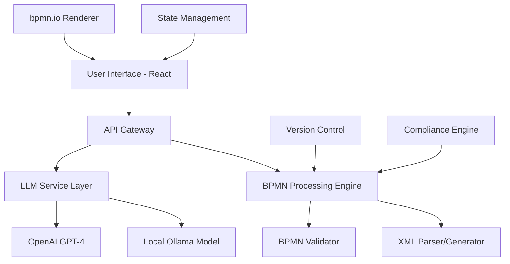

# Research Document: AI-Assisted BPMN Modeling with Large Language Models

**Date:** June 19, 2025  
**Author:** Research Team  
**Version:** 1.0

## Executive Summary

This research investigates the integration of Large Language Models (LLMs) with Business Process Model and Notation (BPMN) modeling tools, specifically focusing on creating a conversational AI assistant that can generate, modify, and explain BPMN process models through natural language interactions. The proposed system combines React-based user interfaces with bpmn.io modeling library and LLM agents to enable real-time, collaborative process modeling.

The core innovation lies in bridging the gap between natural language process descriptions and formal BPMN XML representations, potentially democratizing process modeling by removing technical barriers for non-expert users while maintaining model integrity and compliance standards.

## 1. Background and Motivation

Business Process Model and Notation (BPMN) is the de facto standard for modeling business processes, but creating and maintaining BPMN diagrams requires specialized knowledge and significant time investment. Current modeling tools, while powerful, present barriers to adoption for non-technical stakeholders who understand business processes but struggle with formal modeling notation.

The emergence of sophisticated Large Language Models (LLMs) presents an unprecedented opportunity to bridge this gap by enabling natural language interaction with modeling tools. This research explores the feasibility and implications of creating an AI assistant that can:

- Interpret conversational descriptions of business processes
- Generate valid BPMN XML structures from natural language
- Provide real-time explanations and suggestions
- Maintain model integrity and compliance standards
- Enable collaborative modeling between technical and non-technical users

## 2. State of the Art Analysis

### 2.1 Current AI-Assisted Modeling Tools

**Academic Research:**
- **Process Mining and AI**: Recent systematic literature reviews show growing interest in AI-assisted process analysis, though specific BPMN generation remains underexplored
- **Natural Language Processing for Business Process Models**: Research focuses primarily on extracting process information from existing text documents rather than generative modeling
- **Large Language Models for Code Generation**: Foundational work demonstrates LLM capabilities for structured output generation, providing technical precedent for BPMN XML generation

**Commercial Developments:**
- **Microsoft Copilot Integration**: Demonstrates successful patterns for AI-assisted productivity tools across Microsoft Office suite
- **Camunda Platform 8**: Leading BPMN platform beginning to incorporate AI for process optimization and analysis
- **Signavio Process Intelligence**: Commercial tools starting to integrate AI for process discovery and optimization

**Emerging Platforms:**
- **GitHub Copilot**: Provides architectural patterns for LLM integration in technical workflows
- **Figma AI Features**: Visual design tools with AI assistance offer relevant UX interaction patterns
- **Miro AI**: Collaborative diagramming with AI suggests effective interaction models for visual modeling

### 2.2 Gap Analysis

Current research reveals several critical gaps:

1. **Limited Academic Focus**: Few studies specifically address LLM-driven BPMN generation from natural language
2. **Commercial Opportunities**: Most existing tools focus on process analysis and optimization rather than collaborative generation
3. **User Experience Research**: Sparse studies on non-expert interaction with AI-powered modeling tools
4. **Technical Architecture**: Limited documentation on scalable LLM-modeling integration patterns
5. **Compliance Integration**: Minimal research on AI-driven adherence to organizational modeling standards

## 3. Technical Feasibility and Architecture

### 3.1 Proposed System Architecture

### 3.2 Core Components

**Frontend Layer:**
- React-based user interface with bpmn.io integration
- Real-time collaborative editing capabilities
- Natural language chat interface
- Visual feedback for AI-suggested changes

**LLM Integration Layer:**
- Provider-agnostic abstraction for multiple LLM services
- Advanced prompt engineering framework
- Conversation context management
- Structured output parsing and validation

**BPMN Processing Engine:**
- XML parsing and generation utilities
- Schema validation against BPMN 2.0 specification
- Model transformation and optimization algorithms
- Change tracking and version management

**Compliance and Validation:**
- Rule-based validation engine
- Organizational standard enforcement
- Automated compliance checking
- Quality assurance metrics

### 3.3 Technical Challenges and Solutions

**Challenge 1: Maintaining BPMN Model Integrity**
- *Solution*: Multi-layer validation including schema compliance, semantic correctness, and organizational standards
- *Implementation*: Real-time validation pipeline with user feedback loops

**Challenge 2: Context Management for Complex Models**
- *Solution*: Hierarchical context representation with attention mechanisms for relevant model sections
- *Implementation*: Graph-based model representation with intelligent context windowing

**Challenge 3: Handling Ambiguous Natural Language Requests**
- *Solution*: Interactive clarification system with suggested interpretations
- *Implementation*: Confidence scoring for AI interpretations with user confirmation workflows

**Challenge 4: Performance at Scale**
- *Solution*: Incremental model updates with optimized LLM API usage
- *Implementation*: Caching strategies and async processing for large model operations

## 4. Requirements Analysis

### 4.1 Functional Requirements

**Core Modeling Capabilities:**
1. Natural language to BPMN translation with support for all standard BPMN elements
2. Bidirectional conversion between BPMN models and natural language descriptions
3. Real-time model modification based on conversational inputs
4. Automated documentation generation with process explanations
5. Multi-user collaborative editing with AI assistance

**Advanced Features:**
1. Process optimization suggestions based on best practices
2. Compliance checking against organizational standards
3. Integration with existing enterprise systems and databases
4. Automated testing and simulation capabilities
5. Version control with intelligent change summarization

### 4.2 Technical Requirements

**Performance:**
- Sub-second response times for typical modeling operations
- Support for models with 100+ process elements
- Concurrent user support for enterprise deployments
- 99.9% uptime for production environments

**Security and Privacy:**
- End-to-end encryption for sensitive process information
- Role-based access control with granular permissions
- Audit logging for compliance and governance
- Secure integration with external LLM providers

**Scalability:**
- Horizontal scaling for increased user loads
- Cloud-native deployment with container orchestration
- API rate limiting and resource management
- Multi-tenant architecture for enterprise customers

### 4.3 User Experience Requirements

**Accessibility:**
- Support for users with varying technical expertise
- Intuitive natural language interaction patterns
- Clear visual feedback for AI-generated changes
- Comprehensive help system with contextual guidance

**Collaboration:**
- Real-time multi-user synchronization
- Comment and annotation systems
- Change tracking with user attribution
- Conflict resolution for simultaneous edits

## 5. Implementation Roadmap

### Phase 1: Foundation (Months 1-3)

**Objectives:**
- Establish core technical architecture
- Implement basic LLM integration
- Create fundamental BPMN processing capabilities

**Deliverables:**
1. React application with bpmn.io integration
2. LLM service abstraction layer
3. Basic BPMN XML parsing and generation
4. Simple natural language to BPMN proof of concept

**Success Criteria:**
- Generate basic BPMN models from simple natural language descriptions
- Validate against BPMN 2.0 schema
- Demonstrate real-time model updates in UI

### Phase 2: Core Features (Months 4-6)

**Objectives:**
- Develop sophisticated conversation management
- Implement comprehensive BPMN element support
- Create model modification and validation systems

**Deliverables:**
1. Advanced prompt engineering framework
2. Complete BPMN element coverage
3. Context-aware conversation system
4. Real-time collaboration infrastructure

**Success Criteria:**
- Handle complex process descriptions with multiple elements
- Support iterative model refinement through conversation
- Enable multi-user collaborative editing

### Phase 3: Enterprise Features (Months 7-9)

**Objectives:**
- Implement compliance and governance features
- Develop enterprise integration capabilities
- Create advanced AI-powered features

**Deliverables:**
1. Compliance checking and validation engine
2. Enterprise system integrations
3. Process optimization recommendations
4. Automated documentation generation

**Success Criteria:**
- Enforce organizational modeling standards
- Integrate with existing enterprise workflows
- Provide actionable process improvement suggestions

### Phase 4: Advanced AI and Analytics (Months 10-12)

**Objectives:**
- Implement cutting-edge AI capabilities
- Develop analytics and insights features
- Optimize performance and scalability

**Deliverables:**
1. Process simulation and analysis tools
2. Predictive modeling capabilities
3. Advanced analytics dashboard
4. Performance optimization and scaling

**Success Criteria:**
- Provide predictive insights about process performance
- Support enterprise-scale deployments
- Demonstrate measurable productivity improvements

## 6. Testing and Validation Strategy

### 6.1 Technical Testing

**Unit Testing:**
- LLM response processing and validation
- BPMN XML generation and parsing accuracy
- API layer functionality and error handling
- UI component behavior and rendering

**Integration Testing:**
- End-to-end workflow validation
- Multi-provider LLM integration testing
- Real-time synchronization accuracy
- Performance testing under load

**System Testing:**
- Complete user scenario validation
- Cross-browser compatibility verification
- Security and privacy compliance testing
- Scalability and performance benchmarking

### 6.2 User Experience Testing

**Usability Studies:**
- Non-expert user interaction with AI assistant
- Task completion rates and time measurements
- User satisfaction and ease-of-use metrics
- Accessibility compliance verification

**Domain Expert Validation:**
- Process modeling expert review of AI-generated models
- Accuracy assessment of complex process translations
- Compliance with industry best practices
- Quality comparison with manually created models

### 6.3 Quality Assurance Metrics

**Model Quality:**
- BPMN standard compliance rate (target: >99%)
- Semantic accuracy of natural language translations
- Consistency across similar process descriptions
- Error detection and correction effectiveness

**User Experience:**
- Task completion success rate (target: >95%)
- Average time to complete modeling tasks
- User satisfaction scores (target: >4.5/5)
- Learning curve measurement for new users

**Performance:**
- Response time for AI-generated suggestions (target: <2 seconds)
- System availability and uptime (target: 99.9%)
- Concurrent user capacity
- Resource utilization efficiency

## 7. User Experience and Impact Assessment

### 7.1 Workflow Transformation

**Traditional BPMN Modeling Workflow:**
1. Business analyst interviews stakeholders
2. Manual creation of process documentation
3. Technical expert creates BPMN model
4. Multiple review and revision cycles
5. Documentation updates and maintenance

**AI-Assisted Workflow:**
1. Direct stakeholder interaction with AI assistant
2. Real-time BPMN generation from conversation
3. Immediate visualization and feedback
4. Collaborative refinement with AI guidance
5. Automated documentation and maintenance

### 7.2 Accessibility Improvements

**Barriers Removed:**
- Technical BPMN notation knowledge requirements
- Complex modeling tool learning curves
- Dependency on specialized modeling experts
- Time-intensive manual model creation

**New Capabilities Enabled:**
- Direct stakeholder participation in modeling
- Rapid prototyping and iteration
- Natural language model documentation
- Real-time collaboration across skill levels

### 7.3 Productivity Impact Analysis

**Quantitative Benefits:**
- Estimated 60-80% reduction in initial model creation time
- 40-60% decrease in revision cycle duration
- 50-70% improvement in stakeholder engagement
- 30-50% reduction in modeling-related training requirements

**Qualitative Benefits:**
- Improved model accuracy through direct stakeholder input
- Enhanced collaboration between business and technical teams
- Reduced friction in process documentation maintenance
- Increased adoption of formal process modeling practices

### 7.4 Organizational Impact

**Strategic Advantages:**
- Democratization of process modeling capabilities
- Accelerated digital transformation initiatives
- Improved process documentation quality and coverage
- Enhanced organizational process knowledge management

**Cultural Changes:**
- Shift from expert-dependent to collaborative modeling
- Increased process awareness across organizational levels
- Enhanced communication between business and technical teams
- Improved process improvement culture and practices

## 8. Future Directions and Recommendations

### 8.1 Technology Evolution Opportunities

**Advanced AI Capabilities:**
1. **Multi-modal Integration**: Combine text, voice, and visual inputs for comprehensive modeling assistance
2. **Predictive Process Analytics**: Use historical data to suggest process optimizations and predict outcomes
3. **Automated Process Discovery**: Generate BPMN models from system logs and user activity data
4. **Intelligent Compliance Monitoring**: Real-time monitoring of process execution against modeled specifications

**Integration Enhancements:**
1. **Enterprise System Connectivity**: Direct integration with ERP, CRM, and other business systems
2. **IoT and Real-time Data**: Incorporate sensor data and real-time metrics into process models
3. **Blockchain Integration**: Immutable process execution tracking and audit trails
4. **Augmented Reality**: 3D visualization and manipulation of process models

### 8.2 Research Opportunities

**Academic Research Directions:**
1. **Human-AI Collaboration Patterns**: Study optimal interaction models for complex modeling tasks
2. **Prompt Engineering Optimization**: Research domain-specific prompting strategies for BPMN generation
3. **Model Quality Metrics**: Develop comprehensive evaluation frameworks for AI-generated process models
4. **Cognitive Load Assessment**: Analyze mental effort required for different AI-assisted modeling approaches

**Industry Research Needs:**
1. **ROI Quantification**: Comprehensive studies on productivity and cost benefits
2. **Adoption Barriers**: Research on organizational and technical obstacles to implementation
3. **Compliance Integration**: Industry-specific standards and regulatory requirement integration
4. **Change Management**: Best practices for organizational transition to AI-assisted modeling

### 8.3 Standardization and Ecosystem Development

**Standards Development:**
1. **AI-BPMN Interaction Standards**: Establish protocols for LLM-generated BPMN model validation
2. **Quality Assurance Frameworks**: Create industry standards for AI-assisted modeling quality
3. **Interoperability Specifications**: Ensure compatibility across different AI and modeling platforms
4. **Ethics and Governance Guidelines**: Develop responsible AI usage frameworks for process modeling

**Ecosystem Building:**
1. **Open Source Community**: Foster collaborative development of core technologies and standards
2. **Academic Partnerships**: Establish research collaborations with universities and research institutions
3. **Industry Alliances**: Create partnerships with major process modeling and enterprise software vendors
4. **Training and Certification**: Develop educational programs for AI-assisted process modeling

### 8.4 Implementation Recommendations

**Immediate Actions (0-6 months):**
1. Develop comprehensive proof-of-concept with OpenAI GPT-4 integration
2. Establish partnerships with academic institutions for user experience research
3. Create detailed technical architecture documentation and implementation guidelines
4. Begin patent application process for novel AI-BPMN integration techniques

**Medium-term Goals (6-18 months):**
1. Build production-ready platform with multiple LLM provider support
2. Develop industry-specific compliance modules and validation frameworks
3. Establish pilot programs with enterprise customers for real-world validation
4. Create comprehensive evaluation metrics and benchmarking frameworks

**Long-term Vision (18+ months):**
1. Establish new industry standards for AI-assisted process modeling
2. Contribute to academic research on human-AI collaboration in modeling contexts
3. Explore integration with process execution platforms for closed-loop optimization
4. Develop next-generation capabilities including predictive modeling and automated optimization

## 9. Risk Assessment and Mitigation

### 9.1 Technical Risks

**Risk 1: LLM Hallucination and Inaccuracy**
- *Impact*: Generation of invalid or semantically incorrect BPMN models
- *Mitigation*: Multi-layer validation, confidence scoring, and human oversight requirements
- *Monitoring*: Automated quality metrics and user feedback systems

**Risk 2: Performance and Scalability Limitations**
- *Impact*: Poor user experience with slow response times or system unavailability
- *Mitigation*: Optimized architecture design, caching strategies, and cloud-native scaling
- *Monitoring*: Real-time performance metrics and proactive capacity management

**Risk 3: Integration Complexity**
- *Impact*: Difficulties integrating with existing enterprise systems and workflows
- *Mitigation*: Standardized APIs, comprehensive documentation, and professional services support
- *Monitoring*: Integration success metrics and customer feedback tracking

### 9.2 Business Risks

**Risk 1: Market Adoption Resistance**
- *Impact*: Slow uptake due to organizational change resistance or trust concerns
- *Mitigation*: Comprehensive change management support, pilot programs, and success case development
- *Monitoring*: Adoption metrics, user satisfaction surveys, and market research

**Risk 2: Competitive Response**
- *Impact*: Major vendors developing competing solutions that capture market share
- *Mitigation*: Rapid innovation cycles, patent protection, and strategic partnerships
- *Monitoring*: Competitive intelligence and market positioning analysis

**Risk 3: Regulatory and Compliance Challenges**
- *Impact*: Legal or regulatory restrictions on AI usage in business process documentation
- *Mitigation*: Proactive compliance framework development and regulatory engagement
- *Monitoring*: Regulatory environment tracking and compliance auditing

### 9.3 Ethical and Social Risks

**Risk 1: Job Displacement Concerns**
- *Impact*: Resistance from process modeling professionals fearing job loss
- *Mitigation*: Position as augmentation rather than replacement, provide upskilling opportunities
- *Monitoring*: Employee satisfaction surveys and industry employment impact studies

**Risk 2: Data Privacy and Security**
- *Impact*: Exposure of sensitive business process information through AI systems
- *Mitigation*: End-to-end encryption, on-premises deployment options, and privacy-preserving AI techniques
- *Monitoring*: Security audits, privacy impact assessments, and incident tracking

**Risk 3: AI Bias and Fairness**
- *Impact*: Biased or unfair process models that discriminate against certain groups or scenarios
- *Mitigation*: Bias detection systems, diverse training data, and fairness evaluation frameworks
- *Monitoring*: Bias metrics, fairness audits, and stakeholder feedback collection

## 10. Conclusion

This research demonstrates significant potential for revolutionary impact in process modeling through the integration of Large Language Models with BPMN modeling tools. The proposed AI-assisted approach addresses critical barriers to adoption while maintaining model integrity and compliance standards.

**Key Findings:**
1. **Technical Feasibility**: Current LLM capabilities, combined with robust validation frameworks, make AI-assisted BPMN generation technically viable
2. **Market Opportunity**: Significant gaps exist in current offerings, creating opportunities for innovative solutions
3. **User Impact**: Potential for 60-80% productivity improvements and democratization of process modeling capabilities
4. **Implementation Path**: Clear roadmap exists for incremental development and validation

**Critical Success Factors:**
1. **Quality Assurance**: Maintaining high standards for AI-generated model accuracy and compliance
2. **User Experience**: Creating intuitive interaction patterns that leverage AI capabilities effectively
3. **Ecosystem Integration**: Seamless integration with existing enterprise systems and workflows
4. **Continuous Innovation**: Rapid iteration and improvement based on user feedback and technological advances

**Strategic Implications:**
This technology has the potential to fundamentally transform how organizations approach process modeling, making it more accessible, collaborative, and efficient. Organizations that successfully implement and scale these capabilities will gain significant competitive advantages in process optimization, digital transformation, and organizational agility.

The convergence of advanced AI capabilities with established process modeling standards creates a unique opportunity to bridge the gap between business stakeholders and technical implementation, potentially accelerating enterprise digital transformation initiatives while improving process documentation quality and coverage.

---

**Document Information:**
- **Version**: 1.0
- **Date**: June 19, 2025
- **Classification**: Internal Research
- **Next Review**: September 19, 2025
- **Contact**: Research Team
