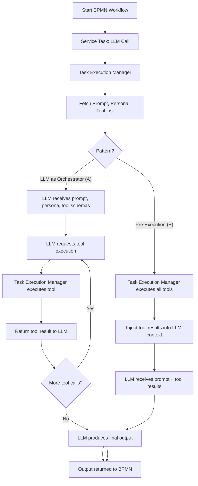

# DADMS Development Process Capture

## Purpose
This document captures the ongoing development process, key decisions, rationale, and milestones for the DADMS 2.0 project. It serves as a living record to ensure transparency, knowledge sharing, and continuous improvement.

---

## Process Overview
- **Scaffold First:** Rapidly prototype UI/UX with local state and placeholder data.
- **Iterate on UX:** Validate workflows and get feedback before backend integration.
- **API Integration:** Replace local state with real API/database calls once UI is validated.
- **Continuous Documentation:** Update this document as decisions are made and milestones are reached.

---

## Development Tooling Update

- **pm2 for Local Process Management:** Adopted [pm2](https://pm2.keymetrics.io/) as a process manager for local development. pm2 is used to manage the Next.js dev server (and can be extended to other Node.js services), providing easier process control, auto-restart, and unified logging. This simplifies running and monitoring the UI and backend services during development.

  Example command to start the UI dev server:
  ```bash
  cd ~/dadms/dadms-ui
  pm2 start npm --name dadms-ui-dev -- run dev
  ```
  Use `pm2 list`, `pm2 logs`, `pm2 stop <name>`, and `pm2 delete <name>` for process management.

---

## Key Decisions & Rationale

### **MVP Architecture Decision: Include Event Bus + AAS**
**Date**: January 15, 2025
**Decision**: Include Event Bus Service and Agent Assistance Service (AAS) in the MVP
**Rationale**: 
- **Differentiation**: Without Event Bus + AAS, DADMS is just another workflow tool. With them, it becomes an intelligent, proactive decision assistant.
- **User Experience**: The AAS provides Clipy-like intelligent assistance that makes users feel like they have an expert colleague by their side.
- **Demonstration Value**: The MVP will be much more compelling and showcase the true potential of DADMS.
- **Foundation**: Event Bus provides the foundation for all future intelligent features.

**Impact**:
- Updated MVP specification to include 7 core services instead of 10
- Event Bus (Port 3004) and AAS (Port 3005) are now core MVP components
- Week 1 implementation plan updated to include these services
- Complete API documentation created for both services

**Technical Approach**:
- **Event Bus**: Simple but functional implementation with PostgreSQL persistence, Redis streaming, and webhook delivery
- **AAS**: LLM-powered intelligent assistant with context awareness, proactive suggestions, and action execution
- **Integration**: All services publish events, AAS subscribes and provides proactive assistance

### **UI Scaffolding:** Use local state for domains/tags to enable fast iteration and feedback.
### **Domain/Tag Model:** Domains and tags are managed centrally for governance and reusability. Tags can span multiple domains (multi-select).
### **Separation of Concerns:** Frontend handles UX, backend handles chunking, vectorization, and storage.
### **Best Practice Alignment:** Follow modern SaaS and knowledge management patterns for extensibility and maintainability.

---

## Known Issues & Lessons Learned

- **Camunda Variable Truncation:** Camunda's default schema uses `VARCHAR(4000)` for string process variables, which can cause truncation of large context data (e.g., long JSON or prompt context). In previous installations, attempts to alter the table type to `TEXT` were difficult and risky. The recommended approach is to use Camunda's `bytearray` variable type for large payloads instead of changing the table schema. No change is made now, but this is a known limitation to address if large context must be passed through BPMN workflows.

---

## Container Orchestration & Process Engine Integration

- **Podman Compose Adoption:** Switched to using Podman Compose for local container orchestration, ensuring compatibility with rootless containers and modern Linux workflows.
- **Camunda BPM Platform Integration:** Added Camunda BPM Platform to the docker-compose stack to support BPMN workflow execution as part of the DADMS architecture.
- **Camunda 7.15.0/Postgres 15 Issue:** Initial attempt to use Camunda 7.15.0 with Postgres 15 failed due to JDBC driver incompatibility with the default `scram-sha-256` authentication in newer Postgres versions (error: `The authentication type 10 is not supported`).
- **Resolution:** Upgraded Camunda to 7.18.0, which includes a newer JDBC driver supporting Postgres 13+ authentication methods. This resolved the startup and connectivity issues without requiring changes to Postgres configuration or downgrading the database version.
- **Rationale:** Upgrading Camunda was the least disruptive and most future-proof solution, maintaining compatibility with the latest Postgres and container best practices.

---

## Milestones & Progress
- **Day 1:** Project CRUD UI and backend complete.
- **Day 2:** Knowledge page scaffolded; Domain and Tag management UIs scaffolded with local state.
- **Next:** Document upload and RAG search UI scaffolding; backend API integration for knowledge entities.
- **Day X:** BPMN Workspace scaffolded with iframe integration of comprehensive_bpmn_modeler.html and localStorage-based model state management.
- **Day X:** Camunda BPM Platform added to docker-compose; verified integration with Postgres 15 using Camunda 7.18.0 and Podman Compose. Documented and resolved authentication compatibility issues.
- **January 15, 2025:** **MVP Architecture Updated** - Decided to include Event Bus and AAS in MVP for intelligent, proactive assistance. Complete API documentation created for both services.

---

## Teams Tab Enhancements (Context Manager)

- Teams can now specify if a moderator is employed (checkbox in team dialog)
- If enabled, a moderator persona can be selected from all available personas (not limited to team members)
- Decision agreement type can be set for each team (dropdown: Voting, Moderator decides, Third party, Consensus, Random/Lottery)
- Team data model updated to include: `uses_moderator`, `moderator_id`, and `decision_type`
- Team summary displays decision type and moderator (if set)
- UI/UX designed for easy backend integration in future

---

## Decision Context Field Addition – Full Stack Propagation

- **Motivation:** To support richer project metadata and enable context-aware decision analysis, a `decision_context` field was added to the project model.
- **Scope of Change:**
  - Updated the database schema to add a `decision_context TEXT` column to the `projects` table.
  - Updated backend TypeScript types, service, controller, and validation logic to support the new field for create, update, and fetch operations.
  - Updated the frontend types, project creation form, and project card display to include and show the `decision_context` field.
  - Ensured OpenAPI/Swagger documentation and API responses include the new field.
- **Database Migration:**
  - Verified the running database schema and applied an `ALTER TABLE` if the column was missing.
  - Inserted a demo project with a populated `decision_context` to ensure end-to-end functionality and provide a visible example in the UI.
  - Used a SQL file and `podman cp`/`podman exec` to reliably insert demo data, avoiding shell/SQL quoting issues with JSONB fields.
- **Troubleshooting:**
  - Encountered and resolved issues with shell/SQL escaping for JSONB fields during direct insertion; documented the use of SQL files for complex inserts.
  - Confirmed that all backend and frontend layers must be updated in lockstep for new model fields to avoid runtime errors and ensure a seamless user experience.
- **Best Practice Established:**
  - Any future model or schema change must be propagated through: database schema, backend types/services/controllers, frontend types/forms/displays, API docs, and demo/seed data.
  - Always verify the running database schema and seed demo data after such changes.
  - Document the change and troubleshooting steps in the development process for future reference.
- **Outcome:**
  - The project page now displays the `decision_context` for all projects, and the backend/frontend are fully aligned. This workflow is now standard for all future schema/model changes.

---

## Agent Assistance & Documentation Service (AASD)

**Purpose:**
AASD is a post-process tool that enables users to finalize decisions with the help of an AI assistant or team, generate formal documentation (white paper), and route the decision through an approval workflow managed by the BPMN server.

### Workflow
1. **Decision Review:**
   - After completing a process, users review the outcome, context, and supporting data.
   - The review section summarizes the process, decision, and key evidence.
2. **Assistant/Team Collaboration:**
   - Users interact with an AI assistant or team via chat/comments for feedback, risk identification, and improvement suggestions.
   - Supports collaborative editing and discussion before finalization.
3. **White Paper/Documentation Generation:**
   - Users draft a formal decision document (white paper) using a rich text/markdown editor.
   - LLMs can assist in drafting sections, summarizing context, or generating executive summaries.
   - The document includes executive summary, context, alternatives, rationale, supporting data, and final decision.
4. **Approval Submission:**
   - Once finalized, the document is submitted to an approval workflow managed by the BPMN server (Camunda).
   - The approval process supports multi-step, multi-approver flows, with status tracking and audit trail.
   - Approvers can review, comment, request changes, or approve/reject the decision.
5. **Audit & Traceability:**
   - All actions, edits, and approvals are logged for compliance and governance.
   - Finalized documents are stored and linked to the originating project/process for future reference.

### UI/UX
- A dedicated AASD page is accessible from the sidebar (last item: "AASD (Finalize Decision)").
- The page is divided into four main sections:
  1. **Decision Review**: Summary of process, outcome, and key data.
  2. **Assistant/Team Collaboration**: Chat/comment interface for feedback and discussion.
  3. **White Paper Editor**: Rich text/markdown editor for drafting the decision document, with LLM assistance.
  4. **Approval Submission**: Button to submit for approval, with status display and BPMN workflow integration.
- Designed for extensibility and future integration with backend APIs and BPMN status updates.

### Backend & BPMN Integration
- New backend endpoints will support:
  - Drafting, saving, and retrieving decision documents.
  - Integrating with LLMs for document generation and review assistance.
  - Submitting documents to the BPMN approval process and tracking status.
- The BPMN server manages the approval workflow, with endpoints for starting and monitoring approval processes.
- All finalized documents and approval history are stored for audit and compliance.

### Rationale & Benefits
- Ensures decisions are thoroughly reviewed, documented, and approved before implementation.
- Leverages AI and team collaboration for higher-quality, auditable decision records.
- Integrates seamlessly with DADMS's process-centric architecture and BPMN-driven governance.
- Provides a clear, extensible workflow for decision finalization, documentation, and approval.

---

## Process Manager Page Addition

- Added a new `/process` page featuring a `ProcessManager` component for BPMN process management.
- Sidebar navigation link included for direct access from the main app navigation.
- Features:
  - Lists process definitions (grouped by key, version selection)
  - Lists process instances with status, start time, duration, business key
  - Dialogs for starting, viewing, and deleting processes
  - Summary cards for active, total, and available definitions
  - Auto-refresh toggle and error handling
  - Material-UI layout for consistency
- Scaffolded with mock data and placeholder fetches, ready for real API integration.
- UI and workflow closely match the legacy DADMS process management tool for user familiarity and smooth transition.

---

## Thread Manager Page Addition

- Added a new `/thread` page featuring a `ThreadManager` component with a tabbed interface for future extensibility (e.g., process threads, user conversation threads).
- The first tab, **Process Threads**, provides a comprehensive view of process definition runs and their associated threads.
- **Thread Structure:**
  - Each process run creates a top-level thread (with a unique thread_id and process metadata).
  - Each service task within the process is represented as a nested thread item (child of the top-level thread), storing input context, injected context (tools/persona), and output context.
- **Human/SMe-in-the-Loop Feedback:**
  - **Thread-level feedback:** Users can view and add overall feedback/comments about the entire process run, supporting summary, meta, and cross-task comments.
  - **Task-level feedback:** Each service task has its own feedback section for granular, actionable review. Users can view all previous comments/reviews for that task and add new feedback.
  - All feedback is currently managed in local state, ready for backend integration.
- **UI/UX:**
  - Left pane: Tree view of process threads and their service task children, with search and expand/collapse.
  - Right pane: Context view (entire thread or individual task, depending on selection), with feedback sections at both the thread and task level.
  - Material-UI components ensure consistency and extensibility.
- **Rationale & Benefits:**
  - Enables full traceability and auditability of process runs and their tasks.
  - Supports progressive process improvement by capturing human and subject-matter expert (SME) feedback at both the thread and task level.
  - Lays the foundation for future features such as feedback-driven process optimization, semantic search of historical runs, and advanced reporting.
- Scaffolded with mock data and placeholder fetches, ready for real API integration.
- Designed for extensibility to support additional thread types and advanced review workflows.

---

## Decision Context, Similarity, and Impact Analysis

- **Decision Context Storage:**
  - Every process task (across all process runs and definitions) is stored in a vector store, encoding its context (input, injected, output, metadata, etc.).
  - This enables semantic similarity search across all tasks, regardless of which process or project they originated from.

- **Similarity Search & Graph Relationships:**
  - A backend tool (initially) performs similarity search for any given task against all stored tasks, surfacing related or similar tasks even across different process models or domains.
  - Results of similarity search are used to populate a graph database (e.g., Neo4j) with nodes representing thread tasks and edges representing similarity relationships (with a score/weight).
  - Over time, clusters of similar tasks/processes emerge, potentially spanning domains. This supports the discovery of reusable patterns, best practices, and meta-processes.

- **Meta-Process Discovery & Impact Analysis:**
  - Emergent clusters and graph relationships enable the creation of "meta-processes" that generalize or consolidate similar workflows, supporting cross-domain knowledge and process optimization.
  - When a process definition changes (or a new one is introduced), the system can perform impact analysis by searching for similar or dependent historical tasks/processes, surfacing those that may be affected by the change.
  - This supports governance, compliance, and continuous improvement by informing users of potential downstream effects and risks.

- **UI/UX Scaffolding:**
  - **Similarity Explorer:** When viewing a process task, users can see a list of semantically similar tasks from other process runs, with process name, task name, similarity score, and context snippet. This prepares the UI for future backend integration with vector similarity search and graph-based features.
  - **Thread Impact Analysis Tab:** A dedicated tab in the Thread Manager provides a mock impact report listing historical tasks potentially affected by a process change, including process name, task name, impact score, and explanation. Future versions will support interactive graph visualizations, what-if simulations, and detailed impact drill-downs.

- **Rationale & Benefits:**
  - Enables proactive risk/governance and safer process evolution by making the impact of changes visible and actionable.
  - Supports continuous improvement, cross-domain insight, and the emergence of reusable best practices and meta-processes.
  - Lays the foundation for advanced features such as automated recommendations, anomaly detection, and compliance reporting.

### Example: Air Refueling Process Impact Analysis

Suppose the organization is evaluating a new air refueling process, where the decision is to use refueling process X and probe Y. Before approving and implementing this new design, DADMS can:

- **Store the new process and decision context** in the vector store, encoding all relevant parameters, choices, and metadata.
- **Run impact analysis** using the Thread Impact Analysis tool:
  - The system performs a similarity and dependency search against all historical process tasks and decisions.
  - It identifies other processes, such as previous refueling operations, maintenance workflows, or related mission profiles, that are semantically or operationally similar to the new design.
  - The impact report highlights which historical decisions or process runs may be affected by the adoption of process X and probe Y (e.g., "Switching to probe Y may impact compatibility with tanker fleet Z, as seen in historical process runs A, B, and C").
- **Enable risk management and informed decision-making** by surfacing these potential impacts before approval, allowing stakeholders to review, simulate, and mitigate risks proactively.

This example demonstrates how DADMS supports safer, more transparent process evolution and cross-domain insight, especially in complex, high-stakes environments like air refueling operations.

---

## Task Execution Manager (TEM)

The Task Execution Manager (TEM) is the core backend component responsible for orchestrating the execution of process tasks in DADMS. It is the critical link between workflow composition, service/tool invocation, and analysis/feedback capture.

### Legacy Capabilities (Service Orchestrator)
- **Dynamic Task Routing:** Routes tasks to the appropriate service/tool based on BPMN properties (service.type, service.name, etc.).
- **Service Registry:** Supported Consul, config-based, and fallback registries for service discovery.
- **HTTP Service Invocation:** Robust HTTP client with retry, pooling, and metrics.
- **Batch Processing:** Efficient batch routing and prefetching for performance.
- **Caching:** Time-expiring caches for process XML, service properties, documentation, and parsed XML.
- **Analysis Integration:** Stores task analysis/results in vector and graph stores for later retrieval and impact analysis.
- **Metrics & Monitoring:** Detailed metrics for cache usage, operation times, API calls, and processed tasks.

### DADMS 2.0 Improvements & Principles
- **Clean Architecture:**
  - Separate orchestration logic, service registry, and analysis integration into clear domains/interfaces.
  - Stateless, horizontally scalable design.
- **Config-Driven Service Registry:**
  - **Consul is not required for DADMS 2.0.**
  - Use a simple config- or environment-driven registry for service endpoints.
  - Keep the interface extensible for future dynamic discovery if needed.
- **Plug-in Service Adapters:**
  - Allow new service types (LLMs, RAG, external APIs) to be added as plug-ins, not hardcoded.
- **LLM/AI Integration:**
  - Support LLMs as orchestrators, enabling dynamic tool selection and context injection.
  - Inject historical context, feedback, and similarity search results into service/LLM calls.
- **Human-in-the-Loop Feedback:**
  - Store and utilize human/SME feedback for continuous improvement and auditability.
- **Observability & Governance:**
  - Log all task executions, context, and decisions for compliance and traceability.
  - Store and expose "why" a service/tool was chosen for a task (e.g., LLM rationale, similarity match).
  - Integrate with impact analysis and risk reporting.
- **Performance & Scalability:**
  - Support async task execution and queue-based orchestration for scale.
  - Use distributed caching if needed for large deployments.
- **API-First Design:**
  - Expose orchestration endpoints via OpenAPI spec for easy integration and testing.

### TEM in the DADMS Architecture
- The TEM receives tasks from the workflow engine (e.g., Camunda), determines the appropriate service/tool, and manages execution, context injection, and result/feedback capture.
- It integrates tightly with the vector/graph stores for analysis, similarity search, and impact analysis.
- The TEM is designed for extensibility, observability, and future-proofing, supporting both MVP and advanced DADMS capabilities.

**Decision:** For DADMS 2.0, keep the orchestration layer as simple and maintainable as possible. Avoid unnecessary dependencies (e.g., Consul) unless required for scale or dynamic environments. Prioritize clean interfaces, plug-in extensibility, and robust metrics/auditability.

---

## Next Steps
- Scaffold Document Upload and Knowledge Search UIs.
- Define and implement backend API endpoints for domains, tags, documents, and search.
- Integrate frontend with backend for persistent data.
- **Implement Event Bus Service (Port 3004) for real-time event communication.**
- **Implement Agent Assistance Service (Port 3005) for intelligent, proactive assistance.**
- Continue to update this document as new decisions and milestones occur.

---

## Potential Future Additions & Considerations (Knowledge Service Frontend)
- **Upload UX:** Drag-and-drop, progress indicators, file type/size validation.
- **Search UX:** Pagination, advanced filters, highlighting, bulk actions.
- **Document Actions:** Preview, download, versioning, audit trail.
- **Bulk Operations:** Bulk delete, tag, download.
- **Collaboration:** Comments, annotations, approval workflow.
- **Permissions:** Role-based access, action visibility.
- **Integration:** API, real-time updates, external sources, export.
- **Accessibility:** Keyboard navigation, ARIA, localization.
- **LLM Playground Expansion:** Future versions will support agent personas, threads, and RAG data integration for advanced LLM workflows.

---

*This document is updated regularly as the DADMS project evolves. Reminders to update are set as part of the agent workflow.* 

## LLM Playground – Best Practices & Future Enhancements

1. **Prompt Templates**: Allow users to select/save common prompt templates.
2. **System/Instruction Prompts**: Field for system-level instructions (e.g., "You are a helpful assistant…").
3. **Response Formatting Options**: Let users choose output format (plain text, markdown, JSON, etc.).
4. **Token/Cost Estimation**: Show estimated token usage and cost for each prompt.
5. **Streaming Responses**: Support streaming output for long completions.
6. **Context Window Preview**: Display context size and warn if near model limits.
7. **Thread/History Management**: View, continue, or branch from previous conversations.
8. **Context Injection**: Inject project/domain/tag knowledge or previous messages as context.
9. **Dynamic Model Capabilities**: Show model-specific features and disable unsupported options.
10. **Provider Health/Quota**: Display provider status, rate limits, or quota remaining.
11. **Key Source Transparency**: Clearly indicate which API key is in use.
12. **Data Privacy Notice**: Remind users about third-party provider data handling.
13. **Tool Calling UI**: Prepare UI for tool-calling and show available tools.
14. **Plugin/Extension Support**: Architect UI for easy addition of new providers/models/tools.
15. **Audit Trail**: Optionally log LLM interactions for auditability.
16. **Test Harness**: Provide a way to run regression tests on the playground.
17. **User Documentation/Help**: Inline help/tooltips and a link to playground documentation. 

## Context Manager/Prompt Manager – Future Advancements

- **Fuzzy Matching:** Support for evaluating prompt outputs using similarity metrics (e.g., semantic similarity, Levenshtein distance) rather than strict exact match, to better handle open-ended or creative tasks.
- **Human-in-the-Loop Review:** Allow human reviewers to score or approve outputs from probabilistic test runs, especially for subjective or complex tasks where automated scoring is insufficient.
- **Convergence Auto-Stop:** Implement logic to automatically stop probabilistic testing once the pass/fail rate stabilizes within a confidence interval, reducing unnecessary runs and speeding up validation.
- **Parameter Sweep:** Enable automated testing across a range of model parameters (e.g., temperature, top_p) to find optimal settings for reliability.
- **Batch/Matrix Testing:** Allow batch testing of multiple prompts, personas, and tools across all available models for comprehensive compatibility and reliability analysis.
- **Approval Thresholds:** Support configurable thresholds for prompt approval (e.g., "must pass ≥95% of runs"), with visual feedback in the UI. 

## LLM + Tool Orchestration Patterns for BPMN Workflows

### Recommended Pattern: LLM as Orchestrator (Tool-Calling)
- **Description:**
  - The LLM is called as a service task with a prompt, persona, and a schema describing available tools (from the persona's access list).
  - The LLM can request tool executions as needed (using function-calling or a structured output format).
  - The Task Execution Manager acts as a tool router: it executes tool calls requested by the LLM, returns results, and continues the LLM conversation until a final output is produced.
- **Benefits:**
  - Maximum flexibility: LLM can decide which tools to use, in what order, and how many times.
  - BPMN remains simple: only one service task is needed for the LLM+tool orchestration.
  - Tool access and definitions are managed in the Context Manager/persona, not hardcoded in BPMN.
  - Extensible and future-proof: easy to add new tools, personas, or prompt patterns.
- **Implementation Notes:**
  - Use OpenAPI/JSON schema to describe tool APIs to the LLM.
  - Use standard function-calling or a custom JSON block for tool requests.
  - Log all tool calls/results for auditability.

### Alternative Pattern: Pre-Execution (Static Tool Injection)
- **Description:**
  - Before calling the LLM, the Task Execution Manager executes all tools associated with the persona (or specified in the prompt), collects their results, and injects them into the LLM context as part of the prompt.
  - The LLM receives a prompt with tool results already included, but cannot request additional tool calls during execution.
- **Benefits:**
  - Simpler for deterministic, single-step tool usage.
  - Useful when tool results must be available before the LLM call, or when tool execution must be tightly controlled.
- **When to Use:**
  - For tasks where all required tool results are known in advance and do not depend on LLM reasoning.
  - For compliance, audit, or performance reasons where dynamic tool-calling is not desired.

### Summary Table
| Pattern                | Flexibility | BPMN Simplicity | LLM Autonomy | Best for DADMS? |
|------------------------|-------------|-----------------|--------------|-----------------|
| LLM as Orchestrator    | High        | High            | High         | ✅ Yes          |
| Pre-Execution (Static) | Medium      | High            | Low          | Sometimes       |
| BPMN Multi-Task        | Low         | Low             | Low          | Not preferred   |

**Note:** While Option A (LLM as Orchestrator) is the primary pattern for DADMS, Option B (Pre-Execution) may be needed in special cases. The architecture supports both, allowing for flexibility as requirements evolve. 

### LLM + Tool Orchestration Patterns – Visual Diagram

Below is a visual representation of both the LLM as Orchestrator (tool-calling) and Pre-Execution (static tool injection) patterns for tool context injection in BPMN workflows:



*This diagram illustrates the two supported patterns for tool context injection in DADMS BPMN workflows, showing the flow of data and execution between BPMN, the Task Execution Manager, the LLM, and tools.* 

## BPMN Workspace – Future Enhancements

The initial BPMN Workspace uses an iframe to embed the comprehensive_bpmn_modeler.html and localStorage for model state. Planned future enhancements include:

1. **Backend Persistence:** Save/load BPMN XML to/from the backend, supporting project-scoped models and multi-user access.
2. **Project-Scoped Models:** Associate BPMN models with specific projects, enabling multiple workflows per project and seamless integration with the Project Service.
3. **Advanced Modeler Integration:** Replace the iframe with a React-wrapped modeler for deeper UI integration, custom controls, and real-time collaboration features.
4. **Collaborative Editing:** Support real-time multi-user editing of BPMN models using WebSockets or similar technology.
5. **Model Versioning:** Track changes and support version history/rollback for BPMN models.
6. **AI Assistance:** Integrate AI-powered suggestions for process design, node completion, and error correction directly in the workspace.
7. **Process Deployment:** Enable direct deployment of BPMN models to the process engine (e.g., Camunda) from the workspace UI.
8. **Audit & Export:** Provide audit trails, export options (PDF, SVG), and integration with the Document Generator service.

These enhancements will be prioritized based on user feedback and MVP progress, with a focus on delivering a robust, extensible BPMN workflow design experience. 

---

## Artifact Management Strategy

Artifacts in DADMS include diagrams (e.g., objective hierarchies, process charts), documents (PDFs, Markdown, CSVs), generated visuals (Mermaid diagrams, LLM-generated charts), and other files (data exports, reports).

### Storage Approach
- **Textual/Generated Artifacts (e.g., Mermaid, Markdown, JSON):**
  - Store the source (and optionally a rendered preview) in the vector store as part of the process/thread context.
  - No separate artifact manager is needed unless versioning or explicit artifact lifecycle is required.
- **Large/Binary Artifacts (PDF, images, data files):**
  - Store the file in MinIO (object store) as part of the docker compose stack.
  - Store metadata, embeddings, and a reference (URL/key) in the vector store for semantic search and retrieval.
  - This is especially useful for RAG, where full documents or chunks are retrieved for context injection.
- **Process-Generated Artifacts (e.g., objective hierarchies, charts):**
  - If generated by LLM or code, store the source (e.g., Mermaid) in the vector store.
  - If user-edited or uploaded, treat as a document: store in MinIO + vector store reference.

### Artifact Manager UI/Service
- For MVP, a separate artifact manager service is **not required**.
- A simple UI for upload, search, and retrieval can be added as needed.
- All artifacts are linked to process runs, threads, or decisions via metadata in the vector store.

### Example: Objective Hierarchy Chart
- If generated as a Mermaid diagram by the LLM, store the Mermaid source in the vector store as part of the process/thread context.
- If a user uploads a PDF or image of the chart, store the file in MinIO and the metadata/embedding in the vector store.
- When displaying, either render from source or fetch the file as needed.

### Implementation Decision
- **Add a MinIO server to the docker compose setup** for storing uploaded documents and large artifacts as part of knowledge management.
- Use the vector store for all text-based/generated artifacts and for metadata/search of binary files.
- This approach balances simplicity, scalability, and future extensibility for DADMS artifact management. 