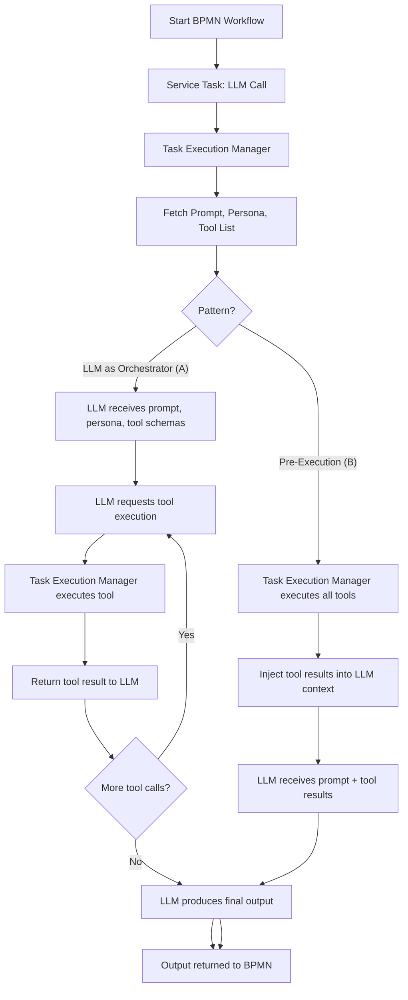

# DADMS Development Process Capture

## Purpose
This document captures the ongoing development process, key decisions, rationale, and milestones for the DADMS 2.0 project. It serves as a living record to ensure transparency, knowledge sharing, and continuous improvement.

---

## Process Overview
- **Scaffold First:** Rapidly prototype UI/UX with local state and placeholder data.
- **Iterate on UX:** Validate workflows and get feedback before backend integration.
- **API Integration:** Replace local state with real API/database calls once UI is validated.
- **Continuous Documentation:** Update this document as decisions are made and milestones are reached.

---

## Development Tooling Update

- **pm2 for Local Process Management:** Adopted [pm2](https://pm2.keymetrics.io/) as a process manager for local development. pm2 is used to manage the Next.js dev server (and can be extended to other Node.js services), providing easier process control, auto-restart, and unified logging. This simplifies running and monitoring the UI and backend services during development.

  Example command to start the UI dev server:
  ```bash
  cd ~/dadms/dadms-ui
  pm2 start npm --name dadms-ui-dev -- run dev
  ```
  Use `pm2 list`, `pm2 logs`, `pm2 stop <name>`, and `pm2 delete <name>` for process management.

---

## Key Decisions & Rationale
- **UI Scaffolding:** Use local state for domains/tags to enable fast iteration and feedback.
- **Domain/Tag Model:** Domains and tags are managed centrally for governance and reusability. Tags can span multiple domains (multi-select).
- **Separation of Concerns:** Frontend handles UX, backend handles chunking, vectorization, and storage.
- **Best Practice Alignment:** Follow modern SaaS and knowledge management patterns for extensibility and maintainability.

---

## Known Issues & Lessons Learned

- **Camunda Variable Truncation:** Camunda's default schema uses `VARCHAR(4000)` for string process variables, which can cause truncation of large context data (e.g., long JSON or prompt context). In previous installations, attempts to alter the table type to `TEXT` were difficult and risky. The recommended approach is to use Camunda's `bytearray` variable type for large payloads instead of changing the table schema. No change is made now, but this is a known limitation to address if large context must be passed through BPMN workflows.

---

## Container Orchestration & Process Engine Integration

- **Podman Compose Adoption:** Switched to using Podman Compose for local container orchestration, ensuring compatibility with rootless containers and modern Linux workflows.
- **Camunda BPM Platform Integration:** Added Camunda BPM Platform to the docker-compose stack to support BPMN workflow execution as part of the DADMS architecture.
- **Camunda 7.15.0/Postgres 15 Issue:** Initial attempt to use Camunda 7.15.0 with Postgres 15 failed due to JDBC driver incompatibility with the default `scram-sha-256` authentication in newer Postgres versions (error: `The authentication type 10 is not supported`).
- **Resolution:** Upgraded Camunda to 7.18.0, which includes a newer JDBC driver supporting Postgres 13+ authentication methods. This resolved the startup and connectivity issues without requiring changes to Postgres configuration or downgrading the database version.
- **Rationale:** Upgrading Camunda was the least disruptive and most future-proof solution, maintaining compatibility with the latest Postgres and container best practices.

---

## Milestones & Progress
- **Day 1:** Project CRUD UI and backend complete.
- **Day 2:** Knowledge page scaffolded; Domain and Tag management UIs scaffolded with local state.
- **Next:** Document upload and RAG search UI scaffolding; backend API integration for knowledge entities.
- **Day X:** BPMN Workspace scaffolded with iframe integration of comprehensive_bpmn_modeler.html and localStorage-based model state management.
- **Day X:** Camunda BPM Platform added to docker-compose; verified integration with Postgres 15 using Camunda 7.18.0 and Podman Compose. Documented and resolved authentication compatibility issues.

---

## Teams Tab Enhancements (Context Manager)

- Teams can now specify if a moderator is employed (checkbox in team dialog)
- If enabled, a moderator persona can be selected from all available personas (not limited to team members)
- Decision agreement type can be set for each team (dropdown: Voting, Moderator decides, Third party, Consensus, Random/Lottery)
- Team data model updated to include: `uses_moderator`, `moderator_id`, and `decision_type`
- Team summary displays decision type and moderator (if set)
- UI/UX designed for easy backend integration in future

---

## Process Manager Page Addition

- Added a new `/process` page featuring a `ProcessManager` component for BPMN process management.
- Sidebar navigation link included for direct access from the main app navigation.
- Features:
  - Lists process definitions (grouped by key, version selection)
  - Lists process instances with status, start time, duration, business key
  - Dialogs for starting, viewing, and deleting processes
  - Summary cards for active, total, and available definitions
  - Auto-refresh toggle and error handling
  - Material-UI layout for consistency
- Scaffolded with mock data and placeholder fetches, ready for real API integration.
- UI and workflow closely match the legacy DADMS process management tool for user familiarity and smooth transition.

---

## Next Steps
- Scaffold Document Upload and Knowledge Search UIs.
- Define and implement backend API endpoints for domains, tags, documents, and search.
- Integrate frontend with backend for persistent data.
- Continue to update this document as new decisions and milestones occur.

---

## Potential Future Additions & Considerations (Knowledge Service Frontend)
- **Upload UX:** Drag-and-drop, progress indicators, file type/size validation.
- **Search UX:** Pagination, advanced filters, highlighting, bulk actions.
- **Document Actions:** Preview, download, versioning, audit trail.
- **Bulk Operations:** Bulk delete, tag, download.
- **Collaboration:** Comments, annotations, approval workflow.
- **Permissions:** Role-based access, action visibility.
- **Integration:** API, real-time updates, external sources, export.
- **Accessibility:** Keyboard navigation, ARIA, localization.
- **LLM Playground Expansion:** Future versions will support agent personas, threads, and RAG data integration for advanced LLM workflows.

---

*This document is updated regularly as the DADMS project evolves. Reminders to update are set as part of the agent workflow.* 

## LLM Playground – Best Practices & Future Enhancements

1. **Prompt Templates**: Allow users to select/save common prompt templates.
2. **System/Instruction Prompts**: Field for system-level instructions (e.g., “You are a helpful assistant…”).
3. **Response Formatting Options**: Let users choose output format (plain text, markdown, JSON, etc.).
4. **Token/Cost Estimation**: Show estimated token usage and cost for each prompt.
5. **Streaming Responses**: Support streaming output for long completions.
6. **Context Window Preview**: Display context size and warn if near model limits.
7. **Thread/History Management**: View, continue, or branch from previous conversations.
8. **Context Injection**: Inject project/domain/tag knowledge or previous messages as context.
9. **Dynamic Model Capabilities**: Show model-specific features and disable unsupported options.
10. **Provider Health/Quota**: Display provider status, rate limits, or quota remaining.
11. **Key Source Transparency**: Clearly indicate which API key is in use.
12. **Data Privacy Notice**: Remind users about third-party provider data handling.
13. **Tool Calling UI**: Prepare UI for tool-calling and show available tools.
14. **Plugin/Extension Support**: Architect UI for easy addition of new providers/models/tools.
15. **Audit Trail**: Optionally log LLM interactions for auditability.
16. **Test Harness**: Provide a way to run regression tests on the playground.
17. **User Documentation/Help**: Inline help/tooltips and a link to playground documentation. 

## Context Manager/Prompt Manager – Future Advancements

- **Fuzzy Matching:** Support for evaluating prompt outputs using similarity metrics (e.g., semantic similarity, Levenshtein distance) rather than strict exact match, to better handle open-ended or creative tasks.
- **Human-in-the-Loop Review:** Allow human reviewers to score or approve outputs from probabilistic test runs, especially for subjective or complex tasks where automated scoring is insufficient.
- **Convergence Auto-Stop:** Implement logic to automatically stop probabilistic testing once the pass/fail rate stabilizes within a confidence interval, reducing unnecessary runs and speeding up validation.
- **Parameter Sweep:** Enable automated testing across a range of model parameters (e.g., temperature, top_p) to find optimal settings for reliability.
- **Batch/Matrix Testing:** Allow batch testing of multiple prompts, personas, and tools across all available models for comprehensive compatibility and reliability analysis.
- **Approval Thresholds:** Support configurable thresholds for prompt approval (e.g., "must pass ≥95% of runs"), with visual feedback in the UI. 

## LLM + Tool Orchestration Patterns for BPMN Workflows

### Recommended Pattern: LLM as Orchestrator (Tool-Calling)
- **Description:**
  - The LLM is called as a service task with a prompt, persona, and a schema describing available tools (from the persona's access list).
  - The LLM can request tool executions as needed (using function-calling or a structured output format).
  - The Task Execution Manager acts as a tool router: it executes tool calls requested by the LLM, returns results, and continues the LLM conversation until a final output is produced.
- **Benefits:**
  - Maximum flexibility: LLM can decide which tools to use, in what order, and how many times.
  - BPMN remains simple: only one service task is needed for the LLM+tool orchestration.
  - Tool access and definitions are managed in the Context Manager/persona, not hardcoded in BPMN.
  - Extensible and future-proof: easy to add new tools, personas, or prompt patterns.
- **Implementation Notes:**
  - Use OpenAPI/JSON schema to describe tool APIs to the LLM.
  - Use standard function-calling or a custom JSON block for tool requests.
  - Log all tool calls/results for auditability.

### Alternative Pattern: Pre-Execution (Static Tool Injection)
- **Description:**
  - Before calling the LLM, the Task Execution Manager executes all tools associated with the persona (or specified in the prompt), collects their results, and injects them into the LLM context as part of the prompt.
  - The LLM receives a prompt with tool results already included, but cannot request additional tool calls during execution.
- **Benefits:**
  - Simpler for deterministic, single-step tool usage.
  - Useful when tool results must be available before the LLM call, or when tool execution must be tightly controlled.
- **When to Use:**
  - For tasks where all required tool results are known in advance and do not depend on LLM reasoning.
  - For compliance, audit, or performance reasons where dynamic tool-calling is not desired.

### Summary Table
| Pattern                | Flexibility | BPMN Simplicity | LLM Autonomy | Best for DADMS? |
|------------------------|-------------|-----------------|--------------|-----------------|
| LLM as Orchestrator    | High        | High            | High         | ✅ Yes          |
| Pre-Execution (Static) | Medium      | High            | Low          | Sometimes       |
| BPMN Multi-Task        | Low         | Low             | Low          | Not preferred   |

**Note:** While Option A (LLM as Orchestrator) is the primary pattern for DADMS, Option B (Pre-Execution) may be needed in special cases. The architecture supports both, allowing for flexibility as requirements evolve. 

### LLM + Tool Orchestration Patterns – Visual Diagram

Below is a visual representation of both the LLM as Orchestrator (tool-calling) and Pre-Execution (static tool injection) patterns for tool context injection in BPMN workflows:



*This diagram illustrates the two supported patterns for tool context injection in DADMS BPMN workflows, showing the flow of data and execution between BPMN, the Task Execution Manager, the LLM, and tools.* 

## BPMN Workspace – Future Enhancements

The initial BPMN Workspace uses an iframe to embed the comprehensive_bpmn_modeler.html and localStorage for model state. Planned future enhancements include:

1. **Backend Persistence:** Save/load BPMN XML to/from the backend, supporting project-scoped models and multi-user access.
2. **Project-Scoped Models:** Associate BPMN models with specific projects, enabling multiple workflows per project and seamless integration with the Project Service.
3. **Advanced Modeler Integration:** Replace the iframe with a React-wrapped modeler for deeper UI integration, custom controls, and real-time collaboration features.
4. **Collaborative Editing:** Support real-time multi-user editing of BPMN models using WebSockets or similar technology.
5. **Model Versioning:** Track changes and support version history/rollback for BPMN models.
6. **AI Assistance:** Integrate AI-powered suggestions for process design, node completion, and error correction directly in the workspace.
7. **Process Deployment:** Enable direct deployment of BPMN models to the process engine (e.g., Camunda) from the workspace UI.
8. **Audit & Export:** Provide audit trails, export options (PDF, SVG), and integration with the Document Generator service.

These enhancements will be prioritized based on user feedback and MVP progress, with a focus on delivering a robust, extensible BPMN workflow design experience. 