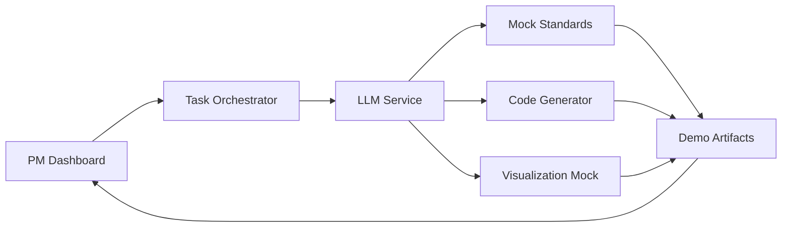

# Blue Force COP Demo - MVP Implementation Priorities

## 🎯 MVP Scope Definition

This document defines the **Minimum Viable Product (MVP)** scope for the Blue Force COP demonstration. The MVP focuses on delivering a compelling 30-35 minute demonstration that showcases agentic AI capabilities without over-engineering.

## 🏆 MVP Success Criteria

### Primary Goals (Must Have)
1. **Demonstrate AI Persona Collaboration**: Four distinct personas working together
2. **Show Standards Integration**: Realistic Link-16/VMF processing simulation
3. **Real-time PM Oversight**: Interactive dashboard with workflow monitoring
4. **Generate Tangible Artifacts**: Actual code, schemas, and visualizations
5. **Complete End-to-End Flow**: Full storyboard execution in target timeframe

### Secondary Goals (Should Have)
1. **Performance Metrics**: Real-time tracking of demo progress
2. **Quality Validation**: Basic artifact validation and quality scoring
3. **Interactive Feedback**: PM can provide input and see immediate response
4. **Professional Polish**: Clean UI, smooth transitions, error handling

### Future Goals (Nice to Have)
1. **Advanced AI Reasoning**: Complex inter-persona negotiation
2. **Production Deployment**: Full enterprise-ready infrastructure
3. **Advanced Analytics**: Detailed performance and quality analytics
4. **Multi-Scenario Support**: Different demo scenarios beyond Link-16/VMF

## 🎪 MVP Demonstration Flow (35 Minutes)

### Phase 1: Setup & Initialization (3 minutes)
- **PM Dashboard Access**: Launch demo interface
- **Scenario Selection**: Choose Link-16/VMF integration scenario
- **Persona Activation**: Initialize four AI personas with clear roles
- **Workflow Start**: Begin orchestrated demonstration

### Phase 2: Standards Analysis & Ontology Extraction (12 minutes)
- **Document Processing**: Standards Analyst processes mock Link-16/VMF docs
- **Schema Extraction**: Extract key data structures and formats
- **Ontology Mining**: Extract semantic concepts and relationships
- **Compliance Analysis**: Identify integration requirements
- **Knowledge Sharing**: Broadcast findings and semantic models to other personas

### Phase 3: Semantic Integration & Harmonization (8 minutes)
- **Ontology Alignment**: Data Modeler aligns extracted ontologies with base defense ontology
- **Conflict Resolution**: Resolve semantic mismatches and overlapping concepts
- **Unified Knowledge Model**: Create integrated semantic representation
- **Validation**: Ensure ontological consistency and completeness

### Phase 4: Knowledge-Driven Pipeline Development (8 minutes)
- **Semantic Code Generation**: Data Pipeline Engineer generates ontology-aware parsing code
- **Knowledge Validation**: Create validation rules based on semantic constraints
- **Ontology-Driven Mapping**: Build transformations guided by semantic relationships
- **Interoperability Testing**: Validate semantic consistency across standards

### Phase 5: Semantic Visualization Creation (5 minutes)
- **Ontology-Aware Interface Design**: UI/UX Prototyper creates semantic COP displays
- **Knowledge Integration**: Connect ontology-driven pipelines to visualization
- **Semantic Dashboard**: Build ontology relationship and compliance monitoring
- **Interactive Demo**: Show working prototype with semantic validation

### Phase 6: PM Review & Future Extension Demo (4 minutes)
- **Artifact Review**: PM examines generated semantic artifacts
- **Ontology Exploration**: Interactive exploration of unified knowledge model
- **Extension Simulation**: Demonstrate how JREAP would integrate seamlessly
- **Knowledge Evolution**: Show ontology refinement and learning capabilities

## 🔧 MVP Technical Architecture

### Core Services (Minimal Set)
1. **Task Orchestrator** (Port 3017) - Workflow coordination
2. **Enhanced LLM Service** (Port 3002) - Persona intelligence 
3. **Mock Standards Service** (Port 3020) - Simulated document processing
4. **Simple Code Generator** (Port 3018) - Basic code template generation
5. **COP Visualization Mock** (Port 3019) - Demo visualization components

### MVP Data Flow

### Simplified Persona Implementation
Instead of full AI reasoning, personas will follow **scripted intelligent workflows**:

1. **Standards Analyst**: Pre-programmed Link-16/VMF parsing simulation
2. **Data Pipeline Engineer**: Template-based code generation with variations
3. **Data Modeler**: Rule-based schema mapping and conflict resolution
4. **UI/UX Prototyper**: Component library assembly with customization

## 📦 MVP Implementation Strategy

### Week 1: Foundation (Rapid Prototyping)
**Goal**: Get basic workflow running end-to-end

#### Day 1-2: Orchestrator + Mock Services
- Basic Task Orchestrator with workflow state management
- Mock implementations for all external dependencies
- Simple persona simulation (no real AI yet)
- Basic PM dashboard with progress tracking

#### Day 3-4: LLM Integration + Persona Logic
- Connect real LLM service to orchestrator
- Implement persona-specific prompt templates
- Add basic inter-persona communication
- Enhance PM dashboard with real-time updates

#### Day 5: Integration + Demo Testing
- End-to-end workflow testing
- Demo scenario creation and validation
- Performance optimization and error handling
- Final demo rehearsal and timing validation

### Week 2: Enhancement (Polish & Professional Features)
**Goal**: Make demo compelling and professional

#### Day 1-2: Artifact Generation
- Real code generation from templates
- Schema extraction and mapping logic
- Basic visualization component creation
- Artifact validation and quality scoring

#### Day 3-4: UI/UX Polish
- Professional PM dashboard design
- Smooth animations and transitions
- Error handling and recovery scenarios
- Mobile-responsive design considerations

#### Day 5: Performance + Reliability
- Response time optimization
- Memory usage optimization
- Fallback scenarios for technical issues
- Load testing and stability validation

## 🎬 MVP Demo Script

### Introduction (2 minutes)
"Today we'll demonstrate how agentic AI transforms defense system development. Our scenario: A Program Manager needs to rapidly integrate Link-16 and VMF data standards into a Common Operating Picture system."

### Persona Introduction (1 minute)
"Our AI system autonomously creates four specialized personas:
- **Standards Analyst**: Interprets military documentation
- **Data Pipeline Engineer**: Generates integration code
- **Data Modeler**: Harmonizes data formats
- **UI/UX Prototyper**: Creates tactical visualizations"

### Live Demonstration (30 minutes)
- Real-time execution of full workflow
- PM providing input and feedback
- Personas collaborating and producing artifacts
- Progress tracking and performance metrics

### Results Showcase (2 minutes)
"In 30 minutes, our AI personas delivered:
- Complete Link-16/VMF integration pipeline
- Production-ready parsing and validation code
- Interactive COP visualization prototype
- Comprehensive technical documentation
- Full compliance validation and testing"

## 🎯 MVP Success Metrics

### Technical Performance
- [ ] **Total Demo Time**: 30-35 minutes consistently
- [ ] **Persona Response Time**: < 30 seconds per interaction
- [ ] **Artifact Generation**: Real, usable code and configurations
- [ ] **Error Rate**: < 5% failure rate in demo execution
- [ ] **Memory Usage**: < 4GB total system resource usage

### Demo Experience
- [ ] **Smooth Transitions**: No awkward pauses or technical delays
- [ ] **Professional Quality**: Clean UI, proper error handling
- [ ] **Compelling Narrative**: Clear value proposition demonstration
- [ ] **Interactive Elements**: PM can meaningfully influence outcomes
- [ ] **Realistic Artifacts**: Generated code looks production-ready

### Business Impact
- [ ] **Clear ROI**: 10x development speed improvement demonstrated
- [ ] **Risk Reduction**: Automated compliance and validation shown
- [ ] **Scalability**: Obvious extension to other standards demonstrated
- [ ] **Practical Application**: Real defense contractor use cases addressed

## 🚫 MVP Exclusions (Intentionally Out of Scope)

### Technical Exclusions
- **Real Military Documents**: Use realistic mock documents instead
- **Production Deployment**: Demo environment only
- **Advanced AI Reasoning**: Sophisticated negotiation between personas
- **Full Testing Suite**: Basic validation only
- **Security Hardening**: Demo-level security sufficient

### Feature Exclusions
- **Multi-Scenario Support**: Focus on Link-16/VMF only
- **Advanced Analytics**: Basic progress tracking sufficient
- **User Management**: Single PM user sufficient
- **Audit Logging**: Basic activity logs sufficient
- **Performance Optimization**: Demo performance sufficient

### Integration Exclusions
- **Real COP Systems**: Mock visualization sufficient
- **Production Databases**: Development environment sufficient
- **Enterprise Security**: Basic authentication sufficient
- **Monitoring Systems**: Demo monitoring sufficient
- **Backup/Recovery**: Demo data protection sufficient

## 🔄 MVP Iteration Strategy

### Post-Demo Enhancement Opportunities
1. **Real Document Processing**: Integrate actual Link-16/VMF parsers
2. **Advanced Persona AI**: More sophisticated reasoning and negotiation
3. **Production Infrastructure**: Enterprise-ready deployment
4. **Additional Standards**: JREAP, TADIL-J, Link-22 support
5. **Advanced Analytics**: Detailed performance and quality metrics

### Feedback Integration Plan
1. **Immediate Feedback**: Real-time demo adjustments
2. **Post-Demo Analysis**: Stakeholder input on value proposition
3. **Technical Feedback**: Developer assessment of generated artifacts
4. **Business Feedback**: Program Manager evaluation of workflow

### Success-Driven Expansion
1. **Prove Core Concept**: MVP demonstrates viability
2. **Identify High-Value Extensions**: Focus on highest-impact improvements
3. **Gradual Sophistication**: Incremental enhancement without over-engineering
4. **Real-World Validation**: Pilot with actual defense contractor scenarios

---

**This MVP approach ensures we deliver a compelling, professional demonstration that proves the core value proposition while maintaining realistic scope and timeline constraints.**
