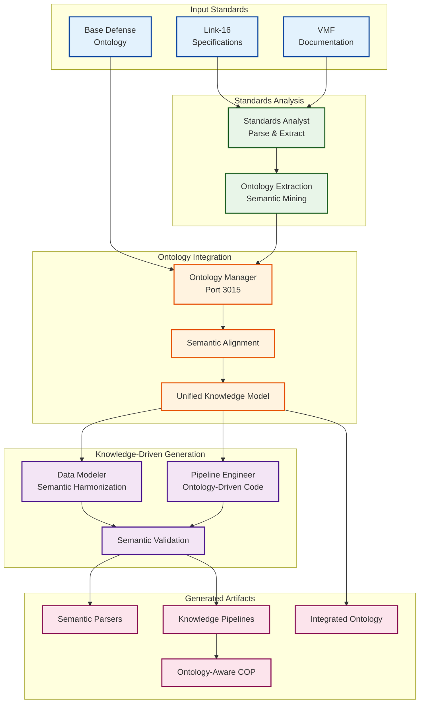

# Blue Force COP Demo - Ontology-Driven Integration Enhancement

## 🎯 Enhanced Vision: Semantic Interoperability Platform

The addition of ontology extraction and mapping transforms our demonstration from a **code generation platform** to a **semantic interoperability platform**. This positions DADMS as the foundation for truly intelligent, knowledge-driven system integration.

## 🧠 Ontology Integration Workflow

### Enhanced Demonstration Flow (40-45 minutes)

#### Phase 1: Setup & Initialization (3 minutes)
- PM Dashboard Access & Scenario Selection
- Persona Activation with ontology-aware capabilities
- **Base Ontology Loading**: Initialize with Defense/COP core ontology

#### Phase 2: Standards Analysis & Ontology Extraction (12 minutes)
- **Document Processing**: Standards Analyst processes Link-16/VMF docs
- **Schema Extraction**: Extract technical structures and relationships
- **Ontology Mining**: Extract domain concepts, relationships, and semantics
- **Semantic Analysis**: Identify concepts, properties, and constraints

#### Phase 3: Ontology Mapping & Harmonization (10 minutes)
- **Base Ontology Alignment**: Map extracted concepts to core ontology
- **Conflict Resolution**: Resolve semantic mismatches and overlaps
- **Unified Knowledge Model**: Create integrated semantic representation
- **Validation**: Ensure ontological consistency and completeness

#### Phase 4: Knowledge-Driven Pipeline Development (12 minutes)
- **Ontology-Driven Code Generation**: Generate parsers based on semantic model
- **Semantic Validation Logic**: Create validation rules from ontological constraints
- **Transformation Pipelines**: Build data flows guided by ontological mappings
- **Interoperability Testing**: Validate semantic consistency across standards

#### Phase 5: Visualization & Knowledge Presentation (5 minutes)
- **Semantic COP Interface**: Create ontology-aware tactical displays
- **Knowledge Dashboard**: Visualize ontological relationships and mappings
- **Compliance Monitoring**: Show semantic validation and constraint checking

#### Phase 6: PM Review & Future Extension Demonstration (3 minutes)
- **Artifact Review**: Examine ontology-driven artifacts
- **Extension Simulation**: Show how new standards would integrate
- **Knowledge Evolution**: Demonstrate ontology refinement capabilities

## 🏗️ Enhanced Technical Architecture

### New Ontology Services

#### 1. Ontology Manager Service (Port 3015)
**Purpose**: Manage base ontologies and extracted semantic models

**Key Capabilities**:
- Base ontology storage and versioning
- Ontology merging and alignment algorithms
- Semantic reasoning and validation
- Knowledge graph construction and querying

**API Endpoints**:
```typescript
GET /api/ontologies/base/{domain}
POST /api/ontologies/extract/{standard}
POST /api/ontologies/align/{source}/{target}
GET /api/ontologies/unified/{workflow_id}
POST /api/ontologies/validate/{ontology_id}
```

#### 2. Enhanced Ontology Workspace Service (Port 3016)
**Purpose**: Interactive ontology development and visualization

**Enhanced Capabilities**:
- Real-time ontology editing and refinement
- Semantic conflict detection and resolution
- Ontology visualization and exploration
- Collaborative ontology development

### Enhanced Persona Capabilities

#### Enhanced Standards Analyst Persona
**New System Prompt Addition**:
```
You are also a semantic knowledge engineer. Beyond parsing technical specifications, 
you extract and formalize domain knowledge into structured ontologies. You identify:
- Core concepts and their hierarchical relationships
- Properties and their domains/ranges
- Semantic constraints and validation rules
- Cross-standard concept mappings and equivalencies

Your ontological analysis feeds into knowledge-driven system integration.
```

**Enhanced Tasks**:
- Document parsing and schema extraction
- **Ontology extraction from technical specifications**
- **Concept identification and relationship mapping**
- **Semantic annotation of data structures**

#### Enhanced Data Modeler Persona
**New System Prompt Addition**:
```
You are now an ontology integration specialist. You work with semantic models 
to ensure true interoperability. You align ontologies from different standards, 
resolve semantic conflicts, and create unified knowledge representations that 
drive automated integration pipelines.
```

**Enhanced Tasks**:
- **Ontology alignment and merging**
- **Semantic conflict resolution**
- **Unified knowledge model creation**
- Schema mapping based on semantic relationships

#### Enhanced Data Pipeline Engineer Persona
**New System Prompt Addition**:
```
Your code generation is now driven by semantic knowledge models. You create 
pipelines that understand the meaning of data, not just its structure. Your 
generated code includes semantic validation, ontology-aware transformations, 
and knowledge-driven interoperability checks.
```

**Enhanced Tasks**:
- **Ontology-driven parser generation**
- **Semantic validation logic creation**
- **Knowledge-aware transformation pipelines**
- Interoperability testing with semantic verification

## 📊 Enhanced Data Flow



## 🎭 Enhanced Persona Interactions

### New Collaboration Patterns

#### Standards Analyst → Ontology Manager
```typescript
interface OntologyExtractionRequest {
  standard_name: 'LINK_16' | 'VMF';
  extracted_concepts: Concept[];
  relationships: Relationship[];
  constraints: SemanticConstraint[];
  confidence_scores: Record<string, number>;
}
```

#### Ontology Manager → Data Modeler
```typescript
interface SemanticAlignmentResult {
  unified_ontology: UnifiedOntology;
  concept_mappings: ConceptMapping[];
  resolved_conflicts: ConflictResolution[];
  integration_recommendations: IntegrationRecommendation[];
}
```

#### Data Modeler → Pipeline Engineer
```typescript
interface KnowledgeModelInput {
  semantic_schema: SemanticSchema;
  ontology_constraints: OntologyConstraint[];
  interoperability_rules: InteroperabilityRule[];
  validation_semantics: ValidationSemantic[];
}
```

## 📚 Base Ontology Design

### Defense COP Core Ontology Structure

```turtle
@prefix cop: <http://dadms.ai/ontology/cop#> .
@prefix rdf: <http://www.w3.org/1999/02/22-rdf-syntax-ns#> .
@prefix rdfs: <http://www.w3.org/2000/01/rdf-schema#> .
@prefix owl: <http://www.w3.org/2002/07/owl#> .

# Core Entity Classes
cop:TacticalEntity rdf:type owl:Class ;
  rdfs:label "Tactical Entity" ;
  rdfs:comment "Base class for all tactical objects in COP" .

cop:Platform rdf:type owl:Class ;
  rdfs:subClassOf cop:TacticalEntity ;
  rdfs:label "Platform" .

cop:Track rdf:type owl:Class ;
  rdfs:subClassOf cop:TacticalEntity ;
  rdfs:label "Track" .

cop:Message rdf:type owl:Class ;
  rdfs:label "Tactical Message" .

# Core Properties
cop:hasPosition rdf:type owl:ObjectProperty ;
  rdfs:domain cop:TacticalEntity ;
  rdfs:range cop:GeospatialPosition .

cop:hasIdentification rdf:type owl:ObjectProperty ;
  rdfs:domain cop:TacticalEntity ;
  rdfs:range cop:Identification .

cop:transmitsMessage rdf:type owl:ObjectProperty ;
  rdfs:domain cop:Platform ;
  rdfs:range cop:Message .

# Data Types and Constraints
cop:GeospatialPosition rdf:type owl:Class ;
  rdfs:label "Geospatial Position" .

cop:Identification rdf:type owl:Class ;
  rdfs:label "Entity Identification" .
```

### Link-16 Specific Ontology Extension

```turtle
@prefix link16: <http://dadms.ai/ontology/link16#> .

# Link-16 Specific Classes
link16:JMessage rdf:type owl:Class ;
  rdfs:subClassOf cop:Message ;
  rdfs:label "Link-16 J-Message" .

link16:PPLI rdf:type owl:Class ;
  rdfs:subClassOf link16:JMessage ;
  rdfs:label "Precise Participant Location and Identification" .

link16:SPPLI rdf:type owl:Class ;
  rdfs:subClassOf link16:JMessage ;
  rdfs:label "Surface PPLI" .

# Link-16 Properties
link16:hasJSeries rdf:type owl:DatatypeProperty ;
  rdfs:domain link16:JMessage ;
  rdfs:range xsd:string .

link16:hasTN rdf:type owl:DatatypeProperty ;
  rdfs:domain link16:PPLI ;
  rdfs:range xsd:integer ;
  rdfs:comment "Track Number" .
```

## 🚀 Implementation Enhancements

### Enhanced Sprint 1: Foundation + Ontology (Week 1)

#### Day 1-2: Task Orchestrator + Ontology Manager
- Basic Task Orchestrator with workflow management
- **Ontology Manager Service** foundation (Port 3015)
- Base defense ontology loading and storage
- Basic ontology alignment algorithms

#### Day 3: Enhanced Standards Analysis
- **Enhanced Knowledge Service** with ontology extraction
- Link-16/VMF concept mining capabilities
- Semantic annotation of extracted schemas
- Integration with Ontology Manager

#### Day 4-5: Semantic Integration Pipeline
- **Enhanced Data Modeler** persona with ontology awareness
- Semantic conflict detection and resolution
- Unified knowledge model generation
- **Ontology-driven code generation** foundation

### Enhanced Success Metrics

#### Technical Performance
- **Ontology Extraction Time**: < 3 minutes per standard
- **Semantic Alignment**: < 2 minutes for conflict resolution
- **Knowledge Model Generation**: < 1 minute for unified ontology
- **Total Demo Time**: 40-45 minutes (enhanced from 35 minutes)

#### Semantic Quality
- **Concept Coverage**: > 90% of standard concepts captured
- **Alignment Accuracy**: > 95% correct semantic mappings
- **Ontology Consistency**: 100% logically consistent unified model
- **Interoperability Validation**: Automated semantic compatibility checking

## 🎯 Enhanced Value Proposition

### For Defense Contractors
- **True Semantic Interoperability**: Beyond syntax to meaning-aware integration
- **Future-Proof Architecture**: New standards integrate seamlessly into existing ontology
- **Knowledge Preservation**: Institutional knowledge captured in machine-readable form
- **Automated Compliance**: Semantic validation ensures standard adherence

### For Program Managers
- **Strategic Knowledge Management**: Understanding system capabilities at semantic level
- **Integration Roadmap**: Clear view of how new standards will fit existing systems
- **Risk Mitigation**: Semantic conflicts identified and resolved before implementation
- **Technology Evolution**: Platform grows intelligently with new requirements

### For System Architects
- **Ontology-Driven Design**: Architecture decisions based on semantic relationships
- **Interoperability by Design**: Systems inherently compatible through shared semantics
- **Knowledge Reuse**: Existing ontological investments leveraged for new integrations
- **Scalable Integration**: Platform supports unlimited standard additions

## 🔮 Future Extension Scenarios

### Additional Standards Integration
1. **JREAP Integration**: Show how existing Link-16/VMF ontology facilitates JREAP addition
2. **NATO Standards**: Demonstrate semantic compatibility across alliance systems
3. **Multi-Domain Operations**: Extend ontology to land, sea, air, space, cyber domains
4. **Coalition Interoperability**: Semantic bridges between different national standards

### Advanced Capabilities Demonstration
1. **Ontology Evolution**: Show how ontologies improve through usage and feedback
2. **Semantic Reasoning**: Demonstrate inference and knowledge discovery
3. **Conflict Prediction**: Anticipate integration challenges before they occur
4. **Knowledge Query**: Natural language queries against integrated semantic model

## 📊 Enhanced Demo Script

### Enhanced Introduction (3 minutes)
"Today we'll demonstrate not just AI-accelerated integration, but **semantic interoperability**. Our system doesn't just parse formats—it understands meaning. Watch as AI personas extract knowledge, align semantics, and generate truly interoperable solutions."

### Ontology Extraction Showcase (5 minutes)
"Our Standards Analyst doesn't just see data fields—it understands concepts. Watch as it extracts the semantic model from Link-16 specifications, identifying not just 'track number' but understanding it represents 'unique tactical entity identification within battlespace coordination protocol.'"

### Semantic Alignment Demonstration (3 minutes)
"Now watch the magic—our Data Modeler aligns these extracted concepts with our base defense ontology. Different standards use different terms for the same concepts. Our AI identifies that Link-16 'PPLI' and VMF 'position report' are semantically equivalent."

### Knowledge-Driven Generation (5 minutes)
"Code generation is now meaning-aware. The Pipeline Engineer creates parsers that understand semantics, not just syntax. The resulting integration validates meaning, not just format compliance."

### Future Integration Preview (2 minutes)
"Here's the real power—adding JREAP tomorrow takes minutes, not months. The semantic foundation is already there. New standards map to existing knowledge, creating instant interoperability."

---

**This ontology-enhanced approach transforms our demonstration from impressive to revolutionary. We're not just showing fast code generation—we're demonstrating the future of semantic interoperability in defense systems! 🚀🧠**
