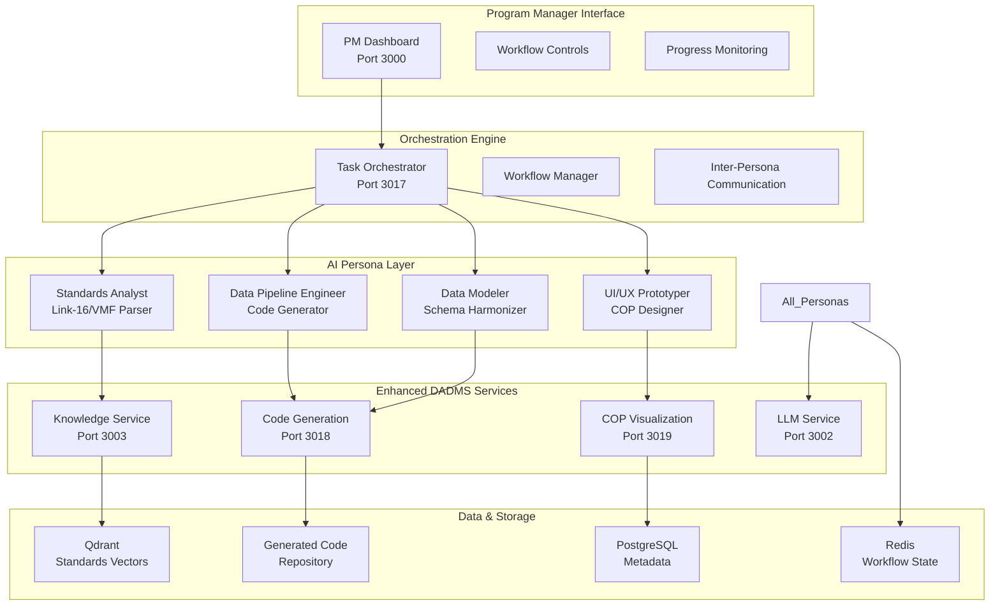

# Blue Force COP Demo - Technical Implementation Specification

## 🎯 Executive Summary

This specification details the technical implementation of a Blue Force Common Operating Picture (COP) demonstration using DADMS as an agentic AI platform. The demo showcases autonomous AI personas collaborating to integrate military data standards (Link-16, VMF) into a tactical COP system under Program Manager oversight.

## 🏗️ Current Architecture Assessment

### Existing DADMS Foundation
Based on our codebase analysis, we have these key components ready:

#### ✅ Already Available
- **Persona Management System**: `dadms-ui/src/components/ContextManager/PersonaManager.tsx`
  - Persona definition with roles, expertise, guidelines, tools
  - Tag-based categorization system
  - Tool assignment capability
- **Context Manager Service**: Referenced in project structure (Port 3005)
- **LLM Service**: Multi-provider LLM integration (Port 3002)
- **Knowledge Service**: Document storage and RAG with Qdrant (Port 3003)
- **Infrastructure**: PostgreSQL, Qdrant, Redis via Docker Compose
- **UI Foundation**: React/TypeScript with component library

#### 🔧 Needs Enhancement
- **Task Orchestration**: Currently no Task Orchestrator service
- **Standards Parsing**: No military standards document processing
- **Code Generation**: No automated pipeline generation
- **COP Visualization**: No tactical display components
- **Workflow Automation**: No multi-persona coordination

## 🎪 Demo Architecture Design

### Core Demonstration Flow



### New Services Required

#### 1. Task Orchestrator Service (Port 3017)
**Purpose**: Coordinate multi-persona workflows and manage demonstration flow

**Key Capabilities**:
- Persona lifecycle management (create, assign, monitor)
- Workflow state management and progression
- Inter-persona communication coordination
- Progress tracking and reporting to PM dashboard

**API Endpoints**:
```typescript
POST /workflows/cop-demo/start
GET /workflows/{workflowId}/status
POST /workflows/{workflowId}/personas/{personaId}/assign-task
GET /personas/{personaId}/progress
POST /workflows/{workflowId}/feedback
```

#### 2. Code Generation Service (Port 3018)
**Purpose**: Automated generation of data processing pipelines and validation logic

**Key Capabilities**:
- Link-16/VMF parser generation
- Data validation and transformation code
- Pipeline orchestration scripts
- Automated testing harness creation

**API Endpoints**:
```typescript
POST /generate/parser/{standard}
POST /generate/pipeline/{sourceSchema}/{targetSchema}
POST /generate/validator/{standard}
GET /generated/{artifactId}/download
```

#### 3. COP Visualization Service (Port 3019)
**Purpose**: Tactical data visualization and COP interface generation

**Key Capabilities**:
- Military symbology rendering
- Real-time data overlay displays
- Compliance dashboard generation
- Interactive tactical maps

**API Endpoints**:
```typescript
POST /visualizations/cop/create
POST /visualizations/cop/{id}/add-layer
GET /visualizations/cop/{id}/preview
POST /visualizations/cop/{id}/deploy
```

### Enhanced Existing Services

#### Knowledge Service Enhancements
**New Capabilities**:
- Military standards document parsing (Link-16, VMF)
- Technical specification extraction
- Schema and field definition identification
- Compliance rule extraction

**Implementation**:
```typescript
// Add to existing Knowledge Service
interface MilitaryStandard {
  standard: 'LINK_16' | 'VMF';
  version: string;
  schemas: SchemaDefinition[];
  fields: FieldDefinition[];
  rules: ComplianceRule[];
}

class StandardsParser {
  async parseLink16Document(document: Buffer): Promise<MilitaryStandard>
  async parseVMFDocument(document: Buffer): Promise<MilitaryStandard>
  async extractSchema(standard: MilitaryStandard): Promise<SchemaDefinition>
}
```

#### LLM Service Enhancements
**New Capabilities**:
- Specialized persona prompts for each COP demo role
- Context-aware reasoning for military standards
- Code generation prompt templates
- Multi-turn conversation management for persona interactions

**Implementation**:
```typescript
// Add persona-specific prompt templates
interface PersonaPrompts {
  STANDARDS_ANALYST: PromptTemplate;
  DATA_PIPELINE_ENGINEER: PromptTemplate;
  DATA_MODELER: PromptTemplate;
  UIUX_PROTOTYPER: PromptTemplate;
}

class COPPersonaManager {
  async executeAsPersona(persona: PersonaType, task: Task): Promise<PersonaResponse>
  async coordinatePersonas(workflow: Workflow): Promise<WorkflowResult>
}
```

## 🎭 Persona Implementation Specifications

### 1. Standards Analyst Persona
**System Prompt**:
```
You are a military standards analyst specializing in Link-16 and VMF protocols. 
Your role is to parse technical documentation, extract schemas, identify compliance rules, 
and provide structured analysis of data standards for integration teams.

Capabilities:
- Parse Link-16 tactical data link specifications
- Extract VMF message format definitions
- Identify required fields and validation rules
- Document compliance requirements and constraints
```

**Tasks**:
- Document ingestion and parsing
- Schema extraction and validation
- Compliance rule identification
- Technical specification documentation

### 2. Data Pipeline Engineer Persona
**System Prompt**:
```
You are a data pipeline engineer specialized in military data integration. 
Your role is to design and generate code for parsing, validating, and transforming 
military data formats into standardized schemas for COP systems.

Capabilities:
- Generate parsing code for Link-16 and VMF formats
- Design data validation and transformation pipelines
- Create automated testing frameworks
- Optimize for real-time processing requirements
```

**Tasks**:
- Parser code generation
- Pipeline architecture design
- Validation logic implementation
- Performance optimization

### 3. Data Modeler Persona
**System Prompt**:
```
You are a data modeling expert focused on military interoperability standards. 
Your role is to harmonize disparate data models, resolve field conflicts, 
and ensure seamless integration across different military data sources.

Capabilities:
- Map between different data schemas
- Resolve field naming and type conflicts
- Design unified data models
- Ensure interoperability compliance
```

**Tasks**:
- Schema mapping and alignment
- Field conflict resolution
- Unified model design
- Interoperability validation

### 4. UI/UX Prototyper Persona
**System Prompt**:
```
You are a UI/UX prototyper specialized in military command and control interfaces. 
Your role is to rapidly design and implement tactical data visualizations, 
compliance dashboards, and COP interface components.

Capabilities:
- Design tactical data visualizations
- Create compliance monitoring dashboards
- Implement military symbology standards
- Optimize for command center environments
```

**Tasks**:
- COP interface design
- Tactical data visualization
- Compliance dashboard creation
- User experience optimization

## 🔄 Demonstration Workflow Implementation

### Phase 1: Initialization (0-2 minutes)
1. **PM Dashboard Launch**: Program Manager accesses COP demo interface
2. **Scenario Setup**: Load Link-16/VMF integration scenario
3. **Persona Activation**: System creates and initializes four AI personas
4. **Task Distribution**: Orchestrator assigns initial tasks to each persona

### Phase 2: Standards Analysis (2-7 minutes)
1. **Document Ingestion**: Standards Analyst ingests Link-16/VMF documentation
2. **Schema Extraction**: Parse and extract technical specifications
3. **Compliance Analysis**: Identify rules and requirements
4. **Knowledge Transfer**: Share findings with other personas

### Phase 3: Pipeline Development (7-17 minutes)
1. **Parser Generation**: Data Pipeline Engineer generates parsing code
2. **Validation Logic**: Create data validation and transformation rules
3. **Schema Harmonization**: Data Modeler aligns disparate schemas
4. **Testing Framework**: Automated test generation and validation

### Phase 4: Visualization Development (17-27 minutes)
1. **COP Interface Design**: UI/UX Prototyper creates tactical displays
2. **Data Integration**: Connect pipelines to visualization components
3. **Compliance Dashboard**: Build monitoring and reporting interfaces
4. **Interactive Prototyping**: Enable PM interaction and feedback

### Phase 5: Integration & Testing (27-32 minutes)
1. **End-to-End Assembly**: Orchestrator combines all components
2. **Automated Testing**: Validate data flow and compliance
3. **Performance Verification**: Ensure real-time processing capabilities
4. **PM Review**: Present integrated solution for evaluation

### Phase 6: Iteration & Documentation (32-35 minutes)
1. **PM Feedback**: Collect requirements and change requests
2. **Rapid Iteration**: Personas adjust solution based on feedback
3. **Documentation Generation**: Auto-create technical artifacts
4. **Deployment Preparation**: Package for production transition

## 🛠️ Implementation Plan

### Week 1: Foundation Services
1. **Task Orchestrator Service** (Days 1-2)
   - Basic persona management
   - Workflow state tracking
   - Simple task assignment

2. **Enhanced Knowledge Service** (Day 3)
   - Military standards parsing
   - Schema extraction capabilities

3. **Code Generation Service** (Days 4-5)
   - Basic parser generation
   - Simple pipeline templates

### Week 2: Persona Intelligence
1. **LLM Service Enhancement** (Days 1-2)
   - Persona-specific prompts
   - Context management

2. **COP Visualization Service** (Days 3-4)
   - Basic tactical displays
   - Simple compliance dashboards

3. **Integration & Testing** (Day 5)
   - End-to-end workflow validation

### Week 3: Demo Polish & Optimization
1. **PM Dashboard Enhancement** (Days 1-2)
   - Real-time monitoring
   - Feedback interfaces

2. **Performance Optimization** (Days 3-4)
   - Response time tuning
   - Resource optimization

3. **Demo Preparation** (Day 5)
   - Scenario testing
   - Presentation materials

## 📊 Success Metrics

### Technical Performance
- **Persona Response Time**: < 30 seconds per task
- **Standards Processing**: Complete Link-16/VMF analysis in < 5 minutes
- **Code Generation**: Functional parser code in < 10 minutes
- **Visualization Creation**: COP prototype in < 15 minutes
- **End-to-End Integration**: Complete workflow in < 35 minutes

### Business Value
- **Development Acceleration**: 10x faster than traditional approaches
- **Standards Compliance**: 100% automated validation
- **Quality Assurance**: Automated testing and verification
- **Documentation**: Complete technical artifacts generated

### User Experience
- **PM Oversight**: Clear visibility into all persona activities
- **Real-time Feedback**: Immediate response to PM input
- **Intuitive Interface**: Minimal learning curve for military users
- **Seamless Integration**: Smooth transition from demo to production

## 🔒 Security & Compliance Considerations

### Data Security
- Secure handling of classified documentation
- Encrypted communication between personas
- Audit trails for all AI decisions
- Compliance with defense security standards

### Access Control
- Role-based access for PM dashboard
- Secure persona-to-persona communication
- Protected code generation artifacts
- Controlled deployment environments

## 🚀 Future Extensions

### Additional Standards Support
- JREAP (Joint Range Extension Application Protocol)
- TADIL-J (Tactical Digital Information Link - J)
- Link-22 (NATO maritime tactical data link)

### Advanced Capabilities
- Real-time data streaming integration
- Multi-domain operations support
- Predictive compliance monitoring
- AI-driven requirements analysis

---

**This technical specification provides the foundation for implementing a compelling Blue Force COP demonstration that showcases the transformative power of agentic AI in defense system development.**
