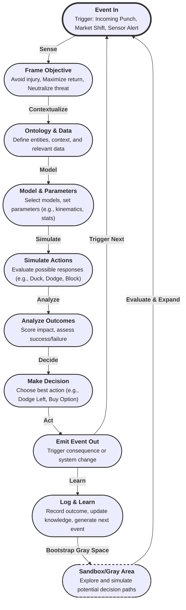
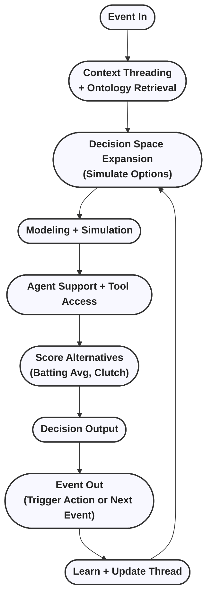

# Event-Driven Decision System (EDS): Concept, Architecture, and Development Strategy

## Executive Summary
The Event-Driven Decision System (EDS) is a next-generation architecture for ingesting real-world events, executing structured decision workflows, and emitting trackable outcomes. Unlike static systems, EDS treats each decision as a bounded, actionable transformation—triggered by an event and resulting in a consequential event. This white paper guides LLM-based agents, developers, and orchestrators in building EDS using composable components, simulation workflows, and scoring.

## Core Philosophy: The Punch Decision Process
EDS uses a real-time, iterative framework inspired by a reflex scenario—the punch:

- **Event In**: Incoming punch (external event)
- **Objective**: Avoid injury (goal)
- **Assumptions**: Opponent is right-handed, expected angle, reaction time
- **Ontology**: Knowledge of "punch," "avoidance," body mechanics
- **Data**: Direction, velocity, position, training history
- **Model**: Motion physics, kinematics, maneuvers
- **Parameterization**: Reflex delay, stance
- **Simulation**: Predict ducking, dodging, blocking
- **Validation**: Test reactions or sparring outcomes
- **Analysis**: Assess outcomes vs objectives
- **Decision**: Dodge left
- **Event Out**: Action occurs, results registered

Each EDS decision follows this structure: trigger, model, simulate, analyze, emit event—forming a closed, learnable loop.

## Foundational Pillars

**1. Event-to-Event Decision Flow**
- **Event In**: Data signal or trigger
- **Workflow**: Model-driven reasoning
- **Event Out**: Action or consequence

**2. Knowledge & Heuristics**
- Ontologies define decision spaces
- Context threads stored in a vector DB with metadata and feedback
- Threads accumulate scores, revisions, impact mappings

**3. Modeling, Simulation, and Analysis**
- Validated models: physics, ML, business
- Simulation tools: AFSIM, Simulink, Python
- Analytical evaluators define scorecards

**4. Agent-Oriented Execution**
- Agents have tools, personas, prompts
- Agents bootstrap, simulate, revise workflows
- Supervisory agents monitor and score outputs

**5. Scoring Mechanism (Baseball Analogy)**
- **Batting Avg**: % successful executions
- **Clutch Score**: Impact x time sensitivity
- **On-Base %**: Utility of partial actions
- **Slugging %**: Impact x frequency
- All decisions, processes, agents earn scores

## Advanced Capabilities

**Event Decision Trees**
- Auto-constructed decision chains
- Simulate branches: event → decision → event
- Game theory for cascading impacts

**Event Decision Space Bootstrapping**
- Map possible outcomes ("gray space")
- Guide agent workflows or human review

**Terminal Events & Action Enforcement**
- Every decision emits an Event Out; system runs continuously, adapting as complexity grows
- Static reports insufficient unless they trigger action
- Terminal decisions must be recorded for learning

## Application Domains
- Aircraft acquisition, options trading, logistics, ISR coordination, digital transformation

## MVP vs Vision
- **MVP**: Reactive execution of structured flows
- **Vision**: Autonomous, self-learning decision graphs

## Implementation Notes
- Use GitHub Copilot for agents, pipelines, workflows
- Cursor manages revisions, memory, design
- Workflows run serially, support parallel tree growth

## Closing Statement
EDS is a continuous reasoning engine, building and acting on a living knowledge base. Every decision is scored, every outcome is real, every improvement is learned.

> *“The digital thread was the promise. EDS is the delivery.”*

---

**Appendix: EDS Workflow (Mermaid)**

This diagram illustrates EDS as a continuous, self-sustaining loop: each decision not only triggers the next event but also explores and bootstraps the "gray space"—a sandbox where new, uncharted decision paths are simulated and evaluated. This ensures the system is always learning, expanding its decision space, and adapting to novel scenarios in real time.

---
## Additional Diagrams
EDS Execution Ecosystem  
This shows the broader architectural loop of how events are handled system-wide, including scoring and agent involvement.

