```mermaid
flowchart LR
    A[Event In] --> EM[Event Manager]
    EM --> B[Context Manager]
    EM --> AAS["Agent Assistance Service (AAS)"]
    B --> C[Ontology Manager]
    B --> D[Memory Manager]
    B --> E[Prompting / Personas / Tooling / Teams]
    C --> F[Requirements Extractor & Conceptualizer]
    F --> G[Model Manager]
    G --> H[Simulation Manager]
    H --> I[Analysis Manager]
    I --> J[Decision Assistant]
    J --> K[Process Manager / BPMN Workspace]
    K --> TO[Task Orchestrator]
    TO --> M[Emit Event Out]
    M --> N[Thread Manager]
    N --> EM
    AAS -->|Read/Write Context| B
    AAS -->|Observe Pages/Events| EM

    style A fill:#eef,stroke:#333,stroke-width:1px
    style EM fill:#e3e3fa,stroke:#333,stroke-width:1px
    style TO fill:#f3f9c6,stroke:#333,stroke-width:1px
    style AAS fill:#daf6ea,stroke:#333,stroke-width:1px
    style M fill:#efe,stroke:#333,stroke-width:1px
    style N fill:#ffd,stroke:#333,stroke-width:1px
```

Here is the updated white paper content, now fully expanded to include the **Context Manager**, **BPMN Workspace with AI-assisted process definitions**, **Process Manager**, **Thread Manager**, **Decision Assistant**, and **Agent Assistance System (AAS)**. It's reflected in the Canvas under **“Executive Overview with Full Architecture”**.

---

# Event-Driven Decision System (EDS) — Executive Overview

### 1. Introduction

Organizations require intelligent systems that not only inform decisions but also **execute** them. EDS provides a **live decision ecosystem**—turning events into scored decisions and real-world outcomes.

---

### 2. Core Capabilities

#### 2.1 Continuous Event-Driven Decision Cycle

* **Event In** triggers ingestion, ontology, simulation, scoring, action, and logging.
* **Event Out** leads directly to action and data capture for the next cycle.

#### 2.2 Modular Manager Services

* **Event Manager**: Reliable event brokerage (pub/sub, replay, topic-based routing).
* **Data Manager**: Ingests, normalizes, tags data; handles metadata and units.
* **Ontology Manager**: Maintains semantic domains, definitions, and mappings.
* **Context Manager**: Retrieves and composes relevant knowledge threads; orchestrates prompt selection, tool assignment, team/role context, and persona-specific framing.

  * **Prompting**: Dynamically selects prompt templates based on event type, role, and objective. Tracks performance.
  * **Tooling**: Manages execution tools assigned to each decision pipeline. Tracks tool use and effectiveness.
  * **Teams**: Filters and applies context at team scope. Supports shared reasoning and collaborative awareness.
  * **Personas**: Defines behavior patterns for agents. Adjusts context handling based on role or mission.
* **Memory Manager**: Stores and scopes memories (short-term, long-term, persona/team).
* **Model Manager**: Registers and versions models (ML, physics, scripts).
* **Simulation Manager**: Executes and scales simulations, reports status and results.
* **Analysis Manager**: Scores outcomes—batting average, clutch, sensitivity, game theory.
* **Parameter Manager**: Manages independent and dependent parameter sets with versioning.
* **Requirements Extractor & System Conceptualizer**: Parses documents and bootstraps system models.
* **Process Manager**: Oversees workflows and pipelines, integrating BPMN definitions.
* **Thread Manager**: Tracks decision threads and links context/memory across event flows.
* **Decision Assistant**: Provides humans with scored recommendations and authority guidance.
* **Agent Assistance System (AAS)**: AI agents with configurable personas, tool access, and autonomy levels.

#### 2.3 BPMN Workspace + AI-Assisted Process Definitions

* Visual BPMN editor powered by real-time AI (e.g., LLMs) to define, refine, and generate pipelines.
* Processes can be compositionally assembled or generated by agents in response to events.

---

### 3. How the Pieces Come Together

#### Example 1: Punch Decision Process

* **Event In**: A punch is detected (e.g., threat detection, market shock).
* **Frame Objective**: Avoid injury or loss.
* **Context Manager**: Activates relevant agent persona, selects tools, retrieves recent history.
* **Model Manager**: Loads physical or financial reaction models.
* **Simulation Manager**: Tests options (duck, dodge, block; or hedge, hold, exit).
* **Analysis Manager**: Scores each scenario for success rate, impact, and timing.
* **Decision Assistant**: Recommends the best move (e.g., "Dodge left" or "Exit position").
* **Event Out**: Action taken, new event triggered (e.g., counter opportunity or recovery path).

#### Example 2: Batting Average Scoring

* **Event In**: Trade opportunity triggered (e.g., news, indicator spike).

* **Context Manager**: Loads past trades under similar conditions, agent persona engaged.

* **Agent/AAS**: Executes strategy based on tool access and prompt.

* **Simulation Manager**: (Optional) simulates price action or backtests.

* **Analysis Manager**: Scores outcome (gain/loss), assigns hit or miss.

* **Batting Average**: Updated for agent, strategy, and context.

* **Event Out**: Result logged, memory updated, follow-on decision seeded.

* **Event Flow**: Inbound event triggers context retrieval, model/simulation generation, analysis, and output.

* **Context & Memory**: Integrated to provide historical, situational, and persona-relevant context across workflows.

* **Process & Thread Management**: EDS ties BPMN-defined workflows to event cycles, preserving traceable threads with memory continuity.

* **Decision and Agent Layer**: Human Decision Assistant oversees results, while AAS autonomously populates pipelines and executes workflows in parallel.

---

### 4. Strategic Benefits

* **Operational Agility**: Automated, context-aware decision loops backed by AI.
* **Auditability & Traceability**: Event threads, scores, logs, models, and decisions stored and reviewable.
* **Scalable Automation**: AI-assisted pipeline generation, process management, and agent orchestration.
* **Standards Integration**: Brings MBSE and digital thread concepts into executable reality.

---

### 5. Roadmap & Technical Plan

**MVP**

* Core managers operational: Event, Data, Ontology, Model, Simulation, Analysis.
* Agent-assisted decision loops with basic BPMN integration.

**Phase II**

* Add Context Manager, Memory Manager, Thread Manager.
* Develop the Decision Assistant interface and basic AAS.
* Expand BPMN workspace with AI generation of pipelines.

**Phase III**

* Integrate Requirements Conceptualizer, Parameter Manager.
* Deploy full-function AAS agents with adaptive personas.
* Scale to domain-specific workflows (e.g., acquisition, logistics, finance).

---

### 6. Investment Thesis

Funding EDS delivers:

* A decision-to-action engine with full context awareness
* Clear decision authority and justification
* Rapid pipeline creation and execution
* Traceable, audited, high-impact decision capability

---

