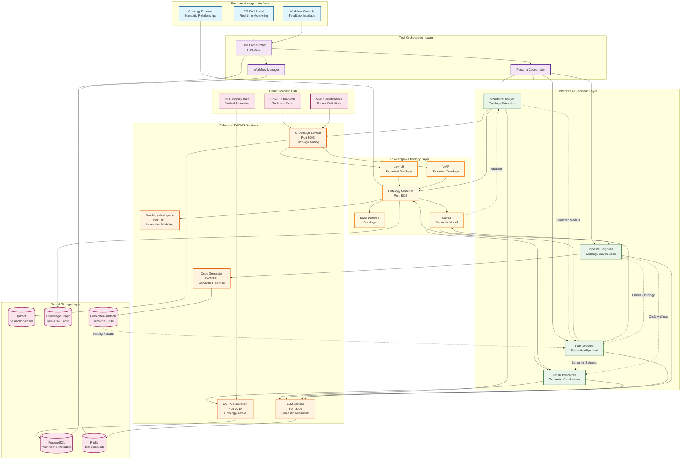
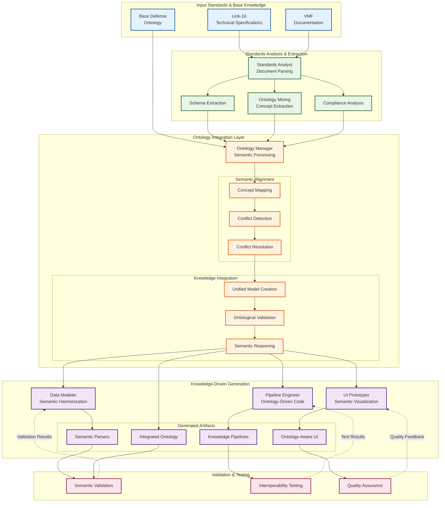
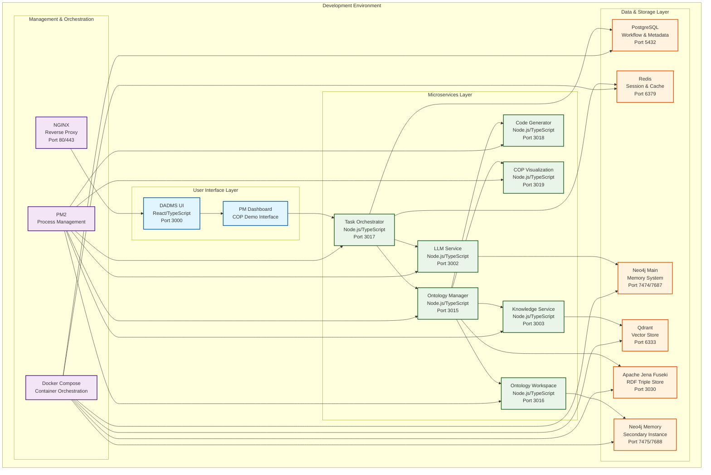
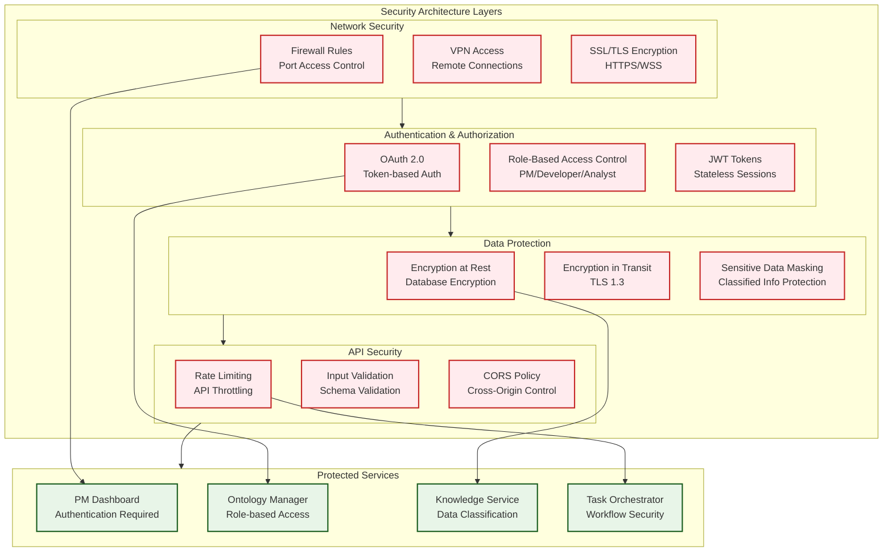

```mermaid
%%{init: { 'flowchart': { 'curve': 'basis' }}}%%
flowchart LR
    subgraph Orchestration["Task Orchestration"]
        TaskOrch["Task Orchestrator<br/>Workflow Coordination"]
        PersonaManager["Persona Manager<br/>Lifecycle Management"]
    end

    subgraph Standards_Analyst["Standards Analyst Persona"]
        SA_Parse["Document Parsing"]
        SA_Extract["Schema Extraction"]
        SA_Ontology["Ontology Mining"]
        SA_Compliance["Compliance Analysis"]
    end

    subgraph Data_Modeler["Data Modeler Persona"]
        DM_Align["Ontology Alignment"]
        DM_Conflict["Conflict Resolution"]
        DM_Unify["Unified Model Creation"]
        DM_Validate["Semantic Validation"]
    end

    subgraph Pipeline_Engineer["Pipeline Engineer Persona"]
        PE_Design["Pipeline Design"]
        PE_Generate["Code Generation"]
        PE_Semantic["Semantic Integration"]
        PE_Test["Interoperability Testing"]
    end

    subgraph UX_Prototyper["UI/UX Prototyper Persona"]
        UX_Design["Interface Design"]
        UX_Visualize["Data Visualization"]
        UX_Ontology["Ontology Display"]
        UX_Prototype["Interactive Prototyping"]
    end

    subgraph Shared_Services["Shared AI Services"]
        LLM_Reasoning["LLM Service<br/>Semantic Reasoning"]
        Knowledge_Base["Knowledge Service<br/>Information Retrieval"]
        Memory_System["Memory System<br/>Context Preservation"]
    end

    %% Orchestration to Personas
    TaskOrch --> PersonaManager
    PersonaManager --> SA_Parse
    PersonaManager --> DM_Align
    PersonaManager --> PE_Design
    PersonaManager --> UX_Design

    %% Standards Analyst Flow
    SA_Parse --> SA_Extract
    SA_Extract --> SA_Ontology
    SA_Ontology --> SA_Compliance

    %% Data Modeler Flow
    DM_Align --> DM_Conflict
    DM_Conflict --> DM_Unify
    DM_Unify --> DM_Validate

    %% Pipeline Engineer Flow
    PE_Design --> PE_Generate
    PE_Generate --> PE_Semantic
    PE_Semantic --> PE_Test

    %% UX Prototyper Flow
    UX_Design --> UX_Visualize
    UX_Visualize --> UX_Ontology
    UX_Ontology --> UX_Prototype

    %% Shared Service Connections
    SA_Ontology --> LLM_Reasoning
    DM_Align --> LLM_Reasoning
    PE_Generate --> LLM_Reasoning
    UX_Design --> LLM_Reasoning

    SA_Extract --> Knowledge_Base
    DM_Unify --> Knowledge_Base
    PE_Semantic --> Knowledge_Base
    UX_Ontology --> Knowledge_Base

    SA_Compliance --> Memory_System
    DM_Validate --> Memory_System
    PE_Test --> Memory_System
    UX_Prototype --> Memory_System

    %% Inter-Persona Communication
    SA_Ontology -.->|"Extracted Ontologies"| DM_Align
    DM_Unify -.->|"Unified Semantic Model"| PE_Design
    DM_Unify -.->|"Semantic Schema"| UX_Design
    PE_Generate -.->|"Generated Artifacts"| UX_Visualize

    %% Feedback Loops
    DM_Validate -.->|"Validation Results"| SA_Compliance
    PE_Test -.->|"Test Results"| DM_Conflict
    UX_Prototype -.->|"UI Feedback"| PE_Semantic

    %% Styling
    classDef orchStyle fill:#f3e5f5,stroke:#4a148c,stroke-width:2px
    classDef saStyle fill:#e3f2fd,stroke:#0d47a1,stroke-width:2px
    classDef dmStyle fill:#e8f5e8,stroke:#1b5e20,stroke-width:2px
    classDef peStyle fill:#fff3e0,stroke:#e65100,stroke-width:2px
    classDef uxStyle fill:#fce4ec,stroke:#880e4f,stroke-width:2px
    classDef sharedStyle fill:#fff8e1,stroke:#f57f17,stroke-width:2px

    class TaskOrch,PersonaManager orchStyle
    class SA_Parse,SA_Extract,SA_Ontology,SA_Compliance saStyle
    class DM_Align,DM_Conflict,DM_Unify,DM_Validate dmStyle
    class PE_Design,PE_Generate,PE_Semantic,PE_Test peStyle
    class UX_Design,UX_Visualize,UX_Ontology,UX_Prototype uxStyle
    class LLM_Reasoning,Knowledge_Base,Memory_System sharedStyle
```

# Blue Force COP Demo - System Architecture

## 🏗️ Architecture Overview

This document provides the complete system architecture for the Blue Force Common Operating Picture (COP) demonstration, showcasing ontology-driven semantic interoperability through AI personas.

## 🎯 High-Level System Architecture

## 🔄 Semantic Integration Data Flow

## 🏢 Infrastructure Architecture

## 🎭 AI Persona Interaction Architecture

## 📊 Port Allocation & Service Registry

| Service | Port | Purpose | Technology | Dependencies |
|---------|------|---------|------------|--------------|
| **DADMS UI** | 3000 | Program Manager Dashboard | React/TypeScript | - |
| **LLM Service** | 3002 | AI Reasoning & Persona Logic | Node.js/Express | OpenAI/Claude APIs |
| **Knowledge Service** | 3003 | Document Storage & Ontology Mining | Node.js/Express | Qdrant, PostgreSQL |
| **Ontology Manager** | 3015 | Semantic Processing & Alignment | Node.js/Express | Apache Jena Fuseki |
| **Ontology Workspace** | 3016 | Interactive Ontology Development | Node.js/Express | Neo4j Memory |
| **Task Orchestrator** | 3017 | Workflow & Persona Coordination | Node.js/Express | PostgreSQL, Redis |
| **Code Generator** | 3018 | Ontology-Driven Code Generation | Node.js/Express | - |
| **COP Visualization** | 3019 | Tactical Display Generation | Node.js/Express | PostgreSQL |
| **PostgreSQL** | 5432 | Primary Database | PostgreSQL 15 | - |
| **Redis** | 6379 | Cache & Session Store | Redis 7 | - |
| **Qdrant** | 6333 | Vector Database | Qdrant | - |
| **Neo4j Main** | 7474/7687 | Graph Database (HTTP/Bolt) | Neo4j | - |
| **Neo4j Memory** | 7475/7688 | Memory System (HTTP/Bolt) | Neo4j | - |
| **Apache Jena Fuseki** | 3030 | RDF Triple Store | Jena Fuseki | - |

## 🔒 Security Architecture

## 📈 Performance & Scalability Architecture

### Response Time Targets
- **Persona Response**: < 30 seconds per task
- **Ontology Extraction**: < 3 minutes per standard document
- **Semantic Alignment**: < 2 minutes for 1,000 concepts
- **Code Generation**: < 1 minute for complete pipeline
- **UI Updates**: < 500ms for dashboard refresh

### Scalability Design
- **Horizontal Scaling**: Stateless services with load balancing
- **Caching Strategy**: Redis for frequently accessed ontologies
- **Database Optimization**: Indexed queries and connection pooling
- **Vector Search**: Qdrant clustering for large-scale similarity search
- **Memory Management**: Ontology caching with LRU eviction

### Resource Allocation
- **CPU**: 4-8 cores per service instance
- **Memory**: 4-8GB per service (16GB for Ontology Manager)
- **Storage**: SSD storage for databases, network storage for artifacts
- **Network**: Gigabit ethernet for inter-service communication

---

**This architecture provides a robust, scalable foundation for demonstrating revolutionary semantic interoperability capabilities through AI-driven ontology integration! 🏗️🚀**
