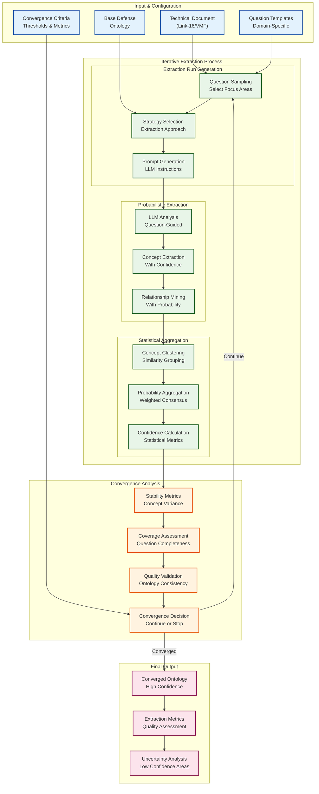

# Probabilistic Ontology Extraction - Advanced Feature Specification

## 🎯 Feature Overview

This advanced feature enhances the Blue Force COP demonstration with **question-guided probabilistic ontology extraction** - a sophisticated approach that uses targeted questions to guide extraction and employs iterative probabilistic sampling to converge on high-quality, comprehensive ontologies.

## 🧠 Conceptual Framework

### Traditional vs. Probabilistic Extraction

#### **Traditional Single-Pass Extraction**
- Parse document once with deterministic rules
- Extract concepts based on fixed patterns
- Single confidence score per extracted element
- Limited by initial extraction quality

#### **Question-Guided Probabilistic Extraction**
- Multiple extraction runs with different question focuses
- Probabilistic sampling of extraction strategies
- Iterative convergence toward consensus ontology
- Quality improvement through statistical aggregation

## 🎯 Question-Guided Extraction Framework

### Defense Domain Question Templates

#### **Structural Questions**
```json
{
  "entity_identification": [
    "What are the primary tactical entities mentioned in this standard?",
    "What platforms, systems, or units are defined?",
    "What are the hierarchical relationships between entities?"
  ],
  "message_structure": [
    "What message types are defined in this standard?",
    "What are the required vs. optional fields for each message?",
    "How are messages categorized or classified?"
  ],
  "data_relationships": [
    "What fields reference other entities or messages?",
    "What are the cardinality constraints (one-to-many, etc.)?",
    "What validation rules govern data relationships?"
  ]
}
```

#### **Semantic Questions**
```json
{
  "concept_semantics": [
    "What does 'track' mean in the context of this standard?",
    "How is 'identification' different from 'classification'?",
    "What semantic constraints apply to position data?"
  ],
  "domain_alignment": [
    "How do concepts in this standard relate to general military doctrine?",
    "What NATO or joint force concepts are referenced?",
    "How does this standard align with common operational picture requirements?"
  ],
  "interoperability": [
    "What concepts are shared with other military standards?",
    "What translation rules apply between this and other formats?",
    "What are the semantic equivalencies across standards?"
  ]
}
```

#### **Constraint Questions**
```json
{
  "validation_rules": [
    "What data validation constraints are specified?",
    "What are the acceptable value ranges for numeric fields?",
    "What format requirements apply to string fields?"
  ],
  "business_rules": [
    "What operational constraints govern the use of this data?",
    "When are certain fields required vs. optional?",
    "What security or classification constraints apply?"
  ],
  "temporal_constraints": [
    "What timing requirements apply to message transmission?",
    "How is temporal sequencing handled?",
    "What are the data freshness requirements?"
  ]
}
```

### Link-16 Specific Question Set

```json
{
  "link16_questions": {
    "ppli_semantics": [
      "What constitutes a 'participant' in Link-16 PPLI messages?",
      "How is 'precise' defined for location accuracy?",
      "What identification methods are used for participants?"
    ],
    "track_management": [
      "What is the lifecycle of a track number?",
      "How are track numbers allocated and managed?",
      "What happens when track numbers are reassigned?"
    ],
    "j_series_structure": [
      "What is the semantic meaning of each J-series message type?",
      "How do J-series messages relate to tactical operations?",
      "What coordination functions do different J-messages serve?"
    ],
    "tadil_j_concepts": [
      "How does TADIL-J relate to broader tactical data link concepts?",
      "What are the network participation group semantics?",
      "How are roles and responsibilities defined in TADIL-J?"
    ]
  }
}
```

### VMF Specific Question Set

```json
{
  "vmf_questions": {
    "message_format": [
      "What makes Variable Message Format 'variable'?",
      "How are optional fields semantically distinguished?",
      "What are the format adaptation rules?"
    ],
    "position_reporting": [
      "What coordinate systems are supported in VMF?",
      "How is position uncertainty represented?",
      "What temporal aspects are included in position reports?"
    ],
    "unit_identification": [
      "How does Unit Track Number differ from other identifiers?",
      "What hierarchical unit relationships are captured?",
      "How are unit types and capabilities represented?"
    ],
    "interoperability": [
      "How does VMF relate to other position reporting standards?",
      "What translation mechanisms exist for VMF data?",
      "How are VMF concepts mapped to NATO standards?"
    ]
  }
}
```

## 🎲 Probabilistic Extraction Algorithm

### Multi-Run Extraction Process



### Extraction Strategy Sampling

#### **Question Focus Sampling**
```typescript
interface QuestionFocus {
  category: 'structural' | 'semantic' | 'constraint';
  weight: number;
  questions: string[];
  extraction_emphasis: string;
}

class QuestionSampler {
  sampleQuestionSet(allQuestions: QuestionSet, iteration: number): QuestionFocus[] {
    // Sample different question combinations each iteration
    // Higher iterations focus on areas with low confidence
    // Ensure coverage across all question categories
  }
}
```

#### **Extraction Strategy Variation**
```typescript
interface ExtractionStrategy {
  approach: 'conservative' | 'aggressive' | 'balanced';
  confidence_threshold: number;
  relationship_depth: number;
  context_window: number;
}

class StrategySelector {
  selectStrategy(iteration: number, previousResults: ExtractionResult[]): ExtractionStrategy {
    // Early iterations: broad, aggressive extraction
    // Later iterations: focused, conservative refinement
    // Adapt based on previous extraction quality
  }
}
```

### Statistical Aggregation Methods

#### **Concept Consensus Building**
```typescript
interface ConceptCandidate {
  name: string;
  description: string;
  extraction_run: number;
  confidence: number;
  question_context: string[];
  supporting_evidence: string[];
}

class ConceptAggregator {
  aggregateConcepts(candidates: ConceptCandidate[]): ConceptConsensus {
    // 1. Cluster similar concepts using semantic similarity
    // 2. Weight by confidence and extraction quality
    // 3. Resolve naming conflicts through voting
    // 4. Merge descriptions with highest information content
  }
}
```

#### **Relationship Probability Calculation**
```typescript
interface RelationshipCandidate {
  source_concept: string;
  target_concept: string;
  relationship_type: string;
  confidence: number;
  extraction_context: string;
}

class RelationshipAggregator {
  calculateRelationshipProbability(candidates: RelationshipCandidate[]): number {
    // Weighted average of extraction confidences
    // Penalty for contradictory relationship types
    // Bonus for consistent extraction across multiple runs
  }
}
```

## 📊 Convergence Criteria & Metrics

### Stability Metrics

#### **Concept Stability**
```typescript
interface StabilityMetrics {
  concept_variance: number;        // How much concepts change between iterations
  relationship_stability: number; // Consistency of relationship extraction
  confidence_trend: number;       // Improvement in average confidence
  coverage_completeness: number;  // Percentage of questions addressed
}

class ConvergenceAnalyzer {
  calculateStability(iterations: ExtractionIteration[]): StabilityMetrics {
    const recentIterations = iterations.slice(-3); // Last 3 iterations
    
    return {
      concept_variance: this.calculateConceptVariance(recentIterations),
      relationship_stability: this.calculateRelationshipStability(recentIterations),
      confidence_trend: this.calculateConfidenceTrend(recentIterations),
      coverage_completeness: this.calculateCoverageCompleteness(recentIterations)
    };
  }
}
```

#### **Convergence Thresholds**
```typescript
interface ConvergenceCriteria {
  max_iterations: number;           // Maximum extraction runs (e.g., 15)
  min_iterations: number;           // Minimum runs before convergence check (e.g., 5)
  concept_stability_threshold: number;     // Concept variance < 0.1
  relationship_stability_threshold: number; // Relationship consistency > 0.85
  confidence_improvement_threshold: number; // Confidence trend < 0.05
  coverage_completeness_threshold: number;  // Question coverage > 0.9
}
```

### Quality Assessment Metrics

#### **Extraction Quality Score**
```typescript
interface QualityMetrics {
  conceptual_completeness: number;  // Concepts per question category
  semantic_coherence: number;      // Logical consistency score
  evidence_support: number;        // Text evidence strength
  ontological_validity: number;    // OWL/RDF validity
}

class QualityAssessor {
  assessExtractionQuality(ontology: ExtractedOntology): QualityMetrics {
    return {
      conceptual_completeness: this.assessConceptualCompleteness(ontology),
      semantic_coherence: this.assessSemanticCoherence(ontology),
      evidence_support: this.assessEvidenceSupport(ontology),
      ontological_validity: this.validateOntologyStructure(ontology)
    };
  }
}
```

## 🎭 Enhanced Persona Capabilities

### Enhanced Standards Analyst Persona

#### **Advanced System Prompt**
```
You are an advanced Standards Analyst with probabilistic reasoning capabilities. 
Your role extends beyond document parsing to iterative, question-guided ontology extraction.

CURRENT EXTRACTION RUN: {iteration_number}/{max_iterations}
FOCUS QUESTIONS: {selected_questions}
EXTRACTION STRATEGY: {strategy_description}
PREVIOUS FINDINGS: {previous_iteration_summary}

Your enhanced capabilities include:
- Question-guided concept identification using provided focus questions
- Probabilistic assessment of concept and relationship confidence
- Iterative refinement based on previous extraction results
- Statistical reasoning about extraction uncertainty and completeness

For this iteration, focus particularly on: {focus_areas}
Pay special attention to areas with low confidence from previous runs: {low_confidence_areas}
```

#### **Enhanced Task Workflow**
```typescript
class ProbabilisticStandardsAnalyst {
  async performIterativeExtraction(
    document: Document,
    iteration: number,
    focusQuestions: string[],
    previousResults: ExtractionResult[]
  ): Promise<ExtractionResult> {
    
    // 1. Analyze focus questions and extraction strategy
    const analysisPrompt = this.buildQuestionGuidedPrompt(focusQuestions, iteration);
    
    // 2. Extract concepts with probabilistic assessment
    const concepts = await this.extractConceptsWithConfidence(document, analysisPrompt);
    
    // 3. Mine relationships with uncertainty quantification
    const relationships = await this.extractRelationshipsWithProbability(concepts, document);
    
    // 4. Assess extraction completeness against questions
    const completeness = this.assessQuestionCoverage(focusQuestions, concepts);
    
    return {
      iteration,
      concepts,
      relationships,
      completeness,
      confidence_metrics: this.calculateConfidenceMetrics(concepts, relationships)
    };
  }
}
```

### Enhanced Data Modeler Persona

#### **Probabilistic Alignment Capabilities**
```typescript
class ProbabilisticDataModeler {
  async performProbabilisticAlignment(
    extractionResults: ExtractionResult[],
    baseOntology: Ontology
  ): Promise<ProbabilisticAlignment> {
    
    // 1. Aggregate concepts across extraction runs
    const consensusConcepts = await this.buildConceptConsensus(extractionResults);
    
    // 2. Calculate alignment probabilities
    const alignmentProbabilities = await this.calculateAlignmentProbabilities(
      consensusConcepts, 
      baseOntology
    );
    
    // 3. Resolve conflicts using statistical methods
    const resolvedConflicts = await this.resolveConflictsStatistically(
      alignmentProbabilities
    );
    
    // 4. Generate uncertainty analysis
    const uncertaintyAnalysis = this.analyzeAlignmentUncertainty(resolvedConflicts);
    
    return {
      unified_ontology: resolvedConflicts,
      alignment_confidence: alignmentProbabilities,
      uncertainty_analysis: uncertaintyAnalysis
    };
  }
}
```

## 🔧 Implementation Architecture

### New Service Components

#### **Probabilistic Extraction Engine**
```typescript
// Add to Ontology Manager Service (Port 3015)
class ProbabilisticExtractionEngine {
  async performProbabilisticExtraction(
    document: Document,
    questionSet: QuestionSet,
    convergenceCriteria: ConvergenceCriteria
  ): Promise<ConvergedOntology> {
    
    const iterations: ExtractionResult[] = [];
    let converged = false;
    let currentIteration = 0;
    
    while (!converged && currentIteration < convergenceCriteria.max_iterations) {
      // Sample questions and strategy for this iteration
      const focusQuestions = this.sampleQuestions(questionSet, currentIteration, iterations);
      const strategy = this.selectStrategy(currentIteration, iterations);
      
      // Perform extraction run
      const result = await this.performExtractionRun(
        document, 
        focusQuestions, 
        strategy, 
        iterations
      );
      
      iterations.push(result);
      currentIteration++;
      
      // Check convergence after minimum iterations
      if (currentIteration >= convergenceCriteria.min_iterations) {
        converged = this.checkConvergence(iterations, convergenceCriteria);
      }
    }
    
    // Aggregate results into final ontology
    return this.aggregateIterations(iterations);
  }
}
```

#### **Question Management System**
```typescript
class QuestionManager {
  private questionTemplates: Map<string, QuestionTemplate>;
  
  generateDomainQuestions(standard: 'LINK_16' | 'VMF', document: Document): QuestionSet {
    const baseQuestions = this.questionTemplates.get(`${standard}_BASE`);
    const adaptedQuestions = this.adaptQuestionsToDocument(baseQuestions, document);
    return this.prioritizeQuestions(adaptedQuestions);
  }
  
  sampleQuestionsForIteration(
    allQuestions: QuestionSet, 
    iteration: number, 
    previousResults: ExtractionResult[]
  ): QuestionFocus[] {
    // Focus on areas with low confidence from previous iterations
    const lowConfidenceAreas = this.identifyLowConfidenceAreas(previousResults);
    return this.sampleWithBias(allQuestions, lowConfidenceAreas, iteration);
  }
}
```

#### **Convergence Monitor**
```typescript
class ConvergenceMonitor {
  checkConvergence(
    iterations: ExtractionResult[], 
    criteria: ConvergenceCriteria
  ): boolean {
    const stability = this.calculateStabilityMetrics(iterations);
    const quality = this.assessAggregateQuality(iterations);
    
    return (
      stability.concept_variance < criteria.concept_stability_threshold &&
      stability.relationship_stability > criteria.relationship_stability_threshold &&
      stability.confidence_trend < criteria.confidence_improvement_threshold &&
      stability.coverage_completeness > criteria.coverage_completeness_threshold
    );
  }
}
```

## 📈 Enhanced Demonstration Flow

### Updated Phase 2: Advanced Standards Analysis (15 minutes)

#### **Traditional Extraction** (3 minutes)
- Initial document parsing and schema extraction
- Baseline concept identification

#### **Question-Guided Setup** (2 minutes)
- Generate domain-specific question sets for Link-16 and VMF
- Configure probabilistic extraction parameters
- Display question categories and focus areas

#### **Probabilistic Extraction Iterations** (8 minutes)
- **Iterations 1-3**: Broad exploration with different question focuses
- **Iterations 4-6**: Refinement based on emerging patterns
- **Iterations 7+**: Convergence toward stable ontology
- Real-time display of:
  - Current iteration progress
  - Emerging concept consensus
  - Confidence trend analysis
  - Question coverage metrics

#### **Convergence Analysis** (2 minutes)
- Statistical stability assessment
- Quality metrics evaluation
- Uncertainty analysis and low-confidence area identification
- Final converged ontology presentation

### Enhanced PM Dashboard Features

#### **Probabilistic Extraction Monitor**
```typescript
interface ExtractionDashboard {
  current_iteration: number;
  convergence_progress: number;
  concept_stability_trend: number[];
  question_coverage_heatmap: QuestionCoverage[];
  confidence_distribution: ConfidenceMetrics;
  uncertainty_areas: UncertaintyAnalysis[];
}
```

Real-time visualizations show:
- **Iteration Progress**: Convergence metrics over time
- **Concept Evolution**: How concepts stabilize across iterations
- **Question Coverage**: Which questions drive the best extraction
- **Confidence Heatmap**: High and low confidence areas
- **Uncertainty Analysis**: Areas needing human review

## 🎯 Enhanced Value Proposition

### **For Defense Contractors**
- **Robust Extraction**: Probabilistic methods reduce extraction errors
- **Question-Driven Quality**: Targeted questions ensure completeness
- **Statistical Confidence**: Quantified uncertainty for decision-making
- **Iterative Improvement**: Self-refining extraction process

### **For Program Managers**
- **Quality Assurance**: Statistical validation of extracted knowledge
- **Progress Monitoring**: Real-time view of extraction convergence
- **Risk Assessment**: Uncertainty analysis identifies review areas
- **Adaptive Process**: System improves extraction quality automatically

### **For Technical Teams**
- **Reproducible Results**: Statistical methods ensure consistency
- **Confidence Quantification**: Know which extractions to trust
- **Targeted Review**: Focus human effort on uncertain areas
- **Methodology Transparency**: Clear statistical basis for decisions

## 📊 Success Metrics Enhancement

### **Extraction Quality Metrics**
- **Convergence Speed**: Average iterations to reach stability (target: < 8)
- **Final Confidence**: Average confidence of converged concepts (target: > 0.85)
- **Question Coverage**: Percentage of questions adequately addressed (target: > 90%)
- **Uncertainty Reduction**: Decrease in uncertainty over iterations (target: > 70%)

### **Demonstration Impact**
- **Technical Sophistication**: Showcases advanced AI reasoning capabilities
- **Quality Assurance**: Demonstrates robust, enterprise-ready processes
- **Iterative Intelligence**: Shows self-improving AI systems
- **Statistical Rigor**: Provides quantified confidence in results

---

**This probabilistic enhancement transforms our demonstration from impressive to revolutionary, showcasing AI that doesn't just extract knowledge, but does so with statistical rigor and iterative improvement! 🎲🧠🚀**
