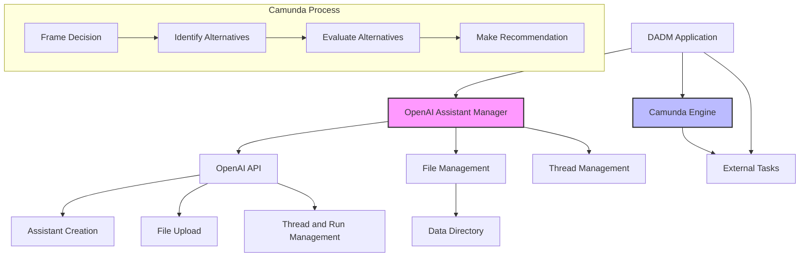

# DADM OpenAI Assistant Integration

This guide explains how to run the DADM Demonstrator with the integrated OpenAI Assistant for decision analysis.

## Current Architecture



## Prerequisites

1. Ensure you have Python 3.8+ installed on your system
2. Install required dependencies: `pip install -r requirements.txt`
3. Ensure Docker and Docker Compose are installed if using the containerized Camunda engine
4. Set up your OpenAI API key as an environment variable

## Setting Up the OpenAI API Key

Before running the application, you need to set your OpenAI API key as an environment variable.

### On Windows PowerShell
```powershell
$env:OPENAI_API_KEY="your-api-key-here"
```

### On Windows Command Prompt
```cmd
set OPENAI_API_KEY=your-api-key-here
```

### On Linux/macOS
```bash
export OPENAI_API_KEY="your-api-key-here"
```

## Starting the Camunda Engine

Start the Camunda Engine using Docker Compose:

```bash
cd /path/to/dadm
docker-compose -f docker/docker-compose.yml up -d camunda
```

This will start the Camunda BPM platform on port 8080.

## Deploying the Process Definition

1. Open Camunda Modeler
2. Open the `camunda_models/openai_decision_process.bpmn` file
3. Click the "Deploy" button in Camunda Modeler
4. Select the deployment target (e.g., http://localhost:8080/engine-rest)
5. Click "Deploy"

## Running the DADM Demonstrator

Run the DADM Demonstrator with the following command:

```bash
cd /path/to/dadm
python src/app.py --start-process "OpenAI Decision Process"
```

This will:
1. Initialize the OpenAI Assistant
2. Upload reference files from the data directory to the assistant
3. Start a new instance of the "OpenAI Decision Process"
4. Process each task in the workflow using the OpenAI Assistant

## Command-Line Options

- `--start-process`, `-s`: Name of the process to start on Camunda server
- `--variables`, `-v`: JSON string of variables to pass to the process
- `--monitor-only`, `-m`: Only monitor for tasks without starting a process
- `--timeout`, `-t`: Maximum time to wait for task completion in seconds (default: 600)
- `--list`, `-l`: List available process definitions on the Camunda server

## Example Commands

Start the OpenAI Decision Process:
```bash
python src/app.py --start-process "OpenAI Decision Process"
```

Start with custom initial variables:
```bash
python src/app.py -s "OpenAI Decision Process" -v '{"initial_context":"Custom decision context here"}'
```

Monitor for tasks only (don't start a process):
```bash
python src/app.py -m
```

## Workflow Structure

The OpenAI Decision Process workflow consists of the following tasks:

1. **Frame Decision**: Analyze the decision context to identify key elements
2. **Identify Alternatives**: Identify potential UAS platforms that meet requirements
3. **Evaluate Alternatives**: Evaluate each alternative against established criteria
4. **Make Recommendation**: Provide a final recommendation with justification

Each task is processed by the OpenAI Assistant using the guidelines and task-specific instructions.

## Data Directory

The `data` directory contains reference files that are uploaded to the OpenAI Assistant:

- `uas_specifications.md`: Specifications for various UAS platforms
- `disaster_response_requirements.md`: Requirements for disaster response scenarios
- `decision_matrix_template.md`: Template for decision matrix evaluation

These files provide domain knowledge to the assistant for better decision analysis.

## Metadata File Locations

Configuration and metadata files that were previously stored in the `data` folder
are now kept under `config/metadata`.

- `assistant_id.json` – persists the OpenAI assistant ID
- `rag_file_metadata.json` – tracks uploaded files and vector store mappings

Existing projects can be migrated with:

```bash
python scripts/move_metadata_files.py
```

Both `RAGFileManager` and `AssistantIDManager` check the new directory first and
fall back to the old paths for backward compatibility.

## Viewing Results

To view the results of the process:
1. Open the Camunda Cockpit at http://localhost:8080/camunda/app/cockpit/
2. Log in with the default credentials (demo/demo)
3. Navigate to the process instances
4. Select the running or completed instance of "OpenAI Decision Process"
5. View the variables and task history
