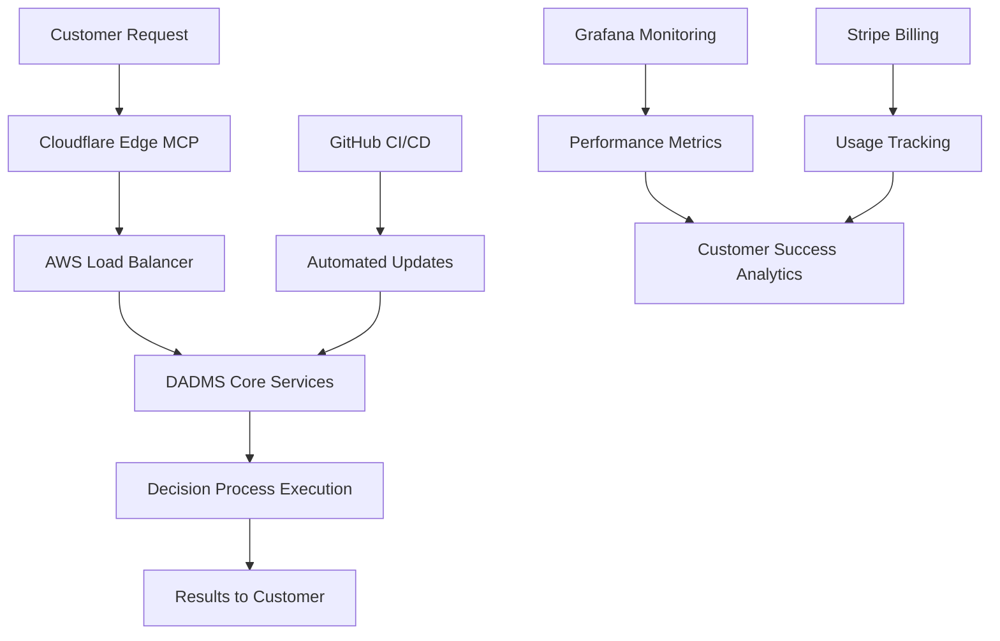

# AWS Deployment & Customer Service MCP Servers for DADMS

## Executive Summary

This research identifies **critical MCP servers** specifically designed for **AWS deployment, infrastructure management, and customer service operations** that would significantly enhance DADMS's ability to deploy, maintain, and serve customers effectively.

## 🏗️ AWS Infrastructure & Deployment MCP Servers

### **AWS Official MCP Servers** (🔥 Highest Priority)
**Why Critical**: AWS provides official MCP servers specifically designed for their services, ensuring enterprise-grade reliability and support.

#### **AWS Database MCP Servers**
- **Aurora PostgreSQL MCP Server**
  - **Tools**: `get_schema`, `readonly_query`, `transact`
  - **DADMS Integration**: Direct database management for DADMS operational data
  - **Use Case**: Monitor DADMS database health, execute maintenance queries, generate reports

- **Aurora MySQL MCP Server**
  - **Tools**: Database schema inspection, query execution
  - **DADMS Integration**: Alternative database backend management
  - **Use Case**: Database migration, performance monitoring, maintenance automation

- **DynamoDB MCP Server**
  - **Tools**: Table management, query execution, item operations
  - **DADMS Integration**: NoSQL data management for session storage, user preferences
  - **Use Case**: Customer session management, real-time data storage

- **ElastiCache (Valkey/Memcached) MCP Server**
  - **Tools**: Cache management, memory monitoring, key operations
  - **DADMS Integration**: Performance optimization through intelligent caching
  - **Use Case**: Cache decision results, user sessions, frequently accessed data

#### **AWS Deployment Guidance**
**Official AWS Solution**: [Guidance for Deploying Model Context Protocol Servers on AWS](https://aws.amazon.com/solutions/guidance/deploying-model-context-protocol-servers-on-aws/)

**Key Features**:
- **Containerized Architecture** using Amazon ECS
- **OAuth 2.0 Authentication** with Amazon Cognito
- **Multi-layered Security** with AWS WAF and CloudFront
- **Auto-scaling** based on demand
- **CloudWatch Integration** for monitoring and logging

**DADMS Implementation**:
```yaml
# Example DADMS MCP Deployment Architecture
aws-infrastructure:
  compute:
    - Amazon ECS for MCP server containers
    - Auto Scaling Groups for demand-based scaling
  security:
    - Amazon Cognito for OAuth 2.0 authentication
    - AWS WAF for DDoS protection and rate limiting
    - CloudFront for global content delivery
  monitoring:
    - CloudWatch for centralized logging
    - CloudWatch Alarms for proactive monitoring
  networking:
    - Private subnets for MCP servers
    - Application Load Balancer for traffic distribution
```

### **Container Orchestration MCP Servers**

#### **Docker Compose MCP Server** (ckreiling)
- **Purpose**: Manage Docker containers and compose stacks through natural language
- **Tools**: Container lifecycle management, log monitoring, command execution
- **DADMS Integration**: Simplified deployment and scaling of DADMS microservices
- **Use Case**: Deploy DADMS services, manage updates, monitor container health
- **Downloads**: 57.4k (highly popular)

#### **Docker Manager MCP Server**
- **Purpose**: Natural language-driven Docker container management
- **Tools**: Container operations, log monitoring, command execution
- **DADMS Integration**: DevOps automation for DADMS deployment pipeline
- **Use Case**: Automate deployment processes, troubleshoot issues, scale services

### **Cloudflare Infrastructure MCP Servers**

#### **Cloudflare Workers MCP Deployment**
- **Purpose**: Deploy and manage MCP servers on Cloudflare's edge network
- **Features**:
  - **Global Distribution** - Deploy DADMS MCP servers worldwide
  - **Serverless Scaling** - Automatic scaling based on usage
  - **Edge Computing** - Reduced latency for global customers
  - **Cost Efficiency** - Pay-per-request model

**DADMS Use Cases**:
- Deploy customer-facing MCP servers globally
- Reduce latency for international DADMS users
- Cost-effective scaling for variable workloads

## 📊 Monitoring & Observability MCP Servers

### **Grafana MCP Server** (🔥 High Priority)
- **Purpose**: Advanced monitoring dashboards and alerting
- **Tools**: Dashboard creation, metric visualization, alert management
- **DADMS Integration**: Comprehensive system monitoring and customer analytics
- **Use Cases**:
  - Monitor DADMS service health and performance
  - Track customer usage patterns and SLA compliance
  - Generate executive dashboards and reports
  - Proactive incident detection and response

### **MCP Server Monitoring & Observability**
Based on research from production MCP deployments, essential monitoring includes:

#### **Protocol Message Metrics**
- **Message Volume by Type**: Track discovery, execution, and error requests
- **Protocol Version Distribution**: Monitor client compatibility
- **Message Size Histograms**: Detect performance bottlenecks

#### **Tool Execution Analytics**
- **Invocation Counts**: Track tool usage and popularity
- **Execution Time Breakdown**: Monitor performance across tool categories
- **Error Classification**: Categorize and track failure patterns
- **Result Size Monitoring**: Prevent resource exhaustion

#### **Customer Usage Patterns**
- **Resource Access Frequency**: Understand customer workflow patterns
- **Session Analytics**: Track user engagement and system utilization
- **Anomaly Detection**: Identify unusual usage or potential security issues

### **Example Grafana Dashboard for DADMS**
```json
{
  "dashboard": {
    "title": "DADMS Production Monitoring",
    "panels": [
      {
        "title": "Customer Active Sessions",
        "type": "timeseries",
        "target": "sum(dadms_active_customer_sessions)"
      },
      {
        "title": "Decision Process Execution Rate",
        "type": "timeseries", 
        "target": "rate(dadms_decision_processes_total[5m])"
      },
      {
        "title": "Service Health Overview",
        "type": "stat",
        "target": "up{service=~'dadms-.*'}"
      },
      {
        "title": "Customer SLA Compliance",
        "type": "gauge",
        "target": "dadms_sla_compliance_percentage"
      }
    ]
  }
}
```

## 🤖 CI/CD & DevOps MCP Servers

### **GitHub MCP Server** (Official)
- **Purpose**: Repository management, CI/CD automation, issue tracking
- **Tools**: Pull request management, deployment automation, code review
- **DADMS Integration**: Automate DADMS deployment pipeline
- **Use Cases**:
  - Automated testing and deployment of DADMS updates
  - Customer issue tracking and resolution
  - Code quality monitoring and compliance

### **Semgrep MCP Server** (Official)
- **Purpose**: Static code analysis and security scanning
- **Tools**: Vulnerability detection, code quality assessment
- **DADMS Integration**: Automated security compliance for DADMS codebase
- **Use Case**: Ensure customer data security through automated code analysis

## 🎯 Customer Management & Service MCP Servers

### **Stripe MCP Server** (Official)
- **Purpose**: Payment processing and customer billing management
- **Tools**: Payment processing, subscription management, customer analytics
- **DADMS Integration**: Handle customer subscriptions and billing for DADMS services
- **Use Cases**:
  - Automate customer billing for DADMS usage
  - Track subscription metrics and revenue analytics
  - Handle payment failures and customer notifications

### **Slack MCP Server**
- **Purpose**: Team communication and customer support automation
- **Tools**: Channel management, automated notifications, incident response
- **DADMS Integration**: Customer support and internal team coordination
- **Use Cases**:
  - Automated customer incident notifications
  - Internal team coordination during deployments
  - Customer onboarding and support workflows

### **Notion MCP Server** (Official)
- **Purpose**: Documentation and knowledge management
- **Tools**: Page management, database operations, content search
- **DADMS Integration**: Customer documentation and internal knowledge base
- **Use Cases**:
  - Maintain customer-facing documentation
  - Internal process documentation and knowledge sharing
  - Customer onboarding materials and tutorials

## 🔧 Infrastructure Automation MCP Servers

### **Kubernetes MCP Server**
- **Purpose**: Container orchestration and cluster management
- **Tools**: Pod management, service deployment, cluster monitoring
- **DADMS Integration**: Large-scale DADMS deployment on Kubernetes
- **Use Cases**:
  - Auto-scale DADMS services based on customer demand
  - Blue-green deployments for zero-downtime updates
  - Resource optimization and cost management

### **Terraform/Infrastructure as Code MCP Servers**
- **Purpose**: Infrastructure provisioning and management
- **Tools**: Resource provisioning, state management, change planning
- **DADMS Integration**: Automated infrastructure management for DADMS
- **Use Cases**:
  - Provision customer-specific DADMS environments
  - Manage infrastructure costs and optimization
  - Disaster recovery and backup automation

## 📈 Customer Analytics & Business Intelligence

### **Data Visualization MCP Servers**
- **Purpose**: Customer usage analytics and business intelligence
- **Tools**: Chart generation, report creation, trend analysis
- **DADMS Integration**: Customer success metrics and business analytics
- **Use Cases**:
  - Track customer adoption and feature usage
  - Generate executive reports on DADMS performance
  - Identify opportunities for customer success and expansion

### **Customer Health Scoring**
- **Purpose**: Monitor customer satisfaction and usage patterns
- **Tools**: Usage analytics, satisfaction scoring, churn prediction
- **DADMS Integration**: Proactive customer success management
- **Use Cases**:
  - Identify at-risk customers before churn
  - Optimize customer onboarding and success workflows
  - Generate customer health reports for account management

## 🏛️ DADMS-Specific Implementation Strategy

### **Phase 1: Core Infrastructure (Month 1)**
1. **AWS Database MCP Servers** - Aurora, DynamoDB, ElastiCache
2. **Docker Compose MCP Server** - Container management
3. **GitHub MCP Server** - CI/CD automation
4. **Grafana MCP Server** - Basic monitoring

### **Phase 2: Advanced Operations (Month 2)**
1. **AWS Deployment Guidance** - Production-ready infrastructure
2. **Cloudflare Workers** - Global edge deployment
3. **Kubernetes MCP Server** - Large-scale orchestration
4. **Monitoring & Observability** - Advanced analytics

### **Phase 3: Customer Success (Month 3)**
1. **Stripe MCP Server** - Customer billing automation
2. **Slack MCP Server** - Customer support automation
3. **Notion MCP Server** - Documentation management
4. **Customer Analytics** - Business intelligence

### **Phase 4: Optimization & Scale (Month 4)**
1. **Infrastructure as Code** - Automated provisioning
2. **Advanced Monitoring** - Predictive analytics
3. **Security & Compliance** - Automated security scanning
4. **Customer Health** - Proactive success management

## 💡 Unique DADMS Value Proposition

### **Decision Intelligence Operations**
By combining these MCP servers, DADMS can offer:

1. **Automated Decision Infrastructure** - Deploy and scale decision processes automatically
2. **Customer Success Intelligence** - Monitor and optimize customer decision outcomes
3. **Predictive Maintenance** - Prevent issues before they impact customers
4. **Global Decision Network** - Deploy decision intelligence at edge locations worldwide

### **Example DADMS Customer Workflow**


## 🚀 Implementation Recommendations

### **Immediate Actions**
1. **Start with AWS Official MCP Servers** - Proven, enterprise-ready solutions
2. **Implement Docker Compose MCP** - Simplify DADMS deployment processes
3. **Set up Grafana Monitoring** - Essential for production operations
4. **Integrate GitHub MCP** - Automate development and deployment

### **Success Metrics**
- **Deployment Time Reduction**: From hours to minutes
- **Customer Onboarding Speed**: 90% faster setup
- **System Reliability**: 99.9% uptime SLA
- **Customer Satisfaction**: Proactive issue resolution
- **Cost Optimization**: 40% reduction in operational overhead

## 🔮 Future Opportunities

### **DADMS-Owned MCP Infrastructure Servers**
Following our ownership strategy, develop custom MCP servers for:
- **DADMS Customer Provisioning** - Automated customer environment setup
- **Decision Process Optimization** - AI-driven performance tuning
- **Cross-Cloud Orchestration** - Multi-cloud deployment management
- **Customer Success Automation** - Predictive customer success interventions

This positions DADMS not just as a decision intelligence platform, but as a **fully automated, self-managing, customer-optimized service** that leverages the best of AWS infrastructure and MCP ecosystem capabilities.