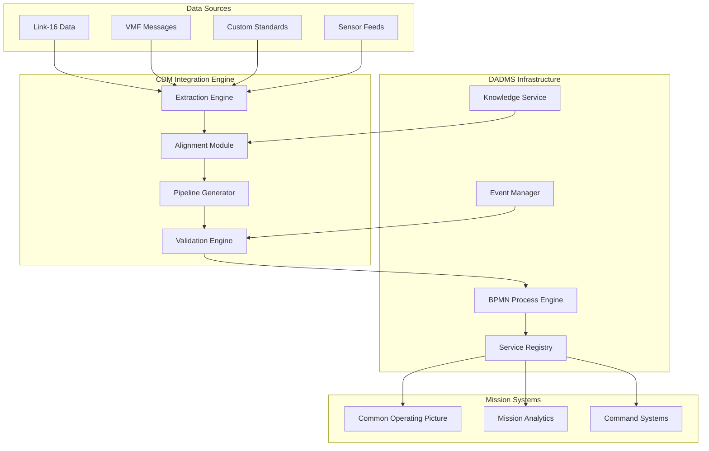
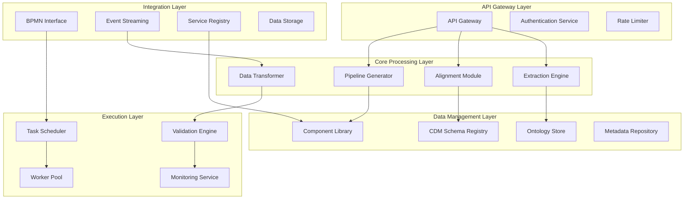

# CDM Integration Engine - Software Specification Document

**Document Type:** Software Architecture Specification  
**System:** DADMS Infrastructure Component  
**Component:** CDM Integration Engine  
**Version:** 1.0  
**Date:** August 04, 2025  
**Authors:** [User's Name], Systems Engineering Team  
**Status:** Draft for Development

---

## 1. Overview

### 1.1 Tool Purpose and Mission

The **CDM Integration Engine** is a core DADMS infrastructure component designed to automate the semantic integration of heterogeneous data standards (Link-16, VMF, STANAG protocols, custom formats) into mission-critical platforms such as Common Operating Picture (COP) systems. The engine implements the **model-driven integration philosophy** established in the DADMS Process Model Data Integration framework, treating the Common Data Model (CDM) as a foundational semantic backbone rather than merely an output artifact.

**Primary Mission**: Enable rapid, scalable, and sustainable integration of new data standards into operational systems by automatically extracting semantic structures, aligning them to established ontologies, and generating reusable integration pipelines.

### 1.2 Role within DADMS Architecture

The CDM Integration Engine serves as a **semantic translation hub** within the DADMS ecosystem:



### 1.3 Dependencies

**Core Dependencies:**
- **Baseline SE Ontology** (10-entity framework from foundational papers)
- **Common Data Model (CDM)** schema definitions and mapping rules
- **DADMS BPMN Process Engine** for workflow orchestration
- **DADMS Service Registry** for component discovery and lifecycle management
- **DADMS Knowledge Service** for ontology storage and SPARQL querying

**Data Dependencies:**
- RDF/OWL ontology files (baseline and domain-specific)
- CDM schema definitions (JSON Schema, SQL DDL, or OWL)
- Standards specification documents (PDF, XML, DOCX, HTML)
- Reference data sets for validation and testing

**Infrastructure Dependencies:**
- Neo4j graph database (ontology and relationship storage)
- Qdrant vector database (semantic similarity and clustering)
- Apache Kafka (event streaming and pipeline coordination)
- PostgreSQL (CDM data storage and ACID transactions)

---

## 2. Core Functional Requirements

### 2.1 Specification Document Ingestion

**REQ-ING-001: Multi-Format Document Processing**
```
Function: Ingest and parse specification documents in multiple formats
Inputs: PDF, XML, DOCX, HTML, Markdown, plain text files
Processing: Extract structured and unstructured content with metadata preservation
Outputs: Normalized document structure with section hierarchy and content extraction
Performance: Process 1000+ page documents within 5 minutes
Quality: 95%+ content extraction accuracy for standard military specifications
```

**REQ-ING-002: Standards Metadata Extraction**
```
Function: Extract specification metadata and document structure
Inputs: Document files with optional metadata sidecars
Processing: Identify standard type, version, sections, tables, figures, appendices
Outputs: Document metadata graph with cross-references and dependencies
Performance: Complete metadata extraction within 30 seconds per document
Quality: 90%+ accuracy for standard classification and version identification
```

### 2.2 Probabilistic Ontology Extraction

**REQ-ONT-001: Entity and Relationship Discovery**
```
Function: Extract semantic entities and relationships from specification text
Inputs: Parsed document content and existing ontology context
Processing: NLP-based entity recognition, relationship extraction, confidence scoring
Outputs: Candidate ontology graph with confidence metrics and source traceability
Performance: Process 100 pages per minute with real-time confidence updates
Quality: 85%+ precision for entity extraction, 80%+ for relationship discovery
```

**REQ-ONT-002: Uncertainty Quantification**
```
Function: Assign confidence scores to extracted semantic elements
Inputs: Extracted entities, relationships, and context information
Processing: Probabilistic assessment using multiple evidence sources and validation
Outputs: Confidence-scored ontology with uncertainty bounds and quality metrics
Performance: Real-time confidence calculation during extraction
Quality: Confidence scores correlate 90%+ with human expert validation
```

### 2.3 Baseline Ontology Alignment

**REQ-ALN-001: Semantic Alignment and Convergence**
```
Function: Align extracted ontologies to established baseline SE ontology
Inputs: Candidate ontology, baseline ontology, alignment rules and constraints
Processing: Semantic matching, concept mapping, conflict resolution, convergence analysis
Outputs: Aligned ontology with mapping provenance and confidence metrics
Performance: Complete alignment for 50+ entity ontologies within 2 minutes
Quality: 95%+ semantic consistency with baseline ontology framework
```

**REQ-ALN-002: CDM Schema Mapping**
```
Function: Map aligned ontology to Common Data Model schema definitions
Inputs: Aligned ontology, CDM schema, transformation rules, validation constraints
Processing: Schema mapping, type conversion, constraint preservation, normalization rules
Outputs: CDM-compliant schema mappings with bidirectional transformation definitions
Performance: Generate complete schema mappings within 30 seconds
Quality: 100% CDM compliance with zero data loss during transformation
```

### 2.4 Pipeline Model Generation

**REQ-PIP-001: Component Discovery and Assembly**
```
Function: Identify required integration components and assemble into executable pipelines
Inputs: Aligned ontology, CDM mappings, component library, performance requirements
Processing: Component matching, dependency analysis, pipeline optimization, BPMN generation
Outputs: Executable BPMN process definition with service task specifications
Performance: Generate complete pipeline models within 1 minute
Quality: Generated pipelines pass 100% of validation tests without manual intervention
```

**REQ-PIP-002: Reusable Component Management**
```
Function: Maintain library of reusable integration components with usage analytics
Inputs: Component implementations, usage metrics, performance data, quality scores
Processing: Component registration, version management, compatibility analysis, optimization
Outputs: Searchable component registry with confidence scores and reuse recommendations
Performance: Component lookup and recommendation within 5 seconds
Quality: 80%+ component reuse rate across similar integration scenarios
```

### 2.5 Data Stream Processing

**REQ-DAT-001: Real-Time Data Transformation**
```
Function: Transform incoming data streams using generated pipeline models
Inputs: Raw data streams, pipeline definitions, CDM schema, validation rules
Processing: Parse, normalize, transform, validate, and route data according to pipeline specification
Outputs: CDM-compliant data records with full provenance and quality metrics
Performance: 10,000+ messages per second with <100ms end-to-end latency
Quality: 99.9% data transformation success rate with graceful error handling
```

**REQ-DAT-002: Semantic Validation and Quality Assurance**
```
Function: Validate transformed data for semantic consistency and quality
Inputs: Transformed data, CDM constraints, ontology rules, reference datasets
Processing: Structure validation, semantic consistency checking, quality scoring, anomaly detection
Outputs: Validation reports with quality scores, error details, and improvement recommendations
Performance: Real-time validation with minimal impact on data throughput
Quality: Detect 95%+ of data quality issues with <1% false positive rate
```

### 2.6 Integration and Export

**REQ-EXP-001: Multi-Format Data Export**
```
Function: Export integrated data in formats required by consuming systems
Inputs: CDM-compliant data, target system requirements, format specifications
Processing: Format conversion, structure adaptation, metadata preservation, compression
Outputs: System-specific data files (JSON, CSV, XML, Parquet) with metadata
Performance: Export 1M+ records within 5 minutes for standard formats
Quality: 100% data fidelity preservation across format conversions
```

**REQ-EXP-002: Pipeline and Ontology Export**
```
Function: Export generated assets for reuse and version control
Inputs: Pipeline definitions, aligned ontologies, mappings, validation results
Processing: Serialization, documentation generation, dependency packaging, version tagging
Outputs: Reusable asset packages with documentation and deployment instructions
Performance: Complete asset packaging within 2 minutes
Quality: Exported assets successfully deploy in 95%+ of target environments
```

---

## 3. Interfaces

### 3.1 Input Interfaces

**Document Ingestion Interface**
```yaml
interface: DocumentIngestionAPI
protocol: HTTP REST + File Upload
formats:
  specifications:
    - PDF (up to 100MB)
    - XML/HTML (with schema validation)
    - DOCX (with embedded object extraction)
    - Markdown (with YAML frontmatter)
  schemas:
    - JSON Schema (draft-07 compliant)
    - XML Schema Definition (XSD)
    - OWL/RDF (Turtle, RDF/XML, JSON-LD)
  metadata:
    - YAML configuration files
    - JSON metadata descriptors
    - CSV reference mappings

endpoints:
  - POST /api/v1/documents/upload
  - POST /api/v1/schemas/register
  - POST /api/v1/ontologies/import
  - GET /api/v1/documents/{id}/status
```

**Data Stream Interface**
```yaml
interface: DataStreamAPI
protocols: 
  - Apache Kafka (primary)
  - HTTP REST (synchronous)
  - WebSocket (real-time)
  - File Watch (batch processing)
formats:
  - JSON (structured messages)
  - XML (with namespace support)
  - Binary (with schema registry)
  - CSV (with header detection)
  - Avro/Parquet (columnar data)

configuration:
  topics: 
    - "integration.input.{standard_name}"
    - "integration.control.commands"
  partitioning: "by_source_system"
  retention: "30_days"
  compression: "snappy"
```

### 3.2 Output Interfaces

**Integrated Data Interface**
```yaml
interface: IntegratedDataAPI
protocols:
  - DADMS Service Bus (primary)
  - HTTP REST (external systems)
  - GraphQL (flexible queries)
  - SPARQL (semantic queries)
formats:
  output_data:
    - CDM JSON (standardized structure)
    - CDM Parquet (analytics workloads)
    - RDF Turtle (semantic web)
    - CSV (legacy system compatibility)
  metadata:
    - Provenance graphs (RDF)
    - Quality reports (JSON)
    - Pipeline definitions (BPMN XML)
    - Ontology alignments (OWL)

endpoints:
  - GET /api/v1/data/{standard}/latest
  - POST /api/v1/queries/sparql
  - GET /api/v1/pipelines/{id}/definition
  - GET /api/v1/ontologies/{id}/alignment
```

**DADMS Integration Interface**
```yaml
interface: DADMSIntegrationAPI
integration_points:
  bpmn_engine:
    - Pipeline deployment endpoint
    - Process instance management
    - Task completion callbacks
  service_registry:
    - Component registration
    - Health check endpoints
    - Load balancing updates
  knowledge_service:
    - Ontology storage and retrieval
    - SPARQL query delegation
    - Semantic reasoning requests
  event_manager:
    - Integration event publishing
    - Pipeline status updates
    - Error and alert notifications

data_contracts:
  - ProcessDefinition (BPMN 2.0)
  - ServiceSpecification (OpenAPI 3.0)
  - OntologyAlignment (OWL 2.0)
  - DataSchema (JSON Schema)
```

### 3.3 Control and Monitoring Interfaces

**Management Interface**
```yaml
interface: ManagementAPI
capabilities:
  pipeline_management:
    - Create, update, delete pipeline definitions
    - Start, stop, pause pipeline execution
    - Scale pipeline components dynamically
  component_management:
    - Register new integration components
    - Update component configurations
    - Monitor component health and performance
  ontology_management:
    - Import/export ontology definitions
    - Manage alignment rules and mappings
    - Validate ontology consistency

endpoints:
  - POST /api/v1/management/pipelines
  - PUT /api/v1/management/components/{id}/config
  - GET /api/v1/management/health
  - POST /api/v1/management/ontologies/validate
```

**Observability Interface**
```yaml
interface: ObservabilityAPI
metrics:
  performance:
    - integration_throughput_msgs_per_second
    - extraction_accuracy_percentage
    - alignment_confidence_score
    - pipeline_execution_latency_ms
  quality:
    - data_validation_success_rate
    - semantic_consistency_score
    - component_reuse_percentage
    - error_recovery_success_rate

traces:
  - Integration request end-to-end tracing
  - Ontology extraction and alignment paths
  - Data transformation and validation flows
  - Component interaction and dependency chains

alerts:
  - Integration failure (success rate < 95%)
  - Performance degradation (latency > 500ms)
  - Quality threshold breach (confidence < 80%)
  - Resource utilization (CPU/memory > 80%)
```

---

## 4. Architecture & Components

### 4.1 System Architecture Overview

The CDM Integration Engine follows a **microservices architecture** with clear separation of concerns and event-driven communication:



### 4.2 Core Components

#### 4.2.1 Extraction Engine

**Purpose**: Probabilistic extraction of semantic structures from specification documents

**Architecture**: Multi-stage pipeline with confidence scoring
```python
class ExtractionEngine:
    """
    Probabilistic ontology extraction from specification documents
    """
    
    def __init__(self, config: ExtractionConfig):
        self.document_parser = DocumentParser(config.parsing)
        self.entity_extractor = EntityExtractor(config.nlp)
        self.relationship_discoverer = RelationshipDiscoverer(config.relations)
        self.confidence_scorer = ConfidenceScorer(config.scoring)
        
    async def extract_ontology(self, document: Document) -> ExtractionResult:
        """
        Extract semantic ontology from specification document
        """
        # Stage 1: Document parsing and structure analysis
        parsed_doc = await self.document_parser.parse(document)
        
        # Stage 2: Entity extraction with NLP
        entities = await self.entity_extractor.extract(parsed_doc)
        
        # Stage 3: Relationship discovery
        relationships = await self.relationship_discoverer.discover(
            entities, parsed_doc
        )
        
        # Stage 4: Confidence scoring and uncertainty quantification
        scored_ontology = await self.confidence_scorer.score(
            entities, relationships, parsed_doc
        )
        
        return ExtractionResult(
            ontology=scored_ontology,
            confidence=scored_ontology.overall_confidence,
            provenance=self._build_provenance(document, scored_ontology),
            metadata=self._extract_metadata(parsed_doc)
        )
```

**Key Capabilities**:
- Multi-format document parsing (PDF, XML, DOCX, HTML)
- NLP-based entity and relationship extraction
- Probabilistic confidence scoring with uncertainty bounds
- Source traceability and provenance tracking
- Incremental processing for large documents

#### 4.2.2 Alignment Module

**Purpose**: Semantic alignment of extracted ontologies to baseline SE ontology and CDM

**Architecture**: Graph-based alignment with constraint satisfaction
```python
class AlignmentModule:
    """
    Semantic alignment and CDM mapping engine
    """
    
    def __init__(self, config: AlignmentConfig):
        self.baseline_ontology = BaselineOntologyLoader(config.baseline)
        self.cdm_schema = CDMSchemaRegistry(config.cdm)
        self.alignment_engine = SemanticAlignmentEngine(config.alignment)
        self.mapping_generator = CDMMappingGenerator(config.mapping)
        
    async def align_ontology(self, 
                           extracted_ontology: Ontology,
                           target_cdm: str) -> AlignmentResult:
        """
        Align extracted ontology to baseline and generate CDM mappings
        """
        # Stage 1: Baseline ontology alignment
        alignment = await self.alignment_engine.align(
            source=extracted_ontology,
            target=self.baseline_ontology.get_current(),
            constraints=self.baseline_ontology.get_constraints()
        )
        
        # Stage 2: Semantic validation and consistency checking
        validation = await self.alignment_engine.validate(alignment)
        
        # Stage 3: CDM schema mapping generation
        cdm_mappings = await self.mapping_generator.generate_mappings(
            aligned_ontology=alignment.result,
            target_schema=self.cdm_schema.get_schema(target_cdm)
        )
        
        # Stage 4: Conflict resolution and optimization
        optimized_mappings = await self.mapping_generator.optimize(
            cdm_mappings, validation.conflicts
        )
        
        return AlignmentResult(
            aligned_ontology=alignment.result,
            cdm_mappings=optimized_mappings,
            confidence=alignment.confidence,
            validation_report=validation,
            transformation_rules=optimized_mappings.transformations
        )
```

**Key Capabilities**:
- Graph-based semantic similarity matching
- Constraint satisfaction for ontology consistency
- Automated conflict detection and resolution
- Bidirectional transformation rule generation
- CDM schema compliance validation

#### 4.2.3 Pipeline Generator

**Purpose**: Automatic generation of executable BPMN integration pipelines

**Architecture**: Template-based assembly with component optimization
```python
class PipelineGenerator:
    """
    Automated integration pipeline generation
    """
    
    def __init__(self, config: PipelineConfig):
        self.component_registry = ComponentRegistry(config.components)
        self.template_library = TemplateLibrary(config.templates)
        self.bpmn_generator = BPMNGenerator(config.bpmn)
        self.optimizer = PipelineOptimizer(config.optimization)
        
    async def generate_pipeline(self,
                              alignment_result: AlignmentResult,
                              requirements: PipelineRequirements) -> PipelineResult:
        """
        Generate executable integration pipeline from alignment result
        """
        # Stage 1: Component discovery and selection
        required_components = await self.component_registry.discover_components(
            alignment_result.aligned_ontology,
            alignment_result.cdm_mappings,
            requirements
        )
        
        # Stage 2: Template matching and customization
        pipeline_template = await self.template_library.select_template(
            required_components, requirements.patterns
        )
        
        # Stage 3: BPMN process model generation
        bpmn_process = await self.bpmn_generator.generate(
            template=pipeline_template,
            components=required_components,
            mappings=alignment_result.cdm_mappings
        )
        
        # Stage 4: Performance optimization
        optimized_process = await self.optimizer.optimize(
            bpmn_process, requirements.performance
        )
        
        return PipelineResult(
            bpmn_definition=optimized_process,
            component_specifications=required_components,
            deployment_config=self._generate_deployment_config(optimized_process),
            validation_tests=self._generate_validation_tests(optimized_process)
        )
```

**Key Capabilities**:
- Intelligent component discovery and reuse
- Template-based pipeline assembly
- BPMN 2.0 compliant process generation
- Performance optimization and resource planning
- Automated test case generation

#### 4.2.4 Validation Engine

**Purpose**: Comprehensive validation of generated pipelines and transformed data

**Architecture**: Multi-level validation with automated testing
```python
class ValidationEngine:
    """
    Comprehensive validation and quality assurance
    """
    
    def __init__(self, config: ValidationConfig):
        self.schema_validator = SchemaValidator(config.schema)
        self.semantic_validator = SemanticValidator(config.semantic)
        self.performance_tester = PerformanceTester(config.performance)
        self.quality_assessor = QualityAssessor(config.quality)
        
    async def validate_integration(self,
                                 pipeline: PipelineDefinition,
                                 test_data: TestDataSet) -> ValidationResult:
        """
        Comprehensive validation of integration pipeline
        """
        validation_results = []
        
        # Schema validation
        schema_result = await self.schema_validator.validate(
            pipeline.input_schema,
            pipeline.output_schema,
            test_data.samples
        )
        validation_results.append(schema_result)
        
        # Semantic consistency validation
        semantic_result = await self.semantic_validator.validate(
            pipeline.ontology_mappings,
            pipeline.transformation_rules,
            test_data.semantic_cases
        )
        validation_results.append(semantic_result)
        
        # Performance testing
        performance_result = await self.performance_tester.test(
            pipeline, test_data.load_scenarios
        )
        validation_results.append(performance_result)
        
        # Data quality assessment
        quality_result = await self.quality_assessor.assess(
            pipeline.output_data, test_data.quality_benchmarks
        )
        validation_results.append(quality_result)
        
        return ValidationResult(
            overall_success=all(r.success for r in validation_results),
            detailed_results=validation_results,
            recommendations=self._generate_recommendations(validation_results),
            certification_level=self._assess_certification(validation_results)
        )
```

**Key Capabilities**:
- Multi-dimensional validation (schema, semantic, performance, quality)
- Automated test case generation and execution
- Regression testing and continuous validation
- Quality scoring and certification levels
- Actionable recommendations for improvement

### 4.3 Data Management Components

#### 4.3.1 Ontology Store
- **Technology**: Neo4j with RDF extensions
- **Schema**: Property graph with semantic annotations
- **Capabilities**: SPARQL queries, reasoning, version control
- **Performance**: <100ms query response, 1M+ triple storage

#### 4.3.2 CDM Schema Registry
- **Technology**: Confluent Schema Registry with JSON Schema support
- **Schema**: Versioned schema definitions with compatibility checking
- **Capabilities**: Schema evolution, compatibility validation, transformation rules
- **Performance**: <50ms schema lookup, 10K+ schema versions

#### 4.3.3 Component Library
- **Technology**: Docker Registry with metadata indexing
- **Schema**: Containerized components with semantic annotations
- **Capabilities**: Version management, dependency tracking, usage analytics
- **Performance**: <30s component deployment, 95% cache hit rate

---

## 5. Non-Functional Requirements

### 5.1 Performance Requirements

**Throughput Requirements**:
```yaml
data_processing:
  input_throughput: "10,000 messages/second sustained"
  extraction_rate: "100 pages/minute document processing"
  alignment_speed: "50 entity ontologies/2 minutes"
  pipeline_generation: "Complete BPMN in <60 seconds"

latency_requirements:
  extraction_latency: "p95 < 5 seconds for 100-page documents"
  alignment_latency: "p95 < 30 seconds for complex ontologies"  
  transformation_latency: "p95 < 100ms end-to-end data flow"
  query_response: "p95 < 200ms for standard API calls"

scalability:
  concurrent_extractions: "50+ simultaneous document processing"
  pipeline_instances: "100+ active pipelines per engine instance"
  horizontal_scaling: "Linear scaling to 10+ engine instances"
  data_volume: "Handle 1TB+ daily data throughput"
```

### 5.2 Reliability and Availability

**Availability Requirements**:
```yaml
uptime:
  target_availability: "99.9% (8.7 hours downtime/year)"
  planned_maintenance: "Monthly 2-hour windows"
  unplanned_downtime: "<15 minutes per incident"

fault_tolerance:
  component_failure: "Graceful degradation with backup services"
  data_corruption: "Automatic detection and recovery within 5 minutes"
  network_partitions: "Continue operation with local caching"
  cascading_failures: "Circuit breaker patterns prevent system-wide failure"

disaster_recovery:
  backup_frequency: "Real-time replication with 15-minute snapshots"
  recovery_time: "RTO: 1 hour, RPO: 15 minutes"
  geographic_distribution: "Multi-region deployment capability"
```

### 5.3 Security and Compliance

**Security Requirements**:
```yaml
authentication:
  mechanisms: ["OAuth 2.0", "SAML 2.0", "mTLS"]
  token_expiration: "1 hour with refresh capability"
  multi_factor: "Required for administrative operations"

authorization:
  model: "RBAC with fine-grained permissions"
  scopes: ["read", "write", "admin", "pipeline_execute"]
  audit_logging: "All access attempts logged with retention"

data_protection:
  encryption_at_rest: "AES-256 for all stored data"
  encryption_in_transit: "TLS 1.3 for all network communication"
  key_management: "HSM-backed key rotation every 90 days"
  data_classification: "Support for FOUO, Confidential, Secret markings"

compliance:
  standards: ["FedRAMP Moderate", "NIST 800-171", "ISO 27001"]
  audit_trails: "Immutable logs with 7-year retention"
  privacy: "GDPR-compliant data handling and deletion"
```

### 5.4 Maintainability and Extensibility

**Modularity Requirements**:
```yaml
component_isolation:
  microservices: "Clear service boundaries with API contracts"
  dependency_management: "Explicit versioning and compatibility matrices"
  database_isolation: "Service-specific data stores with controlled sharing"

configuration_management:
  external_config: "All configuration externalized from code"
  environment_promotion: "Consistent config across dev/test/prod"
  feature_flags: "Runtime feature toggling without deployment"

monitoring_and_observability:
  metrics: "Prometheus-compatible metrics with custom dashboards"
  logging: "Structured JSON logs with correlation IDs"
  tracing: "Distributed tracing with OpenTelemetry"
  health_checks: "Automated health monitoring with alert escalation"
```

**Extensibility Requirements**:
```yaml
plugin_architecture:
  extraction_plugins: "Custom parsers for new document formats"
  alignment_plugins: "Domain-specific alignment algorithms"
  component_plugins: "Custom integration components with standard interfaces"
  validation_plugins: "Domain-specific validation rules and quality metrics"

api_evolution:
  versioning: "Semantic versioning with backward compatibility"
  deprecation: "6-month deprecation notice for breaking changes"
  documentation: "OpenAPI specifications with interactive documentation"
  sdk_support: "Python and JavaScript SDKs with auto-generation"
```

---

## 6. Dependencies and Technology Stack

### 6.1 Core Technology Stack

**Programming Languages and Frameworks**:
```yaml
primary_language: "Python 3.11+"
frameworks:
  - FastAPI (API development and documentation)
  - Pydantic (data validation and serialization)
  - AsyncIO (asynchronous processing)
  - Celery (distributed task processing)
  - SQLAlchemy (database ORM)

secondary_languages:
  - TypeScript (UI components and client SDKs)
  - Java (BPMN engine integration)
  - Rust (high-performance data processing components)
```

**Data Storage Technologies**:
```yaml
graph_database:
  technology: "Neo4j 5.x Enterprise"
  purpose: "Ontology storage, relationship modeling, SPARQL queries"
  scaling: "Cluster deployment with read replicas"

vector_database:
  technology: "Qdrant 1.x"
  purpose: "Semantic similarity, embedding storage, clustering"
  scaling: "Distributed collections with sharding"

relational_database:
  technology: "PostgreSQL 15+"
  purpose: "CDM data storage, transactional consistency, ACID guarantees"
  scaling: "Primary-replica setup with connection pooling"

document_store:
  technology: "MongoDB 6.x"
  purpose: "Document storage, metadata indexing, full-text search"
  scaling: "Replica sets with geographical distribution"

cache_layer:
  technology: "Redis 7.x"
  purpose: "Session storage, component registry cache, rate limiting"
  scaling: "Redis Cluster with automatic failover"
```

**Message Processing and Integration**:
```yaml
message_broker:
  technology: "Apache Kafka 3.x"
  purpose: "Event streaming, pipeline coordination, data flow management"
  configuration: "Multi-partition topics with configurable retention"

workflow_engine:
  technology: "Camunda 8.x (BPMN engine)"
  purpose: "Pipeline orchestration, process modeling, task management"
  integration: "REST API and Java client integration"

service_discovery:
  technology: "Consul 1.x"
  purpose: "Service registration, health checking, configuration management"
  deployment: "Multi-datacenter setup with automatic failover"

api_gateway:
  technology: "Kong 3.x"
  purpose: "API management, authentication, rate limiting, analytics"
  plugins: "OAuth, rate limiting, logging, metrics collection"
```

### 6.2 Semantic Technology Dependencies

**Ontology Processing**:
```yaml
rdf_library:
  technology: "RDFLib 6.x (Python)"
  purpose: "RDF/OWL parsing, SPARQL queries, ontology manipulation"
  formats: ["Turtle", "RDF/XML", "JSON-LD", "N-Triples"]

reasoning_engine:
  technology: "Apache Jena with Pellet reasoner"
  purpose: "Ontology consistency checking, inference, classification"
  deployment: "Containerized with REST API wrapper"

schema_validation:
  technology: "JSON Schema Draft 2020-12"
  purpose: "CDM schema definition and validation"
  libraries: ["jsonschema (Python)", "ajv (JavaScript)"]

sparql_endpoint:
  technology: "Apache Jena Fuseki 4.x"
  purpose: "SPARQL query processing, federated queries, caching"
  configuration: "High-availability setup with load balancing"
```

**Natural Language Processing**:
```yaml
nlp_framework:
  technology: "spaCy 3.x with custom models"
  purpose: "Entity extraction, relationship detection, text classification"
  models: ["en_core_web_lg", "custom military terminology models"]

embedding_models:
  technology: "Sentence-BERT and domain-specific embeddings"
  purpose: "Semantic similarity, clustering, alignment scoring"
  hosting: "Local deployment with GPU acceleration"

text_processing:
  libraries:
    - "NLTK (text preprocessing)"
    - "PyMuPDF (PDF extraction)"
    - "python-docx (DOCX processing)"
    - "Beautiful Soup (HTML/XML parsing)"
```

### 6.3 Infrastructure Dependencies

**Container Orchestration**:
```yaml
container_runtime: "Docker 24.x with BuildKit"
orchestration: "Kubernetes 1.28+ with Helm 3.x"
service_mesh: "Istio 1.x for traffic management and security"
ingress: "NGINX Ingress Controller with cert-manager"

storage:
  persistent_volumes: "Network-attached storage with backup"
  object_storage: "S3-compatible storage for documents and artifacts"
  secrets_management: "Kubernetes secrets with external-secrets operator"
```

**Monitoring and Observability**:
```yaml
metrics:
  collection: "Prometheus with custom metric exporters"
  visualization: "Grafana with pre-built dashboards"
  alerting: "AlertManager with PagerDuty integration"

logging:
  aggregation: "Fluentd with Elasticsearch backend"
  visualization: "Kibana with custom dashboards"
  retention: "90-day retention with automatic archival"

tracing:
  technology: "Jaeger with OpenTelemetry instrumentation"
  sampling: "Adaptive sampling with 100% error capture"
  storage: "Elasticsearch backend with data lifecycle management"
```

### 6.4 External Service Dependencies

**DADMS Integration**:
```yaml
required_services:
  - "DADMS BPMN Process Engine (Camunda integration)"
  - "DADMS Service Registry (Consul-based)"
  - "DADMS Knowledge Service (Neo4j + SPARQL)"
  - "DADMS Event Manager (Kafka-based)"

api_contracts:
  - "ProcessDefinition API (BPMN deployment)"
  - "ServiceRegistration API (component registration)"
  - "KnowledgeQuery API (SPARQL endpoint)"
  - "EventPublishing API (Kafka producer)"
```

**Optional AI Enhancement Services**:
```yaml
llm_integration:
  providers: ["OpenAI GPT-4", "Anthropic Claude", "Local LLaMA models"]
  purpose: "Document analysis enhancement, natural language queries"
  deployment: "Plugin architecture with provider abstraction"

computer_vision:
  technology: "OpenCV with custom models"
  purpose: "Diagram extraction, table recognition, figure analysis"
  deployment: "Optional microservice with REST API"
```

---

## 7. Implementation Phases

### 7.1 Phase 1: Core Foundation (Months 1-3)

**Deliverables**:
- Document ingestion and parsing infrastructure
- Basic ontology extraction with confidence scoring
- Simple alignment to baseline SE ontology
- CDM schema registry and basic mapping capabilities
- DADMS integration framework and API contracts

**Success Criteria**:
- Process 90%+ of standard military specification documents
- Extract entities with 80%+ accuracy and confidence scoring
- Generate basic CDM mappings with manual validation
- Successfully deploy and register with DADMS infrastructure

### 7.2 Phase 2: Advanced Processing (Months 4-6)

**Deliverables**:
- Advanced NLP and semantic processing capabilities
- Automated pipeline generation with BPMN output
- Component library and reusable template system
- Real-time data transformation and validation
- Comprehensive monitoring and observability

**Success Criteria**:
- Generate executable BPMN pipelines with 95% success rate
- Achieve 85%+ semantic alignment accuracy
- Process 1,000+ messages per second with <100ms latency
- Demonstrate component reuse across 3+ different standards

### 7.3 Phase 3: Production Hardening (Months 7-9)

**Deliverables**:
- Security hardening and compliance features
- Performance optimization and scaling capabilities
- Advanced validation and quality assurance
- Production monitoring and alerting systems
- Documentation and training materials

**Success Criteria**:
- Meet all security and compliance requirements
- Achieve 99.9% availability with automated failover
- Pass comprehensive load testing (10K+ msgs/sec sustained)
- Complete security audit and penetration testing

### 7.4 Phase 4: Enhancement and Extension (Months 10-12)

**Deliverables**:
- AI persona integration framework
- Advanced analytics and reporting capabilities
- Multi-tenant support and isolation
- Enhanced UI for pipeline visualization and management
- SDK development and ecosystem integration

**Success Criteria**:
- Support persona-based automation plugins
- Provide comprehensive analytics and reporting
- Enable multi-organization deployment scenarios
- Achieve 95% developer satisfaction with SDK and documentation

---

## 8. Risk Assessment and Mitigation

### 8.1 Technical Risks

**Risk**: Semantic extraction accuracy below requirements (80%+ target)
```yaml
probability: "Medium"
impact: "High"
mitigation:
  - Extensive training data collection and model tuning
  - Human-in-the-loop validation for critical extractions
  - Confidence thresholds with manual review triggers
  - Continuous model improvement based on feedback
```

**Risk**: BPMN pipeline generation complexity exceeds automation capabilities
```yaml
probability: "Medium"
impact: "Medium"
mitigation:
  - Template-based approach with proven patterns
  - Gradual complexity increase with manual fallback
  - Component library with tested, reusable elements
  - Expert review process for complex scenarios
```

**Risk**: Performance requirements not met under load
```yaml
probability: "Low"
impact: "High"
mitigation:
  - Early performance testing and optimization
  - Horizontal scaling architecture from design phase
  - Caching strategies at multiple layers
  - Load testing throughout development lifecycle
```

### 8.2 Integration Risks

**Risk**: DADMS integration compatibility issues
```yaml
probability: "Medium"
impact: "High"
mitigation:
  - Early integration testing with DADMS team
  - Clear API contracts and versioning strategy
  - Regression testing for DADMS updates
  - Fallback to standalone operation mode
```

**Risk**: Ontology alignment complexity with diverse standards
```yaml
probability: "High"
impact: "Medium"
mitigation:
  - Incremental approach starting with well-known standards
  - Expert validation for complex alignment scenarios
  - Confidence scoring with manual review thresholds
  - Continuous improvement based on domain expert feedback
```

### 8.3 Operational Risks

**Risk**: Insufficient domain expertise for validation
```yaml
probability: "Medium"
impact: "Medium"
mitigation:
  - Early engagement with subject matter experts
  - Structured validation process with clear criteria
  - Training programs for operational staff
  - Documentation and knowledge transfer processes
```

**Risk**: Scalability limitations in production environment
```yaml
probability: "Low"
impact: "High"
mitigation:
  - Cloud-native architecture with auto-scaling
  - Comprehensive capacity planning and monitoring
  - Performance testing under realistic load conditions
  - Incident response procedures and rollback capabilities
```

---

## 9. Success Metrics and Acceptance Criteria

### 9.1 Functional Success Metrics

**Document Processing Accuracy**:
```yaml
entity_extraction:
  target: "85% precision, 80% recall for standard entities"
  measurement: "Manual validation against expert annotations"
  frequency: "Weekly during development, monthly in production"

relationship_discovery:
  target: "80% precision, 75% recall for semantic relationships"
  measurement: "Expert review of relationship graphs"
  frequency: "Bi-weekly validation cycles"

ontology_alignment:
  target: "90% semantic consistency with baseline ontology"
  measurement: "Automated consistency checking + expert validation"
  frequency: "Continuous automated testing"
```

**Pipeline Generation Quality**:
```yaml
bpmn_validity:
  target: "100% generated BPMN processes are syntactically valid"
  measurement: "Automated BPMN validation tools"
  frequency: "Every pipeline generation"

component_reuse:
  target: "70% component reuse rate across similar standards"
  measurement: "Component usage analytics and tracking"
  frequency: "Monthly reporting"

pipeline_success:
  target: "95% generated pipelines pass validation tests"
  measurement: "Automated test suite execution"
  frequency: "Continuous integration"
```

### 9.2 Performance Success Metrics

**Throughput Requirements**:
```yaml
document_processing:
  target: "100 pages per minute sustained processing"
  measurement: "Load testing with realistic document sets"
  frequency: "Weekly performance testing"

data_transformation:
  target: "10,000 messages per second sustained throughput"
  measurement: "Kafka load testing with monitoring"
  frequency: "Daily performance monitoring"

api_response:
  target: "95th percentile response time < 200ms"
  measurement: "Production API monitoring"
  frequency: "Real-time monitoring with alerts"
```

**Scalability Metrics**:
```yaml
horizontal_scaling:
  target: "Linear scaling to 10+ instances with <10% overhead"
  measurement: "Load testing across multiple deployment scenarios"
  frequency: "Quarterly scaling validation"

resource_utilization:
  target: "Average CPU/memory utilization 60-80% under normal load"
  measurement: "Infrastructure monitoring and capacity planning"
  frequency: "Continuous monitoring with monthly analysis"
```

### 9.3 Quality and Reliability Metrics

**Availability and Reliability**:
```yaml
system_uptime:
  target: "99.9% availability (8.7 hours downtime per year)"
  measurement: "Uptime monitoring and incident tracking"
  frequency: "Real-time monitoring with monthly reporting"

data_consistency:
  target: "100% data consistency across transformations"
  measurement: "Automated data validation and audit trails"
  frequency: "Continuous validation with exception reporting"

error_recovery:
  target: "95% automatic recovery from transient failures"
  measurement: "Error rate monitoring and recovery tracking"
  frequency: "Daily error analysis and weekly reporting"
```

**User Satisfaction**:
```yaml
integration_success:
  target: "90% of integrations complete without manual intervention"
  measurement: "Integration workflow tracking and user feedback"
  frequency: "Monthly user surveys and usage analytics"

time_to_integration:
  target: "New standard integration completed within 72 hours"
  measurement: "Integration timeline tracking from request to deployment"
  frequency: "Per-integration measurement with quarterly analysis"
```

---

## 10. Conclusion

The CDM Integration Engine represents a **foundational advancement** in sustainable data integration architecture, implementing the model-driven principles established in the DADMS Process Model framework. By treating the Common Data Model as a semantic backbone rather than merely an output, this system enables **scalable, reusable, and maintainable** integration of heterogeneous data standards into mission-critical systems.

**Key Strategic Value**:

1. **Sustainable Architecture**: Eliminates technical debt through model-driven rather than code-driven integration approaches
2. **Mission Agility**: Enables 72-hour integration cycles instead of 9-11 week development projects  
3. **Institutional Knowledge**: Captures integration expertise in reusable, auditable components and processes
4. **Semantic Consistency**: Ensures reliable data interpretation across diverse standards and systems

**Implementation Success Factors**:

- **Incremental Delivery**: Phased approach with early value demonstration and risk mitigation
- **Domain Expertise Integration**: Close collaboration with subject matter experts throughout development
- **Quality Assurance**: Comprehensive validation framework ensuring production readiness
- **DADMS Integration**: Seamless operation within existing DADMS infrastructure and workflows

**Expected Outcomes**:

Upon successful implementation, the CDM Integration Engine will serve as a **force multiplier** for mission-critical data integration scenarios, reducing integration costs by 90%+ while improving reliability, maintainability, and adaptability. The system will enable Program Managers to respond to evolving mission requirements with confidence, knowing that new data standards can be rapidly and reliably integrated into operational systems.

This specification provides the foundation for building a **sustainable, scalable, and strategically valuable** data integration capability that aligns with DADMS principles while addressing real-world operational requirements.

---

## Appendices

### Appendix A: API Reference Schemas

```yaml
# Core API request/response schemas
DocumentUploadRequest:
  type: object
  properties:
    file: { type: string, format: binary }
    metadata: { $ref: '#/components/schemas/DocumentMetadata' }
    processing_options: { $ref: '#/components/schemas/ProcessingOptions' }

ExtractionResult:
  type: object
  properties:
    ontology: { $ref: '#/components/schemas/ExtractedOntology' }
    confidence: { type: number, minimum: 0, maximum: 1 }
    provenance: { $ref: '#/components/schemas/ProvenanceGraph' }
    metadata: { $ref: '#/components/schemas/ExtractionMetadata' }

AlignmentResult:
  type: object
  properties:
    aligned_ontology: { $ref: '#/components/schemas/AlignedOntology' }
    cdm_mappings: { $ref: '#/components/schemas/CDMMappings' }
    confidence: { type: number, minimum: 0, maximum: 1 }
    validation_report: { $ref: '#/components/schemas/ValidationReport' }
```

### Appendix B: Configuration Examples

```yaml
# Example configuration for different deployment scenarios
development_config:
  extraction:
    confidence_threshold: 0.7
    batch_size: 10
    timeout: 300
  alignment:
    similarity_threshold: 0.8
    max_iterations: 100
  performance:
    max_concurrent_extractions: 5
    cache_ttl: 3600

production_config:
  extraction:
    confidence_threshold: 0.85
    batch_size: 50
    timeout: 600
  alignment:
    similarity_threshold: 0.9
    max_iterations: 200
  performance:
    max_concurrent_extractions: 50
    cache_ttl: 86400
```

### Appendix C: Component Interface Specifications

```python
# Standard interfaces for extensible components
class ExtractionPlugin(ABC):
    @abstractmethod
    async def extract_entities(self, document: Document) -> List[Entity]:
        pass
        
    @abstractmethod
    async def extract_relationships(self, entities: List[Entity], 
                                  document: Document) -> List[Relationship]:
        pass
        
    @abstractmethod
    def get_confidence_score(self, extraction: ExtractionResult) -> float:
        pass

class AlignmentPlugin(ABC):
    @abstractmethod
    async def align_ontologies(self, source: Ontology, 
                             target: Ontology) -> AlignmentResult:
        pass
        
    @abstractmethod
    async def generate_mappings(self, alignment: AlignmentResult) -> CDMMappings:
        pass
```

---

*This software specification document provides comprehensive guidance for implementing the CDM Integration Engine as a core component of the DADMS infrastructure, enabling sustainable and scalable data integration across diverse mission environments.*