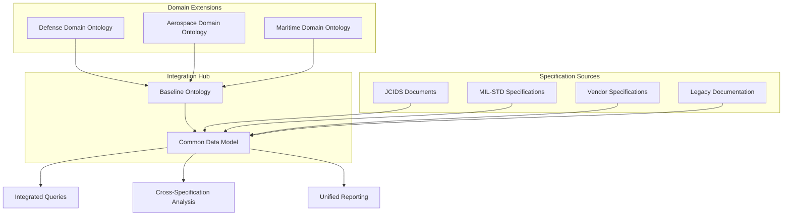

# A Common Data Model (CDM) for Semantic Integration Across Specifications

**Authors:** [User's Name], with AI-assisted drafting based on 30+ years of multidisciplinary engineering experience  
**Date:** August 04, 2025  
**Document Type:** Technical White Paper  
**Pages:** 3  
**Status:** Draft for Review

---

## Abstract

Modern systems engineering faces a critical challenge in integrating heterogeneous specifications across diverse domains, each with distinct vocabularies, data structures, and semantic assumptions. This paper presents a Common Data Model (CDM) approach that leverages a minimalist baseline ontology as a semantic anchor for probabilistic extraction, alignment, and integration of specification semantics. The CDM provides a unified data layer that preserves domain-specific nuances while enabling systematic cross-specification analysis, traceability, and interoperability.

---

## 1. Introduction

### 1.1 The Integration Challenge

Contemporary systems engineering operates in an environment where specifications originate from multiple sources: JCIDS documents from defense acquisition, MIL-STD specifications for technical standards, industry proprietary formats, and legacy system documentation. Each source employs domain-specific terminology, implicit assumptions, and varied data structures, creating semantic silos that impede:

- **Cross-domain traceability** from high-level mission requirements to detailed technical specifications
- **Consistency validation** across interdependent specification documents  
- **Change impact analysis** when modifications propagate across specification boundaries
- **Automated analysis** requiring unified data representations for algorithmic processing

### 1.2 Semantic Backbone Requirements

Effective integration requires a **common semantic backbone** that:

- Preserves the semantic richness of source specifications without loss of domain-specific meaning
- Provides formal relationships enabling automated reasoning and consistency checking
- Supports extensibility as new specification types and domains are encountered
- Maintains auditability with clear provenance tracking from CDM elements to source specifications

### 1.3 Ontology-Driven Integration

Ontologies provide the formal semantic foundation for this integration by:

- **Extracting** implicit semantic structures from natural language specifications
- **Aligning** disparate terminologies to common conceptual frameworks
- **Unifying** heterogeneous data representations through formal relationship modeling
- **Validating** consistency across integrated specification sets through logical reasoning

---

## 2. Baseline Ontology as Integration Anchor

### 2.1 Minimalist Core Design

The CDM employs a **thin baseline ontology** comprising 10 essential entities that capture the fundamental semantics common across systems engineering specifications:

| Entity | Definition | Integration Role |
|--------|------------|------------------|
| **Requirement** | Specification of what must be achieved | Anchor for traceability chains |
| **Component** | Physical or logical system element | Common reference for implementation |
| **Function** | Realizable capability or behavior | Abstraction layer for diverse implementations |
| **Process** | Time-bound activity sequence | Operational behavior modeling |
| **Interface** | Interaction boundary between components | Integration point specification |
| **System** | Non-summative whole with interdependent parts | Hierarchical organization anchor |
| **Capability** | Aggregated functions enabling mission objectives | Mission-level integration point |
| **Role** | Contextual purpose assignment | Flexible component-context binding |
| **Context** | Operational and environmental framework | Situational semantics container |
| **Mission** | High-level objective requiring system employment | Top-level integration anchor |

### 2.2 Grounding Properties

This baseline provides **semantic grounding** by:

- **Minimal Commitment**: Avoiding over-specification that constrains domain-specific extensions
- **Maximum Coverage**: Capturing essential relationships across systems engineering domains
- **Formal Precision**: Enabling automated reasoning while remaining human-interpretable
- **Extension Points**: Providing clear attachment points for domain-specific specializations

### 2.3 Relationship Framework

Core relationships establish the semantic backbone:

```
Mission requires→ Capability aggregates→ Function realizes→ Process performs→ Component
     ↓                    ↓                  ↓              ↓              ↓
   Context ←contextualizes Role ←assigned_to Function    Process     Component
     ↓                                       ↓              ↓              ↓
   affects→ Performance              realizes→ Process     utilizes→   Interface
```

---

## 3. Ontology Extraction and Alignment

### 3.1 Probabilistic Extraction Framework

The CDM construction process begins with **probabilistic ontology extraction** from source specifications:

**Phase 1: Initial Extraction**
- LLM-based semantic parsing of specification documents
- Entity recognition using baseline ontology as semantic templates
- Relationship extraction with confidence scoring
- Uncertainty quantification for ambiguous or incomplete information

**Phase 2: Convergence Analysis**
- Multiple extraction iterations to assess stability
- Statistical analysis of entity and relationship consistency
- Identification of persistent ambiguities requiring expert resolution
- Confidence scoring based on cross-iteration agreement

**Phase 3: Clustering and Harmonization**
- Semantic similarity analysis to group equivalent concepts
- Conflict detection between overlapping specifications
- Term harmonization using baseline ontology as reference framework
- Creation of aligned ontology sets ready for CDM integration

### 3.2 Alignment Metrics

**Extraction Stability:**
```
Stability(entity) = 1 - σ(confidence_scores) / μ(confidence_scores)
```

**Semantic Alignment:**
```
Alignment(term₁, term₂) = cosine_similarity(embedding₁, embedding₂) × context_overlap
```

**Convergence Threshold:**
```
Convergence = Σ|Ontology(i,n) - Ontology(i,n-1)| / |Total_Structure| < threshold
```

### 3.3 Quality Assurance

Critical alignment validation ensures:
- **Completeness**: All source specification concepts mapped to CDM elements
- **Consistency**: No contradictory mappings between equivalent concepts
- **Traceability**: Clear provenance from CDM elements to source specifications
- **Extensibility**: Alignment preserves ability to integrate additional specifications

---

## 4. Constructing the Common Data Model (CDM)

### 4.1 OWL-to-Logical Mapping Rules

The CDM transforms aligned ontologies into implementable data structures using systematic mapping rules:

| OWL Construct | CDM Representation | Implementation |
|---------------|-------------------|----------------|
| **Class** | Entity/Table | Database table with primary key |
| **Object Property** | Relationship | Foreign key relationships or junction tables |
| **Data Property** | Attribute | Table columns with appropriate data types |
| **Subclass** | Inheritance | Table inheritance or type discrimination |
| **Restriction** | Constraint | Database constraints and validation rules |
| **Annotation** | Metadata | Provenance and documentation fields |

### 4.2 Conflict Resolution Strategies

**Terminology Conflicts:**
- Baseline ontology terms take precedence as canonical references
- Domain-specific terms mapped to baseline with explicit specialization relationships
- Synonym management through equivalence tables

**Structural Conflicts:**
- Hierarchical conflicts resolved through multiple inheritance or role-based modeling
- Relationship conflicts addressed via context-dependent relationship types
- Constraint conflicts managed through conditional constraint application

**Semantic Conflicts:**
- Expert adjudication for irreconcilable semantic differences
- Parallel representation with explicit conflict documentation
- Context-dependent resolution based on operational scenarios

### 4.3 CDM Schema Generation

**Automated Schema Construction:**
```sql
-- Example: Requirement entity with provenance
CREATE TABLE CDM_Requirement (
    requirement_id UUID PRIMARY KEY,
    text TEXT NOT NULL,
    classification VARCHAR(50),
    confidence_score FLOAT,
    source_specification VARCHAR(100),
    extraction_timestamp TIMESTAMP,
    baseline_mapping VARCHAR(50) -- Maps to baseline ontology concept
);

-- Example: Component-Function relationship
CREATE TABLE CDM_Component_Function (
    component_id UUID REFERENCES CDM_Component(component_id),
    function_id UUID REFERENCES CDM_Function(function_id),
    relationship_type VARCHAR(50), -- 'realizes', 'supports', etc.
    confidence_score FLOAT,
    source_specification VARCHAR(100),
    PRIMARY KEY (component_id, function_id, relationship_type)
);
```

---

## 5. Scalability with Multiple Specifications

### 5.1 Hub-and-Spoke Architecture

The CDM employs a **hub-and-spoke model** for scalable integration:



### 5.2 Anchor Specification Strategy

**Optional Anchor Specification:**
- Designate one specification as the "anchor" for establishing canonical terminology
- Other specifications aligned to anchor through semantic mapping
- Reduces semantic drift and provides stability reference
- Enables progressive integration without complete re-alignment

**Dynamic Re-anchoring:**
- Capability to change anchor specification as requirements evolve
- Automated re-alignment based on new anchor selection
- Preservation of historical alignment decisions for audit purposes

### 5.3 Domain-Specific Integration

**Import Mechanism:**
```owl
@prefix baseline: <http://ontology.example.com/baseline#> .
@prefix jcids: <http://ontology.example.com/jcids#> .

jcids:CapabilityRequirement rdfs:subClassOf baseline:Requirement ;
    rdfs:comment "JCIDS-specific requirement type with additional metadata" .

jcids:hasThreshold rdfs:subPropertyOf baseline:has_constraint ;
    rdfs:domain jcids:CapabilityRequirement ;
    rdfs:range xsd:float .
```

---

## 6. Use Cases and Impact

### 6.1 Domain-Specific Vocabulary Integration

**Defense Acquisition Integration:**
- JCIDS Initial Capabilities Documents mapped to baseline `Capability` and `Requirement` entities
- MIL-STD technical specifications integrated as `Component` and `Interface` definitions
- DoDAF architectural views represented through `System` and `Process` relationships

**Cross-Domain Harmonization:**
- Commercial specifications integrated alongside military standards
- International standards (ISO, IEC) aligned with domestic requirements
- Legacy system documentation migrated to modern semantic representations

### 6.2 Traceable Specification Comparison

**Automated Gap Analysis:**
```sql
-- Find requirements without implementing components
SELECT r.requirement_id, r.text 
FROM CDM_Requirement r
LEFT JOIN CDM_Requirement_Component rc ON r.requirement_id = rc.requirement_id
WHERE rc.component_id IS NULL;

-- Identify capability overlaps across specifications
SELECT c1.capability_name, c2.capability_name, 
       COUNT(shared.function_id) as shared_functions
FROM CDM_Capability c1, CDM_Capability c2,
     CDM_Capability_Function cf1, CDM_Capability_Function cf2,
     (SELECT cf1.function_id FROM CDM_Capability_Function cf1 
      INTERSECT 
      SELECT cf2.function_id FROM CDM_Capability_Function cf2) shared
WHERE c1.source_specification != c2.source_specification
GROUP BY c1.capability_name, c2.capability_name
HAVING shared_functions > threshold;
```

### 6.3 Mission Modeling and Configuration Management

**End-to-End Traceability:**
- Mission objectives traced through capabilities to implementing components
- Impact analysis for specification changes across the integration hierarchy
- Configuration baselines maintained with complete provenance to source specifications

**Capability Gap Analysis:**
- Required capabilities extracted from mission specifications
- Available capabilities aggregated from system specifications  
- Gap identification with recommendations for capability development

### 6.4 Quantified Integration Benefits

| Integration Scenario | Traditional Approach | CDM Approach | Improvement |
|---------------------|---------------------|--------------|-------------|
| **Cross-spec traceability** | Manual analysis, weeks | Automated queries, minutes | 100x faster |
| **Consistency checking** | Ad-hoc validation | Formal reasoning | Systematic coverage |
| **Change impact analysis** | Local assessment | Global propagation | Complete impact view |
| **New spec integration** | Custom integration | Standard mapping | Reusable process |

---

## 7. Conclusion

### 7.1 CDM as Semantic Integration Layer

The Common Data Model provides a **semantic integration layer** that bridges the gap between heterogeneous specifications and unified system analysis. By grounding integration in a minimalist baseline ontology, the CDM achieves:

**Semantic Precision**: Formal ontological foundations eliminate ambiguity in cross-specification analysis

**Scalable Integration**: Hub-and-spoke architecture supports incremental addition of new specification types

**Automated Processing**: Machine-readable semantic relationships enable algorithmic analysis and reasoning

**Human Interpretability**: Clear mappings to baseline concepts maintain accessibility for domain experts

### 7.2 Extensibility and Reusability

The CDM framework's **extensible architecture** ensures:

- **Domain Adaptability**: Baseline ontology accommodates diverse engineering domains without modification
- **Specification Evolution**: CDM structure adapts to changing specification formats and requirements
- **Tool Integration**: Standard data model interfaces enable integration with existing systems engineering tools
- **Knowledge Preservation**: Semantic relationships capture and preserve expert knowledge for reuse

### 7.3 Auditability and Governance

**Complete Provenance Tracking** ensures:

- Every CDM element traces to specific source specification locations
- Extraction confidence scores provide quality assessments
- Alignment decisions documented for expert review and validation
- Historical evolution tracked for change management and impact analysis

### 7.4 Strategic Impact

The CDM approach transforms specification integration from a **manual, error-prone process** to a **systematic, automated capability** that:

- Reduces integration time from months to days
- Improves consistency and completeness of cross-specification analysis  
- Enables new classes of system-of-systems reasoning and optimization
- Provides a reusable foundation for future specification integration challenges

This semantic integration capability is essential for managing the complexity of modern systems engineering, where success depends on the ability to reason systematically across diverse specification sources while preserving the semantic richness that drives engineering decision-making.

---

## References

1. SE Ontology for Dummies (Prerequisite reading for baseline concepts)
2. Foundational SE Ontology White Paper (Core ontological framework)
3. Ontology-Grounded Capability Modeling White Paper (Capability aggregation theory)
4. ISO/IEC 21838-2:2021 (BFO standard for ontological interoperability)
5. W3C OWL 2 Web Ontology Language Document Reference
6. User's 30+ years multidisciplinary engineering experience

---

*This white paper establishes the theoretical foundation and practical approach for semantic integration of heterogeneous specifications through ontology-grounded Common Data Model construction.*