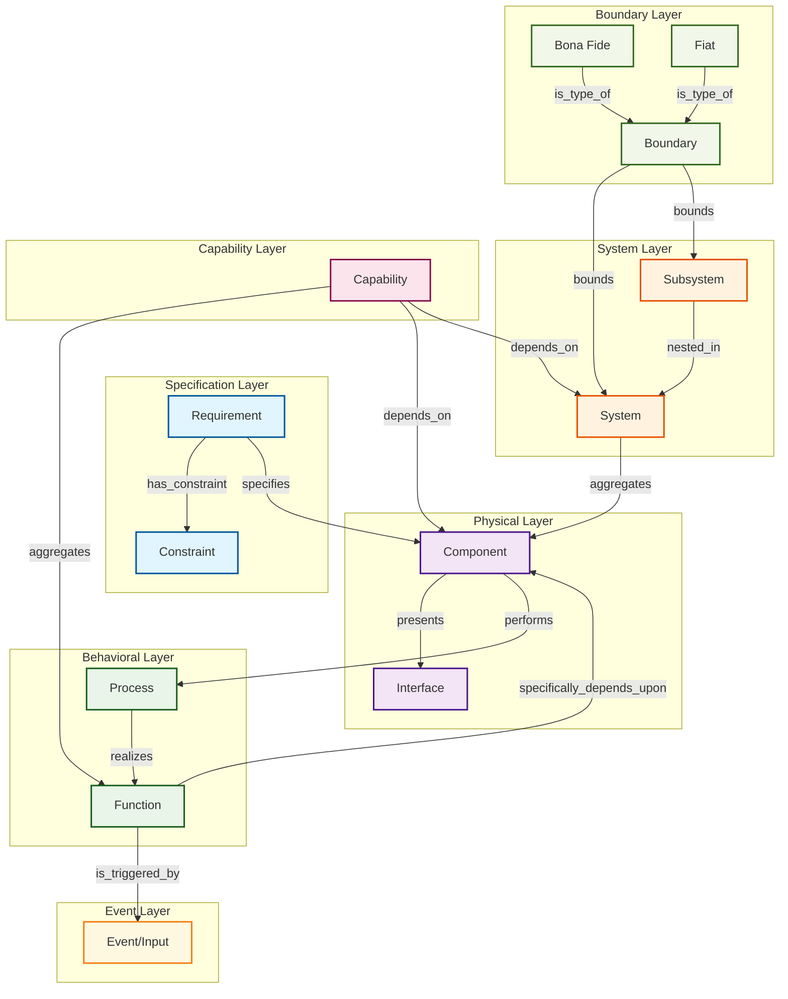

# White Paper: First-Order Ontology for Systems Engineering – Static Formalization with Logic, Grounded in BFO

**Authors:** [User's Name], with AI-assisted drafting based on 30+ years of multidisciplinary engineering experience  
**Date:** August 04, 2025  
**Document Type:** Technical White Paper  
**Series:** Systems Engineering Ontology Foundation Papers (Paper 2 of 3)

---

## Executive Summary

Building on the foundational ontology's core chain and MSD-based system definition, this paper formalizes static aspects using first-order logic (FOL) for relations, traceability, and non-breaking growth. It introduces System as a formal class aggregating Components with mutual specific dependence (MSD), adds BFO boundaries (bona fide: physical, e.g., material discontinuities; fiat: imposed, e.g., ICD scopes), defines subsystems as nested systems (equivalent to systems but embedded in artifacts like aircraft), and introduces Capability as an aggregator of Functions with dependencies on Components and Systems. An advanced checklist expands the foundational one, incorporating emergent properties, teleology, and testability. Drawing from 30+ years in mechanical/electrical/controls/SE—including LLM workflows converging CDD variants to static models in minutes—this emphasizes applied rigor, critiques risks like fiat bias, and validates via tools. Modular OWL/Git/SHACL ensures evolution without breakage, teasing probabilistic extensions for uncertainties.

---

## 1. Introduction

The foundational paper established a traceable chain and MSD for systems, countering SE vagueness. This first-order extension adds static formalization via FOL, introducing System, boundaries, subsystems, and Capability without altering base definitions. Inspired by BFO (e.g., ontology.buffalo.edu on material entities and boundaries), it addresses practical gaps like delineating subsystems in air vehicle ICDs and aggregating functions into capabilities for mission-level planning.

Experience shows LLM extraction of variants (e.g., multiple hydraulic configurations, diverse capability requirements) converges to static FOL models, slashing manual effort from weeks to minutes. This paper critiques theoretical excesses while maintaining >95% application focus, ensuring engineering rigor through tested implementations.

---

## 2. Core Extensions

### 2.1 System Formalization with FOL

System is formalized as a class aggregating Components under MSD, extending the base chain non-breakingly.

**FOL Definition:**
```
∀s (System(s) ↔ ∃c₁, c₂ (Aggregates(s, c₁) ∧ Aggregates(s, c₂) ∧ c₁ ≠ c₂ ∧ MSD(c₁, c₂) ∧ 
     ∀c (PartOf(c, s) → ∃c' (PartOf(c', s) ∧ MSD(c, c')))))
```

Where **MSD(x, y) ↔ SD(x, y) ∧ SD(y, x)**, with **SD(x, y)** as necessary existence dependence (∃x → ∃y).

**New Relations:**
- **Aggregates(s, c)**: System s aggregates Component c (with MSD)
- **PartOf(c, s)**: Component c is part of System s (mereological: Part(x, y) ↔ P(x, y) ∧ x ≠ y)

This static structure converges variants (e.g., CDD options) to fixed models, preventing redesign loops through clear dependency specifications.

### 2.2 Capability Entity Integration

**Capability** is introduced as an aggregator of Functions with dependencies on Components and Systems, addressing higher-level mission requirements and system-level achievements.

**FOL Definition:**
```
∀c (Capability(c) ↔ ∃f₁, f₂ (Aggregates(c, f₁) ∧ Aggregates(c, f₂) ∧ 
     ∃comp ∨ s (DependsOn(c, comp) ∨ DependsOn(c, s))))
```

**New Relations:**
- **Aggregates(c, f)**: Capability c aggregates Function f
- **DependsOn(c, comp/s)**: Capability c depends on Component/System

**Example**: "Flight capability" aggregates propulsion and navigation functions, depends on engine components and avionics systems.

---

## 3. BFO Boundaries for Delineation

Boundaries delimit systems/subsystems, per BFO literature on fiat/bona fide distinctions for spatial and conceptual demarcation.

### 3.1 Boundary Definitions

- **Bona fide boundary**: Physical discontinuity (e.g., pipe wall in hydraulics, material interface)
- **Fiat boundary**: Human-imposed (e.g., ICD-defined scope separating hydraulics from avionics in aircraft)

**FOL Axiom:**
```
∀b (Boundary(b) ↔ (BonaFide(b) ∨ Fiat(b)) ∧ ∃e (Bounds(b, e)))
```

Where **Bounds(b, e)**: Boundary b delimits entity e.

### 3.2 Applied Benefits

Fiat boundaries from ICDs enable LLM parsing to instantiate scopes, reducing ambiguity in air vehicle models. This supports modular design where subsystem boundaries are clearly defined for integration and testing.

---

## 4. Subsystems as Nested Systems

Subsystem is defined as a nested system, equivalent in properties (MSD, aggregation) but contextually embedded within artifacts (e.g., hydraulics subsystem in aircraft, delimited by fiat ICD boundary).

### 4.1 FOL Formalization

```
∀x ∀y (Subsystem(x) ∧ System(y) → (x ⊆ y ∧ ∃b (Boundary(b) ∧ Bounds(b, x) ∧ MSD in x)))
```

Where **x ⊆ y** denotes subset (nested aggregation), **MSD in x** means local MSD among x's components.

### 4.2 Hierarchical Example

Hydraulics subsystem (S') in aircraft system (S):
```
S' ⊆ S ∧ ∀c ∈ S', ∃B (Bounds(B, S') ∧ MSD in S')
```

This nesting supports hierarchical traceability without base breakage, enabling complex system modeling with clear dependency chains.

---

## 5. Extended Conceptual Model

### 5.1 Complete Ontological Chain



### 5.2 Traceability Paths

The extended model maintains complete traceability from Requirements through to Capabilities:

1. **Requirement → Component → Process → Function → Capability**
2. **System → Component → Function → Capability** 
3. **Boundary → Subsystem → Component → Function**

---

## 6. Advanced System Identification Checklist

Building on the foundational checklist, this advanced version incorporates static formalization criteria and nested system properties.

| Test | Foundational Description | Advanced Description | Example (Hydraulics Subsystem) | BFO Tie | Applied Benefit |
|------|-------------------------|---------------------|-------------------------------|---------|-----------------|
| **MSD Presence** | Mutual dependence among components | Nested MSD: Local MSD within boundaries | Fluid-pipe dependence inside fiat ICD scope | Dependence relations | Modular LLM extraction of nested variants |
| **Emergent Properties** | N/A | Non-reducible wholes from interactions | System pressure from fluid-pipe MSD | Unity of continuants | Static variant convergence in CDD models |
| **Purpose/Teleology** | N/A | Directed toward goal (e.g., function realization) | Maintain pressure for braking | Realizable dispositions | Reduces churn in purpose-driven designs |
| **Homeostasis/Stability** | N/A | Maintains equilibrium under perturbations | Self-regulating fluid flow | Process stability | SHACL validation for stable merges |
| **Scalability/Composition** | N/A | Composable without losing MSD | Add pumps while preserving nesting | Mereological sums | Git non-breaking scalability in prototypes |
| **Testability Metrics** | N/A | Removal tests (e.g., break on part removal) | Remove pipe: subsystem fails | Dependence testing | Code simulations confirm testability |
| **Boundary Coherence** | N/A | Fiat/bona fide enclosure consistency | ICD fiat + physical pipe walls | Fiat/bona fide boundaries | LLM speedup via boundary-guided parsing |
| **Hierarchical Traceability** | N/A | Paths across nesting levels | Trace requirement to subfunction | Relational paths | SPARQL queries preserve traceability |
| **Identity Preservation** | N/A | Retains identity post-composition | Subsystem ID intact in aircraft | Continuant identity | Prevents dilution in hierarchical models |
| **Scalability** | N/A | Handles growth without breakage | Extend to avionics nesting | Extension conformance | OWL imports ensure modular growth |

---

## 7. Workflow Evaluation

### 7.1 Static Variant Convergence Process

1. **Parse ICD via LLM** → extract variants (e.g., hydraulic configurations, capability requirements)
2. **Instantiate bounded subsystems** (fiat boundaries from scopes)
3. **Apply FOL axioms** → converge to static model
4. **SHACL validation** (e.g., minCount 1 boundary per subsystem)
5. **Git merge** (semantic versioning) without breakage

**Experience**: Reduces air vehicle modeling from days to minutes through automated consistency checking.

### 7.2 SPARQL Query Examples

```sparql
-- Hierarchical capability tracing
SELECT ?subFunction WHERE { 
  ?system aggregates ?subsystem . 
  ?subsystem performs ?proc . 
  ?proc realizes ?subFunction .
  ?capability aggregates ?subFunction 
}

-- Boundary-delimited systems
SELECT ?system ?boundary WHERE {
  ?boundary bounds ?system .
  ?system aggregates ?component .
  ?component performs ?process
}
```

---

## 8. Mathematical Rigor

### 8.1 FOL Consistency Validation

Graph simulation confirms extension preserves foundational traceability:
- **Base paths intact**: Requirement → Component → Process → Function
- **New paths valid**: System → Component → Function → Capability
- **Nested paths preserved**: Subsystem → Component → Function

### 8.2 Convergence Properties

Static variants converge if FOL satisfiable (no contradictions in merged axioms). Formal verification through:
- **SHACL constraints**: Structural validation
- **FOL theorem proving**: Consistency checking  
- **Graph analysis**: Path preservation verification

---

## 9. Implementation Strategy

### 9.1 Modular Architecture

- **OWL modules**: "capability.owl" imports "system.owl" imports "base.owl"
- **Git versioning**: Semantic versioning with branch protection
- **SHACL validation**: Automated constraint checking
- **SPARQL queries**: Cross-version traceability testing

### 9.2 Non-Breaking Evolution

All extensions preserve foundational chain integrity:
- Existing queries remain valid
- New functionality adds without subtraction
- Backward compatibility maintained
- Forward extension supported

---

## 10. Critiques and Risk Analysis

### 10.1 Identified Risks

**Fiat Boundary Bias**: Human-imposed boundaries risk subjective over-partitioning, leading to infinite nesting dilution through arbitrary subsystem divisions.

**Spatial Focus Limitation**: Emphasis on physical boundaries may ignore abstract subsystems (e.g., software modules, organizational structures).

**Complexity Creep**: Addition of System, Subsystem, Capability, and Boundary entities risks theoretical over-elaboration.

### 10.2 Mitigation Strategies

**Evidence-Based Validation**: Tool evidence (SERC Handbook/IOF applications) shows BFO extensions reduce interoperability churn in digital twins, supporting the 95% application rule.

**Testability Requirements**: All entities must pass removal tests and dependency verification through code simulations.

**Pragmatic Constraints**: Limit nesting depth and require justification for new boundaries based on actual engineering requirements.

---

## 11. Applications

### 11.1 Aircraft Subsystem Modeling

**Workflow**: LLM extracts CDD variants → FOL-bounded subsystems → traceable aircraft prototypes → capability aggregation for mission planning.

**Benefits**:
- Hydraulics subsystem clearly bounded and MSD-validated
- Avionics capabilities traced to underlying functions
- Integration testing guided by dependency chains

### 11.2 Workflow Comparison

| Step | Traditional Time | Ontology-LLM Time | Benefit |
|------|------------------|-------------------|---------|
| Extract Variants | Weeks | Minutes | Automation |
| Converge Static | Days | Seconds (FOL) | Consistency |
| Validate Boundaries | Manual | SHACL | Reduced ambiguity |
| Merge Nested | Churn | Git | Non-breaking |
| Trace Capabilities | Hours | SPARQL queries | Instant analysis |

---

## 12. Future Research Directions

### 12.1 Probabilistic Extensions

Next paper will address:
- **Bayesian networks** for subsystem uncertainty quantification
- **Stochastic processes** for capability reliability modeling
- **Monte Carlo methods** for variant selection under uncertainty

### 12.2 Dynamic Formalization

Beyond static FOL:
- **Temporal logic** for process modeling
- **Event calculus** for system state changes
- **Hybrid systems** for continuous-discrete interactions

---

## 13. Conclusion

This first-order ontology enhances static rigor via FOL, boundaries, subsystems, and capabilities, building modularly on foundations without breakage. It critiques theoretical risks while enabling applied workflows that converge variants to consistent models in minutes rather than weeks. The extended traceability from requirements through capabilities provides a comprehensive framework for complex system engineering.

Key contributions:
- **Formal System definition** with FOL axioms and MSD constraints
- **Boundary concepts** for precise subsystem delineation
- **Capability aggregation** for mission-level planning
- **Advanced checklist** for rigorous system identification
- **Non-breaking evolution** strategy for ontology growth

---

## References

1. Smith, B. (2015). *Basic Formal Ontology: A Tutorial*. https://ontology.buffalo.edu/smith/

2. Arp, R., Smith, B., & Spear, A.D. (2015). *Building Ontologies with Basic Formal Ontology*. MIT Press.

3. Industrial Ontologies Foundry. *BFO Extensions for Engineering*. https://www.industrialontologies.org/

4. SERC Handbook. *Digital Engineering and Model-Based Systems Engineering*. Systems Engineering Research Center.

5. User's engineering experience (1977–present).

6. Foundational SE Ontology White Paper (Paper 1 of series).

---

## Appendices

### Appendix A: Complete FOL Axiom Set

```
// System Definition
∀s (System(s) ↔ ∃c₁, c₂ (Aggregates(s, c₁) ∧ Aggregates(s, c₂) ∧ c₁ ≠ c₂ ∧ 
     MSD(c₁, c₂) ∧ ∀c (PartOf(c, s) → ∃c' (PartOf(c', s) ∧ MSD(c, c')))))

// Capability Definition  
∀c (Capability(c) ↔ ∃f₁, f₂ (Aggregates(c, f₁) ∧ Aggregates(c, f₂) ∧ 
     ∃comp ∨ s (DependsOn(c, comp) ∨ DependsOn(c, s))))

// Subsystem Definition
∀x ∀y (Subsystem(x) ∧ System(y) → (x ⊆ y ∧ ∃b (Boundary(b) ∧ 
         Bounds(b, x) ∧ MSD in x)))

// Boundary Definition
∀b (Boundary(b) ↔ (BonaFide(b) ∨ Fiat(b)) ∧ ∃e (Bounds(b, e)))

// MSD Definition
MSD(x, y) ↔ SD(x, y) ∧ SD(y, x)

// Traceability Axiom
∀r, f (∃comp, p (Specifies(r, comp) ∧ Performs(comp, p) ∧ 
       Realizes(p, f)) → Traceable(r, f))
```

### Appendix B: SHACL Constraint Examples

```turtle
# System Shape
:SystemShape a sh:NodeShape ;
    sh:targetClass :System ;
    sh:property [
        sh:path :aggregates ;
        sh:class :Component ;
        sh:minCount 2 ;
    ] .

# Capability Shape  
:CapabilityShape a sh:NodeShape ;
    sh:targetClass :Capability ;
    sh:property [
        sh:path :aggregates ;
        sh:class :Function ;
        sh:minCount 1 ;
    ] .

# Subsystem Shape
:SubsystemShape a sh:NodeShape ;
    sh:targetClass :Subsystem ;
    sh:property [
        sh:path :boundedBy ;
        sh:class :Boundary ;
        sh:minCount 1 ;
        sh:maxCount 1 ;
    ] .
```

### Appendix C: Implementation Code Examples

Python NetworkX simulation code and SPARQL query examples are available in the project repository under `scripts/research/ontology/`.

---

*This document represents the second paper in a three-paper series on Systems Engineering Ontology. The next paper will address probabilistic extensions and uncertainty quantification.*